# Agent核心架构

<cite>
**本文档引用的文件**
- [agent.py](file://backend/app/ai/agent.py)
- [base.py](file://backend/app/ai/base.py)
- [factory.py](file://backend/app/ai/factory.py)
- [ollama.py](file://backend/app/ai/ollama.py)
- [online.py](file://backend/app/ai/online.py)
- [tool_generator.py](file://backend/app/ai/tool_generator.py)
- [intent_rules.json](file://backend/app/ai/intent_rules.json)
- [main.py](file://backend/app/main.py)
- [config.py](file://backend/app/core/config.py)
- [exceptions.py](file://backend/app/core/exceptions.py)
- [executor.py](file://backend/app/sandbox/executor.py)
- [conversation_service.py](file://backend/app/services/conversation_service.py)
- [memory_service.py](file://backend/app/services/memory_service.py)
- [tool_service.py](file://backend/app/services/tool_service.py)
</cite>

## 目录
1. [简介](#简介)
2. [项目结构](#项目结构)
3. [核心组件](#核心组件)
4. [架构概览](#架构概览)
5. [详细组件分析](#详细组件分析)
6. [依赖分析](#依赖分析)
7. [性能考虑](#性能考虑)
8. [故障排除指南](#故障排除指南)
9. [结论](#结论)

## 简介

XuanJi项目中的Agent核心架构是一个高度模块化的多智能体协作系统，旨在提供智能化的人机交互体验。该架构围绕Agent类构建，实现了完整的对话处理流水线，包括意图识别、工具匹配、工具生成、沙箱执行和结果解读等功能。

该系统采用"多智能体协作"的设计理念，将不同的AI能力分配给专门的角色：对话AI（玄）、工具AI（机）、意图AI（晴）、情绪AI（焕）和格式AI（遥）。每个智能体都有其特定的专业领域和职责分工，通过精心设计的协作机制实现高效的多模态交互。

## 项目结构

基于代码库的组织结构，Agent核心架构主要分布在以下目录中：

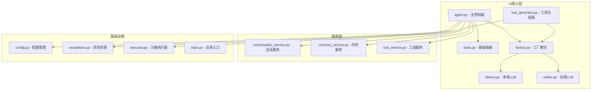

**图表来源**
- [agent.py:1-100](file://backend/app/ai/agent.py#L1-L100)
- [base.py:1-73](file://backend/app/ai/base.py#L1-L73)
- [factory.py:1-154](file://backend/app/ai/factory.py#L1-L154)

**章节来源**
- [agent.py:1-200](file://backend/app/ai/agent.py#L1-L200)
- [main.py:1-79](file://backend/app/main.py#L1-L79)

## 核心组件

### Agent类设计架构

Agent类是整个系统的核心控制器，采用了职责分离和模块化设计原则：

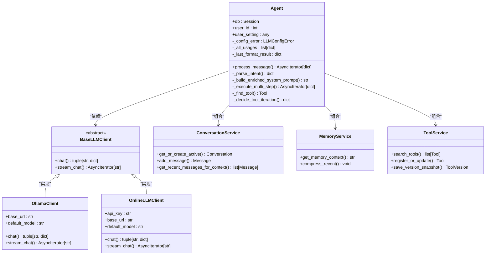

**图表来源**
- [agent.py:35-100](file://backend/app/ai/agent.py#L35-L100)
- [base.py:8-36](file://backend/app/ai/base.py#L8-L36)
- [ollama.py:10-91](file://backend/app/ai/ollama.py#L10-L91)
- [online.py:10-134](file://backend/app/ai/online.py#L10-L134)

### 工厂模式应用

系统采用工厂模式管理不同类型的LLM客户端，提供了统一的接口和灵活的配置机制：

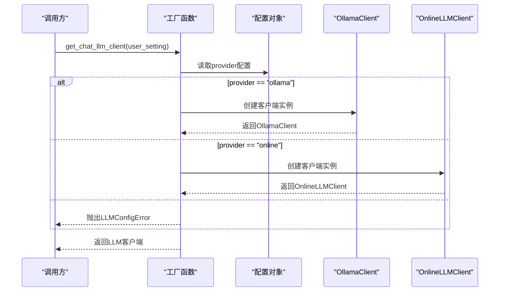

**图表来源**
- [factory.py:54-73](file://backend/app/ai/factory.py#L54-L73)
- [factory.py:14-52](file://backend/app/ai/factory.py#L14-L52)

**章节来源**
- [factory.py:1-154](file://backend/app/ai/factory.py#L1-L154)
- [base.py:1-73](file://backend/app/ai/base.py#L1-L73)

## 架构概览

### 多智能体协作架构

系统实现了五个专业AI角色的协作机制，每个角色都有明确的职责分工：

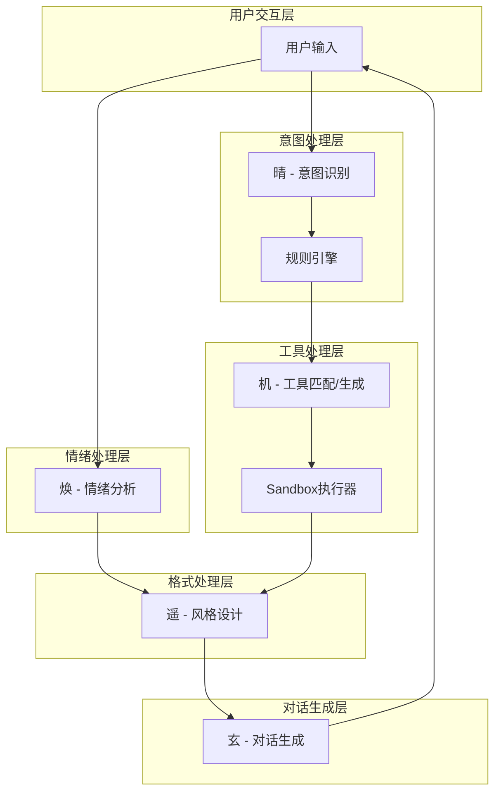

**图表来源**
- [agent.py:118-273](file://backend/app/ai/agent.py#L118-L273)
- [agent.py:1465-1500](file://backend/app/ai/agent.py#L1465-L1500)

### 事件流处理机制

Agent实现了完整的事件流处理机制，支持异步事件推送和状态管理：

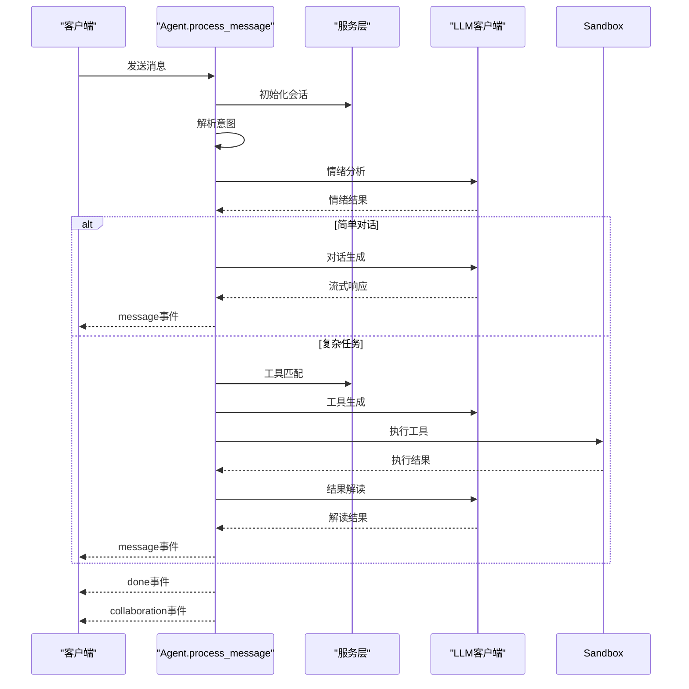

**图表来源**
- [agent.py:78-273](file://backend/app/ai/agent.py#L78-L273)
- [agent.py:676-792](file://backend/app/ai/agent.py#L676-L792)

**章节来源**
- [agent.py:78-792](file://backend/app/ai/agent.py#L78-L792)

## 详细组件分析

### Agent初始化流程

Agent的初始化过程体现了依赖注入和配置管理的最佳实践：

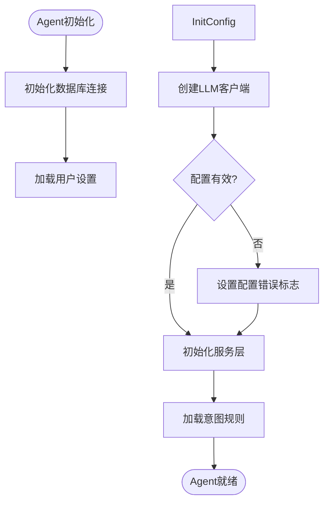

**图表来源**
- [agent.py:44-67](file://backend/app/ai/agent.py#L44-L67)

### 多步编排执行机制

系统实现了复杂的多步任务编排机制，支持动态的角色分配和信息收集：

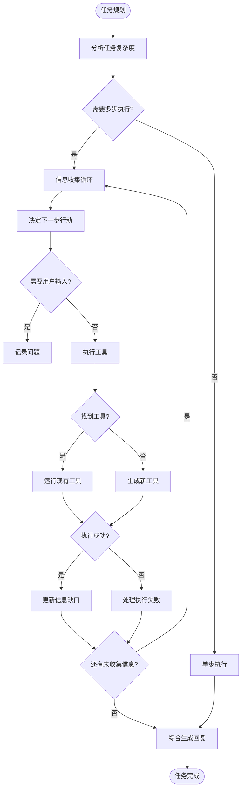

**图表来源**
- [agent.py:1501-1788](file://backend/app/ai/agent.py#L1501-L1788)

### LLM客户端管理策略

系统实现了统一的LLM客户端管理机制，支持多种提供商和配置选项：

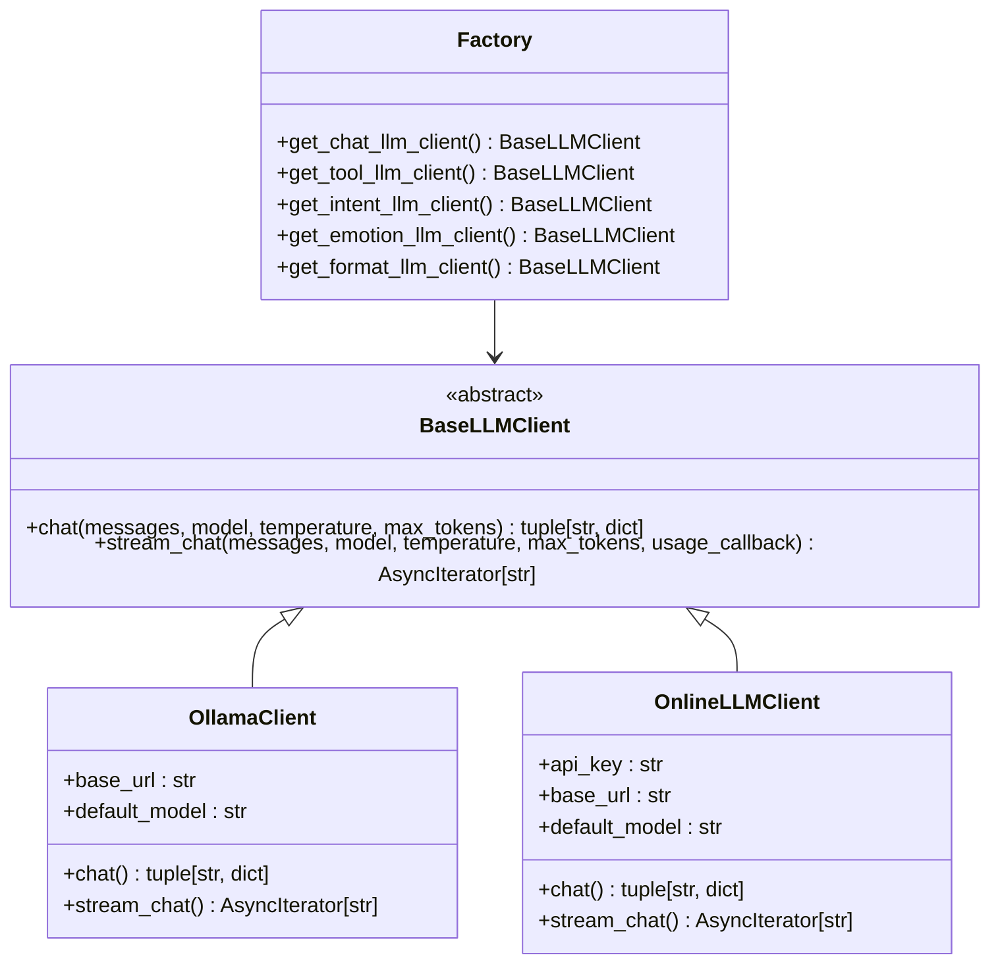

**图表来源**
- [base.py:8-36](file://backend/app/ai/base.py#L8-L36)
- [ollama.py:10-91](file://backend/app/ai/ollama.py#L10-L91)
- [online.py:10-134](file://backend/app/ai/online.py#L10-L134)

**章节来源**
- [agent.py:13-33](file://backend/app/ai/agent.py#L13-L33)
- [factory.py:54-154](file://backend/app/ai/factory.py#L54-L154)

### 内存缓存策略

系统实现了多层次的缓存策略来优化性能和用户体验：

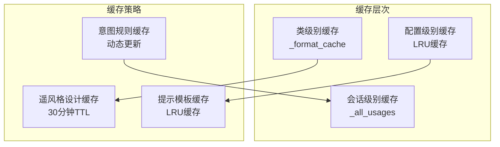

**图表来源**
- [agent.py:42](file://backend/app/ai/agent.py#L42)
- [agent.py:1104-1202](file://backend/app/ai/agent.py#L1104-L1202)
- [base.py:41-54](file://backend/app/ai/base.py#L41-L54)

**章节来源**
- [agent.py:1102-1202](file://backend/app/ai/agent.py#L1102-L1202)
- [base.py:41-73](file://backend/app/ai/base.py#L41-L73)

## 依赖分析

### 组件耦合关系

系统采用了松耦合的设计原则，通过接口抽象和依赖注入实现模块间的解耦：

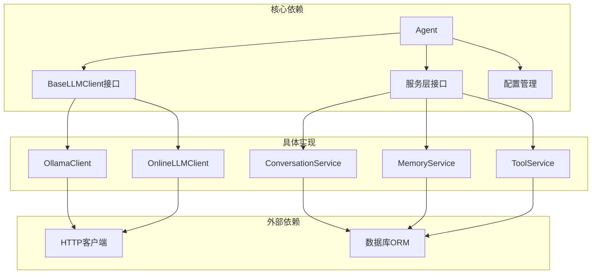

**图表来源**
- [agent.py:13-33](file://backend/app/ai/agent.py#L13-L33)
- [base.py:8-36](file://backend/app/ai/base.py#L8-L36)

### 错误处理策略

系统实现了多层次的错误处理机制，确保系统的稳定性和可靠性：

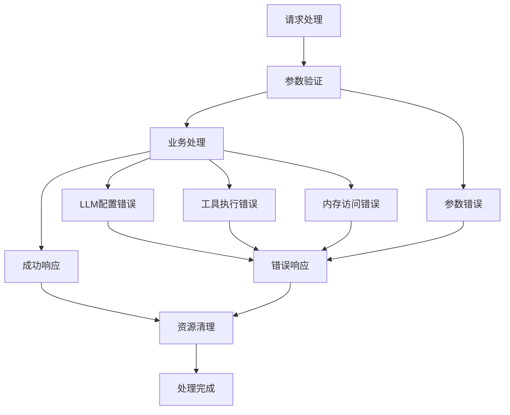

**图表来源**
- [agent.py:676-792](file://backend/app/ai/agent.py#L676-L792)
- [exceptions.py:1-20](file://backend/app/core/exceptions.py#L1-L20)

**章节来源**
- [agent.py:676-792](file://backend/app/ai/agent.py#L676-L792)
- [exceptions.py:1-20](file://backend/app/core/exceptions.py#L1-L20)

## 性能考虑

### 异步任务管理

系统大量采用异步编程模式来提升并发处理能力和响应性能：

- **事件驱动架构**：使用AsyncIterator实现流式事件推送
- **并发执行**：情绪分析、工具执行等任务并行处理
- **超时控制**：为关键操作设置合理的超时时间
- **资源管理**：自动清理临时资源和数据库连接

### 缓存优化策略

- **多级缓存**：类级别、会话级别和配置级别的缓存结合
- **智能失效**：基于TTL的时间戳和动态更新机制
- **内存管理**：LRU缓存避免内存无限增长
- **预热机制**：关键数据的预加载和预计算

### 数据流优化

- **增量更新**：只更新必要的数据字段
- **批量操作**：数据库操作的批量化处理
- **延迟加载**：按需加载和计算昂贵的数据
- **压缩存储**：对话历史的压缩和归档

## 故障排除指南

### 常见问题诊断

1. **LLM配置错误**
   - 检查环境变量配置
   - 验证API密钥和基础URL
   - 确认模型名称正确性

2. **工具执行失败**
   - 查看沙箱执行日志
   - 检查工具代码语法
   - 验证参数传递正确性

3. **内存访问异常**
   - 确认数据库连接正常
   - 检查权限配置
   - 验证数据完整性

### 调试技巧

- **事件追踪**：利用协作日志追踪多智能体交互
- **性能监控**：监控Token使用量和响应时间
- **错误日志**：详细的异常堆栈信息
- **状态检查**：定期检查各服务的健康状态

**章节来源**
- [agent.py:676-792](file://backend/app/ai/agent.py#L676-L792)
- [config.py:1-68](file://backend/app/core/config.py#L1-L68)

## 结论

XuanJi项目的Agent核心架构展现了现代AI系统设计的最佳实践，通过模块化、可扩展和高可用性的架构设计，实现了复杂的多智能体协作机制。该架构不仅具备强大的功能特性，还具有良好的可维护性和扩展性。

系统的主要优势包括：

1. **清晰的职责分离**：每个智能体专注于特定领域，提高了系统的专业化程度
2. **灵活的配置管理**：支持多种LLM提供商和配置选项
3. **高效的事件处理**：异步事件流和流式响应提升了用户体验
4. **完善的错误处理**：多层次的错误处理和恢复机制确保系统稳定性
5. **智能的缓存策略**：多级缓存优化了系统性能

该架构为构建复杂的AI应用提供了优秀的参考模型，特别是在多智能体协作、异步处理和微服务架构方面具有重要的借鉴价值。