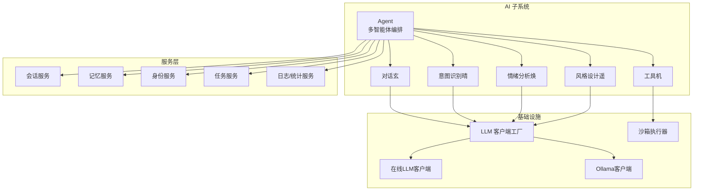
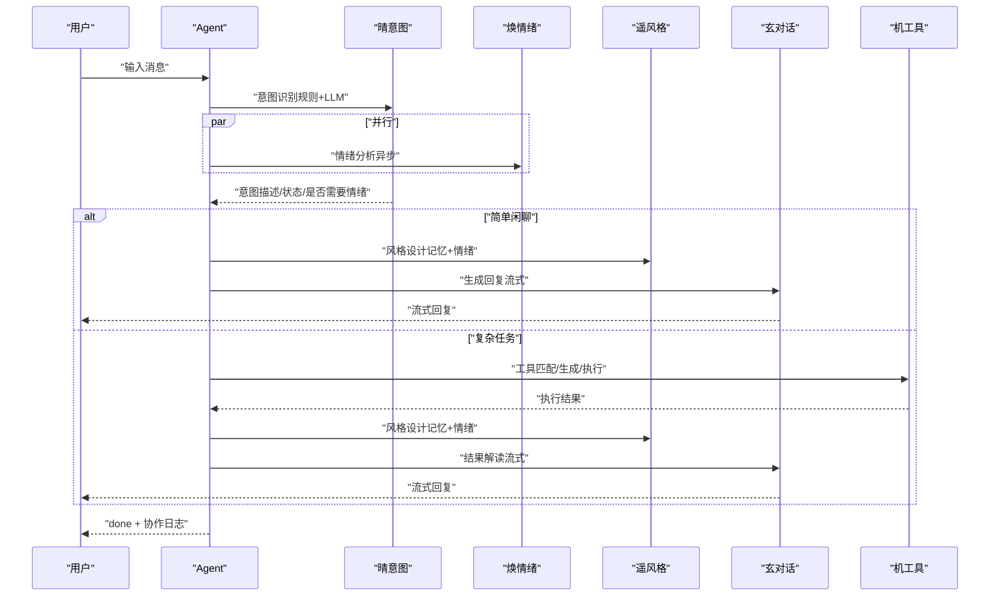
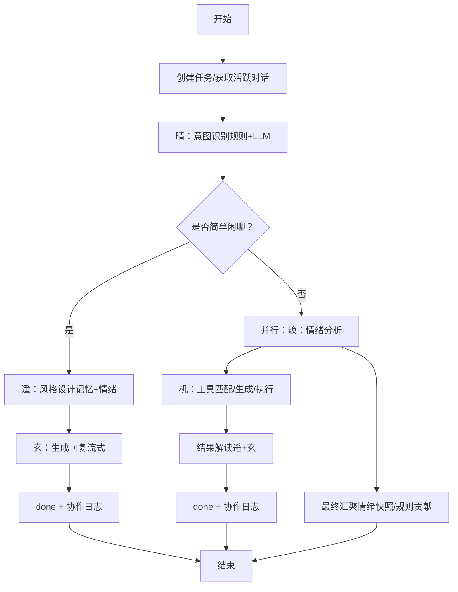
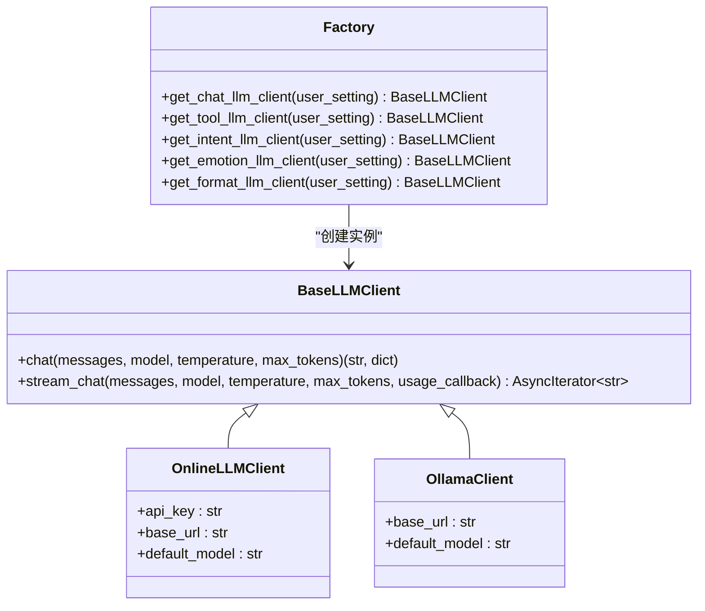
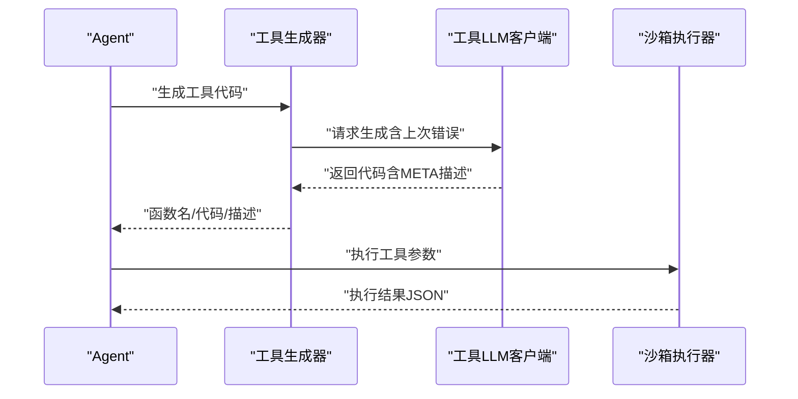
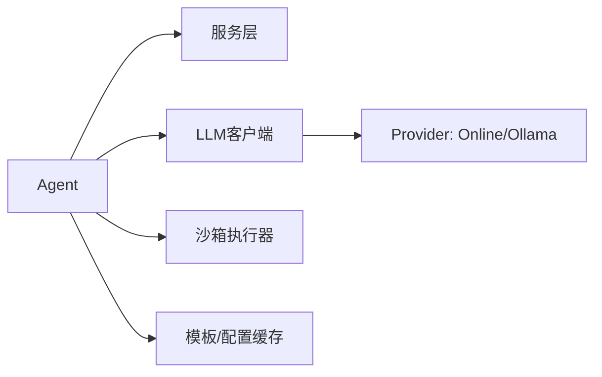
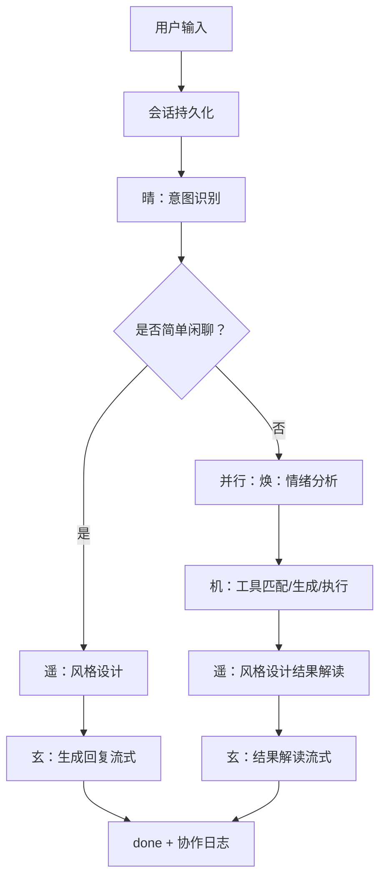

# 多智能体协作机制

<cite>
**本文引用的文件**
- [agent.py](file://backend/app/ai/agent.py)
- [base.py](file://backend/app/ai/base.py)
- [factory.py](file://backend/app/ai/factory.py)
- [online.py](file://backend/app/ai/online.py)
- [ollama.py](file://backend/app/ai/ollama.py)
- [tool_generator.py](file://backend/app/ai/tool_generator.py)
- [executor.py](file://backend/app/sandbox/executor.py)
- [task.py](file://backend/app/schemas/task.py)
- [conversation_service.py](file://backend/app/services/conversation_service.py)
- [intent_rules.json](file://backend/app/ai/intent_rules.json)
- [persona.md（晴）](file://backend/app/ai/skills/xuanji-qing/persona.md)
- [persona.md（焕）](file://backend/app/ai/skills/xuanji-huan/persona.md)
- [persona.md（遥）](file://backend/app/ai/skills/xuanji-yao/persona.md)
- [persona.md（玄）](file://backend/app/ai/skills/xuanji-xuan/persona.md)
- [persona.md（机）](file://backend/app/ai/skills/xuanji-ji/persona.md)
</cite>

## 目录
1. [引言](#引言)
2. [项目结构](#项目结构)
3. [核心组件](#核心组件)
4. [架构总览](#架构总览)
5. [详细组件分析](#详细组件分析)
6. [依赖分析](#依赖分析)
7. [性能考虑](#性能考虑)
8. [故障排查指南](#故障排查指南)
9. [结论](#结论)
10. [附录](#附录)

## 引言
本文件面向分布式系统架构师与AI系统开发者，系统化阐述“璇玑”多智能体协作机制的设计与实现。围绕智能体间通信协议、协作流程、上下文传递、任务分配与结果整合、冲突解决、异步协作与并发控制、资源调度优化、性能监控与可观测性，提供端到端的技术文档与最佳实践。

## 项目结构
后端采用分层+按功能域组织的结构：AI子系统（意图、情绪、风格、对话、工具生成与执行）、服务层（会话、记忆、身份、任务等）、模型与Schema、API接口层。多智能体协作的核心逻辑集中在Agent类中，通过统一的LLM客户端抽象与工厂方法实现不同Provider的接入。

图表来源
- [agent.py:1-800](file://backend/app/ai/agent.py#L1-L800)
- [factory.py:1-154](file://backend/app/ai/factory.py#L1-L154)
- [online.py:1-134](file://backend/app/ai/online.py#L1-L134)
- [ollama.py:1-91](file://backend/app/ai/ollama.py#L1-L91)
- [executor.py:1-101](file://backend/app/sandbox/executor.py#L1-L101)
- [conversation_service.py:1-141](file://backend/app/services/conversation_service.py#L1-L141)

章节来源
- [agent.py:1-800](file://backend/app/ai/agent.py#L1-L800)
- [factory.py:1-154](file://backend/app/ai/factory.py#L1-L154)

## 核心组件
- 统一LLM客户端接口与实现
  - 接口定义：BaseLLMClient，统一chat与stream_chat能力，支持usage回调。
  - 实现：OnlineLLMClient（在线OpenAI兼容接口）、OllamaClient（本地推理）。
  - 工厂：get_chat_llm_client、get_intent_llm_client、get_emotion_llm_client、get_format_llm_client、get_tool_llm_client，按用户设置动态创建。
- Agent编排器
  - 协作日志：记录各智能体的决策与动作，便于审计与可视化。
  - 异步协作：情绪分析（焕）与对话/工具路径并行，最终在生成回复前汇聚。
  - 上下文注入：会话历史、记忆上下文、最近情绪、身份与技能提示。
  - 任务生命周期：创建任务、工具匹配/生成、执行、结果解读、状态更新。
- 沙箱执行器
  - 将工具代码隔离执行，限制环境变量与工作目录，超时保护，输出解析。
- 服务层
  - 会话服务：维护对话与消息，提供上下文注入。
  - 记忆服务：检索与压缩近期记忆，降低上下文成本。
  - 身份服务：按轮次触发身份迭代，提升个性化与一致性。
  - 任务服务：任务状态与结果持久化。
  - 日志/统计服务：记录协作过程与Token用量。

章节来源
- [base.py:1-73](file://backend/app/ai/base.py#L1-L73)
- [online.py:1-134](file://backend/app/ai/online.py#L1-L134)
- [ollama.py:1-91](file://backend/app/ai/ollama.py#L1-L91)
- [factory.py:1-154](file://backend/app/ai/factory.py#L1-L154)
- [agent.py:1-800](file://backend/app/ai/agent.py#L1-L800)
- [executor.py:1-101](file://backend/app/sandbox/executor.py#L1-L101)
- [conversation_service.py:1-141](file://backend/app/services/conversation_service.py#L1-L141)

## 架构总览
多智能体协作遵循“分层分工、流水线并行”的设计原则：
- 晴（意图识别）：快速规则匹配与LLM辅助，输出意图描述、是否需要情绪、用户状态等。
- 焕（情绪分析）：与对话路径并行，产出情绪快照与风险等级，供后续风格与回复调整。
- 遥（风格设计）：基于记忆与情绪，生成风格化系统提示，保证回复的“恰到好处”。
- 玄（对话/回复）：在完整上下文中生成自然语言回复，支持流式输出与超时控制。
- 机（工具）：工具检索、生成、执行、迭代与自动保存，失败时触发迭代策略。

图表来源
- [agent.py:1-800](file://backend/app/ai/agent.py#L1-L800)

## 详细组件分析

### 组件A：Agent编排器（多智能体协作核心）
- 协作流程
  - 会话持久化：获取或创建活跃对话，记录用户消息元数据。
  - 晴：意图识别与快速规则匹配，输出用户状态与是否需要情绪。
  - 焕：异步情绪分析，超时与异常处理，产出情绪快照与规则贡献。
  - 遥：风格设计，结合记忆与情绪生成系统提示。
  - 玄：在完整上下文中生成回复，支持流式输出与超时控制。
  - 机：工具检索/生成/执行，失败时迭代修复并自动保存。
  - 结果整合：将协作日志与Token用量在done事件后补充上报。
- 上下文传递
  - 会话历史：最近N条消息注入到系统提示与解读提示。
  - 记忆上下文：近期对话摘要与关键信息，降低上下文长度。
  - 情绪快照：主情绪、强度、深层需求、风险等级。
  - 身份与技能：各智能体的人设与行为规范注入到系统提示。
- 任务分配与结果整合
  - 任务创建：标题与描述来自意图解析，失败/成功状态映射。
  - 工具路径：优先匹配，否则生成，再执行，最后解读。
  - 结果解读：使用“结果解读”模板与风格化系统提示，保障可理解性。
- 冲突解决与容错
  - 情绪分析超时与异常：记录日志并降级，不影响主流程。
  - LLM流式超时：设置总时长与分片超时，必要时降级回复。
  - 工具执行失败：触发迭代决策，自动保存新版本，重试执行。
- 异步协作与并发控制
  - 使用asyncio.create_task并行启动情绪分析。
  - 使用asyncio.wait_for控制超时，避免阻塞主流程。
  - 使用asyncio.gather并发触发身份迭代，return_exceptions=True保证稳定性。
- 资源调度优化
  - 缓存：统一LLM模板与JSON配置的LRU缓存。
  - 记忆压缩：后台fire-and-forget触发，降低上下文成本。
  - Token用量：usage_callback聚合，done后补录，避免阻塞用户交互。

图表来源
- [agent.py:1-800](file://backend/app/ai/agent.py#L1-L800)

章节来源
- [agent.py:1-800](file://backend/app/ai/agent.py#L1-L800)

### 组件B：LLM客户端与工厂
- 统一接口
  - chat：一次性返回完整内容与用量。
  - stream_chat：流式输出，支持usage回调。
- 在线客户端
  - 支持OpenAI兼容的/chat/completions接口，过滤<think>片段，透传usage。
- Ollama客户端
  - 本地推理，支持流式与非流式，聚合prompt_eval_count与eval_count为usage。
- 工厂方法
  - 按用户设置动态创建不同Provider的客户端，集中校验参数，抛出统一错误类型。

图表来源
- [base.py:1-73](file://backend/app/ai/base.py#L1-L73)
- [online.py:1-134](file://backend/app/ai/online.py#L1-L134)
- [ollama.py:1-91](file://backend/app/ai/ollama.py#L1-L91)
- [factory.py:1-154](file://backend/app/ai/factory.py#L1-L154)

章节来源
- [base.py:1-73](file://backend/app/ai/base.py#L1-L73)
- [online.py:1-134](file://backend/app/ai/online.py#L1-L134)
- [ollama.py:1-91](file://backend/app/ai/ollama.py#L1-L91)
- [factory.py:1-154](file://backend/app/ai/factory.py#L1-L154)

### 组件C：工具生成与执行
- 工具生成
  - 使用“工具生成”模板与LLM生成Python代码，清理Markdown围栏，抽取META注释中的描述，AST解析函数名，验证通过后返回。
  - 失败时可携带上次错误原因进行重试。
- 工具执行
  - 解析函数名，构造runner脚本，写入临时文件，在隔离环境中执行，捕获超时、JSON解析错误等异常。
  - 输出最后一行JSON作为结果，失败时返回错误信息。

图表来源
- [tool_generator.py:1-129](file://backend/app/ai/tool_generator.py#L1-L129)
- [executor.py:1-101](file://backend/app/sandbox/executor.py#L1-L101)

章节来源
- [tool_generator.py:1-129](file://backend/app/ai/tool_generator.py#L1-L129)
- [executor.py:1-101](file://backend/app/sandbox/executor.py#L1-L101)

### 组件D：意图识别与规则引擎
- 规则集
  - 关键词集合：查询、闲聊、情绪相关关键词。
  - 已学习模式：针对特定用户话语的结构化意图，包含描述、用户状态、目标路径、参数、是否需要情绪。
  - 用户习惯：安全话题列表，指导回复策略。
- 作用
  - 快速分流：简单闲聊走轻量路径，复杂任务进入多步规划与工具链。
  - 参数注入：目标路径与参数直接注入任务与工具执行。

章节来源
- [intent_rules.json:1-306](file://backend/app/ai/intent_rules.json#L1-L306)
- [agent.py:1-800](file://backend/app/ai/agent.py#L1-L800)

### 组件E：服务层与数据模型
- 会话服务
  - 提供活跃对话获取/创建、消息增删改查、最近消息检索、汇总标记等。
- 任务模型
  - 状态枚举：PENDING、COMPLETED、FAILED。
  - 创建/更新/响应模型，支撑任务生命周期管理。
- 其他服务
  - 记忆服务：检索与压缩近期记忆。
  - 身份服务：按轮次触发身份迭代。
  - 日志/统计服务：记录协作过程与Token用量。

章节来源
- [conversation_service.py:1-141](file://backend/app/services/conversation_service.py#L1-L141)
- [task.py:1-43](file://backend/app/schemas/task.py#L1-L43)
- [agent.py:1-800](file://backend/app/ai/agent.py#L1-L800)

## 依赖分析
- 组件耦合
  - Agent对服务层与LLM客户端存在强依赖，但通过工厂与接口抽象降低耦合。
  - 工具生成与执行通过沙箱隔离，避免对Agent主流程的直接影响。
- 外部依赖
  - 在线LLM与Ollama均通过HTTP客户端访问，具备超时与错误处理。
- 循环依赖
  - 未发现循环导入；服务层与AI层边界清晰。

图表来源
- [agent.py:1-800](file://backend/app/ai/agent.py#L1-L800)
- [factory.py:1-154](file://backend/app/ai/factory.py#L1-L154)
- [online.py:1-134](file://backend/app/ai/online.py#L1-L134)
- [ollama.py:1-91](file://backend/app/ai/ollama.py#L1-L91)
- [executor.py:1-101](file://backend/app/sandbox/executor.py#L1-L101)
- [base.py:1-73](file://backend/app/ai/base.py#L1-L73)

章节来源
- [agent.py:1-800](file://backend/app/ai/agent.py#L1-L800)
- [factory.py:1-154](file://backend/app/ai/factory.py#L1-L154)

## 性能考虑
- 流式输出与超时
  - 对话与结果解读均采用流式，设置总超时与分片超时，避免长时间阻塞。
- 并发与异步
  - 情绪分析与身份迭代并发执行，gather + return_exceptions提升鲁棒性。
- 缓存与预热
  - Prompt与JSON配置LRU缓存，减少IO开销。
- 记忆与上下文
  - 记忆压缩与最近消息截断，降低上下文长度与Token消耗。
- 资源隔离
  - 沙箱执行器隔离环境变量与工作目录，防止资源泄漏与权限问题。
- 监控与可观测性
  - usage_callback聚合用量，done后补录，便于计费与成本分析。

章节来源
- [agent.py:1-800](file://backend/app/ai/agent.py#L1-L800)
- [base.py:1-73](file://backend/app/ai/base.py#L1-L73)
- [executor.py:1-101](file://backend/app/sandbox/executor.py#L1-L101)

## 故障排查指南
- LLM配置错误
  - 现象：初始化客户端时报错。
  - 排查：检查用户设置中的provider与必需字段（API Key、Base URL、Model Name）。
- 在线LLM流式<think>标签
  - 现象：回复中残留<think>片段。
  - 排查：确认客户端正确过滤<think>片段。
- Ollama用量缺失
  - 现象：usage中缺少model字段。
  - 排查：确认usage回调中补全model字段。
- 情绪分析超时/失败
  - 现象：协作日志显示超时或失败。
  - 排查：查看日志级别warn/error，确认超时阈值与网络连通性。
- 工具执行失败
  - 现象：工具返回失败或超时。
  - 排查：检查沙箱超时、临时文件写入、输出JSON格式；必要时触发迭代并保存新版本。
- 任务状态异常
  - 现象：任务状态与预期不符。
  - 排查：核对任务创建与状态更新逻辑，检查结果预览长度限制。

章节来源
- [factory.py:1-154](file://backend/app/ai/factory.py#L1-L154)
- [online.py:1-134](file://backend/app/ai/online.py#L1-L134)
- [ollama.py:1-91](file://backend/app/ai/ollama.py#L1-L91)
- [agent.py:1-800](file://backend/app/ai/agent.py#L1-L800)
- [executor.py:1-101](file://backend/app/sandbox/executor.py#L1-L101)

## 结论
本系统通过“意图—情绪—风格—对话—工具”的流水线协作，实现了高可用、可扩展、可观测的多智能体协同。统一的LLM客户端抽象与工厂方法、严格的上下文注入与缓存策略、异步并发与资源隔离，共同构成了稳健的工程基础。建议在生产环境中进一步完善：
- 任务编排的可视化与可观测性面板；
- 情绪与风格的A/B测试与效果评估；
- 工具生成的代码质量评分与安全扫描；
- 身份迭代的用户反馈闭环。

## 附录

### A. 协作流程图（端到端）

图表来源
- [agent.py:1-800](file://backend/app/ai/agent.py#L1-L800)

### B. 通信协议规范（事件与元数据）
- 事件类型
  - metadata：包含当前对话ID，前端据此绑定UI。
  - thinking：阶段提示（意图识别、搜索工具、解读结果等）。
  - tool_selected/tool_generating/tool_executing/tool_result/tool_iterated：工具链各阶段事件。
  - message：流式回复片段。
  - emotion_update：情绪分析结果（主情绪、强度、深层需求、风险等级）。
  - done：主流程结束，携带对话ID与Token用量。
  - collaboration：协作日志（按角色与动作记录）。
- 元数据
  - 会话消息包含metadata_json，承载类型与协作日志。
  - 任务包含状态与结果预览，便于前端展示与审计。

章节来源
- [agent.py:1-800](file://backend/app/ai/agent.py#L1-L800)

### C. 性能监控指标建议
- LLM侧
  - 请求时延（p50/p95/p99）、错误率、Token用量（prompt/completion/total）。
- 服务侧
  - 会话消息数、记忆压缩频率、身份迭代成功率。
- 工具侧
  - 工具生成/执行成功率、平均执行时延、超时比例。
- 协作侧
  - 情绪分析超时率、协作日志完整性、回复首字节时延。

### D. 协作配置示例（用户设置）
- Provider选择
  - llm_provider：online 或 ollama。
  - tool_llm_provider、intent_llm_provider、emotion_llm_provider、format_llm_provider：同上。
- 在线Provider参数
  - llm_api_key、llm_api_base_url、llm_model_name。
  - tool_llm_api_key、tool_llm_api_base_url、tool_llm_model_name。
  - intent_llm_api_key、intent_llm_api_base_url、intent_llm_model_name。
  - emotion_llm_api_key、emotion_llm_api_base_url、emotion_llm_model_name。
  - format_llm_api_key、format_llm_api_base_url、format_llm_model_name。
- 本地Provider参数
  - ollama_base_url、ollama_model。
  - tool_ollama_base_url、tool_ollama_model。
  - intent_ollama_base_url、intent_ollama_model。
  - emotion_ollama_base_url、emotion_ollama_model。
  - format_ollama_base_url、format_ollama_model。

章节来源
- [factory.py:1-154](file://backend/app/ai/factory.py#L1-L154)

### E. 扩展开发指南
- 新增智能体
  - 定义角色人设与行为规范（persona.md）。
  - 在Agent中添加对应步骤与协作日志记录。
  - 通过工厂方法注册新的LLM客户端。
- 新增工具
  - 遵循工具代码规范（META注释、返回JSON、幂等性）。
  - 使用沙箱执行器进行测试与部署。
- 优化路径
  - 引入缓存与预热策略，减少重复计算。
  - 增加A/B测试框架，评估不同策略的效果。
  - 加强安全扫描与合规检查，保障工具与回复质量。

章节来源
- [agent.py:1-800](file://backend/app/ai/agent.py#L1-L800)
- [persona.md（晴）:1-26](file://backend/app/ai/skills/xuanji-qing/persona.md#L1-L26)
- [persona.md（焕）:1-26](file://backend/app/ai/skills/xuanji-huan/persona.md#L1-L26)
- [persona.md（遥）:1-26](file://backend/app/ai/skills/xuanji-yao/persona.md#L1-L26)
- [persona.md（玄）:1-26](file://backend/app/ai/skills/xuanji-xuan/persona.md#L1-L26)
- [persona.md（机）:1-26](file://backend/app/ai/skills/xuanji-ji/persona.md#L1-L26)