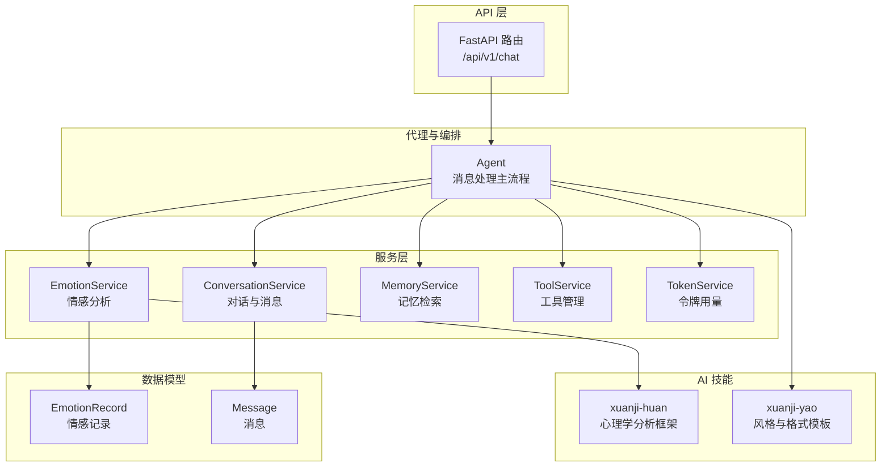
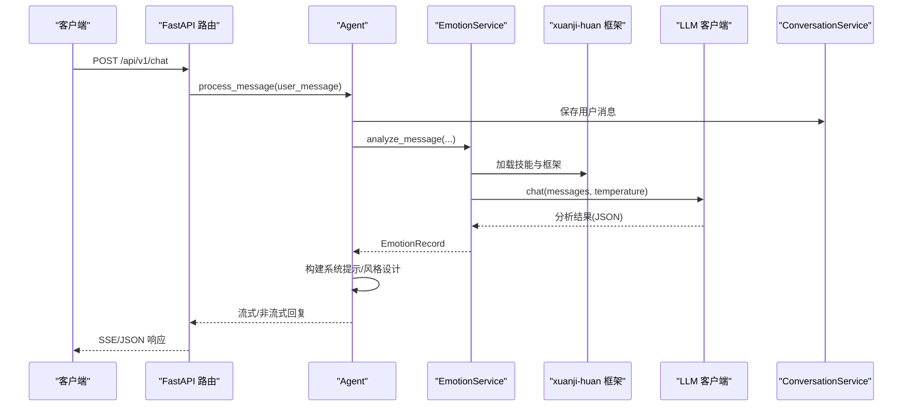
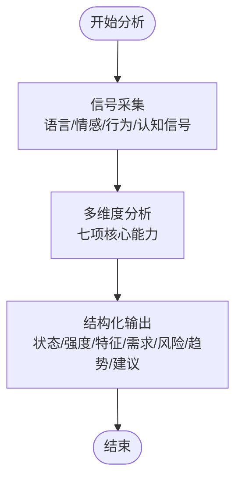
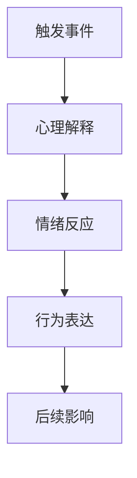
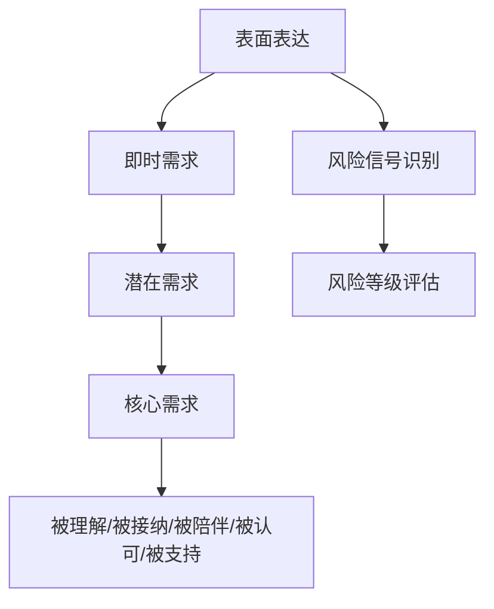
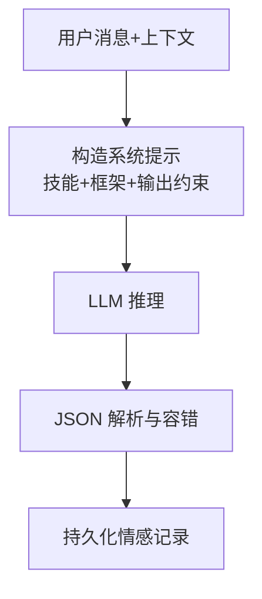
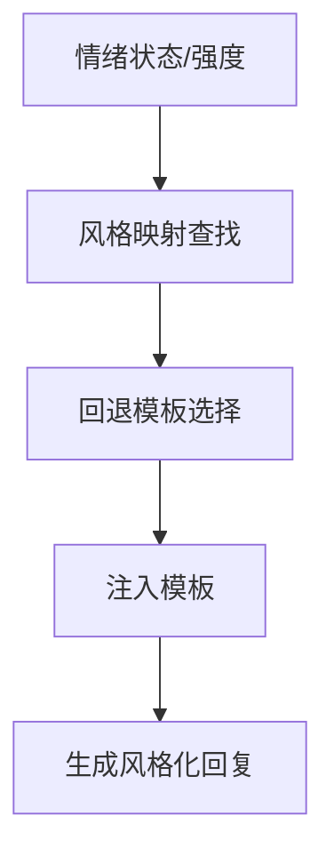
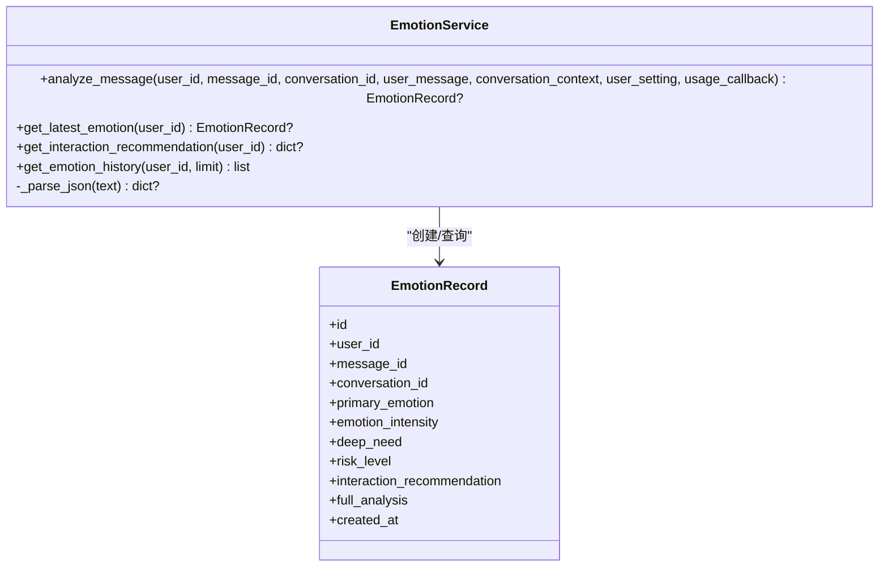
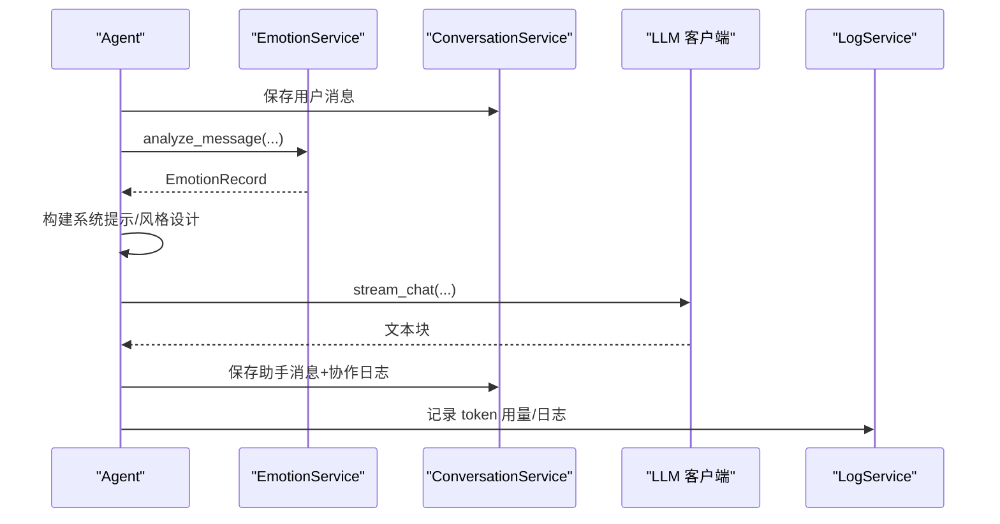
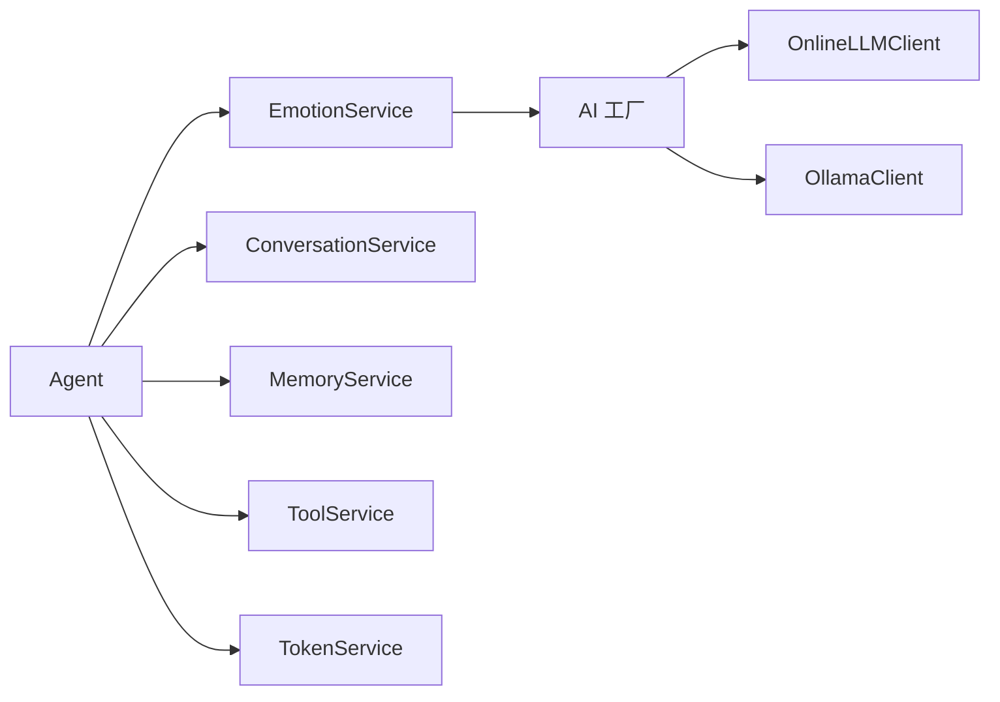

# 焕-情感分析系统

<cite>
**本文档引用的文件**
- [backend/app/models/emotion.py](file://backend/app/models/emotion.py)
- [backend/app/schemas/emotion.py](file://backend/app/schemas/emotion.py)
- [backend/app/services/emotion_service.py](file://backend/app/services/emotion_service.py)
- [backend/app/ai/skills/xuanji-huan/SKILL.md](file://backend/app/ai/skills/xuanji-huan/SKILL.md)
- [backend/app/ai/skills/xuanji-huan/analysis-framework.md](file://backend/app/ai/skills/xuanji-huan/analysis-framework.md)
- [backend/app/ai/skills/xuanji-huan/examples.md](file://backend/app/ai/skills/xuanji-huan/examples.md)
- [backend/app/ai/skills/xuanji-huan/persona.md](file://backend/app/ai/skills/xuanji-huan/persona.md)
- [backend/app/ai/skills/xuanji-yao/emotion-format.md](file://backend/app/ai/skills/xuanji-yao/emotion-format.md)
- [backend/app/ai/skills/xuanji-yao/emotion-style-map.json](file://backend/app/ai/skills/xuanji-yao/emotion-style-map.json)
- [backend/app/ai/skills/xuanji-yao/fallback-templates.json](file://backend/app/ai/skills/xuanji-yao/fallback-templates.json)
- [backend/app/ai/factory.py](file://backend/app/ai/factory.py)
- [backend/app/ai/base.py](file://backend/app/ai/base.py)
- [backend/app/api/v1/chat.py](file://backend/app/api/v1/chat.py)
- [backend/app/ai/agent.py](file://backend/app/ai/agent.py)
- [backend/app/models/conversation.py](file://backend/app/models/conversation.py)
- [backend/app/schemas/conversation.py](file://backend/app/schemas/conversation.py)
- [backend/app/services/token_service.py](file://backend/app/services/token_service.py)
</cite>

## 目录
1. [简介](#简介)
2. [项目结构](#项目结构)
3. [核心组件](#核心组件)
4. [架构总览](#架构总览)
5. [详细组件分析](#详细组件分析)
6. [依赖关系分析](#依赖关系分析)
7. [性能考量](#性能考量)
8. [故障排查指南](#故障排查指南)
9. [结论](#结论)
10. [附录](#附录)

## 简介
本系统围绕“心理学驱动”的情感分析框架，构建了多维度情感建模与强度量化机制，实现对用户情绪状态的识别、深层需求挖掘、风险等级评估与趋势预测，并通过“焕”（情绪分析子系统）将分析结果注入到对话与风格生成中，形成闭环的共情式交互体验。系统同时提供情感词汇表管理、分析流程图、风险预警机制、示例与配置参数说明，兼顾心理学专家与AI工程师的跨学科需求。

## 项目结构
后端采用分层架构，核心模块包括：
- AI技能与提示词：位于 skills/xuanji-huan 与 skills/xuanji-yao，定义心理学分析框架、风格映射与格式模板。
- 服务层：情感分析服务、对话服务、记忆服务、工具服务等。
- 数据模型与序列化：基于 SQLAlchemy 的 ORM 模型与 Pydantic 序列化。
- API 层：FastAPI 路由，负责接收请求、流式响应与令牌用量记录。
- 代理与编排：Agent 统筹意图识别、工具匹配/生成、沙箱执行与结果解读，并集成“焕”的情绪分析。

图表来源
- [backend/app/api/v1/chat.py:40-106](file://backend/app/api/v1/chat.py#L40-L106)
- [backend/app/ai/agent.py:78-274](file://backend/app/ai/agent.py#L78-L274)
- [backend/app/services/emotion_service.py:94-157](file://backend/app/services/emotion_service.py#L94-L157)
- [backend/app/models/emotion.py:9-29](file://backend/app/models/emotion.py#L9-L29)
- [backend/app/models/conversation.py:25-41](file://backend/app/models/conversation.py#L25-L41)

章节来源
- [backend/app/api/v1/chat.py:40-106](file://backend/app/api/v1/chat.py#L40-L106)
- [backend/app/ai/agent.py:35-76](file://backend/app/ai/agent.py#L35-L76)

## 核心组件
- 情感分析服务（EmotionService）
  - 负责加载“焕”的技能提示词与分析框架，构造系统提示，调用 LLM 客户端进行分析，解析 JSON 结果并持久化情感记录。
  - 提供最新情感查询、交互建议抽取与历史查询能力。
- 心理学分析框架（xuanji-huan）
  - 定义角色定位、分析流程、七项核心能力与结构化输出模板。
  - 提供人格画像、情绪识别、深层需求、动态情感建模、记忆-情感分析、多维心理评估与梦境解析的框架。
- 风格与格式模板（xuanji-yao）
  - 基于情绪状态与强度生成风格指引，提供情绪风格映射与回退模板，确保回复风格与情感融合。
- 代理编排（Agent）
  - 统筹对话、工具、记忆与风格生成，异步触发“焕”的情绪分析，将分析结果注入对话系统与风格设计。
- 数据模型与序列化
  - EmotionRecord 与 Message 模型支撑情感快照、交互建议与消息元数据存储；Pydantic Schema 保障接口一致性。

章节来源
- [backend/app/services/emotion_service.py:94-214](file://backend/app/services/emotion_service.py#L94-L214)
- [backend/app/ai/skills/xuanji-huan/SKILL.md:15-186](file://backend/app/ai/skills/xuanji-huan/SKILL.md#L15-L186)
- [backend/app/ai/skills/xuanji-huan/analysis-framework.md:1-225](file://backend/app/ai/skills/xuanji-huan/analysis-framework.md#L1-L225)
- [backend/app/ai/skills/xuanji-yao/emotion-format.md:1-13](file://backend/app/ai/skills/xuanji-yao/emotion-format.md#L1-L13)
- [backend/app/ai/skills/xuanji-yao/emotion-style-map.json:1-14](file://backend/app/ai/skills/xuanji-yao/emotion-style-map.json#L1-L14)
- [backend/app/ai/skills/xuanji-yao/fallback-templates.json:1-7](file://backend/app/ai/skills/xuanji-yao/fallback-templates.json#L1-L7)
- [backend/app/ai/agent.py:78-274](file://backend/app/ai/agent.py#L78-L274)
- [backend/app/models/emotion.py:9-29](file://backend/app/models/emotion.py#L9-L29)
- [backend/app/schemas/emotion.py:6-20](file://backend/app/schemas/emotion.py#L6-L20)
- [backend/app/models/conversation.py:25-41](file://backend/app/models/conversation.py#L25-L41)
- [backend/app/schemas/conversation.py:22-34](file://backend/app/schemas/conversation.py#L22-L34)

## 架构总览
系统以“API → 代理 → 服务 → 模型/提示词”的链路运行，其中“焕”作为心理学分析子系统，贯穿对话生成前后的关键节点，确保情感洞察与风格适配的一致性。

图表来源
- [backend/app/api/v1/chat.py:40-106](file://backend/app/api/v1/chat.py#L40-L106)
- [backend/app/ai/agent.py:78-274](file://backend/app/ai/agent.py#L78-L274)
- [backend/app/services/emotion_service.py:98-157](file://backend/app/services/emotion_service.py#L98-L157)
- [backend/app/ai/factory.py:116-134](file://backend/app/ai/factory.py#L116-L134)

## 详细组件分析

### 组件A：心理学驱动的情感识别框架
- 角色与边界
  - “焕”整合心理学教授、临床心理医生、认知与记忆专家、情感分析师等多重视角，承担“核心参考模块”的职责。
  - 明确概率性、非绝对化、非医疗诊断、非病理标签与尊重主体性的五大边界原则。
- 分析流程
  - 信号采集 → 多维度分析 → 结构化输出
  - 七项核心能力按优先级应用：情绪识别、人格画像、深层需求、动态情感建模、记忆-情感分析、心理评估、梦境解析。
- 结构化输出
  - 当前情感状态、强度评估、心理特征、深层需求、风险信号、情感趋势预测、交互建议（沟通方式、语气、节奏、关键指导）。

图表来源
- [backend/app/ai/skills/xuanji-huan/SKILL.md:31-98](file://backend/app/ai/skills/xuanji-huan/SKILL.md#L31-L98)
- [backend/app/ai/skills/xuanji-huan/analysis-framework.md:38-155](file://backend/app/ai/skills/xuanji-huan/analysis-framework.md#L38-L155)

章节来源
- [backend/app/ai/skills/xuanji-huan/SKILL.md:17-186](file://backend/app/ai/skills/xuanji-huan/SKILL.md#L17-L186)
- [backend/app/ai/skills/xuanji-huan/analysis-framework.md:1-225](file://backend/app/ai/skills/xuanji-huan/analysis-framework.md#L1-L225)

### 组件B：多维度情感建模与强度量化
- 情绪类型谱系与识别维度
  - 包含喜悦、焦虑、愤怒、悲伤、羞耻、孤独、恐惧等主要情绪类别。
  - 识别维度涵盖类型、强度、持续性、压抑程度、表达方式、伪装行为、依恋模式与补偿机制。
- 动态情感建模
  - 逻辑链：触发事件 → 心理解释 → 情绪反应 → 行为表达 → 后续影响。
  - 模型维度：触发点、缓解条件、高危主题、安全区、恢复模式、压力累积、趋势方向。
  - 预测目标：升级风险、崩溃阈值、回避概率、主动表达概率。

图表来源
- [backend/app/ai/skills/xuanji-huan/analysis-framework.md:110-155](file://backend/app/ai/skills/xuanji-huan/analysis-framework.md#L110-L155)

章节来源
- [backend/app/ai/skills/xuanji-huan/analysis-framework.md:38-155](file://backend/app/ai/skills/xuanji-huan/analysis-framework.md#L38-L155)

### 组件C：深层需求挖掘与风险等级评估
- 表面与深层映射
  - 表面表达、即时需求、潜在需求、核心需求四层映射，结合防御机制识别（合理化、投射、否认、幽默掩护、回避、被动攻击等）。
- 风险信号识别
  - 情绪崩溃风险、长期压抑、社交退缩、极端自我否定等指标，配合非医学诊断与非病理标签原则，强调建议寻求专业帮助。
- 示例验证
  - 提供抑制性焦虑、梦境表达的孤独、愤怒掩盖伤痛三类完整示例，展示分析链路与交互建议。

图表来源
- [backend/app/ai/skills/xuanji-huan/analysis-framework.md:75-107](file://backend/app/ai/skills/xuanji-huan/analysis-framework.md#L75-L107)
- [backend/app/ai/skills/xuanji-huan/examples.md:7-181](file://backend/app/ai/skills/xuanji-huan/examples.md#L7-L181)

章节来源
- [backend/app/ai/skills/xuanji-huan/analysis-framework.md:75-107](file://backend/app/ai/skills/xuanji-huan/analysis-framework.md#L75-L107)
- [backend/app/ai/skills/xuanji-huan/examples.md:7-181](file://backend/app/ai/skills/xuanji-huan/examples.md#L7-L181)

### 组件D：情感分析算法与特征提取
- 系统提示工程
  - 动态拼装“焕”的技能内容与分析框架，约束输出格式为严格 JSON，便于结构化解析与持久化。
- 特征提取与解析
  - 从用户消息与上下文中提取语言、情感、行为与认知信号；通过正则与 JSON 解析容错，提升鲁棒性。
- 强度量化机制
  - 采用轻/中/高强度分级与简要理由，避免绝对化表述，符合非绝对化原则。

图表来源
- [backend/app/services/emotion_service.py:18-52](file://backend/app/services/emotion_service.py#L18-L52)
- [backend/app/services/emotion_service.py:98-157](file://backend/app/services/emotion_service.py#L98-L157)
- [backend/app/services/emotion_service.py:194-214](file://backend/app/services/emotion_service.py#L194-L214)

章节来源
- [backend/app/services/emotion_service.py:18-52](file://backend/app/services/emotion_service.py#L18-L52)
- [backend/app/services/emotion_service.py:98-157](file://backend/app/services/emotion_service.py#L98-L157)
- [backend/app/services/emotion_service.py:194-214](file://backend/app/services/emotion_service.py#L194-L214)

### 组件E：风格与格式管理（遥）
- 风格映射
  - 基于情绪类型（如快乐、悲伤、愤怒、焦虑、中性、兴奋、孤独、压力、困惑）生成语气、节奏与情感色彩指引。
- 回退模板
  - 针对积极、消极、强烈、中性与默认场景提供格式指引，确保在缺乏精确映射时仍能生成合适风格。
- 指南注入
  - 将“当前用户情绪”“情绪强度”与风格指引注入回复模板，实现情感与风格的自然融合。

图表来源
- [backend/app/ai/skills/xuanji-yao/emotion-style-map.json:1-14](file://backend/app/ai/skills/xuanji-yao/emotion-style-map.json#L1-L14)
- [backend/app/ai/skills/xuanji-yao/fallback-templates.json:1-7](file://backend/app/ai/skills/xuanji-yao/fallback-templates.json#L1-L7)
- [backend/app/ai/skills/xuanji-yao/emotion-format.md:1-13](file://backend/app/ai/skills/xuanji-yao/emotion-format.md#L1-L13)

章节来源
- [backend/app/ai/skills/xuanji-yao/emotion-style-map.json:1-14](file://backend/app/ai/skills/xuanji-yao/emotion-style-map.json#L1-L14)
- [backend/app/ai/skills/xuanji-yao/fallback-templates.json:1-7](file://backend/app/ai/skills/xuanji-yao/fallback-templates.json#L1-L7)
- [backend/app/ai/skills/xuanji-yao/emotion-format.md:1-13](file://backend/app/ai/skills/xuanji-yao/emotion-format.md#L1-L13)

### 组件F：情感分析服务（EmotionService）
- 关键职责
  - 加载技能提示词与分析框架，构造系统提示，调用 LLM 客户端进行分析，解析 JSON，持久化情感记录。
  - 提供最新情感查询、交互建议抽取与历史查询。
- 错误处理
  - 捕获 LLM 配置错误与通用异常，保证系统稳健性。
- 数据结构
  - EmotionRecord 字段覆盖主要情绪、强度、深层需求、风险等级、交互建议与完整分析 JSON。

图表来源
- [backend/app/services/emotion_service.py:94-214](file://backend/app/services/emotion_service.py#L94-L214)
- [backend/app/models/emotion.py:9-29](file://backend/app/models/emotion.py#L9-L29)

章节来源
- [backend/app/services/emotion_service.py:94-214](file://backend/app/services/emotion_service.py#L94-L214)
- [backend/app/models/emotion.py:9-29](file://backend/app/models/emotion.py#L9-L29)
- [backend/app/schemas/emotion.py:6-20](file://backend/app/schemas/emotion.py#L6-L20)

### 组件G：代理编排与情绪注入
- 编排流程
  - 配置错误保护、对话持久化、意图解析、并发触发“焕”的情绪分析、构建系统提示、风格设计、LLM 生成、消息保存与协作日志记录。
- 情绪注入点
  - 将最新情感状态与交互建议注入对话上下文，确保“玄”“遥”等子系统在生成阶段充分考虑情感因素。
- 资源回收与日志
  - 在 finally 中补录后置 token 用量，记录协作日志，触发记忆压缩与画像摘要/身份迭代。

图表来源
- [backend/app/ai/agent.py:78-274](file://backend/app/ai/agent.py#L78-L274)
- [backend/app/ai/agent.py:682-762](file://backend/app/ai/agent.py#L682-L762)

章节来源
- [backend/app/ai/agent.py:78-274](file://backend/app/ai/agent.py#L78-L274)
- [backend/app/ai/agent.py:682-762](file://backend/app/ai/agent.py#L682-L762)

## 依赖关系分析
- 组件耦合
  - EmotionService 依赖 AI 工厂提供的 LLM 客户端，通过统一接口适配在线与本地推理后端。
  - Agent 依赖多个服务（对话、情感、记忆、工具、日志、身份、画像），形成高内聚、弱耦合的编排中心。
- 外部依赖
  - LLM 提供商（在线/本地），通过工厂方法注入不同客户端。
  - 数据库 ORM（SQLAlchemy）与 Pydantic 序列化。
- 潜在循环依赖
  - 服务间通过接口调用，未见直接循环导入；模型与服务分离，降低耦合。

图表来源
- [backend/app/ai/factory.py:116-134](file://backend/app/ai/factory.py#L116-L134)
- [backend/app/ai/agent.py:54-62](file://backend/app/ai/agent.py#L54-L62)

章节来源
- [backend/app/ai/factory.py:1-154](file://backend/app/ai/factory.py#L1-L154)
- [backend/app/ai/agent.py:54-62](file://backend/app/ai/agent.py#L54-L62)

## 性能考量
- 异步与并发
  - 情绪分析以任务形式并发执行，避免阻塞对话主流程；在 finally 中补录后置用量，确保统计完整性。
- 超时与降级
  - 工具路径设置超时与流式超时，防止长时间阻塞；失败时提供降级回复，保证用户体验。
- 缓存与提示词加载
  - 提示词与 JSON 配置采用缓存加载，减少 IO 开销。
- 令牌用量统计
  - 通过 TokenService 统计每日/月度/总计用量，并支持预算检查，便于成本控制。

章节来源
- [backend/app/ai/agent.py:275-320](file://backend/app/ai/agent.py#L275-L320)
- [backend/app/ai/agent.py:594-627](file://backend/app/ai/agent.py#L594-L627)
- [backend/app/ai/base.py:41-54](file://backend/app/ai/base.py#L41-L54)
- [backend/app/services/token_service.py:14-84](file://backend/app/services/token_service.py#L14-L84)

## 故障排查指南
- 情绪分析失败
  - 现象：返回 None 或记录警告日志。
  - 排查：检查 LLM 配置（提供商、密钥、基础地址、模型名）是否齐全；查看异常堆栈与日志。
- JSON 解析失败
  - 现象：无法解析 LLM 输出。
  - 排查：确认系统提示中的输出约束；启用容错解析（去除代码块包裹、提取首个大括号块）。
- SSE 连接中断
  - 现象：流式响应提前终止。
  - 排查：检查客户端断开检测与网络稳定性；服务端记录中断日志。
- 风格映射缺失
  - 现象：风格生成不符合预期。
  - 排查：确认情绪状态与强度映射是否存在；回退模板是否生效。

章节来源
- [backend/app/services/emotion_service.py:152-156](file://backend/app/services/emotion_service.py#L152-L156)
- [backend/app/services/emotion_service.py:194-214](file://backend/app/services/emotion_service.py#L194-L214)
- [backend/app/api/v1/chat.py:78-87](file://backend/app/api/v1/chat.py#L78-L87)
- [backend/app/ai/skills/xuanji-yao/emotion-style-map.json:1-14](file://backend/app/ai/skills/xuanji-yao/emotion-style-map.json#L1-L14)

## 结论
本系统以心理学理论为基础，结合工程化实现，构建了从信号采集到结构化输出的完整情感分析闭环。通过“焕”的深度洞察与“遥”的风格适配，系统实现了对用户情绪状态的精准识别、深层需求的挖掘与风险预警，并将分析结果无缝注入对话与风格生成，为用户提供更具共情力与适应性的交互体验。同时，完善的错误处理、并发与缓存策略确保了系统的稳定性与可扩展性。

## 附录

### A. 情感分析示例
- 抑制性焦虑与被认可需求
  - 触发：工作压力与未被看见；表现：自我贬低与情绪抑制；深层需求：被认可与被理解；风险：低-中等崩溃风险、可能长期压抑；趋势：若缺乏认可易转向疏离与习得性无助。
- 梦境表达的孤独
  - 触发：空屋与海洋意象；表现：间接情感表达；深层需求：被陪伴与被理解；风险：低至可能的社交退缩；趋势：在理解下可能逐步开放。
- 愤怒掩盖的伤痛与自我保护
  - 触发：长期付出未被回报；表现：绝对化语言与自我保护；深层需求：被在乎与被理解；风险：中等社会关系破裂风险；趋势：理解可软化愤怒，否则可能进一步退缩。

章节来源
- [backend/app/ai/skills/xuanji-huan/examples.md:7-181](file://backend/app/ai/skills/xuanji-huan/examples.md#L7-L181)

### B. 配置参数说明
- 情绪分析 LLM 客户端
  - provider：在线/本地（ollama）
  - emotion_llm_api_key / emotion_llm_api_base_url：在线提供商必填
  - emotion_llm_model_name：本地/在线模型名
- 其他角色 LLM 客户端
  - llm/intent_llm/tool_llm/format_llm：同上，分别对应对话、意图、工具、格式角色
- 令牌用量与预算
  - token_monthly_budget：月度预算，用于预算检查

章节来源
- [backend/app/ai/factory.py:116-134](file://backend/app/ai/factory.py#L116-L134)
- [backend/app/services/token_service.py:67-76](file://backend/app/services/token_service.py#L67-L76)

### C. 数据模型与序列化
- 情感记录模型
  - 字段：用户标识、消息/对话关联、主要情绪、强度、深层需求、风险等级、交互建议、完整分析 JSON、创建时间。
- 消息模型
  - 字段：对话关联、角色、内容、元数据、情感快照、摘要标记、创建时间。

章节来源
- [backend/app/models/emotion.py:9-29](file://backend/app/models/emotion.py#L9-L29)
- [backend/app/schemas/emotion.py:6-20](file://backend/app/schemas/emotion.py#L6-L20)
- [backend/app/models/conversation.py:25-41](file://backend/app/models/conversation.py#L25-L41)
- [backend/app/schemas/conversation.py:22-34](file://backend/app/schemas/conversation.py#L22-L34)