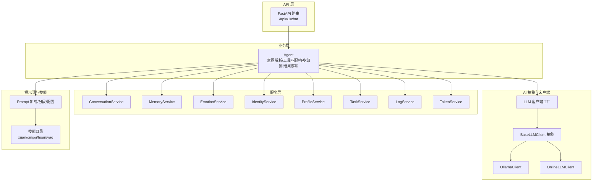
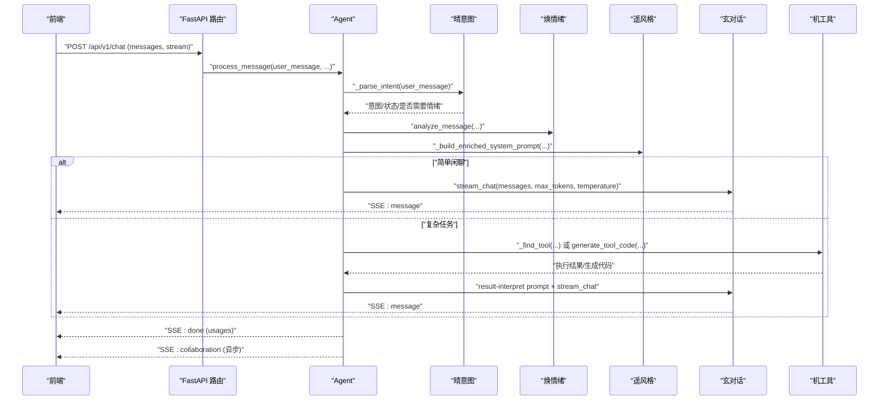
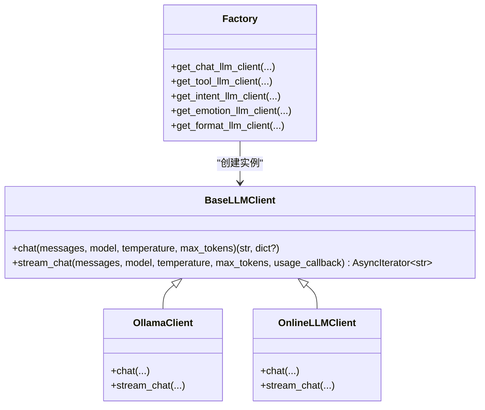
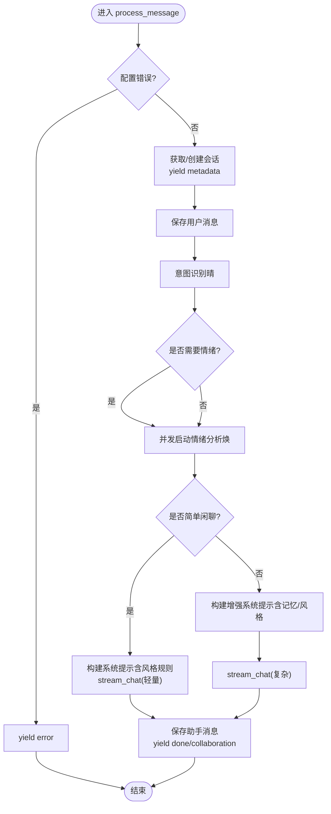
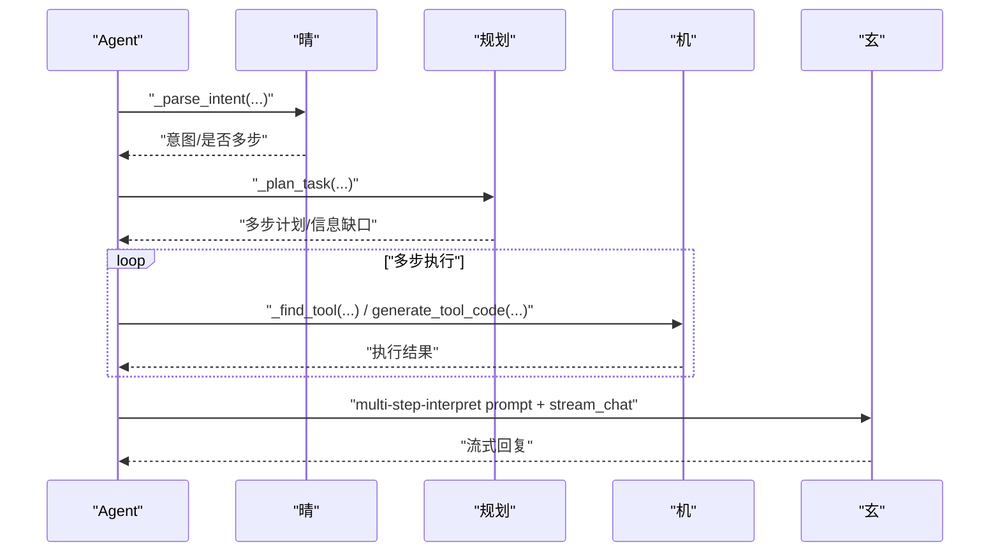
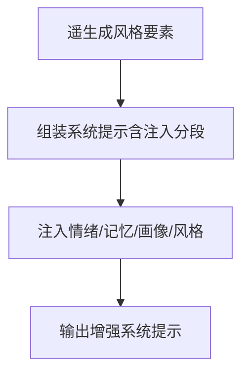
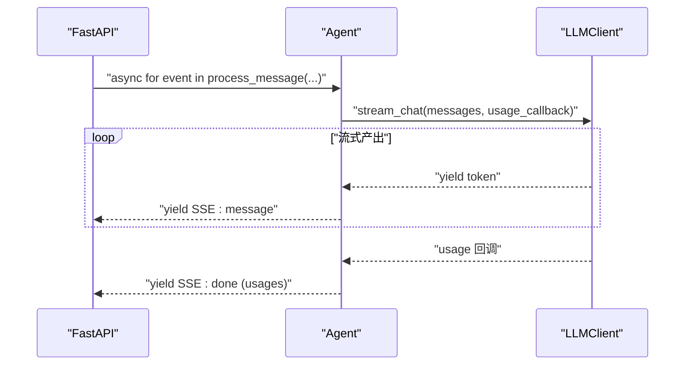
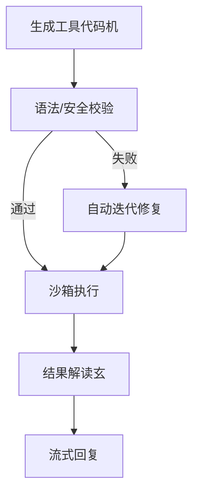
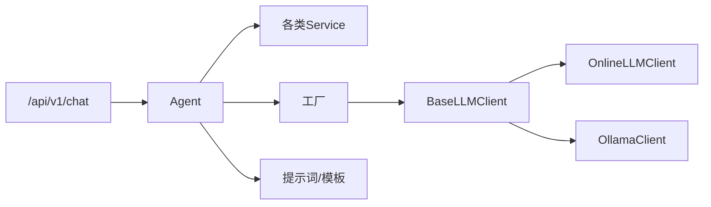

# 玄-对话生成系统

<cite>
**本文引用的文件**
- [backend/app/ai/base.py](file://backend/app/ai/base.py)
- [backend/app/ai/factory.py](file://backend/app/ai/factory.py)
- [backend/app/ai/agent.py](file://backend/app/ai/agent.py)
- [backend/app/ai/ollama.py](file://backend/app/ai/ollama.py)
- [backend/app/ai/online.py](file://backend/app/ai/online.py)
- [backend/app/ai/tool_generator.py](file://backend/app/ai/tool_generator.py)
- [backend/app/ai/intent_rules.json](file://backend/app/ai/intent_rules.json)
- [backend/app/ai/skills/xuanji-xuan/context-injection.md](file://backend/app/ai/skills/xuanji-xuan/context-injection.md)
- [backend/app/ai/skills/xuanji-xuan/multi-step-interpret.md](file://backend/app/ai/skills/xuanji-xuan/multi-step-interpret.md)
- [backend/app/ai/skills/xuanji-xuan/style-rules.md](file://backend/app/ai/skills/xuanji-xuan/style-rules.md)
- [backend/app/ai/skills/xuanji-yao/persona.md](file://backend/app/ai/skills/xuanji-yao/persona.md)
- [backend/app/ai/skills/xuanji-huan/persona.md](file://backend/app/ai/skills/xuanji-huan/persona.md)
- [backend/app/ai/skills/xuanji-ji/persona.md](file://backend/app/ai/skills/xuanji-ji/persona.md)
- [backend/app/api/v1/chat.py](file://backend/app/api/v1/chat.py)
- [backend/app/schemas/chat.py](file://backend/app/schemas/chat.py)
</cite>

## 目录
1. [简介](#简介)
2. [项目结构](#项目结构)
3. [核心组件](#核心组件)
4. [架构总览](#架构总览)
5. [详细组件分析](#详细组件分析)
6. [依赖分析](#依赖分析)
7. [性能考虑](#性能考虑)
8. [故障排查指南](#故障排查指南)
9. [结论](#结论)
10. [附录](#附录)

## 简介
本文件面向LLM应用开发者与提示词工程师，系统化阐述“玄智能体对话生成系统”的技术实现与工程实践。重点覆盖：
- 多模态上下文注入机制：情绪、记忆、画像、风格四类上下文的结构化注入与融合
- 流式对话生成：统一的流式接口抽象、SSE事件协议与前端解码
- 多步推理链设计：基于意图识别与工具执行的多阶段协作
- 提示词工程：分段模板、风格约束、Persona驱动的系统提示设计
- 上下文压缩策略：基于近期对话与记忆摘要的压缩与归档
- 回复质量控制：风格规则、思考片段过滤、降级回退
- 连贯性与一致性：协作日志、风格设计、身份迭代与个性化表达
- 性能监控：Token用量聚合、流式超时与断连处理

## 项目结构
系统采用后端双端（FastAPI + 前端React/Vite）与服务化分层架构，核心位于 backend/app 下：
- ai：多智能体与LLM客户端抽象、工厂、工具生成器、意图规则
- api/v1：聊天接口（SSE流式响应）
- services：会话、记忆、情绪、身份、任务、设置、日志、令牌等服务
- schemas：请求/响应模型
- models：数据库模型
- sandbox：工具执行与代码验证沙箱

图表来源
- [backend/app/api/v1/chat.py:40-106](file://backend/app/api/v1/chat.py#L40-L106)
- [backend/app/ai/agent.py:35-120](file://backend/app/ai/agent.py#L35-L120)
- [backend/app/ai/base.py:8-36](file://backend/app/ai/base.py#L8-L36)
- [backend/app/ai/factory.py:54-154](file://backend/app/ai/factory.py#L54-L154)

章节来源
- [backend/app/api/v1/chat.py:40-106](file://backend/app/api/v1/chat.py#L40-L106)
- [backend/app/ai/agent.py:35-120](file://backend/app/ai/agent.py#L35-L120)
- [backend/app/ai/base.py:8-36](file://backend/app/ai/base.py#L8-L36)
- [backend/app/ai/factory.py:54-154](file://backend/app/ai/factory.py#L54-L154)

## 核心组件
- 统一LLM客户端抽象与工厂
  - BaseLLMClient：定义 chat 与 stream_chat 接口，统一返回格式与用量回调
  - OllamaClient/OnlineLLMClient：分别对接本地Ollama与在线API，实现流式与非流式
  - 工厂函数：按用户设置动态创建不同Provider的客户端实例
- Agent：多智能体编排核心，负责意图识别、情绪分析、记忆检索、风格设计、工具匹配/生成/执行、结果解读与SSE事件流
- 提示词与技能：通过分段模板与Persona驱动系统提示，结合上下文注入模块
- API层：SSE流式接口，支持断连恢复与用量记录

章节来源
- [backend/app/ai/base.py:8-73](file://backend/app/ai/base.py#L8-L73)
- [backend/app/ai/factory.py:54-154](file://backend/app/ai/factory.py#L54-L154)
- [backend/app/ai/ollama.py:10-91](file://backend/app/ai/ollama.py#L10-L91)
- [backend/app/ai/online.py:10-134](file://backend/app/ai/online.py#L10-L134)
- [backend/app/ai/agent.py:35-120](file://backend/app/ai/agent.py#L35-L120)
- [backend/app/api/v1/chat.py:40-106](file://backend/app/api/v1/chat.py#L40-L106)

## 架构总览
系统采用“意图识别 → 情绪分析 → 记忆检索 → 风格设计 → 对话生成/工具执行 → 结果解读”的流水线式编排。Agent在每个关键节点产出协作日志，并通过SSE事件流向前端推送实时状态。

图表来源
- [backend/app/api/v1/chat.py:40-106](file://backend/app/api/v1/chat.py#L40-L106)
- [backend/app/ai/agent.py:78-274](file://backend/app/ai/agent.py#L78-L274)
- [backend/app/ai/online.py:59-134](file://backend/app/ai/online.py#L59-L134)
- [backend/app/ai/ollama.py:50-91](file://backend/app/ai/ollama.py#L50-L91)

## 详细组件分析

### 统一LLM客户端与工厂
- BaseLLMClient
  - chat：返回完整文本与用量字典
  - stream_chat：逐token异步产出，支持usage_callback
  - 提示词加载：LRU缓存的模板与JSON配置加载，支持分段模板
- 工厂
  - 支持 online 与 ollama 两种Provider
  - 严格校验必要参数，缺失时报错
  - 分别为“对话/工具/意图/情绪/格式”AI创建独立客户端

图表来源
- [backend/app/ai/base.py:8-73](file://backend/app/ai/base.py#L8-L73)
- [backend/app/ai/factory.py:54-154](file://backend/app/ai/factory.py#L54-L154)
- [backend/app/ai/ollama.py:10-91](file://backend/app/ai/ollama.py#L10-L91)
- [backend/app/ai/online.py:10-134](file://backend/app/ai/online.py#L10-L134)

章节来源
- [backend/app/ai/base.py:8-73](file://backend/app/ai/base.py#L8-L73)
- [backend/app/ai/factory.py:54-154](file://backend/app/ai/factory.py#L54-L154)
- [backend/app/ai/ollama.py:10-91](file://backend/app/ai/ollama.py#L10-L91)
- [backend/app/ai/online.py:10-134](file://backend/app/ai/online.py#L10-L134)

### Agent：多智能体编排与SSE事件流
- 关键职责
  - 意图识别：结合关键词与学习模式，输出描述、状态、是否需要情绪
  - 情绪分析：并发启动，超时/失败降级，产出情绪快照与协作日志
  - 记忆检索：近期对话与记忆摘要，用于上下文压缩与个性化
  - 风格设计：遥根据记忆与规则生成风格要素（结构、长度、风格、避免项）
  - 对话生成：轻量闲聊与复杂任务两条路径，均走流式输出
  - 工具链路：匹配/生成/执行/迭代，失败自动迭代并保存
  - 结果解读：将工具结果转为自然口语化回复
  - 协作日志：记录各AI的决策与贡献，最终以SSE事件推送
- SSE事件类型
  - metadata：携带当前对话ID
  - thinking：阶段性思考提示
  - message：流式回复片段
  - emotion_update：情绪分析结果
  - tool_*：工具匹配/生成/执行/迭代过程事件
  - done：收尾事件，携带累计用量
  - collaboration：协作日志（异步）

图表来源
- [backend/app/ai/agent.py:78-274](file://backend/app/ai/agent.py#L78-L274)
- [backend/app/api/v1/chat.py:62-87](file://backend/app/api/v1/chat.py#L62-L87)

章节来源
- [backend/app/ai/agent.py:78-274](file://backend/app/ai/agent.py#L78-L274)
- [backend/app/api/v1/chat.py:40-106](file://backend/app/api/v1/chat.py#L40-L106)

### 多步推理链设计
- 触发条件：当意图描述较长或包含“和/并且/同时”等连接词时，进入多步规划
- 编排流程：Agent根据规划结果，依次执行多个工具或子任务，最终由“玄”汇总解读
- 解释模板：使用 multi-step-interpret.md 将多源结果整合为自然口语化回答

图表来源
- [backend/app/ai/agent.py:343-359](file://backend/app/ai/agent.py#L343-L359)
- [backend/app/ai/skills/xuanji-xuan/multi-step-interpret.md:1-12](file://backend/app/ai/skills/xuanji-xuan/multi-step-interpret.md#L1-L12)

章节来源
- [backend/app/ai/agent.py:343-359](file://backend/app/ai/agent.py#L343-L359)
- [backend/app/ai/skills/xuanji-xuan/multi-step-interpret.md:1-12](file://backend/app/ai/skills/xuanji-xuan/multi-step-interpret.md#L1-L12)

### 上下文注入流程与提示词模板
- 注入模块：context-injection.md 定义四类上下文分段
  - 情绪上下文：主情绪、强度、深层需求、风险、沟通建议
  - 记忆上下文：短期记忆片段
  - 用户画像：个性化描述
  - 风格上下文：结构、长度、风格、特殊元素、避免事项
- 构建策略：Agent在“遥”完成风格设计后，将上述片段拼接到系统提示中，形成增强提示
- 风格约束：style-rules.md 提供严格规范，禁止括号动作、星号动作、角色扮演、结构化排版

图表来源
- [backend/app/ai/skills/xuanji-xuan/context-injection.md:1-31](file://backend/app/ai/skills/xuanji-xuan/context-injection.md#L1-L31)
- [backend/app/ai/skills/xuanji-xuan/style-rules.md:1-6](file://backend/app/ai/skills/xuanji-xuan/style-rules.md#L1-L6)

章节来源
- [backend/app/ai/skills/xuanji-xuan/context-injection.md:1-31](file://backend/app/ai/skills/xuanji-xuan/context-injection.md#L1-L31)
- [backend/app/ai/skills/xuanji-xuan/style-rules.md:1-6](file://backend/app/ai/skills/xuanji-xuan/style-rules.md#L1-L6)

### 流式对话生成机制
- 统一接口：BaseLLMClient.stream_chat 返回异步迭代器
- 在线Provider：过滤<think>片段，逐token产出，最后附带usage
- 本地Provider：逐行解析JSON，产出content，完成后回调usage
- API层：SSE封装，支持断连检测与用量记录

图表来源
- [backend/app/ai/base.py:23-35](file://backend/app/ai/base.py#L23-L35)
- [backend/app/ai/online.py:59-134](file://backend/app/ai/online.py#L59-L134)
- [backend/app/ai/ollama.py:50-91](file://backend/app/ai/ollama.py#L50-L91)
- [backend/app/api/v1/chat.py:62-87](file://backend/app/api/v1/chat.py#L62-L87)

章节来源
- [backend/app/ai/base.py:23-35](file://backend/app/ai/base.py#L23-L35)
- [backend/app/ai/online.py:59-134](file://backend/app/ai/online.py#L59-L134)
- [backend/app/ai/ollama.py:50-91](file://backend/app/ai/ollama.py#L50-L91)
- [backend/app/api/v1/chat.py:62-87](file://backend/app/api/v1/chat.py#L62-L87)

### 工具生成与执行
- 生成：使用工具AI（机）客户端，基于工具生成模板构造messages，去除Markdown围栏与META注释后进行语法与安全校验
- 匹配：优先从数据库检索可用工具
- 执行：沙箱执行，支持失败后的自动迭代与版本保存
- 结果解读：将工具结果与元信息拼接为自然语言，再由对话AI（玄）流式输出

图表来源
- [backend/app/ai/tool_generator.py:10-68](file://backend/app/ai/tool_generator.py#L10-L68)
- [backend/app/ai/agent.py:361-551](file://backend/app/ai/agent.py#L361-L551)

章节来源
- [backend/app/ai/tool_generator.py:10-68](file://backend/app/ai/tool_generator.py#L10-L68)
- [backend/app/ai/agent.py:361-551](file://backend/app/ai/agent.py#L361-L551)

### 意图识别与规则引擎
- 关键词与学习模式：query_keywords、casual_keywords、emotion_keywords与learned_patterns构成规则集
- 输出字段：description、user_state、target_path、parameters、need_emotion
- 影响路径：决定是否走简单闲聊或复杂工具链路，以及是否并发启动情绪分析

章节来源
- [backend/app/ai/intent_rules.json:1-306](file://backend/app/ai/intent_rules.json#L1-L306)
- [backend/app/ai/agent.py:124-128](file://backend/app/ai/agent.py#L124-L128)

### 提示词工程与Persona驱动
- Persona：为每个AI角色提供结构化背景、说话风格与价值观，确保风格一致性
- 模板：分段模板便于注入与组合，风格规则作为最高优先级约束
- 使用建议
  - 将Persona与上下文注入模块组合，形成“角色+情境+风格”的系统提示
  - 使用分段标记组织模板，便于按需拼接与更新
  - 通过style-rules.md强制统一输出风格，避免结构化排版与角色扮演

章节来源
- [backend/app/ai/skills/xuanji-yao/persona.md:1-26](file://backend/app/ai/skills/xuanji-yao/persona.md#L1-L26)
- [backend/app/ai/skills/xuanji-huan/persona.md:1-26](file://backend/app/ai/skills/xuanji-huan/persona.md#L1-L26)
- [backend/app/ai/skills/xuanji-ji/persona.md:1-26](file://backend/app/ai/skills/xuanji-ji/persona.md#L1-L26)
- [backend/app/ai/skills/xuanji-xuan/context-injection.md:1-31](file://backend/app/ai/skills/xuanji-xuan/context-injection.md#L1-L31)
- [backend/app/ai/skills/xuanji-xuan/style-rules.md:1-6](file://backend/app/ai/skills/xuanji-xuan/style-rules.md#L1-L6)

### 上下文压缩策略与个性化表达
- 压缩：定期触发记忆压缩，降低上下文长度，提升生成效率
- 画像：基于对话摘要与用户行为，周期性生成/更新用户画像，增强个性化
- 身份迭代：每N轮触发身份迭代评估，多AI并发评估并记录结果

章节来源
- [backend/app/ai/agent.py:747-791](file://backend/app/ai/agent.py#L747-L791)

### 回复质量控制
- 风格规则：严格禁止结构化排版与角色扮演，确保自然口语化
- 思考片段过滤：在线Provider自动过滤<think>片段
- 降级回退：流式超时或异常时，提供兜底回复并记录日志
- 用量回调：统一收集各角色Token用量，便于成本控制与优化

章节来源
- [backend/app/ai/online.py:100-127](file://backend/app/ai/online.py#L100-L127)
- [backend/app/ai/agent.py:592-641](file://backend/app/ai/agent.py#L592-L641)

## 依赖分析
- 组件耦合
  - Agent高度依赖服务层（会话、记忆、情绪、身份、任务、日志、令牌）
  - LLM客户端通过工厂与抽象解耦Provider差异
  - API层仅负责SSE封装与用量记录，不参与业务逻辑
- 外部依赖
  - 在线Provider：HTTP API（chat/completions，支持流式）
  - 本地Provider：Ollama API（/api/chat，支持流式）
  - 数据库：SQLAlchemy ORM
  - 沙箱：Python代码执行与语法/安全校验

图表来源
- [backend/app/api/v1/chat.py:40-106](file://backend/app/api/v1/chat.py#L40-L106)
- [backend/app/ai/agent.py:35-120](file://backend/app/ai/agent.py#L35-L120)
- [backend/app/ai/factory.py:54-154](file://backend/app/ai/factory.py#L54-L154)
- [backend/app/ai/base.py:8-36](file://backend/app/ai/base.py#L8-L36)

章节来源
- [backend/app/api/v1/chat.py:40-106](file://backend/app/api/v1/chat.py#L40-L106)
- [backend/app/ai/agent.py:35-120](file://backend/app/ai/agent.py#L35-L120)
- [backend/app/ai/factory.py:54-154](file://backend/app/ai/factory.py#L54-L154)
- [backend/app/ai/base.py:8-36](file://backend/app/ai/base.py#L8-L36)

## 性能考虑
- 流式超时与断连
  - 工具解读流式阶段设置总超时与分片超时，避免长时间占用资源
  - API层检测is_disconnected，及时中断生成
- Token用量
  - 统一usage_callback收集用量，SSE done事件后批量入库
  - 在线Provider支持include_usage，本地Provider在结束块汇总
- 并发与异步
  - 情绪分析并发执行，超时/失败不影响主流程
  - 记忆压缩与画像更新采用fire-and-forget，避免阻塞用户交互
- 上下文长度
  - 通过记忆压缩与近期消息截断，控制输入长度，提高响应速度

章节来源
- [backend/app/ai/agent.py:592-641](file://backend/app/ai/agent.py#L592-L641)
- [backend/app/api/v1/chat.py:78-87](file://backend/app/api/v1/chat.py#L78-L87)
- [backend/app/ai/online.py:85-94](file://backend/app/ai/online.py#L85-L94)
- [backend/app/ai/ollama.py:80-84](file://backend/app/ai/ollama.py#L80-L84)

## 故障排查指南
- 配置错误
  - Provider缺失或参数不全：工厂抛出LLMConfigError，Agent在首帧返回error事件
- LLM调用异常
  - 在线/本地Provider异常：捕获并yield error事件；流式阶段记录日志
- 情绪分析异常
  - 超时/失败：记录警告/错误日志，不影响主流程；最终在finally阶段尝试补录用量
- 工具生成/执行异常
  - 生成失败：返回error事件；执行失败：尝试自动迭代并保存新版本
- 断连与超时
  - API层检测断连，中断SSE；流式阶段设置超时，避免资源泄露

章节来源
- [backend/app/ai/factory.py:54-73](file://backend/app/ai/factory.py#L54-L73)
- [backend/app/ai/agent.py:94-194](file://backend/app/ai/agent.py#L94-L194)
- [backend/app/api/v1/chat.py:78-87](file://backend/app/api/v1/chat.py#L78-L87)

## 结论
本系统通过“意图-情绪-记忆-风格”的多模态上下文注入，结合统一的LLM客户端抽象与工厂，实现了高内聚、低耦合的多智能体编排。SSE流式输出与严格的风格规则保障了用户体验与一致性；多步推理链与工具生成/执行进一步扩展了系统能力边界。建议在实际部署中重点关注：
- 提示词模板的分段化与Persona对齐
- 上下文压缩与记忆摘要的阈值调优
- 流式超时与断连的弹性策略
- Token用量的可视化与成本控制

## 附录
- 对话生成示例
  - 简单闲聊：Agent构建含风格规则的系统提示，轻量max_tokens与较高temperature，流式输出
  - 复杂任务：遥生成风格要素，构建增强系统提示，工具链路执行后由玄进行自然口语化解读
- 提示词优化技巧
  - 使用分段模板，按需注入情绪/记忆/画像/风格
  - 通过style-rules.md统一输出风格，避免结构化排版
  - 将Persona与上下文注入模块组合，形成角色+情境+风格的系统提示
- 性能监控方案
  - SSE done事件聚合用量，统一入库
  - 工具解读流式阶段设置总超时与分片超时
  - 并发执行情绪分析与记忆压缩，避免阻塞