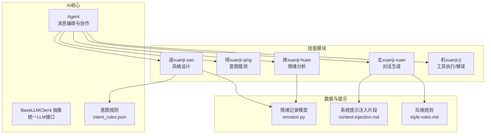
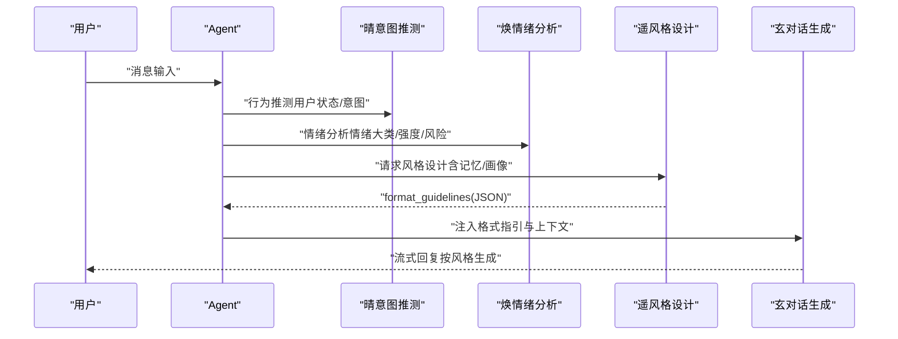
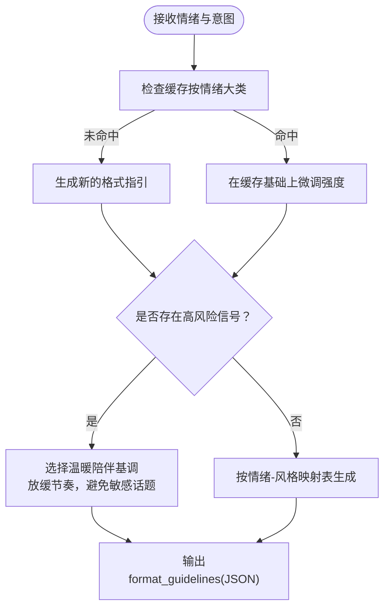
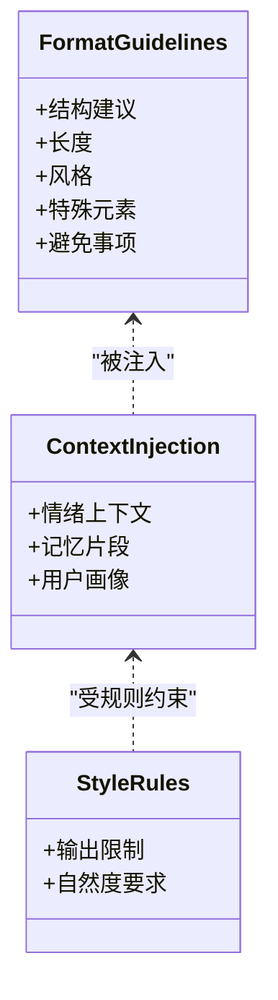
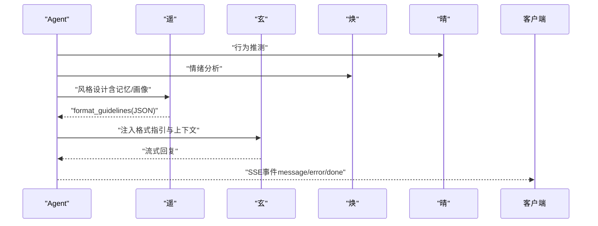
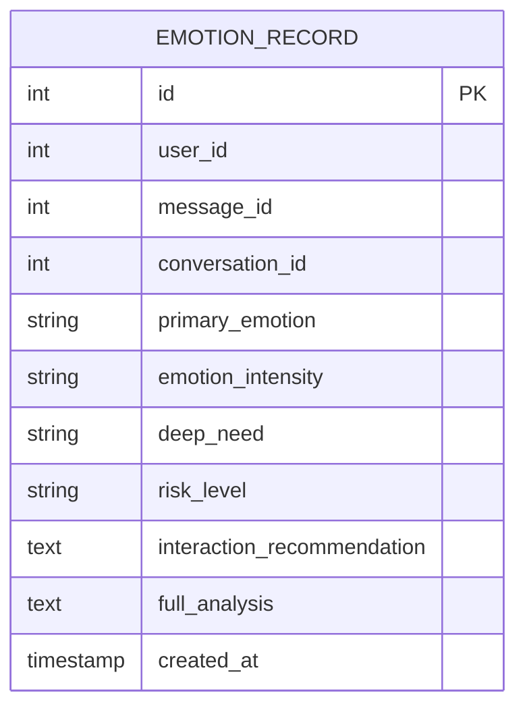
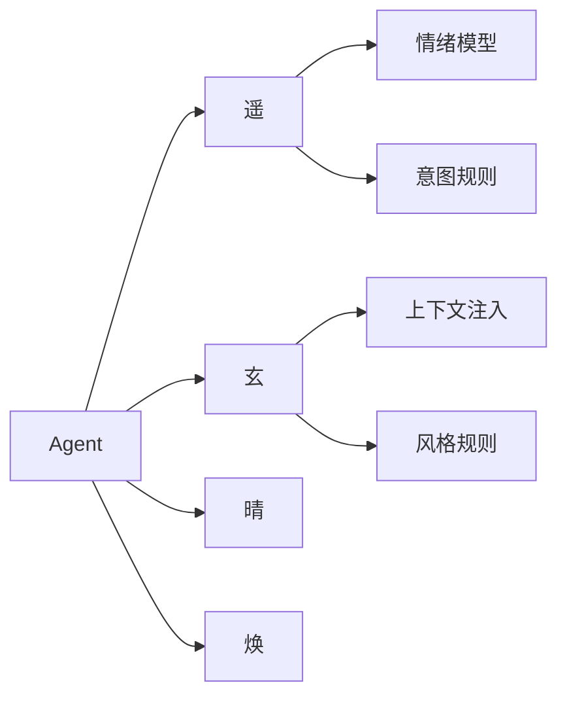

# 遥-风格设计系统

<cite>
**本文档引用的文件**
- [backend/app/ai/base.py](file://backend/app/ai/base.py)
- [backend/app/ai/agent.py](file://backend/app/ai/agent.py)
- [backend/app/ai/intent_rules.json](file://backend/app/ai/intent_rules.json)
- [backend/app/ai/skills/xuanji-yao/SKILL.md](file://backend/app/ai/skills/xuanji-yao/SKILL.md)
- [backend/app/ai/skills/xuanji-yao/persona.md](file://backend/app/ai/skills/xuanji-yao/persona.md)
- [backend/app/ai/skills/xuanji-yao/emotion-style-map.json](file://backend/app/ai/skills/xuanji-yao/emotion-style-map.json)
- [backend/app/ai/skills/xuanji-yao/fallback-templates.json](file://backend/app/ai/skills/xuanji-yao/fallback-templates.json)
- [backend/app/ai/skills/xuanji-xuan/context-injection.md](file://backend/app/ai/skills/xuanji-xuan/context-injection.md)
- [backend/app/ai/skills/xuanji-xuan/style-rules.md](file://backend/app/ai/skills/xuanji-xuan/style-rules.md)
- [backend/app/models/emotion.py](file://backend/app/models/emotion.py)
</cite>

## 目录
1. [简介](#简介)
2. [项目结构](#项目结构)
3. [核心组件](#核心组件)
4. [架构总览](#架构总览)
5. [详细组件分析](#详细组件分析)
6. [依赖关系分析](#依赖关系分析)
7. [性能考量](#性能考量)
8. [故障排查指南](#故障排查指南)
9. [结论](#结论)
10. [附录](#附录)

## 简介
遥风格设计系统是璇玑智能体协作体系中的“风格设计师”，负责将情绪分析结果与行为意图相结合，为对话核心“玄”生成可执行的格式与风格指引，并将其注入系统提示中，确保每次回复在语气、节奏、结构与情感色彩上都恰到好处。系统通过“情绪-风格映射表”、“模板库”、“缓存机制”与“降级策略”实现个性化、稳定且可解释的风格输出，兼顾UI/UX设计的可落地性与NLP工程的可扩展性。

## 项目结构
- 后端核心位于 backend/app/ai，包含统一的LLM客户端抽象、Agent编排器、技能目录（skills）与意图规则。
- 遥（xuanji-yao）技能模块提供风格设计的规则、映射表与模板库。
- 玄（xuan）技能模块提供系统提示注入片段，用于接收遥的格式指引并组织回复。
- 情绪模型定义了遥与焕协作所需的数据结构。

图表来源
- [backend/app/ai/agent.py:35-273](file://backend/app/ai/agent.py#L35-L273)
- [backend/app/ai/base.py:8-73](file://backend/app/ai/base.py#L8-L73)
- [backend/app/ai/intent_rules.json:1-306](file://backend/app/ai/intent_rules.json#L1-L306)
- [backend/app/ai/skills/xuanji-yao/SKILL.md:1-170](file://backend/app/ai/skills/xuanji-yao/SKILL.md#L1-L170)
- [backend/app/ai/skills/xuanji-xuan/context-injection.md:1-31](file://backend/app/ai/skills/xuanji-xuan/context-injection.md#L1-L31)
- [backend/app/models/emotion.py:9-29](file://backend/app/models/emotion.py#L9-L29)

章节来源
- [backend/app/ai/agent.py:35-273](file://backend/app/ai/agent.py#L35-L273)
- [backend/app/ai/base.py:8-73](file://backend/app/ai/base.py#L8-L73)
- [backend/app/ai/intent_rules.json:1-306](file://backend/app/ai/intent_rules.json#L1-L306)

## 核心组件
- 统一LLM客户端抽象：提供同步与流式对话接口，支持用量回调与缓存提示模板加载。
- Agent编排器：串联意图识别、情绪分析、风格设计、工具匹配/生成、结果解读与回复生成，贯穿协作日志与降级策略。
- 遥（风格设计）：基于情绪-风格映射表与模板库，输出JSON格式的format_guidelines，注入玄的系统提示。
- 玄（对话生成）：接收遥的格式指引与上下文注入片段，组织结构化但口语化的回复。
- 晴（意图推测）：提供用户状态与行为模式，辅助遥选择结构与长度。
- 焕（情绪分析）：提供情绪大类、强度、深层需求与风险等级，驱动遥的风格微调。
- 机（工具链）：在非对话路径中负责工具检索/生成/执行与结果解读，遥在此路径同样参与风格设计。

章节来源
- [backend/app/ai/base.py:8-73](file://backend/app/ai/base.py#L8-L73)
- [backend/app/ai/agent.py:35-273](file://backend/app/ai/agent.py#L35-L273)
- [backend/app/ai/skills/xuanji-yao/SKILL.md:1-170](file://backend/app/ai/skills/xuanji-yao/SKILL.md#L1-L170)
- [backend/app/ai/skills/xuanji-xuan/context-injection.md:1-31](file://backend/app/ai/skills/xuanji-xuan/context-injection.md#L1-L31)
- [backend/app/models/emotion.py:9-29](file://backend/app/models/emotion.py#L9-L29)

## 架构总览
遥风格设计系统采用“多智能体协作”的流水线式架构：Agent作为中枢，按消息类型与复杂度选择“轻量闲聊”或“完整对话+工具链”路径。在任一路径中，遥均会基于“晴的意图”和“焕的情绪”生成风格指引，并将其注入“玄”的系统提示中，确保回复在情感适配、结构安排与表达节奏上保持一致性和自然度。

图表来源
- [backend/app/ai/agent.py:118-273](file://backend/app/ai/agent.py#L118-L273)
- [backend/app/ai/skills/xuanji-yao/SKILL.md:23-109](file://backend/app/ai/skills/xuanji-yao/SKILL.md#L23-L109)
- [backend/app/ai/skills/xuanji-xuan/context-injection.md:23-31](file://backend/app/ai/skills/xuanji-xuan/context-injection.md#L23-L31)

## 详细组件分析

### 遥风格设计模块（xuanji-yao）
- 角色定位：风格设计师，不直接对话，负责为玄提供“结构、长度、风格、特殊元素、避免事项”的具体指引。
- 情绪-风格映射：将情绪大类映射为语气、节奏与情感色彩建议，强度影响风格调整幅度；默认风格在无情绪数据时启用。
- 结构化设计：根据不同场景（问候、闲聊、倾诉、问答、讨论、求助）推荐结构与长度。
- 审美判断：强调节奏感、留白、一致性与自然度，避免过度排版与角色扮演式描写。
- 缓存机制：按情绪大类缓存格式指引，30分钟有效期，同一大类内强度变化在缓存基础上微调。
- 风险信号：高风险情绪时优先“温暖陪伴”，放缓节奏，避免追问敏感话题。

图表来源
- [backend/app/ai/skills/xuanji-yao/SKILL.md:23-159](file://backend/app/ai/skills/xuanji-yao/SKILL.md#L23-L159)
- [backend/app/ai/skills/xuanji-yao/emotion-style-map.json:1-14](file://backend/app/ai/skills/xuanji-yao/emotion-style-map.json#L1-L14)

章节来源
- [backend/app/ai/skills/xuanji-yao/SKILL.md:1-170](file://backend/app/ai/skills/xuanji-yao/SKILL.md#L1-L170)
- [backend/app/ai/skills/xuanji-yao/emotion-style-map.json:1-14](file://backend/app/ai/skills/xuanji-yao/emotion-style-map.json#L1-L14)
- [backend/app/ai/skills/xuanji-yao/fallback-templates.json:1-7](file://backend/app/ai/skills/xuanji-yao/fallback-templates.json#L1-L7)

### 玄系统提示注入与风格落地
- 上下文注入：遥的format_guidelines与记忆片段、用户画像、情绪上下文被注入到玄的系统提示中，指导回复结构与表达。
- 风格约束：禁止使用编号列表、加粗标题等结构化排版，确保回复自然口语化。
- 规则文件：style-rules.md进一步约束输出风格，保证一致性与可解释性。

图表来源
- [backend/app/ai/skills/xuanji-xuan/context-injection.md:1-31](file://backend/app/ai/skills/xuanji-xuan/context-injection.md#L1-L31)
- [backend/app/ai/skills/xuanji-xuan/style-rules.md](file://backend/app/ai/skills/xuanji-xuan/style-rules.md)

章节来源
- [backend/app/ai/skills/xuanji-xuan/context-injection.md:1-31](file://backend/app/ai/skills/xuanji-xuan/context-injection.md#L1-L31)
- [backend/app/ai/skills/xuanji-xuan/style-rules.md](file://backend/app/ai/skills/xuanji-xuan/style-rules.md)

### Agent消息处理流程与风格参与点
- 轻量闲聊路径：直接构建“玄”的系统提示（含风格规则），流式生成回复。
- 完整对话路径：遥参与风格设计，将format_guidelines与记忆上下文注入，再由玄生成回复。
- 工具链路径：遥同样参与风格设计，为“结果解读”阶段提供格式指引，确保工具执行结果以自然口语化方式传达。

图表来源
- [backend/app/ai/agent.py:78-273](file://backend/app/ai/agent.py#L78-L273)
- [backend/app/ai/skills/xuanji-yao/SKILL.md:112-126](file://backend/app/ai/skills/xuanji-yao/SKILL.md#L112-L126)

章节来源
- [backend/app/ai/agent.py:78-273](file://backend/app/ai/agent.py#L78-L273)

### 情绪模型与风格适配
- 模型字段：包含用户ID、消息ID、对话ID、主要情绪、情绪强度、深层需求、风险等级、交互建议与完整分析文本。
- 风格适配：遥依据情绪大类与强度进行风格参数映射；高风险信号时采取“温暖陪伴”策略；强度影响风格调整幅度。

图表来源
- [backend/app/models/emotion.py:9-29](file://backend/app/models/emotion.py#L9-L29)

章节来源
- [backend/app/models/emotion.py:9-29](file://backend/app/models/emotion.py#L9-L29)

### 模板库与降级策略
- 情绪风格映射表：将九种常见情绪映射为语气、节奏与情感色彩建议，并提供默认风格。
- 降级模板库：针对积极、消极、强烈、中性与默认五类情境提供“格式指引”模板，保障在异常或缺省情况下仍能输出一致风格。
- 使用场景：遥在生成format_guidelines时优先参考映射表；若映射缺失或异常，则回退到模板库中的对应类别。

章节来源
- [backend/app/ai/skills/xuanji-yao/emotion-style-map.json:1-14](file://backend/app/ai/skills/xuanji-yao/emotion-style-map.json#L1-L14)
- [backend/app/ai/skills/xuanji-yao/fallback-templates.json:1-7](file://backend/app/ai/skills/xuanji-yao/fallback-templates.json#L1-L7)

### 意图规则与模板选择策略
- 关键词与模式：query_keywords、casual_keywords、emotion_keywords与learned_patterns共同构成意图识别基础，辅助遥判断场景类型与结构推荐。
- 模板选择：不同场景（问候、闲聊、倾诉、问答、讨论、求助）对应不同结构与长度建议，遥据此微调format_guidelines。

章节来源
- [backend/app/ai/intent_rules.json:1-306](file://backend/app/ai/intent_rules.json#L1-L306)
- [backend/app/ai/skills/xuanji-yao/SKILL.md:43-55](file://backend/app/ai/skills/xuanji-yao/SKILL.md#L43-L55)

## 依赖关系分析
- 组件耦合：Agent对各AI角色的服务依赖清晰，遥的风格设计依赖情绪模型与意图规则；玄的系统提示依赖遥的格式指引与上下文注入片段。
- 外部依赖：统一LLM客户端抽象屏蔽不同模型提供商差异；JSON配置与提示模板通过缓存加载提升性能。
- 可能的循环依赖：当前结构以Agent为中心进行编排，未见循环导入；风格设计与对话生成通过JSON格式指引解耦。

图表来源
- [backend/app/ai/agent.py:35-273](file://backend/app/ai/agent.py#L35-L273)
- [backend/app/ai/skills/xuanji-yao/SKILL.md:112-126](file://backend/app/ai/skills/xuanji-yao/SKILL.md#L112-L126)
- [backend/app/ai/skills/xuanji-xuan/context-injection.md:1-31](file://backend/app/ai/skills/xuanji-xuan/context-injection.md#L1-L31)

章节来源
- [backend/app/ai/agent.py:35-273](file://backend/app/ai/agent.py#L35-L273)

## 性能考量
- 提示模板缓存：通过LRU缓存加载prompt与JSON配置，减少重复I/O开销。
- 风格缓存：遥按情绪大类缓存format_guidelines，30分钟有效期，显著降低重复计算与风格漂移风险。
- 流式输出：对话与结果解读均采用流式生成，前端可即时展示，降低首字节延迟。
- 降级与兜底：在LLM异常或工具执行失败时，系统提供降级回复模板，确保用户体验连续性。
- 并发与异步：情绪分析与协作日志在后台并发执行，避免阻塞主线程；最终用量在done事件后补录，不干扰用户交互。

章节来源
- [backend/app/ai/base.py:41-54](file://backend/app/ai/base.py#L41-L54)
- [backend/app/ai/agent.py:140-149](file://backend/app/ai/agent.py#L140-L149)
- [backend/app/ai/skills/xuanji-yao/SKILL.md:140-149](file://backend/app/ai/skills/xuanji-yao/SKILL.md#L140-L149)

## 故障排查指南
- LLM配置错误：Agent初始化时捕获LLMConfigError并返回错误事件，需检查模型参数与鉴权配置。
- 对话生成失败：捕获异常并返回错误事件；若为空回复，系统自动填充兜底回复。
- 情绪分析超时/失败：记录告警日志并继续流程；若无情绪数据，遥使用默认风格。
- 工具执行失败：遥参与“结果解读”风格设计，采用降级模板保障可读性；必要时触发工具迭代并重新执行。
- Token用量补录：在done事件后补录后置用量，确保计费准确。

章节来源
- [backend/app/ai/agent.py:94-195](file://backend/app/ai/agent.py#L94-L195)
- [backend/app/ai/agent.py:275-319](file://backend/app/ai/agent.py#L275-L319)
- [backend/app/ai/agent.py:592-641](file://backend/app/ai/agent.py#L592-L641)
- [backend/app/ai/agent.py:718-737](file://backend/app/ai/agent.py#L718-L737)

## 结论
遥风格设计系统通过“情绪-风格映射表”“模板库”“缓存机制”与“降级策略”，实现了个性化、稳定且可解释的风格输出。其多智能体协作架构使风格设计与对话生成解耦，既满足UI/UX对风格一致性与自然度的要求，也为NLP工程师提供了可扩展的实现框架。建议在实际落地中持续优化缓存策略、增强风险信号识别，并完善风格效果的A/B评估指标。

## 附录

### 风格映射表（摘录）
- 情绪大类：happy、sad、angry、anxious、neutral、excited、lonely、stressed、confused
- 默认风格：自然亲和，温和友好，节奏适中，平和积极
- 使用建议：强度越高，风格调整越明显；低强度时以默认风格微调

章节来源
- [backend/app/ai/skills/xuanji-yao/emotion-style-map.json:1-14](file://backend/app/ai/skills/xuanji-yao/emotion-style-map.json#L1-L14)
- [backend/app/ai/skills/xuanji-yao/SKILL.md:27-41](file://backend/app/ai/skills/xuanji-yao/SKILL.md#L27-L41)

### 模板库结构（摘录）
- positive：积极情境下的温暖轻快风格
- negative：消极情境下的温柔体贴风格
- intense：高风险/强烈情绪下的柔和稳定风格
- neutral：中性情境下的自然简洁风格
- default：通用兜底风格

章节来源
- [backend/app/ai/skills/xuanji-yao/fallback-templates.json:1-7](file://backend/app/ai/skills/xuanji-yao/fallback-templates.json#L1-L7)

### 情感适配规则（摘录）
- 高风险信号：避免加重负面情绪，优先温暖陪伴，放缓节奏，避免追问敏感话题
- 强度影响：强度越高，风格调整幅度越大；低强度时以默认风格微调
- 缺省处理：无情绪数据时使用默认风格

章节来源
- [backend/app/ai/skills/xuanji-yao/SKILL.md:152-158](file://backend/app/ai/skills/xuanji-yao/SKILL.md#L152-L158)
- [backend/app/ai/skills/xuanji-yao/SKILL.md:129-135](file://backend/app/ai/skills/xuanji-yao/SKILL.md#L129-L135)

### 配置参数与最佳实践
- 提示模板缓存：合理设置缓存容量与失效时间，平衡内存占用与热词命中率
- 风格缓存：按情绪大类分组缓存，避免跨类污染；在强度变化时进行微调
- 流式超时：对话与解读阶段分别设置合理的流式超时阈值，确保用户体验
- 降级策略：为不同失败场景准备模板，保证可读性与一致性
- 日志与追踪：保留协作日志与token用量，便于效果评估与成本控制

章节来源
- [backend/app/ai/base.py:41-54](file://backend/app/ai/base.py#L41-L54)
- [backend/app/ai/agent.py:140-149](file://backend/app/ai/agent.py#L140-L149)
- [backend/app/ai/agent.py:592-641](file://backend/app/ai/agent.py#L592-L641)