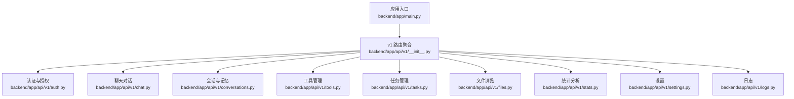
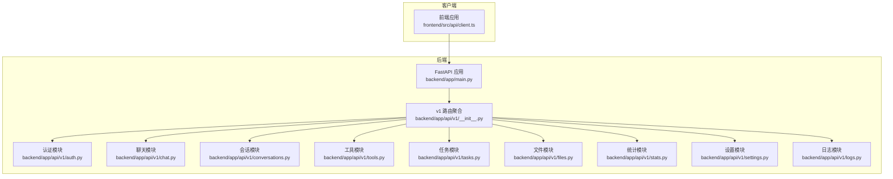
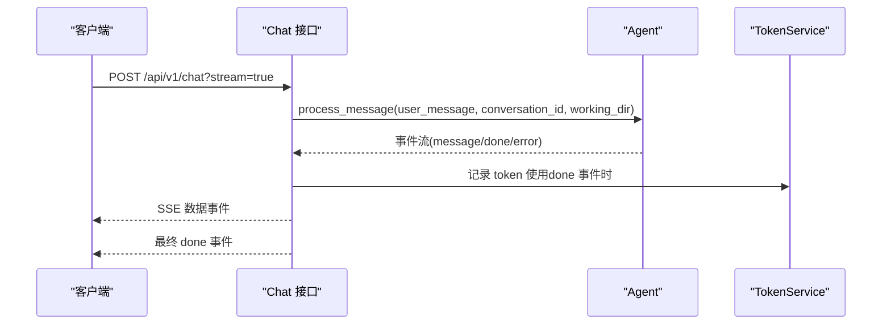
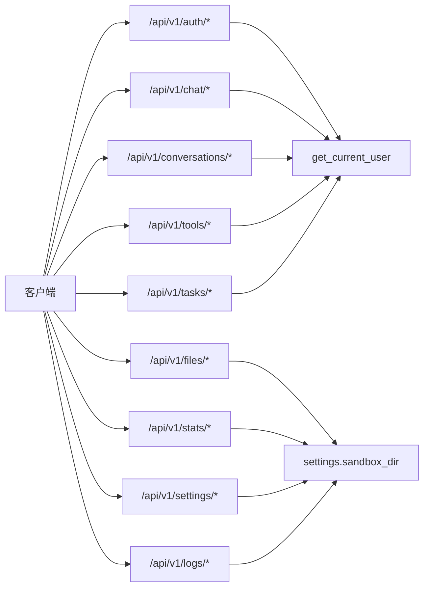

# API接口文档

<cite>
**本文档引用的文件**
- [backend/app/main.py](file://backend/app/main.py)
- [backend/app/api/v1/__init__.py](file://backend/app/api/v1/__init__.py)
- [backend/app/api/v1/auth.py](file://backend/app/api/v1/auth.py)
- [backend/app/api/v1/chat.py](file://backend/app/api/v1/chat.py)
- [backend/app/api/v1/conversations.py](file://backend/app/api/v1/conversations.py)
- [backend/app/api/v1/tools.py](file://backend/app/api/v1/tools.py)
- [backend/app/api/v1/stats.py](file://backend/app/api/v1/stats.py)
- [backend/app/api/v1/tasks.py](file://backend/app/api/v1/tasks.py)
- [backend/app/api/v1/files.py](file://backend/app/api/v1/files.py)
- [backend/app/api/v1/settings.py](file://backend/app/api/v1/settings.py)
- [backend/app/api/v1/logs.py](file://backend/app/api/v1/logs.py)
- [backend/app/core/config.py](file://backend/app/core/config.py)
- [backend/app/core/security.py](file://backend/app/core/security.py)
- [backend/app/core/deps.py](file://backend/app/core/deps.py)
- [frontend/src/api/client.ts](file://frontend/src/api/client.ts)
- [frontend/src/types/api.ts](file://frontend/src/types/api.ts)
</cite>

## 目录
1. [简介](#简介)
2. [项目结构](#项目结构)
3. [核心组件](#核心组件)
4. [架构总览](#架构总览)
5. [详细组件分析](#详细组件分析)
6. [依赖分析](#依赖分析)
7. [性能考虑](#性能考虑)
8. [故障排除指南](#故障排除指南)
9. [结论](#结论)
10. [附录](#附录)

## 简介
本文件为 XuanJi 的完整 RESTful API 文档，覆盖认证与授权、聊天对话、会话管理、工具管理、任务管理、文件浏览、统计分析、设置与日志等模块。文档提供每个接口的 HTTP 方法、URL 模式、请求参数、响应格式、状态码说明，并给出请求示例、响应示例、错误处理与权限控制说明。同时包含 API 版本管理、速率限制与安全防护建议，以及客户端集成指南与调试工具推荐。

## 项目结构
后端基于 FastAPI 构建，采用按功能模块划分的 API 路由组织方式，v1 版本路由统一挂载在 /api/v1 前缀下。核心模块包括：
- 认证与授权：/api/v1/auth
- 聊天对话：/api/v1/chat
- 会话与记忆：/api/v1/conversations
- 工具管理：/api/v1/tools
- 任务管理：/api/v1/tasks
- 文件浏览：/api/v1/files
- 统计分析：/api/v1/stats
- 设置与日志：/api/v1/settings、/api/v1/logs

**图表来源**
- [backend/app/main.py:30-40](file://backend/app/main.py#L30-L40)
- [backend/app/api/v1/__init__.py:13-22](file://backend/app/api/v1/__init__.py#L13-L22)

**章节来源**
- [backend/app/main.py:30-40](file://backend/app/main.py#L30-L40)
- [backend/app/api/v1/__init__.py:13-22](file://backend/app/api/v1/__init__.py#L13-L22)

## 核心组件
- 应用入口与生命周期：定义 CORS、健康检查、全局异常处理、版本号等。
- 安全与鉴权：基于 JWT 的 Bearer Token，解码校验与用户上下文注入。
- 配置中心：数据库、AI 推理服务、CORS、沙箱目录等配置项。
- 响应统一格式：所有接口返回包含 code、message、data 的结构，便于前端一致处理。

**章节来源**
- [backend/app/main.py:15-28](file://backend/app/main.py#L15-L28)
- [backend/app/main.py:43-59](file://backend/app/main.py#L43-L59)
- [backend/app/core/security.py:24-30](file://backend/app/core/security.py#L24-L30)
- [backend/app/core/deps.py:12-41](file://backend/app/core/deps.py#L12-L41)
- [backend/app/core/config.py:4-67](file://backend/app/core/config.py#L4-L67)
- [frontend/src/types/api.ts:1-6](file://frontend/src/types/api.ts#L1-L6)

## 架构总览
XuanJi 后端采用模块化路由设计，统一前缀 /api/v1，各模块通过独立的 APIRouter 聚合。前端通过标准 Fetch API 或 SSE 流进行交互，统一携带 Authorization: Bearer Token。

**图表来源**
- [backend/app/main.py:30-40](file://backend/app/main.py#L30-L40)
- [backend/app/api/v1/__init__.py:13-22](file://backend/app/api/v1/__init__.py#L13-L22)

## 详细组件分析

### 认证与授权接口
- 基础路径：/api/v1/auth
- 鉴权方式：Bearer Token（JWT），通过 Authorization 头传递
- 用户上下文：依赖 get_current_user 注入当前用户对象

接口定义
- POST /api/v1/auth/register
  - 功能：注册新用户
  - 请求体：UserCreate
  - 成功响应：包含 token 与用户信息
  - 状态码：200 成功；400 用户名已存在
- POST /api/v1/auth/login
  - 功能：用户登录
  - 请求体：UserLogin
  - 成功响应：包含 token 与用户信息
  - 状态码：200 成功；401 用户名或密码错误
- GET /api/v1/auth/me
  - 功能：获取当前用户信息
  - 成功响应：用户信息
  - 状态码：200 成功；401 未授权

请求示例
- POST /api/v1/auth/register
  - 请求头：Content-Type: application/json
  - 请求体：{"username": "...", "password": "..."}
  - 成功响应：{"code": 200, "message": "success", "data": {"token": "...", "user": {...}}}

响应示例
- 成功：{"code": 200, "message": "success", "data": {...}}
- 参数错误：{"code": 422, "message": "字段验证失败描述", "data": null}
- 业务错误：{"code": 4xx, "message": "具体错误描述", "data": null}

错误处理
- 400：用户名已存在
- 401：用户名或密码错误；Token 解析失败或过期；用户不存在
- 422：请求参数校验失败（Pydantic 验证错误转中文）

权限控制
- 所有受保护接口均需 Authorization: Bearer <token>
- 未携带或无效 token 将返回 401

**章节来源**
- [backend/app/api/v1/auth.py:14-60](file://backend/app/api/v1/auth.py#L14-L60)
- [backend/app/core/deps.py:12-41](file://backend/app/core/deps.py#L12-L41)
- [backend/app/core/security.py:24-30](file://backend/app/core/security.py#L24-L30)
- [backend/app/main.py:43-59](file://backend/app/main.py#L43-L59)

### 聊天对话接口
- 基础路径：/api/v1/chat
- 功能：支持流式与非流式对话，自动记录 token 使用量

接口定义
- POST /api/v1/chat
  - 查询参数：stream（布尔，是否启用流式）
  - 请求体：ChatRequest（包含 messages、conversation_id、working_dir 等）
  - 成功响应：
    - 非流式：{"code": 200, "message": "success", "data": {"content": "..."}}
    - 流式：SSE，事件类型包括 message、done、error
  - 状态码：200 成功；400 无用户消息；422 参数校验失败

流式处理流程

**图表来源**
- [backend/app/api/v1/chat.py:40-105](file://backend/app/api/v1/chat.py#L40-L105)

**章节来源**
- [backend/app/api/v1/chat.py:40-105](file://backend/app/api/v1/chat.py#L40-L105)

### 会话管理接口
- 基础路径：/api/v1/conversations

会话相关
- GET /api/v1/conversations
  - 查询参数：page、limit（默认 1，范围 1..100）
  - 返回：会话列表
- POST /api/v1/conversations
  - 请求体：ConversationCreate（title）
  - 返回：新建会话
- GET /api/v1/conversations/recent-messages
  - 查询参数：days（默认 3，范围 1..30）
  - 返回：最近消息列表
- GET /api/v1/conversations/{conversation_id}/messages
  - 查询参数：limit、before_id
  - 返回：指定会话的消息列表

情感与身份
- GET /api/v1/conversations/emotions/latest
  - 返回：最新情感记录
- GET /api/v1/conversations/emotions/history
  - 查询参数：limit（默认 20，范围 1..100）
  - 返回：情感历史
- GET /api/v1/conversations/profile
  - 返回：用户档案（不存在则创建）

AI 人格
- GET /api/v1/conversations/identities
  - 返回：当前用户的所有 AI 人格
- GET /api/v1/conversations/identities/{ai_name}
  - 返回：指定 AI 人格
- PUT /api/v1/conversations/identities/{ai_name}
  - 请求体：AIIdentityUpdate
  - 返回：字段更新结果（updated/locked）

记忆检索
- GET /api/v1/conversations/memories
  - 查询参数：query（可选）、limit（默认 10，范围 1..50）
  - 返回：记忆摘要列表

**章节来源**
- [backend/app/api/v1/conversations.py:22-186](file://backend/app/api/v1/conversations.py#L22-L186)

### 工具管理接口
- 基础路径：/api/v1/tools

工具基础
- GET /api/v1/tools
  - 返回：最近创建的工具列表（最多 100）
- POST /api/v1/tools
  - 请求体：ToolCreate
  - 返回：创建后的工具详情
- GET /api/v1/tools/search?q=...
  - 返回：名称或描述匹配的工具列表（最多 20）

导入导出
- GET /api/v1/tools/export
  - 返回：当前用户所有工具的导出数据
- POST /api/v1/tools/import
  - 请求体：ToolImportItem[]
  - 返回：导入结果

单个工具
- GET /api/v1/tools/{tool_id}
  - 返回：工具详情
- PUT /api/v1/tools/{tool_id}
  - 请求体：ToolUpdate
  - 返回：更新后的工具详情
- DELETE /api/v1/tools/{tool_id}
  - 返回：删除结果

版本管理
- GET /api/v1/tools/{tool_id}/versions
  - 返回：工具版本列表
- POST /api/v1/tools/{tool_id}/rollback/{version}
  - 返回：回滚后的工具详情

**章节来源**
- [backend/app/api/v1/tools.py:25-168](file://backend/app/api/v1/tools.py#L25-L168)

### 任务管理接口
- 基础路径：/api/v1/tasks

- GET /api/v1/tasks
  - 返回：当前用户最近的任务列表（最多 50）
- GET /api/v1/tasks/{task_id}
  - 返回：指定任务详情
  - 404：任务不存在或不属于当前用户

**章节来源**
- [backend/app/api/v1/tasks.py:13-49](file://backend/app/api/v1/tasks.py#L13-L49)

### 文件浏览接口
- 基础路径：/api/v1/files
- 作用域：仅允许访问沙箱目录（sandbox_dir）内的内容

- GET /api/v1/files/browse
  - 查询参数：path（相对沙箱根目录的路径，默认根目录）
  - 返回：当前目录条目列表（名称、是否目录、大小、相对路径）
  - 状态码：200 成功；400 路径不是目录；403 访问被拒绝（越权）；404 路径不存在；403 权限不足

**章节来源**
- [backend/app/api/v1/files.py:11-47](file://backend/app/api/v1/files.py#L11-L47)
- [backend/app/core/config.py:44-46](file://backend/app/core/config.py#L44-L46)

### 统计分析接口
- 基础路径：/api/v1/stats

仪表盘
- GET /api/v1/stats/dashboard
  - 返回：今日、当月、累计 token 使用量与月度预算

按角色统计
- GET /api/v1/stats/token-by-role
  - 查询参数：days（默认 30）
  - 返回：按角色统计的 token 使用

每日统计
- GET /api/v1/stats/token-daily
  - 查询参数：days（默认 30）
  - 返回：每日 token 使用趋势

按模型统计
- GET /api/v1/stats/token-by-model
  - 查询参数：days（默认 30）
  - 返回：按模型统计的 token 使用

**章节来源**
- [backend/app/api/v1/stats.py:12-61](file://backend/app/api/v1/stats.py#L12-L61)

### 设置与日志接口
- 基础路径：/api/v1/settings
- 日志路径：/api/v1/logs

设置
- GET /api/v1/settings
  - 返回：当前用户的设置
- PUT /api/v1/settings
  - 请求体：SettingUpdate
  - 返回：更新后的设置
- GET /api/v1/settings/token-usage
  - 返回：当前用户 token 使用汇总

日志
- GET /api/v1/logs
  - 查询参数：limit、offset、level、source
  - 返回：日志分页列表与总数
- GET /api/v1/logs/stats
  - 返回：日志统计概览

**章节来源**
- [backend/app/api/v1/settings.py:14-54](file://backend/app/api/v1/settings.py#L14-L54)
- [backend/app/api/v1/logs.py:13-52](file://backend/app/api/v1/logs.py#L13-L52)

## 依赖分析
- 路由聚合：/api/v1 下的所有模块由 v1 聚合器统一挂载
- 鉴权链路：Bearer Token → 解码 → 用户查询 → 注入当前用户
- 统一响应：所有接口返回统一结构，前端统一解析
- 异常处理：Pydantic 验证错误转中文提示，422 返回

**图表来源**
- [backend/app/api/v1/__init__.py:13-22](file://backend/app/api/v1/__init__.py#L13-L22)
- [backend/app/core/deps.py:12-41](file://backend/app/core/deps.py#L12-L41)
- [backend/app/core/config.py:44-46](file://backend/app/core/config.py#L44-L46)

**章节来源**
- [backend/app/api/v1/__init__.py:13-22](file://backend/app/api/v1/__init__.py#L13-L22)
- [backend/app/core/deps.py:12-41](file://backend/app/core/deps.py#L12-L41)
- [backend/app/core/config.py:44-46](file://backend/app/core/config.py#L44-L46)

## 性能考虑
- 流式对话：使用 SSE 提供实时增量输出，降低首字延迟与内存占用
- 分页查询：会话、日志等接口提供 limit/offset 控制，避免一次性返回大量数据
- 缓存与索引：建议对常用查询（如最近消息、工具搜索）建立数据库索引
- 并发与超时：沙箱执行与外部 LLM 调用建议设置合理超时与并发限制
- 前端渲染：SSE 事件按行解析，出现连续解析错误时主动中断，避免阻塞

[本节为通用指导，无需特定文件来源]

## 故障排除指南
常见问题与定位
- 401 未授权
  - 检查 Authorization 头是否为 Bearer Token
  - 检查 token 是否过期或签名密钥是否正确
- 403 访问被拒绝
  - 文件浏览越权：确认请求路径位于沙箱目录内
- 404 资源不存在
  - 工具、任务等资源不存在或不属于当前用户
- 422 参数校验失败
  - 查看响应 message 中的中文提示，修正请求体字段
- SSE 连接中断
  - 检查客户端断开逻辑与网络稳定性；服务端会在连接断开时停止生成事件

**章节来源**
- [backend/app/api/v1/files.py:19-26](file://backend/app/api/v1/files.py#L19-L26)
- [backend/app/api/v1/tasks.py:43-44](file://backend/app/api/v1/tasks.py#L43-L44)
- [backend/app/main.py:43-59](file://backend/app/main.py#L43-L59)
- [backend/app/api/v1/chat.py:70-85](file://backend/app/api/v1/chat.py#L70-L85)

## 结论
XuanJi 的 API 设计遵循 RESTful 规范，采用统一前缀与响应结构，结合 JWT 鉴权与沙箱安全策略，覆盖了从认证、对话、会话、工具、任务到统计与日志的完整能力集。前端通过标准 Fetch 与 SSE 实现流畅交互。建议在生产环境完善速率限制、审计日志与监控告警，确保系统稳定与安全。

[本节为总结性内容，无需特定文件来源]

## 附录

### API 版本管理
- 当前版本：/api/v1
- 版本演进策略：新增功能优先在新版本推出，旧版本保持兼容

**章节来源**
- [backend/app/main.py:30](file://backend/app/main.py#L30)
- [backend/app/api/v1/__init__.py:13-22](file://backend/app/api/v1/__init__.py#L13-L22)

### 速率限制与安全防护
- 速率限制：建议在网关或中间件层实现基于 IP/用户维度的限流
- 安全防护：HTTPS、CORS 白名单、输入校验、SQL 注入防护、XSS 防护
- 日志审计：记录关键操作与异常，配合 /api/v1/logs/stats 查看统计

[本节为通用指导，无需特定文件来源]

### 客户端集成指南
- 基础配置
  - 基础 URL：通过环境变量 VITE_API_BASE_URL 指定，默认 /api
  - 认证：登录成功后保存 token 至本地存储，后续请求自动附加 Authorization: Bearer
- 请求封装
  - 使用 request 函数发送常规请求，streamRequest 处理 SSE 流
  - 统一错误处理：捕获 ApiError 并展示 message
- 示例流程
  - 登录获取 token → 保存至本地存储 → 发送 /api/v1/chat 流式请求 → 渲染事件流

**章节来源**
- [frontend/src/api/client.ts:3-44](file://frontend/src/api/client.ts#L3-L44)
- [frontend/src/api/client.ts:46-118](file://frontend/src/api/client.ts#L46-L118)
- [frontend/src/types/api.ts:1-6](file://frontend/src/types/api.ts#L1-L6)

### SDK 使用示例（TypeScript）
- 初始化
  - 设置 BASE_URL（可从环境变量读取）
  - 登录后保存 token
- 发送聊天请求
  - 非流式：request('/api/v1/chat', { method: 'POST', body })
  - 流式：streamRequest('/api/v1/chat', body, onEvent)
- 获取会话与工具
  - request('/api/v1/conversations')、request('/api/v1/tools')

**章节来源**
- [frontend/src/api/client.ts:20-44](file://frontend/src/api/client.ts#L20-L44)
- [frontend/src/api/client.ts:46-118](file://frontend/src/api/client.ts#L46-L118)

### 调试工具推荐
- Postman：测试 REST 接口与查看响应
- curl：命令行快速验证接口行为
- 浏览器开发者工具：Network 面板观察 SSE 事件流
- 日志查看：/api/v1/logs 与 /api/v1/logs/stats 获取系统日志与统计

[本节为通用指导，无需特定文件来源]