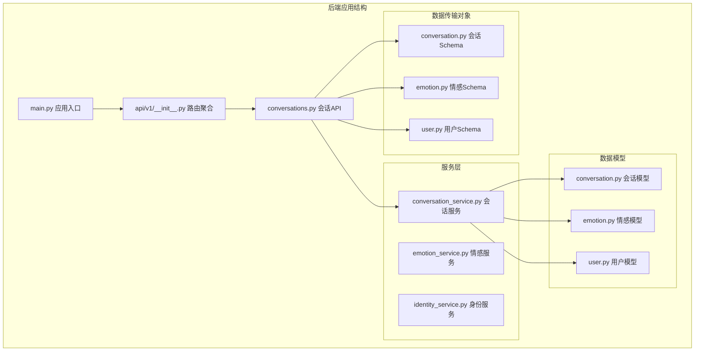
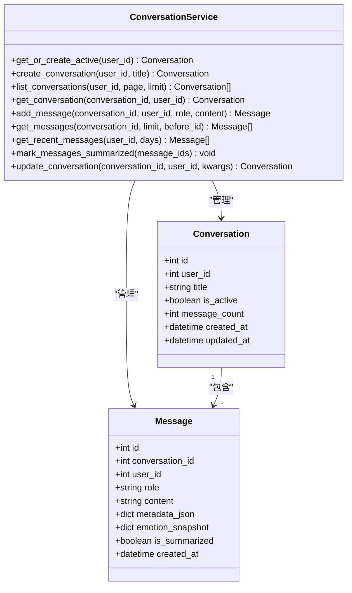
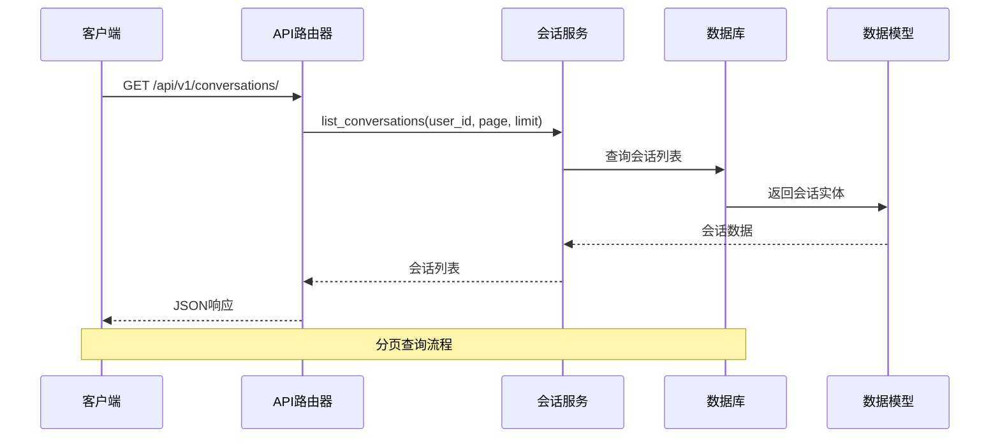
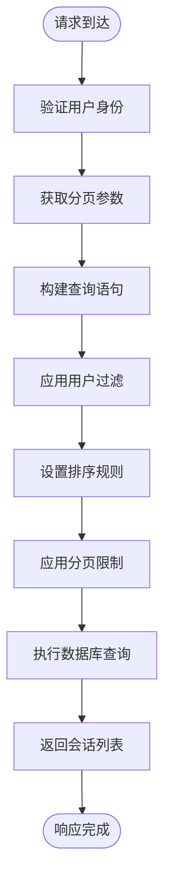
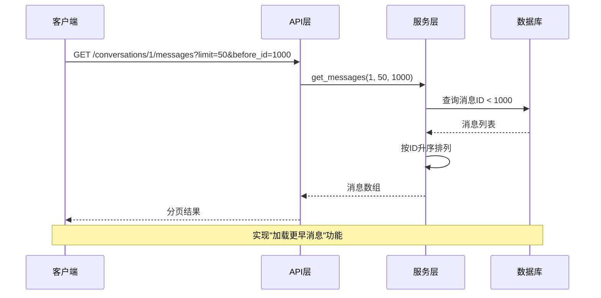
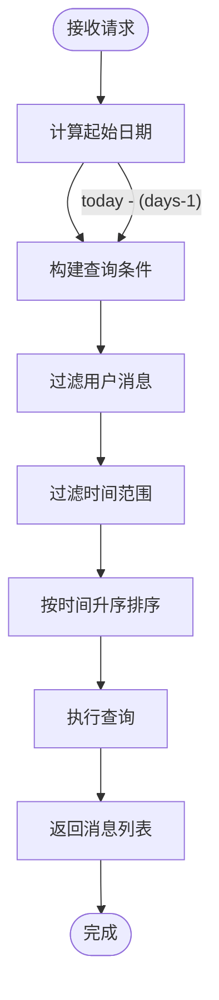
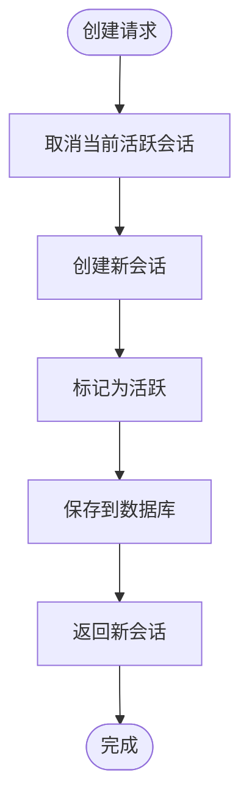
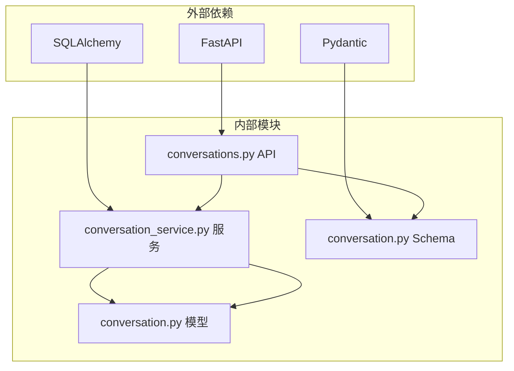
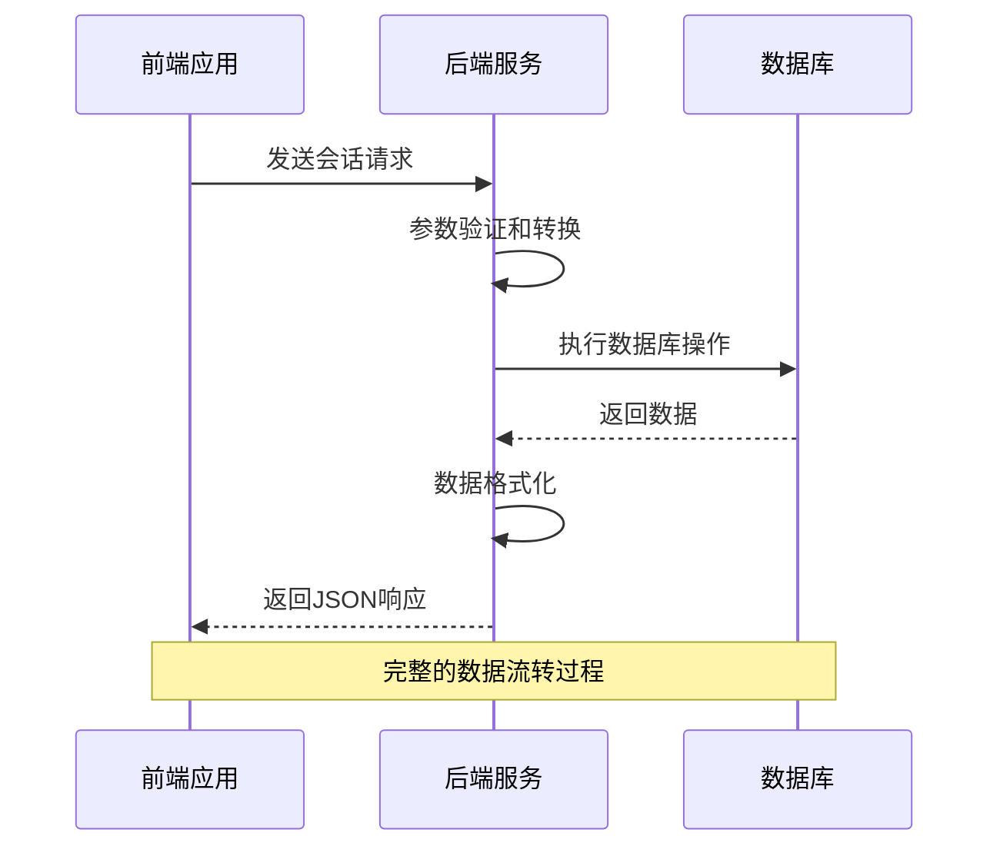

# 会话管理接口

<cite>
**本文档引用的文件**
- [backend/app/api/v1/conversations.py](file://backend/app/api/v1/conversations.py)
- [backend/app/services/conversation_service.py](file://backend/app/services/conversation_service.py)
- [backend/app/models/conversation.py](file://backend/app/models/conversation.py)
- [backend/app/schemas/conversation.py](file://backend/app/schemas/conversation.py)
- [backend/app/main.py](file://backend/app/main.py)
- [backend/app/core/database.py](file://backend/app/core/database.py)
- [backend/app/api/v1/__init__.py](file://backend/app/api/v1/__init__.py)
- [frontend/src/api/chat.ts](file://frontend/src/api/chat.ts)
</cite>

## 目录
1. [简介](#简介)
2. [项目结构](#项目结构)
3. [核心组件](#核心组件)
4. [架构概览](#架构概览)
5. [详细组件分析](#详细组件分析)
6. [依赖分析](#依赖分析)
7. [性能考虑](#性能考虑)
8. [故障排除指南](#故障排除指南)
9. [结论](#结论)

## 简介

XuanJi会话管理接口提供了完整的对话历史管理和消息检索功能。该系统基于FastAPI构建，采用SQLAlchemy进行数据持久化，支持用户会话的创建、查询、消息分页和历史记录管理。

本接口文档专注于会话管理的核心功能，包括会话列表查询、会话详情获取、消息分页检索以及相关的历史记录管理功能。系统设计遵循RESTful API规范，提供清晰的HTTP方法、URL模式、请求参数和响应格式说明。

## 项目结构

XuanJi项目采用模块化架构设计，会话管理功能位于后端应用的API版本化路由中：



**图表来源**
- [backend/app/main.py:30-40](file://backend/app/main.py#L30-L40)
- [backend/app/api/v1/__init__.py:13-22](file://backend/app/api/v1/__init__.py#L13-L22)

**章节来源**
- [backend/app/main.py:30-40](file://backend/app/main.py#L30-L40)
- [backend/app/api/v1/__init__.py:13-22](file://backend/app/api/v1/__init__.py#L13-L22)

## 核心组件

### 数据模型架构

系统使用SQLAlchemy ORM定义了会话和消息的数据模型，支持完整的CRUD操作和关联查询。



**图表来源**
- [backend/app/models/conversation.py:9-41](file://backend/app/models/conversation.py#L9-L41)
- [backend/app/services/conversation_service.py:9-141](file://backend/app/services/conversation_service.py#L9-L141)

### API路由结构

会话管理接口通过FastAPI路由器统一管理，支持多样的查询参数和分页机制：

```mermaid
graph LR
subgraph "会话管理API"
A[/api/v1/conversations/] --> B[GET 列表查询]
A --> C[POST 创建会话]
subgraph "消息查询"
D[/recent-messages] --> E[最近消息]
F[/{conversation_id}/messages] --> G[会话消息]
end
subgraph "分页参数"
H[page: int = 1]
I[limit: int = 20]
J[before_id: int]
K[days: int = 3]
end
B --> H
B --> I
G --> J
E --> K
end
```

**图表来源**
- [backend/app/api/v1/conversations.py:17-71](file://backend/app/api/v1/conversations.py#L17-L71)

**章节来源**
- [backend/app/models/conversation.py:9-41](file://backend/app/models/conversation.py#L9-L41)
- [backend/app/services/conversation_service.py:9-141](file://backend/app/services/conversation_service.py#L9-L141)
- [backend/app/api/v1/conversations.py:17-71](file://backend/app/api/v1/conversations.py#L17-L71)

## 架构概览

XuanJi会话管理系统采用分层架构设计，确保关注点分离和代码可维护性：



**图表来源**
- [backend/app/api/v1/conversations.py:22-31](file://backend/app/api/v1/conversations.py#L22-L31)
- [backend/app/services/conversation_service.py:43-52](file://backend/app/services/conversation_service.py#L43-L52)

系统架构特点：
- **分层设计**：API层、服务层、数据层职责明确
- **依赖注入**：通过FastAPI依赖系统管理数据库连接
- **ORM映射**：SQLAlchemy提供类型安全的数据访问
- **异步支持**：基于FastAPI的异步处理能力

**章节来源**
- [backend/app/main.py:30-40](file://backend/app/main.py#L30-L40)
- [backend/app/core/database.py:14-19](file://backend/app/core/database.py#L14-L19)

## 详细组件分析

### 会话列表查询接口

会话列表查询是用户管理对话历史的核心功能，支持分页和排序控制。

#### 接口定义

| 属性 | 说明 |
|------|------|
| HTTP方法 | GET |
| URL模式 | `/api/v1/conversations/` |
| 认证要求 | 需要用户登录 |
| 响应类型 | `List[ConversationResponse]` |

#### 请求参数

| 参数名 | 类型 | 默认值 | 最小值 | 最大值 | 描述 |
|--------|------|--------|--------|--------|------|
| page | int | 1 | 1 | 无限制 | 页码，从1开始 |
| limit | int | 20 | 1 | 100 | 每页记录数 |

#### 响应格式

```json
[
  {
    "id": 1,
    "user_id": 1001,
    "title": "项目讨论",
    "is_active": true,
    "message_count": 15,
    "created_at": "2024-01-15T10:30:00Z",
    "updated_at": "2024-01-15T14:22:00Z"
  }
]
```

#### 处理逻辑



**图表来源**
- [backend/app/api/v1/conversations.py:22-31](file://backend/app/api/v1/conversations.py#L22-L31)
- [backend/app/services/conversation_service.py:43-52](file://backend/app/services/conversation_service.py#L43-L52)

**章节来源**
- [backend/app/api/v1/conversations.py:22-31](file://backend/app/api/v1/conversations.py#L22-L31)
- [backend/app/services/conversation_service.py:43-52](file://backend/app/services/conversation_service.py#L43-L52)

### 会话消息分页查询

会话消息查询支持基于时间戳的分页浏览，适用于大容量对话历史的高效检索。

#### 接口定义

| 属性 | 说明 |
|------|------|
| HTTP方法 | GET |
| URL模式 | `/api/v1/conversations/{conversation_id}/messages` |
| 认证要求 | 需要用户登录 |
| 响应类型 | `List[MessageResponse]` |

#### 请求参数

| 参数名 | 类型 | 默认值 | 最小值 | 最大值 | 描述 |
|--------|------|--------|--------|--------|------|
| conversation_id | int | - | - | - | 会话标识符 |
| limit | int | 50 | 1 | 200 | 消息数量限制 |
| before_id | int | None | - | - | 时间分界点ID |

#### 响应格式

```json
[
  {
    "id": 101,
    "conversation_id": 1,
    "user_id": 1001,
    "role": "user",
    "content": "如何开始使用XuanJi？",
    "metadata_json": null,
    "emotion_snapshot": null,
    "is_summarized": false,
    "created_at": "2024-01-15T10:30:00Z"
  }
]
```

#### 分页机制

系统支持基于消息ID的时间分页，通过`before_id`参数实现向后滚动的分页体验：



**图表来源**
- [backend/app/api/v1/conversations.py:56-69](file://backend/app/api/v1/conversations.py#L56-L69)
- [backend/app/services/conversation_service.py:87-93](file://backend/app/services/conversation_service.py#L87-L93)

**章节来源**
- [backend/app/api/v1/conversations.py:56-69](file://backend/app/api/v1/conversations.py#L56-L69)
- [backend/app/services/conversation_service.py:87-93](file://backend/app/services/conversation_service.py#L87-L93)

### 最近消息查询

系统提供跨所有会话的最近消息查询功能，支持按天数范围筛选。

#### 接口定义

| 属性 | 说明 |
|------|------|
| HTTP方法 | GET |
| URL模式 | `/api/v1/conversations/recent-messages` |
| 认证要求 | 需要用户登录 |
| 响应类型 | `List[MessageResponse]` |

#### 请求参数

| 参数名 | 类型 | 默认值 | 最小值 | 最大值 | 描述 |
|--------|------|--------|--------|--------|------|
| days | int | 3 | 1 | 30 | 查询天数范围 |

#### 处理逻辑



**图表来源**
- [backend/app/api/v1/conversations.py:45-53](file://backend/app/api/v1/conversations.py#L45-L53)
- [backend/app/services/conversation_service.py:112-121](file://backend/app/services/conversation_service.py#L112-L121)

**章节来源**
- [backend/app/api/v1/conversations.py:45-53](file://backend/app/api/v1/conversations.py#L45-L53)
- [backend/app/services/conversation_service.py:112-121](file://backend/app/services/conversation_service.py#L112-L121)

### 会话创建接口

系统支持动态创建新的会话，自动处理活跃会话的状态管理。

#### 接口定义

| 属性 | 说明 |
|------|------|
| HTTP方法 | POST |
| URL模式 | `/api/v1/conversations/` |
| 认证要求 | 需要用户登录 |
| 响应类型 | `ConversationResponse` |

#### 请求体参数

| 参数名 | 类型 | 是否必需 | 描述 |
|--------|------|----------|------|
| title | string | 否 | 会话标题，可为空 |

#### 处理流程



**图表来源**
- [backend/app/api/v1/conversations.py:34-42](file://backend/app/api/v1/conversations.py#L34-L42)
- [backend/app/services/conversation_service.py:28-41](file://backend/app/services/conversation_service.py#L28-L41)

**章节来源**
- [backend/app/api/v1/conversations.py:34-42](file://backend/app/api/v1/conversations.py#L34-L42)
- [backend/app/services/conversation_service.py:28-41](file://backend/app/services/conversation_service.py#L28-L41)

## 依赖分析

### 组件依赖关系

会话管理接口的依赖关系体现了清晰的关注点分离：



**图表来源**
- [backend/app/api/v1/conversations.py:1-16](file://backend/app/api/v1/conversations.py#L1-L16)
- [backend/app/services/conversation_service.py:1-6](file://backend/app/services/conversation_service.py#L1-L6)

### 数据流分析



**图表来源**
- [backend/app/api/v1/conversations.py:22-71](file://backend/app/api/v1/conversations.py#L22-L71)
- [backend/app/services/conversation_service.py:43-141](file://backend/app/services/conversation_service.py#L43-L141)

**章节来源**
- [backend/app/api/v1/conversations.py:1-16](file://backend/app/api/v1/conversations.py#L1-L16)
- [backend/app/services/conversation_service.py:1-141](file://backend/app/services/conversation_service.py#L1-L141)

## 性能考虑

### 查询优化策略

1. **索引设计**：会话和消息表在`user_id`和`conversation_id`上建立了索引，确保查询性能
2. **分页限制**：默认每页20条记录，最大限制100条，防止过度查询
3. **时间范围查询**：最近消息查询支持最多30天的时间范围，避免全表扫描
4. **消息分页**：支持基于ID的向前滚动分页，提高大数据集的浏览效率

### 缓存策略

系统未实现专门的缓存层，但可以通过以下方式优化：
- 对频繁访问的会话列表实施短期缓存
- 对活跃会话的元数据进行缓存
- 使用数据库连接池管理连接资源

## 故障排除指南

### 常见问题及解决方案

#### 401 未授权错误
**原因**：缺少有效的认证信息
**解决方案**：确保请求包含正确的认证头或令牌

#### 404 会话不存在
**原因**：指定的会话ID不属于当前用户
**解决方案**：验证会话ID的有效性和用户权限

#### 422 参数验证错误
**原因**：请求参数超出有效范围
**解决方案**：检查分页参数是否在允许范围内

#### 500 服务器内部错误
**原因**：数据库连接异常或查询执行失败
**解决方案**：检查数据库连接状态和网络连通性

**章节来源**
- [backend/app/main.py:43-59](file://backend/app/main.py#L43-L59)

## 结论

XuanJi会话管理接口提供了完整而高效的对话历史管理功能。系统采用现代化的架构设计，具备良好的扩展性和维护性。主要优势包括：

1. **完整的功能覆盖**：支持会话创建、查询、消息分页和历史记录管理
2. **优秀的性能设计**：合理的分页策略和索引优化
3. **清晰的API设计**：符合RESTful规范，易于理解和使用
4. **类型安全保证**：基于Pydantic的输入验证和输出序列化

未来可以考虑的功能增强：
- 添加会话删除功能
- 实现会话标签和分类管理
- 增加会话搜索和过滤功能
- 提供批量操作支持