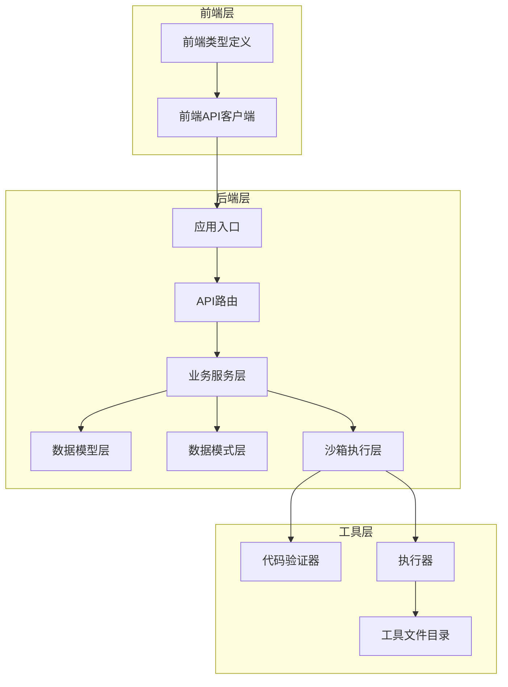
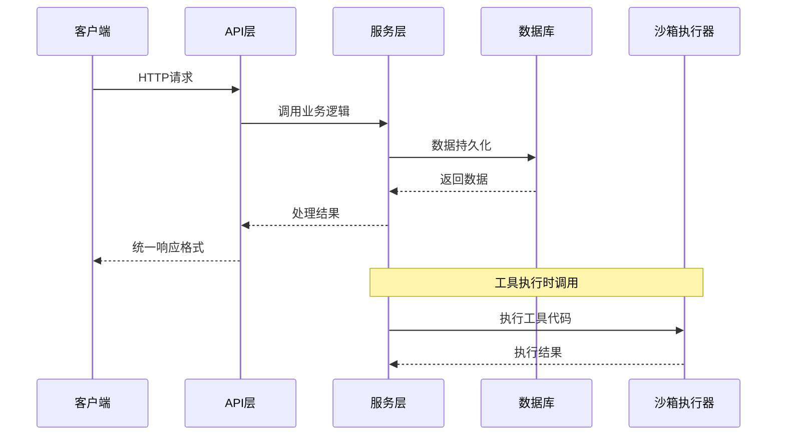
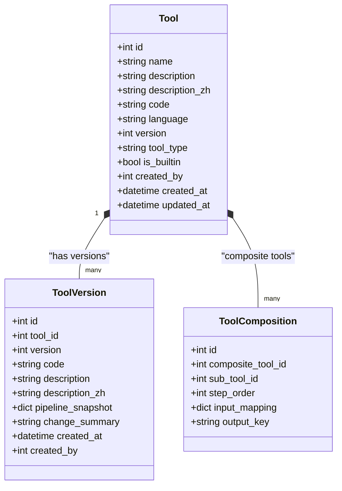
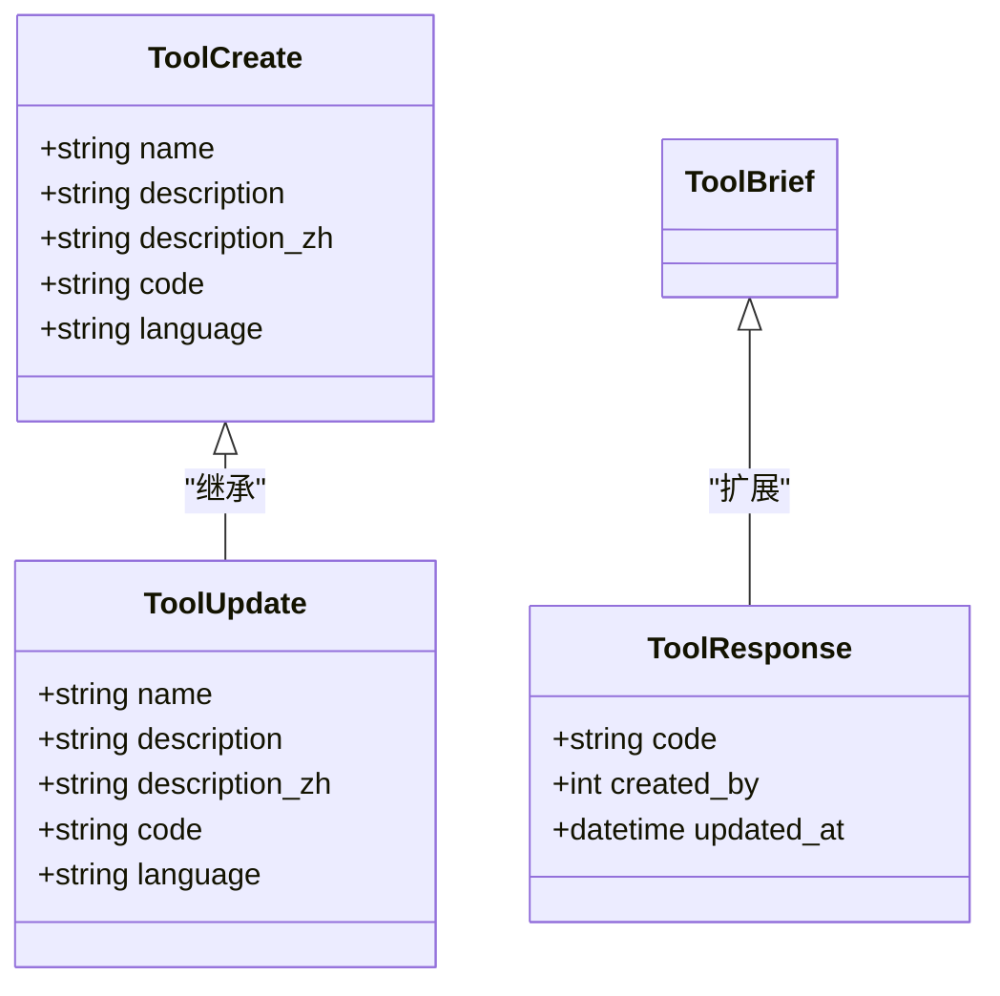
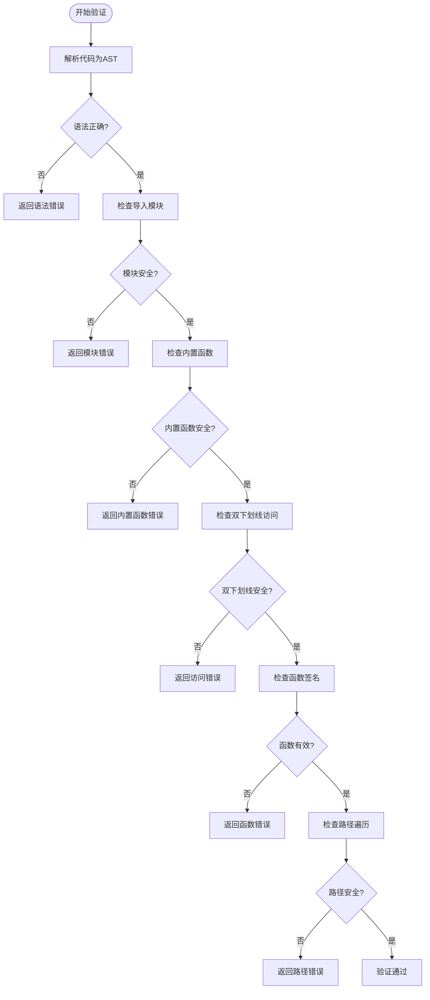
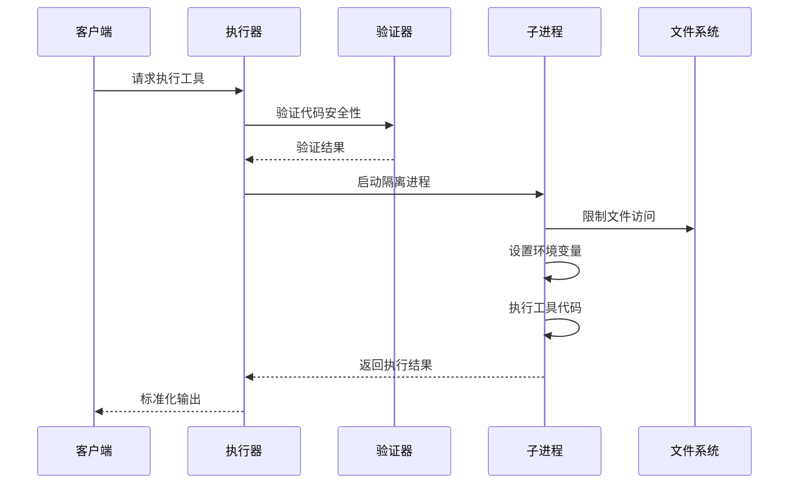
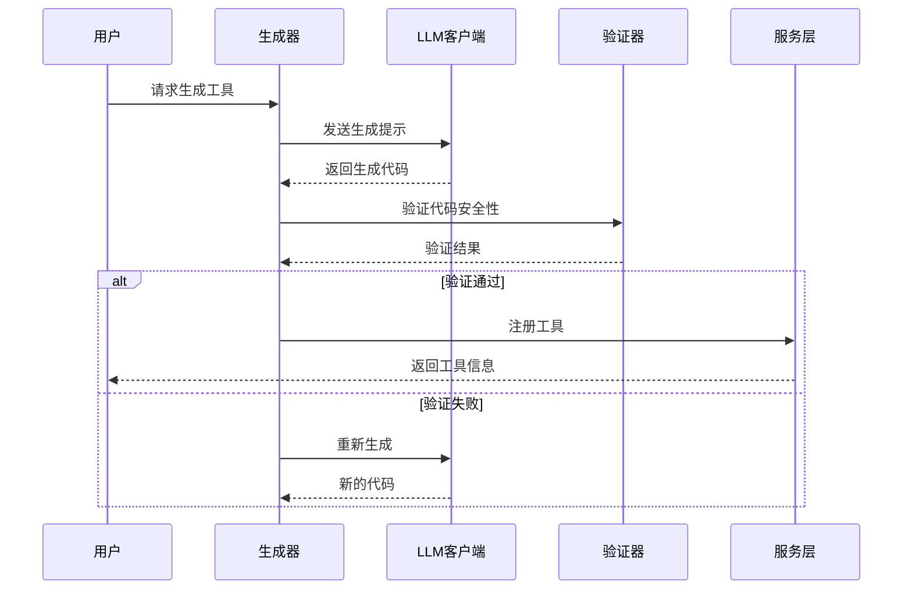
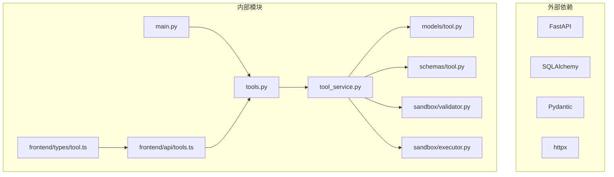

# 工具管理接口

<cite>
**本文档引用的文件**
- [backend/app/api/v1/tools.py](file://backend/app/api/v1/tools.py)
- [backend/app/services/tool_service.py](file://backend/app/services/tool_service.py)
- [backend/app/models/tool.py](file://backend/app/models/tool.py)
- [backend/app/schemas/tool.py](file://backend/app/schemas/tool.py)
- [backend/app/sandbox/validator.py](file://backend/app/sandbox/validator.py)
- [backend/app/sandbox/executor.py](file://backend/app/sandbox/executor.py)
- [backend/app/ai/tool_generator.py](file://backend/app/ai/tool_generator.py)
- [backend/app/main.py](file://backend/app/main.py)
- [frontend/src/api/tools.ts](file://frontend/src/api/tools.ts)
- [frontend/src/types/tool.ts](file://frontend/src/types/tool.ts)
</cite>

## 目录
1. [简介](#简介)
2. [项目结构](#项目结构)
3. [核心组件](#核心组件)
4. [架构概览](#架构概览)
5. [详细组件分析](#详细组件分析)
6. [依赖分析](#依赖分析)
7. [性能考虑](#性能考虑)
8. [故障排除指南](#故障排除指南)
9. [结论](#结论)
10. [附录](#附录)

## 简介

XuanJi工具管理接口是一个基于FastAPI构建的RESTful API系统，专门用于管理AI工具的完整生命周期。该系统支持工具的创建、查询、更新、删除、版本管理和导入导出功能，同时集成了沙箱安全验证机制来确保工具执行的安全性。

系统采用前后端分离架构，后端使用Python 3.11 + FastAPI + SQLAlchemy，前端使用TypeScript + React。工具管理接口遵循RESTful设计原则，提供标准化的HTTP接口来管理各种类型的工具。

## 项目结构

XuanJi项目采用模块化组织方式，主要分为以下层次：



**图表来源**
- [backend/app/main.py:1-79](file://backend/app/main.py#L1-L79)
- [backend/app/api/v1/tools.py:1-169](file://backend/app/api/v1/tools.py#L1-L169)

**章节来源**
- [backend/app/main.py:1-79](file://backend/app/main.py#L1-L79)
- [backend/app/api/v1/tools.py:1-169](file://backend/app/api/v1/tools.py#L1-L169)

## 核心组件

### API路由组件

工具管理API路由位于`/api/v1/tools`路径下，采用FastAPI的装饰器模式定义。路由组件负责处理所有工具相关的HTTP请求，并提供统一的响应格式。

### 服务层组件

工具服务层封装了所有业务逻辑，包括工具的CRUD操作、版本管理、导入导出等功能。服务层通过SQLAlchemy ORM与数据库交互，确保数据的一致性和完整性。

### 数据模型组件

工具数据模型定义了工具表的结构，包括工具的基本信息、版本控制、创建者关联等字段。模型支持工具的原子操作和组合操作两种类型。

### 沙箱安全组件

沙箱执行器提供了隔离的代码执行环境，通过AST分析和进程隔离确保工具执行的安全性。安全验证器检查工具代码中的潜在危险操作。

**章节来源**
- [backend/app/api/v1/tools.py:19-169](file://backend/app/api/v1/tools.py#L19-L169)
- [backend/app/services/tool_service.py:11-222](file://backend/app/services/tool_service.py#L11-L222)
- [backend/app/models/tool.py:9-64](file://backend/app/models/tool.py#L9-L64)

## 架构概览

系统采用分层架构设计，各层职责明确，耦合度低：



**图表来源**
- [backend/app/api/v1/tools.py:25-137](file://backend/app/api/v1/tools.py#L25-L137)
- [backend/app/services/tool_service.py:15-222](file://backend/app/services/tool_service.py#L15-L222)

## 详细组件分析

### 工具管理API接口

#### 工具列表接口
- **HTTP方法**: GET
- **URL模式**: `/api/v1/tools/`
- **功能**: 获取工具列表，按创建时间倒序排列，限制返回100条记录
- **响应格式**: 
  ```json
  {
    "code": 200,
    "message": "success",
    "data": [ToolBrief]
  }
  ```

#### 工具搜索接口
- **HTTP方法**: GET
- **URL模式**: `/api/v1/tools/search`
- **查询参数**: `q` (搜索关键词)
- **功能**: 按名称或描述搜索工具，支持中英文描述搜索
- **响应格式**: 同工具列表接口

#### 工具创建接口
- **HTTP方法**: POST
- **URL模式**: `/api/v1/tools/`
- **请求体**: ToolCreate对象
- **功能**: 创建新工具，自动生成版本号
- **响应格式**: 
  ```json
  {
    "code": 200,
    "message": "Tool created",
    "data": ToolResponse
  }
  ```

#### 工具详情接口
- **HTTP方法**: GET
- **URL模式**: `/api/v1/tools/{tool_id}`
- **路径参数**: `tool_id` (工具ID)
- **功能**: 获取指定工具的详细信息
- **响应格式**: ToolResponse对象

#### 工具更新接口
- **HTTP方法**: PUT
- **URL模式**: `/api/v1/tools/{tool_id}`
- **路径参数**: `tool_id`
- **请求体**: ToolUpdate对象
- **功能**: 更新现有工具，自动保存版本快照并增加版本号
- **响应格式**: ToolResponse对象

#### 工具删除接口
- **HTTP方法**: DELETE
- **URL模式**: `/api/v1/tools/{tool_id}`
- **路径参数**: `tool_id`
- **功能**: 删除指定工具，内置工具不可删除
- **响应格式**: 
  ```json
  {
    "code": 200,
    "message": "Tool deleted",
    "data": null
  }
  ```

#### 工具版本列表接口
- **HTTP方法**: GET
- **URL模式**: `/api/v1/tools/{tool_id}/versions`
- **路径参数**: `tool_id`
- **功能**: 获取工具的所有版本历史，按版本号倒序排列
- **响应格式**: ToolVersionResponse数组

#### 版本回滚接口
- **HTTP方法**: POST
- **URL模式**: `/api/v1/tools/{tool_id}/rollback/{version}`
- **路径参数**: `tool_id`, `version`
- **功能**: 将工具回滚到指定版本，自动保存当前状态作为备份
- **响应格式**: ToolResponse对象

#### 工具导出接口
- **HTTP方法**: GET
- **URL模式**: `/api/v1/tools/export`
- **功能**: 导出所有工具的元数据
- **响应格式**: ToolExportItem数组

#### 工具导入接口
- **HTTP方法**: POST
- **URL模式**: `/api/v1/tools/import`
- **请求体**: ToolImportItem数组
- **功能**: 批量导入工具，支持创建、更新和跳过操作
- **响应格式**: 
  ```json
  {
    "code": 200,
    "message": "Import completed",
    "data": {
      "created": number,
      "updated": number,
      "skipped": number
    }
  }
  ```

**章节来源**
- [backend/app/api/v1/tools.py:25-169](file://backend/app/api/v1/tools.py#L25-L169)
- [frontend/src/api/tools.ts:4-43](file://frontend/src/api/tools.ts#L4-L43)

### 数据模型分析

#### 工具模型结构
工具模型定义了完整的工具数据结构：



**图表来源**
- [backend/app/models/tool.py:9-64](file://backend/app/models/tool.py#L9-L64)

#### 数据验证模式
系统使用Pydantic模型进行数据验证：



**图表来源**
- [backend/app/schemas/tool.py:7-74](file://backend/app/schemas/tool.py#L7-L74)

**章节来源**
- [backend/app/models/tool.py:9-64](file://backend/app/models/tool.py#L9-L64)
- [backend/app/schemas/tool.py:7-74](file://backend/app/schemas/tool.py#L7-L74)

### 沙箱安全验证

#### 代码安全验证
沙箱验证器使用AST分析确保工具代码的安全性：



**图表来源**
- [backend/app/sandbox/validator.py:33-95](file://backend/app/sandbox/validator.py#L33-L95)

#### 执行器安全机制
执行器提供多层安全保护：



**图表来源**
- [backend/app/sandbox/executor.py:13-101](file://backend/app/sandbox/executor.py#L13-L101)

**章节来源**
- [backend/app/sandbox/validator.py:33-95](file://backend/app/sandbox/validator.py#L33-L95)
- [backend/app/sandbox/executor.py:13-101](file://backend/app/sandbox/executor.py#L13-L101)

### AI工具生成器

系统集成了AI驱动的工具生成能力：



**图表来源**
- [backend/app/ai/tool_generator.py:10-68](file://backend/app/ai/tool_generator.py#L10-L68)

**章节来源**
- [backend/app/ai/tool_generator.py:10-129](file://backend/app/ai/tool_generator.py#L10-L129)

## 依赖分析

系统采用模块化设计，各组件间依赖关系清晰：



**图表来源**
- [backend/app/main.py:10-40](file://backend/app/main.py#L10-L40)
- [backend/app/api/v1/tools.py:1-17](file://backend/app/api/v1/tools.py#L1-L17)

**章节来源**
- [backend/app/main.py:10-40](file://backend/app/main.py#L10-L40)
- [backend/app/api/v1/tools.py:1-17](file://backend/app/api/v1/tools.py#L1-L17)

## 性能考虑

### 数据库优化
- 使用索引优化常用查询字段（name、created_at）
- 限制列表查询数量避免大数据集影响
- 批量操作减少数据库往返次数

### 缓存策略
- 前端缓存工具列表和详情数据
- 后端查询结果缓存短期热点数据
- 版本历史查询结果缓存

### 并发处理
- 异步API设计支持高并发请求
- 数据库连接池管理
- 沙箱执行超时控制

## 故障排除指南

### 常见错误类型

#### 数据验证错误
- **症状**: 请求参数不符合模型定义
- **解决方案**: 检查请求体格式，确保必填字段完整

#### 权限错误
- **症状**: 403 Forbidden错误
- **解决方案**: 确认用户身份认证，检查工具编辑权限

#### 资源不存在
- **症状**: 404 Not Found错误
- **解决方案**: 验证工具ID有效性

#### 安全验证失败
- **症状**: 工具代码被拒绝执行
- **解决方案**: 检查代码中是否包含被阻止的模块或函数

**章节来源**
- [backend/app/services/tool_service.py:60-82](file://backend/app/services/tool_service.py#L60-L82)
- [backend/app/sandbox/validator.py:33-95](file://backend/app/sandbox/validator.py#L33-L95)

## 结论

XuanJi工具管理接口提供了一个完整、安全、易用的工具生命周期管理系统。系统通过严格的权限控制、沙箱安全验证和版本管理机制，确保了工具使用的安全性。同时，标准化的API设计和丰富的功能特性使得开发者能够高效地管理各种类型的AI工具。

系统的模块化架构设计便于维护和扩展，前后端分离的实现方式提高了开发效率。通过集成AI工具生成功能，进一步提升了工具开发的自动化程度。

## 附录

### API使用示例

#### 工具CRUD操作示例
```typescript
// 创建工具
const newTool = await createTool({
  name: "示例工具",
  description: "这是一个示例工具",
  code: "def example_tool(params): return {'result': 'success'}",
  language: "python"
});

// 获取工具列表
const tools = await listTools();

// 更新工具
const updatedTool = await updateTool(toolId, {
  description: "更新后的描述"
});

// 删除工具
await deleteTool(toolId);
```

#### 工具执行示例
```typescript
// 执行工具
const result = await executeTool(toolId, {
  param1: "value1",
  param2: "value2"
});
```

#### 版本管理示例
```typescript
// 获取版本历史
const versions = await getToolVersions(toolId);

// 回滚到指定版本
const rolledBackTool = await rollbackToolVersion(toolId, targetVersion);
```

### 最佳实践

1. **工具命名规范**: 使用有意义的工具名称，避免特殊字符
2. **代码安全**: 遵循沙箱安全规则，避免使用被阻止的模块
3. **版本控制**: 变更前自动保存版本快照，便于回滚
4. **错误处理**: 实现完善的异常处理机制
5. **性能优化**: 合理使用缓存，避免不必要的重复查询