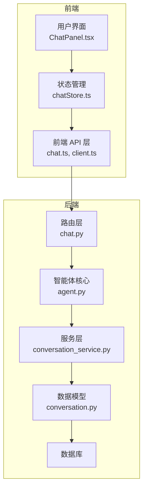
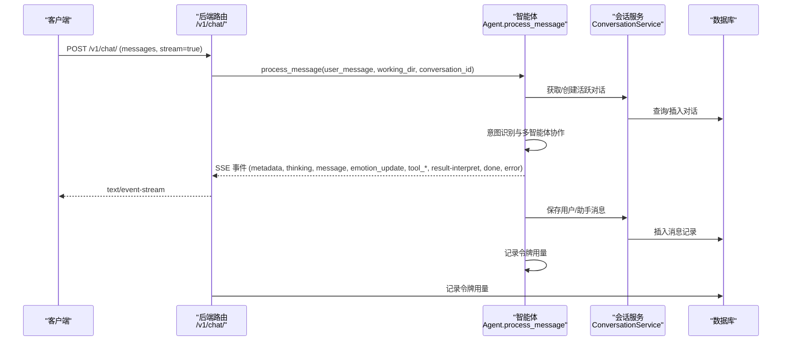
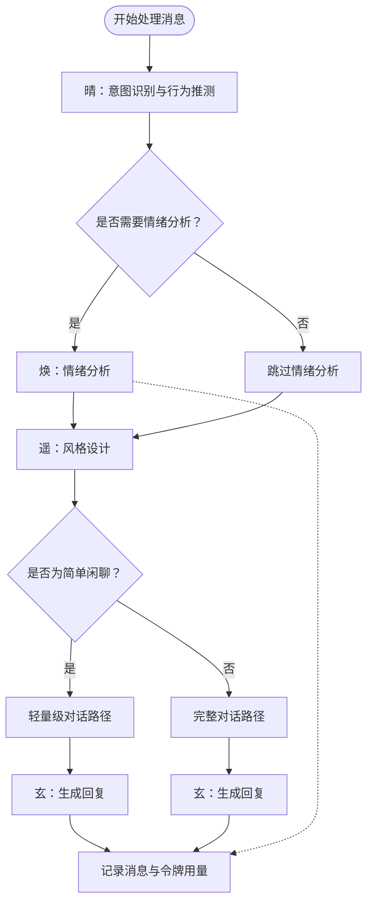
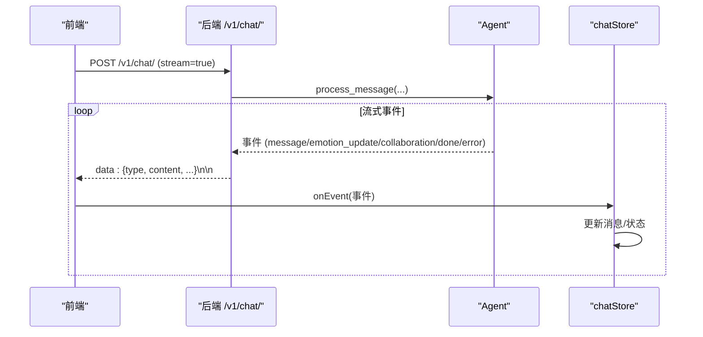
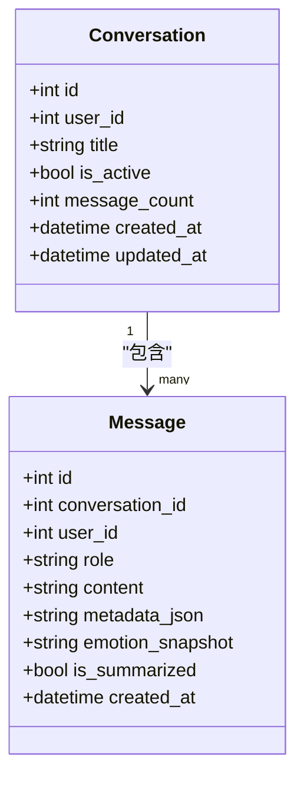
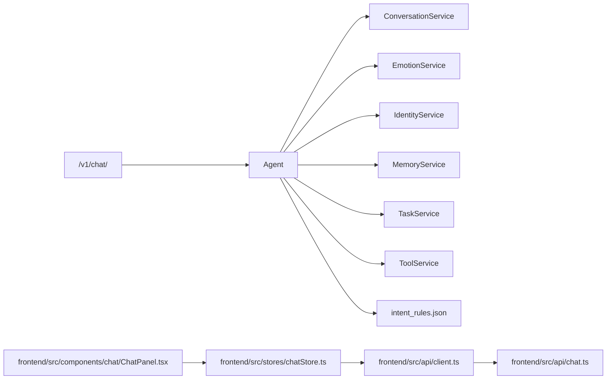

# 聊天对话接口

<cite>
**本文档引用的文件**
- [backend/app/api/v1/chat.py](file://backend/app/api/v1/chat.py)
- [backend/app/schemas/chat.py](file://backend/app/schemas/chat.py)
- [backend/app/ai/agent.py](file://backend/app/ai/agent.py)
- [backend/app/services/conversation_service.py](file://backend/app/services/conversation_service.py)
- [backend/app/models/conversation.py](file://backend/app/models/conversation.py)
- [backend/app/api/v1/conversations.py](file://backend/app/api/v1/conversations.py)
- [backend/app/schemas/conversation.py](file://backend/app/schemas/conversation.py)
- [backend/app/core/exceptions.py](file://backend/app/core/exceptions.py)
- [frontend/src/api/chat.ts](file://frontend/src/api/chat.ts)
- [frontend/src/api/client.ts](file://frontend/src/api/client.ts)
- [frontend/src/stores/chatStore.ts](file://frontend/src/stores/chatStore.ts)
- [frontend/src/types/chat.ts](file://frontend/src/types/chat.ts)
- [frontend/src/components/chat/ChatPanel.tsx](file://frontend/src/components/chat/ChatPanel.tsx)
- [backend/app/ai/intent_rules.json](file://backend/app/ai/intent_rules.json)
</cite>

## 目录
1. [简介](#简介)
2. [项目结构](#项目结构)
3. [核心组件](#核心组件)
4. [架构概览](#架构概览)
5. [详细组件分析](#详细组件分析)
6. [依赖分析](#依赖分析)
7. [性能考虑](#性能考虑)
8. [故障排除指南](#故障排除指南)
9. [结论](#结论)
10. [附录](#附录)

## 简介
本文件为 XuanJi 项目的聊天对话接口提供完整的 API 文档。重点覆盖实时聊天接口 `/v1/chat/` 的 HTTP 方法、URL 模式、请求参数、响应格式以及 SSE 事件类型。文档还深入解析多智能体协作机制（晴、焕、机、遥、玄）、流式输出处理、对话上下文管理，并提供聊天交互示例、流式响应处理示例和错误处理示例，帮助开发者快速实现完整的聊天对话功能。

## 项目结构
XuanJi 采用前后端分离架构，后端基于 FastAPI 提供 REST API 和 SSE 流式响应，前端使用 TypeScript + React 实现聊天界面与流式事件处理。

**图表来源**
- [backend/app/api/v1/chat.py:1-106](file://backend/app/api/v1/chat.py#L1-L106)
- [backend/app/ai/agent.py:1-800](file://backend/app/ai/agent.py#L1-L800)
- [backend/app/services/conversation_service.py:1-141](file://backend/app/services/conversation_service.py#L1-L141)
- [backend/app/models/conversation.py:1-41](file://backend/app/models/conversation.py#L1-L41)

**章节来源**
- [backend/app/api/v1/chat.py:1-106](file://backend/app/api/v1/chat.py#L1-L106)
- [frontend/src/api/chat.ts:1-49](file://frontend/src/api/chat.ts#L1-L49)

## 核心组件
- 后端路由与处理器：负责接收聊天请求、选择流式或非流式响应、调用智能体并记录令牌用量。
- 智能体（Agent）：协调多智能体协作（晴、焕、机、遥、玄），处理意图识别、工具匹配/生成、结果解读与对话上下文注入。
- 会话服务：管理对话历史、消息持久化、上下文检索与最近消息聚合。
- 前端 API 客户端：封装通用请求与 SSE 流式请求，统一错误处理。
- 前端状态管理：维护消息列表、流式状态、协作日志展示与取消流控制。

**章节来源**
- [backend/app/ai/agent.py:35-800](file://backend/app/ai/agent.py#L35-L800)
- [backend/app/services/conversation_service.py:9-141](file://backend/app/services/conversation_service.py#L9-L141)
- [frontend/src/api/client.ts:1-119](file://frontend/src/api/client.ts#L1-L119)
- [frontend/src/stores/chatStore.ts:1-291](file://frontend/src/stores/chatStore.ts#L1-L291)

## 架构概览
聊天对话接口通过 SSE 实现实时流式响应，后端智能体在处理过程中持续产生多种事件类型，前端通过事件回调逐步渲染 UI。

**图表来源**
- [backend/app/api/v1/chat.py:40-105](file://backend/app/api/v1/chat.py#L40-L105)
- [backend/app/ai/agent.py:78-792](file://backend/app/ai/agent.py#L78-L792)
- [backend/app/services/conversation_service.py:13-85](file://backend/app/services/conversation_service.py#L13-L85)

## 详细组件分析

### 接口定义：实时聊天 /v1/chat/
- HTTP 方法：POST
- URL 模式：/v1/chat/
- 请求头：
  - Content-Type: application/json
  - Authorization: Bearer {token}（可选，取决于认证中间件）
- 请求体字段（ChatRequest）：
  - messages: 数组，元素为 ChatMessage
    - role: 字符串，取值范围："user" | "assistant" | "system"
    - content: 字符串，消息内容
  - stream: 布尔值，默认 true；是否启用流式响应
  - working_dir: 字符串，可选；工作目录路径
  - conversation_id: 整数，可选；指定对话 ID，若不存在则自动创建活跃对话
- 响应格式：
  - 流式响应（text/event-stream）：每行以 data: 开头的 JSON 对象
  - 非流式响应（当 stream=false）：JSON 对象，包含 code、message、data 字段
    - data.content: 字符串，完整回复文本

SSE 事件类型说明：
- metadata：首次事件，携带 conversation_id，用于前端绑定当前对话
- thinking：表示智能体正在进行某步骤（如搜索工具、解读结果）
- message：流式消息片段，content 为增量文本
- emotion_update：情绪分析结果更新，content 为 JSON 字符串，包含 primary_emotion、emotion_intensity、deep_need、risk_level
- tool_selected：匹配到工具
- tool_executing：正在执行工具
- tool_result：工具执行结果，content 为 JSON，包含 tool、success、result
- tool_generating：未找到工具，正在生成新工具
- tool_iterated：工具迭代更新，content 为 JSON，包含 tool_name、version、change_summary、reason
- collaboration：协作日志，content 为空，collaboration 字段为步骤数组
- done：流结束事件，携带 conversation_id、usages（令牌用量列表）
- error：错误事件，content 为错误信息字符串

**章节来源**
- [backend/app/api/v1/chat.py:40-105](file://backend/app/api/v1/chat.py#L40-L105)
- [backend/app/schemas/chat.py:9-14](file://backend/app/schemas/chat.py#L9-L14)
- [backend/app/ai/agent.py:78-792](file://backend/app/ai/agent.py#L78-L792)
- [frontend/src/types/chat.ts:34-47](file://frontend/src/types/chat.ts#L34-L47)

### 多智能体协作机制
智能体在处理消息时遵循以下协作流程：
- 晴（ Qing ）：行为推测与意图识别，决定是否需要情绪分析与下一步协作
- 焕（ Huan ）：情绪分析，产出情绪快照，供后续模块使用
- 遥（ Yao ）：风格设计，基于记忆与上下文生成回复风格指导
- 玄（ Xuan ）：对话生成与结果解读，负责最终回复文本
- 机（ Ji ）：工具匹配、生成与执行，必要时进行工具迭代

协作日志（collaboration）记录各智能体的决策与结果摘要，完成后通过 collaboration 事件推送至前端。

**图表来源**
- [backend/app/ai/agent.py:118-273](file://backend/app/ai/agent.py#L118-L273)
- [backend/app/ai/agent.py:344-359](file://backend/app/ai/agent.py#L344-L359)

**章节来源**
- [backend/app/ai/agent.py:118-273](file://backend/app/ai/agent.py#L118-L273)
- [backend/app/ai/agent.py:344-359](file://backend/app/ai/agent.py#L344-L359)

### 流式输出处理
- 后端：通过 StreamingResponse 返回 text/event-stream，逐条 yield 事件对象
- 前端：使用 streamRequest 解析 SSE 数据，按行解析 data: 前缀后的 JSON，触发 onEvent 回调
- 前端状态管理：根据事件类型更新消息列表、协作日志、情绪快照与流式状态

**图表来源**
- [frontend/src/api/client.ts:46-118](file://frontend/src/api/client.ts#L46-L118)
- [frontend/src/stores/chatStore.ts:144-289](file://frontend/src/stores/chatStore.ts#L144-L289)
- [backend/app/api/v1/chat.py:61-87](file://backend/app/api/v1/chat.py#L61-L87)

**章节来源**
- [frontend/src/api/client.ts:46-118](file://frontend/src/api/client.ts#L46-L118)
- [frontend/src/stores/chatStore.ts:144-289](file://frontend/src/stores/chatStore.ts#L144-L289)
- [backend/app/api/v1/chat.py:61-87](file://backend/app/api/v1/chat.py#L61-L87)

### 对话上下文管理
- 会话持久化：根据 conversation_id 获取或创建活跃对话，若未提供则自动创建
- 最近消息注入：在生成回复前从最近消息中注入上下文，避免重复用户消息
- 消息存储：保存用户与助手消息，支持 metadata_json 存储工具执行与协作日志信息

**图表来源**
- [backend/app/models/conversation.py:9-41](file://backend/app/models/conversation.py#L9-L41)

**章节来源**
- [backend/app/services/conversation_service.py:13-110](file://backend/app/services/conversation_service.py#L13-L110)
- [backend/app/models/conversation.py:9-41](file://backend/app/models/conversation.py#L9-L41)

### 令牌用量记录
- 后端在 SSE 流中通过 done 事件携带 usages 列表，前端收到后触发记录逻辑
- 令牌用量包括 prompt_tokens、completion_tokens、total_tokens、model、role_name 等字段
- 非流式模式下，在聚合完所有消息片段后一次性记录

**章节来源**
- [backend/app/api/v1/chat.py:22-37](file://backend/app/api/v1/chat.py#L22-L37)
- [backend/app/api/v1/chat.py:73-76](file://backend/app/api/v1/chat.py#L73-L76)
- [backend/app/api/v1/chat.py:102-103](file://backend/app/api/v1/chat.py#L102-L103)

### 会话与消息管理接口
- 获取会话列表：GET /v1/conversations/
- 创建会话：POST /v1/conversations/
- 获取最近消息：GET /v1/conversations/recent-messages
- 获取指定会话消息：GET /v1/conversations/{conversation_id}/messages

这些接口与聊天接口配合，支持前端加载历史对话与消息。

**章节来源**
- [backend/app/api/v1/conversations.py:22-69](file://backend/app/api/v1/conversations.py#L22-L69)
- [backend/app/schemas/conversation.py:6-34](file://backend/app/schemas/conversation.py#L6-L34)

## 依赖分析
- 后端路由依赖智能体与服务层，智能体再依赖多个服务（会话、情绪、身份、记忆、任务、工具等）
- 前端 API 客户端依赖通用请求与 SSE 流式请求函数，状态管理依赖 API 客户端
- 意图规则文件为智能体提供关键词与模式匹配基础

**图表来源**
- [backend/app/api/v1/chat.py:11-17](file://backend/app/api/v1/chat.py#L11-L17)
- [backend/app/ai/agent.py:25-62](file://backend/app/ai/agent.py#L25-L62)
- [frontend/src/api/chat.ts:1-49](file://frontend/src/api/chat.ts#L1-L49)
- [frontend/src/stores/chatStore.ts:1-23](file://frontend/src/stores/chatStore.ts#L1-L23)
- [backend/app/ai/intent_rules.json:1-306](file://backend/app/ai/intent_rules.json#L1-L306)

**章节来源**
- [backend/app/api/v1/chat.py:11-17](file://backend/app/api/v1/chat.py#L11-L17)
- [backend/app/ai/agent.py:25-62](file://backend/app/ai/agent.py#L25-L62)
- [frontend/src/api/chat.ts:1-49](file://frontend/src/api/chat.ts#L1-L49)
- [frontend/src/stores/chatStore.ts:1-23](file://frontend/src/stores/chatStore.ts#L1-L23)
- [backend/app/ai/intent_rules.json:1-306](file://backend/app/ai/intent_rules.json#L1-L306)

## 性能考虑
- 流式响应：优先使用 stream=true，避免一次性聚合大文本导致内存峰值过高
- 令牌用量：在 done 事件后记录，避免阻塞用户交互
- 协作日志异步处理：前端使用 requestIdleCallback 或 setTimeout 异步应用协作日志，降低主线程阻塞
- 超时控制：工具执行与结果解读设置流式超时，防止长时间阻塞
- 记忆压缩与画像更新：后台触发，避免影响主流程

[本节为通用性能建议，无需特定文件来源]

## 故障排除指南
- SSE 解析错误：前端检测到连续解析错误超过阈值会抛出异常，需检查后端事件格式与编码
- 连接中断：后端捕获 asyncio.CancelledError 并记录日志，前端通过 AbortController 主动取消
- LLM 配置缺失：当智能体初始化时检测到配置错误，会立即返回 error 事件
- 会话 ID 不匹配：前端在收到事件时校验 conversation_id，防止跨会话事件污染
- 错误事件处理：后端在异常情况下返回 error 事件，前端将其合并到最新助手消息末尾

**章节来源**
- [frontend/src/api/client.ts:77-91](file://frontend/src/api/client.ts#L77-L91)
- [backend/app/api/v1/chat.py:78-85](file://backend/app/api/v1/chat.py#L78-L85)
- [backend/app/core/exceptions.py:1-20](file://backend/app/core/exceptions.py#L1-L20)
- [frontend/src/stores/chatStore.ts:150-162](file://frontend/src/stores/chatStore.ts#L150-L162)
- [frontend/src/stores/chatStore.ts:250-259](file://frontend/src/stores/chatStore.ts#L250-L259)

## 结论
XuanJi 的聊天对话接口通过 SSE 实现高效的流式交互，结合多智能体协作机制与完善的上下文管理，为用户提供自然流畅的对话体验。开发者可依据本文档的接口定义、事件类型与处理流程，快速集成实时聊天功能，并利用协作日志与情绪分析增强对话的个性化与情感化。

[本节为总结性内容，无需特定文件来源]

## 附录

### API 定义汇总
- 路由：/v1/chat/
- 方法：POST
- 请求体：ChatRequest
  - messages: ChatMessage[]
  - stream: boolean (默认 true)
  - working_dir: string (可选)
  - conversation_id: number (可选)
- 响应：
  - 流式：text/event-stream，事件类型见上文
  - 非流式：{"code": 200, "message": "success", "data": {"content": string}}

**章节来源**
- [backend/app/api/v1/chat.py:40-105](file://backend/app/api/v1/chat.py#L40-L105)
- [backend/app/schemas/chat.py:9-14](file://backend/app/schemas/chat.py#L9-L14)

### 前端调用示例
- 发送消息并处理流式事件：参考 [frontend/src/api/chat.ts:35-48](file://frontend/src/api/chat.ts#L35-L48)
- 流式请求解析：参考 [frontend/src/api/client.ts:46-118](file://frontend/src/api/client.ts#L46-L118)
- 状态管理与事件处理：参考 [frontend/src/stores/chatStore.ts:144-289](file://frontend/src/stores/chatStore.ts#L144-L289)

**章节来源**
- [frontend/src/api/chat.ts:35-48](file://frontend/src/api/chat.ts#L35-L48)
- [frontend/src/api/client.ts:46-118](file://frontend/src/api/client.ts#L46-L118)
- [frontend/src/stores/chatStore.ts:144-289](file://frontend/src/stores/chatStore.ts#L144-L289)