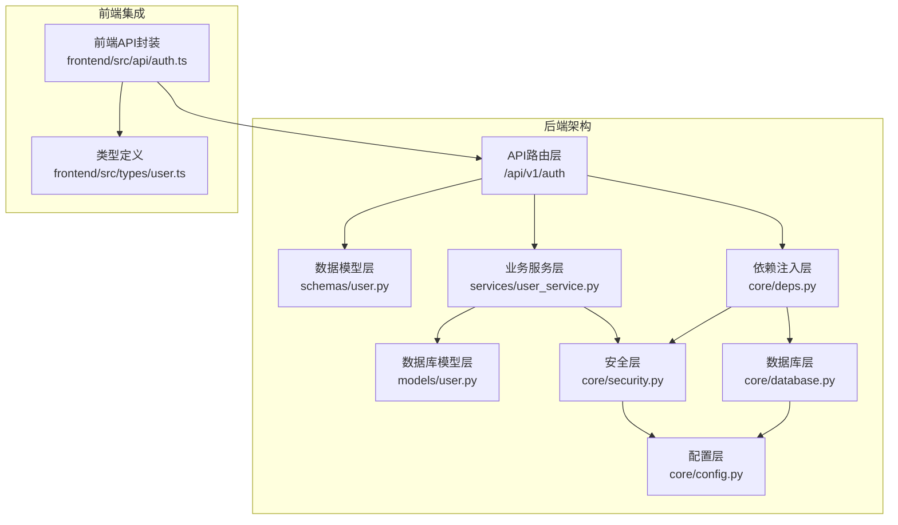
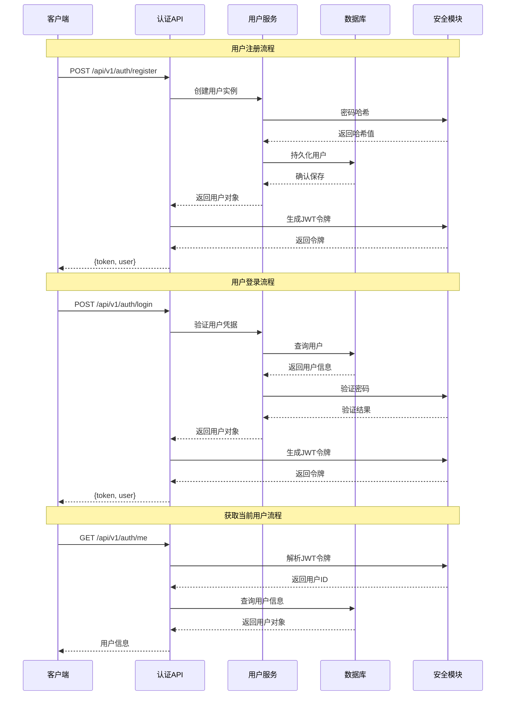
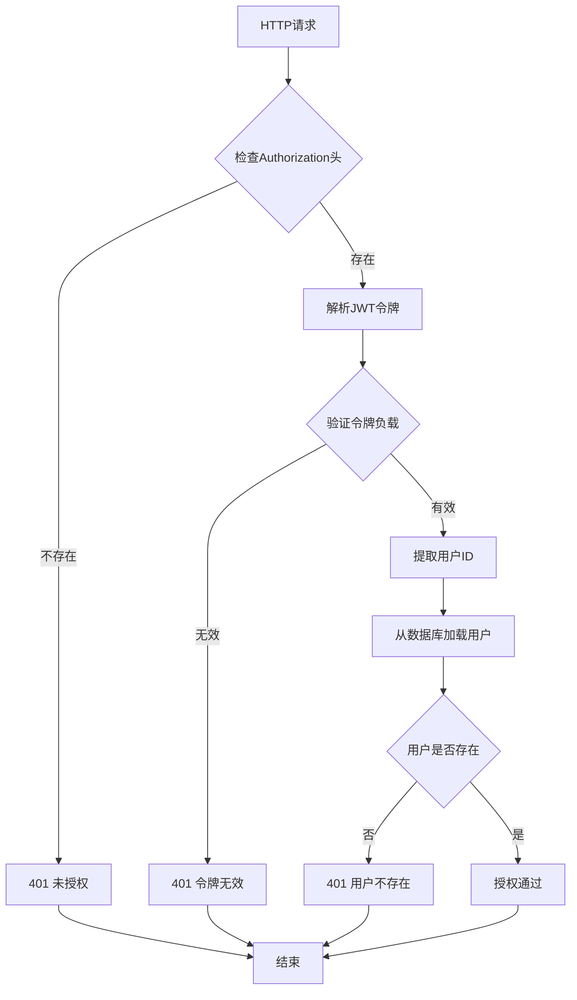
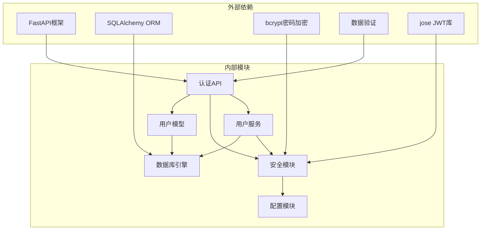

# 认证与授权接口

<cite>
**本文档引用的文件**
- [backend/app/api/v1/auth.py](file://backend/app/api/v1/auth.py)
- [backend/app/schemas/user.py](file://backend/app/schemas/user.py)
- [backend/app/models/user.py](file://backend/app/models/user.py)
- [backend/app/services/user_service.py](file://backend/app/services/user_service.py)
- [backend/app/core/security.py](file://backend/app/core/security.py)
- [backend/app/core/deps.py](file://backend/app/core/deps.py)
- [backend/app/core/config.py](file://backend/app/core/config.py)
- [backend/app/core/database.py](file://backend/app/core/database.py)
- [backend/app/api/v1/__init__.py](file://backend/app/api/v1/__init__.py)
- [backend/app/main.py](file://backend/app/main.py)
- [frontend/src/api/auth.ts](file://frontend/src/api/auth.ts)
- [frontend/src/types/user.ts](file://frontend/src/types/user.ts)
</cite>

## 目录
1. [简介](#简介)
2. [项目结构](#项目结构)
3. [核心组件](#核心组件)
4. [架构概览](#架构概览)
5. [详细组件分析](#详细组件分析)
6. [依赖关系分析](#依赖关系分析)
7. [性能考虑](#性能考虑)
8. [故障排除指南](#故障排除指南)
9. [结论](#结论)

## 简介

XuanJi认证与授权接口提供了完整的用户身份验证和授权功能，基于JWT（JSON Web Token）技术实现。该系统支持用户注册、登录、获取当前用户信息等核心认证功能，并通过中间件实现统一的权限控制。

本系统采用FastAPI框架构建，使用SQLAlchemy进行数据库操作，bcrypt进行密码加密，Pydantic进行数据验证。JWT令牌有效期为7天，支持CORS跨域访问配置。

## 项目结构

认证模块位于后端应用的API版本化路由中，采用分层架构设计：



**图表来源**
- [backend/app/api/v1/auth.py:1-61](file://backend/app/api/v1/auth.py#L1-L61)
- [backend/app/schemas/user.py:1-68](file://backend/app/schemas/user.py#L1-L68)
- [backend/app/services/user_service.py:1-46](file://backend/app/services/user_service.py#L1-L46)

**章节来源**
- [backend/app/api/v1/auth.py:1-61](file://backend/app/api/v1/auth.py#L1-L61)
- [backend/app/api/v1/__init__.py:1-23](file://backend/app/api/v1/__init__.py#L1-L23)

## 核心组件

### JWT令牌管理

系统使用HS256算法生成JWT令牌，令牌包含以下关键信息：
- 用户标识符（sub字段）
- 过期时间戳（exp字段）
- 默认有效期：7天

令牌生成和验证流程：
1. 用户注册或登录成功后生成访问令牌
2. 前端在后续请求中通过Authorization头携带令牌
3. 后端通过依赖注入验证令牌有效性
4. 解析令牌获取用户ID并加载用户信息

### 数据验证规则

系统实现了严格的输入验证机制：

**用户名验证规则**：
- 长度：4-20个字符
- 字符集：仅允许字母、数字、下划线
- 禁止：纯数字用户名

**密码验证规则**：
- 长度：至少8个字符
- 必须包含：大写字母、小写字母、数字、特殊字符
- 特殊字符集合：!"#$%&'()*+,-./:;<=>?@[\]^_`{|}~

### 用户模型

数据库用户表结构包含以下字段：
- id：自增主键
- username：唯一用户名，支持索引
- email：唯一邮箱地址，支持索引  
- hashed_password：加密后的密码
- created_at：创建时间
- updated_at：更新时间
- deleted_at：软删除标记

**章节来源**
- [backend/app/core/security.py:1-38](file://backend/app/core/security.py#L1-L38)
- [backend/app/schemas/user.py:1-68](file://backend/app/schemas/user.py#L1-L68)
- [backend/app/models/user.py:1-23](file://backend/app/models/user.py#L1-L23)

## 架构概览

认证系统的整体架构采用分层设计，确保关注点分离和代码可维护性：



**图表来源**
- [backend/app/api/v1/auth.py:14-60](file://backend/app/api/v1/auth.py#L14-L60)
- [backend/app/services/user_service.py:12-31](file://backend/app/services/user_service.py#L12-L31)
- [backend/app/core/security.py:24-37](file://backend/app/core/security.py#L24-L37)

## 详细组件分析

### 认证API路由

认证模块提供三个核心接口，全部位于`/api/v1/auth`路径下：

#### 注册接口 (/api/v1/auth/register)

**HTTP方法**：POST
**请求参数**：UserCreate
**响应格式**：标准响应格式

请求参数结构（UserCreate）：
- username: string (4-20字符，仅字母数字下划线)
- email: string (有效邮箱格式)
- password: string (符合密码强度要求)

响应结构：
```json
{
  "code": 200,
  "message": "success",
  "data": {
    "token": "JWT令牌字符串",
    "user": {
      "id": 1,
      "username": "string",
      "email": "string",
      "created_at": "2024-01-01T00:00:00Z"
    }
  }
}
```

状态码说明：
- 200：注册成功
- 400：用户名已存在
- 422：请求参数验证失败
- 500：服务器内部错误

#### 登录接口 (/api/v1/auth/login)

**HTTP方法**：POST  
**请求参数**：UserLogin
**响应格式**：标准响应格式

请求参数结构（UserLogin）：
- username: string (已注册的用户名)
- password: string (用户密码)

响应结构：
```json
{
  "code": 200,
  "message": "success", 
  "data": {
    "token": "JWT令牌字符串",
    "user": {
      "id": 1,
      "username": "string", 
      "email": "string",
      "created_at": "2024-01-01T00:00:00Z"
    }
  }
}
```

状态码说明：
- 200：登录成功
- 401：用户名或密码错误
- 422：请求参数验证失败
- 500：服务器内部错误

#### 获取当前用户接口 (/api/v1/auth/me)

**HTTP方法**：GET
**请求参数**：Authorization Bearer Token
**响应格式**：标准响应格式

请求头要求：
- Authorization: Bearer {JWT令牌}

响应结构：
```json
{
  "code": 200,
  "message": "success",
  "data": {
    "id": 1,
    "username": "string",
    "email": "string", 
    "created_at": "2024-01-01T00:00:00Z"
  }
}
```

状态码说明：
- 200：获取成功
- 401：令牌无效或过期
- 404：用户不存在
- 500：服务器内部错误

**章节来源**
- [backend/app/api/v1/auth.py:14-60](file://backend/app/api/v1/auth.py#L14-L60)
- [backend/app/schemas/user.py:40-67](file://backend/app/schemas/user.py#L40-L67)

### 权限控制机制

系统通过依赖注入实现统一的权限控制：



**图表来源**
- [backend/app/core/deps.py:12-41](file://backend/app/core/deps.py#L12-L41)
- [backend/app/core/security.py:33-37](file://backend/app/core/security.py#L33-L37)

### 错误处理机制

系统实现了多层次的错误处理：

1. **请求验证错误**：通过全局异常处理器转换为中文友好提示
2. **认证失败**：明确区分令牌无效、过期、用户不存在等情况
3. **业务逻辑错误**：如用户名重复、凭据错误等
4. **数据库错误**：连接异常、约束冲突等

**章节来源**
- [backend/app/core/deps.py:12-41](file://backend/app/core/deps.py#L12-L41)
- [backend/app/main.py:43-59](file://backend/app/main.py#L43-L59)

## 依赖关系分析

认证系统的依赖关系清晰，遵循依赖倒置原则：



**图表来源**
- [backend/app/api/v1/auth.py:1-11](file://backend/app/api/v1/auth.py#L1-L11)
- [backend/app/services/user_service.py:1-6](file://backend/app/services/user_service.py#L1-L6)
- [backend/app/core/security.py:1-7](file://backend/app/core/security.py#L1-L7)

**章节来源**
- [backend/app/api/v1/auth.py:1-11](file://backend/app/api/v1/auth.py#L1-L11)
- [backend/app/services/user_service.py:1-6](file://backend/app/services/user_service.py#L1-L6)

## 性能考虑

### 令牌缓存策略
- JWT令牌在内存中解析，避免频繁的数据库查询
- 令牌有效期设置为7天，平衡安全性与用户体验

### 数据库优化
- 用户名和邮箱字段建立唯一索引，提高查询性能
- 软删除机制避免数据丢失，同时保持查询效率

### 内存管理
- 使用SQLAlchemy会话池管理数据库连接
- 请求结束后自动清理资源，防止内存泄漏

## 故障排除指南

### 常见问题及解决方案

**注册失败 - 用户名已存在**
- 检查用户名是否已被其他用户使用
- 确保用户名符合4-20字符限制
- 避免使用纯数字用户名

**登录失败 - 凭据错误**
- 验证用户名和密码是否正确
- 检查大小写敏感性
- 确认账户未被禁用

**获取用户信息失败 - 令牌无效**
- 重新登录获取新令牌
- 检查令牌格式是否正确（Bearer前缀）
- 验证令牌是否过期（默认7天）

**数据库连接问题**
- 检查数据库配置参数
- 确认数据库服务正常运行
- 验证网络连接和防火墙设置

**前端集成问题**
- 确保API基础URL配置正确
- 检查CORS配置允许的源
- 验证请求头格式

**章节来源**
- [backend/app/api/v1/auth.py:17-21](file://backend/app/api/v1/auth.py#L17-L21)
- [backend/app/core/deps.py:16-41](file://backend/app/core/deps.py#L16-L41)
- [backend/app/core/database.py:22-38](file://backend/app/core/database.py#L22-L38)

## 结论

XuanJi认证与授权接口提供了一个完整、安全、易用的身份验证解决方案。系统采用现代Web开发最佳实践，包括：

- **安全性**：使用JWT令牌、bcrypt密码加密、严格的数据验证
- **可维护性**：清晰的分层架构、依赖注入、模块化设计
- **可用性**：友好的错误处理、中文错误提示、标准化响应格式
- **扩展性**：灵活的配置系统、CORS支持、易于集成

开发者可以基于此认证系统快速构建安全的用户认证流程，支持用户注册、登录、权限验证等核心功能。建议在生产环境中：
1. 更改默认的secret_key
2. 配置适当的CORS策略
3. 实施更严格的密码策略
4. 添加令牌刷新机制
5. 集成多因素认证