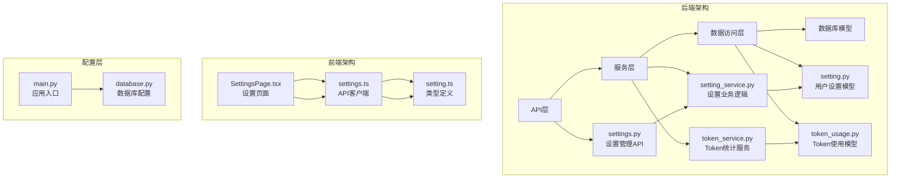
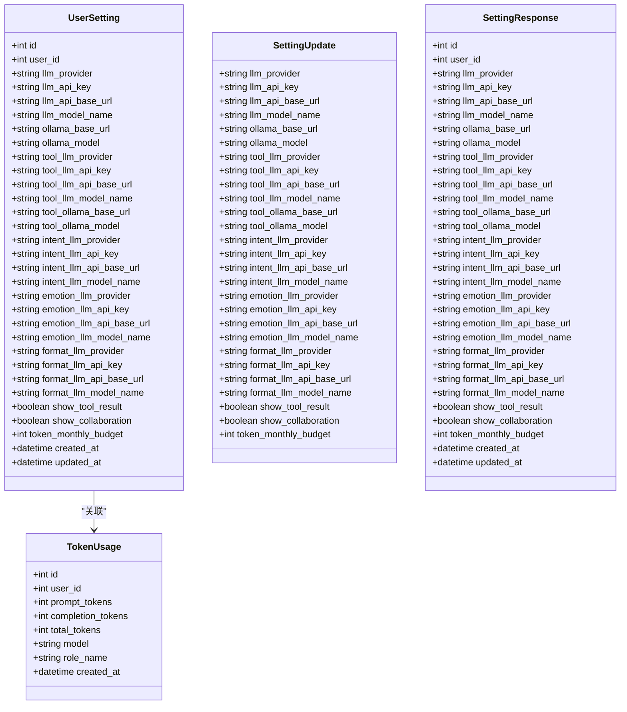
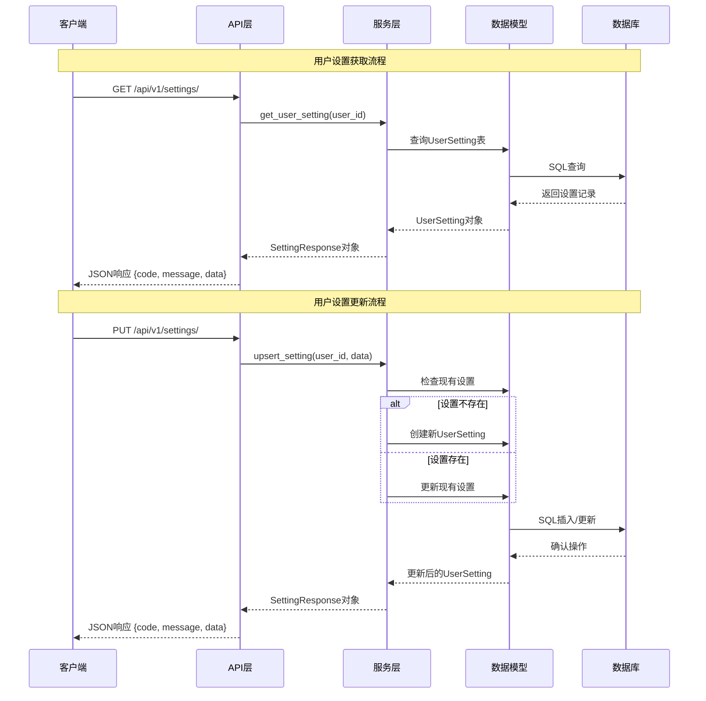
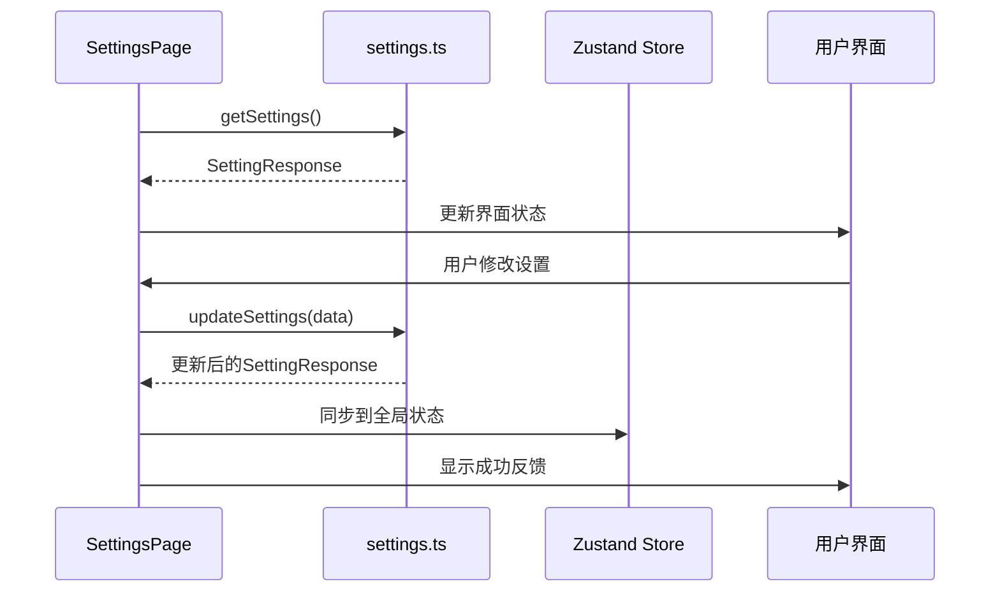
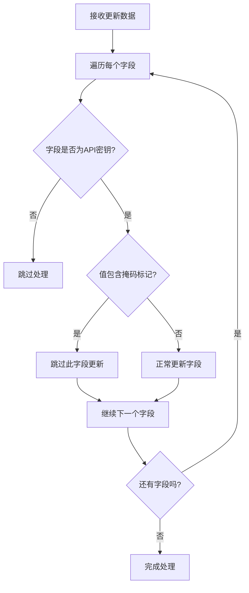
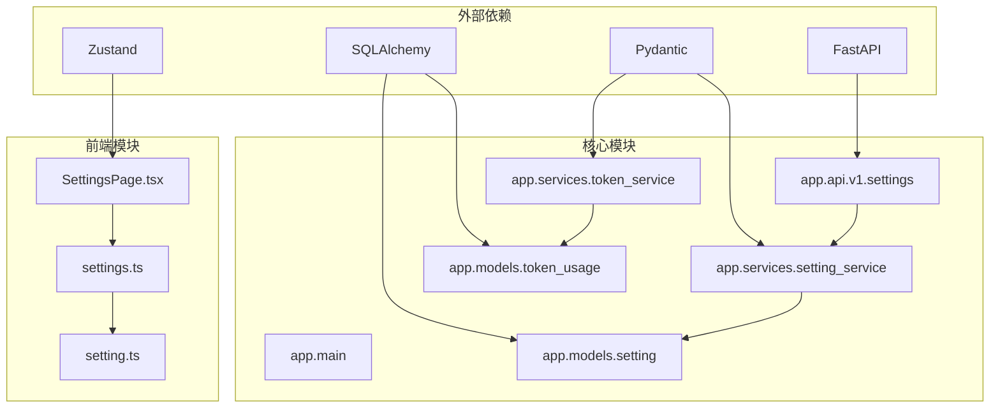

# 设置管理接口

<cite>
**本文档引用的文件**
- [settings.py](file://backend/app/api/v1/settings.py)
- [setting.py](file://backend/app/models/setting.py)
- [setting.py](file://backend/app/schemas/setting.py)
- [setting_service.py](file://backend/app/services/setting_service.py)
- [token_service.py](file://backend/app/services/token_service.py)
- [token_usage.py](file://backend/app/models/token_usage.py)
- [settings.ts](file://frontend/src/api/settings.ts)
- [setting.ts](file://frontend/src/types/setting.ts)
- [SettingsPage.tsx](file://frontend/src/pages/SettingsPage.tsx)
- [main.py](file://backend/app/main.py)
- [database.py](file://backend/app/core/database.py)
</cite>

## 目录
1. [简介](#简介)
2. [项目结构](#项目结构)
3. [核心组件](#核心组件)
4. [架构概览](#架构概览)
5. [详细组件分析](#详细组件分析)
6. [依赖关系分析](#依赖关系分析)
7. [性能考虑](#性能考虑)
8. [故障排除指南](#故障排除指南)
9. [结论](#结论)

## 简介

XuanJi 设置管理接口提供了完整的用户设置管理功能，包括用户设置的获取、更新以及AI模型配置管理。该系统支持多种AI模型提供商配置，包括通用聊天AI、工具生成AI、意图识别AI、情感AI和格式化AI，并提供用户偏好设置和Token使用统计功能。

系统采用前后端分离架构，后端基于FastAPI构建RESTful API，前端使用React开发用户界面。所有API请求都经过身份验证和授权，确保只有合法用户才能访问和修改自己的设置。

## 项目结构

设置管理功能在项目中的组织结构如下：



**图表来源**
- [settings.py:1-55](file://backend/app/api/v1/settings.py#L1-L55)
- [setting_service.py:1-42](file://backend/app/services/setting_service.py#L1-L42)
- [token_service.py:1-183](file://backend/app/services/token_service.py#L1-L183)

**章节来源**
- [settings.py:1-55](file://backend/app/api/v1/settings.py#L1-L55)
- [main.py:1-79](file://backend/app/main.py#L1-L79)
- [database.py:1-65](file://backend/app/core/database.py#L1-L65)

## 核心组件

### 数据模型设计

系统的核心数据模型围绕用户设置展开，支持多维度的AI配置管理和用户偏好设置：



**图表来源**
- [setting.py:9-60](file://backend/app/models/setting.py#L9-L60)
- [token_usage.py:9-24](file://backend/app/models/token_usage.py#L9-L24)
- [setting.py:6-87](file://backend/app/schemas/setting.py#L6-L87)

### API接口设计

系统提供三个主要的设置管理接口，每个接口都有明确的功能职责和数据结构：

| 接口名称 | HTTP方法 | URL模式 | 功能描述 | 请求参数 | 响应格式 |
|---------|---------|--------|----------|----------|----------|
| 获取用户设置 | GET | `/api/v1/settings/` | 获取当前用户的完整设置信息 | 无 | JSON对象，包含code、message、data字段 |
| 更新用户设置 | PUT | `/api/v1/settings/` | 更新或创建用户设置 | SettingUpdate对象 | JSON对象，包含code、message、data字段 |
| 获取Token使用统计 | GET | `/api/v1/settings/token-usage` | 获取用户的Token使用统计信息 | 无 | JSON对象，包含code、message、data字段 |

**章节来源**
- [settings.py:14-54](file://backend/app/api/v1/settings.py#L14-L54)
- [setting.py:6-87](file://backend/app/schemas/setting.py#L6-L87)

## 架构概览

设置管理系统采用分层架构设计，确保了良好的可维护性和扩展性：



**图表来源**
- [settings.py:14-40](file://backend/app/api/v1/settings.py#L14-L40)
- [setting_service.py:11-41](file://backend/app/services/setting_service.py#L11-L41)

**章节来源**
- [settings.py:1-55](file://backend/app/api/v1/settings.py#L1-L55)
- [setting_service.py:1-42](file://backend/app/services/setting_service.py#L1-L42)

## 详细组件分析

### 后端API实现

#### 设置获取接口

设置获取接口负责返回当前认证用户的所有设置信息，包括AI模型配置、用户偏好设置和Token预算等。

**请求处理流程：**

```mermaid
flowchart TD
A[收到GET请求] --> B[获取当前用户]
B --> C[获取数据库会话]
C --> D[创建SettingService实例]
D --> E[调用get_user_setting(user_id)]
E --> F{找到设置记录?}
F --> |是| G[使用SettingResponse验证]
F --> |否| H[返回null作为data]
G --> I[返回JSON响应]
H --> I
I --> J[响应格式: {code, message, data}]
```

**图表来源**
- [settings.py:14-25](file://backend/app/api/v1/settings.py#L14-L25)
- [setting_service.py:11-16](file://backend/app/services/setting_service.py#L11-L16)
- [setting.py:40-77](file://backend/app/schemas/setting.py#L40-L77)

#### 设置更新接口

设置更新接口支持部分更新和全量更新，通过`exclude_unset=True`选项只更新提供的字段。

**更新策略：**

```mermaid
flowchart TD
A[收到PUT请求] --> B[解析SettingUpdate数据]
B --> C[获取当前用户]
C --> D[获取数据库会话]
D --> E[创建SettingService实例]
E --> F[调用upsert_setting(user_id, data)]
F --> G{设置是否存在?}
G --> |不存在| H[创建新设置记录]
G --> |存在| I[更新现有设置]
H --> J[过滤掩码密钥]
I --> J
J --> K[跳过掩码密钥避免覆盖]
K --> L[保存到数据库]
L --> M[刷新并返回结果]
```

**图表来源**
- [settings.py:28-40](file://backend/app/api/v1/settings.py#L28-L40)
- [setting_service.py:23-41](file://backend/app/services/setting_service.py#L23-L41)

#### Token使用统计接口

Token使用统计接口提供详细的使用情况报告，包括当日、当月和累计Token消耗。

**统计计算逻辑：**

```mermaid
flowchart TD
A[收到GET请求] --> B[获取当前用户]
B --> C[获取数据库会话]
C --> D[创建TokenService实例]
D --> E[调用get_usage_summary(user_id)]
E --> F[计算当日开始时间]
F --> G[计算当月开始时间]
G --> H[查询当日Token使用]
H --> I[查询当月Token使用]
I --> J[查询总Token使用]
J --> K[从UserSetting获取月度预算]
K --> L[组装统计结果]
L --> M[返回JSON响应]
```

**图表来源**
- [settings.py:43-54](file://backend/app/api/v1/settings.py#L43-L54)
- [token_service.py:37-82](file://backend/app/services/token_service.py#L37-L82)

**章节来源**
- [settings.py:14-54](file://backend/app/api/v1/settings.py#L14-L54)
- [setting_service.py:18-41](file://backend/app/services/setting_service.py#L18-L41)
- [token_service.py:37-82](file://backend/app/services/token_service.py#L37-L82)

### 前端集成实现

#### 设置页面组件

前端设置页面实现了完整的设置管理界面，包括AI模型配置入口、聊天偏好设置和Token使用统计。

**组件功能特性：**

- **AI模型配置入口**：提供跳转到记忆体页面的链接，用于管理不同角色的AI配置
- **聊天偏好设置**：控制是否显示AI协作过程的开关
- **Token预算管理**：支持设置月度Token使用预算
- **使用统计展示**：实时显示Token使用进度和统计数据
- **反馈机制**：提供成功和错误的用户反馈

**数据流处理：**



**图表来源**
- [SettingsPage.tsx:60-92](file://frontend/src/pages/SettingsPage.tsx#L60-L92)
- [SettingsPage.tsx:121-145](file://frontend/src/pages/SettingsPage.tsx#L121-L145)
- [settings.ts:4-17](file://frontend/src/api/settings.ts#L4-L17)

**章节来源**
- [SettingsPage.tsx:1-485](file://frontend/src/pages/SettingsPage.tsx#L1-L485)
- [settings.ts:1-18](file://frontend/src/api/settings.ts#L1-L18)
- [setting.ts:1-71](file://frontend/src/types/setting.ts#L1-L71)

### 数据验证和安全

#### API密钥掩码保护

系统实现了智能的API密钥掩码保护机制，防止敏感信息被意外覆盖：

**掩码检测逻辑：**



**图表来源**
- [setting_service.py:18-36](file://backend/app/services/setting_service.py#L18-L36)
- [setting.py:79-87](file://backend/app/schemas/setting.py#L79-L87)

#### 响应数据安全

SettingResponse模型实现了API密钥的安全显示，只显示密钥的前缀和后缀，中间部分用星号替代。

**章节来源**
- [setting_service.py:18-41](file://backend/app/services/setting_service.py#L18-L41)
- [setting.py:79-87](file://backend/app/schemas/setting.py#L79-L87)

## 依赖关系分析

设置管理系统的依赖关系体现了清晰的分层架构：



**图表来源**
- [main.py:1-79](file://backend/app/main.py#L1-L79)
- [settings.py:1-55](file://backend/app/api/v1/settings.py#L1-L55)
- [setting_service.py:1-42](file://backend/app/services/setting_service.py#L1-L42)
- [token_service.py:1-183](file://backend/app/services/token_service.py#L1-L183)

**章节来源**
- [main.py:1-79](file://backend/app/main.py#L1-L79)
- [database.py:1-65](file://backend/app/core/database.py#L1-L65)

## 性能考虑

### 数据库优化

系统采用了多项数据库优化策略：

- **索引优化**：UserSetting表对user_id建立唯一索引，确保查询效率
- **自动迁移**：支持动态添加缺失的列，减少部署复杂度
- **连接池**：使用预连接池配置，提高数据库连接效率

### 缓存策略

虽然当前实现没有专门的缓存层，但可以通过以下方式优化：

- **设置缓存**：用户设置可以短期缓存，减少数据库查询
- **统计缓存**：Token使用统计可以按小时缓存
- **API响应缓存**：对于不频繁变化的设置数据可以添加ETag支持

### 并发处理

系统支持高并发场景：

- **异步处理**：FastAPI原生支持异步请求处理
- **连接复用**：数据库连接池支持多个请求并发执行
- **无状态设计**：API设计为无状态，便于水平扩展

## 故障排除指南

### 常见问题及解决方案

#### API验证错误

**问题现象**：请求参数验证失败，返回422状态码

**可能原因**：
- 必填字段缺失
- 数据类型不匹配
- 字段长度超出限制

**解决方法**：
- 检查请求体格式是否符合SettingUpdate定义
- 确保所有必填字段都已提供
- 验证字段值的数据类型和范围

#### 数据库连接问题

**问题现象**：无法连接到数据库或查询失败

**可能原因**：
- 数据库URL配置错误
- 数据库服务未启动
- 用户权限不足

**解决方法**：
- 检查DATABASE_URL环境变量配置
- 确认数据库服务状态
- 验证数据库用户权限

#### 认证失败

**问题现象**：返回401未授权错误

**可能原因**：
- 令牌过期或无效
- 用户未登录
- 令牌格式不正确

**解决方法**：
- 重新登录获取有效令牌
- 检查Authorization头格式
- 验证令牌有效期

**章节来源**
- [main.py:43-59](file://backend/app/main.py#L43-L59)
- [database.py:22-38](file://backend/app/core/database.py#L22-L38)

## 结论

XuanJi设置管理接口提供了一个完整、安全且易于使用的用户设置管理解决方案。系统的主要优势包括：

**功能完整性**：支持用户设置的完整生命周期管理，包括创建、读取、更新和统计分析。

**安全性保障**：实现了API密钥掩码保护、数据验证和访问控制等多重安全措施。

**用户体验**：提供了直观的前端界面和实时的使用统计反馈。

**可扩展性**：采用模块化设计，便于添加新的AI模型配置和用户偏好设置。

**性能优化**：通过数据库优化和异步处理支持高并发场景。

开发者可以基于现有的API接口快速实现用户设置管理功能，同时系统的架构设计也为未来的功能扩展提供了良好的基础。