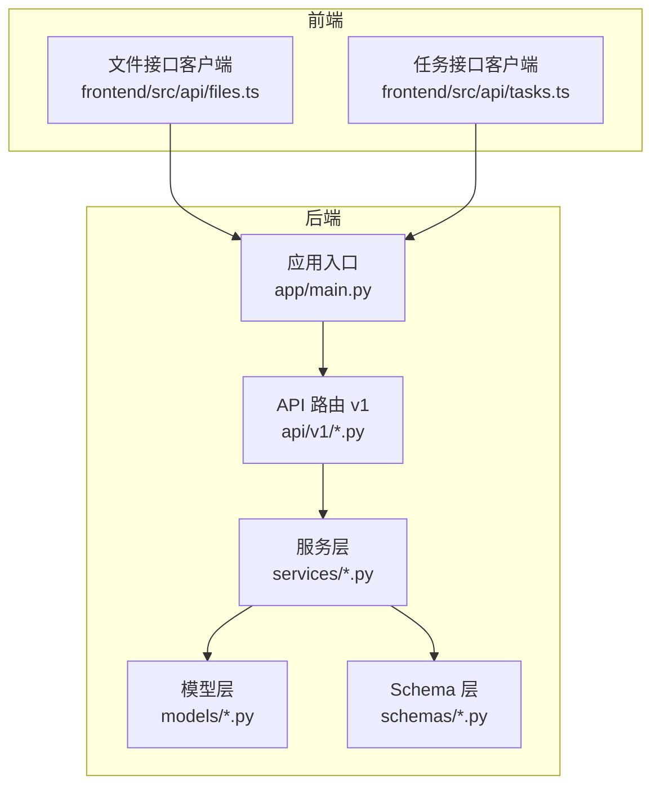
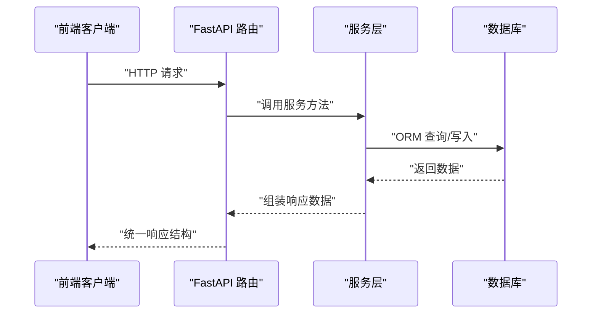
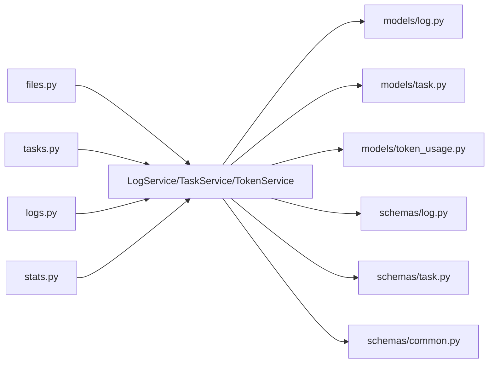

# 辅助功能接口

<cite>
**本文档引用的文件**
- [backend/app/main.py](file://backend/app/main.py)
- [backend/app/api/v1/files.py](file://backend/app/api/v1/files.py)
- [backend/app/api/v1/tasks.py](file://backend/app/api/v1/tasks.py)
- [backend/app/api/v1/logs.py](file://backend/app/api/v1/logs.py)
- [backend/app/api/v1/stats.py](file://backend/app/api/v1/stats.py)
- [backend/app/services/log_service.py](file://backend/app/services/log_service.py)
- [backend/app/services/token_service.py](file://backend/app/services/token_service.py)
- [backend/app/services/task_service.py](file://backend/app/services/task_service.py)
- [backend/app/models/log.py](file://backend/app/models/log.py)
- [backend/app/models/task.py](file://backend/app/models/task.py)
- [backend/app/models/token_usage.py](file://backend/app/models/token_usage.py)
- [backend/app/schemas/log.py](file://backend/app/schemas/log.py)
- [backend/app/schemas/task.py](file://backend/app/schemas/task.py)
- [backend/app/schemas/common.py](file://backend/app/schemas/common.py)
- [frontend/src/api/files.ts](file://frontend/src/api/files.ts)
- [frontend/src/api/tasks.ts](file://frontend/src/api/tasks.ts)
</cite>

## 目录
1. [简介](#简介)
2. [项目结构](#项目结构)
3. [核心组件](#核心组件)
4. [架构总览](#架构总览)
5. [详细组件分析](#详细组件分析)
6. [依赖分析](#依赖分析)
7. [性能考虑](#性能考虑)
8. [故障排除指南](#故障排除指南)
9. [结论](#结论)
10. [附录](#附录)

## 简介
本文件为 XuanJi 辅助功能接口的完整 API 文档，覆盖以下能力域：
- 文件浏览与沙箱目录访问：/api/v1/files/browse
- 任务管理：/api/v1/tasks（列表、详情）
- 日志查询与统计：/api/v1/logs（分页查询、统计概览）
- 统计数据：/api/v1/stats（仪表盘、令牌用量按角色/模型/日期）

接口统一采用标准响应结构，支持鉴权与权限控制，并提供典型使用示例，帮助开发者快速集成与调试。

## 项目结构
后端基于 FastAPI 构建，路由按功能域划分在 v1 子模块中，服务层负责业务逻辑，模型层定义数据库表结构，Schema 层定义请求/响应数据结构。前端通过独立的 API 客户端封装调用。

图表来源
- [backend/app/main.py:40](file://backend/app/main.py#L40)
- [backend/app/api/v1/files.py:8](file://backend/app/api/v1/files.py#L8)
- [backend/app/api/v1/tasks.py:10](file://backend/app/api/v1/tasks.py#L10)
- [backend/app/api/v1/logs.py:10](file://backend/app/api/v1/logs.py#L10)
- [backend/app/api/v1/stats.py:9](file://backend/app/api/v1/stats.py#L9)

章节来源
- [backend/app/main.py:30-41](file://backend/app/main.py#L30-L41)

## 核心组件
- 统一响应结构：所有接口返回包含 code、message、data 的结构化响应体，便于前端统一处理。
- 鉴权与权限：任务与日志接口均依赖当前用户上下文，仅返回当前用户的任务与日志。
- 数据模型：
  - 任务：包含标题、描述、状态、结果、时间戳等字段。
  - 日志：包含级别、消息、来源模块、关联任务/工具、状态码等字段。
  - 令牌用量：按用户维度记录提示词/补全/总计令牌用量及模型、角色名等维度。
- 服务层职责：
  - 日志服务：写入日志、分页查询、按级别统计。
  - 任务服务：创建任务、更新状态、查询用户任务。
  - 令牌服务：用量汇总、预算检查、按角色/模型/日期聚合。

章节来源
- [backend/app/schemas/common.py:8-12](file://backend/app/schemas/common.py#L8-L12)
- [backend/app/api/v1/tasks.py:13-29](file://backend/app/api/v1/tasks.py#L13-L29)
- [backend/app/api/v1/logs.py:13-37](file://backend/app/api/v1/logs.py#L13-L37)
- [backend/app/api/v1/stats.py:12-28](file://backend/app/api/v1/stats.py#L12-L28)
- [backend/app/models/task.py:9-28](file://backend/app/models/task.py#L9-L28)
- [backend/app/models/log.py:9-30](file://backend/app/models/log.py#L9-L30)
- [backend/app/models/token_usage.py:9-24](file://backend/app/models/token_usage.py#L9-L24)

## 架构总览
下图展示辅助功能接口的调用链路与关键组件交互：

图表来源
- [backend/app/api/v1/files.py:11-47](file://backend/app/api/v1/files.py#L11-L47)
- [backend/app/api/v1/tasks.py:13-49](file://backend/app/api/v1/tasks.py#L13-L49)
- [backend/app/api/v1/logs.py:13-52](file://backend/app/api/v1/logs.py#L13-L52)
- [backend/app/api/v1/stats.py:12-61](file://backend/app/api/v1/stats.py#L12-L61)

## 详细组件分析

### 文件浏览接口（/api/v1/files/browse）
- 功能概述：在沙箱目录内浏览文件与目录，支持路径校验与安全限制。
- HTTP 方法与 URL：GET /api/v1/files/browse
- 查询参数：
  - path: 字符串，目标相对路径（可选，默认为空字符串）
- 响应结构：
  - code: 整数，状态码
  - message: 字符串，成功或错误信息
  - data.current: 当前目录相对路径
  - data.entries: 条目数组，包含 name、is_dir、size、path
- 状态码：
  - 200: 成功
  - 400: 路径不是目录
  - 403: 访问被拒绝（越权）
  - 404: 路径不存在
- 安全要点：
  - 严格限制在沙箱根目录之下，防止路径穿越
  - 目录遍历结果按类型优先、名称大小写不敏感排序
- 使用示例（前端调用）：
  - 浏览根目录：/api/v1/files/browse
  - 指定子目录：/api/v1/files/browse?path=logs/2024

章节来源
- [backend/app/api/v1/files.py:11-47](file://backend/app/api/v1/files.py#L11-L47)
- [frontend/src/api/files.ts:10-13](file://frontend/src/api/files.ts#L10-L13)

### 任务管理接口（/api/v1/tasks）
- 功能概述：查询当前用户的历史任务列表与单个任务详情。
- HTTP 方法与 URL：
  - GET /api/v1/tasks/（列表）
  - GET /api/v1/tasks/{task_id}（详情）
- 认证与权限：需要登录用户上下文，仅返回当前用户的任务。
- 列表接口参数：
  - 无查询参数（默认返回最近 50 条）
- 详情接口参数：
  - 路径参数：task_id（整数）
- 响应结构：
  - 列表：data 为任务对象数组
  - 详情：data 为单个任务对象
  - 通用字段：id、user_id、title、description、status、result、created_at、updated_at
- 状态码：
  - 200: 成功
  - 404: 任务不存在或不属于当前用户
- 使用示例（前端调用）：
  - 获取任务列表：/api/v1/tasks/
  - 获取指定任务：/api/v1/tasks/123

章节来源
- [backend/app/api/v1/tasks.py:13-49](file://backend/app/api/v1/tasks.py#L13-L49)
- [backend/app/schemas/task.py:32-43](file://backend/app/schemas/task.py#L32-L43)
- [frontend/src/api/tasks.ts:4-10](file://frontend/src/api/tasks.ts#L4-L10)

### 日志查询与统计接口（/api/v1/logs）
- 功能概述：分页查询用户日志并提供按级别统计概览。
- HTTP 方法与 URL：
  - GET /api/v1/logs/（分页查询）
  - GET /api/v1/logs/stats（统计概览）
- 认证与权限：需要登录用户上下文，仅返回当前用户日志。
- 分页查询参数：
  - limit: 整数，1~200，默认 50
  - offset: 整数，默认 0
  - level: 字符串，日志级别筛选（info/warn/error/debug）
  - source: 字符串，来源模块筛选
- 统计概览参数：
  - 无参数
- 响应结构：
  - 分页查询：data.items 为日志数组，data.total、data.limit、data.offset 为分页信息
  - 统计概览：data.stats 为按级别计数的字典
- 状态码：
  - 200: 成功
  - 422: 参数校验失败
- 使用示例（前端调用）：
  - 查询日志：/api/v1/logs/?limit=50&offset=0&level=error
  - 统计概览：/api/v1/logs/stats

章节来源
- [backend/app/api/v1/logs.py:13-52](file://backend/app/api/v1/logs.py#L13-L52)
- [backend/app/schemas/log.py:18-42](file://backend/app/schemas/log.py#L18-L42)
- [backend/app/services/log_service.py:40-66](file://backend/app/services/log_service.py#L40-L66)

### 统计数据接口（/api/v1/stats）
- 功能概述：提供仪表盘统计与多维令牌用量分析。
- HTTP 方法与 URL：
  - GET /api/v1/stats/dashboard（仪表盘）
  - GET /api/v1/stats/token-by-role（按角色/模型）
  - GET /api/v1/stats/token-daily（按日期）
  - GET /api/v1/stats/token-by-model（按模型）
- 认证与权限：需要登录用户上下文。
- 参数：
  - dashboard：无参数
  - token-by-role：days（默认 30）
  - token-daily：days（默认 30）
  - token-by-model：days（默认 30）
- 响应结构：
  - dashboard：data.today_tokens、data.month_tokens、data.total_tokens、data.monthly_budget
  - token-by-role：data 为数组，包含 role_name、model、prompt_tokens、completion_tokens、total_tokens、call_count
  - token-daily：data 为数组，包含 date、role_name、prompt_tokens、completion_tokens、total_tokens
  - token-by-model：data 为数组，包含 model、prompt_tokens、completion_tokens、total_tokens、call_count
- 状态码：
  - 200: 成功
- 使用示例（前端调用）：
  - 仪表盘：/api/v1/stats/dashboard
  - 角色/模型：/api/v1/stats/token-by-role?days=30
  - 日期趋势：/api/v1/stats/token-daily?days=30
  - 模型对比：/api/v1/stats/token-by-model?days=30

章节来源
- [backend/app/api/v1/stats.py:12-61](file://backend/app/api/v1/stats.py#L12-L61)
- [backend/app/services/token_service.py:37-182](file://backend/app/services/token_service.py#L37-L182)

## 依赖分析
- 路由到服务层：各 API 路由通过依赖注入获取数据库会话与当前用户，再调用对应服务层方法。
- 服务层到模型层：服务层使用 SQLAlchemy ORM 对模型进行查询与写入。
- Schema 与模型：Pydantic 模型用于请求/响应序列化，与数据库模型保持字段一致性。
- 前端到后端：前端通过独立 API 客户端封装请求，统一处理响应结构。

图表来源
- [backend/app/api/v1/files.py:1-8](file://backend/app/api/v1/files.py#L1-L8)
- [backend/app/api/v1/tasks.py:1-9](file://backend/app/api/v1/tasks.py#L1-L9)
- [backend/app/api/v1/logs.py:1-9](file://backend/app/api/v1/logs.py#L1-L9)
- [backend/app/api/v1/stats.py:1-9](file://backend/app/api/v1/stats.py#L1-L9)
- [backend/app/services/log_service.py:10-12](file://backend/app/services/log_service.py#L10-L12)
- [backend/app/services/task_service.py:9-11](file://backend/app/services/task_service.py#L9-L11)
- [backend/app/services/token_service.py:10-12](file://backend/app/services/token_service.py#L10-L12)
- [backend/app/models/log.py:9-30](file://backend/app/models/log.py#L9-L30)
- [backend/app/models/task.py:9-28](file://backend/app/models/task.py#L9-L28)
- [backend/app/models/token_usage.py:9-24](file://backend/app/models/token_usage.py#L9-L24)
- [backend/app/schemas/log.py:18-42](file://backend/app/schemas/log.py#L18-L42)
- [backend/app/schemas/task.py:32-43](file://backend/app/schemas/task.py#L32-L43)
- [backend/app/schemas/common.py:8-12](file://backend/app/schemas/common.py#L8-L12)

## 性能考虑
- 分页与限制：日志接口限制单次最大返回条数，避免一次性传输过多数据。
- 索引设计：任务与日志模型在 user_id、created_at、status 等字段建立索引，提升查询效率。
- 聚合查询：令牌用量统计使用 SQL 聚合函数，减少 Python 层迭代开销。
- 缓存策略：建议在网关或应用层对高频查询（如仪表盘）增加缓存，降低数据库压力。

## 故障排除指南
- 参数校验失败（422）：检查请求参数范围与类型是否符合接口要求。
- 权限不足（403）：确认已登录且操作资源属于当前用户。
- 资源不存在（404）：确认 ID 或路径有效。
- 建议排查步骤：
  - 查看统一响应中的 message 字段获取中文提示
  - 检查前端请求 URL 与参数是否正确
  - 在后端查看服务层日志定位具体异常

章节来源
- [backend/app/main.py:43-59](file://backend/app/main.py#L43-L59)

## 结论
本文档提供了 XuanJi 辅助功能接口的完整说明，涵盖文件浏览、任务管理、日志查询与统计分析。通过统一的响应结构与清晰的权限控制，开发者可以快速集成并稳定使用这些能力。建议结合前端 API 客户端示例进行开发，并根据实际场景优化分页与缓存策略。

## 附录

### 接口一览与示例

- 文件浏览
  - GET /api/v1/files/browse?path=logs/2024
  - 响应：data.current、data.entries
  - 参考：[backend/app/api/v1/files.py:11-47](file://backend/app/api/v1/files.py#L11-L47)

- 任务管理
  - GET /api/v1/tasks/
  - GET /api/v1/tasks/{task_id}
  - 响应：任务对象数组或单个任务对象
  - 参考：[backend/app/api/v1/tasks.py:13-49](file://backend/app/api/v1/tasks.py#L13-L49)

- 日志查询
  - GET /api/v1/logs/?limit=50&offset=0&level=error
  - GET /api/v1/logs/stats
  - 响应：分页项与总数，或按级别统计
  - 参考：[backend/app/api/v1/logs.py:13-52](file://backend/app/api/v1/logs.py#L13-L52)

- 统计数据
  - GET /api/v1/stats/dashboard
  - GET /api/v1/stats/token-by-role?days=30
  - GET /api/v1/stats/token-daily?days=30
  - GET /api/v1/stats/token-by-model?days=30
  - 参考：[backend/app/api/v1/stats.py:12-61](file://backend/app/api/v1/stats.py#L12-L61)