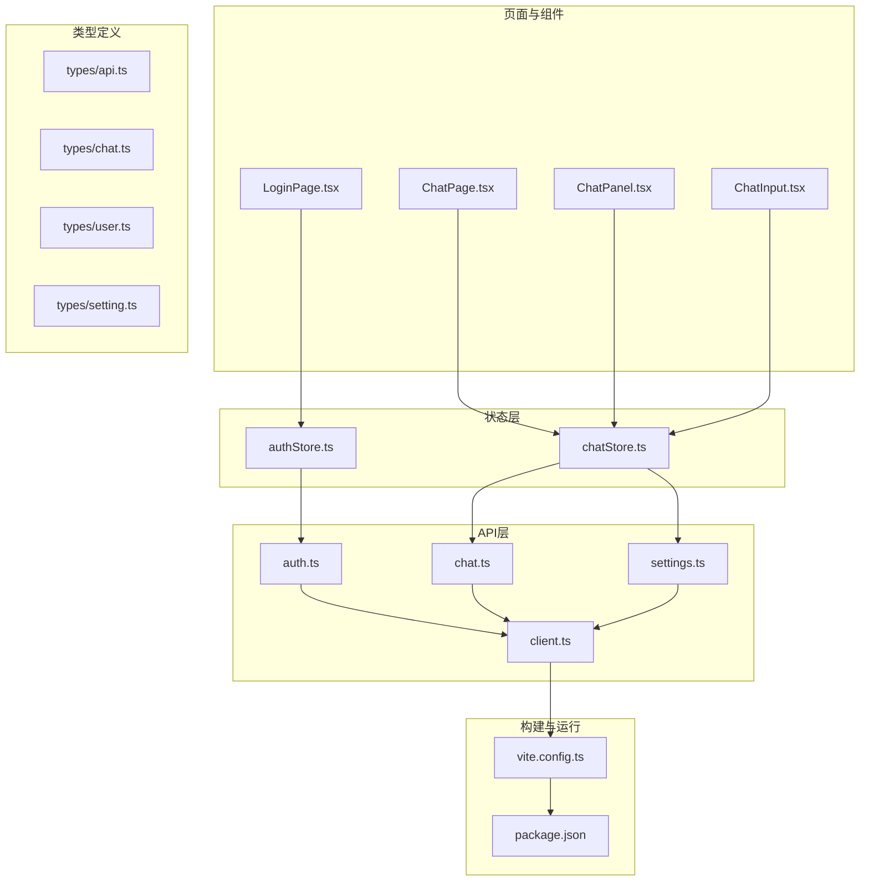
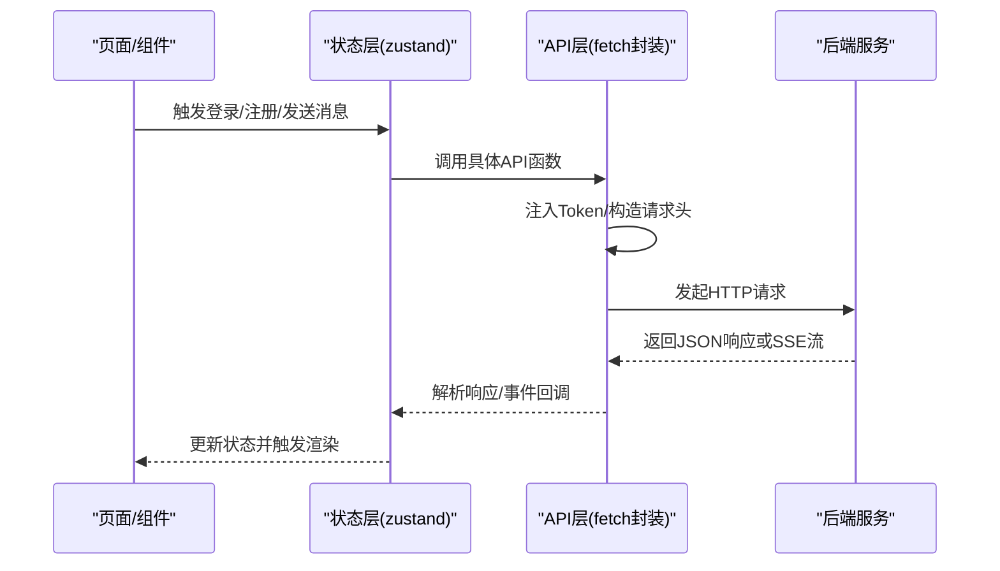
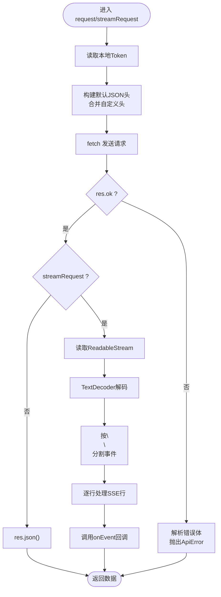
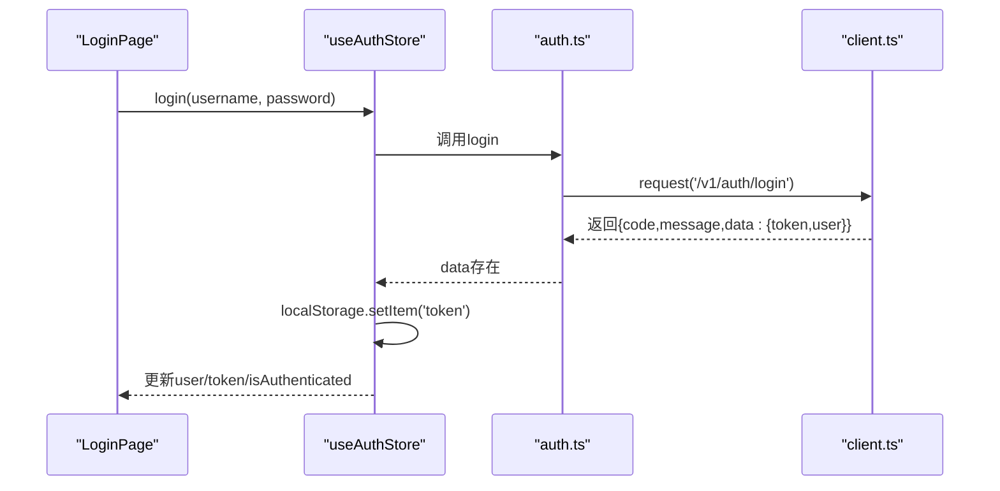
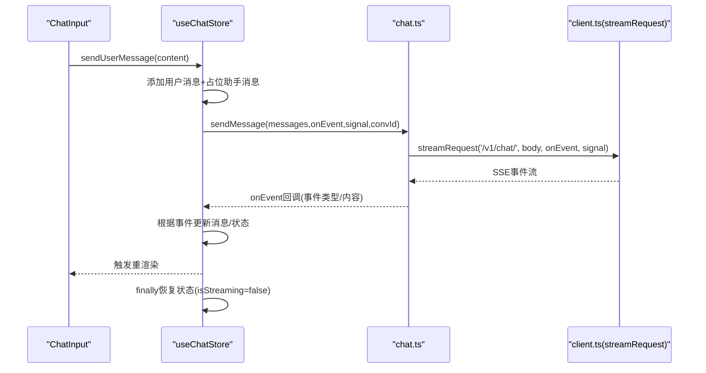
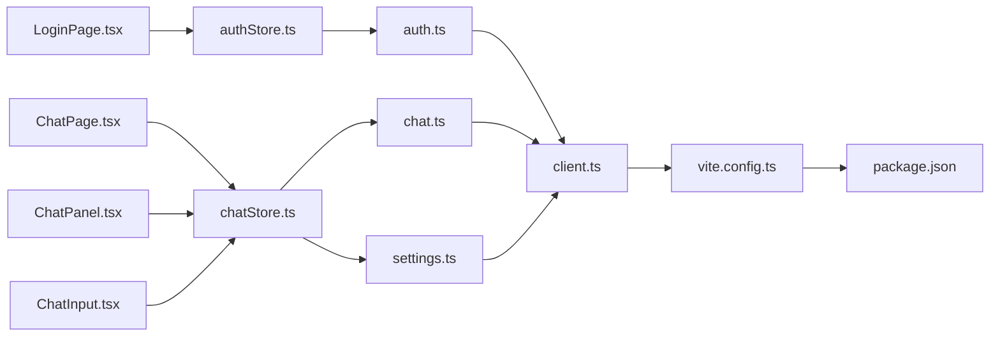

# API集成与实时通信

<cite>
**本文引用的文件**
- [frontend/src/api/client.ts](file://frontend/src/api/client.ts)
- [frontend/src/api/auth.ts](file://frontend/src/api/auth.ts)
- [frontend/src/api/chat.ts](file://frontend/src/api/chat.ts)
- [frontend/src/stores/authStore.ts](file://frontend/src/stores/authStore.ts)
- [frontend/src/stores/chatStore.ts](file://frontend/src/stores/chatStore.ts)
- [frontend/src/types/api.ts](file://frontend/src/types/api.ts)
- [frontend/src/types/chat.ts](file://frontend/src/types/chat.ts)
- [frontend/src/types/user.ts](file://frontend/src/types/user.ts)
- [frontend/src/pages/LoginPage.tsx](file://frontend/src/pages/LoginPage.tsx)
- [frontend/src/pages/ChatPage.tsx](file://frontend/src/pages/ChatPage.tsx)
- [frontend/src/components/chat/ChatPanel.tsx](file://frontend/src/components/chat/ChatPanel.tsx)
- [frontend/src/components/chat/ChatInput.tsx](file://frontend/src/components/chat/ChatInput.tsx)
- [frontend/src/utils/formatDate.ts](file://frontend/src/utils/formatDate.ts)
- [frontend/src/api/settings.ts](file://frontend/src/api/settings.ts)
- [frontend/src/tabs/setting.ts](file://frontend/src/tabs/setting.ts)
- [frontend/package.json](file://frontend/package.json)
- [frontend/vite.config.ts](file://frontend/vite.config.ts)
</cite>

## 目录
1. [简介](#简介)
2. [项目结构](#项目结构)
3. [核心组件](#核心组件)
4. [架构总览](#架构总览)
5. [详细组件分析](#详细组件分析)
6. [依赖关系分析](#依赖关系分析)
7. [性能考量](#性能考量)
8. [故障排查指南](#故障排查指南)
9. [结论](#结论)
10. [附录](#附录)

## 简介
本技术文档面向API集成开发者，系统性梳理XuanJi前端的HTTP客户端、请求/响应处理、认证流程、聊天流式响应与协作事件、以及状态同步与错误处理策略。文档同时覆盖超时与取消控制、代理与开发环境配置、以及测试与调试建议，帮助快速构建稳定高效的前后端通信方案。

## 项目结构
前端采用模块化组织，API层负责HTTP封装与流式处理；状态层通过轻量状态库管理用户与聊天状态；页面与组件层负责UI渲染与交互；类型定义确保API契约一致性；Vite提供开发服务器与代理配置。

**图表来源**
- [frontend/src/pages/LoginPage.tsx:1-369](file://frontend/src/pages/LoginPage.tsx#L1-L369)
- [frontend/src/pages/ChatPage.tsx:1-17](file://frontend/src/pages/ChatPage.tsx#L1-L17)
- [frontend/src/components/chat/ChatPanel.tsx:1-67](file://frontend/src/components/chat/ChatPanel.tsx#L1-L67)
- [frontend/src/components/chat/ChatInput.tsx:1-65](file://frontend/src/components/chat/ChatInput.tsx#L1-L65)
- [frontend/src/stores/authStore.ts:1-53](file://frontend/src/stores/authStore.ts#L1-L53)
- [frontend/src/stores/chatStore.ts:1-291](file://frontend/src/stores/chatStore.ts#L1-L291)
- [frontend/src/api/auth.ts:1-21](file://frontend/src/api/auth.ts#L1-L21)
- [frontend/src/api/chat.ts:1-49](file://frontend/src/api/chat.ts#L1-L49)
- [frontend/src/api/settings.ts:1-18](file://frontend/src/api/settings.ts#L1-L18)
- [frontend/src/api/client.ts:1-119](file://frontend/src/api/client.ts#L1-L119)
- [frontend/src/types/api.ts:1-6](file://frontend/src/types/api.ts#L1-L6)
- [frontend/src/types/chat.ts:1-47](file://frontend/src/types/chat.ts#L1-L47)
- [frontend/src/types/user.ts:1-18](file://frontend/src/types/user.ts#L1-L18)
- [frontend/src/types/setting.ts:1-71](file://frontend/src/types/setting.ts#L1-L71)
- [frontend/vite.config.ts:1-35](file://frontend/vite.config.ts#L1-L35)
- [frontend/package.json:1-44](file://frontend/package.json#L1-L44)

**章节来源**
- [frontend/src/api/client.ts:1-119](file://frontend/src/api/client.ts#L1-L119)
- [frontend/src/api/auth.ts:1-21](file://frontend/src/api/auth.ts#L1-L21)
- [frontend/src/api/chat.ts:1-49](file://frontend/src/api/chat.ts#L1-L49)
- [frontend/src/stores/authStore.ts:1-53](file://frontend/src/stores/authStore.ts#L1-L53)
- [frontend/src/stores/chatStore.ts:1-291](file://frontend/src/stores/chatStore.ts#L1-L291)
- [frontend/src/types/api.ts:1-6](file://frontend/src/types/api.ts#L1-L6)
- [frontend/src/types/chat.ts:1-47](file://frontend/src/types/chat.ts#L1-L47)
- [frontend/src/types/user.ts:1-18](file://frontend/src/types/user.ts#L1-L18)
- [frontend/src/pages/LoginPage.tsx:1-369](file://frontend/src/pages/LoginPage.tsx#L1-L369)
- [frontend/src/pages/ChatPage.tsx:1-17](file://frontend/src/pages/ChatPage.tsx#L1-L17)
- [frontend/src/components/chat/ChatPanel.tsx:1-67](file://frontend/src/components/chat/ChatPanel.tsx#L1-L67)
- [frontend/src/components/chat/ChatInput.tsx:1-65](file://frontend/src/components/chat/ChatInput.tsx#L1-L65)
- [frontend/src/utils/formatDate.ts:1-60](file://frontend/src/utils/formatDate.ts#L1-L60)
- [frontend/src/api/settings.ts:1-18](file://frontend/src/api/settings.ts#L1-L18)
- [frontend/vite.config.ts:1-35](file://frontend/vite.config.ts#L1-L35)
- [frontend/package.json:1-44](file://frontend/package.json#L1-L44)

## 核心组件
- HTTP客户端与错误模型
  - 统一基地址、Token注入、通用响应解析与错误抛出。
  - 流式请求解析SSE事件，带断言与保护。
- 认证API与状态
  - 登录/注册/获取当前用户，状态持久化与加载。
- 聊天API与流式处理
  - 会话与消息查询、最近消息、流式发送与事件回调。
- 状态管理
  - 认证状态与聊天状态，含占位消息、协作事件、情绪快照、取消控制。
- 类型契约
  - 统一响应结构、聊天消息与事件、用户与设置类型。

**章节来源**
- [frontend/src/api/client.ts:1-119](file://frontend/src/api/client.ts#L1-L119)
- [frontend/src/api/auth.ts:1-21](file://frontend/src/api/auth.ts#L1-L21)
- [frontend/src/api/chat.ts:1-49](file://frontend/src/api/chat.ts#L1-L49)
- [frontend/src/stores/authStore.ts:1-53](file://frontend/src/stores/authStore.ts#L1-L53)
- [frontend/src/stores/chatStore.ts:1-291](file://frontend/src/stores/chatStore.ts#L1-L291)
- [frontend/src/types/api.ts:1-6](file://frontend/src/types/api.ts#L1-L6)
- [frontend/src/types/chat.ts:1-47](file://frontend/src/types/chat.ts#L1-L47)
- [frontend/src/types/user.ts:1-18](file://frontend/src/types/user.ts#L1-L18)

## 架构总览
前端通过API层统一发起HTTP请求，认证与聊天状态由状态层维护，页面与组件通过状态层驱动UI。开发服务器通过Vite代理转发至后端服务。

**图表来源**
- [frontend/src/stores/authStore.ts:1-53](file://frontend/src/stores/authStore.ts#L1-L53)
- [frontend/src/stores/chatStore.ts:1-291](file://frontend/src/stores/chatStore.ts#L1-L291)
- [frontend/src/api/client.ts:1-119](file://frontend/src/api/client.ts#L1-L119)
- [frontend/src/api/auth.ts:1-21](file://frontend/src/api/auth.ts#L1-L21)
- [frontend/src/api/chat.ts:1-49](file://frontend/src/api/chat.ts#L1-L49)

## 详细组件分析

### HTTP客户端与错误处理
- 基础配置
  - 基础URL来自环境变量，未设置时回退为相对路径。
  - 默认JSON内容类型，并合并自定义头部。
- 请求与响应
  - 自动从本地存储读取Token并注入Authorization头。
  - 非OK状态抛出自定义错误对象，包含状态码与消息。
- 流式请求(streamRequest)
  - 以POST方式发送JSON，读取ReadableStream。
  - 按SSE格式逐行解析，支持事件类型与错误计数保护。
  - 支持AbortSignal中断，缓冲区末尾补丁处理。

**图表来源**
- [frontend/src/api/client.ts:1-119](file://frontend/src/api/client.ts#L1-L119)

**章节来源**
- [frontend/src/api/client.ts:1-119](file://frontend/src/api/client.ts#L1-L119)
- [frontend/src/types/api.ts:1-6](file://frontend/src/types/api.ts#L1-L6)

### 认证API与状态同步
- API函数
  - 登录/注册：提交用户名、密码（注册包含邮箱），返回token与用户信息。
  - 获取当前用户：无参数，返回用户信息。
- 状态管理
  - 初始化从本地存储读取Token与认证状态。
  - 登录/注册成功后写入Token并更新用户与认证标志。
  - 加载用户时若失败则清理Token并重置状态。
- 登录页集成
  - 表单校验与错误提示，捕获ApiError并展示友好消息。

**图表来源**
- [frontend/src/pages/LoginPage.tsx:1-369](file://frontend/src/pages/LoginPage.tsx#L1-L369)
- [frontend/src/stores/authStore.ts:1-53](file://frontend/src/stores/authStore.ts#L1-L53)
- [frontend/src/api/auth.ts:1-21](file://frontend/src/api/auth.ts#L1-L21)
- [frontend/src/api/client.ts:1-119](file://frontend/src/api/client.ts#L1-L119)

**章节来源**
- [frontend/src/api/auth.ts:1-21](file://frontend/src/api/auth.ts#L1-L21)
- [frontend/src/stores/authStore.ts:1-53](file://frontend/src/stores/authStore.ts#L1-L53)
- [frontend/src/pages/LoginPage.tsx:1-369](file://frontend/src/pages/LoginPage.tsx#L1-L369)
- [frontend/src/types/user.ts:1-18](file://frontend/src/types/user.ts#L1-L18)

### 聊天API与流式响应处理
- API函数
  - 会话列表、指定会话消息、最近N天消息。
  - 发送消息：通过流式请求触发SSE事件回调。
- 状态管理(chatStore)
  - 维护消息列表、流式状态、协作开关、当前会话ID、流标识等。
  - 发送消息流程：添加用户消息与占位助手消息，创建AbortController，调用sendMessage，按事件类型更新UI。
  - 事件处理：
    - message：拼接内容，首个文本块后标记生成中。
    - thinking：更新Agent状态文案。
    - emotion_update：解析情绪快照并附加到最新用户消息。
    - collaboration：异步应用协作步骤。
    - done/error：结束流式、清理状态或追加错误提示。
  - 取消控制：通过AbortController中断流，finally兜底恢复状态。
- 页面与组件
  - ChatPage初始化加载最近消息与协作开关。
  - ChatPanel渲染消息与状态指示，ChatInput负责输入与取消。

**图表来源**
- [frontend/src/stores/chatStore.ts:1-291](file://frontend/src/stores/chatStore.ts#L1-L291)
- [frontend/src/api/chat.ts:1-49](file://frontend/src/api/chat.ts#L1-L49)
- [frontend/src/api/client.ts:1-119](file://frontend/src/api/client.ts#L1-L119)
- [frontend/src/components/chat/ChatInput.tsx:1-65](file://frontend/src/components/chat/ChatInput.tsx#L1-L65)
- [frontend/src/components/chat/ChatPanel.tsx:1-67](file://frontend/src/components/chat/ChatPanel.tsx#L1-L67)
- [frontend/src/pages/ChatPage.tsx:1-17](file://frontend/src/pages/ChatPage.tsx#L1-L17)

**章节来源**
- [frontend/src/api/chat.ts:1-49](file://frontend/src/api/chat.ts#L1-L49)
- [frontend/src/stores/chatStore.ts:1-291](file://frontend/src/stores/chatStore.ts#L1-L291)
- [frontend/src/components/chat/ChatPanel.tsx:1-67](file://frontend/src/components/chat/ChatPanel.tsx#L1-L67)
- [frontend/src/components/chat/ChatInput.tsx:1-65](file://frontend/src/components/chat/ChatInput.tsx#L1-L65)
- [frontend/src/pages/ChatPage.tsx:1-17](file://frontend/src/pages/ChatPage.tsx#L1-L17)
- [frontend/src/utils/formatDate.ts:1-60](file://frontend/src/utils/formatDate.ts#L1-L60)
- [frontend/src/types/chat.ts:1-47](file://frontend/src/types/chat.ts#L1-L47)

### 设置与协作开关
- 设置API
  - 获取/更新用户设置，查询Token用量。
- 协作开关
  - 在聊天初始化时加载设置中的协作开关，默认开启。
- 类型定义
  - 用户设置、更新结构、Token用量汇总。

**章节来源**
- [frontend/src/api/settings.ts:1-18](file://frontend/src/api/settings.ts#L1-L18)
- [frontend/src/stores/chatStore.ts:1-291](file://frontend/src/stores/chatStore.ts#L1-L291)
- [frontend/src/types/setting.ts:1-71](file://frontend/src/types/setting.ts#L1-L71)

## 依赖关系分析
- 组件耦合
  - 页面依赖状态层；状态层依赖API层；API层依赖客户端。
- 外部依赖
  - React、Zustand、TailwindCSS、ECharts等。
- 开发与构建
  - Vite提供代理与热更新；别名@指向src目录；chunk拆分优化ECharts体积。

**图表来源**
- [frontend/src/pages/LoginPage.tsx:1-369](file://frontend/src/pages/LoginPage.tsx#L1-L369)
- [frontend/src/pages/ChatPage.tsx:1-17](file://frontend/src/pages/ChatPage.tsx#L1-L17)
- [frontend/src/components/chat/ChatPanel.tsx:1-67](file://frontend/src/components/chat/ChatPanel.tsx#L1-L67)
- [frontend/src/components/chat/ChatInput.tsx:1-65](file://frontend/src/components/chat/ChatInput.tsx#L1-L65)
- [frontend/src/stores/authStore.ts:1-53](file://frontend/src/stores/authStore.ts#L1-L53)
- [frontend/src/stores/chatStore.ts:1-291](file://frontend/src/stores/chatStore.ts#L1-L291)
- [frontend/src/api/auth.ts:1-21](file://frontend/src/api/auth.ts#L1-L21)
- [frontend/src/api/chat.ts:1-49](file://frontend/src/api/chat.ts#L1-L49)
- [frontend/src/api/settings.ts:1-18](file://frontend/src/api/settings.ts#L1-L18)
- [frontend/src/api/client.ts:1-119](file://frontend/src/api/client.ts#L1-L119)
- [frontend/vite.config.ts:1-35](file://frontend/vite.config.ts#L1-L35)
- [frontend/package.json:1-44](file://frontend/package.json#L1-L44)

**章节来源**
- [frontend/src/api/client.ts:1-119](file://frontend/src/api/client.ts#L1-L119)
- [frontend/src/api/auth.ts:1-21](file://frontend/src/api/auth.ts#L1-L21)
- [frontend/src/api/chat.ts:1-49](file://frontend/src/api/chat.ts#L1-L49)
- [frontend/src/api/settings.ts:1-18](file://frontend/src/api/settings.ts#L1-L18)
- [frontend/src/stores/authStore.ts:1-53](file://frontend/src/stores/authStore.ts#L1-L53)
- [frontend/src/stores/chatStore.ts:1-291](file://frontend/src/stores/chatStore.ts#L1-L291)
- [frontend/vite.config.ts:1-35](file://frontend/vite.config.ts#L1-L35)
- [frontend/package.json:1-44](file://frontend/package.json#L1-L44)

## 性能考量
- 流式渲染与空闲调度
  - 协作事件采用空闲回调异步应用，避免阻塞主线程。
- 状态更新最小化
  - 仅在必要时更新消息数组与状态字段，减少重渲染。
- 体积优化
  - Vite按需拆分第三方库，将ECharts单独打包，降低首屏包体。
- 代理与跨域
  - 开发环境通过Vite代理转发/api到后端，避免CORS问题。
- 取消与兜底
  - 使用AbortController及时取消请求，finally块确保状态恢复，防止UI卡死。

**章节来源**
- [frontend/src/stores/chatStore.ts:1-291](file://frontend/src/stores/chatStore.ts#L1-L291)
- [frontend/vite.config.ts:1-35](file://frontend/vite.config.ts#L1-L35)
- [frontend/package.json:1-44](file://frontend/package.json#L1-L44)

## 故障排查指南
- 常见错误与定位
  - 登录/注册失败：捕获ApiError并显示消息；检查网络与后端返回体。
  - 流式响应异常：关注SSE解析错误计数与断言，确认事件类型与conversation_id匹配。
  - 取消流后UI卡死：确认finally块执行，isStreaming/isGenerating被重置。
- 调试技巧
  - 打开浏览器Network面板观察请求与SSE事件流。
  - 在控制台查看事件日志与错误堆栈。
  - 使用AbortController中断请求，验证状态恢复逻辑。
- 环境与代理
  - 确认Vite代理配置指向正确的后端地址。
  - 检查环境变量是否正确注入基础URL。

**章节来源**
- [frontend/src/pages/LoginPage.tsx:1-369](file://frontend/src/pages/LoginPage.tsx#L1-L369)
- [frontend/src/stores/chatStore.ts:1-291](file://frontend/src/stores/chatStore.ts#L1-L291)
- [frontend/src/api/client.ts:1-119](file://frontend/src/api/client.ts#L1-L119)
- [frontend/vite.config.ts:1-35](file://frontend/vite.config.ts#L1-L35)

## 结论
本文档从HTTP客户端、认证、聊天流式通信到状态管理与性能优化，提供了XuanJi前端API集成的全景视图。通过统一的请求封装、严格的事件处理与状态同步、完善的取消与兜底机制，可为复杂实时交互提供稳定可靠的前端通信方案。

## 附录
- 开发环境
  - 使用Vite进行开发与构建，配置代理与别名，启用React插件与TailwindCSS。
- 测试与Mock建议
  - 可在本地启动后端服务，或通过代理访问后端接口。
  - 对于离线场景，可在客户端侧模拟部分API响应，验证UI与状态逻辑。
- 最佳实践
  - 保持请求头一致、错误处理统一、事件类型明确。
  - 在组件层面做好防抖与节流，避免频繁重渲染。
  - 对长耗时操作提供取消能力与进度反馈。

**章节来源**
- [frontend/vite.config.ts:1-35](file://frontend/vite.config.ts#L1-L35)
- [frontend/package.json:1-44](file://frontend/package.json#L1-L44)