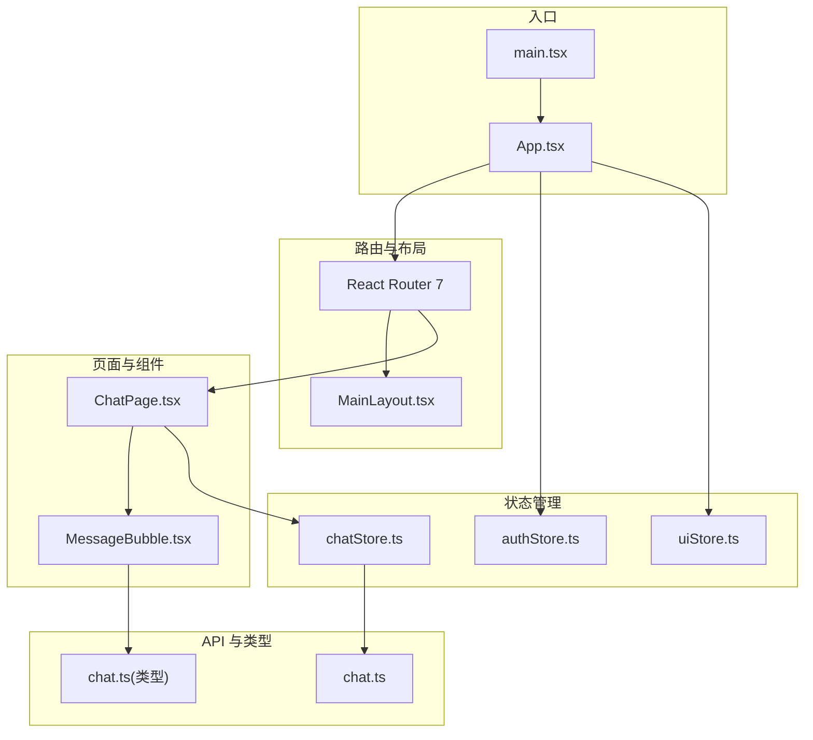
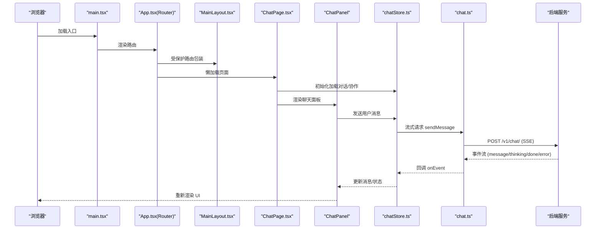
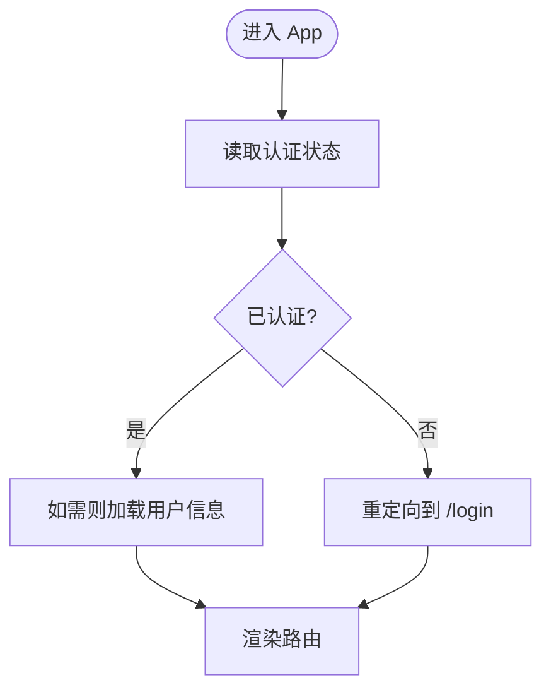
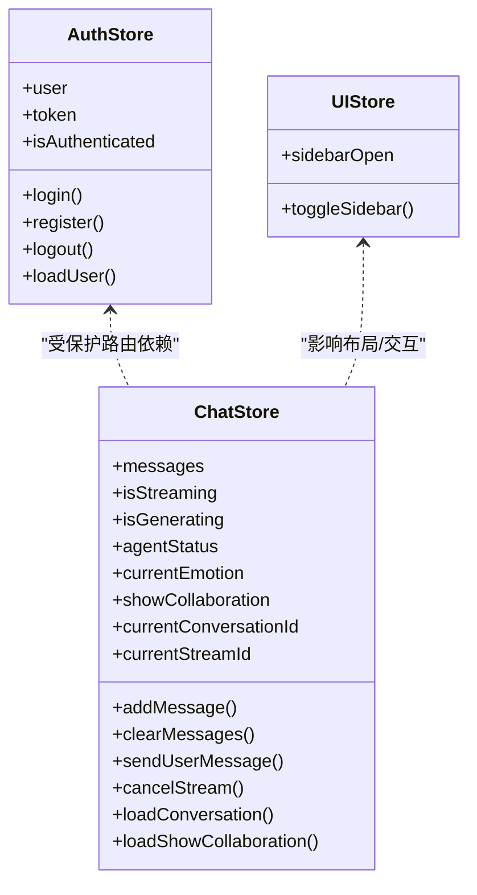
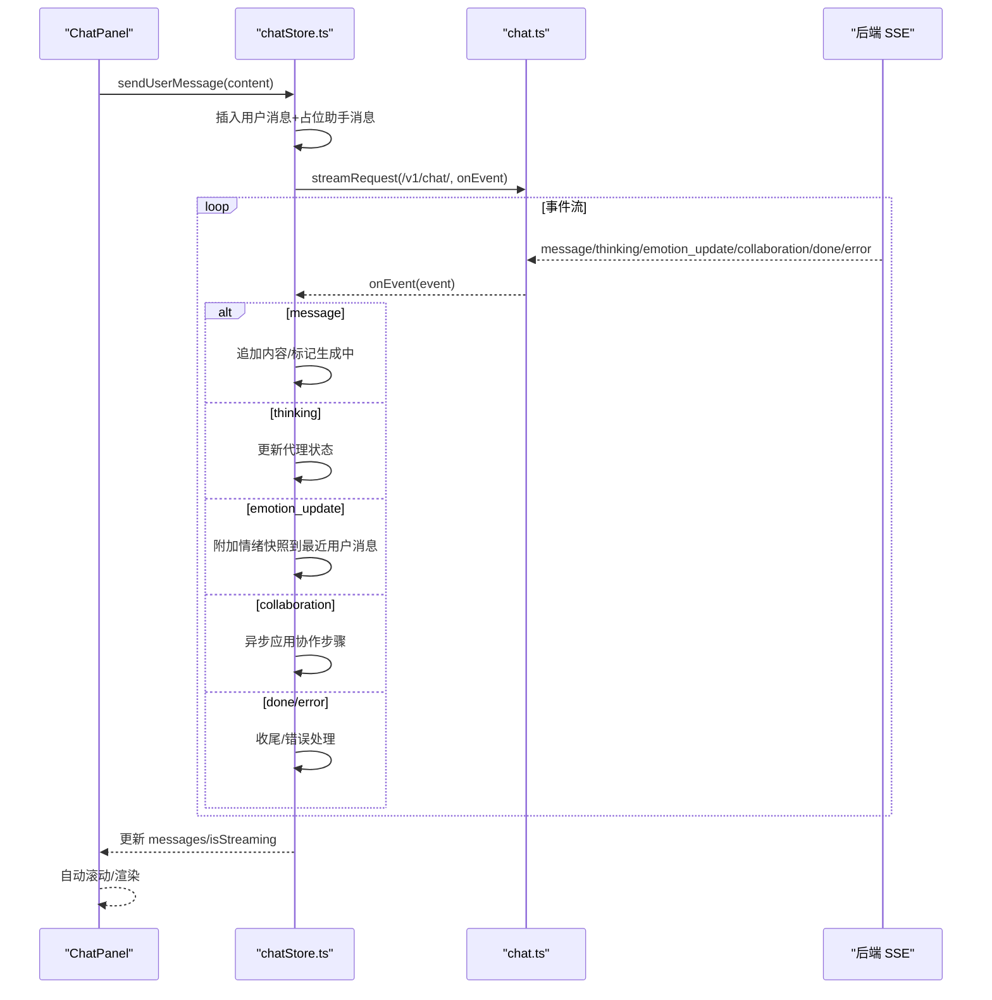
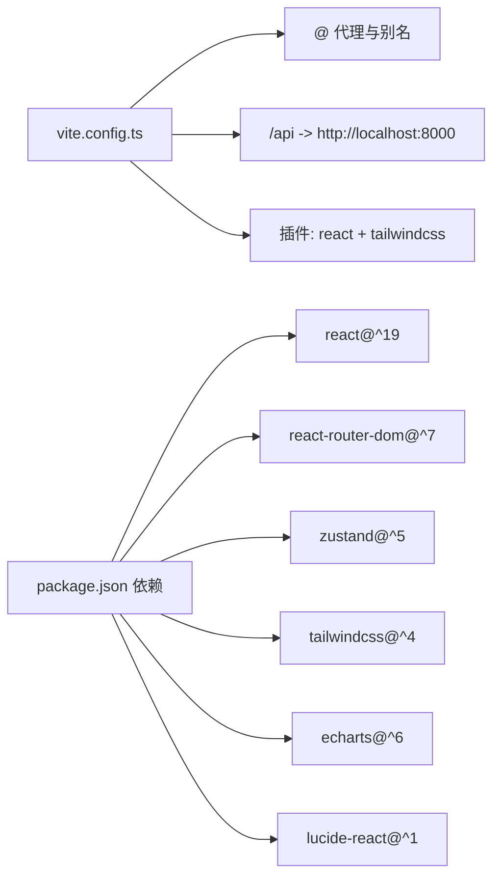

# 前端开发指南

<cite>
**本文引用的文件**
- [package.json](file://frontend/package.json)
- [vite.config.ts](file://frontend/vite.config.ts)
- [tsconfig.json](file://frontend/tsconfig.json)
- [main.tsx](file://frontend/src/main.tsx)
- [App.tsx](file://frontend/src/App.tsx)
- [authStore.ts](file://frontend/src/stores/authStore.ts)
- [chatStore.ts](file://frontend/src/stores/chatStore.ts)
- [uiStore.ts](file://frontend/src/stores/uiStore.ts)
- [MainLayout.tsx](file://frontend/src/components/layout/MainLayout.tsx)
- [ChatPage.tsx](file://frontend/src/pages/ChatPage.tsx)
- [chat.ts](file://frontend/src/api/chat.ts)
- [MessageBubble.tsx](file://frontend/src/components/chat/MessageBubble.tsx)
- [chat.ts](file://frontend/src/types/chat.ts)
- [cn.ts](file://frontend/src/utils/cn.ts)
</cite>

## 目录
1. [简介](#简介)
2. [项目结构](#项目结构)
3. [核心组件](#核心组件)
4. [架构总览](#架构总览)
5. [详细组件分析](#详细组件分析)
6. [依赖关系分析](#依赖关系分析)
7. [性能考虑](#性能考虑)
8. [故障排查指南](#故障排查指南)
9. [结论](#结论)
10. [附录](#附录)

## 简介
本指南面向不同前端技能水平的开发者，系统讲解基于 React 19 + TypeScript 的 XuanJi 前端工程实践，涵盖项目结构、组件设计模式、状态管理策略、Zustand 状态管理、React Router 7 路由配置、Tailwind CSS 样式体系、WebSocket/SSE 实时通信、组件库与 UI 状态管理、性能优化与构建配置等。通过循序渐进的学习路径，帮助你快速掌握从入门到进阶的关键能力。

## 项目结构
前端采用 Vite + React 19 + TypeScript + Tailwind CSS + Zustand + React Router 7 的现代化技术栈。目录组织遵循“功能域 + 分层”的混合方式：
- src/api：统一的后端接口封装，支持普通请求与流式请求
- src/stores：Zustand 状态仓库（认证、聊天、UI）
- src/components：可复用 UI 组件（布局、聊天、共享、工具）
- src/pages：页面级组件（路由懒加载）
- src/types：TypeScript 类型定义
- src/utils：通用工具函数（类名合并、日期格式化等）

图表来源
- [main.tsx:1-14](file://frontend/src/main.tsx#L1-L14)
- [App.tsx:1-77](file://frontend/src/App.tsx#L1-L77)
- [MainLayout.tsx:1-19](file://frontend/src/components/layout/MainLayout.tsx#L1-L19)
- [ChatPage.tsx:1-17](file://frontend/src/pages/ChatPage.tsx#L1-L17)
- [MessageBubble.tsx:1-282](file://frontend/src/components/chat/MessageBubble.tsx#L1-L282)
- [authStore.ts:1-53](file://frontend/src/stores/authStore.ts#L1-L53)
- [chatStore.ts:1-291](file://frontend/src/stores/chatStore.ts#L1-L291)
- [uiStore.ts:1-12](file://frontend/src/stores/uiStore.ts#L1-L12)
- [chat.ts:1-49](file://frontend/src/api/chat.ts#L1-L49)
- [chat.ts:1-47](file://frontend/src/types/chat.ts#L1-L47)

章节来源
- [package.json:1-44](file://frontend/package.json#L1-L44)
- [vite.config.ts:1-35](file://frontend/vite.config.ts#L1-L35)
- [tsconfig.json:1-8](file://frontend/tsconfig.json#L1-L8)
- [main.tsx:1-14](file://frontend/src/main.tsx#L1-L14)
- [App.tsx:1-77](file://frontend/src/App.tsx#L1-L77)

## 核心组件
- 路由与入口
  - 入口文件在应用根节点包裹路由上下文，并挂载应用组件
  - 应用顶层路由负责登录页与受保护页面的懒加载与鉴权拦截
- 状态管理
  - 认证状态：本地存储令牌，支持登录、注册、登出、加载用户信息
  - 聊天状态：维护消息列表、流式状态、协作展示、情绪快照、取消流等
  - UI 状态：侧边栏开关等轻量 UI 状态
- 页面与组件
  - 聊天页：初始化加载最近对话与协作设置
  - 聊天面板：滚动、占位消息、日期分隔、流式渲染、取消流
  - 消息气泡：解析思考标签、角色配色、协作过程可视化、时间戳

章节来源
- [main.tsx:1-14](file://frontend/src/main.tsx#L1-L14)
- [App.tsx:1-77](file://frontend/src/App.tsx#L1-L77)
- [authStore.ts:1-53](file://frontend/src/stores/authStore.ts#L1-L53)
- [chatStore.ts:1-291](file://frontend/src/stores/chatStore.ts#L1-L291)
- [uiStore.ts:1-12](file://frontend/src/stores/uiStore.ts#L1-L12)
- [ChatPage.tsx:1-17](file://frontend/src/pages/ChatPage.tsx#L1-L17)
- [MessageBubble.tsx:1-282](file://frontend/src/components/chat/MessageBubble.tsx#L1-L282)

## 架构总览
下图展示了前端从入口到页面、组件、状态与 API 的整体交互流程：

图表来源
- [main.tsx:1-14](file://frontend/src/main.tsx#L1-L14)
- [App.tsx:1-77](file://frontend/src/App.tsx#L1-L77)
- [MainLayout.tsx:1-19](file://frontend/src/components/layout/MainLayout.tsx#L1-L19)
- [ChatPage.tsx:1-17](file://frontend/src/pages/ChatPage.tsx#L1-L17)
- [chatStore.ts:116-291](file://frontend/src/stores/chatStore.ts#L116-L291)
- [chat.ts:35-49](file://frontend/src/api/chat.ts#L35-L49)

## 详细组件分析

### 路由与鉴权（React Router 7 + Zustand）
- 路由懒加载与受保护路由：登录页与业务页均采用动态导入；受保护路由根据认证状态决定是否放行或重定向
- 首次进入时尝试加载用户信息，避免重复请求
- 顶层路由负责兜底 404 到首页

图表来源
- [App.tsx:13-31](file://frontend/src/App.tsx#L13-L31)
- [authStore.ts:41-51](file://frontend/src/stores/authStore.ts#L41-L51)

章节来源
- [App.tsx:1-77](file://frontend/src/App.tsx#L1-L77)
- [authStore.ts:1-53](file://frontend/src/stores/authStore.ts#L1-L53)

### Zustand 状态管理策略
- 认证状态（authStore）
  - 数据：用户、令牌、认证标志
  - 行为：登录/注册写入本地存储并更新状态；登出清理；加载用户信息失败自动清除令牌
- 聊天状态（chatStore）
  - 数据：消息列表、流式/生成状态、代理状态、当前情绪、协作展示、对话/流标识
  - 行为：发送消息、取消流、加载最近对话、解析后端事件（message/thinking/emotion_update/collaboration/done/error）、安全兜底
- UI 状态（uiStore）
  - 数据：侧边栏开关
  - 行为：切换侧边栏

图表来源
- [authStore.ts:5-13](file://frontend/src/stores/authStore.ts#L5-L13)
- [chatStore.ts:6-23](file://frontend/src/stores/chatStore.ts#L6-L23)
- [uiStore.ts:3-6](file://frontend/src/stores/uiStore.ts#L3-L6)

章节来源
- [authStore.ts:1-53](file://frontend/src/stores/authStore.ts#L1-L53)
- [chatStore.ts:1-291](file://frontend/src/stores/chatStore.ts#L1-L291)
- [uiStore.ts:1-12](file://frontend/src/stores/uiStore.ts#L1-L12)

### 聊天面板与消息渲染（SSE 事件驱动）
- 发送消息流程：构造用户消息、插入占位助手消息、建立 AbortController、调用流式接口
- 事件处理：
  - message：增量拼接到占位消息，首个文本块后标记为生成中
  - thinking：更新代理状态文案
  - emotion_update：解析情绪快照并附加到最近的用户消息
  - collaboration：异步应用协作步骤到占位消息
  - done/error：收尾状态、错误提示、安全兜底
- 滚动与日期分隔：自动滚动到底部；按日期分隔消息
- 消息气泡：
  - 解析 think 标签为可折叠“思考过程”
  - 角色配色映射与协作过程横向时间线可视化
  - 时间戳与可展开的决策气泡

图表来源
- [chatStore.ts:116-291](file://frontend/src/stores/chatStore.ts#L116-L291)
- [chat.ts:35-49](file://frontend/src/api/chat.ts#L35-L49)
- [MessageBubble.tsx:208-282](file://frontend/src/components/chat/MessageBubble.tsx#L208-L282)

章节来源
- [ChatPage.tsx:1-17](file://frontend/src/pages/ChatPage.tsx#L1-L17)
- [MessageBubble.tsx:1-282](file://frontend/src/components/chat/MessageBubble.tsx#L1-L282)
- [chatStore.ts:1-291](file://frontend/src/stores/chatStore.ts#L1-L291)
- [chat.ts:1-49](file://frontend/src/api/chat.ts#L1-L49)

### 布局与 UI 状态
- 主布局：左侧侧边栏 + 右侧内容区（头部 + 主体），全屏溢出控制
- UI 状态：侧边栏开关，配合路由懒加载与组件渲染

章节来源
- [MainLayout.tsx:1-19](file://frontend/src/components/layout/MainLayout.tsx#L1-L19)
- [uiStore.ts:1-12](file://frontend/src/stores/uiStore.ts#L1-L12)

### 样式系统（Tailwind CSS + 工具函数）
- 类名合并：使用 clsx + tailwind-merge 合理合并条件类名，避免冲突
- 设计语言：以“plum/ink/amber/emerald/sky”等色板为主，深浅色主题适配

章节来源
- [cn.ts:1-7](file://frontend/src/utils/cn.ts#L1-L7)

## 依赖关系分析
- 构建与开发
  - Vite 提供开发服务器、热更新与打包；配置别名 @ 指向 src；代理 /api 到后端 8000 端口
  - TypeScript 通过多 tsconfig 引用组织应用与 Node 环境配置
- 运行时依赖
  - React 19 + React Router 7 + Zustand + Tailwind CSS + ECharts + Lucide React
- 开发依赖
  - ESLint + Prettier + Tailwind Vite 插件 + Vite React 插件

图表来源
- [vite.config.ts:1-35](file://frontend/vite.config.ts#L1-L35)
- [package.json:12-42](file://frontend/package.json#L12-L42)

章节来源
- [vite.config.ts:1-35](file://frontend/vite.config.ts#L1-L35)
- [package.json:1-44](file://frontend/package.json#L1-L44)
- [tsconfig.json:1-8](file://frontend/tsconfig.json#L1-L8)

## 性能考虑
- 代码分割与懒加载
  - 路由级懒加载减少首屏体积
  - Vite 配置对 ECharts 手动分包，避免大依赖被打散
- 状态粒度与订阅
  - 将 UI 状态（如侧边栏）与业务状态（聊天消息）分离，降低无关重渲染
  - 在组件内部按需订阅最小状态片段
- 渲染优化
  - 消息列表使用稳定 key，日期分隔按需渲染
  - 占位消息与增量更新，避免整列表重绘
- 请求与流控
  - 使用 AbortController 取消未完成流，防止资源浪费
  - 对协作步骤使用 requestIdleCallback 或 setTimeout 异步应用，保证交互流畅
- 样式与体积
  - 合理使用 tailwind-merge 避免重复类名
  - 按需引入图标与组件，避免全局样式污染

章节来源
- [vite.config.ts:8-19](file://frontend/vite.config.ts#L8-L19)
- [chatStore.ts:108-114](file://frontend/src/stores/chatStore.ts#L108-L114)
- [MessageBubble.tsx:240-244](file://frontend/src/components/chat/MessageBubble.tsx#L240-L244)

## 故障排查指南
- 登录后无法进入受保护页面
  - 检查认证状态是否写入本地存储，确认路由守卫逻辑
- 流式消息卡住或 UI 不更新
  - 确认后端 conversation_id 是否一致，避免跨对话事件串扰
  - 检查 done 事件是否到达，必要时依赖 finally 块兜底
- 错误提示未显示
  - 用户主动取消会抛出 AbortError，需区分处理
- 样式异常或类名冲突
  - 使用 cn 工具函数合并类名，确保 tailwind-merge 生效

章节来源
- [authStore.ts:20-39](file://frontend/src/stores/authStore.ts#L20-L39)
- [chatStore.ts:150-162](file://frontend/src/stores/chatStore.ts#L150-L162)
- [chatStore.ts:246-259](file://frontend/src/stores/chatStore.ts#L246-L259)
- [chatStore.ts:265-288](file://frontend/src/stores/chatStore.ts#L265-L288)
- [cn.ts:1-7](file://frontend/src/utils/cn.ts#L1-L7)

## 结论
本指南围绕 React 19 + TypeScript 的现代前端工程，系统梳理了路由、状态、组件、样式与实时通信的实现要点。通过 Zustand 的轻量模型、React Router 7 的懒加载与受保护路由、Tailwind 的实用样式体系，以及 SSE 的事件驱动渲染，XuanJi 前端实现了清晰的职责划分与良好的用户体验。建议在实际开发中持续关注状态粒度、渲染性能与错误兜底，逐步引入更完善的类型约束与测试策略。

## 附录
- 学习路径建议
  - 入门：Vite + React 19 基础、TypeScript 基本类型、Tailwind 原子类
  - 进阶：React Router 7 路由与懒加载、Zustand 状态拆分与订阅
  - 高阶：SSE 事件流解析、组件可复用性与设计系统、性能优化与构建配置
- 关键实现参考
  - [路由与入口:1-14](file://frontend/src/main.tsx#L1-L14)
  - [受保护路由与懒加载:1-77](file://frontend/src/App.tsx#L1-L77)
  - [认证状态管理:1-53](file://frontend/src/stores/authStore.ts#L1-L53)
  - [聊天状态与事件处理:1-291](file://frontend/src/stores/chatStore.ts#L1-L291)
  - [聊天面板与消息渲染:1-282](file://frontend/src/components/chat/MessageBubble.tsx#L1-L282)
  - [API 封装与流式请求:1-49](file://frontend/src/api/chat.ts#L1-L49)
  - [构建与别名配置:1-35](file://frontend/vite.config.ts#L1-L35)
  - [类型定义:1-47](file://frontend/src/types/chat.ts#L1-L47)