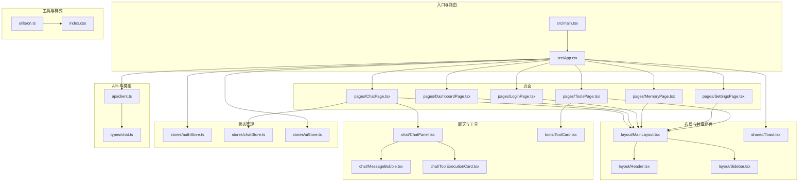
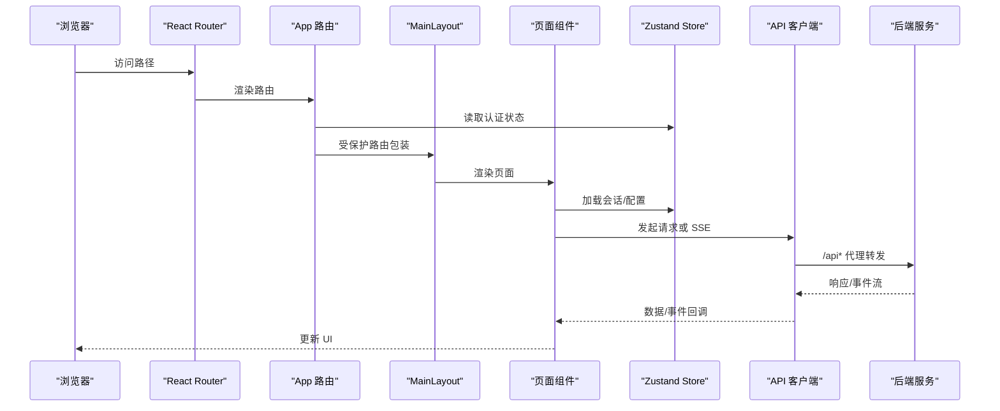
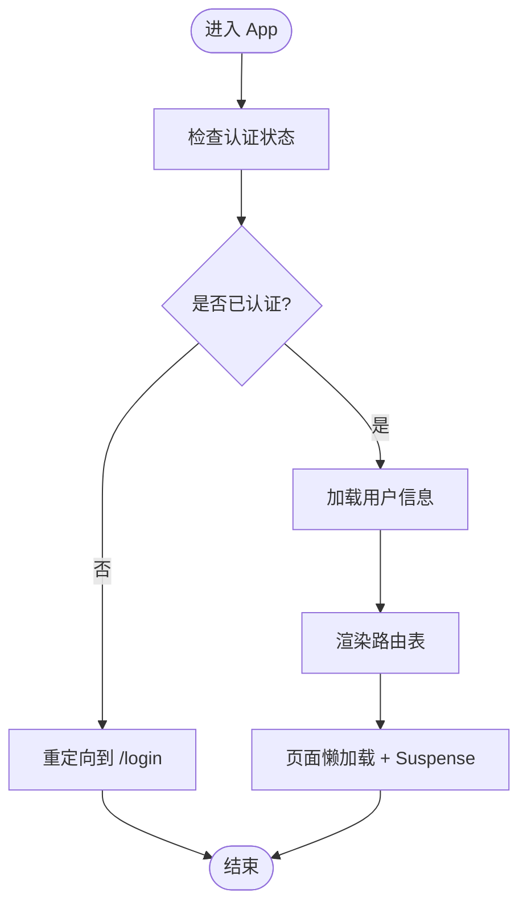
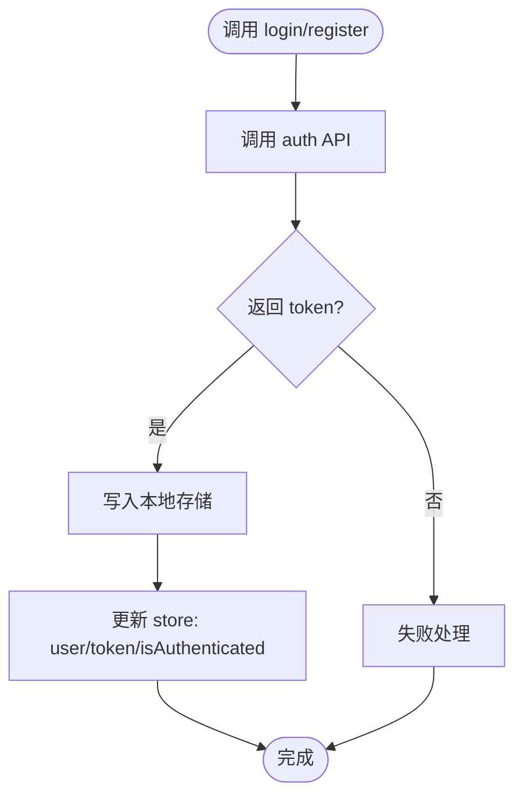
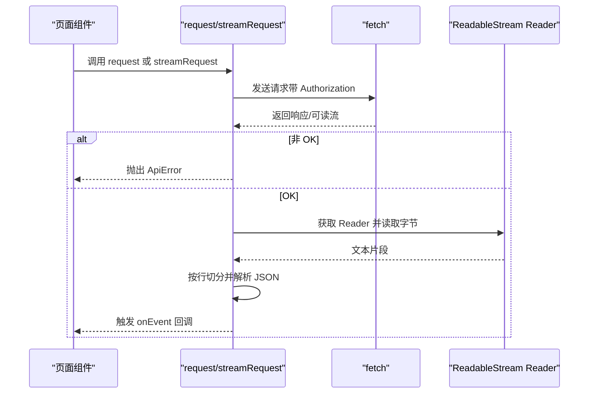
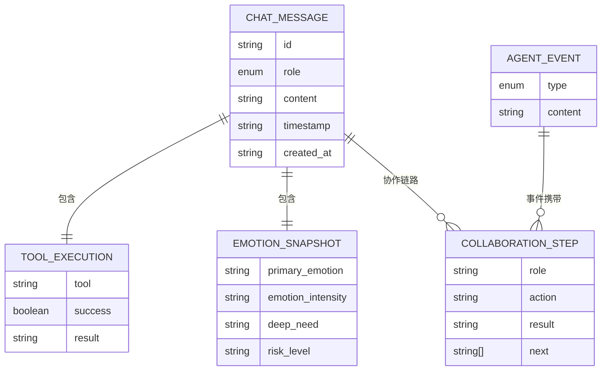
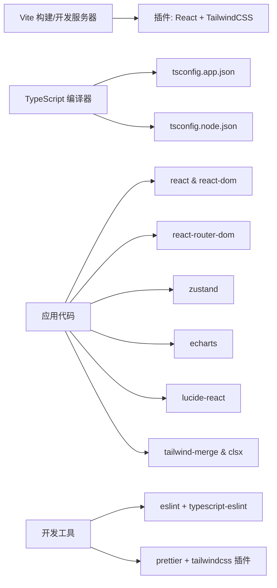

# 前端架构设计

<cite>
**本文引用的文件**
- [frontend/package.json](file://frontend/package.json)
- [frontend/vite.config.ts](file://frontend/vite.config.ts)
- [frontend/tsconfig.json](file://frontend/tsconfig.json)
- [frontend/tsconfig.app.json](file://frontend/tsconfig.app.json)
- [frontend/tsconfig.node.json](file://frontend/tsconfig.node.json)
- [frontend/eslint.config.js](file://frontend/eslint.config.js)
- [frontend/src/main.tsx](file://frontend/src/main.tsx)
- [frontend/src/App.tsx](file://frontend/src/App.tsx)
- [frontend/src/index.css](file://frontend/src/index.css)
- [frontend/src/stores/authStore.ts](file://frontend/src/stores/authStore.ts)
- [frontend/src/components/layout/MainLayout.tsx](file://frontend/src/components/layout/MainLayout.tsx)
- [frontend/src/pages/ChatPage.tsx](file://frontend/src/pages/ChatPage.tsx)
- [frontend/src/api/client.ts](file://frontend/src/api/client.ts)
- [frontend/src/types/chat.ts](file://frontend/src/types/chat.ts)
- [frontend/src/utils/cn.ts](file://frontend/src/utils/cn.ts)
</cite>

## 目录
1. [引言](#引言)
2. [项目结构](#项目结构)
3. [核心组件](#核心组件)
4. [架构总览](#架构总览)
5. [详细组件分析](#详细组件分析)
6. [依赖关系分析](#依赖关系分析)
7. [性能考虑](#性能考虑)
8. [故障排查指南](#故障排查指南)
9. [结论](#结论)
10. [附录](#附录)

## 引言
本文件面向架构师与高级前端工程师，系统阐述 XuanJi 前端在 React 19 + TypeScript 下的整体架构设计与实现细节。内容覆盖项目结构布局、模块化组织、构建配置策略、开发服务器与代理、生产环境优化、TypeScript 类型系统与模块导入导出规范、代码分割策略、性能优化与缓存、CDN 集成建议、架构决策的技术考量、扩展性设计原则与维护性最佳实践。

## 项目结构
前端采用以功能域为中心的分层组织：页面、组件、类型、状态管理、API 客户端、工具函数与样式资源。入口通过路由懒加载与 Suspense 提供首屏快速渲染；状态管理采用 Zustand；UI 采用 TailwindCSS；图表使用 ECharts；图标库使用 lucide-react；工具类函数提供类名合并等通用能力。

图示来源
- [frontend/src/main.tsx:1-14](file://frontend/src/main.tsx#L1-L14)
- [frontend/src/App.tsx:1-77](file://frontend/src/App.tsx#L1-L77)
- [frontend/src/components/layout/MainLayout.tsx:1-19](file://frontend/src/components/layout/MainLayout.tsx#L1-L19)
- [frontend/src/pages/ChatPage.tsx:1-17](file://frontend/src/pages/ChatPage.tsx#L1-L17)
- [frontend/src/stores/authStore.ts:1-53](file://frontend/src/stores/authStore.ts#L1-L53)
- [frontend/src/api/client.ts:1-119](file://frontend/src/api/client.ts#L1-L119)
- [frontend/src/types/chat.ts:1-47](file://frontend/src/types/chat.ts#L1-L47)
- [frontend/src/utils/cn.ts:1-7](file://frontend/src/utils/cn.ts#L1-L7)
- [frontend/src/index.css:1-35](file://frontend/src/index.css#L1-L35)

章节来源
- [frontend/src/main.tsx:1-14](file://frontend/src/main.tsx#L1-L14)
- [frontend/src/App.tsx:1-77](file://frontend/src/App.tsx#L1-L77)

## 核心组件
- 应用入口与路由：应用在入口中挂载路由容器，并在根路由中对受保护页面进行鉴权拦截与布局包裹；登录页与受保护页面分别懒加载，结合 Suspense 提供加载态。
- 状态管理：使用 Zustand 管理认证状态与用户信息，支持登录、注册、登出与用户信息拉取；聊天与 UI 状态分别由对应 store 管理。
- API 客户端：统一请求封装与流式事件解析（SSE），自动注入 Token，错误类型化抛出，便于上层捕获与提示。
- 组件体系：采用布局组件承载侧边栏与头部，页面组件负责业务数据加载，聊天组件负责消息展示与工具执行卡片，共享组件提供全局通知。
- 工具与样式：类名合并工具整合 clsx 与 tailwind-merge，确保样式冲突最小化；主题色板通过 Tailwind 自定义变量注入。

章节来源
- [frontend/src/App.tsx:1-77](file://frontend/src/App.tsx#L1-L77)
- [frontend/src/stores/authStore.ts:1-53](file://frontend/src/stores/authStore.ts#L1-L53)
- [frontend/src/api/client.ts:1-119](file://frontend/src/api/client.ts#L1-L119)
- [frontend/src/components/layout/MainLayout.tsx:1-19](file://frontend/src/components/layout/MainLayout.tsx#L1-L19)
- [frontend/src/utils/cn.ts:1-7](file://frontend/src/utils/cn.ts#L1-L7)
- [frontend/src/index.css:1-35](file://frontend/src/index.css#L1-L35)

## 架构总览
下图展示了从浏览器到后端服务的端到端交互路径，以及前端内部的模块协作关系。

图示来源
- [frontend/src/App.tsx:1-77](file://frontend/src/App.tsx#L1-L77)
- [frontend/src/components/layout/MainLayout.tsx:1-19](file://frontend/src/components/layout/MainLayout.tsx#L1-L19)
- [frontend/src/pages/ChatPage.tsx:1-17](file://frontend/src/pages/ChatPage.tsx#L1-L17)
- [frontend/src/stores/authStore.ts:1-53](file://frontend/src/stores/authStore.ts#L1-L53)
- [frontend/src/api/client.ts:1-119](file://frontend/src/api/client.ts#L1-L119)
- [frontend/vite.config.ts:25-33](file://frontend/vite.config.ts#L25-L33)

## 详细组件分析

### 路由与懒加载
- 使用 React Router 的路由表与受保护路由包装，未登录用户重定向至登录页；已登录用户进入受保护页面时，先加载用户信息。
- 页面组件采用动态导入与 Suspense 提供首屏加载指示，降低首屏包体与白屏时间。

图示来源
- [frontend/src/App.tsx:1-77](file://frontend/src/App.tsx#L1-L77)

章节来源
- [frontend/src/App.tsx:1-77](file://frontend/src/App.tsx#L1-L77)

### 状态管理（Zustand）
- 认证状态集中于 authStore，持久化存储 Token 并在登录/注册成功后写入本地存储；登出时移除 Token 并重置状态。
- 提供登录、注册、登出、加载用户信息等方法，供路由与页面组件调用。

图示来源
- [frontend/src/stores/authStore.ts:1-53](file://frontend/src/stores/authStore.ts#L1-L53)

章节来源
- [frontend/src/stores/authStore.ts:1-53](file://frontend/src/stores/authStore.ts#L1-L53)

### API 客户端与流式事件（SSE）
- 统一请求封装，自动注入 Authorization 头；非 OK 状态抛出自定义 ApiError，便于上层捕获。
- 流式事件解析支持按行解析 SSE，逐条 JSON 解析并触发回调；对解析错误进行计数保护，避免无限循环。

图示来源
- [frontend/src/api/client.ts:1-119](file://frontend/src/api/client.ts#L1-L119)

章节来源
- [frontend/src/api/client.ts:1-119](file://frontend/src/api/client.ts#L1-L119)

### 类型系统与数据模型
- 聊天相关类型定义了消息、工具执行、情感快照与协作步骤等结构，保证前后端数据契约一致。
- 类型文件位于 types 目录，供 API、组件与状态管理共同消费。

图示来源
- [frontend/src/types/chat.ts:1-47](file://frontend/src/types/chat.ts#L1-L47)

章节来源
- [frontend/src/types/chat.ts:1-47](file://frontend/src/types/chat.ts#L1-L47)

### 样式与工具函数
- 主题色板通过 Tailwind 自定义变量注入，统一品牌视觉风格；基础排版与背景色在全局样式中定义。
- 类名合并工具整合 clsx 与 tailwind-merge，减少重复与冲突类名。

章节来源
- [frontend/src/index.css:1-35](file://frontend/src/index.css#L1-L35)
- [frontend/src/utils/cn.ts:1-7](file://frontend/src/utils/cn.ts#L1-L7)

## 依赖关系分析
- 构建与开发：Vite 提供开发服务器与代理，插件集成 React 与 TailwindCSS；TypeScript 通过多 tsconfig 分离应用与 Node 环境编译目标。
- 运行时依赖：React 19、React Router DOM、Zustand、ECharts、Lucide React、Tailwind Merge、clsx。
- 开发依赖：ESLint、Prettier、TailwindCSS Vite 插件、TypeScript、Vite、PostCSS 等。

图示来源
- [frontend/package.json:1-44](file://frontend/package.json#L1-L44)
- [frontend/vite.config.ts:1-35](file://frontend/vite.config.ts#L1-L35)
- [frontend/tsconfig.json:1-8](file://frontend/tsconfig.json#L1-L8)
- [frontend/tsconfig.app.json:1-33](file://frontend/tsconfig.app.json#L1-L33)
- [frontend/tsconfig.node.json:1-25](file://frontend/tsconfig.node.json#L1-L25)
- [frontend/eslint.config.js:1-29](file://frontend/eslint.config.js#L1-L29)

章节来源
- [frontend/package.json:1-44](file://frontend/package.json#L1-L44)
- [frontend/vite.config.ts:1-35](file://frontend/vite.config.ts#L1-L35)
- [frontend/tsconfig.json:1-8](file://frontend/tsconfig.json#L1-L8)
- [frontend/tsconfig.app.json:1-33](file://frontend/tsconfig.app.json#L1-L33)
- [frontend/tsconfig.node.json:1-25](file://frontend/tsconfig.node.json#L1-L25)
- [frontend/eslint.config.js:1-29](file://frontend/eslint.config.js#L1-L29)

## 性能考虑
- 代码分割与懒加载：路由级懒加载与 Suspense 提升首屏性能，减少初始包体积。
- 图表库拆分：通过 Rollup 手动分包将 ECharts 单独拆分为独立 chunk，避免主包引入大体积依赖。
- 构建警告阈值：提升打包体积警告阈值，避免小规模体积增长触发告警。
- CSS 与字体：Tailwind 按需生成样式，配合字体平滑渲染与最小化重排。
- 缓存策略：建议在生产环境启用 HTTP 缓存头与浏览器缓存；静态资源可配合 CDN；Token 本地存储用于减少重复鉴权开销。
- CDN 集成：可在生产构建产物部署至 CDN，结合长期缓存与版本化命名，提升全球访问速度。
- 开发体验：Vite 启用热更新与快速冷启动，代理后端接口避免跨域问题。

章节来源
- [frontend/vite.config.ts:8-19](file://frontend/vite.config.ts#L8-L19)
- [frontend/src/App.tsx:7-12](file://frontend/src/App.tsx#L7-L12)

## 故障排查指南
- 请求异常：当后端返回非 OK 状态时，API 客户端抛出自定义错误对象，包含状态码与消息；上层组件应捕获并提示用户。
- SSE 解析错误：若连续解析失败超过阈值，客户端主动终止并抛错；建议在上层增加重试与降级逻辑。
- 代理与跨域：开发服务器通过代理将 /api 前缀转发至后端地址；如出现跨域，请检查代理配置与后端 CORS 设置。
- 类型错误：严格类型检查开启，避免 any 与未使用变量；遵循 ESLint 规则，保持代码一致性。
- 包体积告警：当前阈值已调整，如仍频繁告警，优先检查第三方依赖与未使用的模块。

章节来源
- [frontend/src/api/client.ts:38-44](file://frontend/src/api/client.ts#L38-L44)
- [frontend/src/api/client.ts:85-92](file://frontend/src/api/client.ts#L85-L92)
- [frontend/vite.config.ts:25-33](file://frontend/vite.config.ts#L25-L33)
- [frontend/eslint.config.js:22-26](file://frontend/eslint.config.js#L22-L26)

## 结论
XuanJi 前端采用现代工程化方案，结合 React 19 的并发特性、TypeScript 的强类型保障、Vite 的高性能构建与开发体验，形成高可维护、可扩展且具备良好性能表现的前端架构。通过路由懒加载、手动代码分割、统一 API 客户端与状态管理，以及 Tailwind 主题体系，满足复杂业务场景下的快速迭代与稳定交付需求。建议在生产环境中进一步完善缓存与 CDN 策略，持续优化首屏与交互性能。

## 附录
- 构建脚本与命令：开发、构建、预览、代码质量检查。
- TypeScript 配置：应用与 Node 环境分离编译，启用 bundler 模式与 JSX 语法。
- ESLint 配置：推荐规则集与禁用控制台级别，确保团队一致性。

章节来源
- [frontend/package.json:6-11](file://frontend/package.json#L6-L11)
- [frontend/tsconfig.app.json:1-33](file://frontend/tsconfig.app.json#L1-L33)
- [frontend/tsconfig.node.json:1-25](file://frontend/tsconfig.node.json#L1-L25)
- [frontend/eslint.config.js:8-28](file://frontend/eslint.config.js#L8-L28)