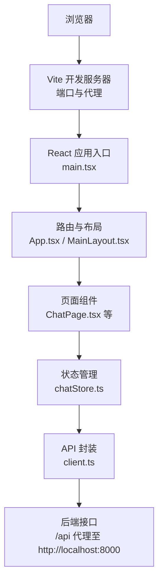
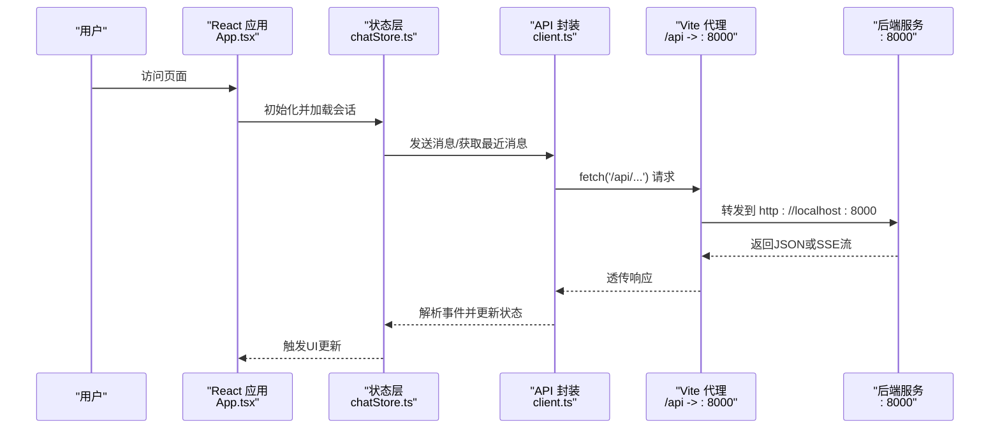
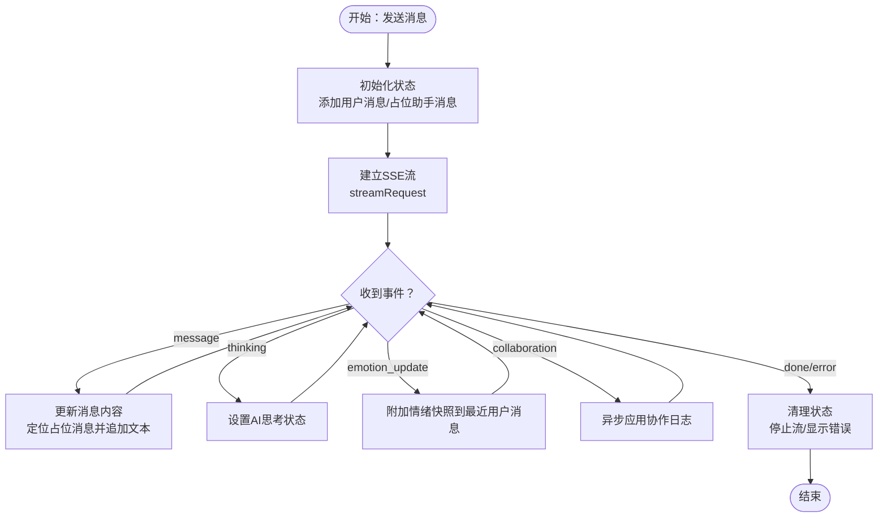
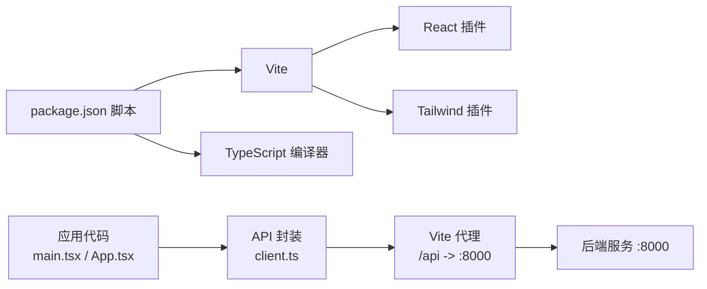

# 开发工具与配置

<cite>
**本文引用的文件**
- [vite.config.ts](file://frontend/vite.config.ts)
- [package.json](file://frontend/package.json)
- [tsconfig.json](file://frontend/tsconfig.json)
- [tsconfig.app.json](file://frontend/tsconfig.app.json)
- [tsconfig.node.json](file://frontend/tsconfig.node.json)
- [eslint.config.js](file://frontend/eslint.config.js)
- [.prettierrc](file://frontend/.prettierrc)
- [index.html](file://frontend/index.html)
- [src/main.tsx](file://frontend/src/main.tsx)
- [src/App.tsx](file://frontend/src/App.tsx)
- [src/pages/ChatPage.tsx](file://frontend/src/pages/ChatPage.tsx)
- [src/stores/chatStore.ts](file://frontend/src/stores/chatStore.ts)
- [src/api/client.ts](file://frontend/src/api/client.ts)
- [src/utils/cn.ts](file://frontend/src/utils/cn.ts)
- [src/components/layout/MainLayout.tsx](file://frontend/src/components/layout/MainLayout.tsx)
</cite>

## 目录
1. [简介](#简介)
2. [项目结构](#项目结构)
3. [核心组件](#核心组件)
4. [架构总览](#架构总览)
5. [详细组件分析](#详细组件分析)
6. [依赖关系分析](#依赖关系分析)
7. [性能考量](#性能考量)
8. [故障排查指南](#故障排查指南)
9. [结论](#结论)
10. [附录](#附录)

## 简介
本指南面向XuanJi前端开发团队，系统讲解Vite开发服务器、热重载、代理与构建配置；TypeScript编译与路径别名；ESLint与Prettier规范；Git钩子集成建议；以及调试、性能分析与构建优化的最佳实践。文档同时提供开发环境搭建、IDE配置建议与团队协作规范，帮助团队高效、一致地进行前端开发。

## 项目结构
前端工程位于frontend目录，采用React 19 + TypeScript + Vite 8 + TailwindCSS 4的现代技术栈。核心配置集中在根级配置文件中，应用入口与路由在src目录组织，API封装与状态管理分别位于api与stores目录，UI组件按功能模块拆分。

图表来源
- [vite.config.ts:25-33](file://frontend/vite.config.ts#L25-L33)
- [src/main.tsx:1-14](file://frontend/src/main.tsx#L1-L14)
- [src/App.tsx:21-77](file://frontend/src/App.tsx#L21-L77)
- [src/components/layout/MainLayout.tsx:8-18](file://frontend/src/components/layout/MainLayout.tsx#L8-L18)
- [src/pages/ChatPage.tsx:5-16](file://frontend/src/pages/ChatPage.tsx#L5-L16)
- [src/stores/chatStore.ts:25-291](file://frontend/src/stores/chatStore.ts#L25-L291)
- [src/api/client.ts:20-44](file://frontend/src/api/client.ts#L20-L44)

章节来源
- [index.html:1-14](file://frontend/index.html#L1-L14)
- [src/main.tsx:1-14](file://frontend/src/main.tsx#L1-L14)
- [src/App.tsx:21-77](file://frontend/src/App.tsx#L21-L77)

## 核心组件
- Vite开发服务器与代理
  - 开发端口：5173
  - 代理规则：将/api前缀转发至http://localhost:8000，支持跨域访问
  - 插件：@vitejs/plugin-react、@tailwindcss/vite
  - 构建优化：手动分包echarts，提升缓存命中率
  - 路径别名：@指向src目录，便于统一导入
- TypeScript编译
  - 多配置文件：tsconfig.json聚合app与node两类配置
  - app配置：Bundler模式、react-jsx、严格未使用检查、路径别名@/*
  - node配置：Bundler模式、包含vite.config.ts
- ESLint与Prettier
  - ESLint：推荐规则、TypeScript、React Hooks、React Refresh、全局忽略dist
  - Prettier：无分号、单引号、2空格缩进、尾随逗号、100字符行长、Tailwind插件
- 构建与脚本
  - dev/build/preview/lint脚本，先tsc -b再vite build

章节来源
- [vite.config.ts:6-34](file://frontend/vite.config.ts#L6-L34)
- [package.json:6-11](file://frontend/package.json#L6-L11)
- [tsconfig.json:1-8](file://frontend/tsconfig.json#L1-L8)
- [tsconfig.app.json:27-29](file://frontend/tsconfig.app.json#L27-L29)
- [eslint.config.js:8-28](file://frontend/eslint.config.js#L8-L28)
- [.prettierrc:1-9](file://frontend/.prettierrc#L1-L9)

## 架构总览
下图展示从浏览器到后端的请求链路，包括开发代理、API封装与SSE事件流处理。

图表来源
- [src/App.tsx:33-74](file://frontend/src/App.tsx#L33-L74)
- [src/stores/chatStore.ts:116-289](file://frontend/src/stores/chatStore.ts#L116-L289)
- [src/api/client.ts:20-118](file://frontend/src/api/client.ts#L20-L118)
- [vite.config.ts:27-32](file://frontend/vite.config.ts#L27-L32)

## 详细组件分析

### Vite开发服务器与热重载
- 开发服务器
  - 端口：5173
  - 热重载：基于React插件与浏览器刷新策略
- 代理设置
  - 将/api前缀转发至http://localhost:8000，changeOrigin启用
- 构建优化
  - 手动分包echarts，避免主包过大
  - chunkSizeWarningLimit提升告警阈值
- 路径别名
  - @指向src，统一导入路径

章节来源
- [vite.config.ts:25-34](file://frontend/vite.config.ts#L25-L34)

### TypeScript编译配置
- 配置聚合
  - tsconfig.json通过references引用app与node配置
- app配置要点
  - Bundler模式、react-jsx、严格未使用检查、路径别名@/*
  - 跳过库检查、JSON模块解析、类型注入vite/client
- node配置要点
  - 包含vite.config.ts，Bundler模式，严格未使用检查

章节来源
- [tsconfig.json:1-8](file://frontend/tsconfig.json#L1-L8)
- [tsconfig.app.json:1-33](file://frontend/tsconfig.app.json#L1-L33)
- [tsconfig.node.json:1-25](file://frontend/tsconfig.node.json#L1-L25)

### ESLint与Prettier
- ESLint
  - 继承推荐规则集，启用TypeScript、React Hooks、React Refresh
  - 全局忽略dist目录
  - 规则示例：禁止any、未使用变量、控制台警告级别
- Prettier
  - 无分号、单引号、2空格、尾随逗号、100字符行长
  - 集成TailwindCSS插件

章节来源
- [eslint.config.js:8-28](file://frontend/eslint.config.js#L8-L28)
- [.prettierrc:1-9](file://frontend/.prettierrc#L1-L9)

### API封装与SSE事件流
- 请求封装
  - request函数：自动拼接BASE_URL（优先VITE_API_BASE_URL），携带Authorization头
  - streamRequest函数：SSE流读取、事件解析、错误处理与断流保护
- 事件处理
  - chatStore根据事件类型更新消息、协作日志、情绪快照与生成状态
  - 对conversation_id进行校验，防止跨会话事件串扰
  - finally块确保状态安全恢复，避免UI卡死

图表来源
- [src/stores/chatStore.ts:116-289](file://frontend/src/stores/chatStore.ts#L116-L289)
- [src/api/client.ts:46-118](file://frontend/src/api/client.ts#L46-L118)

章节来源
- [src/api/client.ts:20-118](file://frontend/src/api/client.ts#L20-L118)
- [src/stores/chatStore.ts:25-291](file://frontend/src/stores/chatStore.ts#L25-L291)

### 路由与布局
- 应用路由
  - 登录页、聊天页、仪表盘、记忆页、设置页，均在受保护路由内渲染MainLayout
  - Suspense懒加载页面组件，提升首屏性能
- 主布局
  - Sidebar + Header + 主区域容器，统一背景与溢出策略

章节来源
- [src/App.tsx:33-74](file://frontend/src/App.tsx#L33-L74)
- [src/components/layout/MainLayout.tsx:8-18](file://frontend/src/components/layout/MainLayout.tsx#L8-L18)

### UI工具类与样式
- cn工具
  - 结合clsx与tailwind-merge，合并与去重CSS类，避免冲突
- Tailwind集成
  - 通过@tailwindcss/vite插件在Vite中生效

章节来源
- [src/utils/cn.ts:4-6](file://frontend/src/utils/cn.ts#L4-L6)
- [vite.config.ts:3](file://frontend/vite.config.ts#L3)

## 依赖关系分析
- 脚本与依赖
  - dev/build/preview/lint脚本依赖Vite与TypeScript
  - 运行时依赖包含React生态、路由、状态管理与可视化库
  - 开发依赖覆盖ESLint、Prettier、TailwindCSS与Vite插件
- 关键耦合点
  - API封装依赖Vite环境变量与代理
  - 路由与状态管理依赖路径别名@/*的一致性

图表来源
- [package.json:6-11](file://frontend/package.json#L6-L11)
- [vite.config.ts:7](file://frontend/vite.config.ts#L7)
- [src/api/client.ts:3](file://frontend/src/api/client.ts#L3)
- [vite.config.ts:27-32](file://frontend/vite.config.ts#L27-L32)

章节来源
- [package.json:12-42](file://frontend/package.json#L12-L42)
- [vite.config.ts:6-34](file://frontend/vite.config.ts#L6-L34)

## 性能考量
- 构建体积与分包
  - 手动分包echarts，降低主包体积，提升缓存命中
  - 提升chunkSizeWarningLimit，减少误报干扰
- 运行时性能
  - 页面懒加载与Suspense，缩短首屏阻塞时间
  - SSE事件异步应用协作日志，避免阻塞主线程
- 类型与检查
  - 严格的未使用检查与switch分支检查，降低运行时开销与潜在错误
- 样式与工具类
  - 使用cn/twMerge合并类名，避免重复与冲突，减少样式计算成本

章节来源
- [vite.config.ts:8-18](file://frontend/vite.config.ts#L8-L18)
- [src/App.tsx:36](file://frontend/src/App.tsx#L36)
- [src/stores/chatStore.ts:240-245](file://frontend/src/stores/chatStore.ts#L240-L245)
- [src/utils/cn.ts:4-6](file://frontend/src/utils/cn.ts#L4-L6)

## 故障排查指南
- 代理与跨域
  - 确认Vite代理已开启且目标地址正确
  - 若出现跨域问题，检查changeOrigin与CORS配置
- API请求失败
  - 检查BASE_URL与Authorization头是否正确设置
  - 关注ApiError抛出与错误消息体解析
- SSE事件异常
  - 注意conversation_id一致性校验，避免旧事件污染
  - 断流保护：超过一定次数解析错误将终止流
- TypeScript类型错误
  - 遵循禁用any与未使用变量规则，逐步消除告警
- ESLint/Prettier冲突
  - 在编辑器中启用ESLint与Prettier插件，保存时自动修复
  - 如需临时放宽规则，仅在局部作用域调整

章节来源
- [vite.config.ts:27-32](file://frontend/vite.config.ts#L27-L32)
- [src/api/client.ts:33-44](file://frontend/src/api/client.ts#L33-L44)
- [src/stores/chatStore.ts:150-162](file://frontend/src/stores/chatStore.ts#L150-L162)
- [src/stores/chatStore.ts:86-92](file://frontend/src/stores/chatStore.ts#L86-L92)
- [eslint.config.js:22-26](file://frontend/eslint.config.js#L22-L26)

## 结论
本指南提供了XuanJi前端开发工具链的完整配置与最佳实践：Vite开发服务器与代理、TypeScript编译与路径别名、ESLint与Prettier规范、API封装与SSE事件流、性能优化与故障排查。建议团队在本地与CI中统一这些配置，确保开发体验一致、代码质量稳定、交付效率持续提升。

## 附录
- 开发环境搭建建议
  - Node版本：与项目依赖兼容
  - 包管理器：推荐pnpm，与lock文件一致
  - IDE：VS Code，安装ESLint、Prettier、TailwindCSS插件
- IDE配置建议
  - 启用ESLint与Prettier保存时自动修复
  - 设置TypeScript为工作区语言服务
  - TailwindCSS IntelliSense启用
- 团队协作规范
  - 提交前执行lint与format
  - 分支命名与PR模板遵循团队约定
  - 变更类型与影响范围在提交信息中明确