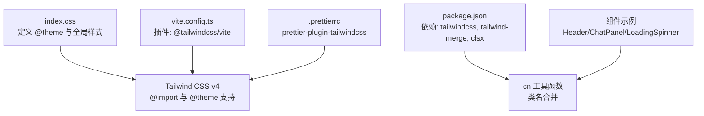
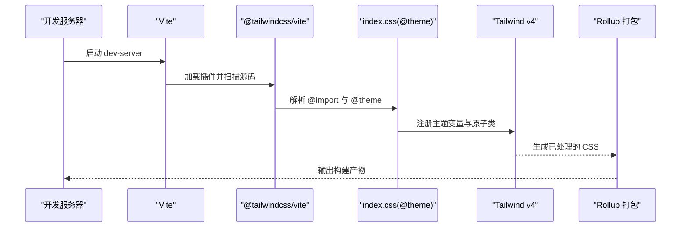
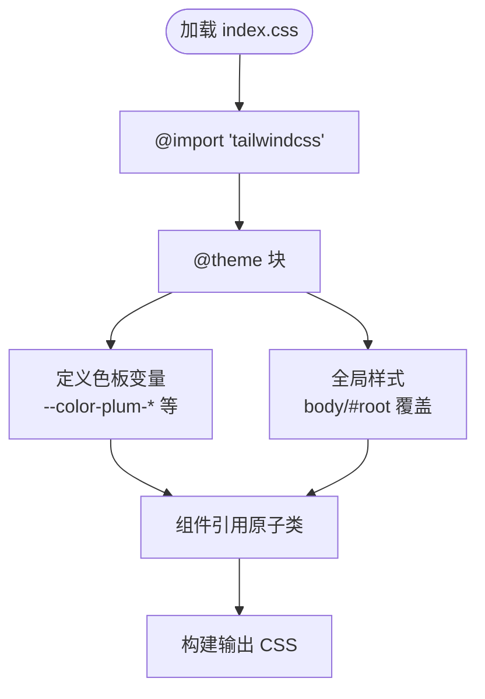
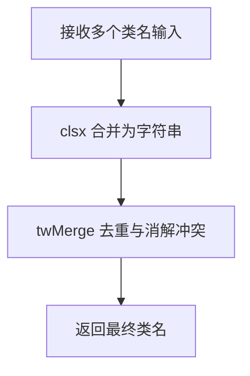
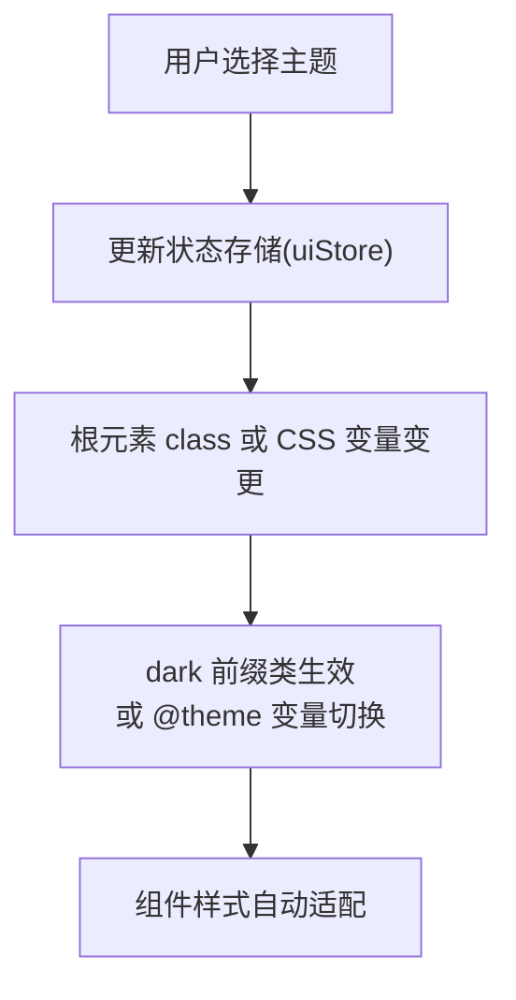
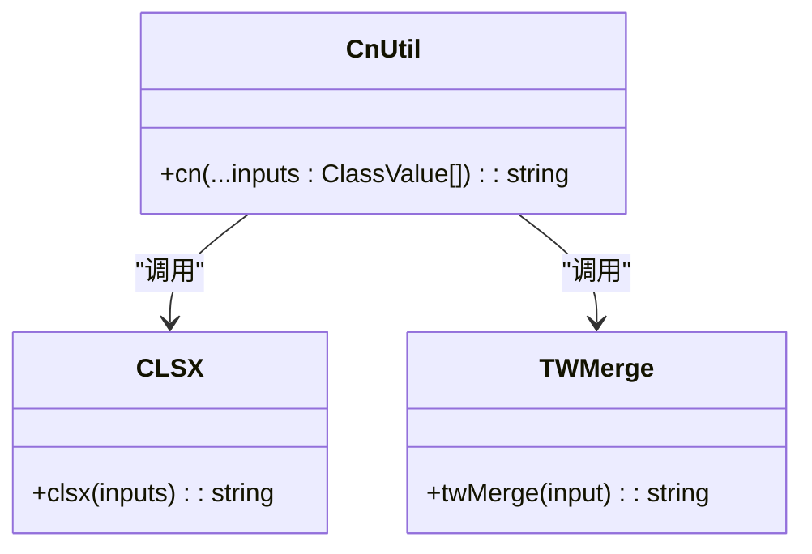
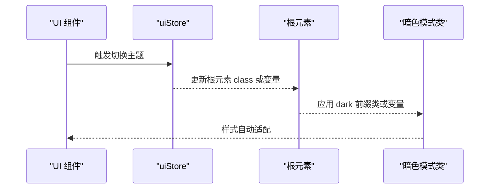
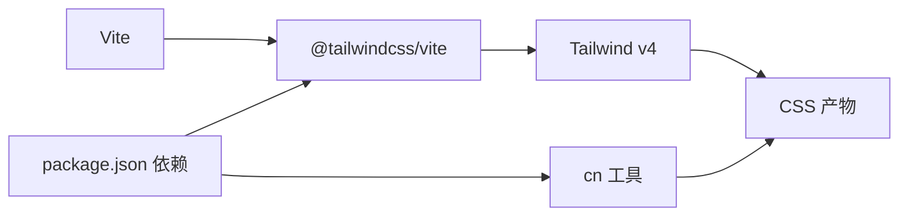

# 样式系统与主题

<cite>
**本文引用的文件**
- [index.css](file://frontend/src/index.css)
- [vite.config.ts](file://frontend/vite.config.ts)
- [package.json](file://frontend/package.json)
- [cn.ts](file://frontend/src/utils/cn.ts)
- [Header.tsx](file://frontend/src/components/layout/Header.tsx)
- [ChatPanel.tsx](file://frontend/src/components/chat/ChatPanel.tsx)
- [LoadingSpinner.tsx](file://frontend/src/components/shared/LoadingSpinner.tsx)
- [uiStore.ts](file://frontend/src/stores/uiStore.ts)
- [.prettierrc](file://frontend/.prettierrc)
</cite>

## 目录
1. [简介](#简介)
2. [项目结构](#项目结构)
3. [核心组件](#核心组件)
4. [架构总览](#架构总览)
5. [详细组件分析](#详细组件分析)
6. [依赖关系分析](#依赖关系分析)
7. [性能考量](#性能考量)
8. [故障排查指南](#故障排查指南)
9. [结论](#结论)
10. [附录](#附录)

## 简介
本设计文档聚焦于 XuanJi 前端的样式系统与主题机制，围绕 Tailwind CSS v4 的配置策略、原子化样式设计、响应式断点管理、CSS 变量系统、主题定制与暗色模式实现进行系统化梳理；同时阐述工具函数 cn 的类名合并策略、条件样式应用与动态主题切换思路，并给出样式组件化设计、CSS 模块化实践与性能优化建议。文档面向 UI 开发者，提供从基础到进阶的完整样式系统指南与设计系统最佳实践。

## 项目结构
前端采用 Vite + React + Tailwind CSS v4 构建，样式入口通过 @import 引入 Tailwind 并在 @theme 中声明自定义颜色变量，全局样式覆盖 body、#root 等根元素。构建配置启用 @tailwindcss/vite 插件以支持原生 CSS 的 @theme 与 @apply 等指令；同时通过 Prettier 插件确保 Tailwind 指令格式化一致性。

图表来源
- [index.css:1-35](file://frontend/src/index.css#L1-L35)
- [vite.config.ts:1-35](file://frontend/vite.config.ts#L1-L35)
- [package.json:1-44](file://frontend/package.json#L1-L44)
- [cn.ts:1-7](file://frontend/src/utils/cn.ts#L1-L7)
- [Header.tsx:1-31](file://frontend/src/components/layout/Header.tsx#L1-L31)
- [ChatPanel.tsx:1-67](file://frontend/src/components/chat/ChatPanel.tsx#L1-L67)
- [LoadingSpinner.tsx:1-22](file://frontend/src/components/shared/LoadingSpinner.tsx#L1-L22)
- [.prettierrc:1-8](file://frontend/.prettierrc#L1-L8)

章节来源
- [index.css:1-35](file://frontend/src/index.css#L1-L35)
- [vite.config.ts:1-35](file://frontend/vite.config.ts#L1-L35)
- [package.json:1-44](file://frontend/package.json#L1-L44)
- [.prettierrc:1-8](file://frontend/.prettierrc#L1-L8)

## 核心组件
- 样式入口与主题变量：通过 @theme 定义“梅花”主题色板（含 50–900 多级色阶）以及“花瓣白”“墨色”“枝条”等关键色彩，作为全局设计令牌统一使用。
- 类名合并工具 cn：基于 clsx 与 tailwind-merge，提供安全、高效的类名合并与冲突消解能力，避免重复或冲突的 Tailwind 类导致样式错乱。
- 组件样式实践：Header 使用透明背景与模糊效果、Hover 状态过渡；ChatPanel 在暗色模式下通过 dark 前缀类实现对比度提升；LoadingSpinner 使用绝对定位与动画属性实现视觉反馈。
- 主题状态管理：uiStore 提供 sidebarOpen 状态与切换方法，为后续动态主题切换提供状态基础。

章节来源
- [index.css:3-20](file://frontend/src/index.css#L3-L20)
- [cn.ts:1-7](file://frontend/src/utils/cn.ts#L1-L7)
- [Header.tsx:10-28](file://frontend/src/components/layout/Header.tsx#L10-L28)
- [ChatPanel.tsx:42-48](file://frontend/src/components/chat/ChatPanel.tsx#L42-L48)
- [LoadingSpinner.tsx:4-18](file://frontend/src/components/shared/LoadingSpinner.tsx#L4-L18)
- [uiStore.ts:1-12](file://frontend/src/stores/uiStore.ts#L1-L12)

## 架构总览
Tailwind v4 在本项目中的工作流如下：Vite 启动时加载 @tailwindcss/vite 插件，解析 index.css 中的 @import 与 @theme；@theme 内部定义 CSS 变量，组件通过原子类引用这些变量；cn 工具函数在运行时对类名进行合并与去重；最终产物由 Rollup 打包输出。

图表来源
- [vite.config.ts:6-8](file://frontend/vite.config.ts#L6-L8)
- [index.css:1-20](file://frontend/src/index.css#L1-L20)
- [package.json:24-38](file://frontend/package.json#L24-L38)

章节来源
- [vite.config.ts:1-35](file://frontend/vite.config.ts#L1-L35)
- [index.css:1-35](file://frontend/src/index.css#L1-L35)
- [package.json:1-44](file://frontend/package.json#L1-L44)

## 详细组件分析

### Tailwind 配置与 @theme 设计
- 颜色体系：通过 @theme 定义“梅花”系列多级色阶，配合“花瓣白”“墨色”“枝条”等语义色，形成稳定的设计令牌。组件中广泛使用如 bg-plum-50、text-ink、border-plum-100 等原子类，保证风格一致。
- 全局排版：body 设置字体族、背景与文字颜色，#root 最小高度占满视口，提升页面骨架稳定性。
- 指令支持：@import 与 @theme 在 Vite 环境下由 @tailwindcss/vite 插件解析，确保原生 CSS 指令生效。

图表来源
- [index.css:1-35](file://frontend/src/index.css#L1-L35)

章节来源
- [index.css:1-35](file://frontend/src/index.css#L1-L35)

### 原子化样式设计与类名策略
- 原子类优先：组件通过组合原子类实现布局、间距、颜色与交互状态，减少自定义样式的编写。
- 条件样式：根据状态（如 isStreaming、sidebarOpen）动态拼接类名，保持渲染逻辑与样式解耦。
- cn 工具函数：在需要条件合并类名时，使用 cn(...) 统一处理，避免重复类名与冲突。

图表来源
- [cn.ts:4-6](file://frontend/src/utils/cn.ts#L4-L6)

章节来源
- [cn.ts:1-7](file://frontend/src/utils/cn.ts#L1-L7)

### 响应式断点管理
- 断点前缀：Tailwind 默认断点前缀用于在不同屏幕尺寸下切换样式，例如 sm/md/lg 等，组件中可直接使用对应前缀类实现响应式布局。
- 实践建议：在复杂布局中，优先使用相对单位与 flex/grid 原子类，避免硬编码像素值；在移动端优先考虑触摸目标尺寸与行高，确保可点击区域与可读性。

章节来源
- [Header.tsx:10-28](file://frontend/src/components/layout/Header.tsx#L10-L28)
- [ChatPanel.tsx:19-66](file://frontend/src/components/chat/ChatPanel.tsx#L19-L66)

### CSS 变量系统与主题定制
- 变量集中：@theme 将色板变量集中声明，组件通过原子类引用变量，实现主题切换时的统一替换。
- 语义命名：变量名采用语义化命名（如 --color-plum-*），便于维护与扩展。
- 扩展路径：可在 @theme 中新增变量类别（如阴影、圆角、字号映射），并通过原子类或组件样式引用。

章节来源
- [index.css:3-20](file://frontend/src/index.css#L3-L20)

### 主题定制方案与暗色模式实现
- 暗色模式：通过 dark 前缀类（如 dark:bg-plum-700/40、dark:text-plum-300）在深色模式下自动切换对比度更高的配色，提升可读性与视觉舒适度。
- 动态切换：当前仓库未见显式暗色模式切换逻辑，建议结合状态管理（如 uiStore）添加主题状态与切换方法，再通过根元素 class 或 CSS 变量驱动主题切换。
- 无障碍提示：暗色模式下注意对比度与可读性，必要时引入 aria-label 或 role 属性辅助屏幕阅读器识别主题状态。

图表来源
- [ChatPanel.tsx:42-48](file://frontend/src/components/chat/ChatPanel.tsx#L42-L48)
- [uiStore.ts:1-12](file://frontend/src/stores/uiStore.ts#L1-L12)

章节来源
- [ChatPanel.tsx:42-48](file://frontend/src/components/chat/ChatPanel.tsx#L42-L48)
- [uiStore.ts:1-12](file://frontend/src/stores/uiStore.ts#L1-L12)

### 工具函数 cn 的类名合并策略
- 输入类型：接受可变参数，类型为 ClassValue[]，兼容字符串、对象与数组。
- 合并与去重：先用 clsx 合并，再用 tailwind-merge 去除冲突类，确保最终类名简洁且无冲突。
- 使用场景：在条件渲染、状态切换、props 合并时统一使用 cn(...)，降低样式错误概率。

图表来源
- [cn.ts:1-7](file://frontend/src/utils/cn.ts#L1-L7)

章节来源
- [cn.ts:1-7](file://frontend/src/utils/cn.ts#L1-L7)

### 条件样式应用与动态主题切换
- 条件样式：组件根据状态（如 isStreaming、sidebarOpen）动态拼接类名，实现交互反馈与布局变化。
- 动态主题：建议在 uiStore 中增加 theme 状态与切换方法，结合根元素 class 或 CSS 变量实现主题切换；组件内通过 dark 前缀类或条件类名适配。
- 状态驱动：Header 的侧边栏切换展示了状态驱动的 UI 行为，可复用该模式实现主题切换。

图表来源
- [uiStore.ts:8-11](file://frontend/src/stores/uiStore.ts#L8-L11)
- [ChatPanel.tsx:42-48](file://frontend/src/components/chat/ChatPanel.tsx#L42-L48)

章节来源
- [uiStore.ts:1-12](file://frontend/src/stores/uiStore.ts#L1-L12)
- [ChatPanel.tsx:42-48](file://frontend/src/components/chat/ChatPanel.tsx#L42-L48)

### 样式组件化设计与 CSS 模块化实践
- 组件级样式：每个组件通过原子类实现自身样式，避免全局污染；复杂交互（如 LoadingSpinner）使用内联样式与动画增强体验。
- 模块化组织：将 cn 工具与状态存储模块化，便于跨组件复用；@theme 作为单一事实来源，确保变量一致性。
- 可维护性：通过语义化变量与前缀类，降低样式重构成本；在大型组件中拆分样式片段为可复用的原子类组合。

章节来源
- [LoadingSpinner.tsx:4-18](file://frontend/src/components/shared/LoadingSpinner.tsx#L4-L18)
- [cn.ts:1-7](file://frontend/src/utils/cn.ts#L1-L7)

### 性能优化技巧
- 构建体积：通过 Vite 的 manualChunks 将大依赖（如 ECharts）单独拆分，减少主包体积，提升首屏加载速度。
- 样式体积：仅引入所需原子类，避免无用类进入产物；利用 twMerge 去除冲突类，减少重复样式。
- 渲染性能：在高频更新的列表（如聊天面板）中，尽量使用轻量级类名与最小化内联样式；对动画使用 transform 与 opacity，避免触发布局重排。

章节来源
- [vite.config.ts:8-19](file://frontend/vite.config.ts#L8-L19)
- [ChatPanel.tsx:19-66](file://frontend/src/components/chat/ChatPanel.tsx#L19-L66)

## 依赖关系分析
- 构建链路：Vite -> @tailwindcss/vite -> Tailwind v4 -> Rollup -> 产物。
- 运行时依赖：clsx 与 tailwind-merge 用于类名合并；Lucide React 提供图标；Zustand 管理 UI 状态。
- 格式化：prettier-plugin-tailwindcss 确保 Tailwind 指令与类名顺序符合规范。

图表来源
- [vite.config.ts:6-8](file://frontend/vite.config.ts#L6-L8)
- [package.json:12-21](file://frontend/package.json#L12-L21)
- [cn.ts:1-7](file://frontend/src/utils/cn.ts#L1-L7)

章节来源
- [vite.config.ts:1-35](file://frontend/vite.config.ts#L1-L35)
- [package.json:1-44](file://frontend/package.json#L1-L44)

## 性能考量
- 代码分割：利用 manualChunks 对大库进行拆分，降低主包体积。
- 样式按需：Tailwind 原子类按需生成，避免全局样式膨胀；cn 工具进一步减少重复类名。
- 动画与渲染：优先使用 transform/opacity 动画；在滚动容器中避免强制回流；合理使用 backdrop-filter 时注意性能开销。

章节来源
- [vite.config.ts:10-18](file://frontend/vite.config.ts#L10-L18)
- [Header.tsx:10-13](file://frontend/src/components/layout/Header.tsx#L10-L13)

## 故障排查指南
- 样式未生效
  - 检查是否正确引入 @import 'tailwindcss' 与 @theme 块。
  - 确认 @tailwindcss/vite 插件已在 Vite 中启用。
- 类名冲突
  - 使用 cn 工具函数合并类名，避免重复与冲突。
- 暗色模式无效
  - 确认根元素存在 dark 前缀类或 CSS 变量已切换。
  - 检查组件是否正确使用 dark 前缀类。
- 构建体积过大
  - 检查 manualChunks 配置与第三方库拆分情况。

章节来源
- [index.css:1-20](file://frontend/src/index.css#L1-L20)
- [vite.config.ts:6-8](file://frontend/vite.config.ts#L6-L8)
- [cn.ts:4-6](file://frontend/src/utils/cn.ts#L4-L6)
- [ChatPanel.tsx:42-48](file://frontend/src/components/chat/ChatPanel.tsx#L42-L48)

## 结论
XuanJi 的样式系统以 Tailwind CSS v4 为核心，结合 @theme 主题变量、原子化类名与 cn 工具函数，实现了简洁、可维护且高性能的样式架构。通过 dark 前缀类与状态驱动的主题切换，可进一步完善暗色模式体验。建议在现有基础上补充主题状态管理与动态切换逻辑，并持续优化构建与渲染性能，以满足更复杂的 UI 场景与更好的用户体验。

## 附录
- 最佳实践清单
  - 使用 @theme 统一设计令牌，组件通过原子类引用。
  - 在条件渲染与 props 合并时使用 cn 工具函数。
  - 优先使用 transform/opacity 动画，避免布局重排。
  - 利用 manualChunks 与按需样式控制包体大小。
  - 在暗色模式下确保对比度与可读性，必要时提供无障碍提示。