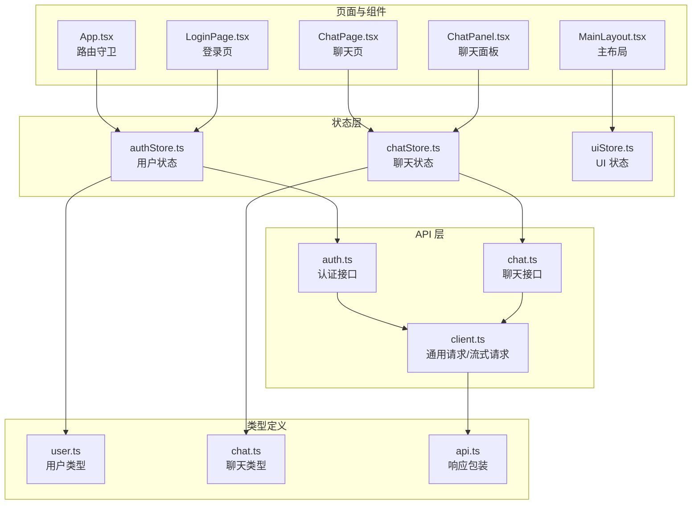
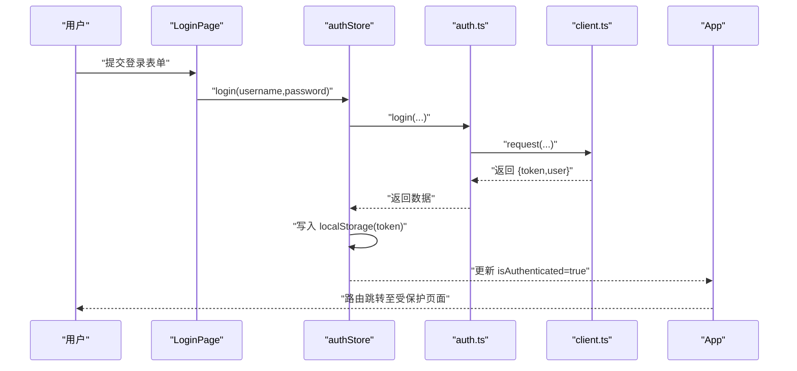
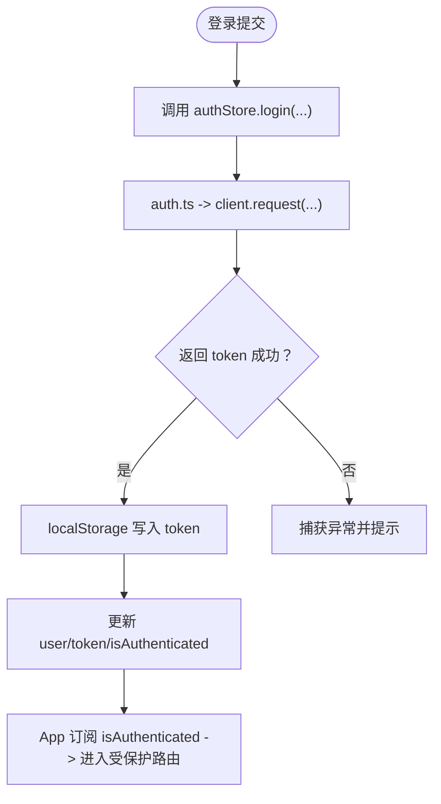
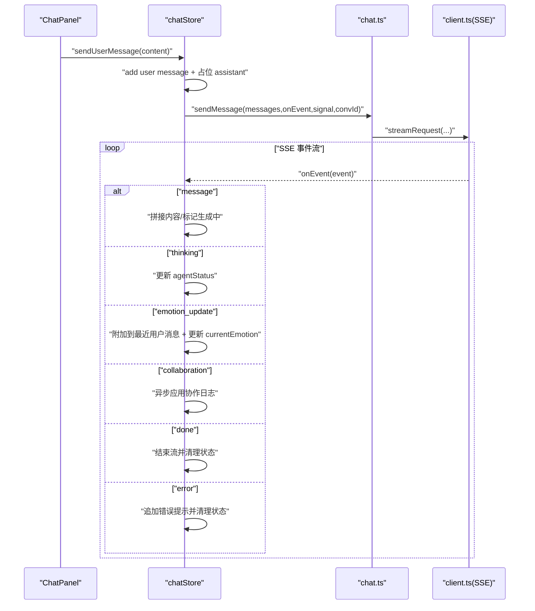
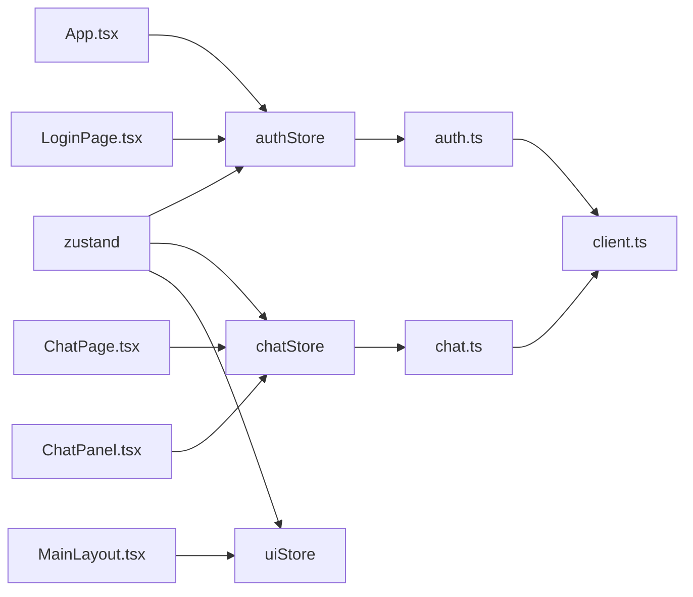

# 状态管理策略

<cite>
**本文引用的文件**
- [frontend/src/stores/authStore.ts](file://frontend/src/stores/authStore.ts)
- [frontend/src/stores/chatStore.ts](file://frontend/src/stores/chatStore.ts)
- [frontend/src/stores/uiStore.ts](file://frontend/src/stores/uiStore.ts)
- [frontend/src/api/auth.ts](file://frontend/src/api/auth.ts)
- [frontend/src/api/chat.ts](file://frontend/src/api/chat.ts)
- [frontend/src/api/client.ts](file://frontend/src/api/client.ts)
- [frontend/src/types/user.ts](file://frontend/src/types/user.ts)
- [frontend/src/types/chat.ts](file://frontend/src/types/chat.ts)
- [frontend/src/types/api.ts](file://frontend/src/types/api.ts)
- [frontend/src/pages/LoginPage.tsx](file://frontend/src/pages/LoginPage.tsx)
- [frontend/src/pages/ChatPage.tsx](file://frontend/src/pages/ChatPage.tsx)
- [frontend/src/App.tsx](file://frontend/src/App.tsx)
- [frontend/src/components/chat/ChatPanel.tsx](file://frontend/src/components/chat/ChatPanel.tsx)
- [frontend/src/components/layout/MainLayout.tsx](file://frontend/src/components/layout/MainLayout.tsx)
- [frontend/package.json](file://frontend/package.json)
</cite>

## 目录
1. [引言](#引言)
2. [项目结构](#项目结构)
3. [核心组件](#核心组件)
4. [架构总览](#架构总览)
5. [详细组件分析](#详细组件分析)
6. [依赖关系分析](#依赖关系分析)
7. [性能考量](#性能考量)
8. [故障排查指南](#故障排查指南)
9. [结论](#结论)
10. [附录](#附录)

## 引言
本文件面向状态管理开发者，系统性梳理 XuanJi 前端基于 Zustand 的状态管理实践，覆盖以下主题：
- Zustand 使用模式与 store 设计原则
- 订阅机制与跨组件状态共享
- 用户状态管理（authStore）：JWT 令牌处理、登录状态维护、权限控制
- 聊天状态管理（chatStore）：消息流控制、实时更新机制、会话状态同步
- UI 状态管理（uiStore）：界面切换、加载状态、错误处理
- 状态持久化策略、异步状态更新、调试技巧、性能优化与状态迁移策略

## 项目结构
前端采用“按功能域划分”的目录组织方式，状态层位于 stores 目录，API 层位于 api 目录，页面与组件分别位于 pages 与 components 目录，类型定义集中在 types 目录。

图表来源
- [frontend/src/stores/authStore.ts:1-53](file://frontend/src/stores/authStore.ts#L1-L53)
- [frontend/src/stores/chatStore.ts:1-291](file://frontend/src/stores/chatStore.ts#L1-L291)
- [frontend/src/stores/uiStore.ts:1-12](file://frontend/src/stores/uiStore.ts#L1-L12)
- [frontend/src/api/auth.ts:1-21](file://frontend/src/api/auth.ts#L1-L21)
- [frontend/src/api/chat.ts:1-49](file://frontend/src/api/chat.ts#L1-L49)
- [frontend/src/api/client.ts:1-119](file://frontend/src/api/client.ts#L1-L119)
- [frontend/src/types/user.ts:1-18](file://frontend/src/types/user.ts#L1-L18)
- [frontend/src/types/chat.ts:1-47](file://frontend/src/types/chat.ts#L1-L47)
- [frontend/src/types/api.ts:1-6](file://frontend/src/types/api.ts#L1-L6)
- [frontend/src/pages/LoginPage.tsx:1-369](file://frontend/src/pages/LoginPage.tsx#L1-L369)
- [frontend/src/pages/ChatPage.tsx:1-17](file://frontend/src/pages/ChatPage.tsx#L1-L17)
- [frontend/src/App.tsx:1-77](file://frontend/src/App.tsx#L1-L77)
- [frontend/src/components/chat/ChatPanel.tsx:1-67](file://frontend/src/components/chat/ChatPanel.tsx#L1-L67)
- [frontend/src/components/layout/MainLayout.tsx:1-19](file://frontend/src/components/layout/MainLayout.tsx#L1-L19)

章节来源
- [frontend/src/stores/authStore.ts:1-53](file://frontend/src/stores/authStore.ts#L1-L53)
- [frontend/src/stores/chatStore.ts:1-291](file://frontend/src/stores/chatStore.ts#L1-L291)
- [frontend/src/stores/uiStore.ts:1-12](file://frontend/src/stores/uiStore.ts#L1-L12)
- [frontend/src/api/auth.ts:1-21](file://frontend/src/api/auth.ts#L1-L21)
- [frontend/src/api/chat.ts:1-49](file://frontend/src/api/chat.ts#L1-L49)
- [frontend/src/api/client.ts:1-119](file://frontend/src/api/client.ts#L1-L119)
- [frontend/src/types/user.ts:1-18](file://frontend/src/types/user.ts#L1-L18)
- [frontend/src/types/chat.ts:1-47](file://frontend/src/types/chat.ts#L1-L47)
- [frontend/src/types/api.ts:1-6](file://frontend/src/types/api.ts#L1-L6)
- [frontend/src/pages/LoginPage.tsx:1-369](file://frontend/src/pages/LoginPage.tsx#L1-L369)
- [frontend/src/pages/ChatPage.tsx:1-17](file://frontend/src/pages/ChatPage.tsx#L1-L17)
- [frontend/src/App.tsx:1-77](file://frontend/src/App.tsx#L1-L77)
- [frontend/src/components/chat/ChatPanel.tsx:1-67](file://frontend/src/components/chat/ChatPanel.tsx#L1-L67)
- [frontend/src/components/layout/MainLayout.tsx:1-19](file://frontend/src/components/layout/MainLayout.tsx#L1-L19)

## 核心组件
- authStore：负责用户认证、令牌存储与读取、登录/注册/登出流程、用户信息加载与鉴权守卫。
- chatStore：负责消息列表、流式传输状态、协作日志、情绪快照、会话 ID 同步、占位消息与错误处理。
- uiStore：负责侧边栏开关等 UI 状态。

章节来源
- [frontend/src/stores/authStore.ts:5-13](file://frontend/src/stores/authStore.ts#L5-L13)
- [frontend/src/stores/chatStore.ts:6-23](file://frontend/src/stores/chatStore.ts#L6-L23)
- [frontend/src/stores/uiStore.ts:3-6](file://frontend/src/stores/uiStore.ts#L3-L6)

## 架构总览
Zustand 以函数式 store 定义为核心，通过 create 创建状态与派发器；API 层封装通用请求与流式请求，统一注入 Authorization 头；页面与组件通过 hooks 订阅状态，实现跨组件共享与响应式更新。

图表来源
- [frontend/src/pages/LoginPage.tsx:162-205](file://frontend/src/pages/LoginPage.tsx#L162-L205)
- [frontend/src/stores/authStore.ts:20-34](file://frontend/src/stores/authStore.ts#L20-L34)
- [frontend/src/api/auth.ts:4-16](file://frontend/src/api/auth.ts#L4-L16)
- [frontend/src/api/client.ts:20-44](file://frontend/src/api/client.ts#L20-L44)
- [frontend/src/App.tsx:13-19](file://frontend/src/App.tsx#L13-L19)

## 详细组件分析

### authStore：用户状态与鉴权
- 状态字段
  - user：当前用户对象或空
  - token：本地存储的 JWT 令牌
  - isAuthenticated：是否已认证
- 关键方法
  - login：调用后端登录接口，成功后写入 token 并设置认证态
  - register：注册后同样写入 token 并设置认证态
  - logout：移除 token 并清空用户与认证态
  - loadUser：从后端获取当前用户信息，失败时清理 token 并重置认证态
- 认证守卫
  - App 中通过选择器订阅 isAuthenticated，未认证则重定向到登录页
  - 登录页 LoginPage 调用 useAuthStore 的 login 方法，并在成功后触发页面过渡与提示

图表来源
- [frontend/src/stores/authStore.ts:20-34](file://frontend/src/stores/authStore.ts#L20-L34)
- [frontend/src/api/auth.ts:4-16](file://frontend/src/api/auth.ts#L4-L16)
- [frontend/src/api/client.ts:20-44](file://frontend/src/api/client.ts#L20-L44)
- [frontend/src/App.tsx:13-19](file://frontend/src/App.tsx#L13-L19)

章节来源
- [frontend/src/stores/authStore.ts:5-13](file://frontend/src/stores/authStore.ts#L5-L13)
- [frontend/src/stores/authStore.ts:20-51](file://frontend/src/stores/authStore.ts#L20-L51)
- [frontend/src/api/auth.ts:4-20](file://frontend/src/api/auth.ts#L4-L20)
- [frontend/src/api/client.ts:16-31](file://frontend/src/api/client.ts#L16-L31)
- [frontend/src/pages/LoginPage.tsx:162-205](file://frontend/src/pages/LoginPage.tsx#L162-L205)
- [frontend/src/App.tsx:13-19](file://frontend/src/App.tsx#L13-L19)

### chatStore：消息流与实时更新
- 状态字段
  - messages：消息数组
  - isStreaming / isGenerating：流式传输与生成阶段状态
  - agentStatus：思考阶段文本
  - currentEmotion：当前情绪快照
  - abortController：流中断控制器
  - showCollaboration：协作日志可见性
  - currentConversationId / currentStreamId：会话与流标识
- 关键流程
  - loadConversation：拉取最近消息，解析 metadata_json，提取协作与工具执行信息，更新 currentConversationId
  - sendUserMessage：构建用户消息与占位助手消息，启动流式传输，按事件类型更新状态
  - cancelStream：中断流并恢复状态
  - loadShowCollaboration：从设置读取协作可见性
- 事件处理要点
  - conversation_id 校验：防止切换会话时旧事件污染
  - message：增量拼接内容，首个文本块后进入生成阶段
  - thinking：更新 agentStatus
  - emotion_update：附加到最近用户消息并更新 currentEmotion
  - collaboration：异步应用到当前助手消息
  - done/error：收尾与错误提示
- 安全兜底
  - finally 统一恢复 isStreaming/isGenerating 等状态，避免事件丢失导致 UI 卡死

图表来源
- [frontend/src/components/chat/ChatPanel.tsx:8-16](file://frontend/src/components/chat/ChatPanel.tsx#L8-L16)
- [frontend/src/stores/chatStore.ts:116-289](file://frontend/src/stores/chatStore.ts#L116-L289)
- [frontend/src/api/chat.ts:35-48](file://frontend/src/api/chat.ts#L35-L48)
- [frontend/src/api/client.ts:46-118](file://frontend/src/api/client.ts#L46-L118)

章节来源
- [frontend/src/stores/chatStore.ts:6-23](file://frontend/src/stores/chatStore.ts#L6-L23)
- [frontend/src/stores/chatStore.ts:54-106](file://frontend/src/stores/chatStore.ts#L54-L106)
- [frontend/src/stores/chatStore.ts:116-289](file://frontend/src/stores/chatStore.ts#L116-L289)
- [frontend/src/api/chat.ts:20-48](file://frontend/src/api/chat.ts#L20-L48)
- [frontend/src/api/client.ts:46-118](file://frontend/src/api/client.ts#L46-L118)
- [frontend/src/components/chat/ChatPanel.tsx:8-16](file://frontend/src/components/chat/ChatPanel.tsx#L8-L16)

### uiStore：界面状态
- 状态字段
  - sidebarOpen：侧边栏开关
- 方法
  - toggleSidebar：切换侧边栏状态

章节来源
- [frontend/src/stores/uiStore.ts:3-6](file://frontend/src/stores/uiStore.ts#L3-L6)
- [frontend/src/stores/uiStore.ts:8-11](file://frontend/src/stores/uiStore.ts#L8-L11)

## 依赖关系分析
- 类型依赖
  - user.ts 与 chat.ts 作为 authStore 与 chatStore 的数据契约
  - api.ts 统一封装后端响应结构
- 组件依赖
  - App.tsx 依赖 authStore 进行路由守卫
  - LoginPage.tsx 依赖 authStore.login 与 API 层
  - ChatPage.tsx 依赖 chatStore 初始化会话与协作可见性
  - ChatPanel.tsx 依赖 chatStore 订阅消息与状态
  - MainLayout.tsx 依赖 uiStore 控制侧边栏
- 外部依赖
  - zustand：状态容器
  - react-router-dom：路由与受保护路由
  - 浏览器原生 fetch 与 AbortController：请求与中断
  - 浏览器原生 EventSource（由 client.ts 封装的流式请求模拟）：SSE 事件解析

图表来源
- [frontend/src/stores/authStore.ts:1-1](file://frontend/src/stores/authStore.ts#L1-L1)
- [frontend/src/stores/chatStore.ts:1-1](file://frontend/src/stores/chatStore.ts#L1-L1)
- [frontend/src/stores/uiStore.ts:1-1](file://frontend/src/stores/uiStore.ts#L1-L1)
- [frontend/src/api/auth.ts:1-2](file://frontend/src/api/auth.ts#L1-L2)
- [frontend/src/api/chat.ts:1-2](file://frontend/src/api/chat.ts#L1-L2)
- [frontend/src/api/client.ts:1-3](file://frontend/src/api/client.ts#L1-L3)
- [frontend/src/App.tsx:3-4](file://frontend/src/App.tsx#L3-L4)
- [frontend/src/pages/LoginPage.tsx:2-2](file://frontend/src/pages/LoginPage.tsx#L2-L2)
- [frontend/src/pages/ChatPage.tsx:3-3](file://frontend/src/pages/ChatPage.tsx#L3-L3)
- [frontend/src/components/chat/ChatPanel.tsx:2-2](file://frontend/src/components/chat/ChatPanel.tsx#L2-L2)
- [frontend/src/components/layout/MainLayout.tsx:1-2](file://frontend/src/components/layout/MainLayout.tsx#L1-L2)

章节来源
- [frontend/src/App.tsx:1-77](file://frontend/src/App.tsx#L1-L77)
- [frontend/src/pages/LoginPage.tsx:1-369](file://frontend/src/pages/LoginPage.tsx#L1-L369)
- [frontend/src/pages/ChatPage.tsx:1-17](file://frontend/src/pages/ChatPage.tsx#L1-L17)
- [frontend/src/components/chat/ChatPanel.tsx:1-67](file://frontend/src/components/chat/ChatPanel.tsx#L1-L67)
- [frontend/src/components/layout/MainLayout.tsx:1-19](file://frontend/src/components/layout/MainLayout.tsx#L1-L19)
- [frontend/src/api/client.ts:1-119](file://frontend/src/api/client.ts#L1-L119)
- [frontend/package.json:20-20](file://frontend/package.json#L20-L20)

## 性能考量
- 流式渲染与滚动
  - ChatPanel 在消息与 agentStatus 更新时滚动到底部，避免频繁重排
- 空闲回调与异步协作
  - collaboration 事件通过 requestIdleCallback 或 setTimeout 异步应用，降低主线程阻塞
- 状态最小化与不可变更新
  - 使用 set((s) => ({ ... })) 与浅拷贝策略，减少不必要的重渲染
- 中断与兜底
  - cancelStream 与 finally 块确保状态一致性，防止 UI 卡死
- 事件过滤
  - chatStore 对 conversation_id 进行严格校验，避免跨会话事件污染

章节来源
- [frontend/src/components/chat/ChatPanel.tsx:12-16](file://frontend/src/components/chat/ChatPanel.tsx#L12-L16)
- [frontend/src/stores/chatStore.ts:240-245](file://frontend/src/stores/chatStore.ts#L240-L245)
- [frontend/src/stores/chatStore.ts:150-162](file://frontend/src/stores/chatStore.ts#L150-L162)
- [frontend/src/stores/chatStore.ts:278-288](file://frontend/src/stores/chatStore.ts#L278-L288)

## 故障排查指南
- 登录失败
  - 检查 auth.ts 返回的响应结构与 client.ts 的错误抛出逻辑
  - 确认 localStorage 中 token 是否写入
- 会话切换后事件串话
  - 确认 chatStore 对 conversation_id 的校验逻辑是否生效
- 流式传输卡住
  - 检查 finally 块是否执行，确认 isStreaming/isGenerating 是否被重置
- SSE 解析错误
  - 查看 client.ts 的解析日志与 parseErrors 计数，超过阈值会抛错
- 权限拦截无效
  - 确认 App.tsx 中对 isAuthenticated 的订阅与路由守卫逻辑

章节来源
- [frontend/src/stores/authStore.ts:20-34](file://frontend/src/stores/authStore.ts#L20-L34)
- [frontend/src/api/auth.ts:4-20](file://frontend/src/api/auth.ts#L4-L20)
- [frontend/src/api/client.ts:38-44](file://frontend/src/api/client.ts#L38-L44)
- [frontend/src/stores/chatStore.ts:150-162](file://frontend/src/stores/chatStore.ts#L150-L162)
- [frontend/src/stores/chatStore.ts:278-288](file://frontend/src/stores/chatStore.ts#L278-L288)
- [frontend/src/api/client.ts:85-91](file://frontend/src/api/client.ts#L85-L91)
- [frontend/src/App.tsx:13-19](file://frontend/src/App.tsx#L13-L19)

## 结论
本项目以 Zustand 为核心，结合统一的 API 客户端与严格的事件处理策略，实现了用户认证、聊天流式交互与 UI 状态的清晰分离。通过 conversation_id 校验、空闲回调与 finally 兜底等机制，保证了实时更新的可靠性与用户体验。建议在后续迭代中引入状态持久化（如 localStorage/IndexedDB）与时间旅行调试工具，进一步提升可观测性与可维护性。

## 附录
- 状态持久化策略建议
  - authStore：token 与用户信息可持久化于 localStorage，应用初始化时读取并尝试刷新
  - chatStore：可持久化 messages 的关键片段与 currentConversationId，避免重复加载
  - uiStore：sidebarOpen 可持久化，提升用户习惯一致性
- 跨组件状态共享
  - 通过 useStore(selector) 选择器订阅，避免无关重渲染
  - 将高频更新拆分为独立 store（如 uiStore），降低耦合
- 异步状态更新最佳实践
  - 使用 AbortController 管理长连接与流式传输
  - 在 finally 中统一恢复状态，确保 UI 一致性
- 调试技巧
  - 在 chatStore 与 client.ts 中打印事件日志，定位解析与事件顺序问题
  - 使用浏览器开发工具的 Redux DevTools（需配合中间件）观察状态变化
- 性能优化
  - 对消息列表进行虚拟滚动（如需）
  - 合理拆分 store，避免单一 store 过大
- 状态迁移策略
  - 为 store 增加版本号与迁移函数，升级时自动迁移历史数据