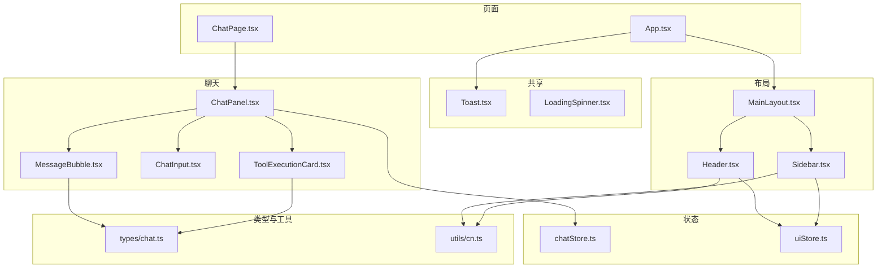
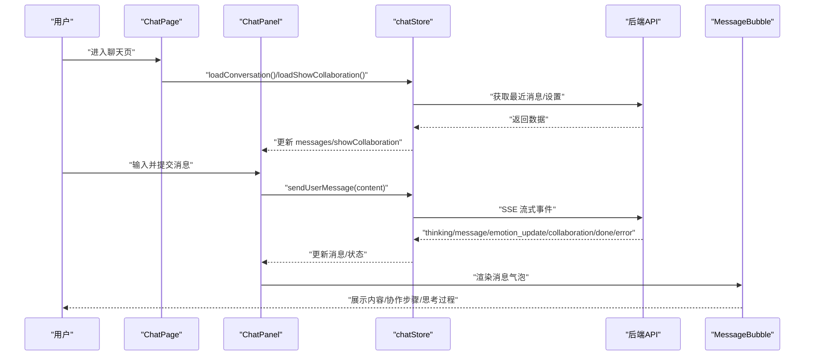
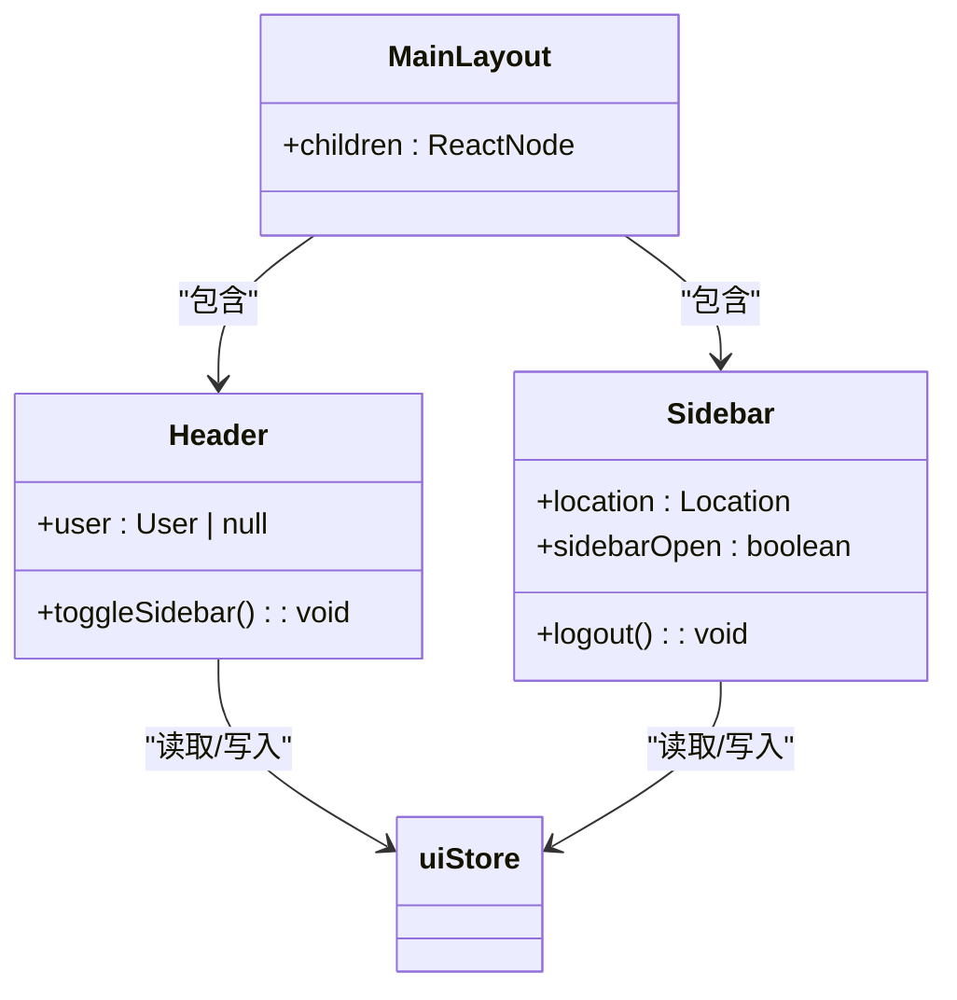
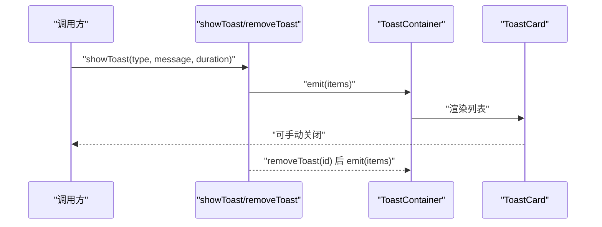
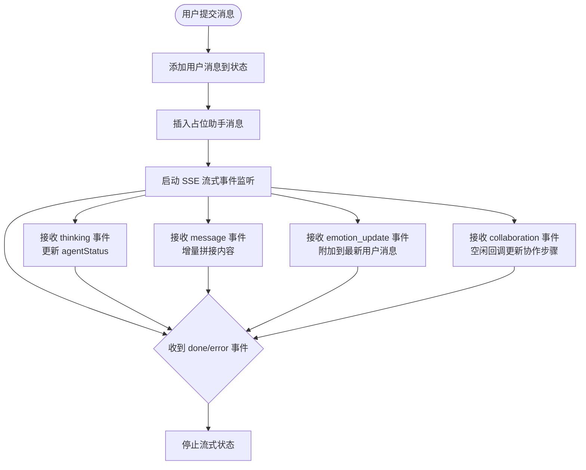
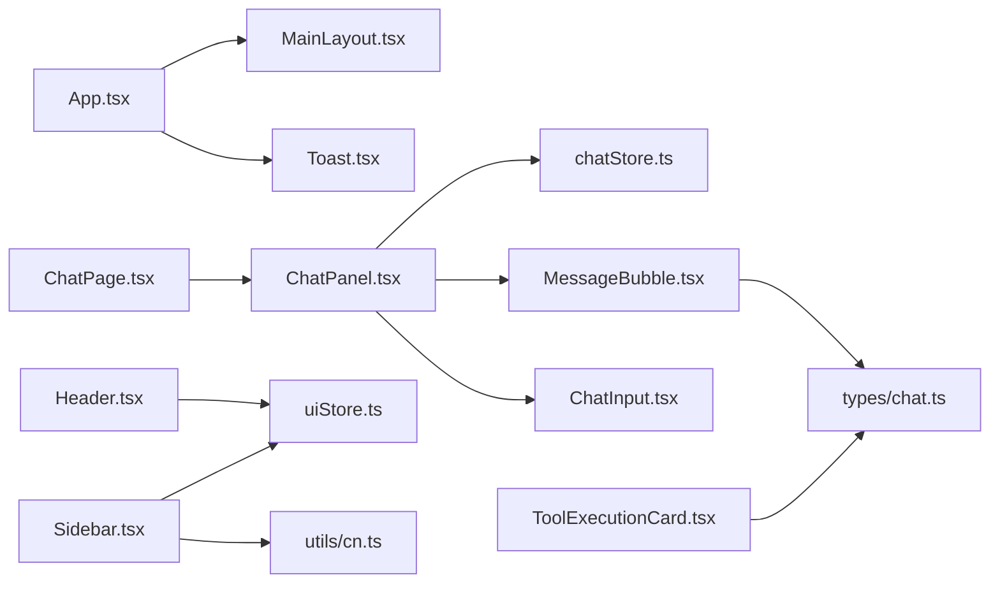

# 组件系统设计

<cite>
**本文引用的文件**
- [frontend/src/components/layout/Header.tsx](file://frontend/src/components/layout/Header.tsx)
- [frontend/src/components/layout/Sidebar.tsx](file://frontend/src/components/layout/Sidebar.tsx)
- [frontend/src/components/layout/MainLayout.tsx](file://frontend/src/components/layout/MainLayout.tsx)
- [frontend/src/components/shared/LoadingSpinner.tsx](file://frontend/src/components/shared/LoadingSpinner.tsx)
- [frontend/src/components/shared/Toast.tsx](file://frontend/src/components/shared/Toast.tsx)
- [frontend/src/components/chat/ChatPanel.tsx](file://frontend/src/components/chat/ChatPanel.tsx)
- [frontend/src/components/chat/MessageBubble.tsx](file://frontend/src/components/chat/MessageBubble.tsx)
- [frontend/src/components/chat/ChatInput.tsx](file://frontend/src/components/chat/ChatInput.tsx)
- [frontend/src/components/chat/ToolExecutionCard.tsx](file://frontend/src/components/chat/ToolExecutionCard.tsx)
- [frontend/src/stores/chatStore.ts](file://frontend/src/stores/chatStore.ts)
- [frontend/src/types/chat.ts](file://frontend/src/types/chat.ts)
- [frontend/src/utils/cn.ts](file://frontend/src/utils/cn.ts)
- [frontend/src/stores/uiStore.ts](file://frontend/src/stores/uiStore.ts)
- [frontend/src/pages/ChatPage.tsx](file://frontend/src/pages/ChatPage.tsx)
- [frontend/src/App.tsx](file://frontend/src/App.tsx)
- [frontend/src/index.css](file://frontend/src/index.css)
</cite>

## 目录
1. [引言](#引言)
2. [项目结构](#项目结构)
3. [核心组件](#核心组件)
4. [架构总览](#架构总览)
5. [详细组件分析](#详细组件分析)
6. [依赖关系分析](#依赖关系分析)
7. [性能考虑](#性能考虑)
8. [故障排查指南](#故障排查指南)
9. [结论](#结论)
10. [附录](#附录)

## 引言
本设计文档面向组件开发者，系统梳理 XuanJi 前端组件体系，覆盖布局组件、共享组件与聊天组件系统，重点阐述组件层次结构、命名规范、Props 接口设计、状态管理模式、复用策略与组合模式应用，并给出性能优化、可访问性与响应式布局建议，以及测试与可维护性最佳实践。

## 项目结构
前端采用按功能域分层的组织方式：
- components：按领域拆分，如 layout、shared、chat、tools
- pages：页面级路由组件，负责数据加载与页面级副作用
- stores：状态管理（Zustand）
- types：跨模块共享的类型定义
- utils：通用工具函数
- assets/index.css：主题色板与全局样式

图表来源
- [frontend/src/App.tsx:1-77](file://frontend/src/App.tsx#L1-L77)
- [frontend/src/pages/ChatPage.tsx:1-17](file://frontend/src/pages/ChatPage.tsx#L1-L17)
- [frontend/src/components/layout/MainLayout.tsx:1-19](file://frontend/src/components/layout/MainLayout.tsx#L1-L19)
- [frontend/src/components/layout/Header.tsx:1-31](file://frontend/src/components/layout/Header.tsx#L1-L31)
- [frontend/src/components/layout/Sidebar.tsx:1-66](file://frontend/src/components/layout/Sidebar.tsx#L1-L66)
- [frontend/src/components/shared/Toast.tsx:1-110](file://frontend/src/components/shared/Toast.tsx#L1-L110)
- [frontend/src/components/shared/LoadingSpinner.tsx:1-22](file://frontend/src/components/shared/LoadingSpinner.tsx#L1-L22)
- [frontend/src/components/chat/ChatPanel.tsx:1-67](file://frontend/src/components/chat/ChatPanel.tsx#L1-L67)
- [frontend/src/components/chat/MessageBubble.tsx:1-282](file://frontend/src/components/chat/MessageBubble.tsx#L1-L282)
- [frontend/src/components/chat/ChatInput.tsx:1-65](file://frontend/src/components/chat/ChatInput.tsx#L1-L65)
- [frontend/src/components/chat/ToolExecutionCard.tsx:1-32](file://frontend/src/components/chat/ToolExecutionCard.tsx#L1-L32)
- [frontend/src/stores/chatStore.ts:1-291](file://frontend/src/stores/chatStore.ts#L1-L291)
- [frontend/src/stores/uiStore.ts:1-12](file://frontend/src/stores/uiStore.ts#L1-L12)
- [frontend/src/types/chat.ts:1-47](file://frontend/src/types/chat.ts#L1-L47)
- [frontend/src/utils/cn.ts:1-7](file://frontend/src/utils/cn.ts#L1-L7)

章节来源
- [frontend/src/App.tsx:1-77](file://frontend/src/App.tsx#L1-L77)
- [frontend/src/index.css:1-35](file://frontend/src/index.css#L1-L35)

## 核心组件
- 布局组件：MainLayout、Header、Sidebar，负责整体骨架与导航
- 共享组件：Toast、LoadingSpinner，提供跨页面的通用能力
- 聊天组件：ChatPanel、MessageBubble、ChatInput、ToolExecutionCard，承载对话与工具执行展示
- 状态与类型：chatStore、uiStore、types/chat.ts

章节来源
- [frontend/src/components/layout/MainLayout.tsx:1-19](file://frontend/src/components/layout/MainLayout.tsx#L1-L19)
- [frontend/src/components/layout/Header.tsx:1-31](file://frontend/src/components/layout/Header.tsx#L1-L31)
- [frontend/src/components/layout/Sidebar.tsx:1-66](file://frontend/src/components/layout/Sidebar.tsx#L1-L66)
- [frontend/src/components/shared/Toast.tsx:1-110](file://frontend/src/components/shared/Toast.tsx#L1-L110)
- [frontend/src/components/shared/LoadingSpinner.tsx:1-22](file://frontend/src/components/shared/LoadingSpinner.tsx#L1-L22)
- [frontend/src/components/chat/ChatPanel.tsx:1-67](file://frontend/src/components/chat/ChatPanel.tsx#L1-L67)
- [frontend/src/components/chat/MessageBubble.tsx:1-282](file://frontend/src/components/chat/MessageBubble.tsx#L1-L282)
- [frontend/src/components/chat/ChatInput.tsx:1-65](file://frontend/src/components/chat/ChatInput.tsx#L1-L65)
- [frontend/src/components/chat/ToolExecutionCard.tsx:1-32](file://frontend/src/components/chat/ToolExecutionCard.tsx#L1-L32)
- [frontend/src/stores/chatStore.ts:1-291](file://frontend/src/stores/chatStore.ts#L1-L291)
- [frontend/src/stores/uiStore.ts:1-12](file://frontend/src/stores/uiStore.ts#L1-L12)
- [frontend/src/types/chat.ts:1-47](file://frontend/src/types/chat.ts#L1-L47)

## 架构总览
组件系统以“页面 -> 布局 -> 子组件”的层级组织，配合 Zustand 状态管理与类型驱动的数据结构，形成清晰的单向数据流与可组合的 UI 结构。

图表来源
- [frontend/src/pages/ChatPage.tsx:1-17](file://frontend/src/pages/ChatPage.tsx#L1-L17)
- [frontend/src/components/chat/ChatPanel.tsx:1-67](file://frontend/src/components/chat/ChatPanel.tsx#L1-L67)
- [frontend/src/stores/chatStore.ts:116-291](file://frontend/src/stores/chatStore.ts#L116-L291)
- [frontend/src/components/chat/MessageBubble.tsx:208-282](file://frontend/src/components/chat/MessageBubble.tsx#L208-L282)

## 详细组件分析

### 布局组件设计模式
- MainLayout：容器组件，聚合 Sidebar 与 Header，并通过 children 承载页面内容；统一处理屏幕高度与溢出控制。
- Header：轻量无状态组件，读取 UI 状态与用户信息，触发侧边栏开关。
- Sidebar：导航组件，基于路由位置高亮当前项，支持展开/收起与图标文本切换，使用工具函数合并类名。

图表来源
- [frontend/src/components/layout/MainLayout.tsx:1-19](file://frontend/src/components/layout/MainLayout.tsx#L1-L19)
- [frontend/src/components/layout/Header.tsx:1-31](file://frontend/src/components/layout/Header.tsx#L1-L31)
- [frontend/src/components/layout/Sidebar.tsx:1-66](file://frontend/src/components/layout/Sidebar.tsx#L1-L66)
- [frontend/src/stores/uiStore.ts:1-12](file://frontend/src/stores/uiStore.ts#L1-L12)

章节来源
- [frontend/src/components/layout/MainLayout.tsx:1-19](file://frontend/src/components/layout/MainLayout.tsx#L1-L19)
- [frontend/src/components/layout/Header.tsx:1-31](file://frontend/src/components/layout/Header.tsx#L1-L31)
- [frontend/src/components/layout/Sidebar.tsx:1-66](file://frontend/src/components/layout/Sidebar.tsx#L1-L66)
- [frontend/src/stores/uiStore.ts:1-12](file://frontend/src/stores/uiStore.ts#L1-L12)
- [frontend/src/utils/cn.ts:1-7](file://frontend/src/utils/cn.ts#L1-L7)

### 共享组件通用性设计
- Toast：全局通知系统，采用发布-订阅模式管理多条消息，支持类型化图标与颜色、入场动画、自动消失与手动关闭。
- LoadingSpinner：轻量加载指示器，使用相对定位与动画序列实现脉动效果，便于在任意容器中复用。

图表来源
- [frontend/src/components/shared/Toast.tsx:33-110](file://frontend/src/components/shared/Toast.tsx#L33-L110)

章节来源
- [frontend/src/components/shared/Toast.tsx:1-110](file://frontend/src/components/shared/Toast.tsx#L1-L110)
- [frontend/src/components/shared/LoadingSpinner.tsx:1-22](file://frontend/src/components/shared/LoadingSpinner.tsx#L1-L22)

### 聊天组件系统复杂交互设计
- ChatPanel：负责消息列表渲染、滚动行为、占位消息与流式状态展示；协调输入组件与流式指示器。
- MessageBubble：解析 AI 思维标签、角色配色、协作步骤横向时间线、展开/折叠逻辑；根据角色决定样式与布局。
- ChatInput：支持多行输入、回车发送、Shift+回车换行、禁用态与取消流式。
- ToolExecutionCard：展示工具执行结果，区分成功/失败状态与结果预览。

图表来源
- [frontend/src/stores/chatStore.ts:116-291](file://frontend/src/stores/chatStore.ts#L116-L291)
- [frontend/src/components/chat/ChatPanel.tsx:1-67](file://frontend/src/components/chat/ChatPanel.tsx#L1-L67)
- [frontend/src/components/chat/MessageBubble.tsx:1-282](file://frontend/src/components/chat/MessageBubble.tsx#L1-L282)
- [frontend/src/components/chat/ChatInput.tsx:1-65](file://frontend/src/components/chat/ChatInput.tsx#L1-L65)
- [frontend/src/components/chat/ToolExecutionCard.tsx:1-32](file://frontend/src/components/chat/ToolExecutionCard.tsx#L1-L32)

章节来源
- [frontend/src/components/chat/ChatPanel.tsx:1-67](file://frontend/src/components/chat/ChatPanel.tsx#L1-L67)
- [frontend/src/components/chat/MessageBubble.tsx:1-282](file://frontend/src/components/chat/MessageBubble.tsx#L1-L282)
- [frontend/src/components/chat/ChatInput.tsx:1-65](file://frontend/src/components/chat/ChatInput.tsx#L1-L65)
- [frontend/src/components/chat/ToolExecutionCard.tsx:1-32](file://frontend/src/components/chat/ToolExecutionCard.tsx#L1-L32)
- [frontend/src/stores/chatStore.ts:1-291](file://frontend/src/stores/chatStore.ts#L1-L291)
- [frontend/src/types/chat.ts:1-47](file://frontend/src/types/chat.ts#L1-L47)

### 工具执行卡片组件的状态管理
- ToolExecutionCard 作为纯展示组件，接收来自 ChatMessage 的 toolExecution 字段，依据 success 状态切换图标与标签颜色。
- chatStore 在加载历史消息时解析 metadata_json，提取工具名称与执行结果，注入到对应消息中，供 MessageBubble 渲染。

章节来源
- [frontend/src/components/chat/ToolExecutionCard.tsx:1-32](file://frontend/src/components/chat/ToolExecutionCard.tsx#L1-L32)
- [frontend/src/stores/chatStore.ts:77-95](file://frontend/src/stores/chatStore.ts#L77-L95)
- [frontend/src/types/chat.ts:21-25](file://frontend/src/types/chat.ts#L21-L25)

### Props 接口设计与命名规范
- 统一使用“组件名 + Props”命名，如 MessageBubbleProps、ChatInputProps、ToolExecutionCardProps
- 明确可选/必选字段，避免在组件内部做过多默认值处理
- 类型来自 types/chat.ts，确保跨模块一致性

章节来源
- [frontend/src/components/chat/MessageBubble.tsx:8-10](file://frontend/src/components/chat/MessageBubble.tsx#L8-L10)
- [frontend/src/components/chat/ChatInput.tsx:4-9](file://frontend/src/components/chat/ChatInput.tsx#L4-L9)
- [frontend/src/components/chat/ToolExecutionCard.tsx:4-6](file://frontend/src/components/chat/ToolExecutionCard.tsx#L4-L6)
- [frontend/src/types/chat.ts:1-47](file://frontend/src/types/chat.ts#L1-L47)

### 组件复用策略与组合模式
- 复用策略：将 UI 与业务逻辑解耦，如 ChatPanel 仅负责布局与滚动，具体渲染由 MessageBubble 负责；输入与流式由 chatStore 驱动。
- 组合模式：MainLayout 组合 Header 与 Sidebar；MessageBubble 组合 ThinkBlock、CollaborationPanel、StepBubble 等子组件，形成可插拔的复合 UI。

章节来源
- [frontend/src/components/layout/MainLayout.tsx:1-19](file://frontend/src/components/layout/MainLayout.tsx#L1-L19)
- [frontend/src/components/chat/MessageBubble.tsx:43-206](file://frontend/src/components/chat/MessageBubble.tsx#L43-L206)

## 依赖关系分析
- 组件间依赖：ChatPanel 依赖 chatStore；Header/Sidebar 依赖 uiStore；MessageBubble 依赖类型定义；Sidebar 使用 cn 工具。
- 页面与路由：App 负责路由保护与主布局包裹；ChatPage 触发初始数据加载。

图表来源
- [frontend/src/App.tsx:1-77](file://frontend/src/App.tsx#L1-L77)
- [frontend/src/pages/ChatPage.tsx:1-17](file://frontend/src/pages/ChatPage.tsx#L1-L17)
- [frontend/src/components/layout/MainLayout.tsx:1-19](file://frontend/src/components/layout/MainLayout.tsx#L1-L19)
- [frontend/src/components/layout/Header.tsx:1-31](file://frontend/src/components/layout/Header.tsx#L1-L31)
- [frontend/src/components/layout/Sidebar.tsx:1-66](file://frontend/src/components/layout/Sidebar.tsx#L1-L66)
- [frontend/src/components/chat/ChatPanel.tsx:1-67](file://frontend/src/components/chat/ChatPanel.tsx#L1-L67)
- [frontend/src/components/chat/MessageBubble.tsx:1-282](file://frontend/src/components/chat/MessageBubble.tsx#L1-L282)
- [frontend/src/components/chat/ChatInput.tsx:1-65](file://frontend/src/components/chat/ChatInput.tsx#L1-L65)
- [frontend/src/components/chat/ToolExecutionCard.tsx:1-32](file://frontend/src/components/chat/ToolExecutionCard.tsx#L1-L32)
- [frontend/src/stores/chatStore.ts:1-291](file://frontend/src/stores/chatStore.ts#L1-L291)
- [frontend/src/stores/uiStore.ts:1-12](file://frontend/src/stores/uiStore.ts#L1-L12)
- [frontend/src/types/chat.ts:1-47](file://frontend/src/types/chat.ts#L1-L47)
- [frontend/src/utils/cn.ts:1-7](file://frontend/src/utils/cn.ts#L1-L7)

章节来源
- [frontend/src/App.tsx:1-77](file://frontend/src/App.tsx#L1-L77)
- [frontend/src/pages/ChatPage.tsx:1-17](file://frontend/src/pages/ChatPage.tsx#L1-L17)

## 性能考虑
- 列表渲染优化：MessageBubble 对内容解析使用 useMemo 缓存，减少重复计算。
- 流式渲染：chatStore 使用增量更新与 requestIdleCallback 应用协作步骤，避免阻塞主线程。
- 滚动与占位：ChatPanel 在消息变化时滚动到底部，避免不必要的重排。
- 动画与类名：Toast 使用 requestAnimationFrame 控制入场动画；Sidebar 展开/收起使用过渡动画；cn 工具合并 Tailwind 类名，减少冲突。
- 资源加载：App 使用 Suspense 与懒加载页面，提升首屏性能。

章节来源
- [frontend/src/components/chat/MessageBubble.tsx:213-216](file://frontend/src/components/chat/MessageBubble.tsx#L213-L216)
- [frontend/src/stores/chatStore.ts:240-245](file://frontend/src/stores/chatStore.ts#L240-L245)
- [frontend/src/components/chat/ChatPanel.tsx:12-16](file://frontend/src/components/chat/ChatPanel.tsx#L12-L16)
- [frontend/src/components/shared/Toast.tsx:65-69](file://frontend/src/components/shared/Toast.tsx#L65-L69)
- [frontend/src/components/layout/Sidebar.tsx:21-24](file://frontend/src/components/layout/Sidebar.tsx#L21-L24)
- [frontend/src/utils/cn.ts:1-7](file://frontend/src/utils/cn.ts#L1-L7)
- [frontend/src/App.tsx:36-74](file://frontend/src/App.tsx#L36-L74)

## 故障排查指南
- 流式中断或卡死：chatStore 在 finally 中强制恢复状态，防止 done 事件丢失；若出现 UI 卡死，检查 isStreaming 状态是否被正确置位。
- 事件串话：chatStore 在处理 SSE 事件时校验 conversation_id，不同对话不会互相污染。
- 取消流式：ChatInput 提供取消按钮，调用 cancelStream 后会终止 AbortController 并清理状态。
- 错误提示：当发生网络异常或服务端错误时，chatStore 会在最后一条助手消息追加错误提示。
- Toast 未消失：确认 duration 参数与 removeToast 调用链路；检查 emit 是否正常广播。

章节来源
- [frontend/src/stores/chatStore.ts:150-162](file://frontend/src/stores/chatStore.ts#L150-L162)
- [frontend/src/stores/chatStore.ts:246-259](file://frontend/src/stores/chatStore.ts#L246-L259)
- [frontend/src/stores/chatStore.ts:279-288](file://frontend/src/stores/chatStore.ts#L279-L288)
- [frontend/src/components/chat/ChatInput.tsx:43-51](file://frontend/src/components/chat/ChatInput.tsx#L43-L51)
- [frontend/src/components/shared/Toast.tsx:44-52](file://frontend/src/components/shared/Toast.tsx#L44-L52)

## 结论
XuanJi 组件系统通过清晰的层次划分、类型驱动的 Props 设计与 Zustand 状态管理，实现了布局、共享与聊天三大领域的高内聚低耦合。组合模式与复用策略提升了可扩展性，结合流式渲染与动画优化，兼顾了交互流畅性与性能表现。建议在后续迭代中持续完善可访问性与测试覆盖率，以进一步提升系统的稳定性与可维护性。

## 附录
- 主题色板与基础样式：index.css 定义了“梅花色系”主题变量，统一全局配色与字体。
- 页面入口：main.tsx 使用 BrowserRouter 包裹 App，确保路由可用。

章节来源
- [frontend/src/index.css:1-35](file://frontend/src/index.css#L1-L35)
- [frontend/src/main.tsx:1-14](file://frontend/src/main.tsx#L1-L14)