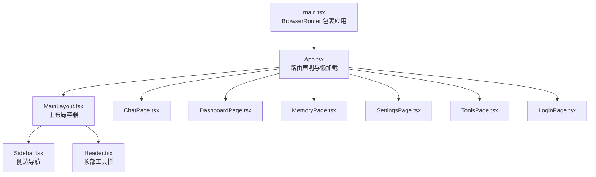
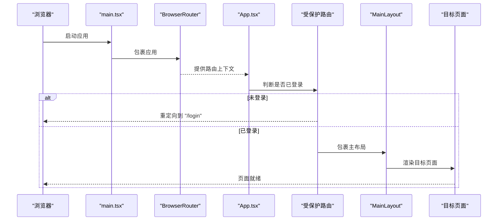
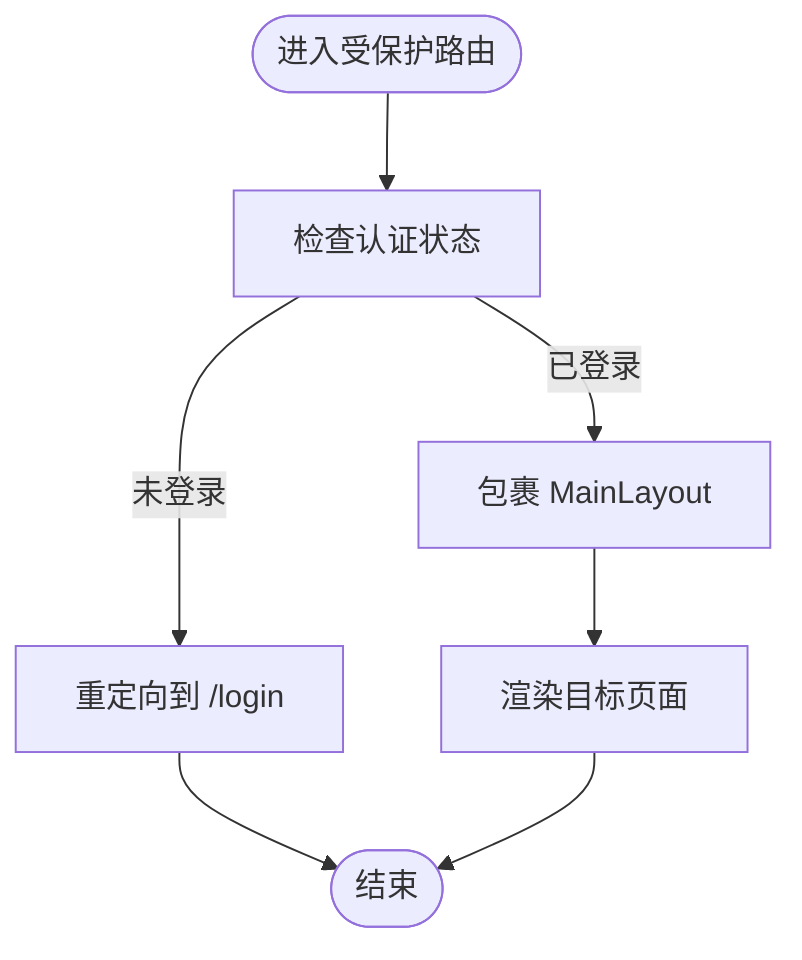
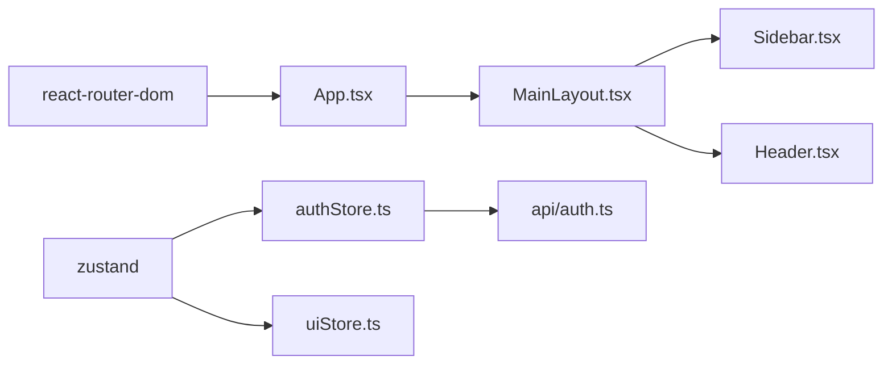

# 路由与导航

<cite>
**本文引用的文件**
- [frontend/src/App.tsx](file://frontend/src/App.tsx)
- [frontend/src/main.tsx](file://frontend/src/main.tsx)
- [frontend/src/pages/ChatPage.tsx](file://frontend/src/pages/ChatPage.tsx)
- [frontend/src/pages/DashboardPage.tsx](file://frontend/src/pages/DashboardPage.tsx)
- [frontend/src/pages/LoginPage.tsx](file://frontend/src/pages/LoginPage.tsx)
- [frontend/src/pages/MemoryPage.tsx](file://frontend/src/pages/MemoryPage.tsx)
- [frontend/src/pages/SettingsPage.tsx](file://frontend/src/pages/SettingsPage.tsx)
- [frontend/src/pages/ToolsPage.tsx](file://frontend/src/pages/ToolsPage.tsx)
- [frontend/src/components/layout/Sidebar.tsx](file://frontend/src/components/layout/Sidebar.tsx)
- [frontend/src/components/layout/Header.tsx](file://frontend/src/components/layout/Header.tsx)
- [frontend/src/components/layout/MainLayout.tsx](file://frontend/src/components/layout/MainLayout.tsx)
- [frontend/src/stores/authStore.ts](file://frontend/src/stores/authStore.ts)
- [frontend/src/stores/uiStore.ts](file://frontend/src/stores/uiStore.ts)
- [frontend/src/api/auth.ts](file://frontend/src/api/auth.ts)
- [frontend/package.json](file://frontend/package.json)
</cite>

## 目录
1. [简介](#简介)
2. [项目结构](#项目结构)
3. [核心组件](#核心组件)
4. [架构总览](#架构总览)
5. [详细组件分析](#详细组件分析)
6. [依赖分析](#依赖分析)
7. [性能考虑](#性能考虑)
8. [故障排查指南](#故障排查指南)
9. [结论](#结论)
10. [附录](#附录)

## 简介
本文件为 XuanJi 路由系统的技术文档，聚焦于 React Router 7 的路由配置、嵌套路由设计、动态路由参数处理，以及页面组件与导航组件（Sidebar、Header）的集成方式。文档还涵盖路由守卫、权限控制、懒加载策略，并提供路由性能优化、SEO 友好配置与浏览器兼容性建议，帮助路由开发者构建一致、可维护且体验优良的导航体系。

## 项目结构
前端采用基于功能模块的组织方式，路由集中在应用根组件中统一声明，页面组件按功能划分在 pages 目录，布局与导航组件位于 components/layout，状态管理通过 Zustand 的 store 管理认证与 UI 状态。

图表来源
- [frontend/src/main.tsx:1-14](file://frontend/src/main.tsx#L1-L14)
- [frontend/src/App.tsx:1-77](file://frontend/src/App.tsx#L1-L77)
- [frontend/src/components/layout/MainLayout.tsx:1-19](file://frontend/src/components/layout/MainLayout.tsx#L1-L19)
- [frontend/src/components/layout/Sidebar.tsx:1-66](file://frontend/src/components/layout/Sidebar.tsx#L1-L66)
- [frontend/src/components/layout/Header.tsx:1-31](file://frontend/src/components/layout/Header.tsx#L1-L31)
- [frontend/src/pages/ChatPage.tsx:1-17](file://frontend/src/pages/ChatPage.tsx#L1-L17)
- [frontend/src/pages/DashboardPage.tsx:1-279](file://frontend/src/pages/DashboardPage.tsx#L1-L279)
- [frontend/src/pages/MemoryPage.tsx:1-505](file://frontend/src/pages/MemoryPage.tsx#L1-L505)
- [frontend/src/pages/SettingsPage.tsx:1-485](file://frontend/src/pages/SettingsPage.tsx#L1-L485)
- [frontend/src/pages/ToolsPage.tsx:1-246](file://frontend/src/pages/ToolsPage.tsx#L1-L246)
- [frontend/src/pages/LoginPage.tsx:1-369](file://frontend/src/pages/LoginPage.tsx#L1-L369)

章节来源
- [frontend/src/main.tsx:1-14](file://frontend/src/main.tsx#L1-L14)
- [frontend/src/App.tsx:1-77](file://frontend/src/App.tsx#L1-L77)

## 核心组件
- 应用入口与路由容器
  - 使用 BrowserRouter 包裹应用，确保路由能力可用。
  - App.tsx 中集中声明所有路由规则，采用 React.lazy 进行页面级懒加载，结合 Suspense 提供加载占位。
- 路由守卫与权限控制
  - 通过受保护路由组件实现权限拦截：未登录用户访问受保护路径将被重定向至登录页；已登录用户进入受保护路由时自动包裹主布局。
- 页面组件
  - ChatPage、DashboardPage、MemoryPage、SettingsPage、ToolsPage、LoginPage 分别对应不同业务场景，均以懒加载方式引入。
- 导航组件
  - MainLayout 组合 Sidebar 与 Header，形成统一的布局骨架。
  - Sidebar 基于当前路径高亮活动项，Header 提供侧边栏开关与用户信息展示。

章节来源
- [frontend/src/main.tsx:1-14](file://frontend/src/main.tsx#L1-L14)
- [frontend/src/App.tsx:13-19](file://frontend/src/App.tsx#L13-L19)
- [frontend/src/App.tsx:37-71](file://frontend/src/App.tsx#L37-L71)
- [frontend/src/components/layout/MainLayout.tsx:1-19](file://frontend/src/components/layout/MainLayout.tsx#L1-L19)
- [frontend/src/components/layout/Sidebar.tsx:1-66](file://frontend/src/components/layout/Sidebar.tsx#L1-L66)
- [frontend/src/components/layout/Header.tsx:1-31](file://frontend/src/components/layout/Header.tsx#L1-L31)

## 架构总览
下图展示了从应用启动到页面渲染的关键流程，包括路由初始化、权限守卫、布局包裹与页面懒加载。

图表来源
- [frontend/src/main.tsx:7-13](file://frontend/src/main.tsx#L7-L13)
- [frontend/src/App.tsx:13-19](file://frontend/src/App.tsx#L13-L19)
- [frontend/src/App.tsx:37-71](file://frontend/src/App.tsx#L37-L71)
- [frontend/src/components/layout/MainLayout.tsx:8-18](file://frontend/src/components/layout/MainLayout.tsx#L8-L18)

## 详细组件分析

### 路由配置与嵌套路由设计
- 路由声明位置
  - 所有路由在 App.tsx 中集中声明，包含登录页、首页（聊天）、仪表盘、记忆体、设置等。
- 嵌套路由
  - 受保护路由组件负责在进入受保护路径时自动包裹主布局，形成“布局嵌套”的效果。
- 默认与兜底
  - 根路径指向聊天页；通配符路径兜底重定向到首页，避免无效路径导致白屏。

章节来源
- [frontend/src/App.tsx:37-71](file://frontend/src/App.tsx#L37-L71)
- [frontend/src/App.tsx:13-19](file://frontend/src/App.tsx#L13-L19)

### 动态路由参数处理
- 当前路由系统未使用动态路由参数（如 :id）。若未来需要支持动态参数，可在 Route path 中添加参数占位，并在目标组件中通过 useSearchParams 或 useParams 访问。
- 建议在新增动态路由时保持与现有懒加载与守卫模式一致，确保性能与安全。

（本节为概念性说明，无需文件来源）

### 页面组件组织与路由映射
- 路由与页面映射关系
  - "/login" → LoginPage
  - "/" → ChatPage（受保护）
  - "/dashboard" → DashboardPage（受保护）
  - "/memory" → MemoryPage（受保护）
  - "/settings" → SettingsPage（受保护）
  - "*" → 重定向到 "/"
- 页面职责
  - ChatPage：加载会话与协作显示状态，渲染聊天面板。
  - DashboardPage：统计与可视化 Token 使用情况。
  - MemoryPage：管理多角色 AI 配置（Provider、API Key、模型、Base URL）。
  - SettingsPage：用户偏好、Token 预算、系统日志查看。
  - ToolsPage：工具列表、搜索、导入导出、增删改查。
  - LoginPage：登录/注册表单、实时校验与动画反馈。

章节来源
- [frontend/src/App.tsx:37-71](file://frontend/src/App.tsx#L37-L71)
- [frontend/src/pages/ChatPage.tsx:1-17](file://frontend/src/pages/ChatPage.tsx#L1-L17)
- [frontend/src/pages/DashboardPage.tsx:1-279](file://frontend/src/pages/DashboardPage.tsx#L1-L279)
- [frontend/src/pages/MemoryPage.tsx:1-505](file://frontend/src/pages/MemoryPage.tsx#L1-L505)
- [frontend/src/pages/SettingsPage.tsx:1-485](file://frontend/src/pages/SettingsPage.tsx#L1-L485)
- [frontend/src/pages/ToolsPage.tsx:1-246](file://frontend/src/pages/ToolsPage.tsx#L1-L246)
- [frontend/src/pages/LoginPage.tsx:1-369](file://frontend/src/pages/LoginPage.tsx#L1-L369)

### 导航组件集成与活动状态管理
- Sidebar 集成
  - Sidebar 通过 useLocation 获取当前路径，根据 pathname 与导航项 path 进行精确匹配，从而高亮当前活动项。
  - 侧边栏宽度由 UI Store 控制，Header 提供切换按钮。
- Header 集成
  - Header 展示当前登录用户信息，便于识别身份。
- 面包屑导航
  - 当前路由系统未实现专用面包屑组件。可在受保护路由外层增加一个通用面包屑容器，结合 location 与静态路由映射生成面包屑路径。

章节来源
- [frontend/src/components/layout/Sidebar.tsx:14-52](file://frontend/src/components/layout/Sidebar.tsx#L14-L52)
- [frontend/src/components/layout/Header.tsx:5-29](file://frontend/src/components/layout/Header.tsx#L5-L29)
- [frontend/src/components/layout/MainLayout.tsx:8-18](file://frontend/src/components/layout/MainLayout.tsx#L8-L18)
- [frontend/src/stores/uiStore.ts:1-12](file://frontend/src/stores/uiStore.ts#L1-L12)

### 路由守卫与权限控制
- 守卫实现
  - 受保护路由组件读取认证状态，未登录则重定向到登录页；已登录则渲染主布局并传递子组件。
- 认证状态管理
  - authStore 负责登录、注册、登出与用户信息加载，持久化存储 token 并同步 isAuthenticated。
- 自动加载用户信息
  - App.tsx 在检测到已登录但尚未加载用户信息时，调用 loadUser 完成初始化。

图表来源
- [frontend/src/App.tsx:13-19](file://frontend/src/App.tsx#L13-L19)
- [frontend/src/stores/authStore.ts:15-52](file://frontend/src/stores/authStore.ts#L15-L52)

章节来源
- [frontend/src/App.tsx:13-19](file://frontend/src/App.tsx#L13-L19)
- [frontend/src/stores/authStore.ts:15-52](file://frontend/src/stores/authStore.ts#L15-L52)
- [frontend/src/App.tsx:22-31](file://frontend/src/App.tsx#L22-L31)

### 懒加载策略
- 页面懒加载
  - 使用 React.lazy 按需加载页面组件，减少首屏体积。
- 加载占位
  - 使用 Suspense 提供统一的加载指示器，提升用户体验。
- 性能建议
  - 将高频访问页面拆分出独立 chunk，避免过度拆分导致请求数过多。
  - 对关键路径页面可考虑预取（prefetch）策略，进一步缩短首次渲染时间。

章节来源
- [frontend/src/App.tsx:7-12](file://frontend/src/App.tsx#L7-L12)
- [frontend/src/App.tsx:36-37](file://frontend/src/App.tsx#L36-L37)

### SEO 友好配置与浏览器兼容性
- SEO 建议
  - 为每个页面设置标题与描述（例如通过 Head 组件或第三方库），并在服务端渲染时输出。
  - 使用相对链接与规范路径，避免重复内容。
- 浏览器兼容性
  - React Router 7 支持现代浏览器；对旧版 IE 不提供原生支持。可通过 polyfill 或降级方案满足特定需求。
  - 确保 Suspense 与动态 import 在目标环境中可用。

（本节为通用指导，无需文件来源）

## 依赖分析
- 路由与状态管理
  - React Router DOM 提供路由能力；Zustand 管理认证与 UI 状态。
- 组件依赖
  - MainLayout 依赖 Sidebar 与 Header；Sidebar 依赖 UI Store 与认证 Store；Header 依赖 UI Store 与认证 Store。
- 版本与生态
  - React Router 7.x；React 19；TailwindCSS 4；Zustand 5；ECharts 6（用于可视化）。

图表来源
- [frontend/src/App.tsx:1-6](file://frontend/src/App.tsx#L1-L6)
- [frontend/src/stores/authStore.ts:1-13](file://frontend/src/stores/authStore.ts#L1-L13)
- [frontend/src/stores/uiStore.ts:1-12](file://frontend/src/stores/uiStore.ts#L1-L12)
- [frontend/src/components/layout/MainLayout.tsx:1-3](file://frontend/src/components/layout/MainLayout.tsx#L1-L3)
- [frontend/src/components/layout/Sidebar.tsx:1-6](file://frontend/src/components/layout/Sidebar.tsx#L1-L6)
- [frontend/src/components/layout/Header.tsx:1-4](file://frontend/src/components/layout/Header.tsx#L1-L4)
- [frontend/src/api/auth.ts:1-21](file://frontend/src/api/auth.ts#L1-L21)
- [frontend/package.json:12-21](file://frontend/package.json#L12-L21)

章节来源
- [frontend/src/App.tsx:1-6](file://frontend/src/App.tsx#L1-L6)
- [frontend/src/stores/authStore.ts:1-13](file://frontend/src/stores/authStore.ts#L1-L13)
- [frontend/src/stores/uiStore.ts:1-12](file://frontend/src/stores/uiStore.ts#L1-L12)
- [frontend/src/components/layout/MainLayout.tsx:1-3](file://frontend/src/components/layout/MainLayout.tsx#L1-L3)
- [frontend/src/components/layout/Sidebar.tsx:1-6](file://frontend/src/components/layout/Sidebar.tsx#L1-L6)
- [frontend/src/components/layout/Header.tsx:1-4](file://frontend/src/components/layout/Header.tsx#L1-L4)
- [frontend/src/api/auth.ts:1-21](file://frontend/src/api/auth.ts#L1-L21)
- [frontend/package.json:12-21](file://frontend/package.json#L12-L21)

## 性能考虑
- 懒加载与代码分割
  - 已采用 React.lazy 与 Suspense，建议配合路由级别的代码分割，避免单页过大。
- 预取与缓存
  - 对常用页面或用户下一步可能访问的页面进行预取，降低二次进入延迟。
- 图表与资源
  - ECharts 在大数据量时注意按需渲染与销毁实例，避免内存泄漏。
- 首屏优化
  - 将非关键资源异步加载，确保核心路由与布局快速可用。

（本节为通用指导，无需文件来源）

## 故障排查指南
- 登录后无法进入受保护页面
  - 检查认证状态是否正确写入 localStorage，确认 authStore 的 isAuthenticated 与 token 状态。
- 页面空白或白屏
  - 确认 Suspense 的 fallback 正常渲染；检查动态 import 的路径是否正确。
- 侧边导航高亮异常
  - 确认 Sidebar 的 path 与实际路由 path 完全一致（区分大小写与末尾斜杠）。
- 用户信息未加载
  - 确认 App.tsx 中 loadUser 的调用时机与 API 返回结构一致。

章节来源
- [frontend/src/stores/authStore.ts:15-52](file://frontend/src/stores/authStore.ts#L15-L52)
- [frontend/src/App.tsx:22-31](file://frontend/src/App.tsx#L22-L31)
- [frontend/src/components/layout/Sidebar.tsx:34-51](file://frontend/src/components/layout/Sidebar.tsx#L34-L51)

## 结论
XuanJi 的路由系统以 React Router 7 为基础，采用集中式路由声明与受保护路由守卫，结合 Zustand 的状态管理与懒加载策略，实现了清晰、可维护且具备良好用户体验的导航体系。未来可在面包屑、动态参数、SEO 与服务端渲染方面进一步完善，以满足更复杂的业务需求与更高的可访问性要求。

## 附录
- 推荐实践
  - 为每个路由页面设置明确的标题与元描述，便于 SEO 与可访问性。
  - 对高频页面进行预取，优化二次进入体验。
  - 在 Sidebar 中增加面包屑容器，结合静态映射生成路径标签。
  - 如需动态参数，统一使用 React Router 的参数 API，并在组件中进行参数校验与容错处理。

（本节为通用指导，无需文件来源）