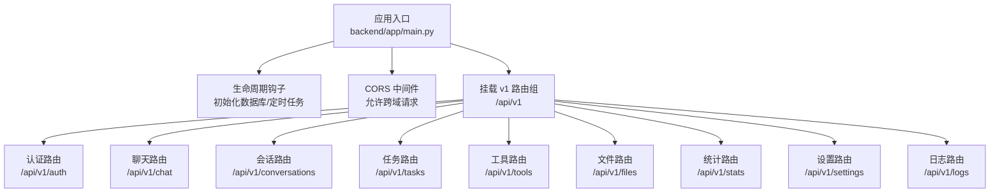
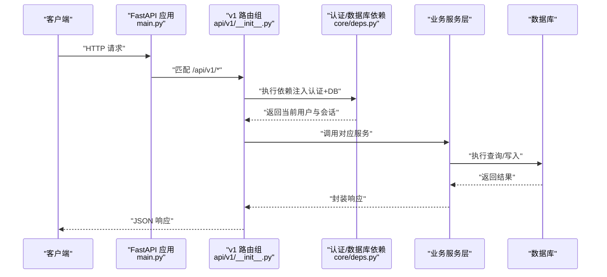
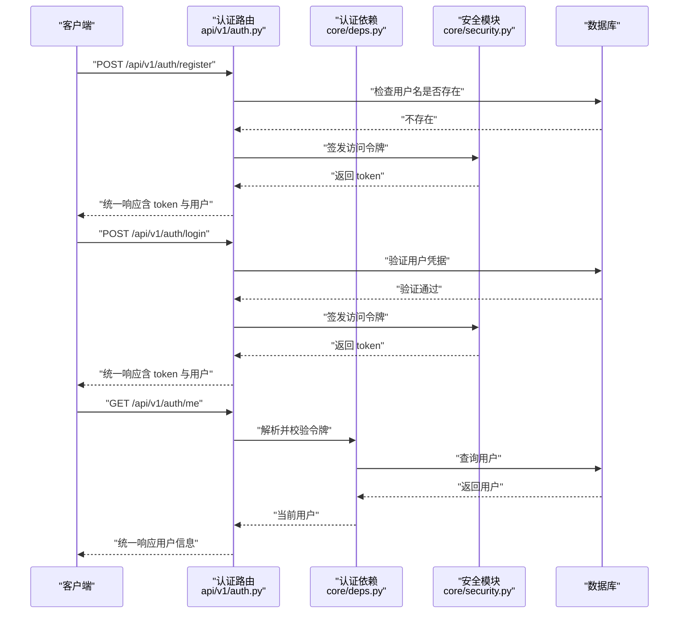
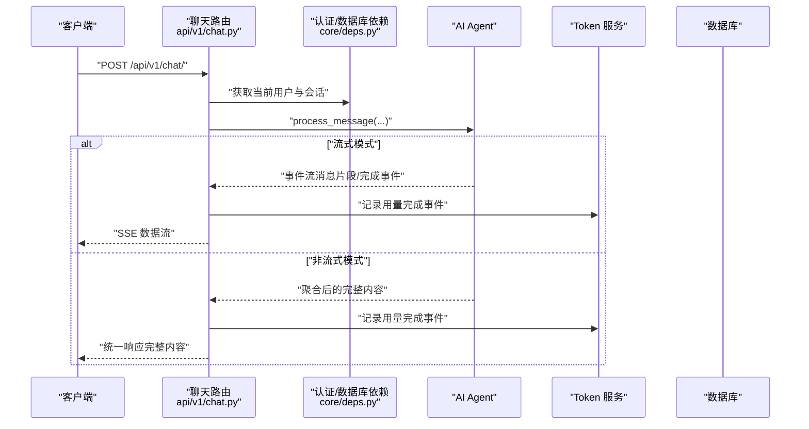
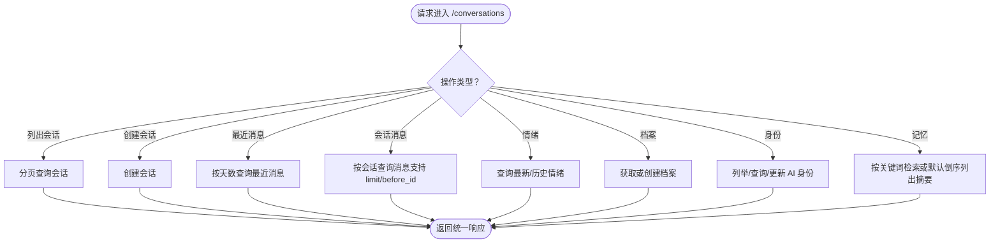
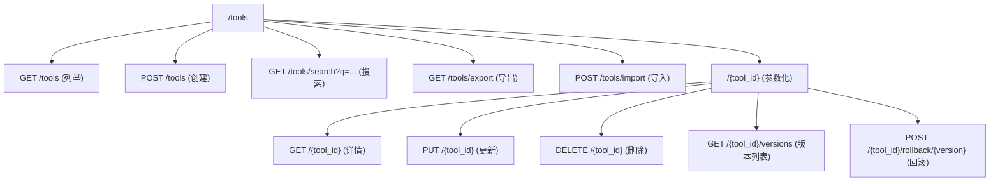
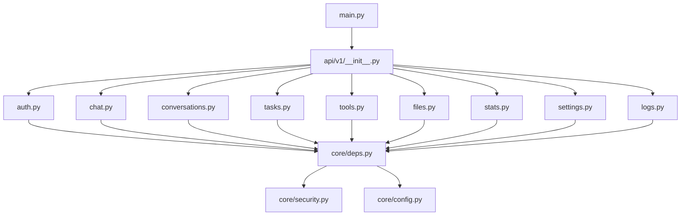

# API路由设计

<cite>
**本文引用的文件**
- [backend/app/main.py](file://backend/app/main.py)
- [backend/app/api/v1/__init__.py](file://backend/app/api/v1/__init__.py)
- [backend/app/api/v1/auth.py](file://backend/app/api/v1/auth.py)
- [backend/app/api/v1/chat.py](file://backend/app/api/v1/chat.py)
- [backend/app/api/v1/conversations.py](file://backend/app/api/v1/conversations.py)
- [backend/app/api/v1/tasks.py](file://backend/app/api/v1/tasks.py)
- [backend/app/api/v1/tools.py](file://backend/app/api/v1/tools.py)
- [backend/app/api/v1/files.py](file://backend/app/api/v1/files.py)
- [backend/app/api/v1/stats.py](file://backend/app/api/v1/stats.py)
- [backend/app/api/v1/settings.py](file://backend/app/api/v1/settings.py)
- [backend/app/api/v1/logs.py](file://backend/app/api/v1/logs.py)
- [backend/app/core/config.py](file://backend/app/core/config.py)
- [backend/app/core/security.py](file://backend/app/core/security.py)
- [backend/app/core/deps.py](file://backend/app/core/deps.py)
- [backend/app/core/exceptions.py](file://backend/app/core/exceptions.py)
</cite>

## 目录
1. [引言](#引言)
2. [项目结构](#项目结构)
3. [核心组件](#核心组件)
4. [架构总览](#架构总览)
5. [详细组件分析](#详细组件分析)
6. [依赖分析](#依赖分析)
7. [性能考虑](#性能考虑)
8. [故障排查指南](#故障排查指南)
9. [结论](#结论)
10. [附录](#附录)

## 引言
本文件系统性梳理 XuanJi 后端基于 FastAPI 的 API 路由设计与实现，覆盖以下主题：
- 路由装饰器与路径参数、查询参数处理
- 版本化 API 设计与路由分组策略
- 中间件应用（CORS、认证依赖）
- 请求预处理与错误处理机制
- 路由性能优化与 API 文档生成
- 最佳实践与常见模式示例

## 项目结构
后端采用“版本化路由 + 功能分组”的组织方式：
- 应用入口在主程序中注册生命周期钩子、CORS 中间件、健康检查端点，并挂载 v1 路由组
- v1 路由组通过聚合多个功能子路由（如 auth、chat、conversations、tasks、tools、files、stats、settings、logs）实现模块化管理
- 认证依赖统一从 Authorization 头部提取令牌并校验，数据库会话通过依赖注入提供

图表来源
- [backend/app/main.py:30-40](file://backend/app/main.py#L30-L40)
- [backend/app/api/v1/__init__.py:13-22](file://backend/app/api/v1/__init__.py#L13-L22)

章节来源
- [backend/app/main.py:30-40](file://backend/app/main.py#L30-L40)
- [backend/app/api/v1/__init__.py:13-22](file://backend/app/api/v1/__init__.py#L13-L22)

## 核心组件
- 应用实例与生命周期
  - 使用 lifespan 管理数据库初始化与后台定时任务启停
  - 健康检查端点用于服务状态探测
- CORS 配置
  - 从配置读取允许的源列表，支持凭据、通配方法与头
- 认证与安全
  - JWT 密钥来自配置，令牌有效期与算法常量定义于安全模块
  - 通用依赖从 Authorization 头部解析并校验令牌，查询用户并校验是否删除
- 数据库依赖
  - 通过依赖注入提供 SQLAlchemy 会话，确保每个请求作用域内复用

章节来源
- [backend/app/main.py:15-27](file://backend/app/main.py#L15-L27)
- [backend/app/main.py:30-38](file://backend/app/main.py#L30-L38)
- [backend/app/main.py:62-64](file://backend/app/main.py#L62-L64)
- [backend/app/core/config.py:40-42](file://backend/app/core/config.py#L40-L42)
- [backend/app/core/security.py:8-30](file://backend/app/core/security.py#L8-L30)
- [backend/app/core/deps.py:12-41](file://backend/app/core/deps.py#L12-L41)

## 架构总览
下图展示从客户端到各业务路由的调用链路，以及认证依赖与数据库依赖的注入位置。

图表来源
- [backend/app/main.py:30-40](file://backend/app/main.py#L30-L40)
- [backend/app/api/v1/__init__.py:13-22](file://backend/app/api/v1/__init__.py#L13-L22)
- [backend/app/core/deps.py:12-41](file://backend/app/core/deps.py#L12-L41)

## 详细组件分析

### 认证路由（/api/v1/auth）
- 路径前缀与标签：/auth，标签用于文档分组
- 关键端点
  - 注册：接收用户创建模型，检查用户名冲突，创建用户并签发访问令牌
  - 登录：验证用户名与密码，成功则签发访问令牌
  - 获取当前用户：依赖认证依赖，返回用户信息
- 参数与响应
  - 使用 Pydantic 模型进行请求体校验
  - 统一响应结构包含 code、message、data 字段
- 安全要点
  - 令牌签发使用 HS256 算法与密钥，有效期为 7 天
  - 用户不存在或令牌无效时返回 401

图表来源
- [backend/app/api/v1/auth.py:14-60](file://backend/app/api/v1/auth.py#L14-L60)
- [backend/app/core/deps.py:12-41](file://backend/app/core/deps.py#L12-L41)
- [backend/app/core/security.py:24-30](file://backend/app/core/security.py#L24-L30)

章节来源
- [backend/app/api/v1/auth.py:11-60](file://backend/app/api/v1/auth.py#L11-L60)
- [backend/app/core/security.py:8-30](file://backend/app/core/security.py#L8-L30)
- [backend/app/core/deps.py:12-41](file://backend/app/core/deps.py#L12-L41)

### 聊天路由（/api/v1/chat）
- 路径前缀与标签：/chat，标签用于文档分组
- 关键端点
  - 发送消息：接收聊天请求模型，支持流式与非流式两种模式
  - 流式：使用 SSE 返回事件流，实时传输消息片段与最终用量记录
  - 非流式：聚合所有消息片段后一次性返回
- 参数与响应
  - 请求体使用 Pydantic 模型校验
  - 统一响应结构
- 性能与可靠性
  - 断连检测：在流式过程中检测客户端断开并优雅退出
  - 异常捕获：流式过程中的异常会被转换为错误事件并返回
  - 用量记录：在事件完成后记录 token 使用情况

图表来源
- [backend/app/api/v1/chat.py:40-105](file://backend/app/api/v1/chat.py#L40-L105)
- [backend/app/core/deps.py:12-41](file://backend/app/core/deps.py#L12-L41)

章节来源
- [backend/app/api/v1/chat.py:19-105](file://backend/app/api/v1/chat.py#L19-L105)

### 会话路由（/api/v1/conversations）
- 路径前缀与标签：/conversations，标签用于文档分组
- 关键端点
  - 列出会话：分页查询，支持页码与每页数量
  - 创建会话：根据标题创建新会话
  - 查询最近消息：按天数范围查询
  - 查询指定会话的消息：支持分页与游标参数
  - 情绪相关：查询最新情绪与历史情绪
  - 用户档案：获取或创建用户档案
  - AI 人格：列举、查询、更新指定 AI 的身份信息
  - 记忆：按关键词检索相关记忆或默认按时间倒序列出摘要
- 参数与响应
  - 分页参数使用 Query 并设置合理边界
  - 路径参数使用强类型注解（如 conversation_id: int）

图表来源
- [backend/app/api/v1/conversations.py:22-186](file://backend/app/api/v1/conversations.py#L22-L186)

章节来源
- [backend/app/api/v1/conversations.py:17-186](file://backend/app/api/v1/conversations.py#L17-L186)

### 任务路由（/api/v1/tasks）
- 路径前缀与标签：/tasks
- 关键端点
  - 列举任务：按创建时间倒序，限制数量
  - 获取单个任务：按 ID 与用户过滤
- 参数与响应
  - 使用 Query 设置默认值与边界
  - 统一响应结构

章节来源
- [backend/app/api/v1/tasks.py:10-49](file://backend/app/api/v1/tasks.py#L10-L49)

### 工具路由（/api/v1/tools）
- 路径前缀与标签：/tools
- 关键端点
  - 固定路径端点（必须在参数化端点之前声明）：列举、创建、搜索、导出、导入
  - 参数化端点：获取、更新、删除、查看版本、回滚版本
- 参数与响应
  - 搜索使用模糊匹配
  - 导入/导出使用专用模型
  - 版本回滚返回目标版本的工具数据

图表来源
- [backend/app/api/v1/tools.py:25-168](file://backend/app/api/v1/tools.py#L25-L168)

章节来源
- [backend/app/api/v1/tools.py:19-168](file://backend/app/api/v1/tools.py#L19-L168)

### 文件路由（/api/v1/files）
- 路径前缀与标签：/files
- 关键端点
  - 浏览目录：限定在沙箱目录范围内，支持相对路径与权限控制
- 参数与响应
  - 使用 Query 解析路径参数
  - 对越权访问、路径不存在、非目录等场景返回相应错误码

章节来源
- [backend/app/api/v1/files.py:8-47](file://backend/app/api/v1/files.py#L8-L47)

### 统计路由（/api/v1/stats）
- 路径前缀与标签：/stats
- 关键端点
  - 仪表盘统计：当日/当月/总计 token 使用与预算
  - 按角色统计：支持天数参数
  - 日常统计：支持天数参数
  - 按模型统计：支持天数参数

章节来源
- [backend/app/api/v1/stats.py:9-61](file://backend/app/api/v1/stats.py#L9-L61)

### 设置路由（/api/v1/settings）
- 路径前缀与标签：/settings
- 关键端点
  - 获取用户设置：若不存在则返回空
  - 更新用户设置：支持部分更新
  - 获取 token 使用统计：返回汇总数据

章节来源
- [backend/app/api/v1/settings.py:11-54](file://backend/app/api/v1/settings.py#L11-L54)

### 日志路由（/api/v1/logs）
- 路径前缀与标签：/logs
- 关键端点
  - 分页查询日志：支持级别与来源过滤
  - 日志统计概览：返回统计信息

章节来源
- [backend/app/api/v1/logs.py:10-52](file://backend/app/api/v1/logs.py#L10-L52)

## 依赖分析
- 应用级依赖
  - CORS 来自配置项，便于在不同环境灵活调整
  - 生命周期钩子负责数据库初始化与定时任务启停
- 路由级依赖
  - 所有受保护端点均依赖认证依赖，确保用户身份有效且未删除
  - 数据库依赖通过会话注入，保证事务一致性
- 服务层依赖
  - 各路由调用对应服务层，服务层再访问模型与数据库

图表来源
- [backend/app/main.py:30-40](file://backend/app/main.py#L30-L40)
- [backend/app/api/v1/__init__.py:13-22](file://backend/app/api/v1/__init__.py#L13-L22)
- [backend/app/core/deps.py:12-41](file://backend/app/core/deps.py#L12-L41)
- [backend/app/core/security.py:24-30](file://backend/app/core/security.py#L24-L30)
- [backend/app/core/config.py:40-42](file://backend/app/core/config.py#L40-L42)

章节来源
- [backend/app/main.py:30-40](file://backend/app/main.py#L30-L40)
- [backend/app/api/v1/__init__.py:13-22](file://backend/app/api/v1/__init__.py#L13-L22)
- [backend/app/core/deps.py:12-41](file://backend/app/core/deps.py#L12-L41)

## 性能考虑
- 流式响应
  - 聊天接口支持 SSE 流式输出，边生成边返回，降低首字节延迟
  - 在流式过程中检测断连并及时停止计算，避免资源浪费
- 分页与边界
  - 列表接口普遍使用 Query 设置合理的默认值与上限，防止超大分页导致数据库压力
- 依赖注入
  - 将认证与数据库依赖下沉至路由层，减少重复校验与连接开销
- 缓存与索引
  - 建议对高频查询（如最近消息、会话列表）建立合适索引以提升查询性能
- CORS 与中间件
  - 仅在必要范围内放行跨域，避免通配符带来的安全与性能风险

## 故障排查指南
- 认证失败
  - 现象：返回 401，提示令牌无效或过期
  - 排查：确认 Authorization 头是否携带、令牌是否正确、用户是否存在且未删除
- 参数校验失败
  - 现象：返回 422，包含中文错误信息
  - 排查：检查请求体字段类型与约束，参考 Pydantic 校验错误
- 路径越权
  - 现象：访问沙箱外路径返回 403
  - 排查：确认传入路径位于沙箱根目录之下
- 资源不存在
  - 现象：返回 404
  - 排查：确认 ID 或路径有效

章节来源
- [backend/app/main.py:43-59](file://backend/app/main.py#L43-L59)
- [backend/app/api/v1/files.py:19-26](file://backend/app/api/v1/files.py#L19-L26)
- [backend/app/api/v1/tasks.py:43-44](file://backend/app/api/v1/tasks.py#L43-L44)

## 结论
XuanJi 的 API 路由设计遵循“版本化 + 功能分组 + 统一响应 + 依赖注入”的原则，结合认证中间件与 CORS 配置，形成清晰、可维护、可扩展的后端架构。通过流式响应、参数边界与生命周期管理等手段，在可用性与性能之间取得平衡。

## 附录

### 版本化 API 设计与路由分组策略
- 采用 /api/v1 前缀隔离版本，后续升级可在新版本路由中演进而不破坏旧客户端
- v1 路由组内部按领域拆分子路由，便于团队协作与文档生成

章节来源
- [backend/app/api/v1/__init__.py:13-22](file://backend/app/api/v1/__init__.py#L13-L22)

### 中间件应用
- CORS：允许凭据、通配方法与头，源列表来自配置
- 认证：通过 HTTP Bearer 方案与依赖注入实现全局认证

章节来源
- [backend/app/main.py:32-38](file://backend/app/main.py#L32-L38)
- [backend/app/core/deps.py:9-11](file://backend/app/core/deps.py#L9-L11)

### 请求预处理与错误处理
- 请求预处理：统一响应结构、参数校验、路径/查询参数边界
- 错误处理：Pydantic 验证错误转中文提示，422 返回；业务异常通过 HTTPException 抛出

章节来源
- [backend/app/main.py:43-59](file://backend/app/main.py#L43-L59)

### API 文档生成
- FastAPI 自动基于路由装饰器与 Pydantic 模型生成 OpenAPI 文档
- 建议在路由中补充简要描述与标签，提升文档可读性

### 路由设计最佳实践与常见模式
- 统一响应结构：code/message/data
- 参数约束：Query 默认值与上下界
- 路由分组：按领域划分子路由
- 流式输出：SSE 实时交互
- 路径优先级：固定路径端点需先于参数化端点声明（工具路由示例）

章节来源
- [backend/app/api/v1/tools.py:22-22](file://backend/app/api/v1/tools.py#L22-L22)