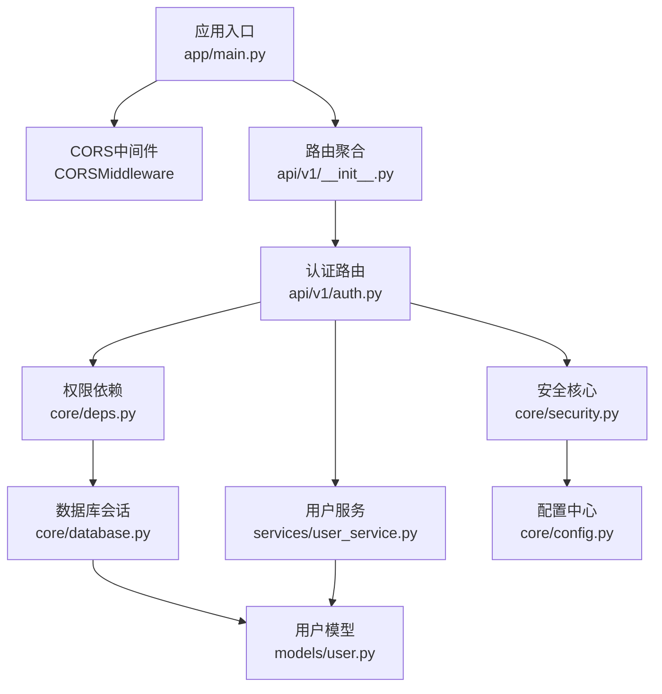
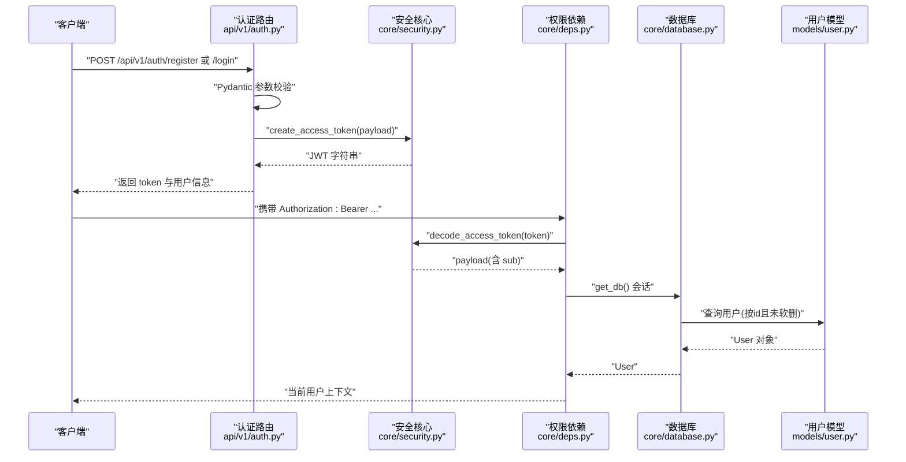
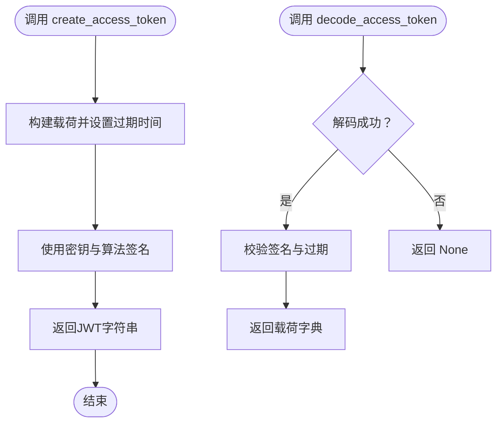
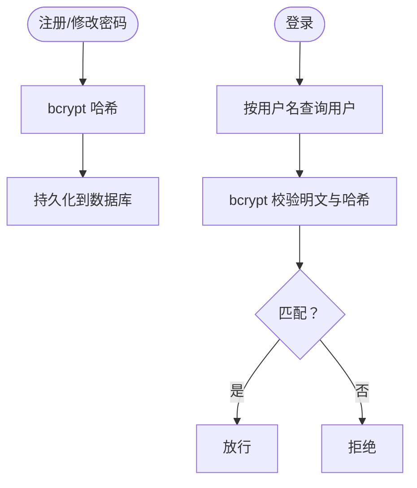
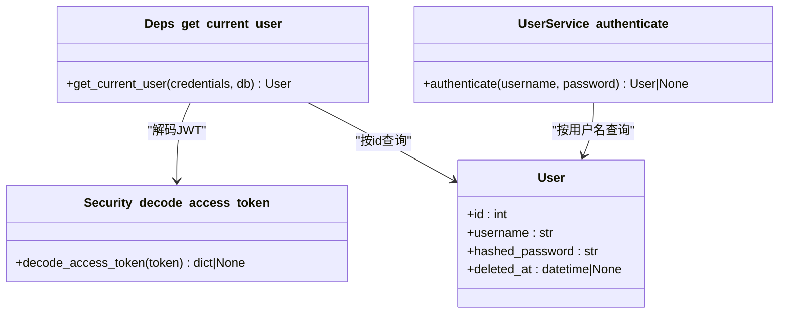
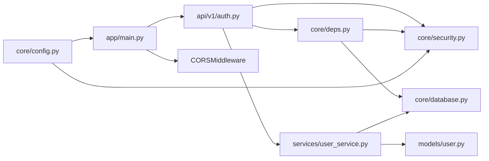

# 安全与认证

<cite>
**本文引用的文件**
- [backend/app/main.py](file://backend/app/main.py)
- [backend/app/core/config.py](file://backend/app/core/config.py)
- [backend/app/core/security.py](file://backend/app/core/security.py)
- [backend/app/core/deps.py](file://backend/app/core/deps.py)
- [backend/app/core/database.py](file://backend/app/core/database.py)
- [backend/app/api/v1/auth.py](file://backend/app/api/v1/auth.py)
- [backend/app/api/v1/__init__.py](file://backend/app/api/v1/__init__.py)
- [backend/app/models/user.py](file://backend/app/models/user.py)
- [backend/app/schemas/user.py](file://backend/app/schemas/user.py)
- [backend/app/services/user_service.py](file://backend/app/services/user_service.py)
- [backend/app/schemas/common.py](file://backend/app/schemas/common.py)
- [backend/app/core/exceptions.py](file://backend/app/core/exceptions.py)
</cite>

## 目录
1. [简介](#简介)
2. [项目结构](#项目结构)
3. [核心组件](#核心组件)
4. [架构总览](#架构总览)
5. [详细组件分析](#详细组件分析)
6. [依赖分析](#依赖分析)
7. [性能考虑](#性能考虑)
8. [故障排查指南](#故障排查指南)
9. [结论](#结论)
10. [附录](#附录)

## 简介
本指南聚焦于XuanJi后端的安全与认证体系，覆盖JWT令牌生成与验证、密码加密存储、会话管理机制、CORS配置策略、请求验证规则、权限控制模型，以及CSRF、XSS、SQL注入等常见威胁的缓解建议。同时提供安全审计日志、异常监控与安全事件响应思路，并给出安全配置最佳实践与漏洞防护清单。

## 项目结构
后端采用FastAPI + SQLAlchemy架构，安全相关能力集中在以下模块：
- 应用入口与中间件：CORS配置、全局异常处理
- 安全核心：JWT编码/解码、密码哈希/校验
- 认证路由：注册、登录、当前用户查询
- 权限依赖：基于Bearer Token解析用户上下文
- 数据模型与服务：用户表结构、密码存储、认证流程
- 配置中心：密钥、CORS来源、数据库连接等

**图示来源**
- [backend/app/main.py:30-40](file://backend/app/main.py#L30-L40)
- [backend/app/api/v1/__init__.py:1-23](file://backend/app/api/v1/__init__.py#L1-L23)
- [backend/app/api/v1/auth.py:1-61](file://backend/app/api/v1/auth.py#L1-L61)
- [backend/app/core/security.py:1-38](file://backend/app/core/security.py#L1-L38)
- [backend/app/core/deps.py:1-42](file://backend/app/core/deps.py#L1-L42)
- [backend/app/core/database.py:1-65](file://backend/app/core/database.py#L1-L65)
- [backend/app/models/user.py:1-23](file://backend/app/models/user.py#L1-L23)
- [backend/app/services/user_service.py:1-46](file://backend/app/services/user_service.py#L1-L46)
- [backend/app/core/config.py:1-68](file://backend/app/core/config.py#L1-L68)

**章节来源**
- [backend/app/main.py:30-40](file://backend/app/main.py#L30-L40)
- [backend/app/api/v1/__init__.py:1-23](file://backend/app/api/v1/__init__.py#L1-L23)

## 核心组件
- JWT与密码安全
  - 使用对称算法生成访问令牌，设置过期时间；使用bcrypt进行密码哈希与校验。
- CORS与请求验证
  - 全局启用CORS，允许凭据与所有方法/头；Pydantic用于请求体字段的强约束与中文错误提示。
- 权限控制
  - 基于HTTP Bearer Token的依赖注入，从令牌中解析用户ID并加载活跃用户。
- 数据模型与服务
  - 用户模型包含唯一索引字段与软删除列；服务层负责密码哈希与认证逻辑。

**章节来源**
- [backend/app/core/security.py:1-38](file://backend/app/core/security.py#L1-L38)
- [backend/app/schemas/user.py:1-68](file://backend/app/schemas/user.py#L1-L68)
- [backend/app/core/deps.py:1-42](file://backend/app/core/deps.py#L1-L42)
- [backend/app/models/user.py:1-23](file://backend/app/models/user.py#L1-L23)
- [backend/app/services/user_service.py:1-46](file://backend/app/services/user_service.py#L1-L46)
- [backend/app/main.py:43-59](file://backend/app/main.py#L43-L59)

## 架构总览
下图展示认证与权限控制在系统中的交互路径：客户端发起注册/登录请求，服务端生成JWT返回；后续请求携带Bearer Token，依赖注入解析用户上下文，数据库查询用户信息并返回结果。

**图示来源**
- [backend/app/api/v1/auth.py:14-60](file://backend/app/api/v1/auth.py#L14-L60)
- [backend/app/core/security.py:24-37](file://backend/app/core/security.py#L24-L37)
- [backend/app/core/deps.py:12-41](file://backend/app/core/deps.py#L12-L41)
- [backend/app/core/database.py:14-19](file://backend/app/core/database.py#L14-L19)
- [backend/app/models/user.py:9-23](file://backend/app/models/user.py#L9-L23)

## 详细组件分析

### JWT令牌生成与验证
- 生成
  - 负载包含用户标识字段；附加过期时间；使用对称密钥与指定算法签名。
- 验证
  - 解析令牌并校验签名与过期时间；异常统一捕获返回空负载。
- 过期策略
  - 默认约7天有效期；生产环境应结合刷新令牌策略与最小权限原则。

**图示来源**
- [backend/app/core/security.py:24-37](file://backend/app/core/security.py#L24-L37)

**章节来源**
- [backend/app/core/security.py:1-38](file://backend/app/core/security.py#L1-L38)

### 密码加密存储
- 存储
  - 注册与更新密码时使用bcrypt进行哈希；数据库字段保存哈希值。
- 校验
  - 登录时使用bcrypt校验明文与存储的哈希是否匹配。
- 强度策略
  - 请求体中通过Pydantic校验器强制密码强度要求（长度、大小写、数字、特殊字符）。

**图示来源**
- [backend/app/services/user_service.py:12-21](file://backend/app/services/user_service.py#L12-L21)
- [backend/app/schemas/user.py:22-37](file://backend/app/schemas/user.py#L22-L37)
- [backend/app/models/user.py:15-15](file://backend/app/models/user.py#L15-L15)

**章节来源**
- [backend/app/services/user_service.py:1-46](file://backend/app/services/user_service.py#L1-L46)
- [backend/app/schemas/user.py:1-68](file://backend/app/schemas/user.py#L1-L68)
- [backend/app/models/user.py:1-23](file://backend/app/models/user.py#L1-L23)

### 会话管理机制
- 无状态会话
  - 后端不维护会话状态，用户通过Bearer Token携带身份信息。
- 令牌生命周期
  - 令牌过期后需重新登录；建议引入刷新令牌以改善体验。
- 软删除与用户有效性
  - 查询用户时过滤软删除字段，确保被禁用账户无法通过鉴权。

**图示来源**
- [backend/app/core/deps.py:12-41](file://backend/app/core/deps.py#L12-L41)
- [backend/app/core/security.py:33-37](file://backend/app/core/security.py#L33-L37)
- [backend/app/services/user_service.py:23-31](file://backend/app/services/user_service.py#L23-L31)
- [backend/app/models/user.py:12-23](file://backend/app/models/user.py#L12-L23)

**章节来源**
- [backend/app/core/deps.py:1-42](file://backend/app/core/deps.py#L1-L42)
- [backend/app/services/user_service.py:1-46](file://backend/app/services/user_service.py#L1-L46)
- [backend/app/models/user.py:1-23](file://backend/app/models/user.py#L1-L23)

### CORS配置策略
- 允许凭据、所有方法与头，来源由配置中心提供。
- 生产环境建议：
  - 将来源限制为具体域名与端口；
  - 严格控制暴露的HTTP方法与自定义头；
  - 避免使用通配符来源与方法，降低跨域风险。

**章节来源**
- [backend/app/main.py:32-38](file://backend/app/main.py#L32-L38)
- [backend/app/core/config.py:41-42](file://backend/app/core/config.py#L41-L42)

### 请求验证规则
- Pydantic模型与字段验证器：
  - 用户名：长度、字符集、禁止纯数字；
  - 密码：长度、大小写、数字、特殊字符；
  - 邮箱：使用EmailStr类型保证格式。
- 全局异常处理：
  - 将Pydantic验证错误映射为中文提示，便于前端展示与用户理解。

**章节来源**
- [backend/app/schemas/user.py:11-37](file://backend/app/schemas/user.py#L11-L37)
- [backend/app/main.py:43-59](file://backend/app/main.py#L43-L59)

### 权限控制模型
- Bearer Token
  - 客户端在请求头携带Authorization: Bearer <token>；
  - 依赖注入函数解析令牌并加载当前用户；
  - 若令牌无效或用户不存在/已删除，则返回未授权。
- 路由保护
  - 当前“/auth/me”接口通过依赖注入实现受保护访问；其他路由如需保护，应在对应路由上添加相同依赖。

**章节来源**
- [backend/app/api/v1/auth.py:54-60](file://backend/app/api/v1/auth.py#L54-L60)
- [backend/app/core/deps.py:12-41](file://backend/app/core/deps.py#L12-L41)

### CSRF防护
- 当前实现未见专用CSRF中间件或Token校验。
- 建议措施：
  - 对于Cookie + Web场景，启用CSRF中间件或在API中引入一次性CSRF Token；
  - 限制来源与方法，避免跨站请求伪造。

[本节为通用安全建议，不直接分析具体文件]

### XSS防护
- 输入输出均通过Pydantic模型处理，建议：
  - 前端渲染时对用户输入进行HTML转义；
  - 使用内容安全策略（CSP）限制脚本执行源；
  - 对富文本场景严格白名单过滤。

[本节为通用安全建议，不直接分析具体文件]

### SQL注入防范
- ORM使用
  - SQLAlchemy ORM与模型字段定义有效隔离原生SQL拼接风险；
  - 自动迁移逻辑通过DDL动态添加列，避免手写SQL注入。
- 建议
  - 严禁在ORM之外使用原生SQL拼接；
  - 对外部输入进行严格白名单与长度限制。

**章节来源**
- [backend/app/core/database.py:44-64](file://backend/app/core/database.py#L44-L64)
- [backend/app/models/user.py:3-23](file://backend/app/models/user.py#L3-L23)

## 依赖分析
- 组件耦合
  - 认证路由依赖安全核心与用户服务；权限依赖依赖安全核心与数据库；配置中心贯穿全局。
- 外部依赖
  - JWT库、bcrypt、SQLAlchemy、FastAPI中间件。
- 潜在问题
  - CORS配置过于宽松；缺少CSRF防护；异常处理集中于入口，建议在各模块细化。

**图示来源**
- [backend/app/api/v1/auth.py:1-61](file://backend/app/api/v1/auth.py#L1-L61)
- [backend/app/core/security.py:1-38](file://backend/app/core/security.py#L1-L38)
- [backend/app/core/deps.py:1-42](file://backend/app/core/deps.py#L1-L42)
- [backend/app/services/user_service.py:1-46](file://backend/app/services/user_service.py#L1-L46)
- [backend/app/core/database.py:1-65](file://backend/app/core/database.py#L1-L65)
- [backend/app/models/user.py:1-23](file://backend/app/models/user.py#L1-L23)
- [backend/app/main.py:30-40](file://backend/app/main.py#L30-L40)
- [backend/app/core/config.py:1-68](file://backend/app/core/config.py#L1-L68)

**章节来源**
- [backend/app/api/v1/__init__.py:1-23](file://backend/app/api/v1/__init__.py#L1-L23)
- [backend/app/main.py:30-40](file://backend/app/main.py#L30-L40)

## 性能考虑
- JWT解析成本低，适合高并发场景；
- bcrypt哈希计算开销较高，建议在注册/登录时使用，避免在高频读取路径重复计算；
- 数据库连接池与预检连接可提升稳定性；
- 对频繁的用户查询可增加缓存层（如Redis），但需注意令牌失效与缓存一致性。

[本节为通用指导，不直接分析具体文件]

## 故障排查指南
- 401未授权
  - 检查令牌是否过期或签名无效；确认依赖注入是否正确传递凭证；核对用户是否存在且未软删除。
- 422参数错误
  - 关注全局异常处理器返回的中文提示，逐项修正字段格式与长度。
- CORS跨域失败
  - 核对配置中心的来源列表与实际前端地址一致；确认是否允许凭据与相应方法。
- 密码校验失败
  - 确认bcrypt哈希是否正确存储；检查明文与哈希匹配逻辑。

**章节来源**
- [backend/app/core/deps.py:16-41](file://backend/app/core/deps.py#L16-L41)
- [backend/app/main.py:43-59](file://backend/app/main.py#L43-L59)
- [backend/app/core/config.py:41-42](file://backend/app/core/config.py#L41-L42)
- [backend/app/services/user_service.py:23-31](file://backend/app/services/user_service.py#L23-L31)

## 结论
XuanJi后端已具备基础的JWT认证、密码哈希与CORS支持。建议在生产环境中强化CORS来源限制、补充CSRF防护、完善异常与审计日志体系，并结合刷新令牌与最小权限原则进一步提升安全性与可用性。

## 附录

### 安全审计日志与异常监控
- 建议
  - 记录登录/登出、令牌刷新、敏感操作的审计日志；
  - 对401/403/429/5xx等异常进行聚合统计与告警；
  - 日志脱敏，避免泄露敏感字段。

[本节为通用建议，不直接分析具体文件]

### 安全事件响应
- 建议流程
  - 快速定位受影响范围与时间窗口；
  - 回滚可疑变更、撤销受影响令牌、冻结高危账户；
  - 修复漏洞并发布补丁版本，对外发布安全公告。

[本节为通用建议，不直接分析具体文件]

### 安全配置最佳实践
- 密钥与来源
  - 生产环境务必更换默认密钥；CORS来源限定为可信域名与端口。
- 令牌策略
  - 短有效期+刷新令牌；刷新令牌单独存储与轮换。
- 输入与输出
  - 严格字段校验；前后端均进行数据清洗与转义。
- 数据库
  - 禁止原生SQL拼接；定期备份与最小权限访问。

**章节来源**
- [backend/app/core/config.py:41-42](file://backend/app/core/config.py#L41-L42)
- [backend/app/core/security.py:8-9](file://backend/app/core/security.py#L8-L9)

### 漏洞防护清单
- 已实现
  - 密码哈希（bcrypt）、JWT签名与过期控制、Pydantic参数校验、CORS中间件。
- 待完善
  - CSRF防护、XSS防护策略、SQL注入边界加固、审计日志与异常监控、令牌撤销与黑名单。

[本节为通用建议，不直接分析具体文件]