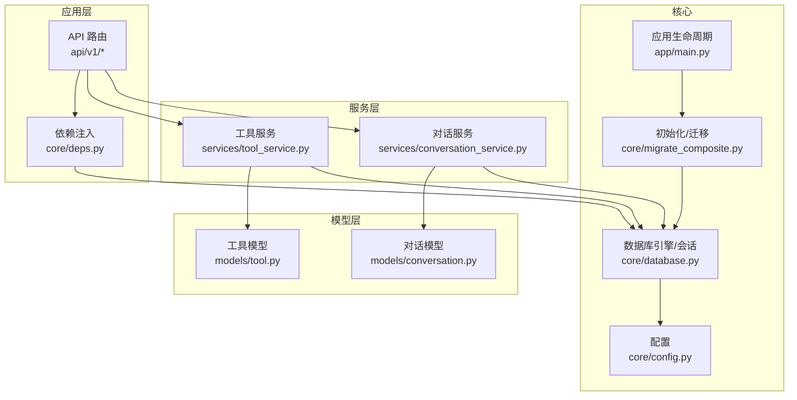
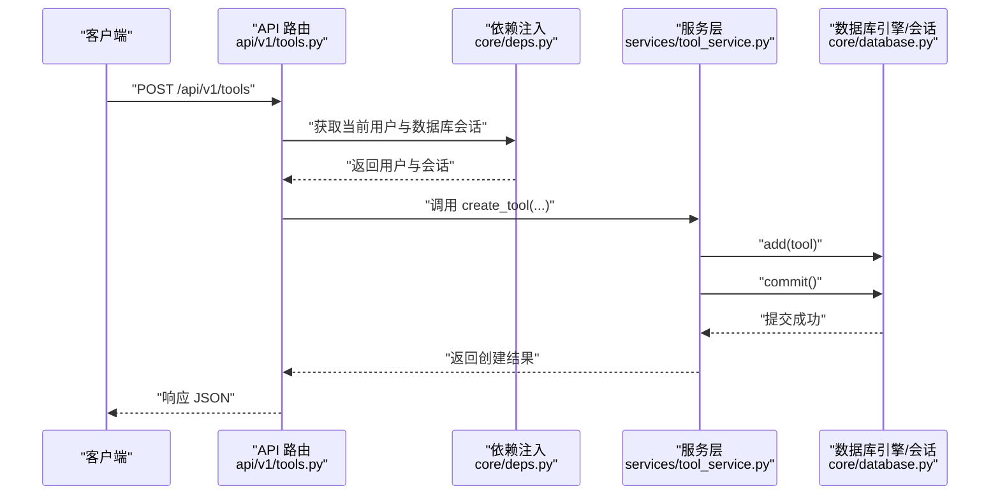
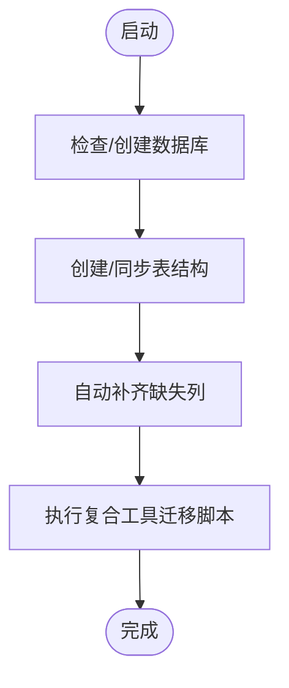
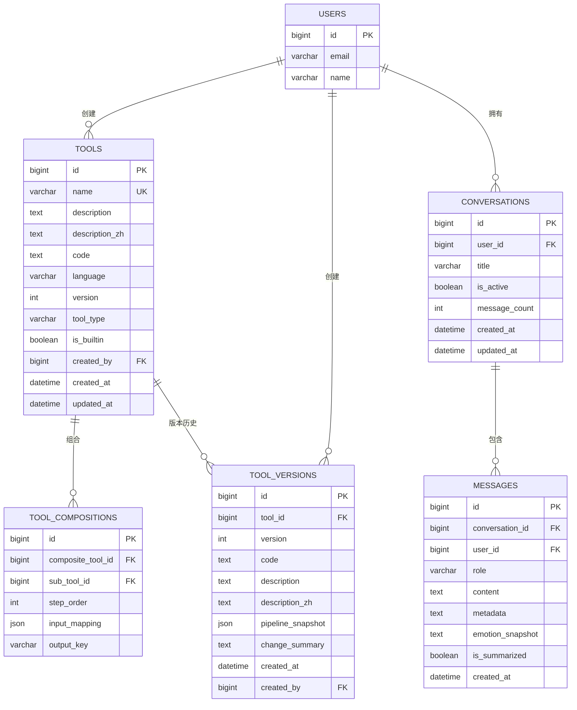
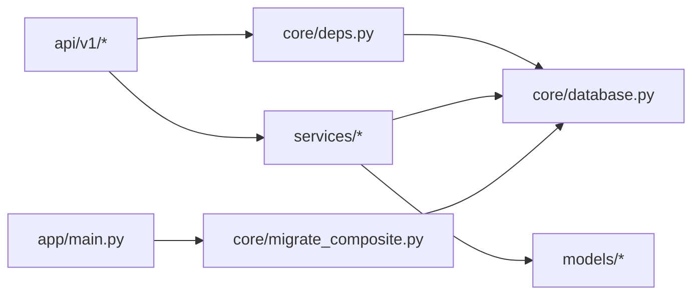

# 数据库管理

<cite>
**本文引用的文件**
- [backend/app/core/database.py](file://backend/app/core/database.py)
- [backend/app/core/config.py](file://backend/app/core/config.py)
- [backend/app/core/migrate_composite.py](file://backend/app/core/migrate_composite.py)
- [backend/app/models/tool.py](file://backend/app/models/tool.py)
- [backend/app/models/conversation.py](file://backend/app/models/conversation.py)
- [backend/app/models/__init__.py](file://backend/app/models/__init__.py)
- [backend/app/services/tool_service.py](file://backend/app/services/tool_service.py)
- [backend/app/services/conversation_service.py](file://backend/app/services/conversation_service.py)
- [backend/app/api/v1/tools.py](file://backend/app/api/v1/tools.py)
- [backend/app/api/v1/conversations.py](file://backend/app/api/v1/conversations.py)
- [backend/app/main.py](file://backend/app/main.py)
- [backend/app/core/deps.py](file://backend/app/core/deps.py)
</cite>

## 目录
1. [简介](#简介)
2. [项目结构](#项目结构)
3. [核心组件](#核心组件)
4. [架构总览](#架构总览)
5. [详细组件分析](#详细组件分析)
6. [依赖分析](#依赖分析)
7. [性能考虑](#性能考虑)
8. [故障排除指南](#故障排除指南)
9. [结论](#结论)
10. [附录](#附录)

## 简介
本文件系统化梳理 XuanJi 后端数据库管理现状与实践，覆盖连接池配置、事务管理策略、连接超时处理、数据迁移与版本控制、备份与恢复思路、索引与查询优化、批量操作、监控与慢查询分析、容量规划以及维护最佳实践与故障排除建议。内容基于仓库中实际实现进行归纳总结，帮助开发者与运维人员在生产环境中稳定运行数据库层。

## 项目结构
后端数据库相关的关键位置集中在 core、models、services、api 与主入口模块中：
- 连接与会话：core/database.py
- 配置项：core/config.py
- 初始化与自动迁移：core/database.py、core/migrate_composite.py
- 模型定义：models 下各表模型
- 服务层事务边界：services 下各业务服务
- API 层依赖注入与会话获取：api/v1/*、core/deps.py
- 应用生命周期初始化：app/main.py

图表来源
- [backend/app/core/database.py:1-65](file://backend/app/core/database.py#L1-L65)
- [backend/app/core/config.py:1-68](file://backend/app/core/config.py#L1-L68)
- [backend/app/core/migrate_composite.py:1-153](file://backend/app/core/migrate_composite.py#L1-L153)
- [backend/app/models/tool.py:1-64](file://backend/app/models/tool.py#L1-L64)
- [backend/app/models/conversation.py:1-41](file://backend/app/models/conversation.py#L1-L41)
- [backend/app/services/tool_service.py:1-222](file://backend/app/services/tool_service.py#L1-L222)
- [backend/app/services/conversation_service.py:1-141](file://backend/app/services/conversation_service.py#L1-L141)
- [backend/app/api/v1/tools.py:1-169](file://backend/app/api/v1/tools.py#L1-L169)
- [backend/app/api/v1/conversations.py:1-187](file://backend/app/api/v1/conversations.py#L1-L187)
- [backend/app/main.py:1-79](file://backend/app/main.py#L1-L79)
- [backend/app/core/deps.py:1-42](file://backend/app/core/deps.py#L1-L42)

章节来源
- [backend/app/main.py:15-28](file://backend/app/main.py#L15-L28)
- [backend/app/core/database.py:22-42](file://backend/app/core/database.py#L22-L42)
- [backend/app/core/config.py:48-62](file://backend/app/core/config.py#L48-L62)

## 核心组件
- 数据库引擎与会话
  - 使用 SQLAlchemy 创建引擎，并启用连接预检查以提升连接可用性。
  - 基于 sessionmaker 构建非自动提交、非自动刷新的本地会话工厂，确保显式事务控制。
- 初始化与自动迁移
  - 在启动时创建数据库（如不存在），并创建所有模型对应的表。
  - 自动检测缺失列并执行 DDL 添加列，保证模型演进与数据库结构同步。
- 配置中心
  - 提供数据库主机、端口、账号、密码、库名等配置项，并生成数据库连接字符串。
- 迁移脚本
  - 针对复合工具与版本控制的专用迁移脚本，具备幂等性，可安全重复执行。
- 模型与索引
  - 工具、对话、消息等模型均定义了必要的字段与索引，便于查询与关联。
- 服务层事务边界
  - 服务方法内显式 commit/flush，确保业务原子性与一致性。
- API 依赖注入
  - 通过依赖注入获取数据库会话，统一在请求生命周期内管理会话与事务。

章节来源
- [backend/app/core/database.py:6-7](file://backend/app/core/database.py#L6-L7)
- [backend/app/core/database.py:22-42](file://backend/app/core/database.py#L22-L42)
- [backend/app/core/config.py:4-11](file://backend/app/core/config.py#L4-L11)
- [backend/app/core/config.py:48-62](file://backend/app/core/config.py#L48-L62)
- [backend/app/core/migrate_composite.py:33-148](file://backend/app/core/migrate_composite.py#L33-L148)
- [backend/app/models/tool.py:9-29](file://backend/app/models/tool.py#L9-L29)
- [backend/app/models/conversation.py:9-22](file://backend/app/models/conversation.py#L9-L22)
- [backend/app/services/tool_service.py:15-28](file://backend/app/services/tool_service.py#L15-L28)
- [backend/app/api/v1/tools.py:4-5](file://backend/app/api/v1/tools.py#L4-L5)
- [backend/app/core/deps.py:12-15](file://backend/app/core/deps.py#L12-L15)

## 架构总览
下图展示从 API 到数据库的典型调用链路，包括依赖注入、服务层事务与数据库操作。

图表来源
- [backend/app/api/v1/tools.py:37-49](file://backend/app/api/v1/tools.py#L37-L49)
- [backend/app/core/deps.py:12-15](file://backend/app/core/deps.py#L12-L15)
- [backend/app/services/tool_service.py:15-28](file://backend/app/services/tool_service.py#L15-L28)
- [backend/app/core/database.py:14-19](file://backend/app/core/database.py#L14-L19)

## 详细组件分析

### 数据库连接池与会话管理
- 引擎与会话
  - 引擎通过配置生成连接字符串，并开启连接预检查，降低连接失效导致的异常。
  - 会话工厂关闭自动提交与自动刷新，要求在业务逻辑中显式控制事务。
- 生命周期
  - 会话通过依赖注入在每个请求中创建与关闭，避免长生命周期连接带来的资源泄漏风险。
- 超时与健康检查
  - 未显式设置连接超时参数；可通过在连接字符串中增加超时参数或在数据库侧配置连接超时策略进行补充。

章节来源
- [backend/app/core/database.py:6-7](file://backend/app/core/database.py#L6-L7)
- [backend/app/core/database.py:14-19](file://backend/app/core/database.py#L14-L19)
- [backend/app/core/config.py:48-62](file://backend/app/core/config.py#L48-L62)
- [backend/app/core/deps.py:12-15](file://backend/app/core/deps.py#L12-L15)

### 事务管理策略
- 服务层事务边界
  - 服务方法内部显式调用 commit/flush，确保单次业务操作的原子性。
  - 对于批量更新，使用 synchronize_session=False 以减少 ORM 同步开销。
- 回滚与异常
  - 代码中存在回滚示例，建议在异常处理中统一捕获并回滚，保障数据一致性。
- 并发与锁
  - 未见显式的悲观/乐观锁实现，建议在高并发写入场景引入锁策略或唯一约束避免竞态。

章节来源
- [backend/app/services/tool_service.py:25-27](file://backend/app/services/tool_service.py#L25-L27)
- [backend/app/services/conversation_service.py:24-26](file://backend/app/services/conversation_service.py#L24-L26)
- [backend/app/services/conversation_service.py:126-129](file://backend/app/services/conversation_service.py#L126-L129)

### 初始化与自动迁移
- 初始化流程
  - 启动时创建数据库（如不存在），再创建所有表。
  - 自动检测缺失列并执行 DDL 添加列，保证模型演进与数据库结构一致。
- 复合工具迁移脚本
  - 幂等执行，按步骤添加列、创建表、插入初始快照、新增列等。
  - 适用于工具版本管理与组合工具的演进。

图表来源
- [backend/app/core/database.py:22-42](file://backend/app/core/database.py#L22-L42)
- [backend/app/core/migrate_composite.py:33-148](file://backend/app/core/migrate_composite.py#L33-L148)

章节来源
- [backend/app/core/database.py:22-42](file://backend/app/core/database.py#L22-L42)
- [backend/app/core/migrate_composite.py:33-148](file://backend/app/core/migrate_composite.py#L33-L148)

### 版本控制与备份恢复
- 版本控制
  - 工具模型新增版本号字段，服务层在更新前保存版本快照，支持回滚到指定版本。
- 快照与回滚
  - 回滚前自动保存当前状态作为备份，再恢复目标版本，版本号自增。
- 备份与恢复建议
  - 建议结合数据库物理备份/逻辑导出与 Git 记录工具代码快照，形成“代码+数据”的双保险。
  - 对重要操作（如批量导入/回滚）建议在维护窗口执行并提前备份。

章节来源
- [backend/app/models/tool.py:18-19](file://backend/app/models/tool.py#L18-L19)
- [backend/app/services/tool_service.py:65-67](file://backend/app/services/tool_service.py#L65-L67)
- [backend/app/services/tool_service.py:169-191](file://backend/app/services/tool_service.py#L169-L191)
- [backend/app/services/tool_service.py:193-221](file://backend/app/services/tool_service.py#L193-L221)

### 索引优化与查询性能
- 现有索引
  - 工具表：名称唯一且带索引，便于按名称检索。
  - 对话与消息表：外键与时间字段建立索引，支持按用户、会话、时间范围查询。
- 查询优化建议
  - 对高频过滤字段（如用户 ID、时间范围）建立复合索引。
  - 分页查询使用 LIMIT/OFFSET，必要时采用“基于游标”的分页以降低偏移成本。
  - 避免 SELECT *，仅选择必要字段，减少网络与解析开销。
  - 对大文本字段（如描述、内容）谨慎全文检索，必要时引入专用搜索引擎。

章节来源
- [backend/app/models/tool.py:13](file://backend/app/models/tool.py#L13)
- [backend/app/models/conversation.py:14](file://backend/app/models/conversation.py#L14)
- [backend/app/models/conversation.py:30-31](file://backend/app/models/conversation.py#L30-L31)

### 批量操作处理
- 批量更新
  - 使用批量更新接口并关闭 ORM 同步，减少开销。
- 导入/导出
  - 支持批量导入工具，跳过内置工具并自动递增版本号。
- 建议
  - 对大批量写入使用事务包裹，合理拆分批次，避免长时间锁表。
  - 导入前校验数据完整性，失败时回滚整个批次。

章节来源
- [backend/app/services/conversation_service.py:126-129](file://backend/app/services/conversation_service.py#L126-L129)
- [backend/app/services/tool_service.py:87-119](file://backend/app/services/tool_service.py#L87-L119)

### 数据模型与关系

图表来源
- [backend/app/models/tool.py:9-64](file://backend/app/models/tool.py#L9-L64)
- [backend/app/models/conversation.py:9-41](file://backend/app/models/conversation.py#L9-L41)
- [backend/app/models/__init__.py:1-19](file://backend/app/models/__init__.py#L1-L19)

## 依赖分析
- 组件耦合
  - API 通过依赖注入获取会话，服务层依赖会话执行数据库操作，模型层定义表结构。
  - 初始化脚本与迁移脚本独立于业务逻辑，但依赖引擎与 Inspector。
- 外部依赖
  - 使用 MySQL 驱动与方言，字符集为 utf8mb4。
- 循环依赖
  - 未发现循环导入；模型初始化集中于 __init__.py。

图表来源
- [backend/app/api/v1/tools.py:1-169](file://backend/app/api/v1/tools.py#L1-L169)
- [backend/app/core/deps.py:1-42](file://backend/app/core/deps.py#L1-L42)
- [backend/app/core/database.py:1-65](file://backend/app/core/database.py#L1-L65)
- [backend/app/core/migrate_composite.py:1-153](file://backend/app/core/migrate_composite.py#L1-L153)
- [backend/app/main.py:1-79](file://backend/app/main.py#L1-L79)
- [backend/app/models/__init__.py:1-19](file://backend/app/models/__init__.py#L1-L19)

章节来源
- [backend/app/models/__init__.py:1-19](file://backend/app/models/__init__.py#L1-L19)
- [backend/app/core/migrate_composite.py:19](file://backend/app/core/migrate_composite.py#L19)

## 性能考虑
- 连接池与超时
  - 当前未显式设置连接超时；建议在连接字符串中增加超时参数，并在数据库侧设置连接空闲超时。
- 查询优化
  - 为高频查询字段建立合适索引；避免全表扫描；使用 EXPLAIN 分析慢查询。
- 批量操作
  - 使用批量接口与事务包裹；拆分批次，避免长时间锁表。
- 缓存与归档
  - 对历史数据与热点查询引入缓存；对长期未访问的历史数据进行归档或冷存储。

## 故障排除指南
- 连接失败
  - 检查数据库地址、端口、账号与密码是否正确；确认网络连通性。
  - 若出现连接失效，启用连接预检查并适当缩短连接超时。
- 表结构不一致
  - 运行初始化脚本与迁移脚本，确保自动补齐缺失列与创建新表。
- 事务异常
  - 在异常路径中统一回滚；确保服务层在 commit 前已 flush。
- 慢查询定位
  - 使用数据库慢查询日志与 EXPLAIN 分析；优化索引与 SQL 结构。
- 容量与备份
  - 定期备份数据库；监控磁盘空间与连接数；对大表进行分区或归档。

章节来源
- [backend/app/core/database.py:22-42](file://backend/app/core/database.py#L22-L42)
- [backend/app/core/migrate_composite.py:33-148](file://backend/app/core/migrate_composite.py#L33-L148)
- [backend/app/services/tool_service.py:65-67](file://backend/app/services/tool_service.py#L65-L67)

## 结论
XuanJi 的数据库层以 SQLAlchemy 为核心，通过显式会话与服务层事务边界实现了清晰的控制流；初始化与迁移脚本保障了模型演进的稳定性。建议在生产环境进一步完善连接超时、索引策略、批量操作与慢查询分析体系，并建立完善的备份与容量规划机制，以确保系统的高可用与高性能。

## 附录
- 关键实现路径参考
  - 引擎与会话：[backend/app/core/database.py:6-7](file://backend/app/core/database.py#L6-L7)
  - 初始化与自动迁移：[backend/app/core/database.py:22-42](file://backend/app/core/database.py#L22-L42)
  - 复合工具迁移脚本：[backend/app/core/migrate_composite.py:33-148](file://backend/app/core/migrate_composite.py#L33-L148)
  - 工具模型与索引：[backend/app/models/tool.py:9-29](file://backend/app/models/tool.py#L9-L29)
  - 对话模型与索引：[backend/app/models/conversation.py:9-41](file://backend/app/models/conversation.py#L9-L41)
  - 工具服务事务边界：[backend/app/services/tool_service.py:15-28](file://backend/app/services/tool_service.py#L15-L28)
  - 对话服务事务边界：[backend/app/services/conversation_service.py:24-26](file://backend/app/services/conversation_service.py#L24-L26)
  - API 依赖注入与会话获取：[backend/app/api/v1/tools.py:4-5](file://backend/app/api/v1/tools.py#L4-L5), [backend/app/core/deps.py:12-15](file://backend/app/core/deps.py#L12-L15)
  - 应用生命周期初始化：[backend/app/main.py:15-28](file://backend/app/main.py#L15-L28)