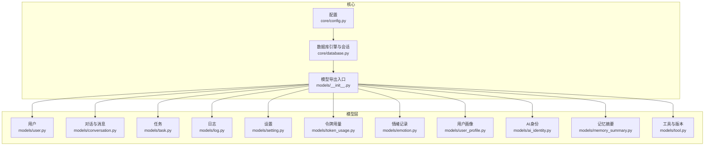
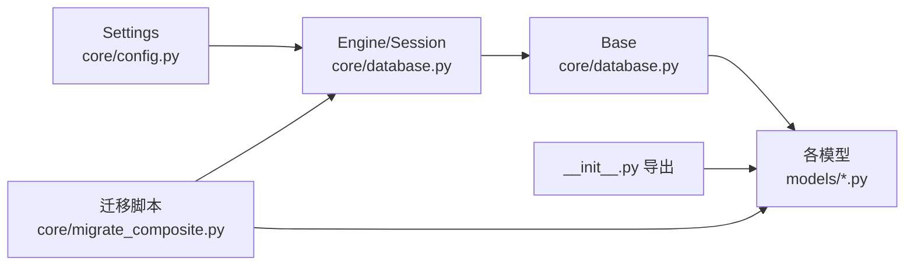

# 数据模型设计

<cite>
**本文引用的文件**
- [backend/app/models/__init__.py](file://backend/app/models/__init__.py)
- [backend/app/core/database.py](file://backend/app/core/database.py)
- [backend/app/core/config.py](file://backend/app/core/config.py)
- [backend/app/core/migrate_composite.py](file://backend/app/core/migrate_composite.py)
- [backend/app/models/user.py](file://backend/app/models/user.py)
- [backend/app/models/conversation.py](file://backend/app/models/conversation.py)
- [backend/app/models/task.py](file://backend/app/models/task.py)
- [backend/app/models/tool.py](file://backend/app/models/tool.py)
- [backend/app/models/log.py](file://backend/app/models/log.py)
- [backend/app/models/setting.py](file://backend/app/models/setting.py)
- [backend/app/models/token_usage.py](file://backend/app/models/token_usage.py)
- [backend/app/models/emotion.py](file://backend/app/models/emotion.py)
- [backend/app/models/user_profile.py](file://backend/app/models/user_profile.py)
- [backend/app/models/ai_identity.py](file://backend/app/models/ai_identity.py)
- [backend/app/models/memory_summary.py](file://backend/app/models/memory_summary.py)
</cite>

## 目录
1. [简介](#简介)
2. [项目结构](#项目结构)
3. [核心组件](#核心组件)
4. [架构总览](#架构总览)
5. [详细组件分析](#详细组件分析)
6. [依赖分析](#依赖分析)
7. [性能考量](#性能考量)
8. [故障排查指南](#故障排查指南)
9. [结论](#结论)
10. [附录](#附录)

## 简介
本指南聚焦于 XuanJi 后端 SQLAlchemy ORM 数据模型设计，系统阐述模型定义、字段类型选择、关系映射策略、主键与外键设计、索引优化、模型继承与抽象基类、模型验证规则、数据迁移与版本兼容、性能优化技巧，并结合实际模型给出最佳实践与案例分析。读者无需深入 SQL 或 ORM 源码即可理解并应用这些设计原则。

## 项目结构
后端采用按功能域分层的组织方式：models 定义 ORM 模型，core 提供数据库连接与初始化、迁移脚本，其余目录承载 API、服务、工具等业务层。数据模型通过统一的 DeclarativeBase 基类进行声明式建模，所有模型在 models/__init__.py 中集中导出，便于上层按需导入。



图表来源
- [backend/app/core/config.py:48-62](file://backend/app/core/config.py#L48-L62)
- [backend/app/core/database.py:1-39](file://backend/app/core/database.py#L1-L39)
- [backend/app/models/__init__.py:1-19](file://backend/app/models/__init__.py#L1-L19)

章节来源
- [backend/app/models/__init__.py:1-19](file://backend/app/models/__init__.py#L1-L19)
- [backend/app/core/database.py:1-39](file://backend/app/core/database.py#L1-L39)
- [backend/app/core/config.py:48-62](file://backend/app/core/config.py#L48-L62)

## 核心组件
- 统一基类与会话管理：通过 DeclarativeBase 定义 Base 类，使用 sessionmaker 创建 SessionLocal，并提供 get_db 依赖注入；init_db 负责数据库存在性检查、表创建与自动列补齐。
- 配置驱动：Settings 提供数据库连接串拼装，支持运行时环境变量覆盖。
- 模型聚合：models/__init__.py 将所有模型集中导出，便于 API 层统一引用。

章节来源
- [backend/app/core/database.py:10-19](file://backend/app/core/database.py#L10-L19)
- [backend/app/core/database.py:22-39](file://backend/app/core/database.py#L22-L39)
- [backend/app/core/config.py:48-62](file://backend/app/core/config.py#L48-L62)
- [backend/app/models/__init__.py:13-18](file://backend/app/models/__init__.py#L13-L18)

## 架构总览
下图展示模型间的主要关系与约束，体现一对一、一对多、多对多（通过中间表）以及软删除字段的设计意图。

```mermaid
erDiagram
USERS {
bigint id PK
varchar username UK
varchar email UK
varchar hashed_password
datetime created_at
datetime updated_at
datetime deleted_at
}
CONVERSATIONS {
bigint id PK
bigint user_id FK
varchar title
boolean is_active
int message_count
datetime created_at
datetime updated_at
}
MESSAGES {
bigint id PK
bigint conversation_id FK
bigint user_id FK
varchar role
text content
text metadata
text emotion_snapshot
boolean is_summarized
datetime created_at
}
TASKS {
bigint id PK
bigint user_id FK
varchar title
text description
varchar status
text result
datetime created_at
datetime updated_at
}
LOGS {
bigint id PK
bigint task_id FK
bigint tool_id FK
varchar level
varchar message
json details
bigint user_id FK
varchar source
int status_code
datetime created_at
}
USER_SETTINGS {
bigint id PK
bigint user_id FK UK
varchar llm_provider
varchar llm_api_key
varchar llm_api_base_url
varchar llm_model_name
varchar ollama_base_url
varchar ollama_model
varchar tool_llm_provider
varchar tool_llm_api_key
varchar tool_llm_api_base_url
varchar tool_llm_model_name
varchar tool_ollama_base_url
varchar tool_ollama_model
varchar intent_llm_provider
varchar intent_llm_api_key
varchar intent_llm_api_base_url
varchar intent_llm_model_name
varchar emotion_llm_provider
varchar emotion_llm_api_key
varchar emotion_llm_api_base_url
varchar emotion_llm_model_name
varchar format_llm_provider
varchar format_llm_api_key
varchar format_llm_api_base_url
varchar format_llm_model_name
boolean show_tool_result
boolean show_collaboration
int token_monthly_budget
datetime created_at
datetime updated_at
}
TOKEN_USAGES {
bigint id PK
bigint user_id FK
int prompt_tokens
int completion_tokens
int total_tokens
varchar model
varchar role_name
datetime created_at
}
EMOTION_RECORDS {
bigint id PK
bigint user_id FK
bigint message_id FK
bigint conversation_id FK
varchar primary_emotion
varchar emotion_intensity
varchar deep_need
varchar risk_level
text interaction_recommendation
text full_analysis
datetime created_at
}
USER_PROFILES {
bigint id PK
bigint user_id FK UK
text personality_traits
varchar attachment_style
text core_needs
text emotional_baseline
text trigger_topics
text safe_topics
text interests
text summary_text
int version
datetime created_at
datetime updated_at
}
AI_IDENTITIES {
bigint id PK
bigint user_id FK
varchar ai_name
text persona_text
varchar gender
text appearance
text personality
text speaking_style
text values
text emotional_state
text evolution_log
boolean is_base_locked
int version
datetime created_at
datetime updated_at
}
MEMORY_SUMMARIES {
bigint id PK
bigint user_id FK
varchar period_type
datetime period_start
datetime period_end
text summary_text
text key_emotions
text key_topics
text important_events
int source_message_count
text source_summary_ids
datetime created_at
}
TOOLS {
bigint id PK
varchar name UK
text description
text description_zh
text code
varchar language
int version
varchar tool_type
boolean is_builtin
bigint created_by FK
datetime created_at
datetime updated_at
}
TOOL_COMPOSITIONS {
bigint id PK
bigint composite_tool_id FK
bigint sub_tool_id FK
int step_order
json input_mapping
varchar output_key
}
TOOL_VERSIONS {
bigint id PK
bigint tool_id FK
int version
text code
text description
text description_zh
json pipeline_snapshot
text change_summary
datetime created_at
bigint created_by FK
}
USERS ||--o{ CONVERSATIONS : "拥有"
USERS ||--o{ MESSAGES : "发送"
USERS ||--o{ TASKS : "执行"
USERS ||--o{ LOGS : "操作"
USERS ||--o{ TOKEN_USAGES : "用量"
USERS ||--o{ EMOTION_RECORDS : "记录"
USERS ||--o{ USER_PROFILES : "画像"
USERS ||--o{ AI_IDENTITIES : "身份"
USERS ||--o{ TOOLS : "创建"
CONVERSATIONS ||--o{ MESSAGES : "包含"
MESSAGES ||--|| EMOTION_RECORDS : "关联"
CONVERSATIONS ||--|| EMOTION_RECORDS : "关联"
TOOLS ||--o{ TOOL_COMPOSITIONS : "组合"
TOOLS ||--o{ TOOL_VERSIONS : "版本化"
```

图表来源
- [backend/app/models/user.py:9-23](file://backend/app/models/user.py#L9-L23)
- [backend/app/models/conversation.py:9-41](file://backend/app/models/conversation.py#L9-L41)
- [backend/app/models/task.py:9-28](file://backend/app/models/task.py#L9-L28)
- [backend/app/models/log.py:9-30](file://backend/app/models/log.py#L9-L30)
- [backend/app/models/setting.py:9-60](file://backend/app/models/setting.py#L9-L60)
- [backend/app/models/token_usage.py:9-24](file://backend/app/models/token_usage.py#L9-L24)
- [backend/app/models/emotion.py:9-29](file://backend/app/models/emotion.py#L9-L29)
- [backend/app/models/user_profile.py:9-29](file://backend/app/models/user_profile.py#L9-L29)
- [backend/app/models/ai_identity.py:9-38](file://backend/app/models/ai_identity.py#L9-L38)
- [backend/app/models/memory_summary.py:9-26](file://backend/app/models/memory_summary.py#L9-L26)
- [backend/app/models/tool.py:9-64](file://backend/app/models/tool.py#L9-L64)

## 详细组件分析

### 用户模型 User
- 主键与自增：BigInteger 主键，autoincrement=True。
- 唯一索引：username、email 均设为唯一且建立索引，保障查询效率与一致性。
- 时间戳：created_at 使用 server_default，updated_at 使用 server_default + onupdate。
- 软删除：提供 deleted_at 字段，便于逻辑删除场景。
- 关系映射：被多个子表作为外键引用（如 conversations、tasks、logs 等）。

章节来源
- [backend/app/models/user.py:9-23](file://backend/app/models/user.py#L9-L23)

### 对话与消息模型 Conversation 与 Message
- 外键约束：conversation.user_id 引用 users.id，ondelete=CASCADE；message 的 conversation_id、user_id 同样设置 CASCADE，保证级联删除。
- 索引策略：外键字段均建立索引，提升 JOIN 与过滤性能。
- 元数据存储：message 的 metadata_json 以 Text 存储字典结构，便于扩展。
- 摘要标记：is_summarized 字段用于控制是否已生成摘要，避免重复计算。
- 时间戳：统一使用 server_default 与 onupdate。

章节来源
- [backend/app/models/conversation.py:9-41](file://backend/app/models/conversation.py#L9-L41)

### 任务模型 Task
- 状态字段：status 设为 String(20)，默认值与 server_default 均为 "completed"，并建立索引，便于按状态筛选。
- 外键：user_id 引用 users.id，CASCADE 删除。
- 时间戳：created_at、updated_at。

章节来源
- [backend/app/models/task.py:9-28](file://backend/app/models/task.py#L9-L28)

### 工具与版本模型 Tool、ToolComposition、ToolVersion
- 工具表：name 唯一且索引；language 默认 "python"；version 默认 1；tool_type 默认 "atomic"；is_builtin 默认 False；created_by 外键引用 users.id，ondelete=SET NULL。
- 组合关系：ToolComposition 记录复合工具的步骤顺序、输入映射与输出键，sub_tool_id 设置 RESTRICT，防止误删仍在使用的子工具。
- 版本快照：ToolVersion 记录每次变更的代码、描述、JSON 快照与变更摘要，created_by 可为空（匿名变更），并回指 users 表。
- 迁移脚本：migrate_composite 脚本负责添加列、创建表、插入初始版本快照等，具备幂等性。

章节来源
- [backend/app/models/tool.py:9-64](file://backend/app/models/tool.py#L9-L64)
- [backend/app/core/migrate_composite.py:33-146](file://backend/app/core/migrate_composite.py#L33-L146)

### 日志模型 Log
- 多外键：task_id、tool_id、user_id 可空，分别指向 tasks、tools、users，部分采用 SET NULL 或 CASCADE 删除策略。
- 结构化详情：details 使用 JSON 字段存储结构化上下文。
- 来源与状态：source、status_code 字段便于审计与问题定位。
- 索引：task_id、tool_id、user_id 建有索引，提高过滤效率。

章节来源
- [backend/app/models/log.py:9-30](file://backend/app/models/log.py#L9-L30)

### 用户设置模型 UserSetting
- 分层配置：按不同 AI 模块（聊天、工具生成、意图识别、情绪、格式化）拆分配置字段，便于独立启用/禁用与降级。
- 可空字段：允许部分配置缺失，自动回退到聊天 AI 配置。
- 偏好设置：show_tool_result、show_collaboration 控制前端行为。
- 月度预算：token_monthly_budget 支持成本控制。
- 时间戳：created_at、updated_at。

章节来源
- [backend/app/models/setting.py:9-60](file://backend/app/models/setting.py#L9-L60)

### 令牌用量模型 TokenUsage
- 维度：按用户、模型、角色统计 prompt/completion/total tokens。
- 新增字段：role_name 字段用于区分不同角色的用量，由迁移脚本补充。

章节来源
- [backend/app/models/token_usage.py:9-24](file://backend/app/models/token_usage.py#L9-L24)

### 情绪记录模型 EmotionRecord
- 关联维度：可选关联 message 与 conversation，便于从对话粒度分析情绪。
- 字段设计：primary_emotion、emotion_intensity、deep_need、risk_level、interaction_recommendation、full_analysis 等，满足情绪分析与建议生成。
- 外键策略：message_id、conversation_id 设置 SET NULL，避免硬删除影响历史分析。

章节来源
- [backend/app/models/emotion.py:9-29](file://backend/app/models/emotion.py#L9-L29)

### 用户画像模型 UserProfile
- 唯一键：user_id 唯一且索引，确保每个用户仅有一份画像。
- 特征字段：个性、依恋风格、核心需求、情感基线、触发/安全话题、兴趣、总结文本等。
- 版本号：version 字段支持画像演进追踪。
- 时间戳：created_at、updated_at。

章节来源
- [backend/app/models/user_profile.py:9-29](file://backend/app/models/user_profile.py#L9-L29)

### AI 身份模型 AIIdentity
- 唯一约束：user_id 与 ai_name 组成唯一索引，限制同一用户对同名 AI 的多重实例。
- 人设与演化：persona_text、gender、appearance、personality、speaking_style、values 等构成完整人设；emotional_state、evolution_log 记录演化轨迹。
- 锁定机制：is_base_locked 防止基础人设被随意修改。
- 版本：version 字段支持迭代。

章节来源
- [backend/app/models/ai_identity.py:9-38](file://backend/app/models/ai_identity.py#L9-L38)

### 记忆摘要模型 MemorySummary
- 时间窗口：period_type、period_start、period_end 定义摘要的时间范围（日/周/月/年）。
- 结构化摘要：summary_text、key_emotions、key_topics、important_events 以 JSON 文本存储，便于后续检索与可视化。
- 溯源字段：source_message_count、source_summary_ids 支持摘要溯源与去重。

章节来源
- [backend/app/models/memory_summary.py:9-26](file://backend/app/models/memory_summary.py#L9-L26)

### 模型继承与抽象基类
- 当前模型未显式使用抽象基类或继承模式；若需共享通用字段（如时间戳、软删除），可在 Base 上扩展公共列并在子类中复用，减少重复定义与维护成本。

章节来源
- [backend/app/core/database.py:10-11](file://backend/app/core/database.py#L10-L11)

### 字段类型与验证规则
- 字符串长度：用户名/邮箱/标题等字段使用 String(N) 并配合唯一与索引，兼顾性能与语义约束。
- JSON 字段：metadata、pipeline_snapshot、details 等使用 JSON/Text，满足动态结构存储；建议在服务层进行序列化校验。
- 枚举化字符串：role、status、tool_type、period_type 等使用固定取值集合，建议在服务层统一校验。
- 可空与默认值：大量字段提供 nullable 与 default/server_default，确保数据完整性与默认行为一致。

章节来源
- [backend/app/models/conversation.py:35-36](file://backend/app/models/conversation.py#L35-L36)
- [backend/app/models/task.py:18-19](file://backend/app/models/task.py#L18-L19)
- [backend/app/models/tool.py:17-19](file://backend/app/models/tool.py#L17-L19)
- [backend/app/models/memory_summary.py:16](file://backend/app/models/memory_summary.py#L16)

### 关系映射策略
- 一对一：User 与 UserProfile、UserSetting 通过 user_id 唯一键关联。
- 一对多：User 与 Conversation/Task/Message/Log/TokenUsage 等。
- 多对多：通过中间表 ToolComposition 实现复合工具的步骤编排。
- 级联策略：根据业务需要选择 CASCADE/SET NULL/RESTRICT，确保数据一致性与可维护性。

章节来源
- [backend/app/models/user_profile.py:14](file://backend/app/models/user_profile.py#L14)
- [backend/app/models/setting.py:14](file://backend/app/models/setting.py#L14)
- [backend/app/models/conversation.py:13-14](file://backend/app/models/conversation.py#L13-L14)
- [backend/app/models/tool.py:36-41](file://backend/app/models/tool.py#L36-L41)

### 主键设计与外键约束
- 主键：统一使用 BigInteger + autoincrement=True，适配大体量数据与分布式部署。
- 外键：严格引用 users.id，并在必要处设置 ondelete（CASCADE/SET NULL/RESTRICT）。
- 唯一约束：如 user_id+ai_name 的唯一索引，避免重复定义。

章节来源
- [backend/app/models/user.py:12](file://backend/app/models/user.py#L12)
- [backend/app/models/ai_identity.py:11-13](file://backend/app/models/ai_identity.py#L11-L13)
- [backend/app/models/conversation.py:13-14](file://backend/app/models/conversation.py#L13-L14)

### 索引优化
- 外键字段普遍建立索引，提升 JOIN 与过滤性能。
- 高选择性字段（如 username、email、tools.name）建立唯一索引，保障查询与去重效率。
- 状态字段（如 tasks.status）建立索引，便于按状态快速筛选。

章节来源
- [backend/app/models/user.py:13-14](file://backend/app/models/user.py#L13-L14)
- [backend/app/models/tool.py:13](file://backend/app/models/tool.py#L13)
- [backend/app/models/task.py:19](file://backend/app/models/task.py#L19)

### 数据迁移策略与版本兼容
- 自动补齐列：init_db 内部调用 _auto_add_missing_columns，扫描模型定义与现有表结构差异，自动执行 ALTER TABLE 添加缺失列，保持模型与数据库同步。
- 幂等迁移：migrate_composite 脚本检查表/列是否存在后再执行 DDL，支持重复运行而不破坏现有数据。
- 初始快照：为已有工具生成 v1 版本快照，确保版本化能力可用。
- 向后兼容：新增列默认值与注释，避免破坏既有业务逻辑。

章节来源
- [backend/app/core/database.py:44-65](file://backend/app/core/database.py#L44-L65)
- [backend/app/core/migrate_composite.py:33-146](file://backend/app/core/migrate_composite.py#L33-L146)

### 性能优化技巧
- 选择合适的数据类型：长文本使用 Text/JSON，短文本使用 String(N)，避免过度占用空间。
- 合理索引：在外键、过滤与排序常用字段上建立索引；避免冗余索引导致写入开销增加。
- 查询路径：优先使用复合条件与索引字段组合，减少全表扫描。
- 批量写入：在批量导入/更新时使用事务，降低锁竞争与日志开销。
- 缓存策略：对热点读取（如用户设置、工具描述）引入缓存层，减轻数据库压力。

## 依赖分析
- 模型依赖：所有模型依赖统一的 Base；部分模型之间存在外键依赖（如 conversations.messages.users）。
- 初始化依赖：init_db 依赖 settings.database_url 与 models 导入，确保表结构与数据一致。
- 迁移依赖：migrate_composite 依赖 engine 与 inspect，按需执行 DDL。



图表来源
- [backend/app/core/config.py:48-62](file://backend/app/core/config.py#L48-L62)
- [backend/app/core/database.py:1-39](file://backend/app/core/database.py#L1-L39)
- [backend/app/models/__init__.py:1-19](file://backend/app/models/__init__.py#L1-L19)
- [backend/app/core/migrate_composite.py:17-19](file://backend/app/core/migrate_composite.py#L17-L19)

章节来源
- [backend/app/core/config.py:48-62](file://backend/app/core/config.py#L48-L62)
- [backend/app/core/database.py:1-39](file://backend/app/core/database.py#L1-L39)
- [backend/app/models/__init__.py:1-19](file://backend/app/models/__init__.py#L1-L19)
- [backend/app/core/migrate_composite.py:17-19](file://backend/app/core/migrate_composite.py#L17-L19)

## 性能考量
- 写入性能：合理设置默认值与 server_default，减少应用层计算；批量写入时合并事务。
- 读取性能：为高频过滤字段建立索引；避免在 Text/JSON 字段上进行复杂函数运算。
- 存储成本：长文本字段使用 Text/JSON，避免过大的 String(N)；定期清理软删除与历史快照。
- 连接池：生产环境建议配置连接池参数，避免频繁创建/销毁连接。

## 故障排查指南
- 表不存在或列缺失：init_db 的自动补齐逻辑会尝试添加缺失列；若失败，检查权限与字符集设置。
- 迁移冲突：migrate_composite 为幂等脚本，重复执行不会破坏数据；若出现异常，查看具体 DDL 执行结果。
- 外键约束错误：确认外键引用的表与字段存在，ondelete 策略符合业务预期。
- 字段类型不匹配：JSON/Text 字段在不同方言下表现可能不同，建议在服务层做序列化/反序列化校验。

章节来源
- [backend/app/core/database.py:44-65](file://backend/app/core/database.py#L44-L65)
- [backend/app/core/migrate_composite.py:33-146](file://backend/app/core/migrate_composite.py#L33-L146)

## 结论
XuanJi 的数据模型遵循清晰的分层与约束设计：统一的 DeclarativeBase 基类、明确的主外键关系、合理的索引策略与自动迁移机制，共同保障了系统的可维护性与扩展性。通过在服务层补充字段校验与业务规则，可进一步提升数据质量与用户体验。

## 附录
- 最佳实践清单
  - 明确字段语义与长度，必要时使用枚举化字符串。
  - 为高频查询字段建立索引，避免冗余索引。
  - 使用 server_default/onupdate 统一时间戳管理。
  - 对 JSON/Text 字段在服务层进行结构校验。
  - 在批量写入时使用事务，减少锁竞争。
  - 使用幂等迁移脚本，支持重复执行与向后兼容。
  - 对软删除字段提供逻辑隔离与审计能力。