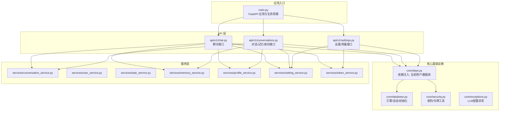
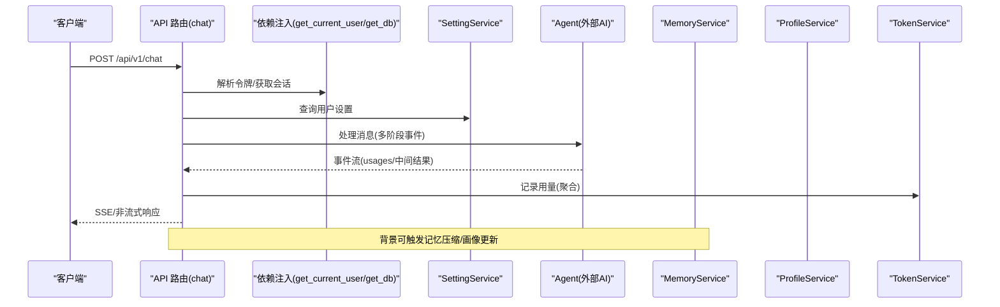
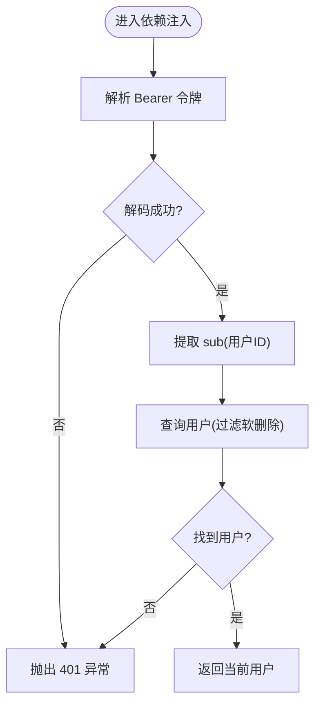
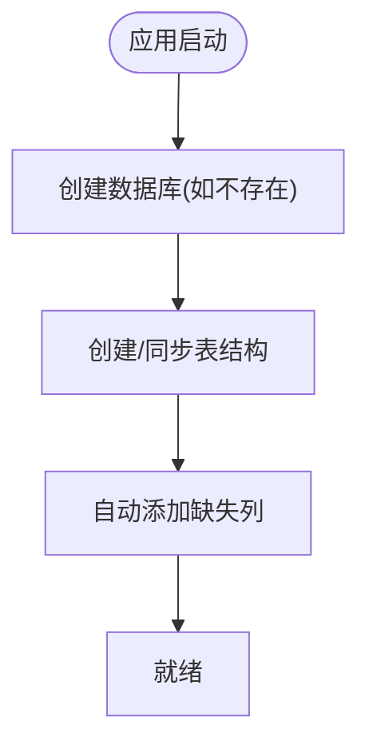
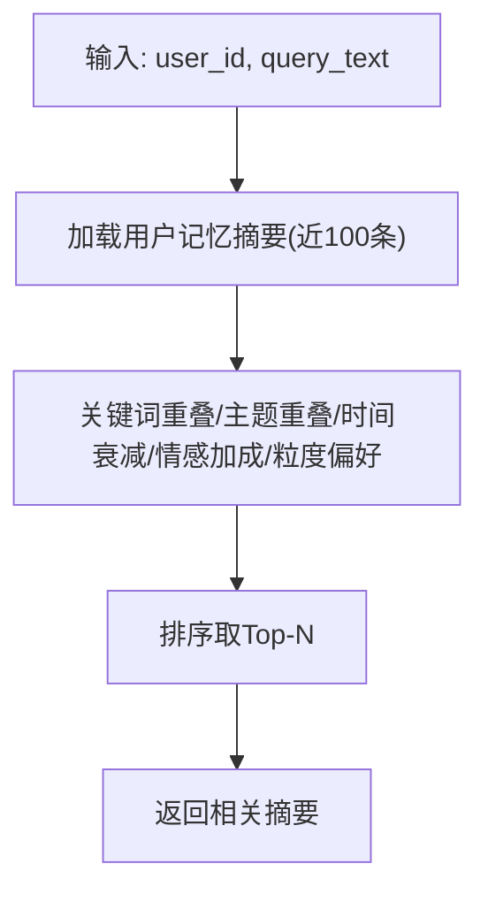
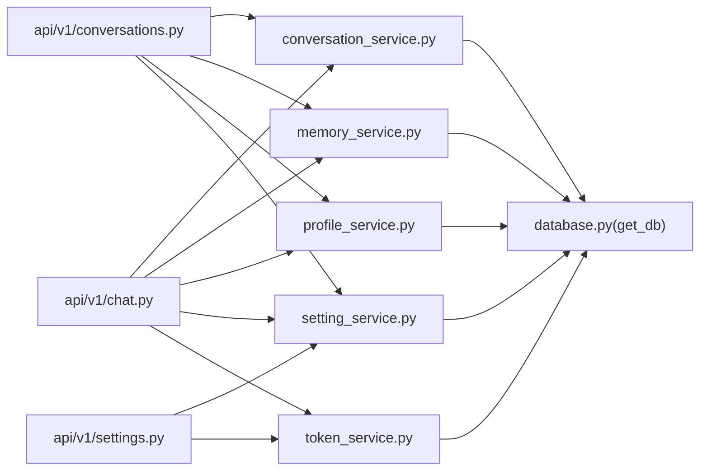

# 服务层架构

<cite>
**本文引用的文件**
- [backend/app/main.py](file://backend/app/main.py)
- [backend/app/core/deps.py](file://backend/app/core/deps.py)
- [backend/app/core/database.py](file://backend/app/core/database.py)
- [backend/app/core/security.py](file://backend/app/core/security.py)
- [backend/app/core/exceptions.py](file://backend/app/core/exceptions.py)
- [backend/app/api/v1/chat.py](file://backend/app/api/v1/chat.py)
- [backend/app/api/v1/conversations.py](file://backend/app/api/v1/conversations.py)
- [backend/app/api/v1/settings.py](file://backend/app/api/v1/settings.py)
- [backend/app/services/conversation_service.py](file://backend/app/services/conversation_service.py)
- [backend/app/services/user_service.py](file://backend/app/services/user_service.py)
- [backend/app/services/task_service.py](file://backend/app/services/task_service.py)
- [backend/app/services/memory_service.py](file://backend/app/services/memory_service.py)
- [backend/app/services/profile_service.py](file://backend/app/services/profile_service.py)
- [backend/app/services/setting_service.py](file://backend/app/services/setting_service.py)
- [backend/app/services/token_service.py](file://backend/app/services/token_service.py)
</cite>

## 目录
1. [引言](#引言)
2. [项目结构](#项目结构)
3. [核心组件](#核心组件)
4. [架构总览](#架构总览)
5. [详细组件分析](#详细组件分析)
6. [依赖分析](#依赖分析)
7. [性能考虑](#性能考虑)
8. [故障排查指南](#故障排查指南)
9. [结论](#结论)
10. [附录](#附录)

## 引言
本文件系统性梳理 XuanJi 后端服务层的架构与实现，聚焦服务层设计原则、业务逻辑封装策略、事务管理机制、服务间依赖关系与依赖注入使用、异常处理模式、缓存策略与数据访问优化、并发控制机制、测试策略、监控指标与性能调优方法，并给出最佳实践与重构建议。目标是帮助开发者在理解现有实现的基础上，进行稳健扩展与演进。

## 项目结构
后端采用 FastAPI 应用，服务层位于 app/services，围绕领域模型与业务能力进行分层封装；API 层通过依赖注入获取数据库会话与当前用户，再委派给具体服务类执行业务逻辑；核心基础设施包括数据库连接池、认证令牌解析、异常类型等。

图表来源
- [backend/app/main.py:1-79](file://backend/app/main.py#L1-L79)
- [backend/app/core/database.py:1-65](file://backend/app/core/database.py#L1-L65)
- [backend/app/core/security.py:1-38](file://backend/app/core/security.py#L1-L38)
- [backend/app/core/deps.py:1-42](file://backend/app/core/deps.py#L1-L42)
- [backend/app/api/v1/chat.py:1-106](file://backend/app/api/v1/chat.py#L1-L106)
- [backend/app/api/v1/conversations.py:1-187](file://backend/app/api/v1/conversations.py#L1-L187)
- [backend/app/api/v1/settings.py:1-55](file://backend/app/api/v1/settings.py#L1-L55)
- [backend/app/services/conversation_service.py:1-141](file://backend/app/services/conversation_service.py#L1-L141)
- [backend/app/services/user_service.py:1-46](file://backend/app/services/user_service.py#L1-L46)
- [backend/app/services/task_service.py:1-43](file://backend/app/services/task_service.py#L1-L43)
- [backend/app/services/memory_service.py:1-389](file://backend/app/services/memory_service.py#L1-L389)
- [backend/app/services/profile_service.py:1-348](file://backend/app/services/profile_service.py#L1-L348)
- [backend/app/services/setting_service.py:1-42](file://backend/app/services/setting_service.py#L1-L42)
- [backend/app/services/token_service.py:1-183](file://backend/app/services/token_service.py#L1-L183)

章节来源
- [backend/app/main.py:1-79](file://backend/app/main.py#L1-L79)
- [backend/app/core/database.py:1-65](file://backend/app/core/database.py#L1-L65)

## 核心组件
- 数据库与会话管理：通过 SQLAlchemy 创建引擎与会话工厂，提供 get_db 依赖，确保每个请求拥有独立且自动关闭的会话。
- 认证与授权：基于 Bearer Token 的依赖注入，解码 JWT 获取用户标识，查询用户并校验有效性。
- 服务层封装：围绕领域模型（对话、记忆、画像、设置、用量等）构建服务类，统一事务边界与业务规则。
- 异常体系：定义 LLM 配置缺失异常，便于在 AI 相关流程中进行显式错误传播与降级处理。
- API 层编排：路由层负责参数校验、流式/非流式响应、令牌用量记录与错误日志。

章节来源
- [backend/app/core/database.py:1-65](file://backend/app/core/database.py#L1-L65)
- [backend/app/core/deps.py:1-42](file://backend/app/core/deps.py#L1-L42)
- [backend/app/core/security.py:1-38](file://backend/app/core/security.py#L1-L38)
- [backend/app/core/exceptions.py:1-20](file://backend/app/core/exceptions.py#L1-L20)
- [backend/app/api/v1/chat.py:1-106](file://backend/app/api/v1/chat.py#L1-L106)

## 架构总览
服务层遵循“按职责分层、按领域建模”的原则，API 层只做编排与协议适配，业务逻辑集中在服务层；服务层内部通过依赖注入获得数据库会话，保证事务一致性；对外通过异常类型与返回结构传达状态与错误信息。

图表来源
- [backend/app/api/v1/chat.py:40-106](file://backend/app/api/v1/chat.py#L40-L106)
- [backend/app/services/setting_service.py:1-42](file://backend/app/services/setting_service.py#L1-L42)
- [backend/app/services/token_service.py:1-183](file://backend/app/services/token_service.py#L1-L183)
- [backend/app/services/memory_service.py:1-389](file://backend/app/services/memory_service.py#L1-L389)
- [backend/app/services/profile_service.py:1-348](file://backend/app/services/profile_service.py#L1-L348)

## 详细组件分析

### 依赖注入与认证
- 令牌解析：从 Authorization 头中提取 Bearer 令牌，使用密钥与算法进行解码，提取 sub 作为用户 ID。
- 用户查询：根据 ID 查询用户，过滤软删除标记，不存在则抛出 401。
- 数据库会话：通过依赖注入提供 Session，确保每个请求独立会话并在 finally 中关闭。

图表来源
- [backend/app/core/deps.py:12-42](file://backend/app/core/deps.py#L12-L42)
- [backend/app/core/security.py:33-38](file://backend/app/core/security.py#L33-L38)

章节来源
- [backend/app/core/deps.py:1-42](file://backend/app/core/deps.py#L1-L42)
- [backend/app/core/security.py:1-38](file://backend/app/core/security.py#L1-L38)

### 数据库与会话管理
- 引擎与连接池：启用 pre_ping，提升连接可用性。
- 表创建与迁移：初始化时自动创建数据库与表，并对缺失列进行自动迁移。
- 会话生命周期：每次请求创建新会话，try/finally 确保关闭。

图表来源
- [backend/app/core/database.py:22-65](file://backend/app/core/database.py#L22-L65)

章节来源
- [backend/app/core/database.py:1-65](file://backend/app/core/database.py#L1-L65)

### 服务层设计原则与事务管理
- 单一职责：每个服务类专注一个业务域，方法粒度清晰。
- 事务边界：服务方法内进行增删改查操作，commit/refresh 控制事务提交与对象刷新。
- 读写分离：查询与更新分离，必要时使用批量更新减少往返。
- 异常隔离：在服务层捕获与转换异常，向上抛出明确错误或返回 None/默认值。

章节来源
- [backend/app/services/conversation_service.py:1-141](file://backend/app/services/conversation_service.py#L1-L141)
- [backend/app/services/user_service.py:1-46](file://backend/app/services/user_service.py#L1-L46)
- [backend/app/services/task_service.py:1-43](file://backend/app/services/task_service.py#L1-L43)
- [backend/app/services/memory_service.py:1-389](file://backend/app/services/memory_service.py#L1-L389)
- [backend/app/services/profile_service.py:1-348](file://backend/app/services/profile_service.py#L1-L348)
- [backend/app/services/setting_service.py:1-42](file://backend/app/services/setting_service.py#L1-L42)
- [backend/app/services/token_service.py:1-183](file://backend/app/services/token_service.py#L1-L183)

### 对话服务（ConversationService）
- 功能要点：活动对话获取/创建、历史对话分页、消息增删改查、最近消息检索、批量标记摘要、会话更新。
- 事务策略：每个写操作独立 commit/refresh，保证一致性。
- 性能注意：分页 offset/limit、倒序查询、条件过滤，避免全表扫描。

章节来源
- [backend/app/services/conversation_service.py:1-141](file://backend/app/services/conversation_service.py#L1-L141)

### 记忆服务（MemoryService）
- 功能要点：关键词+时间衰减+情感权重的检索打分、日/周/月/年多粒度压缩、短临记忆回退、LLM 结构化输出解析、Token 记录。
- 并发与异步：压缩过程为异步，适合后台任务调度；压缩前统计消息数阈值控制。
- 异常处理：LLM 配置缺失时记录警告并跳过，其他异常返回 None，避免阻断主流程。
- 依赖注入：在压缩过程中构造 TokenService 记录用量。

图表来源
- [backend/app/services/memory_service.py:45-104](file://backend/app/services/memory_service.py#L45-L104)

章节来源
- [backend/app/services/memory_service.py:1-389](file://backend/app/services/memory_service.py#L1-L389)

### 画像服务（ProfileService）
- 功能要点：增量更新核心需求/触发/安全话题/性格特征/情绪基线，依恋风格推断，定期生成自然语言摘要，从对话中抽取个人信息。
- 数据结构：JSON 字段存储列表/字典，提供解析与安全加载辅助方法。
- 异常处理：LLM 未配置或调用失败时记录调试/警告日志并回滚，保证数据一致性。

章节来源
- [backend/app/services/profile_service.py:1-348](file://backend/app/services/profile_service.py#L1-L348)

### 设置服务（SettingService）
- 功能要点：用户设置的读取与 upsert，掩码密钥保护（避免覆盖真实密钥），排除未设置字段。
- 设计要点：使用 exclude_unset 控制更新范围，保持默认值稳定。

章节来源
- [backend/app/services/setting_service.py:1-42](file://backend/app/services/setting_service.py#L1-L42)

### 令牌用量服务（TokenService）
- 功能要点：记录单次调用用量、汇总当日/当月/总计用量、预算检查、按角色/模型/日期聚合统计。
- 与记忆/画像服务协作：在 LLM 压缩与摘要生成后记录用量，支持成本控制与审计。

章节来源
- [backend/app/services/token_service.py:1-183](file://backend/app/services/token_service.py#L1-L183)

### API 层编排（聊天/对话/设置）
- 聊天接口：支持流式与非流式两种模式，聚合事件中的用量并记录；断连检测与异常捕获。
- 对话接口：分页列出对话、创建新对话、查询最近消息、按会话拉取消息、情绪与记忆检索、身份管理。
- 设置接口：读取/更新用户设置，查询 Token 使用汇总。

章节来源
- [backend/app/api/v1/chat.py:1-106](file://backend/app/api/v1/chat.py#L1-L106)
- [backend/app/api/v1/conversations.py:1-187](file://backend/app/api/v1/conversations.py#L1-L187)
- [backend/app/api/v1/settings.py:1-55](file://backend/app/api/v1/settings.py#L1-L55)

## 依赖分析
- 组件耦合：API 层依赖服务层；服务层依赖数据库会话；部分服务依赖 TokenService；记忆/画像服务依赖 AI 工厂与 LLM 客户端。
- 依赖注入：通过 FastAPI Depends 注入 get_current_user 与 get_db，形成清晰的依赖链。
- 循环依赖：当前结构未见循环导入；服务间通过方法调用而非直接 import 形成弱耦合。
- 外部依赖：AI 模型客户端、数据库、令牌算法。

图表来源
- [backend/app/api/v1/chat.py:1-106](file://backend/app/api/v1/chat.py#L1-L106)
- [backend/app/api/v1/conversations.py:1-187](file://backend/app/api/v1/conversations.py#L1-L187)
- [backend/app/api/v1/settings.py:1-55](file://backend/app/api/v1/settings.py#L1-L55)
- [backend/app/services/conversation_service.py:1-141](file://backend/app/services/conversation_service.py#L1-L141)
- [backend/app/services/memory_service.py:1-389](file://backend/app/services/memory_service.py#L1-L389)
- [backend/app/services/profile_service.py:1-348](file://backend/app/services/profile_service.py#L1-L348)
- [backend/app/services/setting_service.py:1-42](file://backend/app/services/setting_service.py#L1-L42)
- [backend/app/services/token_service.py:1-183](file://backend/app/services/token_service.py#L1-L183)
- [backend/app/core/database.py:14-19](file://backend/app/core/database.py#L14-L19)

章节来源
- [backend/app/api/v1/chat.py:1-106](file://backend/app/api/v1/chat.py#L1-L106)
- [backend/app/api/v1/conversations.py:1-187](file://backend/app/api/v1/conversations.py#L1-L187)
- [backend/app/api/v1/settings.py:1-55](file://backend/app/api/v1/settings.py#L1-L55)
- [backend/app/services/conversation_service.py:1-141](file://backend/app/services/conversation_service.py#L1-L141)
- [backend/app/services/memory_service.py:1-389](file://backend/app/services/memory_service.py#L1-L389)
- [backend/app/services/profile_service.py:1-348](file://backend/app/services/profile_service.py#L1-L348)
- [backend/app/services/setting_service.py:1-42](file://backend/app/services/setting_service.py#L1-L42)
- [backend/app/services/token_service.py:1-183](file://backend/app/services/token_service.py#L1-L183)
- [backend/app/core/database.py:1-65](file://backend/app/core/database.py#L1-L65)

## 性能考虑
- 数据库访问优化
  - 分页查询：对话与消息列表使用 offset/limit，避免一次性加载大量数据。
  - 条件索引：建议在 user_id、created_at、conversation_id 等常用过滤字段建立索引。
  - 批量更新：标记摘要完成使用批量 update，减少多次往返。
- 缓存策略
  - 短期命中热点：近期消息与活跃对话可引入进程内缓存（如 LRU），降低重复查询开销。
  - 记忆检索缓存：对“相关记忆”打分结果可按 query_text+user_id 缓存，设定合理 TTL。
  - 画像与设置：用户画像与设置读取频率高，可考虑 Redis 缓存，写时失效。
- 并发控制
  - 写操作串行化：同一用户的关键写操作（如创建对话、压缩记忆）应串行化，避免竞态。
  - 异步压缩：后台任务调度记忆压缩，避免阻塞主线程。
- 异步与流式
  - SSE 流式响应：前端断连检测与异常捕获，保障稳定性。
- 监控与告警
  - Token 用量：按角色/模型/日期聚合统计，设置预算阈值告警。
  - LLM 调用：记录 prompt/completion/total tokens 与模型名，便于成本分析。

章节来源
- [backend/app/services/conversation_service.py:43-52](file://backend/app/services/conversation_service.py#L43-L52)
- [backend/app/services/memory_service.py:123-129](file://backend/app/services/memory_service.py#L123-L129)
- [backend/app/services/token_service.py:92-183](file://backend/app/services/token_service.py#L92-L183)
- [backend/app/api/v1/chat.py:62-87](file://backend/app/api/v1/chat.py#L62-L87)

## 故障排查指南
- 认证失败
  - 现象：401 未授权。
  - 排查：确认令牌格式与签名有效、payload 含 sub、用户存在且未软删除。
- 参数校验失败
  - 现象：422 请求参数验证失败。
  - 排查：查看返回的中文错误提示，修正字段类型与约束。
- LLM 配置缺失
  - 现象：记忆压缩/画像摘要失败并记录警告。
  - 排查：检查用户设置中对应角色的 LLM 配置是否完整。
- 用量统计异常
  - 现象：用量汇总不正确或预算判断异常。
  - 排查：确认 TokenService 的记录插入与聚合查询逻辑，核对 UserSetting 的预算字段。

章节来源
- [backend/app/main.py:43-59](file://backend/app/main.py#L43-L59)
- [backend/app/core/deps.py:16-41](file://backend/app/core/deps.py#L16-L41)
- [backend/app/core/exceptions.py:1-20](file://backend/app/core/exceptions.py#L1-L20)
- [backend/app/services/token_service.py:37-82](file://backend/app/services/token_service.py#L37-L82)

## 结论
XuanJi 服务层以清晰的领域划分与依赖注入为核心，结合数据库会话与事务管理，实现了稳定的业务封装。通过 TokenService 实现用量可观测，MemoryService 与 ProfileService 提供记忆与画像能力，API 层以流式与非流式方式满足不同交互场景。建议后续在缓存、并发控制与监控方面进一步强化，以支撑更大规模的用户与更复杂的业务场景。

## 附录
- 服务层最佳实践
  - 事务边界明确：每个服务方法内完成原子操作，避免跨服务长事务。
  - 异常显式化：对可预期异常（如 LLM 配置缺失）抛出自定义异常，便于上层处理。
  - 依赖注入标准化：统一通过 Depends 获取用户与会话，减少重复代码。
  - 日志分级：区分 debug/info/warning/error，便于问题定位。
- 重构指南
  - 引入缓存：对高频读取的画像、设置、记忆检索结果增加缓存层。
  - 并发治理：对关键写操作引入分布式锁或队列化处理。
  - 监控增强：埋点 Token 用量、AI 调用耗时、错误率，接入指标面板。
  - 测试策略：为服务层编写单元测试与集成测试，覆盖正常路径与异常路径。