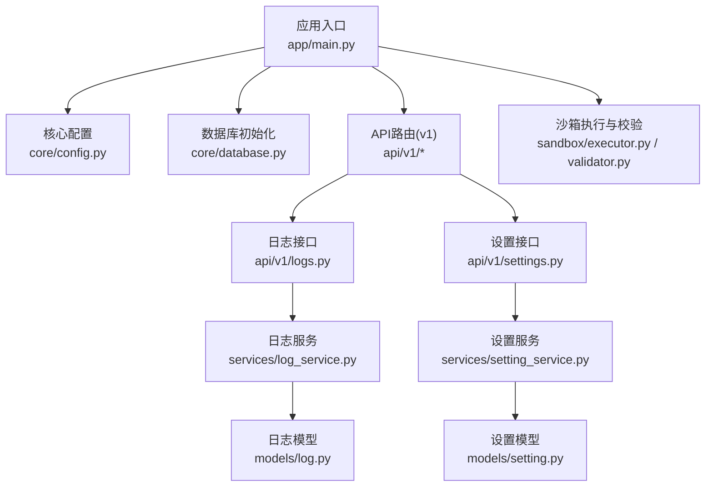
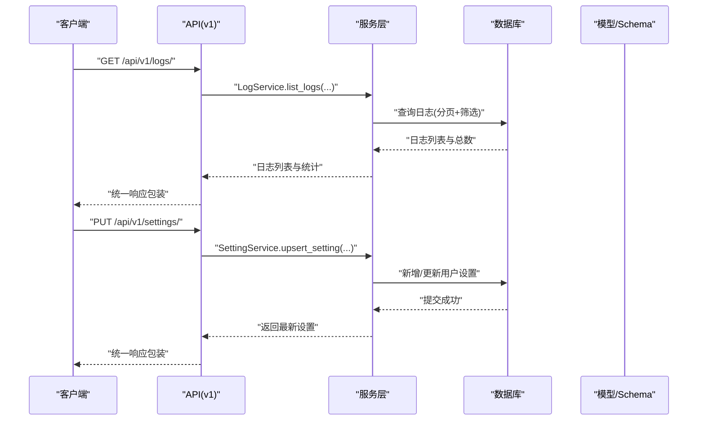
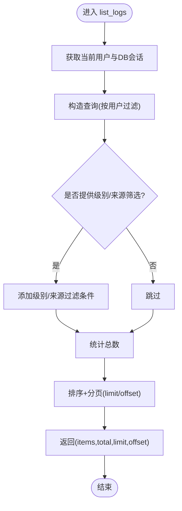
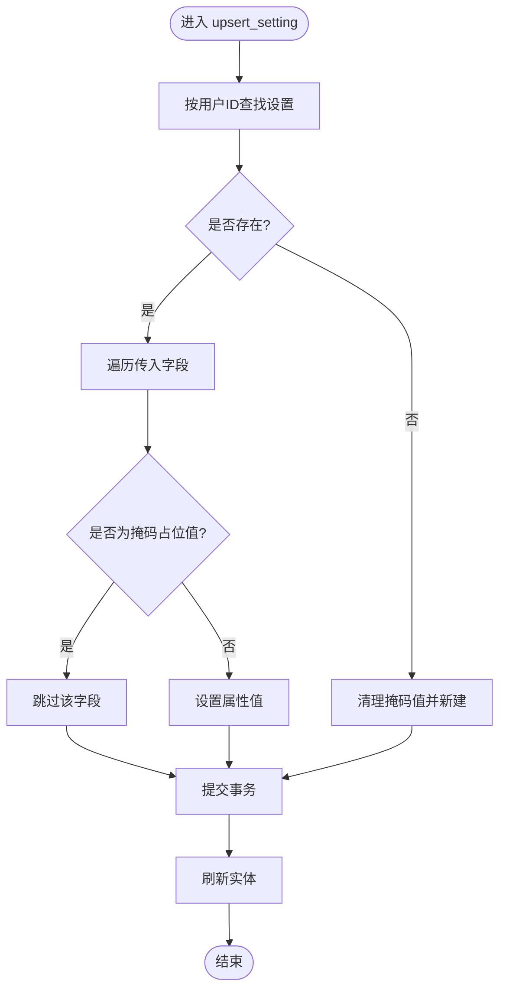
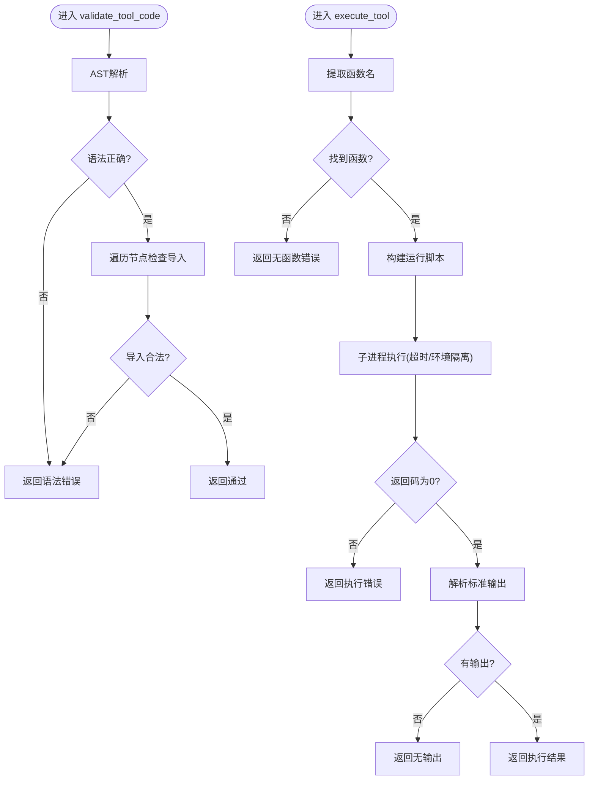
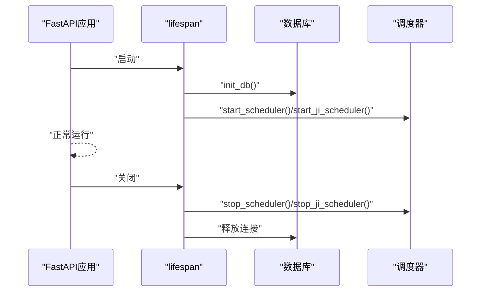
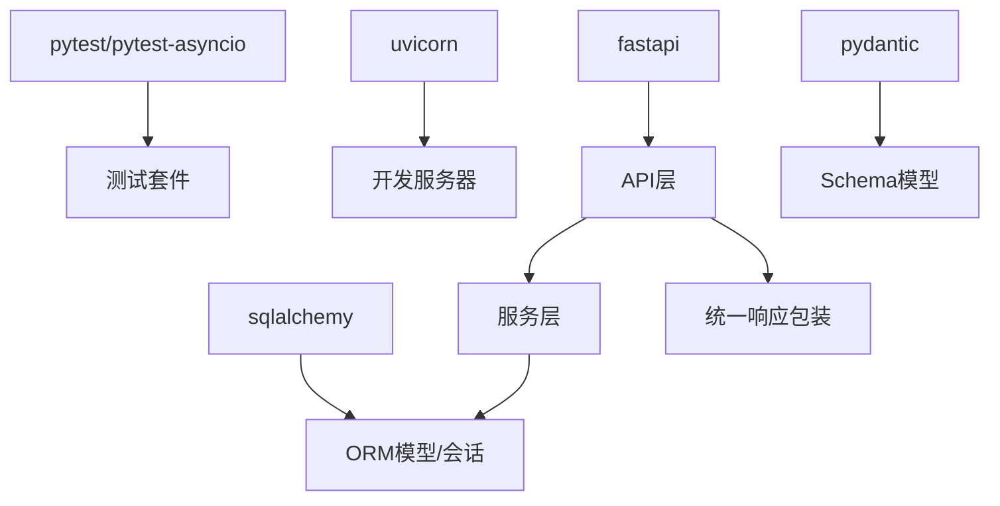

# 测试与调试

<cite>
**本文引用的文件**
- [backend/app/main.py](file://backend/app/main.py)
- [backend/environment.yml](file://backend/environment.yml)
- [backend/app/core/config.py](file://backend/app/core/config.py)
- [backend/app/core/database.py](file://backend/app/core/database.py)
- [backend/app/core/exceptions.py](file://backend/app/core/exceptions.py)
- [backend/app/schemas/common.py](file://backend/app/schemas/common.py)
- [backend/app/schemas/log.py](file://backend/app/schemas/log.py)
- [backend/app/models/log.py](file://backend/app/models/log.py)
- [backend/app/api/v1/logs.py](file://backend/app/api/v1/logs.py)
- [backend/app/services/log_service.py](file://backend/app/services/log_service.py)
- [backend/app/sandbox/validator.py](file://backend/app/sandbox/validator.py)
- [backend/app/sandbox/executor.py](file://backend/app/sandbox/executor.py)
- [backend/app/services/setting_service.py](file://backend/app/services/setting_service.py)
- [backend/app/schemas/setting.py](file://backend/app/schemas/setting.py)
- [backend/app/models/setting.py](file://backend/app/models/setting.py)
</cite>

## 目录
1. [引言](#引言)
2. [项目结构](#项目结构)
3. [核心组件](#核心组件)
4. [架构总览](#架构总览)
5. [详细组件分析](#详细组件分析)
6. [依赖分析](#依赖分析)
7. [性能考虑](#性能考虑)
8. [故障排查指南](#故障排查指南)
9. [结论](#结论)
10. [附录](#附录)

## 引言
本指南面向XuanJi后端的测试与调试工作，目标是帮助开发者建立完善的单元测试与集成测试体系，合理使用Mock对象，掌握调试工具与日志记录最佳实践，构建性能测试与压力测试方案，并结合现有代码实现进行覆盖率分析与持续集成配置建议。文档同时提供常见问题的定位与解决思路，帮助快速定位与修复问题。

## 项目结构
后端采用FastAPI + SQLAlchemy + MySQL的典型分层架构：
- 应用入口与生命周期管理：应用在启动时初始化数据库与后台任务调度器，在关闭时优雅停止。
- 核心配置与数据库：集中管理数据库连接、AI模型配置、沙箱执行参数等。
- API层：v1路由聚合各业务接口，统一响应包装。
- 服务层：封装业务逻辑，处理数据访问与跨表事务。
- 模型与Schema：定义ORM模型与Pydantic输入输出结构。
- 安全与沙箱：对工具代码进行AST校验与隔离执行，防止危险操作。
- 日志与设置：提供日志查询与统计接口，以及用户设置的增删改查。

图表来源
- [backend/app/main.py:15-28](file://backend/app/main.py#L15-L28)
- [backend/app/core/config.py:4-67](file://backend/app/core/config.py#L4-L67)
- [backend/app/core/database.py:22-42](file://backend/app/core/database.py#L22-L42)
- [backend/app/api/v1/logs.py:1-52](file://backend/app/api/v1/logs.py#L1-L52)
- [backend/app/services/log_service.py:10-66](file://backend/app/services/log_service.py#L10-L66)
- [backend/app/models/log.py:9-29](file://backend/app/models/log.py#L9-L29)
- [backend/app/sandbox/executor.py:13-90](file://backend/app/sandbox/executor.py#L13-L90)
- [backend/app/sandbox/validator.py:33-43](file://backend/app/sandbox/validator.py#L33-L43)

章节来源
- [backend/app/main.py:15-28](file://backend/app/main.py#L15-L28)
- [backend/app/core/config.py:4-67](file://backend/app/core/config.py#L4-L67)
- [backend/app/core/database.py:22-42](file://backend/app/core/database.py#L22-L42)

## 核心组件
- 应用生命周期与健康检查：通过lifespan在启动时初始化数据库并启动调度器，在关闭时停止调度器；提供健康检查端点。
- 数据库初始化与迁移：自动创建数据库与表，自动为缺失列添加DDL。
- 统一异常处理：将Pydantic验证错误转换为中文可读提示。
- 响应结构：统一的ApiResponse包装，便于前端一致处理。
- 日志系统：提供分页查询、按级别统计、支持筛选来源与级别。
- 设置系统：支持用户级AI配置的增删改查，含掩码保护逻辑。
- 沙箱执行：对工具代码进行AST安全校验与隔离子进程执行，限制超时与环境变量。

章节来源
- [backend/app/main.py:15-28](file://backend/app/main.py#L15-L28)
- [backend/app/main.py:43-59](file://backend/app/main.py#L43-L59)
- [backend/app/schemas/common.py:8-11](file://backend/app/schemas/common.py#L8-L11)
- [backend/app/core/database.py:22-42](file://backend/app/core/database.py#L22-L42)
- [backend/app/services/log_service.py:10-66](file://backend/app/services/log_service.py#L10-L66)
- [backend/app/api/v1/logs.py:13-52](file://backend/app/api/v1/logs.py#L13-L52)
- [backend/app/services/setting_service.py:7-41](file://backend/app/services/setting_service.py#L7-L41)
- [backend/app/sandbox/validator.py:33-43](file://backend/app/sandbox/validator.py#L33-L43)
- [backend/app/sandbox/executor.py:13-90](file://backend/app/sandbox/executor.py#L13-L90)

## 架构总览
下图展示从客户端到后端服务的整体调用链路，包括日志查询与设置更新的关键路径。

图表来源
- [backend/app/api/v1/logs.py:13-52](file://backend/app/api/v1/logs.py#L13-L52)
- [backend/app/services/log_service.py:40-66](file://backend/app/services/log_service.py#L40-L66)
- [backend/app/schemas/log.py:18-31](file://backend/app/schemas/log.py#L18-L31)
- [backend/app/models/log.py:9-29](file://backend/app/models/log.py#L9-L29)
- [backend/app/services/setting_service.py:23-41](file://backend/app/services/setting_service.py#L23-L41)
- [backend/app/schemas/setting.py:6-37](file://backend/app/schemas/setting.py#L6-L37)
- [backend/app/models/setting.py:9-45](file://backend/app/models/setting.py#L9-L45)

## 详细组件分析

### 日志系统（查询与统计）
- 查询接口：支持limit/offset分页、按级别与来源筛选，返回统一响应结构。
- 服务层：封装分页查询与按级别统计，SQLAlchemy ORM实现。
- 模型与Schema：定义字段类型、索引与序列化规则。
- 最佳实践：前端按级别与来源筛选，后端使用索引字段提升查询效率。

图表来源
- [backend/app/api/v1/logs.py:13-37](file://backend/app/api/v1/logs.py#L13-L37)
- [backend/app/services/log_service.py:40-56](file://backend/app/services/log_service.py#L40-L56)
- [backend/app/schemas/log.py:33-38](file://backend/app/schemas/log.py#L33-L38)
- [backend/app/models/log.py:13-29](file://backend/app/models/log.py#L13-L29)

章节来源
- [backend/app/api/v1/logs.py:13-52](file://backend/app/api/v1/logs.py#L13-L52)
- [backend/app/services/log_service.py:10-66](file://backend/app/services/log_service.py#L10-L66)
- [backend/app/schemas/log.py:7-31](file://backend/app/schemas/log.py#L7-L31)
- [backend/app/models/log.py:9-29](file://backend/app/models/log.py#L9-L29)

### 设置系统（用户级AI配置）
- 更新策略：支持部分字段更新，掩码值保护避免覆盖真实密钥。
- 掩码识别：针对特定敏感键名，若值包含掩码标记则跳过更新。
- 数据一致性：新增或更新后刷新实体，保证返回最新值。

图表来源
- [backend/app/services/setting_service.py:23-41](file://backend/app/services/setting_service.py#L23-L41)
- [backend/app/schemas/setting.py:6-37](file://backend/app/schemas/setting.py#L6-L37)
- [backend/app/models/setting.py:9-45](file://backend/app/models/setting.py#L9-L45)

章节来源
- [backend/app/services/setting_service.py:7-41](file://backend/app/services/setting_service.py#L7-L41)
- [backend/app/schemas/setting.py:6-37](file://backend/app/schemas/setting.py#L6-L37)
- [backend/app/models/setting.py:9-45](file://backend/app/models/setting.py#L9-L45)

### 沙箱执行与安全校验
- 安全校验：基于AST解析，禁止导入危险模块与内置函数，允许有限安全模块。
- 隔离执行：将工具代码写入临时文件并在独立子进程中运行，设置超时与受限环境变量。
- 返回结果：捕获异常并以统一结构返回，避免直接暴露内部错误。

图表来源
- [backend/app/sandbox/validator.py:33-43](file://backend/app/sandbox/validator.py#L33-L43)
- [backend/app/sandbox/executor.py:13-90](file://backend/app/sandbox/executor.py#L13-L90)

章节来源
- [backend/app/sandbox/validator.py:33-43](file://backend/app/sandbox/validator.py#L33-L43)
- [backend/app/sandbox/executor.py:13-90](file://backend/app/sandbox/executor.py#L13-L90)

### 应用生命周期与异常处理
- 生命周期：启动时初始化数据库与调度器，关闭时停止调度器。
- 异常处理：将Pydantic验证错误转为中文提示，统一返回code/message/data结构。
- 健康检查：提供轻量级健康检查端点。

图表来源
- [backend/app/main.py:15-28](file://backend/app/main.py#L15-L28)
- [backend/app/core/database.py:22-42](file://backend/app/core/database.py#L22-L42)

章节来源
- [backend/app/main.py:15-28](file://backend/app/main.py#L15-L28)
- [backend/app/main.py:43-59](file://backend/app/main.py#L43-L59)

## 依赖分析
- 外部依赖：pytest、pytest-asyncio用于测试；uvicorn用于开发服务器；fastapi、sqlalchemy、pydantic等用于应用框架与数据建模。
- 内部耦合：API层依赖服务层；服务层依赖模型与数据库会话；日志与设置分别对应独立模块，均通过统一响应包装对外提供。
- 安全边界：沙箱模块与外部工具执行解耦，避免直接在主进程中执行不受控代码。

图表来源
- [backend/environment.yml:8-24](file://backend/environment.yml#L8-L24)
- [backend/app/schemas/common.py:8-11](file://backend/app/schemas/common.py#L8-L11)

章节来源
- [backend/environment.yml:1-24](file://backend/environment.yml#L1-L24)
- [backend/app/schemas/common.py:8-11](file://backend/app/schemas/common.py#L8-L11)

## 性能考虑
- 数据库连接池与预检：启用pool_pre_ping减少连接失效导致的异常。
- 自动迁移：在启动阶段自动补齐缺失列，降低部署后手动维护成本。
- 沙箱超时控制：通过配置项限制工具执行时间，避免阻塞。
- 查询优化：日志模型对常用筛选字段建立索引，服务层按需添加过滤条件。
- 建议：对高频接口增加缓存策略（如设置读取）、对批量写入使用批量插入、对长耗时任务使用异步队列。

章节来源
- [backend/app/core/database.py:6-19](file://backend/app/core/database.py#L6-L19)
- [backend/app/core/database.py:44-65](file://backend/app/core/database.py#L44-L65)
- [backend/app/core/config.py:44-46](file://backend/app/core/config.py#L44-L46)
- [backend/app/models/log.py:13-29](file://backend/app/models/log.py#L13-L29)

## 故障排查指南
- 参数验证失败：确认请求体符合Pydantic模型定义，查看统一异常处理器返回的中文提示。
- 数据库连接问题：检查数据库URL配置与网络连通性，确认数据库存在且字符集匹配。
- 日志查询为空：确认当前用户上下文与筛选条件，检查索引字段是否命中。
- 设置更新无效：确认传入字段未被掩码保护，检查敏感键名是否包含掩码标记。
- 工具执行失败：检查沙箱超时、隔离环境变量、函数签名与参数格式；查看stderr输出。
- 健康检查异常：检查数据库初始化与调度器启动状态。

章节来源
- [backend/app/main.py:43-59](file://backend/app/main.py#L43-L59)
- [backend/app/core/config.py:48-64](file://backend/app/core/config.py#L48-L64)
- [backend/app/services/log_service.py:40-56](file://backend/app/services/log_service.py#L40-L56)
- [backend/app/services/setting_service.py:18-22](file://backend/app/services/setting_service.py#L18-L22)
- [backend/app/sandbox/executor.py:64-90](file://backend/app/sandbox/executor.py#L64-L90)

## 结论
通过统一的响应包装、完善的日志与设置接口、严格的沙箱安全策略以及数据库自动迁移能力，XuanJi后端具备良好的可测试性与可维护性。建议在此基础上补充单元测试与集成测试，引入Mock对象隔离外部依赖，完善覆盖率分析与CI流水线，持续提升质量与稳定性。

## 附录

### 单元测试编写策略
- 目标：覆盖核心业务逻辑（服务层）、关键数据流（日志/设置）、边界条件（空值/越界/异常）。
- 方法：使用pytest与pytest-asyncio；对API层使用HTTP客户端模拟请求；对服务层直接注入Mock DB会话；对沙箱模块Mock子进程与文件系统。
- 建议：为每个服务方法编写正反例测试，确保异常路径与边界条件被覆盖。

章节来源
- [backend/environment.yml:23-24](file://backend/environment.yml#L23-L24)
- [backend/app/services/log_service.py:10-66](file://backend/app/services/log_service.py#L10-L66)
- [backend/app/services/setting_service.py:7-41](file://backend/app/services/setting_service.py#L7-L41)
- [backend/app/sandbox/executor.py:13-90](file://backend/app/sandbox/executor.py#L13-L90)

### 集成测试设计
- 目标：验证端到端流程（登录→设置→日志查询→工具执行）。
- 方法：使用测试数据库实例，初始化完整schema，模拟真实请求路径；断言响应结构与业务结果。
- 建议：分离测试数据与生产数据，使用事务回滚或独立测试库。

章节来源
- [backend/app/core/database.py:22-42](file://backend/app/core/database.py#L22-L42)
- [backend/app/api/v1/logs.py:13-52](file://backend/app/api/v1/logs.py#L13-L52)

### Mock对象使用
- 对象：数据库会话（session）、外部HTTP客户端（如LLM调用）、子进程执行器。
- 策略：对不可控外部依赖进行最小化Mock，保持接口契约不变；对复杂逻辑使用Patch替换具体实现。
- 注意：确保Mock不影响全局状态，避免跨用例污染。

章节来源
- [backend/app/sandbox/executor.py:55-90](file://backend/app/sandbox/executor.py#L55-L90)
- [backend/app/core/exceptions.py:1-20](file://backend/app/core/exceptions.py#L1-L20)

### 调试工具配置与日志记录最佳实践
- 开发服务器：启用reload与指定监控目录，避免工具目录触发热重载。
- 日志结构：统一使用服务层日志方法，包含级别、来源、状态码与详情。
- 最佳实践：区分info/warn/error/debug；对关键路径打点；避免泄露敏感信息；使用索引字段加速查询。

章节来源
- [backend/app/main.py:67-79](file://backend/app/main.py#L67-L79)
- [backend/app/services/log_service.py:14-38](file://backend/app/services/log_service.py#L14-L38)
- [backend/app/models/log.py:19-26](file://backend/app/models/log.py#L19-L26)

### 错误追踪机制
- 统一异常处理：将验证错误转为中文提示，便于前端与用户理解。
- 日志追踪：通过日志来源与状态码定位问题；结合分页与筛选快速定位。
- 建议：为关键异常抛出自定义异常类，增强可读性与可追踪性。

章节来源
- [backend/app/main.py:43-59](file://backend/app/main.py#L43-L59)
- [backend/app/core/exceptions.py:1-20](file://backend/app/core/exceptions.py#L1-L20)
- [backend/app/api/v1/logs.py:13-37](file://backend/app/api/v1/logs.py#L13-L37)

### 性能测试与压力测试
- 性能测试：对高频接口（日志查询、设置更新）进行基准测试，记录响应时间与吞吐。
- 压力测试：逐步增加并发与数据规模，观察数据库连接池与沙箱超时行为。
- 建议：使用异步压测工具，关注慢查询与锁等待；对瓶颈接口引入缓存与限流。

章节来源
- [backend/app/core/database.py:6-19](file://backend/app/core/database.py#L6-L19)
- [backend/app/core/config.py:44-46](file://backend/app/core/config.py#L44-L46)
- [backend/app/services/log_service.py:40-56](file://backend/app/services/log_service.py#L40-L56)

### 内存泄漏检测
- 关注点：长时间运行的调度器、数据库会话、沙箱子进程；确保资源及时释放。
- 方法：使用内存分析工具监控进程RSS；定期重启开发服务器；对大对象使用上下文管理器。
- 建议：对工具执行结果进行显式清理，避免临时文件残留。

章节来源
- [backend/app/main.py:15-28](file://backend/app/main.py#L15-L28)
- [backend/app/sandbox/executor.py:55-90](file://backend/app/sandbox/executor.py#L55-L90)

### 测试覆盖率分析
- 覆盖率指标：语句、分支、函数、行覆盖率；重点覆盖服务层与异常路径。
- 工具：pytest-cov；报告生成与阈值设定；持续集成中强制最低覆盖率。
- 建议：对关键业务逻辑与边界条件单独标注覆盖率目标。

章节来源
- [backend/environment.yml:23-24](file://backend/environment.yml#L23-L24)

### 持续集成配置与自动化测试流程
- 触发：push/PR触发；分支策略与保护规则。
- 步骤：安装依赖（conda/pip）、初始化测试数据库、运行pytest（含async）、生成覆盖率报告、上传报告。
- 建议：分离单元测试与集成测试；对慢测试使用标记分批执行；失败即停并通知。

章节来源
- [backend/environment.yml:1-24](file://backend/environment.yml#L1-L24)
- [backend/app/core/database.py:22-42](file://backend/app/core/database.py#L22-L42)