# 系统架构设计

<cite>
**本文引用的文件**
- [main.py](file://backend/app/main.py)
- [config.py](file://backend/app/core/config.py)
- [deps.py](file://backend/app/core/deps.py)
- [exceptions.py](file://backend/app/core/exceptions.py)
- [security.py](file://backend/app/core/security.py)
- [database.py](file://backend/app/core/database.py)
- [__init__.py](file://backend/app/api/v1/__init__.py)
- [chat.py](file://backend/app/api/v1/chat.py)
- [auth.py](file://backend/app/api/v1/auth.py)
- [agent.py](file://backend/app/ai/agent.py)
- [base.py](file://backend/app/ai/base.py)
- [factory.py](file://backend/app/ai/factory.py)
- [executor.py](file://backend/app/sandbox/executor.py)
- [validator.py](file://backend/app/sandbox/validator.py)
- [conversation_service.py](file://backend/app/services/conversation_service.py)
- [scheduler.py](file://backend/app/services/scheduler.py)
- [conversation.py](file://backend/app/models/conversation.py)
</cite>

## 目录
1. [引言](#引言)
2. [项目结构](#项目结构)
3. [核心组件](#核心组件)
4. [架构总览](#架构总览)
5. [详细组件分析](#详细组件分析)
6. [依赖分析](#依赖分析)
7. [性能考虑](#性能考虑)
8. [故障排查指南](#故障排查指南)
9. [结论](#结论)
10. [附录](#附录)

## 引言
本文件面向XuanJi后端系统，围绕FastAPI应用的架构模式、路由设计、中间件机制、应用生命周期、依赖注入、异常处理进行系统化梳理，并深入阐释多智能体协作体系的Agent模式、服务间通信机制与扩展性设计。文档同时给出架构图示与组件交互示例，帮助读者快速把握系统设计要点与技术权衡。

## 项目结构
后端采用“分层+领域模块”组织方式：
- 应用入口与生命周期：backend/app/main.py
- 配置与安全：backend/app/core/config.py、security.py、deps.py
- 数据库与ORM：backend/app/core/database.py
- API层：backend/app/api/v1/*（路由聚合）
- AI与多智能体：backend/app/ai/*
- 服务层：backend/app/services/*
- 沙箱执行：backend/app/sandbox/*
- 模型定义：backend/app/models/*

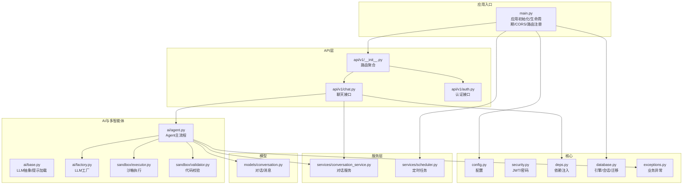

**图表来源**
- [main.py:1-79](file://backend/app/main.py#L1-L79)
- [config.py:1-68](file://backend/app/core/config.py#L1-L68)
- [security.py:1-38](file://backend/app/core/security.py#L1-L38)
- [deps.py:1-42](file://backend/app/core/deps.py#L1-L42)
- [database.py:1-65](file://backend/app/core/database.py#L1-L65)
- [__init__.py:1-23](file://backend/app/api/v1/__init__.py#L1-L23)
- [chat.py:1-106](file://backend/app/api/v1/chat.py#L1-L106)
- [auth.py:1-61](file://backend/app/api/v1/auth.py#L1-L61)
- [agent.py:1-800](file://backend/app/ai/agent.py#L1-L800)
- [base.py:1-73](file://backend/app/ai/base.py#L1-L73)
- [factory.py:1-154](file://backend/app/ai/factory.py#L1-L154)
- [executor.py:1-101](file://backend/app/sandbox/executor.py#L1-L101)
- [validator.py:1-95](file://backend/app/sandbox/validator.py#L1-L95)
- [conversation_service.py:1-141](file://backend/app/services/conversation_service.py#L1-L141)
- [scheduler.py:1-800](file://backend/app/services/scheduler.py#L1-L800)
- [conversation.py:1-41](file://backend/app/models/conversation.py#L1-L41)

**章节来源**
- [main.py:1-79](file://backend/app/main.py#L1-L79)
- [__init__.py:1-23](file://backend/app/api/v1/__init__.py#L1-L23)

## 核心组件
- 应用入口与生命周期：通过异步生命周期钩子完成数据库初始化与定时任务调度启停。
- 配置中心：集中管理数据库、AI Provider、密钥与沙箱参数。
- 安全与认证：基于JWT的Bearer令牌，依赖注入获取当前用户。
- 数据库层：SQLAlchemy引擎与自动迁移，确保表结构演进。
- API路由：按功能域拆分，统一前缀与标签，便于扩展。
- AI与多智能体：Agent作为编排器，协调意图识别、情绪分析、工具检索/生成/执行、结果解读等。
- 沙箱执行：隔离子进程执行工具代码，限制内置函数与模块，保障安全。
- 服务层：对话、日志、任务、记忆、身份等服务解耦业务逻辑。
- 异常体系：LLM配置缺失等业务异常，配合全局异常处理器统一响应。

**章节来源**
- [main.py:15-28](file://backend/app/main.py#L15-L28)
- [config.py:4-64](file://backend/app/core/config.py#L4-L64)
- [security.py:24-37](file://backend/app/core/security.py#L24-L37)
- [deps.py:12-42](file://backend/app/core/deps.py#L12-L42)
- [database.py:22-42](file://backend/app/core/database.py#L22-L42)
- [chat.py:40-106](file://backend/app/api/v1/chat.py#L40-L106)
- [agent.py:35-792](file://backend/app/ai/agent.py#L35-L792)
- [executor.py:13-101](file://backend/app/sandbox/executor.py#L13-L101)
- [validator.py:33-95](file://backend/app/sandbox/validator.py#L33-L95)
- [conversation_service.py:9-141](file://backend/app/services/conversation_service.py#L9-L141)
- [exceptions.py:1-20](file://backend/app/core/exceptions.py#L1-L20)

## 架构总览
XuanJi后端采用FastAPI作为Web框架，遵循“控制器-服务-模型-基础设施”的分层架构。核心特征包括：
- 路由聚合与前缀化：v1路由统一include，便于版本演进。
- 生命周期管理：应用启动时初始化数据库并启动定时任务；关闭时优雅停止。
- 中间件：启用CORS，满足前后端跨域访问。
- 依赖注入：通过Depends注入数据库会话与当前用户，降低耦合。
- 异常处理：统一将Pydantic校验错误转为中文友好提示。
- 多智能体协作：Agent作为编排中枢，串联意图识别、情绪分析、工具链路与结果解读。
- 沙箱执行：工具代码在隔离环境中运行，防止越权与资源泄露。

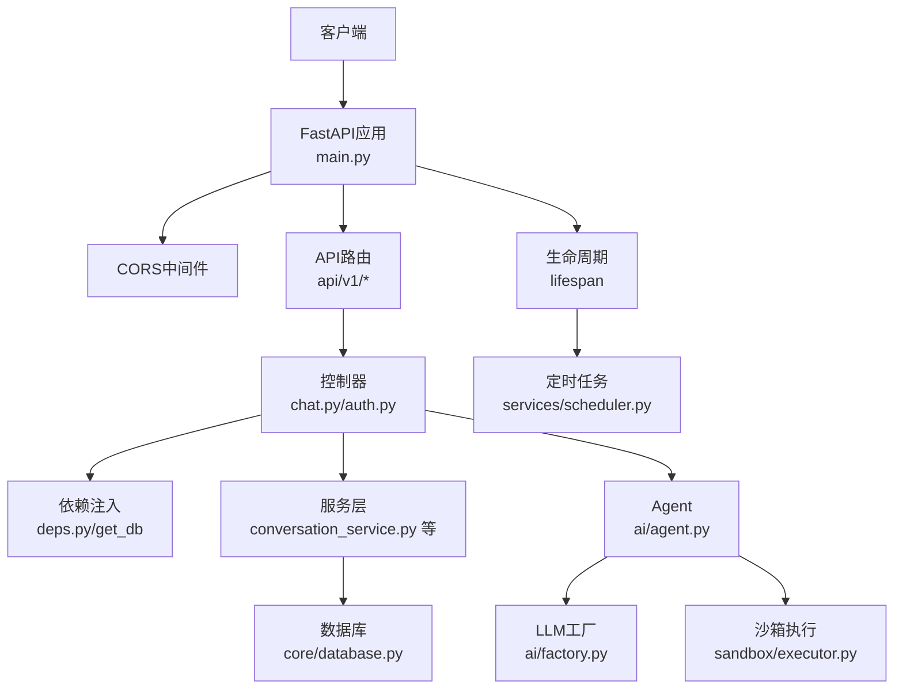

**图表来源**
- [main.py:30-64](file://backend/app/main.py#L30-L64)
- [chat.py:40-106](file://backend/app/api/v1/chat.py#L40-L106)
- [auth.py:14-61](file://backend/app/api/v1/auth.py#L14-L61)
- [deps.py:12-42](file://backend/app/core/deps.py#L12-L42)
- [conversation_service.py:9-141](file://backend/app/services/conversation_service.py#L9-L141)
- [agent.py:35-792](file://backend/app/ai/agent.py#L35-L792)
- [factory.py:54-154](file://backend/app/ai/factory.py#L54-L154)
- [executor.py:13-101](file://backend/app/sandbox/executor.py#L13-L101)
- [database.py:14-39](file://backend/app/core/database.py#L14-L39)
- [scheduler.py:616-797](file://backend/app/services/scheduler.py#L616-L797)

## 详细组件分析

### FastAPI应用与生命周期
- 应用实例：设置标题、版本、生命周期钩子。
- 生命周期：启动时初始化数据库并启动定时任务；关闭时停止定时任务。
- 中间件：启用CORS，允许凭证、任意方法与头。
- 路由注册：include v1路由，统一前缀。
- 全局异常：将Pydantic校验错误映射为中文提示。
- 健康检查：/health返回服务状态。

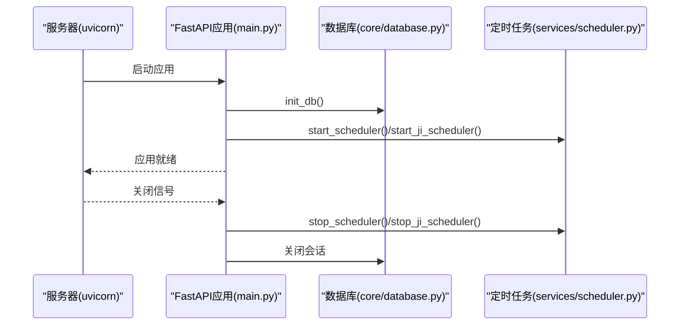

**图表来源**
- [main.py:15-28](file://backend/app/main.py#L15-L28)
- [main.py:30-40](file://backend/app/main.py#L30-L40)
- [main.py:62-64](file://backend/app/main.py#L62-L64)
- [database.py:22-39](file://backend/app/core/database.py#L22-L39)
- [scheduler.py:616-797](file://backend/app/services/scheduler.py#L616-L797)

**章节来源**
- [main.py:15-28](file://backend/app/main.py#L15-L28)
- [main.py:30-64](file://backend/app/main.py#L30-L64)

### 路由设计与中间件机制
- 路由聚合：v1路由include各功能子路由，统一前缀与标签。
- 中间件：CORS中间件按配置放行。
- 控制器：聊天接口支持SSE流式输出，非流式收集完成后一次性返回；认证接口提供登录/注册/个人信息。
- 依赖注入：控制器通过Depends获取当前用户与数据库会话。

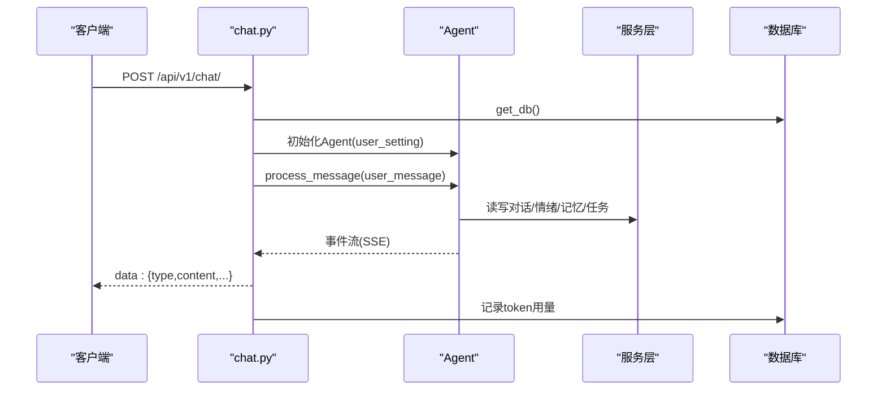

**图表来源**
- [chat.py:40-106](file://backend/app/api/v1/chat.py#L40-L106)
- [agent.py:78-273](file://backend/app/ai/agent.py#L78-L273)
- [conversation_service.py:61-110](file://backend/app/services/conversation_service.py#L61-L110)

**章节来源**
- [__init__.py:13-23](file://backend/app/api/v1/__init__.py#L13-L23)
- [chat.py:40-106](file://backend/app/api/v1/chat.py#L40-L106)
- [auth.py:14-61](file://backend/app/api/v1/auth.py#L14-L61)

### 依赖注入系统
- 当前用户：HTTP Bearer令牌经安全模块解码，从数据库查询用户对象。
- 数据库会话：通过上下文管理器提供Session，确保正确关闭。
- 控制器依赖：在路由函数上直接使用Depends注入用户与会话。

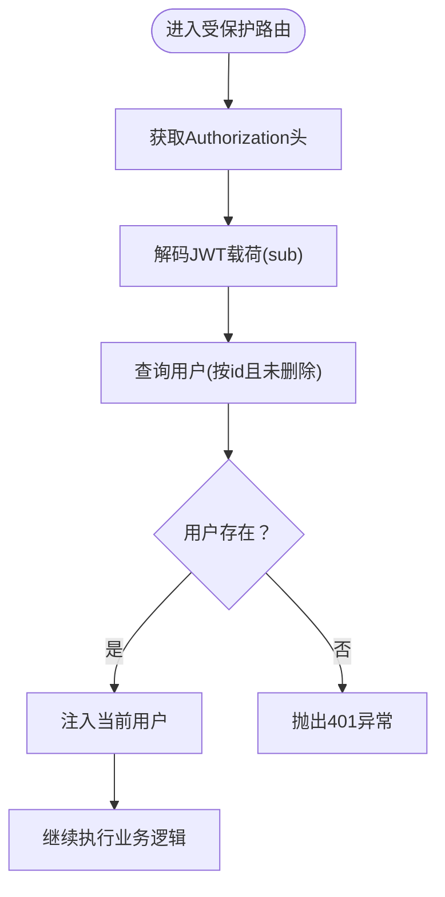

**图表来源**
- [deps.py:12-42](file://backend/app/core/deps.py#L12-L42)
- [security.py:33-37](file://backend/app/core/security.py#L33-L37)

**章节来源**
- [deps.py:12-42](file://backend/app/core/deps.py#L12-L42)
- [security.py:24-37](file://backend/app/core/security.py#L24-L37)

### 异常处理架构
- 全局异常：将Pydantic校验错误转为中文提示，统一返回结构。
- 业务异常：LLM配置缺失等特定异常类型，携带角色名与缺失字段信息。
- Agent内部：对LLM流式/工具执行/结果解读等过程进行异常捕获与降级处理。

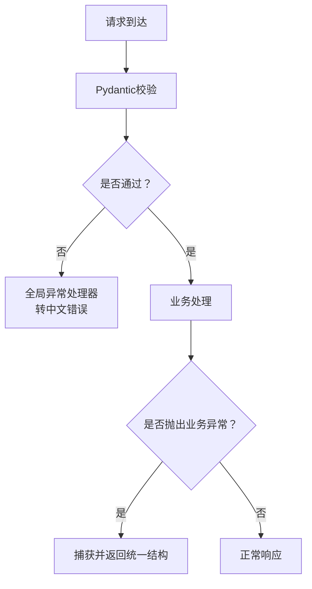

**图表来源**
- [main.py:43-59](file://backend/app/main.py#L43-L59)
- [exceptions.py:1-20](file://backend/app/core/exceptions.py#L1-L20)
- [agent.py:676-682](file://backend/app/ai/agent.py#L676-L682)

**章节来源**
- [main.py:43-59](file://backend/app/main.py#L43-L59)
- [exceptions.py:1-20](file://backend/app/core/exceptions.py#L1-L20)
- [agent.py:676-682](file://backend/app/ai/agent.py#L676-L682)

### 多智能体协作系统与Agent模式
- 角色分工：晴（意图识别）、焕（情绪分析）、遥（风格设计/格式化）、玄（对话/回复）、机（工具检索/生成/执行）、“机”（系统迭代/调度）。
- 编排流程：Agent作为主控制器，按消息类型分流至轻量闲聊或完整对话路径；并发执行情绪分析；在工具路径中支持匹配、生成、执行、迭代与保存；最终由遥参与风格设计，玄进行结果解读。
- 协作日志：记录各角色动作与结果，前端可异步渲染。
- 后台任务：定时压缩记忆、身份迭代评估、规则引擎优化等。

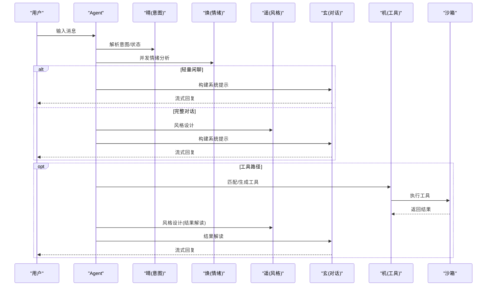

**图表来源**
- [agent.py:78-273](file://backend/app/ai/agent.py#L78-L273)
- [agent.py:350-551](file://backend/app/ai/agent.py#L350-L551)
- [agent.py:570-792](file://backend/app/ai/agent.py#L570-L792)
- [executor.py:13-101](file://backend/app/sandbox/executor.py#L13-L101)

**章节来源**
- [agent.py:35-792](file://backend/app/ai/agent.py#L35-L792)

### LLM客户端与工厂模式
- 抽象接口：统一chat/stream_chat能力，支持回调记录用量。
- 工厂方法：按用户设置动态创建在线/本地LLM客户端，校验必要字段，缺失时抛出业务异常。
- 角色分离：不同角色（对话/工具/意图/情绪/格式）使用独立客户端，便于替换与治理。

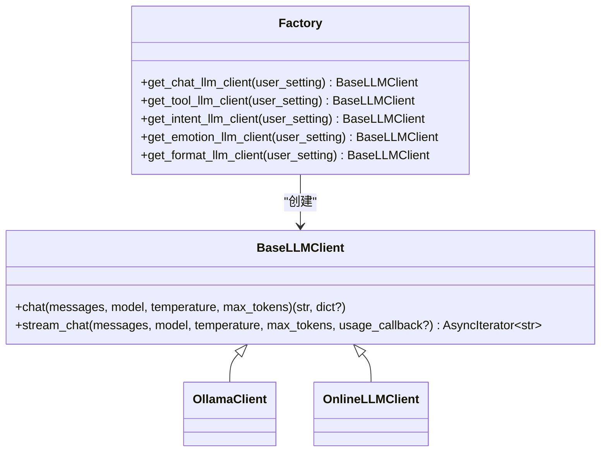

**图表来源**
- [base.py:8-35](file://backend/app/ai/base.py#L8-L35)
- [factory.py:54-154](file://backend/app/ai/factory.py#L54-L154)

**章节来源**
- [base.py:8-35](file://backend/app/ai/base.py#L8-L35)
- [factory.py:54-154](file://backend/app/ai/factory.py#L54-L154)

### 沙箱执行与安全校验
- 代码校验：AST分析导入模块、内置函数、函数签名、路径穿越等，拒绝高危代码。
- 子进程执行：隔离环境变量与工作目录，超时控制，标准输出解析JSON结果。
- 工具迭代：失败时可自动迭代并保存新版本，支持回滚与重试。

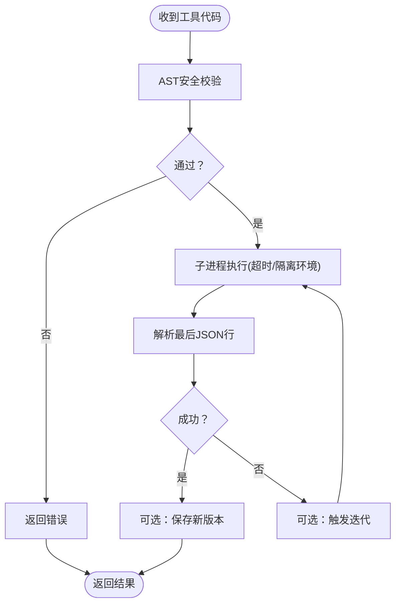

**图表来源**
- [validator.py:33-95](file://backend/app/sandbox/validator.py#L33-L95)
- [executor.py:13-101](file://backend/app/sandbox/executor.py#L13-L101)

**章节来源**
- [validator.py:33-95](file://backend/app/sandbox/validator.py#L33-L95)
- [executor.py:13-101](file://backend/app/sandbox/executor.py#L13-L101)

### 服务间通信与数据模型
- 对话服务：提供会话创建/激活、消息增删改查、上下文注入等。
- 数据模型：Conversation/Message等，支撑对话历史与元数据存储。
- 事件驱动：聊天接口通过SSE向客户端推送事件，前端按type消费。

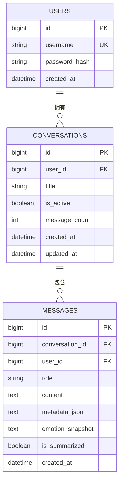

**图表来源**
- [conversation.py:9-41](file://backend/app/models/conversation.py#L9-L41)

**章节来源**
- [conversation_service.py:9-141](file://backend/app/services/conversation_service.py#L9-L141)
- [conversation.py:9-41](file://backend/app/models/conversation.py#L9-L41)

## 依赖分析
- 组件内聚：控制器依赖服务层，服务层依赖模型与数据库；AI层通过工厂与沙箱与外部系统交互。
- 外部依赖：FastAPI、Starlette、SQLAlchemy、uvicorn、bcrypt、jose等。
- 循环依赖：未见明显循环；路由聚合避免了控制器对具体实现的直接耦合。
- 接口契约：BaseLLMClient定义统一接口，工厂负责实现选择；Agent通过抽象与服务接口解耦。

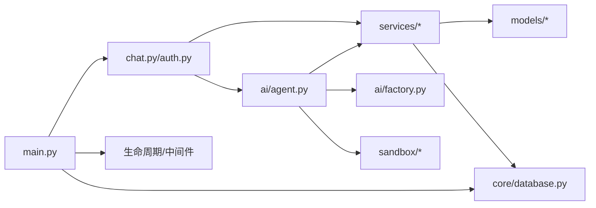

**图表来源**
- [chat.py:40-106](file://backend/app/api/v1/chat.py#L40-L106)
- [auth.py:14-61](file://backend/app/api/v1/auth.py#L14-L61)
- [agent.py:35-792](file://backend/app/ai/agent.py#L35-L792)
- [factory.py:54-154](file://backend/app/ai/factory.py#L54-L154)
- [executor.py:13-101](file://backend/app/sandbox/executor.py#L13-L101)
- [conversation_service.py:9-141](file://backend/app/services/conversation_service.py#L9-L141)
- [database.py:14-39](file://backend/app/core/database.py#L14-L39)
- [main.py:30-40](file://backend/app/main.py#L30-L40)

**章节来源**
- [chat.py:40-106](file://backend/app/api/v1/chat.py#L40-L106)
- [agent.py:35-792](file://backend/app/ai/agent.py#L35-L792)
- [factory.py:54-154](file://backend/app/ai/factory.py#L54-L154)
- [executor.py:13-101](file://backend/app/sandbox/executor.py#L13-L101)
- [conversation_service.py:9-141](file://backend/app/services/conversation_service.py#L9-L141)
- [database.py:14-39](file://backend/app/core/database.py#L14-L39)
- [main.py:30-40](file://backend/app/main.py#L30-L40)

## 性能考虑
- SSE流式输出：聊天接口支持SSE，前端可边收边显，降低首屏延迟。
- 并发与超时：情绪分析异步并发，工具执行与LLM流式设置超时，避免阻塞。
- 缓存与懒加载：提示模板与JSON配置使用LRU缓存，减少磁盘IO。
- 自动迁移：数据库列增量补齐，避免部署时手工维护DDL。
- 后台任务：定时压缩记忆、身份迭代评估、规则优化等，避免影响主线程。
- 沙箱隔离：子进程隔离与超时，防止资源滥用。

[本节为通用性能讨论，无需列出章节来源]

## 故障排查指南
- 认证失败：检查Bearer令牌是否有效、用户是否存在且未删除。
- LLM配置缺失：确认用户设置中Provider与模型名称等字段完整。
- 工具执行失败：查看沙箱执行日志与超时、输出解析错误。
- SSE断开：控制器检测连接断开后会终止流，检查网络与前端连接状态。
- 定时任务异常：查看调度器日志，定位具体任务与用户范围。

**章节来源**
- [deps.py:18-41](file://backend/app/core/deps.py#L18-L41)
- [exceptions.py:1-20](file://backend/app/core/exceptions.py#L1-L20)
- [executor.py:95-98](file://backend/app/sandbox/executor.py#L95-L98)
- [chat.py:78-85](file://backend/app/api/v1/chat.py#L78-L85)
- [scheduler.py:616-797](file://backend/app/services/scheduler.py#L616-L797)

## 结论
XuanJi后端以FastAPI为核心，通过清晰的分层与依赖注入实现高内聚低耦合；以Agent为中心的多智能体协作模式，将意图识别、情绪分析、工具链路与结果解读有机整合；配合沙箱执行与定时任务，形成安全、可观测、可扩展的AI应用架构。未来可在LLM路由与缓存、工具版本治理、指标埋点与告警等方面持续优化。

[本节为总结性内容，无需列出章节来源]

## 附录
- 配置项概览：数据库、AI Provider、密钥、CORS、沙箱超时等。
- 路由清单：认证、聊天、会话、任务、工具、文件、统计、设置、日志等。
- 安全要点：JWT算法与有效期、密码哈希、沙箱白名单与超时。

**章节来源**
- [config.py:4-64](file://backend/app/core/config.py#L4-L64)
- [__init__.py:3-22](file://backend/app/api/v1/__init__.py#L3-L22)
- [security.py:24-37](file://backend/app/core/security.py#L24-L37)
- [validator.py:4-25](file://backend/app/sandbox/validator.py#L4-L25)