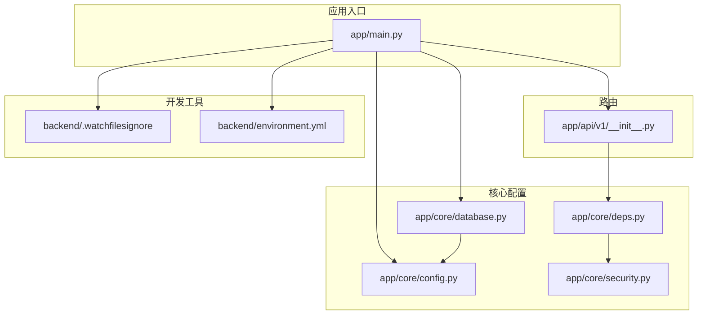
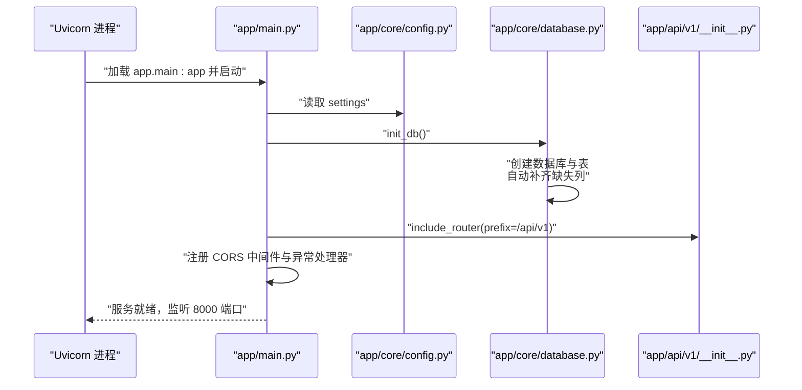
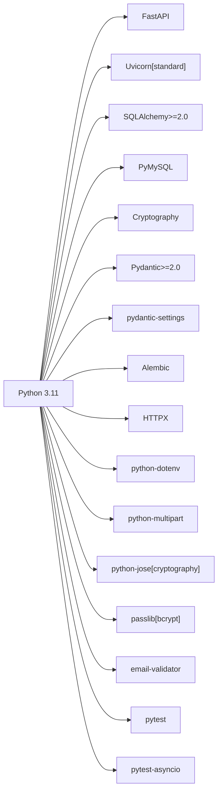

# 项目环境搭建

<cite>
**本文档引用的文件**
- [environment.yml](file://backend/environment.yml)
- [main.py](file://backend/app/main.py)
- [config.py](file://backend/app/core/config.py)
- [database.py](file://backend/app/core/database.py)
- [deps.py](file://backend/app/core/deps.py)
- [security.py](file://backend/app/core/security.py)
- [.watchfilesignore](file://backend/.watchfilesignore)
</cite>

## 目录
1. [简介](#简介)
2. [项目结构](#项目结构)
3. [核心组件](#核心组件)
4. [架构总览](#架构总览)
5. [详细组件分析](#详细组件分析)
6. [依赖分析](#依赖分析)
7. [性能考虑](#性能考虑)
8. [故障排除指南](#故障排除指南)
9. [结论](#结论)
10. [附录](#附录)

## 简介
本指南面向希望快速搭建 XuanJi 后端开发环境的开发者，覆盖以下内容：
- Conda 环境配置与 Python 依赖安装
- 数据库初始化步骤（MySQL）
- 开发服务器启动与热重载机制
- 环境变量配置与安全密钥管理
- 常见环境问题排查与解决方案
- IDE 设置建议与调试工具配置

## 项目结构
后端采用 FastAPI + SQLAlchemy 架构，核心模块包括：
- 应用入口与生命周期管理：app/main.py
- 配置系统：app/core/config.py
- 数据库连接与初始化：app/core/database.py
- 安全与认证：app/core/security.py、app/core/deps.py
- 路由聚合：app/api/v1/__init__.py
- 开发工具链：.watchfilesignore、environment.yml

图表来源
- [main.py:1-79](file://backend/app/main.py#L1-L79)
- [config.py:1-68](file://backend/app/core/config.py#L1-L68)
- [database.py:1-65](file://backend/app/core/database.py#L1-L65)
- [security.py:1-38](file://backend/app/core/security.py#L1-L38)
- [deps.py:1-42](file://backend/app/core/deps.py#L1-L42)
- [.watchfilesignore:1-3](file://backend/.watchfilesignore#L1-L3)
- [environment.yml:1-25](file://backend/environment.yml#L1-L25)

章节来源
- [main.py:1-79](file://backend/app/main.py#L1-L79)
- [config.py:1-68](file://backend/app/core/config.py#L1-L68)
- [database.py:1-65](file://backend/app/core/database.py#L1-L65)
- [security.py:1-38](file://backend/app/core/security.py#L1-L38)
- [deps.py:1-42](file://backend/app/core/deps.py#L1-L42)
- [.watchfilesignore:1-3](file://backend/.watchfilesignore#L1-L3)
- [environment.yml:1-25](file://backend/environment.yml#L1-L25)

## 核心组件
- 应用入口与生命周期：定义 FastAPI 实例、CORS 中间件、健康检查端点，并在应用启动时初始化数据库与调度器，在关闭时停止调度器。
- 配置系统：集中管理数据库连接、AI 模型服务（Ollama、在线模型）、应用密钥、跨域白名单、沙箱目录等。
- 数据库层：动态创建数据库与表，自动为缺失列添加 ALTER TABLE，支持 UTF8MB4 字符集。
- 安全与认证：密码哈希、JWT 加解密、基于 Bearer Token 的依赖注入与用户解析。
- 路由聚合：统一注册各业务模块路由。

章节来源
- [main.py:15-41](file://backend/app/main.py#L15-L41)
- [config.py:4-64](file://backend/app/core/config.py#L4-L64)
- [database.py:22-42](file://backend/app/core/database.py#L22-L42)
- [security.py:12-37](file://backend/app/core/security.py#L12-L37)
- [deps.py:12-41](file://backend/app/core/deps.py#L12-L41)

## 架构总览
下图展示从应用启动到数据库初始化、路由注册与中间件配置的关键流程：

图表来源
- [main.py:15-41](file://backend/app/main.py#L15-L41)
- [config.py:48-64](file://backend/app/core/config.py#L48-L64)
- [database.py:22-42](file://backend/app/core/database.py#L22-L42)
- [api v1 聚合路由:13-23](file://backend/app/api/v1/__init__.py#L13-L23)

## 详细组件分析

### 组件一：应用入口与生命周期管理
- 关键职责
  - 定义 FastAPI 实例与标题版本
  - 注册 CORS 中间件，使用 settings.cors_origins
  - 在 lifespan 中执行数据库初始化与定时任务调度器启动/停止
  - 聚合所有 v1 路由，前缀 /api/v1
  - 自定义请求参数校验异常处理，返回中文错误信息
  - 提供 /health 健康检查端点
  - 本地开发模式下通过 uvicorn.run 启动，启用 reload 并指定监控目录

- 开发重载策略
  - 使用 reload_dirs 精确控制监控目录，避免工具脚本变更触发不必要的重启

章节来源
- [main.py:15-41](file://backend/app/main.py#L15-L41)
- [main.py:67-79](file://backend/app/main.py#L67-L79)
- [.watchfilesignore:1-3](file://backend/.watchfilesignore#L1-L3)

### 组件二：配置系统（Settings）
- 数据库配置
  - 默认主机、端口、用户名、密码、数据库名
  - 提供 database_url 与 database_url_without_db 属性，用于连接与创建数据库
- AI 服务配置
  - Ollama 基础地址与默认模型
  - 在线模型提供商、API Key、Base URL、模型名称
  - 多个专用 LLM（晴/焕/遥）的 Provider/API Key/Base URL/Model 配置项
- 应用与安全
  - secret_key 用于 JWT 加解密
  - cors_origins 默认允许前端 localhost:5173
- 沙箱配置
  - sandbox_dir 与 sandbox_timeout

- 环境变量映射
  - 通过 env_file="../.env" 从 .env 文件加载键值对

章节来源
- [config.py:4-64](file://backend/app/core/config.py#L4-L64)

### 组件三：数据库初始化与迁移
- 初始化流程
  - 使用“无数据库”URL 连接 MySQL，创建目标数据库（UTF8MB4）
  - 创建所有模型对应的表
  - 自动检测缺失列并执行 ALTER TABLE 添加

- 连接池与会话
  - 使用 create_engine + SessionLocal，开启 pool_pre_ping
  - 提供 get_db 依赖以在请求中注入数据库会话

- 表结构与字符集
  - 统一使用 utf8mb4 字符集，满足多语言与表情符号存储

章节来源
- [database.py:22-42](file://backend/app/core/database.py#L22-L42)
- [database.py:14-19](file://backend/app/core/database.py#L14-L19)

### 组件四：安全与认证
- 密码处理
  - 使用 bcrypt 对明文密码进行哈希
  - 提供密码验证函数

- JWT 令牌
  - HS256 算法，7 天过期
  - encode/decode 封装，异常时返回 None

- 依赖注入
  - HTTPBearer 方案，从 Authorization: Bearer {token} 解析
  - 解码失败或用户不存在时抛出 401 异常
  - 通过 Sub（用户 ID）查询当前用户，过滤已删除用户

章节来源
- [security.py:12-37](file://backend/app/core/security.py#L12-L37)
- [deps.py:12-41](file://backend/app/core/deps.py#L12-L41)

### 组件五：路由聚合
- 将认证、聊天、会话、任务、工具、文件、统计、设置、日志等路由统一注册到 /api/v1 前缀下

章节来源
- [api v1 聚合路由:13-23](file://backend/app/api/v1/__init__.py#L13-L23)

## 依赖分析
- Python 版本与包管理
  - Conda 环境文件定义了 Python 3.11 与 pip 依赖清单，包含 FastAPI、Uvicorn、SQLAlchemy、PyMySQL、Cryptography、Pydantic、Alembic、HTTPX、python-dotenv、multipart、jose、passlib、email-validator、pytest、pytest-asyncio 等
- 运行时依赖
  - FastAPI + Uvicorn 标准版用于 ASGI 服务
  - SQLAlchemy 2.x + PyMySQL 作为 ORM 与驱动
  - Alembic 用于数据库迁移（可选）
  - Pydantic v2 + pydantic-settings 用于配置校验与加载
  - passlib[bcrypt] + python-jose[cryptography] + email-validator 用于安全与邮箱校验
- 开发依赖
  - pytest 与 pytest-asyncio 支持异步测试

图表来源
- [environment.yml:6-24](file://backend/environment.yml#L6-L24)

章节来源
- [environment.yml:1-25](file://backend/environment.yml#L1-L25)

## 性能考虑
- 连接池预检查：pool_pre_ping=true 可在每次获取连接前验证连接有效性，减少断连导致的异常
- 自动补齐列：在应用启动阶段完成列补齐，避免运行时频繁反射开销
- 热重载目录优化：通过 reload_dirs 与 .watchfilesignore 精简监控范围，降低开发时的文件系统压力
- 调度器后台任务：内存衰减等定时任务在 lifespan 中启动，避免重复初始化

## 故障排除指南
- 数据库无法连接
  - 检查 settings.db_host/db_port/db_user/db_password/db_name 是否正确
  - 确认 MySQL 已启动且网络可达
  - 若首次运行，确认 init_db 已成功创建数据库与表
- 字符集或排序规则问题
  - 确保数据库与表使用 utf8mb4 字符集，避免表情符号或特殊字符乱码
- JWT 认证失败
  - 检查 settings.secret_key 是否与前端一致
  - 确认 Authorization: Bearer {token} 格式正确
  - 验证用户存在且未被软删除
- 端口占用
  - 默认监听 8000 端口，如冲突请调整 uvicorn.run 的 port 参数
- 热重载无效
  - 确认 reload_dirs 中包含实际修改的目录
  - 检查 .watchfilesignore 是否误排除了需要监控的路径

章节来源
- [config.py:48-64](file://backend/app/core/config.py#L48-L64)
- [database.py:22-42](file://backend/app/core/database.py#L22-L42)
- [security.py:33-37](file://backend/app/core/security.py#L33-L37)
- [main.py:67-79](file://backend/app/main.py#L67-L79)
- [.watchfilesignore:1-3](file://backend/.watchfilesignore#L1-L3)

## 结论
通过本指南，您可以在本地快速搭建 XuanJi 后端开发环境：使用 Conda 创建隔离环境并安装依赖，准备 MySQL 数据库，配置 .env 环境变量，启动 FastAPI 服务并通过健康检查验证一切正常。随后可根据需要扩展 AI 服务（Ollama 或在线模型），并配合前端进行联调。

## 附录

### A. 环境变量配置模板
- 数据库连接
  - DB_HOST、DB_PORT、DB_USER、DB_PASSWORD、DB_NAME
- AI 服务
  - OLLAMA_BASE_URL、OLLAMA_MODEL
  - LLM_PROVIDER、LLM_API_KEY、LLM_API_BASE_URL、LLM_MODEL_NAME
  - INTENT_LLM_*、EMOTION_LLM_*、FORMAT_LLM_*（对应晴/焕/遥模型）
- 应用与安全
  - SECRET_KEY、CORS_ORIGINS（逗号分隔的多个域名）
- 沙箱
  - SANDBOX_DIR、SANDBOX_TIMEOUT

章节来源
- [config.py:4-64](file://backend/app/core/config.py#L4-L64)

### B. 数据库初始化步骤
- 步骤概要
  - 启动应用（main.py lifespan 会自动执行 init_db）
  - init_db 将：
    - 使用“无数据库”URL 创建数据库（UTF8MB4）
    - 创建所有模型表
    - 自动为缺失列执行 ALTER TABLE
- 验证
  - 访问 /health 确认服务健康
  - 登录数据库查看表结构与数据

章节来源
- [main.py:17-17](file://backend/app/main.py#L17-L17)
- [database.py:22-42](file://backend/app/core/database.py#L22-L42)

### C. 开发工具链设置建议
- IDE 推荐
  - VS Code：安装 Python 扩展、Pylance、ESLint（前端）、REST Client 或 Hoppscotch
- 调试配置
  - 使用 Python 启动方式运行 app.main:app（或直接运行 main.py）
  - 配置环境变量文件 .env（参考上文）
- 热重载
  - 保持 reload=True，仅监控必要目录，避免工具脚本干扰

章节来源
- [main.py:67-79](file://backend/app/main.py#L67-L79)
- [.watchfilesignore:1-3](file://backend/.watchfilesignore#L1-L3)