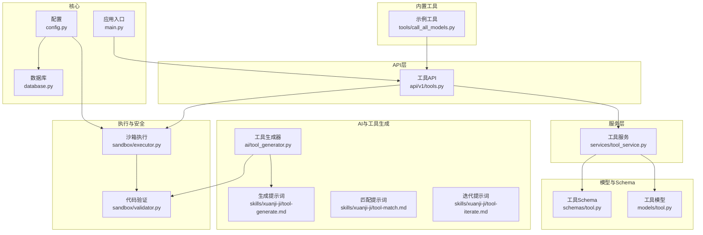
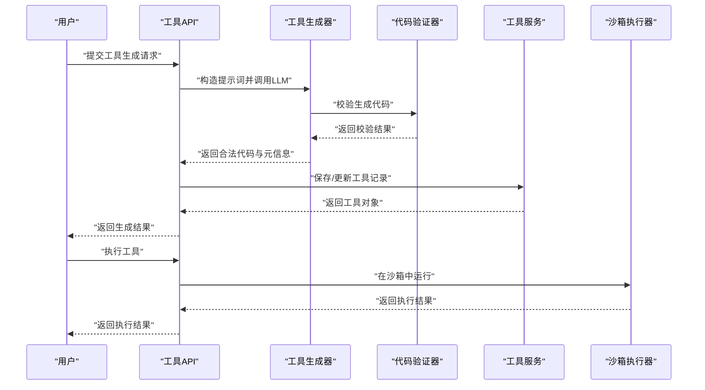
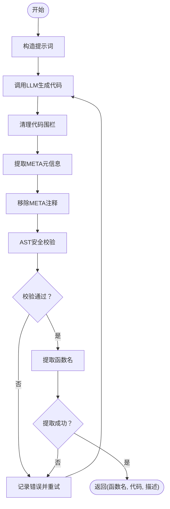
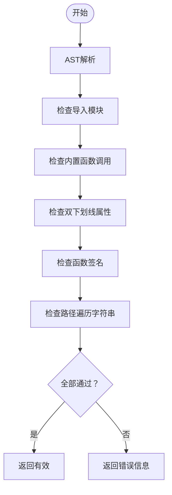
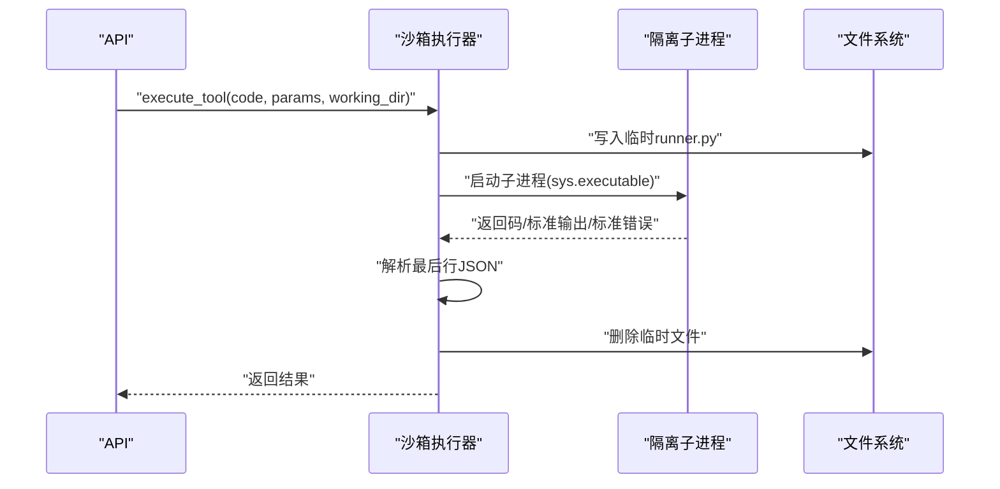
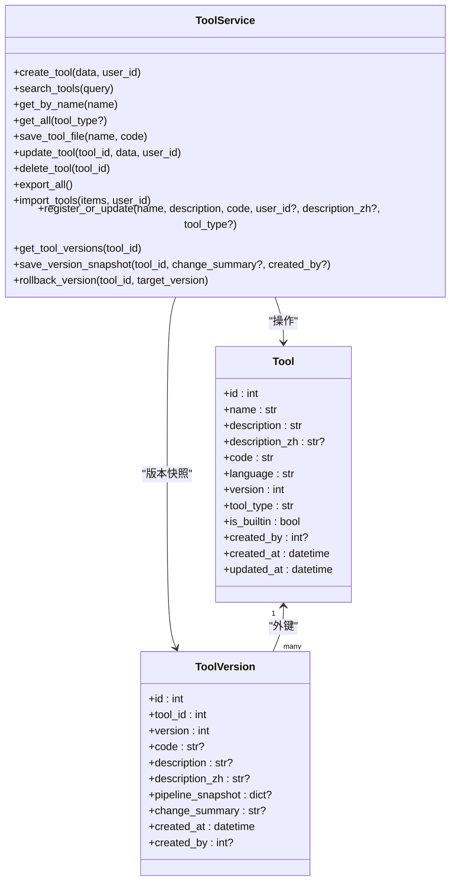
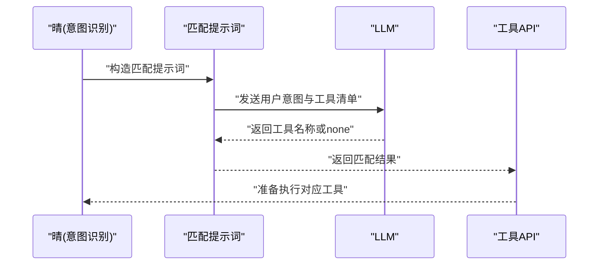
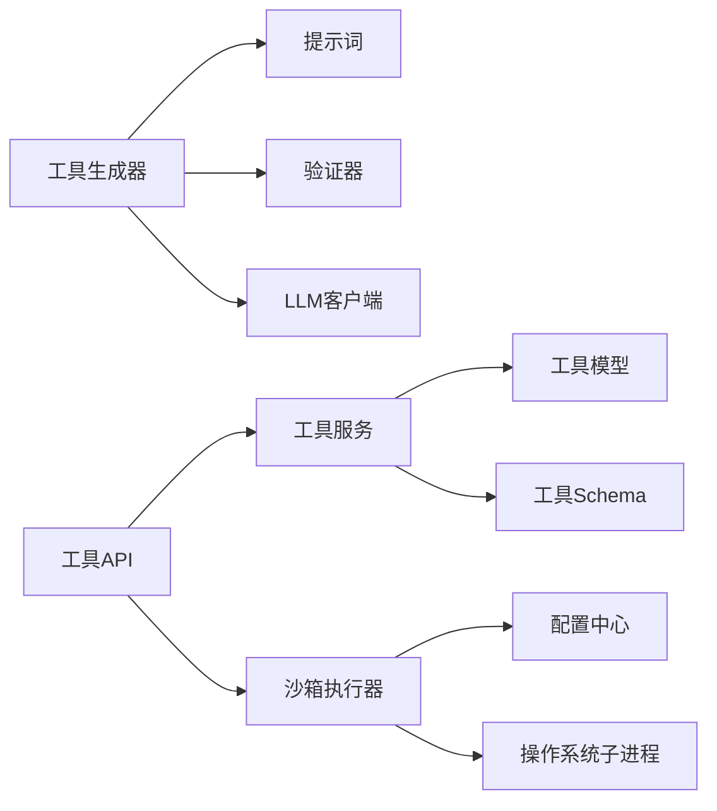

# 工具执行系统

<cite>
**本文引用的文件**
- [backend/app/sandbox/executor.py](file://backend/app/sandbox/executor.py)
- [backend/app/sandbox/validator.py](file://backend/app/sandbox/validator.py)
- [backend/app/ai/tool_generator.py](file://backend/app/ai/tool_generator.py)
- [backend/app/ai/skills/xuanji-ji/tool-generate.md](file://backend/app/ai/skills/xuanji-ji/tool-generate.md)
- [backend/app/ai/skills/xuanji-ji/tool-match.md](file://backend/app/ai/skills/xuanji-ji/tool-match.md)
- [backend/app/ai/skills/xuanji-ji/tool-iterate.md](file://backend/app/ai/skills/xuanji-ji/tool-iterate.md)
- [backend/app/services/tool_service.py](file://backend/app/services/tool_service.py)
- [backend/app/models/tool.py](file://backend/app/models/tool.py)
- [backend/app/schemas/tool.py](file://backend/app/schemas/tool.py)
- [backend/app/api/v1/tools.py](file://backend/app/api/v1/tools.py)
- [backend/app/core/config.py](file://backend/app/core/config.py)
- [backend/app/main.py](file://backend/app/main.py)
- [backend/app/tools/call_all_models.py](file://backend/app/tools/call_all_models.py)
</cite>

## 目录
1. [简介](#简介)
2. [项目结构](#项目结构)
3. [核心组件](#核心组件)
4. [架构总览](#架构总览)
5. [详细组件分析](#详细组件分析)
6. [依赖分析](#依赖分析)
7. [性能考虑](#性能考虑)
8. [故障排查指南](#故障排查指南)
9. [结论](#结论)
10. [附录](#附录)

## 简介
本文件为“工具执行系统”的全面技术文档，聚焦于以下方面：
- 工具生成机制与Python工具自动生成功能
- 沙箱执行环境的安全隔离机制与代码验证规则
- 执行权限控制与超时限制
- 工具匹配算法与版本管理策略
- 错误处理与重试机制
- 工具开发规范、测试方法与性能监控
- 自定义工具开发指南、最佳实践与安全注意事项
- 面向开发者的工具扩展与定制化方案

## 项目结构
后端采用FastAPI框架，按领域分层组织：
- 核心配置与数据库初始化
- API路由与权限控制
- 服务层封装业务逻辑
- 模型与数据结构定义
- 工具沙箱与安全校验
- AI技能与工具生成/匹配/迭代提示词
- 内置工具示例

图表来源
- [backend/app/main.py:1-79](file://backend/app/main.py#L1-L79)
- [backend/app/api/v1/tools.py:1-169](file://backend/app/api/v1/tools.py#L1-L169)
- [backend/app/services/tool_service.py:1-222](file://backend/app/services/tool_service.py#L1-L222)
- [backend/app/models/tool.py:1-64](file://backend/app/models/tool.py#L1-L64)
- [backend/app/schemas/tool.py:1-74](file://backend/app/schemas/tool.py#L1-L74)
- [backend/app/ai/tool_generator.py:1-129](file://backend/app/ai/tool_generator.py#L1-L129)
- [backend/app/ai/skills/xuanji-ji/tool-generate.md:1-36](file://backend/app/ai/skills/xuanji-ji/tool-generate.md#L1-L36)
- [backend/app/ai/skills/xuanji-ji/tool-match.md:1-8](file://backend/app/ai/skills/xuanji-ji/tool-match.md#L1-L8)
- [backend/app/ai/skills/xuanji-ji/tool-iterate.md:1-16](file://backend/app/ai/skills/xuanji-ji/tool-iterate.md#L1-L16)
- [backend/app/sandbox/validator.py:1-95](file://backend/app/sandbox/validator.py#L1-L95)
- [backend/app/sandbox/executor.py:1-101](file://backend/app/sandbox/executor.py#L1-L101)
- [backend/app/tools/call_all_models.py:1-37](file://backend/app/tools/call_all_models.py#L1-L37)

章节来源
- [backend/app/main.py:1-79](file://backend/app/main.py#L1-L79)
- [backend/app/api/v1/tools.py:1-169](file://backend/app/api/v1/tools.py#L1-L169)

## 核心组件
- 工具生成器：基于提示词与LLM生成Python工具代码，进行AST安全校验与元信息提取，并支持多轮重试。
- 代码验证器：通过AST解析禁止危险模块、内置函数与路径遍历等风险点，确保生成代码在白名单范围内。
- 沙箱执行器：在隔离子进程中执行工具，设置工作目录、环境变量与超时，捕获异常并返回JSON结果。
- 工具服务：提供工具的增删改查、导入导出、版本快照与回滚，保障工具生命周期管理。
- 数据模型与Schema：定义工具表结构、版本历史与API响应模型。
- API路由：暴露工具管理接口，配合权限与异常处理中间件。
- 配置中心：集中管理数据库、AI服务与沙箱参数。

章节来源
- [backend/app/ai/tool_generator.py:1-129](file://backend/app/ai/tool_generator.py#L1-L129)
- [backend/app/sandbox/validator.py:1-95](file://backend/app/sandbox/validator.py#L1-L95)
- [backend/app/sandbox/executor.py:1-101](file://backend/app/sandbox/executor.py#L1-L101)
- [backend/app/services/tool_service.py:1-222](file://backend/app/services/tool_service.py#L1-L222)
- [backend/app/models/tool.py:1-64](file://backend/app/models/tool.py#L1-L64)
- [backend/app/schemas/tool.py:1-74](file://backend/app/schemas/tool.py#L1-L74)
- [backend/app/api/v1/tools.py:1-169](file://backend/app/api/v1/tools.py#L1-L169)
- [backend/app/core/config.py:1-68](file://backend/app/core/config.py#L1-L68)

## 架构总览
系统围绕“生成-验证-执行-管理”闭环构建，AI负责生成符合约束的Python工具，验证器确保安全，沙箱执行器隔离运行，服务层持久化与版本化管理，API对外提供统一入口。

图表来源
- [backend/app/ai/tool_generator.py:10-67](file://backend/app/ai/tool_generator.py#L10-L67)
- [backend/app/sandbox/validator.py:33-94](file://backend/app/sandbox/validator.py#L33-L94)
- [backend/app/services/tool_service.py:121-156](file://backend/app/services/tool_service.py#L121-L156)
- [backend/app/sandbox/executor.py:13-101](file://backend/app/sandbox/executor.py#L13-L101)
- [backend/app/api/v1/tools.py:1-169](file://backend/app/api/v1/tools.py#L1-L169)

## 详细组件分析

### 工具生成器与提示词
- 生成流程：构造提示词，调用LLM生成代码，清理Markdown围栏，提取META元信息，移除注释后进行AST安全校验，提取函数名，必要时回填默认英文描述，多轮重试直至通过。
- 提示词约束：限定函数命名、签名、返回结构、允许/禁止的导入与内置函数、HTTP请求使用与超时要求、路径处理建议等。
- 迭代提示：根据执行结果判断是否需要升级，支持返回改进后的完整代码与变更说明。

图表来源
- [backend/app/ai/tool_generator.py:10-67](file://backend/app/ai/tool_generator.py#L10-L67)
- [backend/app/ai/skills/xuanji-ji/tool-generate.md:1-36](file://backend/app/ai/skills/xuanji-ji/tool-generate.md#L1-L36)

章节来源
- [backend/app/ai/tool_generator.py:1-129](file://backend/app/ai/tool_generator.py#L1-L129)
- [backend/app/ai/skills/xuanji-ji/tool-generate.md:1-36](file://backend/app/ai/skills/xuanji-ji/tool-generate.md#L1-L36)
- [backend/app/ai/skills/xuanji-ji/tool-iterate.md:1-16](file://backend/app/ai/skills/xuanji-ji/tool-iterate.md#L1-L16)

### 代码验证器（AST安全校验）
- 模块白名单与黑名单：仅允许部分标准库与特定第三方库（如httpx），禁止os、subprocess、socket、requests等高危模块。
- 内置函数限制：禁止eval/exec/compile/__import__/getattr/setattr/delattr/breakpoint/exit/quit等。
- 结构检查：必须存在函数定义、且形参为单个字典；禁止双下划线访问；字符串字面量禁止路径遍历。
- 输出：返回校验结果与错误信息。

图表来源
- [backend/app/sandbox/validator.py:33-94](file://backend/app/sandbox/validator.py#L33-L94)

章节来源
- [backend/app/sandbox/validator.py:1-95](file://backend/app/sandbox/validator.py#L1-L95)

### 沙箱执行器（隔离执行）
- 工作目录：可指定沙箱目录，默认来自配置；不存在则创建。
- 函数识别：通过AST解析提取首个函数名作为入口。
- 运行脚本：动态拼装runner脚本，加载工具代码，读取JSON参数，调用函数并打印最终一行JSON结果。
- 子进程隔离：Windows下使用进程组避免控制台信号影响；设置超时、隔离环境变量（清空PYTHONPATH、设置HOME/TEMP/TMP等）、工作目录。
- 结果解析：捕获stderr、超时、JSON解析错误；清理临时文件。

图表来源
- [backend/app/sandbox/executor.py:13-101](file://backend/app/sandbox/executor.py#L13-L101)
- [backend/app/core/config.py:44-46](file://backend/app/core/config.py#L44-L46)

章节来源
- [backend/app/sandbox/executor.py:1-101](file://backend/app/sandbox/executor.py#L1-L101)
- [backend/app/core/config.py:1-68](file://backend/app/core/config.py#L1-L68)

### 工具服务与版本管理
- 工具CRUD：创建、搜索、按名称获取、分页列表、更新（自动保存版本快照）、删除（禁止内置工具）。
- 导入导出：批量导入/导出工具，自动处理重复与内置工具跳过。
- 版本快照：保存当前版本状态，支持回滚到目标版本，回滚前先备份当前状态。
- 文件落盘：注册/更新工具时同步写入backend/app/tools目录下的Python文件，便于直接调用与调试。

图表来源
- [backend/app/models/tool.py:9-64](file://backend/app/models/tool.py#L9-L64)
- [backend/app/services/tool_service.py:11-222](file://backend/app/services/tool_service.py#L11-L222)

章节来源
- [backend/app/services/tool_service.py:1-222](file://backend/app/services/tool_service.py#L1-L222)
- [backend/app/models/tool.py:1-64](file://backend/app/models/tool.py#L1-L64)
- [backend/app/schemas/tool.py:1-74](file://backend/app/schemas/tool.py#L1-L74)

### 工具匹配算法
- 匹配思路：将用户意图与可用工具列表交给LLM，由LLM选择最合适的工具名称或“none”，用于后续执行。
- 输入：用户意图描述、工具清单（名称、描述等）。
- 输出：工具名称或“none”。

图表来源
- [backend/app/ai/skills/xuanji-ji/tool-match.md:1-8](file://backend/app/ai/skills/xuanji-ji/tool-match.md#L1-L8)

章节来源
- [backend/app/ai/skills/xuanji-ji/tool-match.md:1-8](file://backend/app/ai/skills/xuanji-ji/tool-match.md#L1-L8)

### API与权限控制
- 路由：提供工具列表、搜索、创建、详情、更新、删除、导出、导入、版本查询、回滚等接口。
- 权限：依赖依赖注入获取当前用户，更新/删除/回滚需鉴权。
- 异常：统一处理Pydantic验证错误，返回中文友好提示。

章节来源
- [backend/app/api/v1/tools.py:1-169](file://backend/app/api/v1/tools.py#L1-L169)
- [backend/app/main.py:43-59](file://backend/app/main.py#L43-L59)

### 内置工具示例
- 示例工具：提供一个模拟查询所有模型状态的工具，演示返回结构与错误处理模式，便于开发者参考。

章节来源
- [backend/app/tools/call_all_models.py:1-37](file://backend/app/tools/call_all_models.py#L1-L37)

## 依赖分析
- 组件耦合
  - 工具生成器依赖提示词与验证器，调用LLM客户端。
  - 工具服务依赖模型与Schema，持久化工具与版本。
  - API路由依赖服务层，提供统一接口。
  - 沙箱执行器依赖配置中心与操作系统子进程能力。
- 外部依赖
  - 数据库：MySQL（SQLAlchemy）。
  - AI服务：本地Ollama或在线LLM（配置项）。
  - HTTP客户端：httpx（经验证器允许）。
- 循环依赖
  - 未发现循环导入；各层职责清晰。

图表来源
- [backend/app/ai/tool_generator.py:1-129](file://backend/app/ai/tool_generator.py#L1-L129)
- [backend/app/sandbox/validator.py:1-95](file://backend/app/sandbox/validator.py#L1-L95)
- [backend/app/services/tool_service.py:1-222](file://backend/app/services/tool_service.py#L1-L222)
- [backend/app/api/v1/tools.py:1-169](file://backend/app/api/v1/tools.py#L1-L169)
- [backend/app/sandbox/executor.py:1-101](file://backend/app/sandbox/executor.py#L1-L101)
- [backend/app/core/config.py:1-68](file://backend/app/core/config.py#L1-L68)

章节来源
- [backend/app/ai/tool_generator.py:1-129](file://backend/app/ai/tool_generator.py#L1-L129)
- [backend/app/services/tool_service.py:1-222](file://backend/app/services/tool_service.py#L1-L222)
- [backend/app/api/v1/tools.py:1-169](file://backend/app/api/v1/tools.py#L1-L169)
- [backend/app/sandbox/executor.py:1-101](file://backend/app/sandbox/executor.py#L1-L101)
- [backend/app/core/config.py:1-68](file://backend/app/core/config.py#L1-L68)

## 性能考虑
- 沙箱超时：默认超时时间可配置，防止长时间阻塞。
- 子进程隔离：避免父进程信号传播，减少意外中断。
- I/O与临时文件：使用系统临时目录写入runner脚本，执行后清理，降低磁盘污染。
- 数据库连接池：启用预检以提升连接稳定性。
- LLM调用：温度与提示词设计降低无效生成次数，提高成功率。

章节来源
- [backend/app/core/config.py:44-46](file://backend/app/core/config.py#L44-L46)
- [backend/app/sandbox/executor.py:64-79](file://backend/app/sandbox/executor.py#L64-L79)
- [backend/app/core/database.py:6-7](file://backend/app/core/database.py#L6-L7)

## 故障排查指南
- 生成失败
  - 现象：多次重试后仍失败。
  - 排查：查看上一轮错误信息，确认提示词是否满足约束；检查META注释与函数签名。
- 验证失败
  - 现象：返回“被阻止的导入/内置函数/路径遍历”等错误。
  - 排查：核对导入模块是否在白名单；避免使用禁止的内置函数；避免字符串字面量出现路径遍历。
- 执行失败
  - 现象：子进程返回非零码、超时、无输出或JSON解析失败。
  - 排查：检查沙箱目录权限与空间；确认函数返回结构为JSON可序列化；缩短耗时操作或增加超时。
- API异常
  - 现象：参数校验失败返回中文提示。
  - 排查：对照Schema字段与类型，修正请求体。

章节来源
- [backend/app/ai/tool_generator.py:30-67](file://backend/app/ai/tool_generator.py#L30-L67)
- [backend/app/sandbox/validator.py:33-94](file://backend/app/sandbox/validator.py#L33-L94)
- [backend/app/sandbox/executor.py:81-98](file://backend/app/sandbox/executor.py#L81-L98)
- [backend/app/main.py:43-59](file://backend/app/main.py#L43-L59)

## 结论
该系统通过“提示词+LLM+AST校验+沙箱执行+服务化管理”的闭环，实现了安全可控的工具自动生成与执行。验证器与沙箱共同构成安全防线，服务层提供完善的版本与生命周期管理，API层提供一致的对外接口。建议在生产环境进一步强化日志审计、资源配额与并发控制，并持续优化提示词以提升生成质量与稳定性。

## 附录

### 开发规范与最佳实践
- 工具命名：使用下划线风格，函数签名固定为接收字典参数并返回统一结构。
- 安全约束：仅使用白名单模块与内置函数；避免路径遍历；网络请求必须设置超时。
- 返回约定：始终返回包含success与result键的字典；错误时包含明确的错误信息。
- 文档与元信息：在代码末尾添加META注释，提供英文与中文描述。
- 测试方法：编写单元测试覆盖边界条件与异常分支；使用示例工具作为参照。
- 性能监控：关注沙箱超时、数据库慢查询与LLM响应时间；建立告警阈值。

### 自定义工具开发指南
- 步骤
  - 在前端或后端调用工具生成接口，提供任务描述、目标路径与参数。
  - 生成器将返回通过验证的工具代码与元信息。
  - 使用工具API注册或更新工具，服务层会保存版本快照并写入文件。
  - 通过工具API执行工具，沙箱执行器隔离运行并返回结果。
- 注意事项
  - 不要使用被禁止的模块与内置函数。
  - 对外部依赖（如HTTP）做好错误处理与超时控制。
  - 如需迭代，使用迭代提示词生成改进版代码并回滚验证。

章节来源
- [backend/app/ai/skills/xuanji-ji/tool-generate.md:1-36](file://backend/app/ai/skills/xuanji-ji/tool-generate.md#L1-L36)
- [backend/app/ai/skills/xuanji-ji/tool-iterate.md:1-16](file://backend/app/ai/skills/xuanji-ji/tool-iterate.md#L1-L16)
- [backend/app/services/tool_service.py:121-156](file://backend/app/services/tool_service.py#L121-L156)
- [backend/app/api/v1/tools.py:1-169](file://backend/app/api/v1/tools.py#L1-L169)
- [backend/app/sandbox/executor.py:13-101](file://backend/app/sandbox/executor.py#L13-L101)