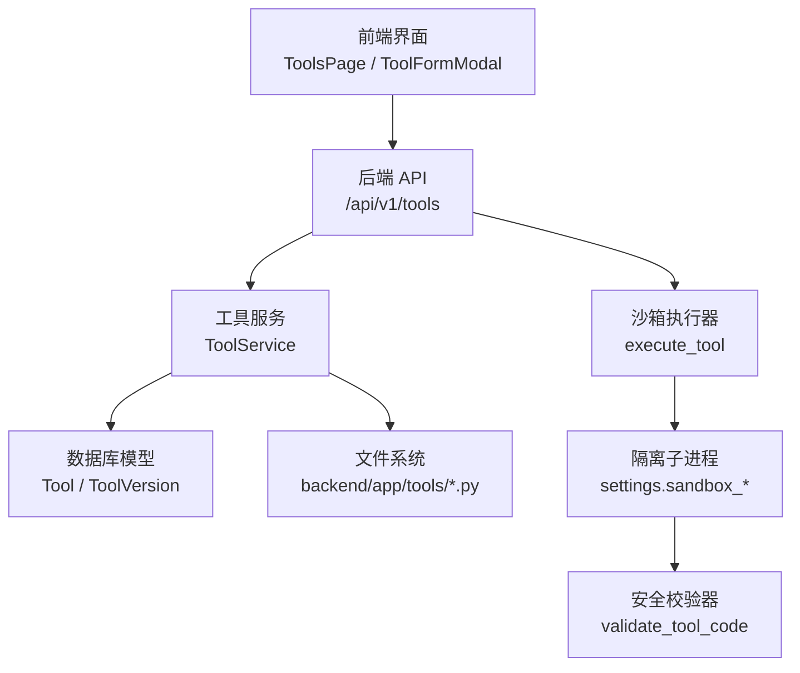
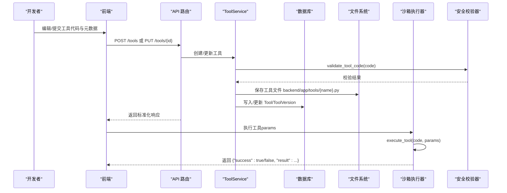
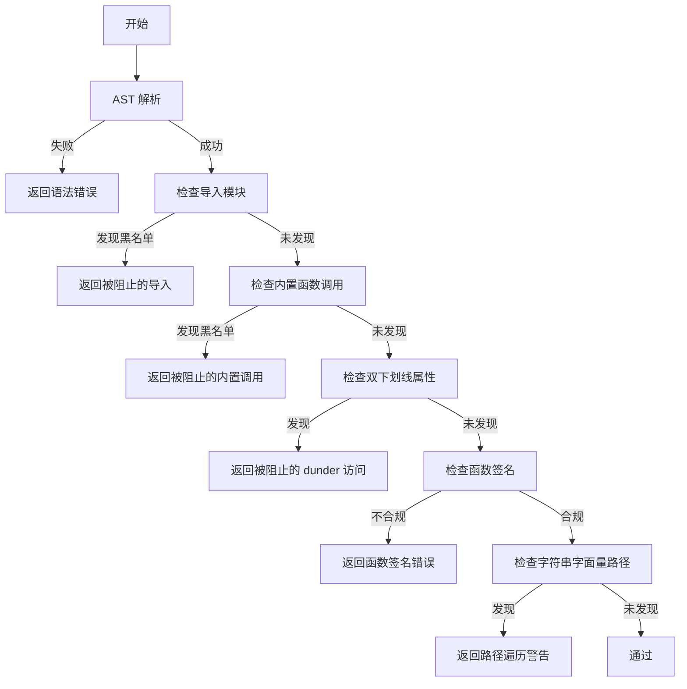
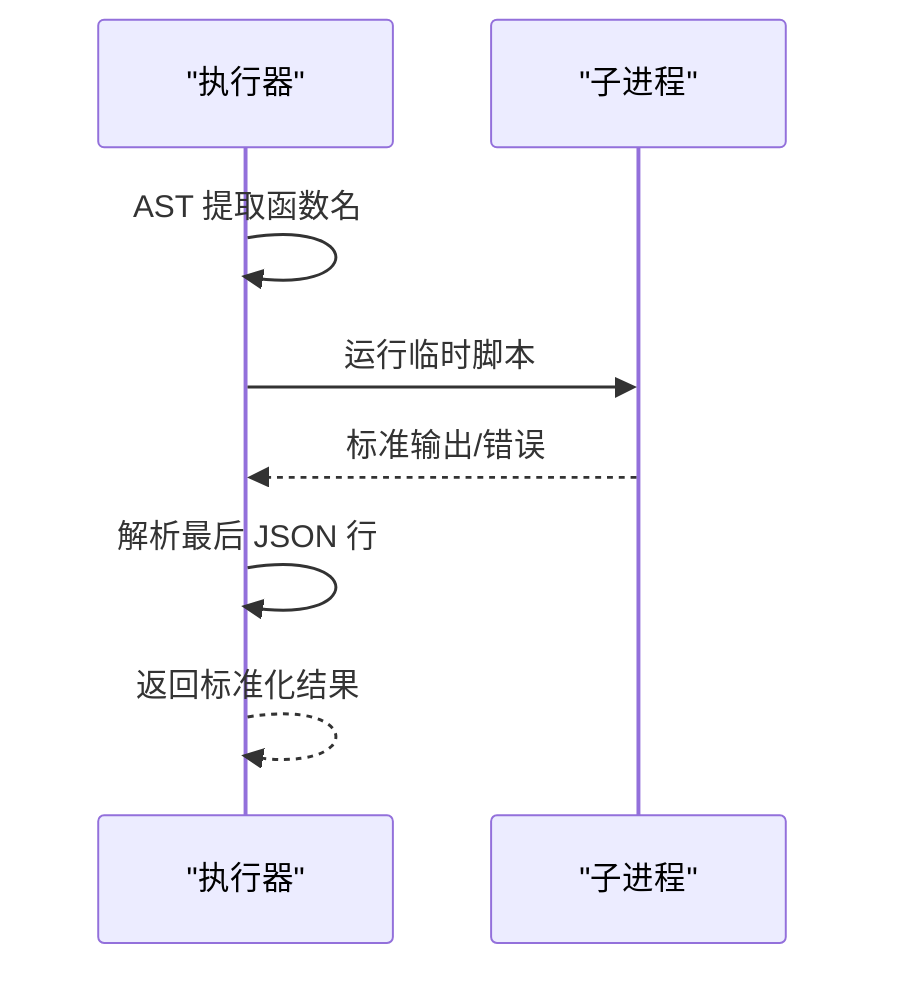
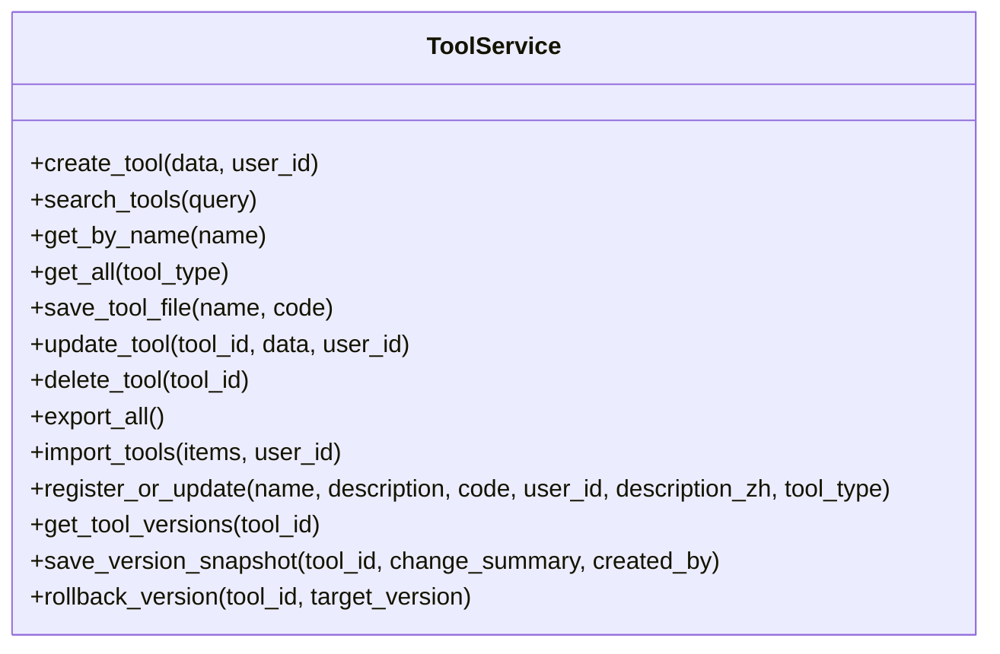
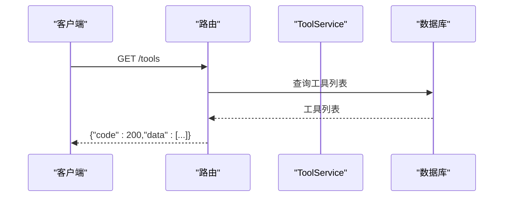
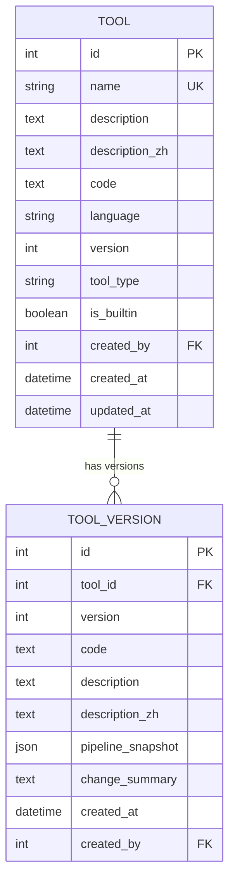
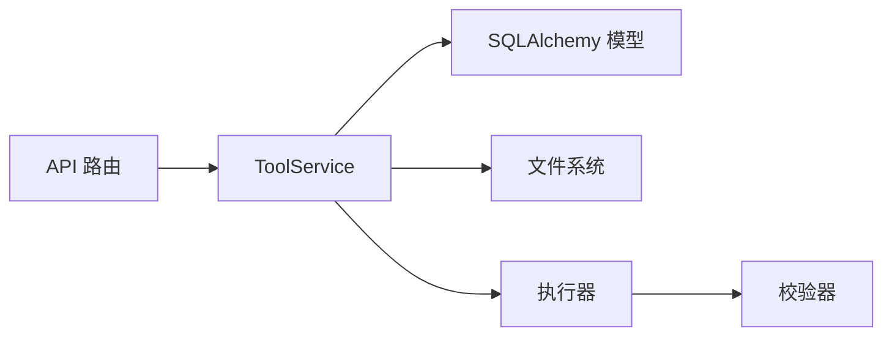

# 自定义工具开发

<cite>
**本文引用的文件**
- [backend/app/sandbox/validator.py](file://backend/app/sandbox/validator.py)
- [backend/app/sandbox/executor.py](file://backend/app/sandbox/executor.py)
- [backend/app/services/tool_service.py](file://backend/app/services/tool_service.py)
- [backend/app/api/v1/tools.py](file://backend/app/api/v1/tools.py)
- [backend/app/models/tool.py](file://backend/app/models/tool.py)
- [backend/app/schemas/tool.py](file://backend/app/schemas/tool.py)
- [backend/app/tools/call_all_models.py](file://backend/app/tools/call_all_models.py)
- [backend/app/tools/check_tomorrow_weather.py](file://backend/app/tools/check_tomorrow_weather.py)
- [backend/app/tools/get_current_time.py](file://backend/app/tools/get_current_time.py)
- [backend/app/tools/query_weather.py](file://backend/app/tools/query_weather.py)
- [backend/app/tools/get_weather_info.py](file://backend/app/tools/get_weather_info.py)
- [backend/app/tools/get_weather_today.py](file://backend/app/tools/get_weather_today.py)
- [backend/app/tools/get_weather_forecast.py](file://backend/app/tools/get_weather_forecast.py)
- [backend/app/tools/get_current_location.py](file://backend/app/tools/get_current_location.py)
- [backend/app/tools/query_current_time.py](file://backend/app/tools/query_current_time.py)
- [backend/app/tools/get_tomorrow_weather.py](file://backend/app/tools/get_tomorrow_weather.py)
</cite>

## 目录
1. [简介](#简介)
2. [项目结构](#项目结构)
3. [核心组件](#核心组件)
4. [架构总览](#架构总览)
5. [详细组件分析](#详细组件分析)
6. [依赖分析](#依赖分析)
7. [性能考虑](#性能考虑)
8. [故障排查指南](#故障排查指南)
9. [结论](#结论)
10. [附录](#附录)

## 简介
本指南面向开发者，提供在 XuanJi 平台上从零开始开发与部署“自定义工具”的完整方案。内容覆盖 Python 工具开发规范、函数签名与输入输出格式、工具元数据与描述信息、参数定义规范、安全校验与沙箱执行、版本管理与回滚、API 接口设计与测试方法、部署与集成流程，以及最佳实践、常见陷阱与调试技巧。

## 项目结构
XuanJi 的工具体系由“前端界面 + 后端 API + 工具服务 + 沙箱执行器 + 安全校验器 + 数据模型/模式”构成。工具代码以 Python 函数形式存在，统一保存于 backend/app/tools 目录，并通过数据库持久化工具元数据与版本快照。

图表来源
- [backend/app/api/v1/tools.py:1-169](file://backend/app/api/v1/tools.py#L1-L169)
- [backend/app/services/tool_service.py:1-222](file://backend/app/services/tool_service.py#L1-L222)
- [backend/app/models/tool.py:1-64](file://backend/app/models/tool.py#L1-L64)
- [backend/app/sandbox/executor.py:1-101](file://backend/app/sandbox/executor.py#L1-L101)
- [backend/app/sandbox/validator.py:1-95](file://backend/app/sandbox/validator.py#L1-L95)

章节来源
- [backend/app/api/v1/tools.py:1-169](file://backend/app/api/v1/tools.py#L1-L169)
- [backend/app/services/tool_service.py:1-222](file://backend/app/services/tool_service.py#L1-L222)
- [backend/app/models/tool.py:1-64](file://backend/app/models/tool.py#L1-L64)
- [backend/app/sandbox/executor.py:1-101](file://backend/app/sandbox/executor.py#L1-L101)
- [backend/app/sandbox/validator.py:1-95](file://backend/app/sandbox/validator.py#L1-L95)

## 核心组件
- 工具安全校验器：基于 AST 分析，限制导入模块、内置函数与路径遍历风险，强制函数签名与参数规范。
- 沙箱执行器：在隔离子进程中执行工具代码，捕获输出并返回标准化结果。
- 工具服务：负责工具的增删改查、导入导出、版本快照与回滚。
- API 层：提供工具的 REST 接口，统一返回结构。
- 数据模型与模式：定义工具表、版本表及导入/导出/响应模式。

章节来源
- [backend/app/sandbox/validator.py:1-95](file://backend/app/sandbox/validator.py#L1-L95)
- [backend/app/sandbox/executor.py:1-101](file://backend/app/sandbox/executor.py#L1-L101)
- [backend/app/services/tool_service.py:1-222](file://backend/app/services/tool_service.py#L1-L222)
- [backend/app/api/v1/tools.py:1-169](file://backend/app/api/v1/tools.py#L1-L169)
- [backend/app/models/tool.py:1-64](file://backend/app/models/tool.py#L1-L64)
- [backend/app/schemas/tool.py:1-74](file://backend/app/schemas/tool.py#L1-L74)

## 架构总览
下图展示工具从“注册/更新”到“沙箱执行”的完整链路，包括安全校验与版本管理。

图表来源
- [backend/app/api/v1/tools.py:37-137](file://backend/app/api/v1/tools.py#L37-L137)
- [backend/app/services/tool_service.py:15-156](file://backend/app/services/tool_service.py#L15-L156)
- [backend/app/sandbox/validator.py:33-94](file://backend/app/sandbox/validator.py#L33-L94)
- [backend/app/sandbox/executor.py:13-93](file://backend/app/sandbox/executor.py#L13-L93)

## 详细组件分析

### 安全校验器（validator.py）
- 功能要点
  - 语法解析：AST 解析失败直接拒绝。
  - 导入白名单：仅允许部分内置模块与特定第三方库；禁止网络访问类模块。
  - 内置函数黑名单：禁用危险内置函数。
  - 双下划线属性访问限制：防止 dunder 访问。
  - 函数签名约束：必须有且仅有名为 params 的单参函数。
  - 路径遍历检测：对字符串字面量中的路径进行扫描。
- 失败返回：返回布尔值与错误信息，便于 API 层提示。

图表来源
- [backend/app/sandbox/validator.py:33-94](file://backend/app/sandbox/validator.py#L33-L94)

章节来源
- [backend/app/sandbox/validator.py:1-95](file://backend/app/sandbox/validator.py#L1-L95)

### 沙箱执行器（executor.py）
- 功能要点
  - 从代码中提取函数名，动态生成运行脚本。
  - 使用临时文件写入运行脚本，避免触发开发服务器热重载。
  - 子进程隔离执行，设置超时、工作目录与环境变量。
  - 标准化输出解析：仅读取最后一行 JSON。
  - 统一错误处理：超时、执行错误、JSON 解析失败。
- 输出格式
  - 成功：{"success": true, "result": {...}}
  - 失败：{"success": false, "result": "错误信息"}

图表来源
- [backend/app/sandbox/executor.py:13-93](file://backend/app/sandbox/executor.py#L13-L93)

章节来源
- [backend/app/sandbox/executor.py:1-101](file://backend/app/sandbox/executor.py#L1-L101)

### 工具服务（tool_service.py）
- 功能要点
  - 工具 CRUD：创建、搜索、按名称查询、分页列表、更新、删除。
  - 文件落盘：将工具代码保存至 backend/app/tools/{name}.py。
  - 版本管理：保存版本快照、查询版本历史、回滚到指定版本。
  - 导入导出：支持批量导入/导出工具条目。
- 权限与安全
  - 禁止编辑/删除内置工具。
  - 更新前自动保存版本快照。

图表来源
- [backend/app/services/tool_service.py:11-222](file://backend/app/services/tool_service.py#L11-L222)

章节来源
- [backend/app/services/tool_service.py:1-222](file://backend/app/services/tool_service.py#L1-L222)

### API 层（tools.py）
- 功能要点
  - 列表、搜索、创建、更新、删除、导出、导入、版本列表、回滚。
  - 统一响应结构：{"code": 200, "message": "...", "data": ...}。
- 路由组织
  - 固定路径优先于带参数路径，避免冲突。

图表来源
- [backend/app/api/v1/tools.py:25-66](file://backend/app/api/v1/tools.py#L25-L66)

章节来源
- [backend/app/api/v1/tools.py:1-169](file://backend/app/api/v1/tools.py#L1-L169)

### 数据模型与模式（models/tool.py, schemas/tool.py）
- 数据模型
  - Tool：工具元数据、语言、类型、版本、创建者、时间戳。
  - ToolVersion：版本快照，记录每次变更的代码与描述。
- Pydantic 模式
  - ToolCreate/ToolUpdate/ToolImportItem/ToolExportItem/ToolResponse/ToolVersionResponse

图表来源
- [backend/app/models/tool.py:9-63](file://backend/app/models/tool.py#L9-L63)
- [backend/app/schemas/tool.py:7-73](file://backend/app/schemas/tool.py#L7-L73)

章节来源
- [backend/app/models/tool.py:1-64](file://backend/app/models/tool.py#L1-L64)
- [backend/app/schemas/tool.py:1-74](file://backend/app/schemas/tool.py#L1-L74)

### 工具示例与规范对照
- 函数签名
  - 必须定义一个名为 params 的单参函数，参数类型为字典。
  - 返回值必须为字典，包含 success 与 result 字段。
- 输入输出格式
  - 成功：{"success": true, "result": {...}}
  - 失败：{"success": false, "result": "错误信息"}
- 参数定义
  - 通过 params 字典传入工具所需参数；如需城市、时间等，均作为键值传入。
- 元数据与描述
  - name、description、description_zh、language、tool_type、version 等字段用于工具注册与展示。

章节来源
- [backend/app/sandbox/validator.py:78-87](file://backend/app/sandbox/validator.py#L78-L87)
- [backend/app/tools/get_current_time.py:3-17](file://backend/app/tools/get_current_time.py#L3-L17)
- [backend/app/tools/check_tomorrow_weather.py:5-57](file://backend/app/tools/check_tomorrow_weather.py#L5-L57)
- [backend/app/tools/query_weather.py:5-66](file://backend/app/tools/query_weather.py#L5-L66)
- [backend/app/tools/get_weather_info.py:5-56](file://backend/app/tools/get_weather_info.py#L5-L56)
- [backend/app/tools/get_weather_today.py:4-51](file://backend/app/tools/get_weather_today.py#L4-L51)
- [backend/app/tools/get_weather_forecast.py:5-54](file://backend/app/tools/get_weather_forecast.py#L5-L54)
- [backend/app/tools/get_current_location.py:1-42](file://backend/app/tools/get_current_location.py#L1-L42)
- [backend/app/tools/query_current_time.py:3-18](file://backend/app/tools/query_current_time.py#L3-L18)
- [backend/app/tools/get_tomorrow_weather.py:5-59](file://backend/app/tools/get_tomorrow_weather.py#L5-L59)
- [backend/app/schemas/tool.py:7-54](file://backend/app/schemas/tool.py#L7-L54)

## 依赖分析
- 组件耦合
  - API 层依赖 ToolService；ToolService 依赖数据库与文件系统；执行器与校验器独立但被服务层调用。
- 外部依赖
  - httpx 用于网络请求（工具示例）。
  - SQLAlchemy 用于 ORM。
  - FastAPI 用于 API 路由。
- 安全边界
  - 校验器与执行器共同构成安全边界，防止任意代码执行。

图表来源
- [backend/app/api/v1/tools.py:1-169](file://backend/app/api/v1/tools.py#L1-L169)
- [backend/app/services/tool_service.py:1-222](file://backend/app/services/tool_service.py#L1-L222)
- [backend/app/sandbox/executor.py:1-101](file://backend/app/sandbox/executor.py#L1-L101)
- [backend/app/sandbox/validator.py:1-95](file://backend/app/sandbox/validator.py#L1-L95)

章节来源
- [backend/app/api/v1/tools.py:1-169](file://backend/app/api/v1/tools.py#L1-L169)
- [backend/app/services/tool_service.py:1-222](file://backend/app/services/tool_service.py#L1-L222)
- [backend/app/sandbox/executor.py:1-101](file://backend/app/sandbox/executor.py#L1-L101)
- [backend/app/sandbox/validator.py:1-95](file://backend/app/sandbox/validator.py#L1-L95)

## 性能考虑
- 执行超时与资源限制
  - 沙箱执行器内置超时控制，避免长时间阻塞。
- 网络请求优化
  - 工具示例中对第三方 API 的请求设置了合理超时；建议在工具内部也做重试与降级策略。
- 数据库查询
  - 列表与搜索接口限制了返回数量，避免过载。
- 文件落盘
  - 工具文件保存在 backend/app/tools 目录，注意磁盘空间与权限。

[本节为通用指导，无需列出章节来源]

## 故障排查指南
- 校验失败
  - 检查导入模块是否在白名单内；确认未使用被禁用的内置函数；确保函数签名符合要求。
- 执行失败
  - 查看子进程 stderr；确认返回值为合法 JSON；检查超时设置。
- API 错误
  - 关注统一响应结构中的 message 与 data；根据状态码定位问题。
- 版本回滚
  - 使用版本接口查看历史；选择目标版本进行回滚。

章节来源
- [backend/app/sandbox/validator.py:33-94](file://backend/app/sandbox/validator.py#L33-L94)
- [backend/app/sandbox/executor.py:55-100](file://backend/app/sandbox/executor.py#L55-L100)
- [backend/app/api/v1/tools.py:140-168](file://backend/app/api/v1/tools.py#L140-L168)
- [backend/app/services/tool_service.py:160-221](file://backend/app/services/tool_service.py#L160-L221)

## 结论
通过统一的工具开发规范、严格的安全校验、可靠的沙箱执行与完善的版本管理，XuanJi 提供了可扩展、可审计、可回滚的自定义工具平台。开发者只需遵循函数签名与输入输出约定，即可快速构建并上线工具。

[本节为总结性内容，无需列出章节来源]

## 附录

### 开发规范与最佳实践
- 函数签名
  - 必须定义一个名为 params 的单参函数，参数类型为字典。
  - 返回值必须为字典，包含 success 与 result 字段。
- 输入参数
  - 通过 params 传递工具所需参数；保持键名清晰、语义明确。
- 输出格式
  - 成功：{"success": true, "result": {...}}
  - 失败：{"success": false, "result": "错误信息"}
- 描述信息
  - 提供英文与中文描述（description 与 description_zh），便于多语言展示。
- 工具类型
  - 默认 atomic；复合工具可通过 composition 机制组合多个原子工具。
- 安全与健壮性
  - 避免网络访问类模块（如 http、requests）；使用允许的库（如 httpx）。
  - 处理超时与异常，返回明确的错误信息。
- 版本管理
  - 更新工具会自动保存版本快照；必要时回滚到历史版本。

章节来源
- [backend/app/sandbox/validator.py:33-94](file://backend/app/sandbox/validator.py#L33-L94)
- [backend/app/schemas/tool.py:7-54](file://backend/app/schemas/tool.py#L7-L54)
- [backend/app/services/tool_service.py:169-221](file://backend/app/services/tool_service.py#L169-L221)

### API 接口清单
- 列表与搜索
  - GET /tools
  - GET /tools/search?q={query}
- 创建与更新
  - POST /tools
  - PUT /tools/{tool_id}
- 删除与详情
  - GET /tools/{tool_id}
  - DELETE /tools/{tool_id}
- 导入导出
  - GET /tools/export
  - POST /tools/import
- 版本管理
  - GET /tools/{tool_id}/versions
  - POST /tools/{tool_id}/rollback/{version}

章节来源
- [backend/app/api/v1/tools.py:25-168](file://backend/app/api/v1/tools.py#L25-L168)

### 测试方法与示例
- 单元测试
  - 针对工具函数的输入输出进行断言；模拟 params 与预期结果。
- 集成测试
  - 通过 API 路由创建/更新工具，再调用沙箱执行器验证返回格式与业务逻辑。
- 示例参考
  - 时间类工具：[get_current_time.py:1-17](file://backend/app/tools/get_current_time.py#L1-L17)、[query_current_time.py:1-18](file://backend/app/tools/query_current_time.py#L1-L18)
  - 天气类工具：[check_tomorrow_weather.py:1-57](file://backend/app/tools/check_tomorrow_weather.py#L1-L57)、[query_weather.py:1-66](file://backend/app/tools/query_weather.py#L1-L66)、[get_weather_info.py:1-56](file://backend/app/tools/get_weather_info.py#L1-L56)、[get_weather_today.py:1-51](file://backend/app/tools/get_weather_today.py#L1-L51)、[get_weather_forecast.py:1-54](file://backend/app/tools/get_weather_forecast.py#L1-L54)、[get_tomorrow_weather.py:1-59](file://backend/app/tools/get_tomorrow_weather.py#L1-L59)
  - 地理位置类工具：[get_current_location.py:1-42](file://backend/app/tools/get_current_location.py#L1-L42)
  - 模型状态类工具：[call_all_models.py:1-37](file://backend/app/tools/call_all_models.py#L1-L37)

章节来源
- [backend/app/tools/get_current_time.py:1-17](file://backend/app/tools/get_current_time.py#L1-L17)
- [backend/app/tools/query_current_time.py:1-18](file://backend/app/tools/query_current_time.py#L1-L18)
- [backend/app/tools/check_tomorrow_weather.py:1-57](file://backend/app/tools/check_tomorrow_weather.py#L1-L57)
- [backend/app/tools/query_weather.py:1-66](file://backend/app/tools/query_weather.py#L1-L66)
- [backend/app/tools/get_weather_info.py:1-56](file://backend/app/tools/get_weather_info.py#L1-L56)
- [backend/app/tools/get_weather_today.py:1-51](file://backend/app/tools/get_weather_today.py#L1-L51)
- [backend/app/tools/get_weather_forecast.py:1-54](file://backend/app/tools/get_weather_forecast.py#L1-L54)
- [backend/app/tools/get_tomorrow_weather.py:1-59](file://backend/app/tools/get_tomorrow_weather.py#L1-L59)
- [backend/app/tools/get_current_location.py:1-42](file://backend/app/tools/get_current_location.py#L1-L42)
- [backend/app/tools/call_all_models.py:1-37](file://backend/app/tools/call_all_models.py#L1-L37)

### 常见陷阱与调试技巧
- 陷阱
  - 使用被禁用模块或内置函数导致校验失败。
  - 函数签名不符合要求（参数个数、命名）。
  - 返回值不是合法 JSON。
  - 未处理网络请求异常与超时。
- 调试技巧
  - 在本地打印中间结果，确认 params 结构与返回值格式。
  - 使用最小化示例先行验证，逐步增加复杂度。
  - 通过 API 导入导出工具，复现问题并对比差异。

[本节为经验性内容，无需列出章节来源]