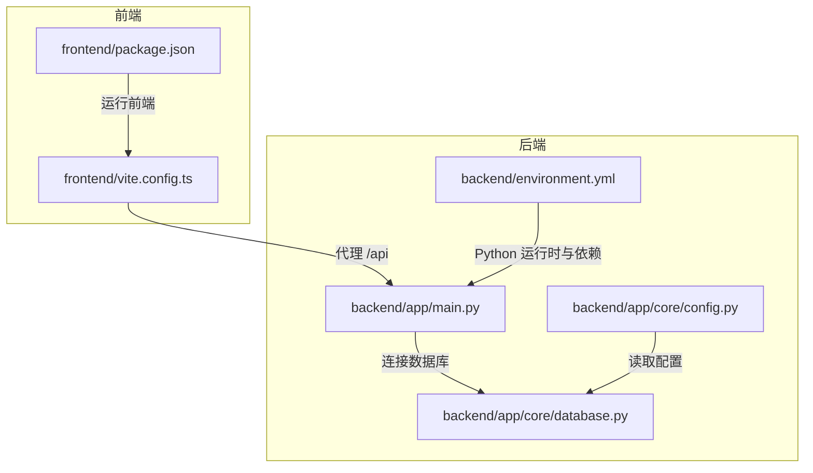
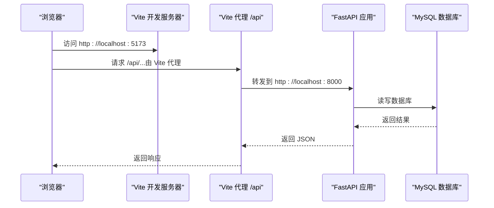
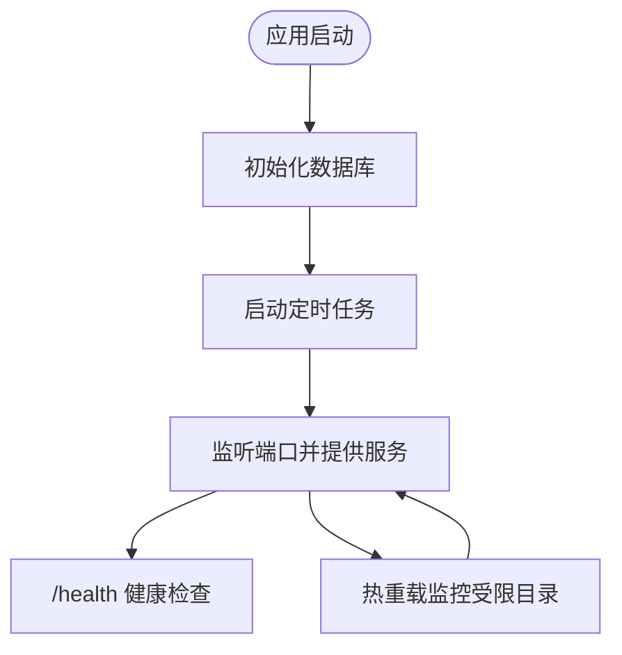
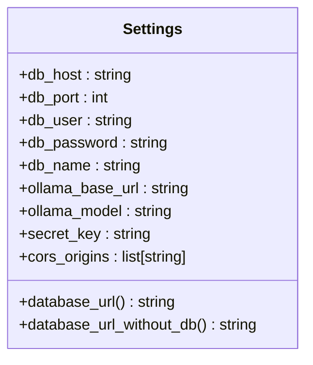
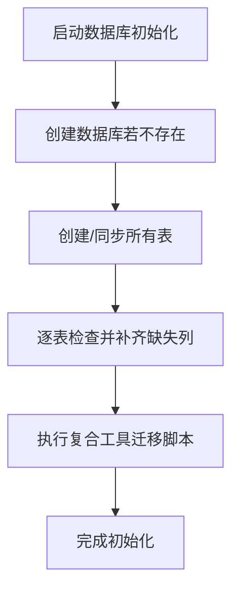
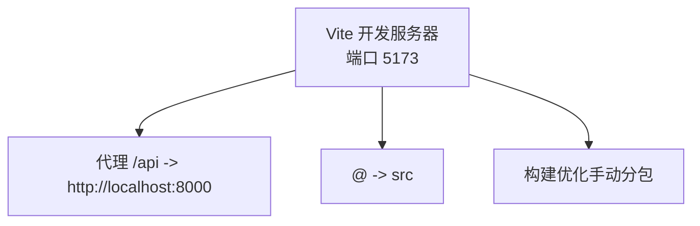
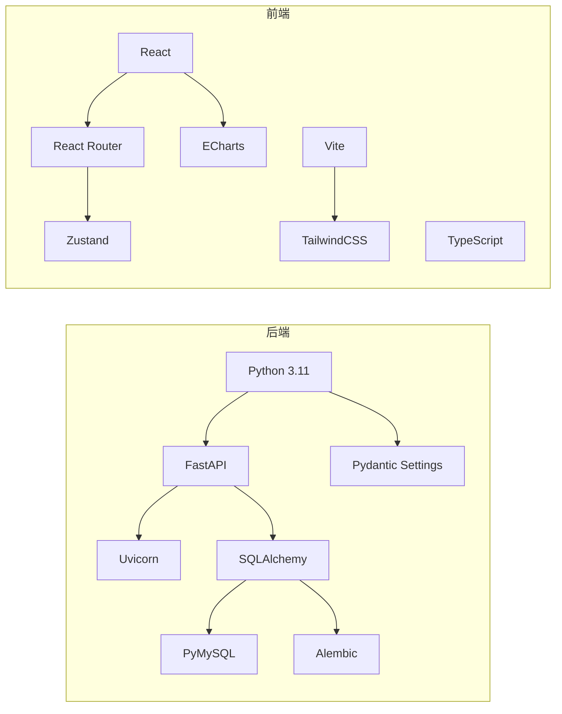

# 快速开始

<cite>
**本文引用的文件**
- [backend/environment.yml](file://backend/environment.yml)
- [backend/app/main.py](file://backend/app/main.py)
- [backend/app/core/config.py](file://backend/app/core/config.py)
- [backend/app/core/database.py](file://backend/app/core/database.py)
- [backend/app/core/migrate_composite.py](file://backend/app/core/migrate_composite.py)
- [backend/.watchfilesignore](file://backend/.watchfilesignore)
- [frontend/package.json](file://frontend/package.json)
- [frontend/vite.config.ts](file://frontend/vite.config.ts)
- [frontend/README.md](file://frontend/README.md)
</cite>

## 目录
1. [简介](#简介)
2. [项目结构](#项目结构)
3. [核心组件](#核心组件)
4. [架构总览](#架构总览)
5. [详细组件分析](#详细组件分析)
6. [依赖分析](#依赖分析)
7. [性能注意事项](#性能注意事项)
8. [故障排查指南](#故障排查指南)
9. [结论](#结论)
10. [附录](#附录)

## 简介
本指南旨在帮助新开发者在约30分钟内完成 XuanJi 项目的环境搭建与首次运行。内容覆盖：
- Python 3.9+、Node.js、MySQL 的安装与配置
- Conda 环境创建与依赖安装
- 数据库初始化与 Alembic 迁移
- 前端与后端的启动步骤、热重载与代理配置
- 常见环境问题与解决方案
- Docker 部署的简化方案

## 项目结构
XuanJi 采用前后端分离架构：
- 后端使用 FastAPI + SQLAlchemy，提供 REST API 与数据库访问
- 前端使用 React + TypeScript + Vite，通过代理访问后端服务
- 配置通过 pydantic-settings 的 Settings 类集中管理

**图表来源**
- [frontend/vite.config.ts:1-35](file://frontend/vite.config.ts#L1-L35)
- [backend/app/main.py:1-79](file://backend/app/main.py#L1-L79)
- [backend/app/core/config.py:1-68](file://backend/app/core/config.py#L1-L68)
- [backend/app/core/database.py:1-65](file://backend/app/core/database.py#L1-L65)
- [backend/environment.yml:1-25](file://backend/environment.yml#L1-L25)

**章节来源**
- [frontend/vite.config.ts:1-35](file://frontend/vite.config.ts#L1-L35)
- [backend/app/main.py:1-79](file://backend/app/main.py#L1-L79)
- [backend/app/core/config.py:1-68](file://backend/app/core/config.py#L1-L68)
- [backend/app/core/database.py:1-65](file://backend/app/core/database.py#L1-L65)
- [backend/environment.yml:1-25](file://backend/environment.yml#L1-L25)

## 核心组件
- 后端应用入口与生命周期管理：FastAPI 应用、CORS 中间件、健康检查端点、热重载配置
- 配置中心：数据库连接、AI 服务地址、密钥与跨域配置
- 数据库初始化：自动创建数据库、建表、列增量补齐
- 前端开发服务器：Vite 开发服务器、代理到后端、路径别名与构建优化

**章节来源**
- [backend/app/main.py:1-79](file://backend/app/main.py#L1-L79)
- [backend/app/core/config.py:1-68](file://backend/app/core/config.py#L1-L68)
- [backend/app/core/database.py:1-65](file://backend/app/core/database.py#L1-L65)
- [frontend/vite.config.ts:1-35](file://frontend/vite.config.ts#L1-L35)

## 架构总览
下图展示从浏览器到后端 API 的典型交互链路，以及前端代理与后端热重载的关键配置。

**图表来源**
- [frontend/vite.config.ts:25-33](file://frontend/vite.config.ts#L25-L33)
- [backend/app/main.py:62-64](file://backend/app/main.py#L62-L64)
- [backend/app/core/database.py:1-65](file://backend/app/core/database.py#L1-L65)

## 详细组件分析

### 后端：FastAPI 应用与热重载
- 应用启动与生命周期：在 lifespan 中初始化数据库并启动定时任务
- CORS 配置：允许指定前端地址访问
- 健康检查端点：用于验证后端可用性
- 热重载：限定监控目录，避免工具脚本变更触发不必要的重启

**图表来源**
- [backend/app/main.py:15-28](file://backend/app/main.py#L15-L28)
- [backend/app/main.py:30-40](file://backend/app/main.py#L30-L40)
- [backend/app/main.py:62-79](file://backend/app/main.py#L62-L79)
- [backend/.watchfilesignore:1-3](file://backend/.watchfilesignore#L1-L3)

**章节来源**
- [backend/app/main.py:1-79](file://backend/app/main.py#L1-L79)
- [backend/.watchfilesignore:1-3](file://backend/.watchfilesignore#L1-L3)

### 配置中心：Settings 与数据库连接
- 默认数据库连接参数（主机、端口、用户名、密码、库名）
- Ollama 与在线模型的默认地址与模型名
- Secret Key、CORS 允许的源
- 生成数据库 URL 与“无库”URL，用于创建数据库

**图表来源**
- [backend/app/core/config.py:4-64](file://backend/app/core/config.py#L4-L64)

**章节来源**
- [backend/app/core/config.py:1-68](file://backend/app/core/config.py#L1-L68)

### 数据库初始化与迁移
- 初始化流程：创建数据库、建表、自动补齐缺失列
- 复合工具迁移脚本：为工具表新增列、创建组合工具与版本表，并插入初始版本快照

**图表来源**
- [backend/app/core/database.py:22-42](file://backend/app/core/database.py#L22-L42)
- [backend/app/core/migrate_composite.py:33-148](file://backend/app/core/migrate_composite.py#L33-L148)

**章节来源**
- [backend/app/core/database.py:1-65](file://backend/app/core/database.py#L1-L65)
- [backend/app/core/migrate_composite.py:1-153](file://backend/app/core/migrate_composite.py#L1-L153)

### 前端：Vite 开发服务器与代理
- 开发端口：5173
- 代理：将 /api 前缀转发至后端 8000 端口
- 路径别名：@ 指向 src
- 构建优化：对特定依赖进行手动分包，降低打包体积警告

**图表来源**
- [frontend/vite.config.ts:25-33](file://frontend/vite.config.ts#L25-L33)
- [frontend/vite.config.ts:20-24](file://frontend/vite.config.ts#L20-L24)
- [frontend/vite.config.ts:8-19](file://frontend/vite.config.ts#L8-L19)

**章节来源**
- [frontend/vite.config.ts:1-35](file://frontend/vite.config.ts#L1-L35)

## 依赖分析
- 后端依赖：FastAPI、Uvicorn、SQLAlchemy、PyMySQL、Alembic、Pydantic Settings、CORS、加密与认证相关库
- 前端依赖：React、React Router、Zustand、ECharts、TailwindCSS、Vite、TypeScript

**图表来源**
- [backend/environment.yml:1-25](file://backend/environment.yml#L1-L25)
- [frontend/package.json:12-42](file://frontend/package.json#L12-L42)

**章节来源**
- [backend/environment.yml:1-25](file://backend/environment.yml#L1-L25)
- [frontend/package.json:1-44](file://frontend/package.json#L1-L44)

## 性能注意事项
- 后端热重载：通过 reload_dirs 限制监控目录，避免频繁重启
- 数据库连接池预检测：启用 pool_pre_ping，提高连接稳定性
- 前端构建分包：对大依赖进行手动分包，降低打包体积与警告
- 代理仅用于开发：生产环境建议将前端静态资源与后端合并部署

[本节为通用指导，无需引用具体文件]

## 故障排查指南
- 后端无法连接数据库
  - 检查数据库主机、端口、账号、密码与库名是否正确
  - 确认数据库已创建且字符集为 utf8mb4
  - 参考数据库初始化逻辑与 URL 生成方式
- 前端无法访问后端接口
  - 确认 Vite 代理配置指向后端 8000 端口
  - 确认 CORS 允许的源包含前端地址
- 热重载不生效或频繁重启
  - 检查后端 reload_dirs 与 .watchfilesignore 的配置
  - 确保工具脚本变更不会触发重启
- 前端样式或构建异常
  - 检查 TailwindCSS 插件与别名配置
  - 确认 TypeScript 项目引用配置正确

**章节来源**
- [backend/app/core/config.py:48-64](file://backend/app/core/config.py#L48-L64)
- [backend/app/core/database.py:22-42](file://backend/app/core/database.py#L22-L42)
- [frontend/vite.config.ts:25-33](file://frontend/vite.config.ts#L25-L33)
- [backend/.watchfilesignore:1-3](file://backend/.watchfilesignore#L1-L3)

## 结论
按照本指南，您可以在约30分钟内完成环境搭建与首次运行。建议在本地先完成数据库初始化与前后端联调，再探索 AI 技能模块与系统协作流程。

[本节为总结性内容，无需引用具体文件]

## 附录

### 环境搭建步骤（30分钟快速入门）

- 安装前置软件
  - Python 3.9+（推荐 3.11）
  - Node.js（与 package.json 中版本兼容）
  - MySQL（确保可连接并具备创建数据库权限）

- 创建并激活 Conda 环境
  - 使用后端环境定义文件创建环境
  - 激活环境后安装后端依赖

- 配置数据库
  - 在配置文件中确认数据库连接参数
  - 启动后端应用以自动创建数据库与表结构
  - 如需复合工具迁移，单独运行迁移脚本

- 启动后端
  - 运行后端应用，启用热重载（仅限指定目录）
  - 访问健康检查端点确认服务可用

- 启动前端
  - 安装前端依赖
  - 启动 Vite 开发服务器
  - 通过代理访问后端接口，验证联调

- 常见问题与解决
  - 数据库连接失败：核对主机、端口、账号、密码与库名
  - CORS 跨域错误：确认允许的源包含前端地址
  - 热重载异常：检查 reload_dirs 与 .watchfilesignore
  - 构建或样式问题：检查 Vite/Tailwind 配置与 TypeScript 引用

- Docker 部署（简化方案）
  - 建议使用官方镜像运行 MySQL
  - 将后端打包为容器镜像，挂载必要配置文件
  - 将前端构建产物放入 Nginx 容器对外提供静态服务
  - 使用反向代理统一暴露 80/443 端口

[本节为操作性内容，无需引用具体文件]