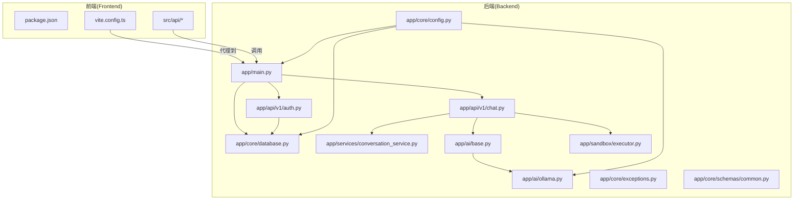
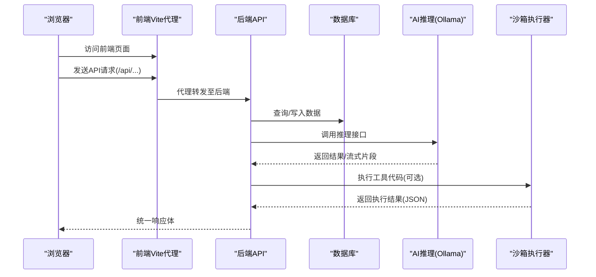
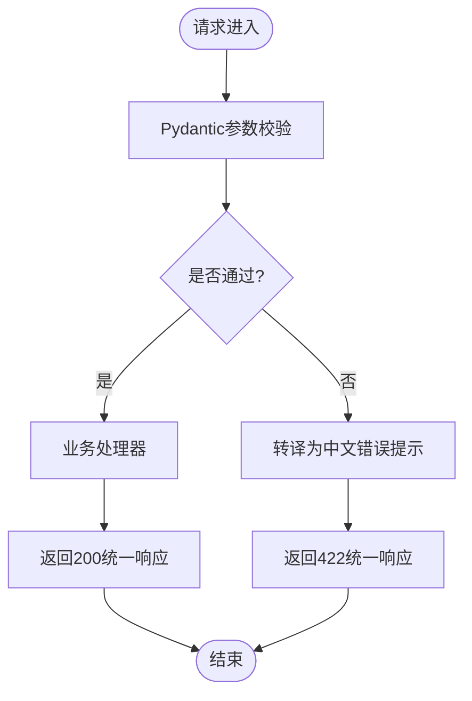
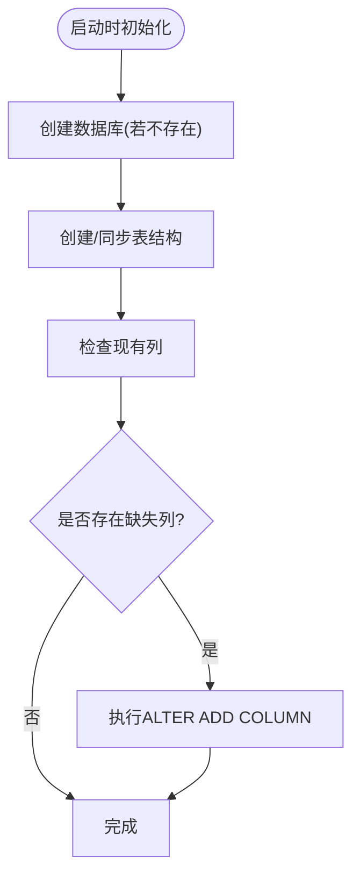
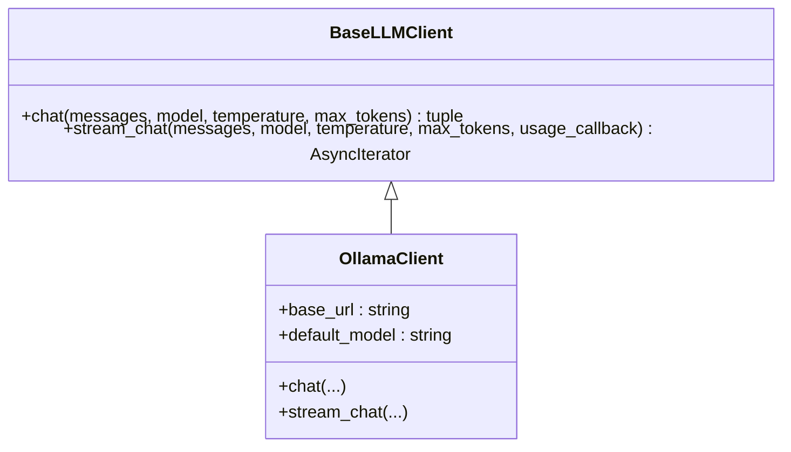
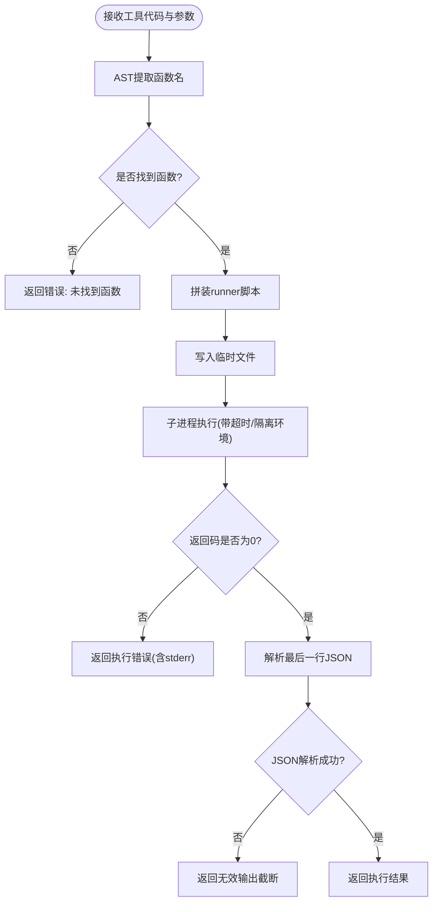
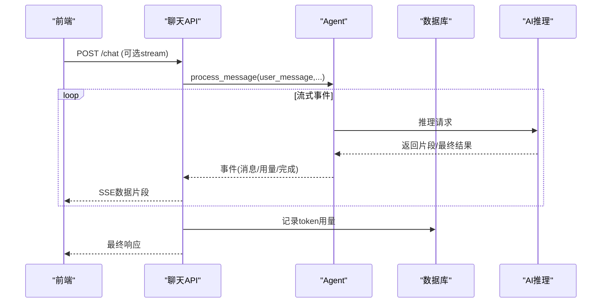
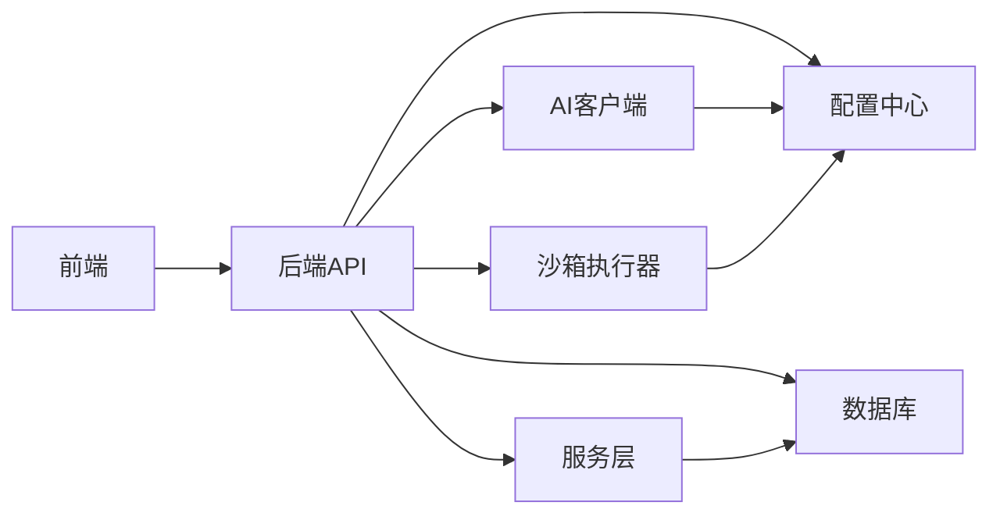

# 故障排除

<cite>
**本文引用的文件**
- [backend/app/main.py](file://backend/app/main.py)
- [backend/app/core/config.py](file://backend/app/core/config.py)
- [backend/app/core/database.py](file://backend/app/core/database.py)
- [backend/app/core/exceptions.py](file://backend/app/core/exceptions.py)
- [backend/app/core/schemas/common.py](file://backend/app/core/schemas/common.py)
- [backend/app/api/v1/chat.py](file://backend/app/api/v1/chat.py)
- [backend/app/api/v1/auth.py](file://backend/app/api/v1/auth.py)
- [backend/app/services/conversation_service.py](file://backend/app/services/conversation_service.py)
- [backend/app/sandbox/executor.py](file://backend/app/sandbox/executor.py)
- [backend/app/ai/base.py](file://backend/app/ai/base.py)
- [backend/app/ai/ollama.py](file://backend/app/ai/ollama.py)
- [backend/environment.yml](file://backend/environment.yml)
- [frontend/package.json](file://frontend/package.json)
- [frontend/vite.config.ts](file://frontend/vite.config.ts)
</cite>

## 目录
1. [简介](#简介)
2. [项目结构](#项目结构)
3. [核心组件](#核心组件)
4. [架构总览](#架构总览)
5. [详细组件分析](#详细组件分析)
6. [依赖分析](#依赖分析)
7. [性能考虑](#性能考虑)
8. [故障排除指南](#故障排除指南)
9. [结论](#结论)
10. [附录](#附录)

## 简介
本指南面向开发者与运维人员，聚焦于XuanJi项目的开发与运行期常见问题，覆盖环境配置、数据库连接、AI模型服务、前端构建、日志分析、调试工具、性能定位、系统监控与告警处置等。文档基于仓库中实际实现进行归纳总结，并提供可操作的排查步骤与修复建议。

## 项目结构
后端采用FastAPI + SQLAlchemy架构，前端使用Vite + React。整体通过统一响应模型返回数据，AI能力通过抽象客户端封装不同推理后端（当前实现Ollama），沙箱执行工具代码确保安全隔离。

图表来源
- [backend/app/main.py:1-79](file://backend/app/main.py#L1-L79)
- [backend/app/core/config.py:1-68](file://backend/app/core/config.py#L1-L68)
- [backend/app/core/database.py:1-65](file://backend/app/core/database.py#L1-L65)
- [backend/app/api/v1/chat.py:1-106](file://backend/app/api/v1/chat.py#L1-L106)
- [backend/app/api/v1/auth.py:1-61](file://backend/app/api/v1/auth.py#L1-L61)
- [backend/app/services/conversation_service.py:1-141](file://backend/app/services/conversation_service.py#L1-L141)
- [backend/app/ai/base.py:1-73](file://backend/app/ai/base.py#L1-L73)
- [backend/app/ai/ollama.py:1-91](file://backend/app/ai/ollama.py#L1-L91)
- [backend/app/sandbox/executor.py:1-101](file://backend/app/sandbox/executor.py#L1-L101)
- [backend/app/core/exceptions.py:1-20](file://backend/app/core/exceptions.py#L1-L20)
- [backend/app/core/schemas/common.py:1-12](file://backend/app/core/schemas/common.py#L1-L12)
- [frontend/vite.config.ts:1-35](file://frontend/vite.config.ts#L1-L35)
- [frontend/package.json:1-44](file://frontend/package.json#L1-L44)

章节来源
- [backend/app/main.py:1-79](file://backend/app/main.py#L1-L79)
- [frontend/vite.config.ts:1-35](file://frontend/vite.config.ts#L1-L35)

## 核心组件
- 统一响应模型：所有API返回统一结构，便于前端与监控系统解析。
- 配置中心：集中管理数据库、AI推理后端、CORS、沙箱等配置项。
- 数据库初始化与迁移：自动建库建表、缺失列自动补齐。
- AI客户端抽象：定义统一接口，当前实现Ollama适配器。
- 沙箱执行器：隔离执行工具代码，限制超时与工作目录。
- 健康检查与异常处理：提供健康端点与请求参数校验异常转译。

章节来源
- [backend/app/core/schemas/common.py:1-12](file://backend/app/core/schemas/common.py#L1-L12)
- [backend/app/core/config.py:1-68](file://backend/app/core/config.py#L1-L68)
- [backend/app/core/database.py:1-65](file://backend/app/core/database.py#L1-L65)
- [backend/app/ai/base.py:1-73](file://backend/app/ai/base.py#L1-L73)
- [backend/app/ai/ollama.py:1-91](file://backend/app/ai/ollama.py#L1-L91)
- [backend/app/sandbox/executor.py:1-101](file://backend/app/sandbox/executor.py#L1-L101)
- [backend/app/main.py:43-64](file://backend/app/main.py#L43-L64)

## 架构总览
下图展示从浏览器到后端API、数据库与AI服务的关键交互路径，以及沙箱执行流程。

图表来源
- [frontend/vite.config.ts:25-33](file://frontend/vite.config.ts#L25-L33)
- [backend/app/api/v1/chat.py:40-106](file://backend/app/api/v1/chat.py#L40-L106)
- [backend/app/core/database.py:14-39](file://backend/app/core/database.py#L14-L39)
- [backend/app/ai/ollama.py:19-91](file://backend/app/ai/ollama.py#L19-L91)
- [backend/app/sandbox/executor.py:13-101](file://backend/app/sandbox/executor.py#L13-L101)

## 详细组件分析

### 组件A：统一响应与异常处理
- 统一响应模型包含状态码、消息与数据字段，便于前端一致化处理。
- 请求参数校验异常被转译为中文提示，提升可读性。
- 健康检查端点用于快速判断服务可用性。

图表来源
- [backend/app/main.py:43-64](file://backend/app/main.py#L43-L64)
- [backend/app/core/schemas/common.py:8-12](file://backend/app/core/schemas/common.py#L8-L12)

章节来源
- [backend/app/main.py:43-64](file://backend/app/main.py#L43-L64)
- [backend/app/core/schemas/common.py:1-12](file://backend/app/core/schemas/common.py#L1-L12)

### 组件B：数据库初始化与迁移
- 自动创建数据库与表，缺失列自动补齐，降低部署与升级成本。
- 使用预连接检测与DDL动态生成，保证模型与表结构一致性。

图表来源
- [backend/app/core/database.py:22-65](file://backend/app/core/database.py#L22-L65)

章节来源
- [backend/app/core/database.py:1-65](file://backend/app/core/database.py#L1-L65)

### 组件C：AI客户端与推理流程
- 抽象基类定义统一接口，当前实现Ollama适配器。
- 支持非流式与流式对话，流式模式支持按块产出与最终用量回调。
- 提供prompt模板加载与JSON配置加载辅助函数。

图表来源
- [backend/app/ai/base.py:8-36](file://backend/app/ai/base.py#L8-L36)
- [backend/app/ai/ollama.py:10-91](file://backend/app/ai/ollama.py#L10-L91)

章节来源
- [backend/app/ai/base.py:1-73](file://backend/app/ai/base.py#L1-L73)
- [backend/app/ai/ollama.py:1-91](file://backend/app/ai/ollama.py#L1-L91)

### 组件D：沙箱执行器
- 将工具代码与参数序列化为临时脚本，在隔离环境中执行。
- 设置超时、工作目录、环境变量，避免污染宿主环境。
- 解析最后一次输出行的JSON作为结果，捕获超时与解析异常。

图表来源
- [backend/app/sandbox/executor.py:13-101](file://backend/app/sandbox/executor.py#L13-L101)

章节来源
- [backend/app/sandbox/executor.py:1-101](file://backend/app/sandbox/executor.py#L1-L101)

### 组件E：聊天API与事件流
- 支持SSE流式输出，客户端断开时优雅中断。
- 收集“done”事件中的用量信息并记录。
- 非流式模式聚合全部内容后一次性返回。

图表来源
- [backend/app/api/v1/chat.py:40-106](file://backend/app/api/v1/chat.py#L40-L106)
- [backend/app/ai/ollama.py:50-91](file://backend/app/ai/ollama.py#L50-L91)

章节来源
- [backend/app/api/v1/chat.py:1-106](file://backend/app/api/v1/chat.py#L1-L106)

## 依赖分析
- 后端依赖：FastAPI、Uvicorn、SQLAlchemy、PyMySQL、Pydantic、Pydantic-Settings、HTTPX、Alembic等。
- 前端依赖：React、React Router、TailwindCSS、Vite、ECharts等。
- 关键耦合点：API层依赖配置中心、数据库会话、服务层；AI层依赖配置中心与推理后端；沙箱执行器独立但受配置影响。

图表来源
- [backend/environment.yml:1-25](file://backend/environment.yml#L1-L25)
- [frontend/package.json:1-44](file://frontend/package.json#L1-L44)
- [backend/app/core/config.py:1-68](file://backend/app/core/config.py#L1-L68)
- [backend/app/core/database.py:1-65](file://backend/app/core/database.py#L1-L65)
- [backend/app/sandbox/executor.py:1-101](file://backend/app/sandbox/executor.py#L1-L101)
- [backend/app/ai/ollama.py:1-91](file://backend/app/ai/ollama.py#L1-L91)

章节来源
- [backend/environment.yml:1-25](file://backend/environment.yml#L1-L25)
- [frontend/package.json:1-44](file://frontend/package.json#L1-L44)

## 性能考虑
- 数据库连接池与预检：启用连接预检减少慢查询与空闲连接失效。
- 自动迁移与DDL：在启动阶段完成表结构同步，避免运行期DDL风暴。
- 流式响应：SSE流式输出降低首字节延迟，适合长文本生成场景。
- 沙箱超时：合理设置超时阈值，防止恶意/死循环工具阻塞服务。
- 前端打包优化：手动分包与警告阈值控制，避免大体积chunk导致加载缓慢。

章节来源
- [backend/app/core/database.py:6-7](file://backend/app/core/database.py#L6-L7)
- [backend/app/api/v1/chat.py:62-87](file://backend/app/api/v1/chat.py#L62-L87)
- [backend/app/sandbox/executor.py:68-69](file://backend/app/sandbox/executor.py#L68-L69)
- [frontend/vite.config.ts:8-19](file://frontend/vite.config.ts#L8-L19)

## 故障排除指南

### 一、环境配置问题
- Python与依赖安装
  - 使用提供的环境清单安装Python与后端依赖，确保版本匹配。
  - 若出现导入错误，请确认虚拟环境激活且依赖安装完成。
  - 参考：[backend/environment.yml:1-25](file://backend/environment.yml#L1-L25)
- 前端依赖与Node版本
  - 安装依赖后尝试构建，若出现语法或插件报错，检查Node与包管理器版本。
  - 参考：[frontend/package.json:1-44](file://frontend/package.json#L1-L44)
- 开发服务器端口冲突
  - 后端默认监听8000，前端默认5173；如端口占用，修改对应配置。
  - 参考：[backend/app/main.py:67-78](file://backend/app/main.py#L67-L78)、[frontend/vite.config.ts:25-33](file://frontend/vite.config.ts#L25-L33)

常见症状与解决
- “找不到模块”或“版本不兼容”
  - 清理缓存并重新安装依赖；确认使用与清单一致的Python版本。
- “端口被占用”
  - 修改后端/前端配置中的端口，或释放占用端口。

章节来源
- [backend/environment.yml:1-25](file://backend/environment.yml#L1-L25)
- [frontend/package.json:1-44](file://frontend/package.json#L1-L44)
- [frontend/vite.config.ts:25-33](file://frontend/vite.config.ts#L25-L33)
- [backend/app/main.py:67-78](file://backend/app/main.py#L67-L78)

### 二、数据库连接问题
- 连接失败
  - 检查数据库主机、端口、账号、密码与字符集配置。
  - 确认数据库服务可达且防火墙放行。
  - 参考：[backend/app/core/config.py:6-10](file://backend/app/core/config.py#L6-L10)、[backend/app/core/database.py:22-39](file://backend/app/core/database.py#L22-L39)
- 初始化失败
  - 启动时自动创建数据库与表；若权限不足，调整账号权限或手动创建数据库。
  - 参考：[backend/app/core/database.py:22-42](file://backend/app/core/database.py#L22-L42)
- 迁移异常
  - 缺失列自动补齐；若DDL执行失败，检查目标列类型与默认值约束。
  - 参考：[backend/app/core/database.py:44-65](file://backend/app/core/database.py#L44-L65)

常见症状与解决
- “无法连接到数据库”
  - 核对主机/端口/凭据；确认网络连通；必要时开启本地回环或内网访问。
- “表不存在或列缺失”
  - 重启应用让自动初始化与迁移生效；检查数据库权限。

章节来源
- [backend/app/core/config.py:1-68](file://backend/app/core/config.py#L1-L68)
- [backend/app/core/database.py:1-65](file://backend/app/core/database.py#L1-L65)

### 三、AI模型服务问题
- Ollama不可达
  - 检查基础URL与模型名称配置；确认Ollama服务正在运行且端口开放。
  - 参考：[backend/app/core/config.py:12-14](file://backend/app/core/config.py#L12-L14)、[backend/app/ai/ollama.py:16-17](file://backend/app/ai/ollama.py#L16-L17)
- 推理超时或无输出
  - 调整超时时间与温度、最大token等参数；检查模型是否加载完成。
  - 参考：[backend/app/ai/ollama.py:26-38](file://backend/app/ai/ollama.py#L26-L38)
- 流式输出异常
  - 检查客户端SSE连接是否断开；关注服务端日志中的中断与异常。
  - 参考：[backend/app/api/v1/chat.py:78-85](file://backend/app/api/v1/chat.py#L78-L85)

常见症状与解决
- “模型未找到/加载失败”
  - 在Ollama侧拉取或加载指定模型；核对模型名与标签。
- “推理超时”
  - 减少max_tokens、降低温度或提高超时；检查宿主机资源。

章节来源
- [backend/app/core/config.py:12-14](file://backend/app/core/config.py#L12-L14)
- [backend/app/ai/ollama.py:1-91](file://backend/app/ai/ollama.py#L1-L91)
- [backend/app/api/v1/chat.py:1-106](file://backend/app/api/v1/chat.py#L1-L106)

### 四、前端构建问题
- 构建失败
  - 检查TypeScript与Vite版本；清理node_modules与缓存后重试。
  - 参考：[frontend/package.json:1-44](file://frontend/package.json#L1-L44)
- 代理不通
  - 确认Vite代理配置指向后端地址；前后端端口需匹配。
  - 参考：[frontend/vite.config.ts:27-32](file://frontend/vite.config.ts#L27-L32)
- 页面空白或样式异常
  - 检查Tailwind与CSS引入；确认构建产物未被缓存。

常见症状与解决
- “找不到模块/语法错误”
  - 升级Node版本至推荐范围；删除lock文件后重新安装。
- “代理到后端404”
  - 核对路由前缀与代理规则；确认后端已启动。

章节来源
- [frontend/package.json:1-44](file://frontend/package.json#L1-L44)
- [frontend/vite.config.ts:1-35](file://frontend/vite.config.ts#L1-L35)

### 五、日志分析技巧
- 后端日志
  - 关注聊天API中的SSE异常、工具执行超时与JSON解析错误。
  - 参考：[backend/app/api/v1/chat.py:78-85](file://backend/app/api/v1/chat.py#L78-L85)、[backend/app/sandbox/executor.py:95-98](file://backend/app/sandbox/executor.py#L95-L98)
- AI推理日志
  - Agent内部记录推理失败、提示构造失败、结果解读失败等关键节点。
  - 参考：[backend/app/ai/ollama.py:75-84](file://backend/app/ai/ollama.py#L75-L84)
- 建议
  - 将日志级别设为INFO/DEBUG，结合错误堆栈定位问题；生产环境注意脱敏。

章节来源
- [backend/app/api/v1/chat.py:78-85](file://backend/app/api/v1/chat.py#L78-L85)
- [backend/app/sandbox/executor.py:95-98](file://backend/app/sandbox/executor.py#L95-L98)
- [backend/app/ai/ollama.py:75-84](file://backend/app/ai/ollama.py#L75-L84)

### 六、调试工具使用
- 后端
  - 使用Uvicorn热重载开发；仅监视必要目录，避免工具文件触发不必要的重启。
  - 参考：[backend/app/main.py:67-78](file://backend/app/main.py#L67-L78)
- 前端
  - 使用Vite内置开发服务器；启用ESLint与Prettier规范代码风格。
  - 参考：[frontend/package.json:6-11](file://frontend/package.json#L6-L11)、[frontend/vite.config.ts:1-35](file://frontend/vite.config.ts#L1-L35)
- 数据库
  - 使用SQLAlchemy ORM与Alembic进行结构变更与迁移；必要时手动执行DDL。
  - 参考：[backend/environment.yml](file://backend/environment.yml#L16)

章节来源
- [backend/app/main.py:67-78](file://backend/app/main.py#L67-L78)
- [frontend/package.json:6-11](file://frontend/package.json#L6-L11)
- [frontend/vite.config.ts:1-35](file://frontend/vite.config.ts#L1-L35)
- [backend/environment.yml](file://backend/environment.yml#L16)

### 七、性能问题定位方法
- 数据库
  - 检查连接池与慢查询；确认自动迁移未在高峰期执行。
  - 参考：[backend/app/core/database.py:6-7](file://backend/app/core/database.py#L6-L7)
- 推理
  - 通过用量回调统计prompt/completion token，识别热点角色与长上下文。
  - 参考：[backend/app/api/v1/chat.py:22-38](file://backend/app/api/v1/chat.py#L22-L38)、[backend/app/ai/ollama.py:42-47](file://backend/app/ai/ollama.py#L42-L47)
- 前端
  - 分析打包体积与分包策略，避免单体chunk过大。
  - 参考：[frontend/vite.config.ts:8-19](file://frontend/vite.config.ts#L8-L19)

章节来源
- [backend/app/core/database.py:6-7](file://backend/app/core/database.py#L6-L7)
- [backend/app/api/v1/chat.py:22-38](file://backend/app/api/v1/chat.py#L22-L38)
- [backend/app/ai/ollama.py:42-47](file://backend/app/ai/ollama.py#L42-L47)
- [frontend/vite.config.ts:8-19](file://frontend/vite.config.ts#L8-L19)

### 八、系统监控指标与告警
- 指标建议
  - 后端：请求QPS/错误率、推理耗时、数据库连接数、队列长度、沙箱执行次数与超时率。
  - 前端：页面加载时延、SSE连接断线次数、API失败率。
- 告警策略
  - 错误率突增、推理超时占比上升、数据库连接池耗尽、沙箱执行超时报警。
- 处置流程
  - 快速降级非关键功能；扩容推理实例；检查数据库与网络；回滚可疑变更。

[本节为通用实践说明，无需特定文件引用]

### 九、紧急情况应对方案
- 服务不可用
  - 检查健康端点；确认数据库与AI服务连通；回滚最近一次部署。
  - 参考：[backend/app/main.py:62-64](file://backend/app/main.py#L62-L64)、[backend/app/core/database.py:22-39](file://backend/app/core/database.py#L22-L39)、[backend/app/ai/ollama.py:26-38](file://backend/app/ai/ollama.py#L26-L38)
- 数据库异常
  - 切换只读副本或降级写入；检查DDL锁与慢查询；必要时重建索引。
- AI服务异常
  - 切换备用模型或关闭流式以保障稳定性；检查模型镜像与磁盘空间。

章节来源
- [backend/app/main.py:62-64](file://backend/app/main.py#L62-L64)
- [backend/app/core/database.py:22-39](file://backend/app/core/database.py#L22-L39)
- [backend/app/ai/ollama.py:26-38](file://backend/app/ai/ollama.py#L26-L38)

## 结论
本指南基于XuanJi项目实际实现，提供了从环境准备到运行维护的全链路故障排除方法。建议在开发与生产环境中均建立标准化的日志与监控体系，配合自动化测试与灰度发布，持续降低故障风险与恢复时间。

## 附录
- 常用命令参考
  - 后端：启动开发服务器、运行测试、生成迁移脚本。
  - 前端：安装依赖、开发、构建与预览。
- 配置文件位置
  - 后端配置文件位于根目录.env（由配置类加载）。
  - 前端代理与别名配置位于Vite配置文件。

章节来源
- [backend/app/core/config.py:64-64](file://backend/app/core/config.py#L64-L64)
- [frontend/package.json:6-11](file://frontend/package.json#L6-L11)
- [frontend/vite.config.ts:1-35](file://frontend/vite.config.ts#L1-L35)