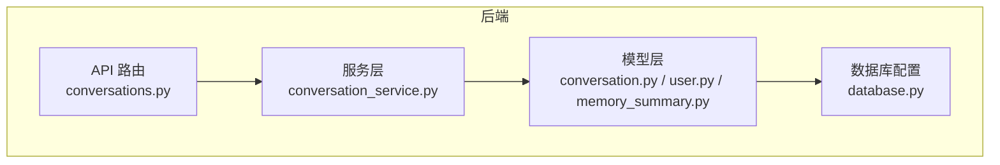
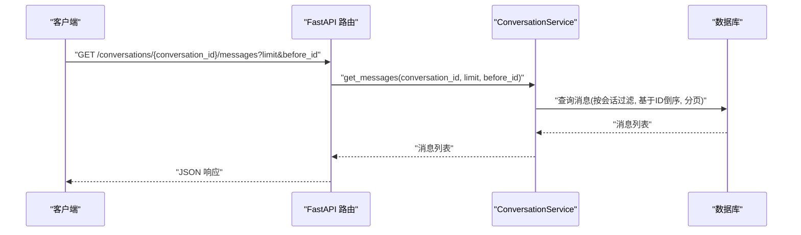
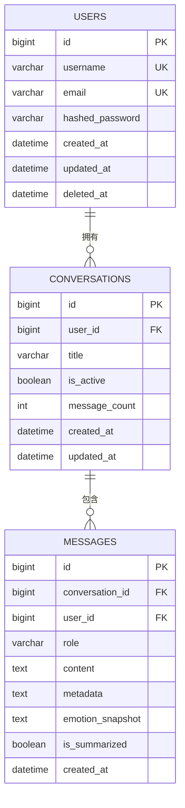
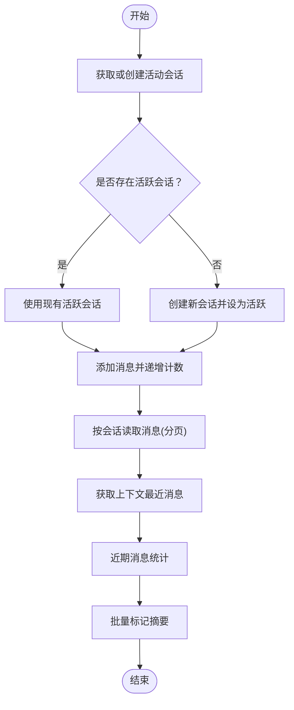
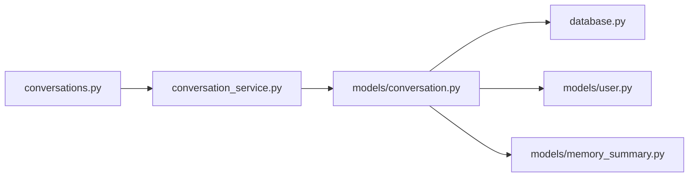

# 对话模型

<cite>
**本文引用的文件**
- [backend/app/models/conversation.py](file://backend/app/models/conversation.py)
- [backend/app/schemas/conversation.py](file://backend/app/schemas/conversation.py)
- [backend/app/services/conversation_service.py](file://backend/app/services/conversation_service.py)
- [backend/app/api/v1/conversations.py](file://backend/app/api/v1/conversations.py)
- [backend/app/core/database.py](file://backend/app/core/database.py)
- [backend/app/models/user.py](file://backend/app/models/user.py)
- [backend/app/models/memory_summary.py](file://backend/app/models/memory_summary.py)
- [backend/app/ai/base.py](file://backend/app/ai/base.py)
- [backend/app/ai/skills/xuanji-xuan/context-injection.md](file://backend/app/ai/skills/xuanji-xuan/context-injection.md)
</cite>

## 目录
1. [引言](#引言)
2. [项目结构](#项目结构)
3. [核心组件](#核心组件)
4. [架构总览](#架构总览)
5. [详细组件分析](#详细组件分析)
6. [依赖分析](#依赖分析)
7. [性能考虑](#性能考虑)
8. [故障排查指南](#故障排查指南)
9. [结论](#结论)
10. [附录](#附录)

## 引言
本设计文档围绕对话模型展开，聚焦 Conversation 实体的数据结构、消息序列化存储、多轮对话状态维护、会话元数据管理、与用户的关联关系与外键约束、历史查询优化与分页机制、实时状态同步、数据清理策略、存储空间优化以及并发访问控制。文档同时面向 AI 系统开发者与数据分析师，提供可操作的设计参考与最佳实践。

## 项目结构
对话系统由“模型层-服务层-API 层-配置层”构成，采用 SQLAlchemy ORM 映射数据库表，并通过 FastAPI 提供 REST 接口。核心对象包括会话表与消息表，二者通过外键建立一对多关系；会话与用户之间也存在外键关联，确保数据隔离与级联删除。

图表来源
- [backend/app/api/v1/conversations.py:1-187](file://backend/app/api/v1/conversations.py#L1-L187)
- [backend/app/services/conversation_service.py:1-141](file://backend/app/services/conversation_service.py#L1-L141)
- [backend/app/models/conversation.py:1-41](file://backend/app/models/conversation.py#L1-L41)
- [backend/app/models/user.py:1-23](file://backend/app/models/user.py#L1-L23)
- [backend/app/models/memory_summary.py:1-26](file://backend/app/models/memory_summary.py#L1-L26)
- [backend/app/core/database.py:1-65](file://backend/app/core/database.py#L1-L65)

章节来源
- [backend/app/api/v1/conversations.py:1-187](file://backend/app/api/v1/conversations.py#L1-L187)
- [backend/app/services/conversation_service.py:1-141](file://backend/app/services/conversation_service.py#L1-L141)
- [backend/app/models/conversation.py:1-41](file://backend/app/models/conversation.py#L1-L41)
- [backend/app/models/user.py:1-23](file://backend/app/models/user.py#L1-L23)
- [backend/app/models/memory_summary.py:1-26](file://backend/app/models/memory_summary.py#L1-L26)
- [backend/app/core/database.py:1-65](file://backend/app/core/database.py#L1-L65)

## 核心组件
- 会话实体（Conversation）
  - 主键自增整型标识
  - 关联用户外键，支持级联删除
  - 标题、活跃状态、消息计数、时间戳字段
- 消息实体（Message）
  - 主键自增整型标识
  - 关联会话与用户外键，支持级联删除
  - 角色（用户/助手/系统）、内容文本、元数据 JSON、情感快照、是否已摘要标志、时间戳字段
- 服务层（ConversationService）
  - 提供活动会话获取/创建、会话列表分页、会话详情查询、消息添加、消息分页读取、上下文最近消息聚合、近期消息统计、消息摘要标记、会话更新等能力
- API 层（conversations.py）
  - 提供会话列表、创建、最近消息查询、按会话读取消息、分页参数校验等接口
- 数据库配置（database.py）
  - 初始化数据库、自动建表、缺失列自动迁移

章节来源
- [backend/app/models/conversation.py:9-41](file://backend/app/models/conversation.py#L9-L41)
- [backend/app/schemas/conversation.py:6-34](file://backend/app/schemas/conversation.py#L6-L34)
- [backend/app/services/conversation_service.py:9-141](file://backend/app/services/conversation_service.py#L9-L141)
- [backend/app/api/v1/conversations.py:22-69](file://backend/app/api/v1/conversations.py#L22-L69)
- [backend/app/core/database.py:22-65](file://backend/app/core/database.py#L22-L65)

## 架构总览
对话系统遵循分层架构：API 接收请求，调用服务层执行业务逻辑，服务层通过 ORM 访问数据库模型，最终持久化到 MySQL 表。外键约束保证会话与用户、消息与会话/用户的关联一致性；索引提升查询效率；服务层负责状态维护与上下文聚合。

图表来源
- [backend/app/api/v1/conversations.py:56-69](file://backend/app/api/v1/conversations.py#L56-L69)
- [backend/app/services/conversation_service.py:87-94](file://backend/app/services/conversation_service.py#L87-L94)

章节来源
- [backend/app/api/v1/conversations.py:1-187](file://backend/app/api/v1/conversations.py#L1-L187)
- [backend/app/services/conversation_service.py:1-141](file://backend/app/services/conversation_service.py#L1-L141)

## 详细组件分析

### 会话实体（Conversation）设计
- 字段与类型
  - id：主键，自增整型
  - user_id：外键关联 users.id，删除时级联
  - title：字符串，可空
  - is_active：布尔，活跃状态，默认 true
  - message_count：整型，消息计数，默认 0
  - created_at/updated_at：时间戳，默认服务器当前时间，更新时自动刷新
- 设计要点
  - 外键约束确保会话归属唯一用户，删除用户时会话级联删除
  - 活跃状态用于快速定位当前对话，便于上下文注入与流式交互
  - 消息计数用于统计与展示，便于前端分页与容量评估
- 关系映射
  - 一对多：一个用户可拥有多个会话
  - 多对一：消息属于某个会话

图表来源
- [backend/app/models/conversation.py:9-41](file://backend/app/models/conversation.py#L9-L41)
- [backend/app/models/user.py:9-23](file://backend/app/models/user.py#L9-L23)

章节来源
- [backend/app/models/conversation.py:9-41](file://backend/app/models/conversation.py#L9-L41)
- [backend/app/models/user.py:9-23](file://backend/app/models/user.py#L9-L23)

### 消息实体（Message）设计
- 字段与类型
  - id：主键，自增整型
  - conversation_id：外键关联 conversations.id，删除时级联
  - user_id：外键关联 users.id，删除时级联
  - role：字符串，限定角色（用户/助手/系统）
  - content：文本，消息正文
  - metadata_json：JSON 文本，承载额外结构化信息
  - emotion_snapshot：JSON 文本，情感快照
  - is_summarized：布尔，是否已摘要
  - created_at：时间戳，默认服务器当前时间
- 设计要点
  - metadata_json 支持扩展元数据（如工具调用、意图标签等）
  - emotion_snapshot 支持情感维度快照，便于上下文注入与个性化
  - is_summarized 标记用于后续清理与压缩策略
- 关系映射
  - 多对一：消息属于会话与用户

章节来源
- [backend/app/models/conversation.py:25-41](file://backend/app/models/conversation.py#L25-L41)

### 服务层（ConversationService）流程
- 活动会话管理
  - 获取或创建活动会话：优先返回用户最新活跃会话，否则新建并设为活跃
  - 创建新会话：将同用户其他活跃会话置为非活跃，再创建新会话
- 列表与详情
  - 会话列表：按用户过滤，基于更新时间倒序，支持分页
  - 会话详情：按会话与用户双重条件过滤
- 消息管理
  - 添加消息：写入消息，同时原子性递增会话的消息计数
  - 读取消息：按会话过滤，支持基于 before_id 的前滚分页，按 ID 倒序取回
  - 上下文最近消息：跨所有会话聚合最近消息，用于上下文注入
  - 近期消息统计：按用户与时间窗口聚合消息，支持按天统计
- 摘要标记
  - 批量标记消息为已摘要，便于后续清理与压缩
- 会话更新
  - 动态更新会话字段（如标题、活跃状态）

图表来源
- [backend/app/services/conversation_service.py:13-141](file://backend/app/services/conversation_service.py#L13-L141)

章节来源
- [backend/app/services/conversation_service.py:9-141](file://backend/app/services/conversation_service.py#L9-L141)

### API 层（conversations.py）接口定义
- 会话列表
  - GET /conversations?page&limit
  - 参数校验：page≥1，limit∈[1,100]
- 创建会话
  - POST /conversations
  - 请求体：标题可选
- 最近消息查询
  - GET /conversations/recent-messages?days
  - 参数校验：days∈[1,30]
- 会话消息读取
  - GET /conversations/{conversation_id}/messages?limit&before_id
  - 参数校验：limit∈[1,200]
- 当前用户上下文注入
  - 通过服务层聚合最近消息，结合技能模板实现上下文注入

章节来源
- [backend/app/api/v1/conversations.py:22-69](file://backend/app/api/v1/conversations.py#L22-L69)

### 上下文注入与多轮对话
- 技能模板分段
  - 情绪上下文注入、记忆片段注入、用户画像注入、格式指引注入
- 上下文聚合
  - 服务层提供“最近消息跨会话聚合”，用于向 LLM 注入上下文
- 实时同步
  - 新消息写入后立即生效，下次请求即可被聚合进上下文

章节来源
- [backend/app/ai/skills/xuanji-xuan/context-injection.md:1-31](file://backend/app/ai/skills/xuanji-xuan/context-injection.md#L1-L31)
- [backend/app/services/conversation_service.py:95-110](file://backend/app/services/conversation_service.py#L95-L110)
- [backend/app/ai/base.py:1-73](file://backend/app/ai/base.py#L1-L73)

## 依赖分析
- 组件耦合
  - API 依赖服务层；服务层依赖模型层；模型层依赖数据库配置
- 外键与索引
  - conversations.user_id → users.id（级联删除）
  - messages.conversation_id → conversations.id（级联删除）
  - messages.user_id → users.id（级联删除）
  - conversations.user_id 建有索引，提升会话列表与详情查询效率
  - messages.conversation_id 建有索引，提升按会话读取消息效率
- 循环依赖
  - 未发现循环导入；各层职责清晰
- 外部依赖
  - SQLAlchemy ORM、FastAPI、数据库驱动

图表来源
- [backend/app/api/v1/conversations.py:1-187](file://backend/app/api/v1/conversations.py#L1-L187)
- [backend/app/services/conversation_service.py:1-141](file://backend/app/services/conversation_service.py#L1-L141)
- [backend/app/models/conversation.py:1-41](file://backend/app/models/conversation.py#L1-L41)
- [backend/app/models/user.py:1-23](file://backend/app/models/user.py#L1-L23)
- [backend/app/models/memory_summary.py:1-26](file://backend/app/models/memory_summary.py#L1-L26)
- [backend/app/core/database.py:1-65](file://backend/app/core/database.py#L1-L65)

章节来源
- [backend/app/api/v1/conversations.py:1-187](file://backend/app/api/v1/conversations.py#L1-L187)
- [backend/app/services/conversation_service.py:1-141](file://backend/app/services/conversation_service.py#L1-L141)
- [backend/app/models/conversation.py:1-41](file://backend/app/models/conversation.py#L1-L41)
- [backend/app/models/user.py:1-23](file://backend/app/models/user.py#L1-L23)
- [backend/app/models/memory_summary.py:1-26](file://backend/app/models/memory_summary.py#L1-L26)
- [backend/app/core/database.py:1-65](file://backend/app/core/database.py#L1-L65)

## 性能考虑
- 查询优化
  - 会话列表：按 user_id 过滤 + updated_at 倒序 + 分页，利用索引减少全表扫描
  - 消息读取：按 conversation_id 过滤 + id 倒序 + limit，利用索引快速定位
  - 最近消息聚合：先定位活跃会话，再按会话内消息倒序取回，避免跨用户扫描
- 写入优化
  - 消息写入后原子性递增 message_count，避免额外查询
  - 批量标记摘要时使用批量更新，减少事务次数
- 存储与清理
  - is_summarized 字段用于识别可清理的历史消息
  - memory_summaries 记录周期性摘要，降低长上下文传输成本
- 并发控制
  - 使用数据库事务与锁保障写入一致性；服务层单次操作提交一次事务
  - 建议在高并发场景引入连接池与重试策略，避免热点会话争用

章节来源
- [backend/app/services/conversation_service.py:43-52](file://backend/app/services/conversation_service.py#L43-L52)
- [backend/app/services/conversation_service.py:87-94](file://backend/app/services/conversation_service.py#L87-L94)
- [backend/app/services/conversation_service.py:123-129](file://backend/app/services/conversation_service.py#L123-L129)
- [backend/app/models/memory_summary.py:1-26](file://backend/app/models/memory_summary.py#L1-L26)

## 故障排查指南
- 会话为空或未创建
  - 检查是否正确调用“获取或创建活动会话”流程
  - 确认用户身份与会话归属一致
- 消息读取为空
  - 核对 conversation_id 是否属于当前用户
  - 检查 before_id 与 limit 参数是否导致结果为空
- 活跃会话异常
  - 检查 is_active 字段是否被错误置为 false
  - 确认创建新会话时旧活跃会话是否被正确置为非活跃
- 摘要标记无效
  - 确认传入的 message_ids 非空且均属于当前用户
  - 检查批量更新是否成功提交
- 数据库初始化失败
  - 确认数据库连接配置与权限
  - 检查自动迁移是否成功执行

章节来源
- [backend/app/services/conversation_service.py:13-26](file://backend/app/services/conversation_service.py#L13-L26)
- [backend/app/services/conversation_service.py:54-59](file://backend/app/services/conversation_service.py#L54-L59)
- [backend/app/services/conversation_service.py:87-94](file://backend/app/services/conversation_service.py#L87-L94)
- [backend/app/services/conversation_service.py:123-129](file://backend/app/services/conversation_service.py#L123-L129)
- [backend/app/core/database.py:22-65](file://backend/app/core/database.py#L22-L65)

## 结论
该对话模型以简洁的会话-消息二维结构为核心，通过外键与索引保障数据完整性与查询效率；服务层提供完善的多轮对话状态维护与上下文聚合能力；API 层以明确的分页与参数校验确保易用性与稳定性。配合摘要标记与周期性记忆摘要，可在保证上下文质量的同时优化存储与传输成本。建议在生产环境中结合连接池、重试与监控进一步增强可靠性与可观测性。

## 附录
- 术语
  - 上下文注入：将用户近期对话与情感、记忆、画像等信息整合为提示词，提升回复个性化与连贯性
  - 摘要标记：标记已摘要的历史消息，便于后续清理与压缩
- 参考路径
  - 会话与消息模型定义：[backend/app/models/conversation.py:9-41](file://backend/app/models/conversation.py#L9-L41)
  - 会话服务实现：[backend/app/services/conversation_service.py:9-141](file://backend/app/services/conversation_service.py#L9-L141)
  - 会话 API 定义：[backend/app/api/v1/conversations.py:22-69](file://backend/app/api/v1/conversations.py#L22-L69)
  - 数据库初始化与迁移：[backend/app/core/database.py:22-65](file://backend/app/core/database.py#L22-L65)
  - 用户模型：[backend/app/models/user.py:9-23](file://backend/app/models/user.py#L9-L23)
  - 记忆摘要模型：[backend/app/models/memory_summary.py:9-26](file://backend/app/models/memory_summary.py#L9-L26)
  - 上下文注入模板：[backend/app/ai/skills/xuanji-xuan/context-injection.md:1-31](file://backend/app/ai/skills/xuanji-xuan/context-injection.md#L1-L31)
  - LLM 抽象接口与技能加载：[backend/app/ai/base.py:8-73](file://backend/app/ai/base.py#L8-L73)