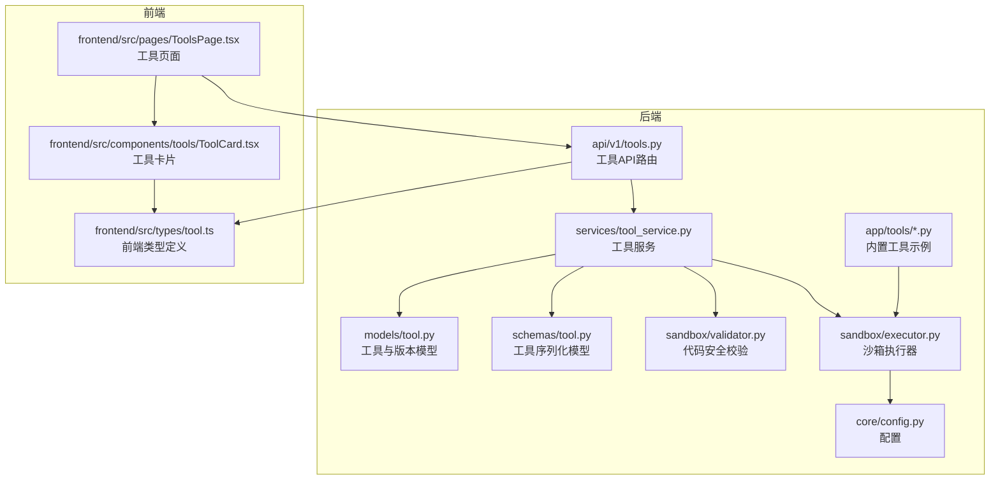
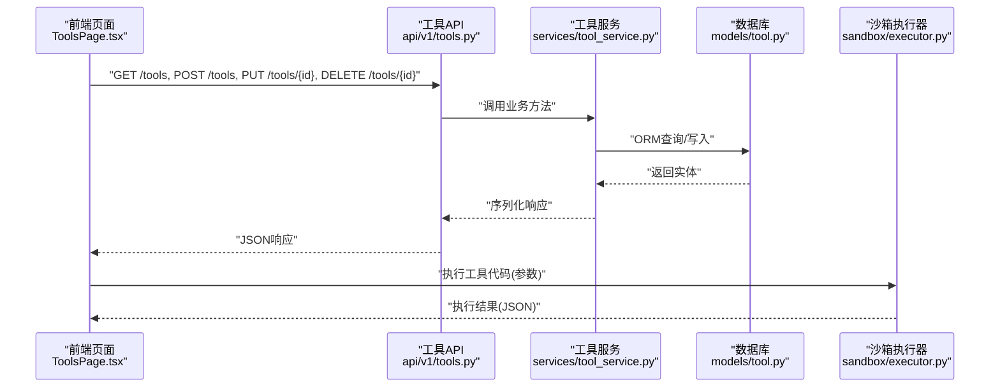
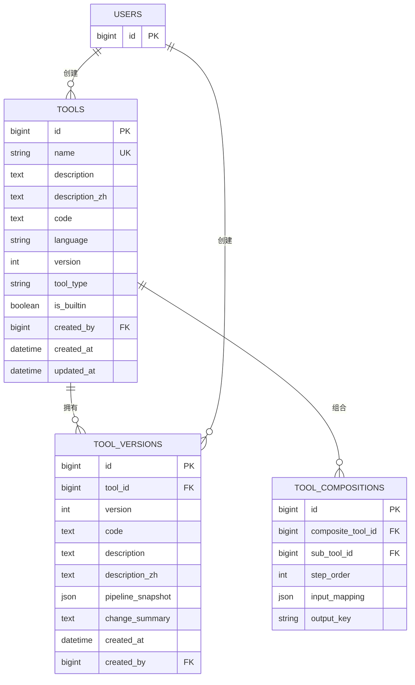
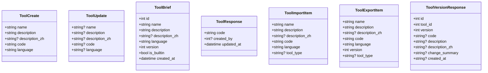
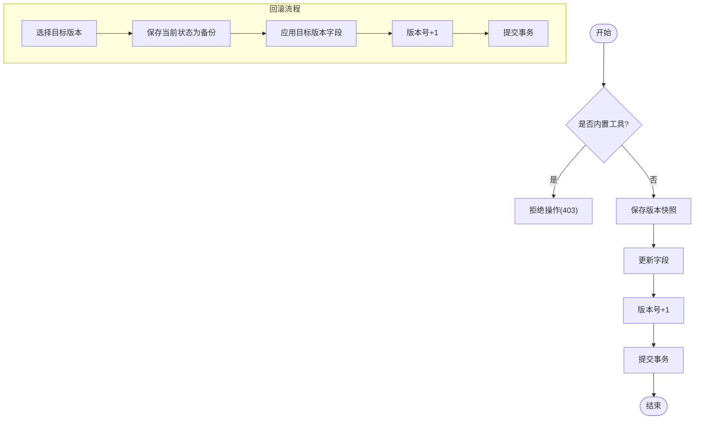
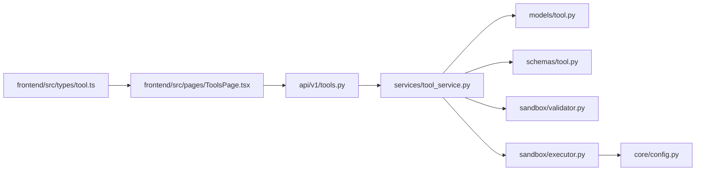

# 工具模型

<cite>
**本文引用的文件**
- [backend/app/models/tool.py](file://backend/app/models/tool.py)
- [backend/app/schemas/tool.py](file://backend/app/schemas/tool.py)
- [backend/app/services/tool_service.py](file://backend/app/services/tool_service.py)
- [backend/app/api/v1/tools.py](file://backend/app/api/v1/tools.py)
- [backend/app/sandbox/executor.py](file://backend/app/sandbox/executor.py)
- [backend/app/sandbox/validator.py](file://backend/app/sandbox/validator.py)
- [backend/app/core/config.py](file://backend/app/core/config.py)
- [backend/app/tools/get_current_time.py](file://backend/app/tools/get_current_time.py)
- [backend/app/tools/check_tomorrow_weather.py](file://backend/app/tools/check_tomorrow_weather.py)
- [backend/app/tools/query_weather.py](file://backend/app/tools/query_weather.py)
- [frontend/src/types/tool.ts](file://frontend/src/types/tool.ts)
- [frontend/src/pages/ToolsPage.tsx](file://frontend/src/pages/ToolsPage.tsx)
- [frontend/src/components/tools/ToolCard.tsx](file://frontend/src/components/tools/ToolCard.tsx)
</cite>

## 目录
1. [简介](#简介)
2. [项目结构](#项目结构)
3. [核心组件](#核心组件)
4. [架构总览](#架构总览)
5. [详细组件分析](#详细组件分析)
6. [依赖分析](#依赖分析)
7. [性能考虑](#性能考虑)
8. [故障排查指南](#故障排查指南)
9. [结论](#结论)
10. [附录](#附录)

## 简介
本文件为“工具模型”的详细设计文档，面向AI工具开发者与系统管理员，系统性阐述工具实体的数据模型、字段设计、版本管理、分类与类型、权限控制、执行参数、与用户的关系、共享与导入导出机制、版本演进策略、代码安全存储与执行隔离、错误处理、生命周期管理、性能监控与使用统计等。文档基于仓库中的实际实现进行分析，并提供可视化图示帮助理解。

## 项目结构
围绕工具模型的关键代码分布在以下模块：
- 数据模型层：定义工具表结构及版本快照
- 序列化层：Pydantic模型用于API输入输出
- 服务层：工具的增删改查、版本快照、回滚、导入导出等业务逻辑
- 接口层：FastAPI路由，暴露REST接口
- 安全沙箱：代码校验与执行隔离
- 前端类型与页面：工具列表、详情、导入导出、编辑删除等交互

图表来源
- [backend/app/models/tool.py:1-64](file://backend/app/models/tool.py#L1-L64)
- [backend/app/schemas/tool.py:1-74](file://backend/app/schemas/tool.py#L1-L74)
- [backend/app/services/tool_service.py:1-222](file://backend/app/services/tool_service.py#L1-L222)
- [backend/app/api/v1/tools.py:1-169](file://backend/app/api/v1/tools.py#L1-L169)
- [backend/app/sandbox/validator.py:1-95](file://backend/app/sandbox/validator.py#L1-L95)
- [backend/app/sandbox/executor.py:1-101](file://backend/app/sandbox/executor.py#L1-L101)
- [backend/app/core/config.py:1-68](file://backend/app/core/config.py#L1-L68)
- [frontend/src/types/tool.ts:1-71](file://frontend/src/types/tool.ts#L1-L71)
- [frontend/src/pages/ToolsPage.tsx:1-246](file://frontend/src/pages/ToolsPage.tsx#L1-L246)
- [frontend/src/components/tools/ToolCard.tsx:1-61](file://frontend/src/components/tools/ToolCard.tsx#L1-L61)

章节来源
- [backend/app/models/tool.py:1-64](file://backend/app/models/tool.py#L1-L64)
- [backend/app/schemas/tool.py:1-74](file://backend/app/schemas/tool.py#L1-L74)
- [backend/app/services/tool_service.py:1-222](file://backend/app/services/tool_service.py#L1-L222)
- [backend/app/api/v1/tools.py:1-169](file://backend/app/api/v1/tools.py#L1-L169)
- [backend/app/sandbox/validator.py:1-95](file://backend/app/sandbox/validator.py#L1-L95)
- [backend/app/sandbox/executor.py:1-101](file://backend/app/sandbox/executor.py#L1-L101)
- [backend/app/core/config.py:1-68](file://backend/app/core/config.py#L1-L68)
- [frontend/src/types/tool.ts:1-71](file://frontend/src/types/tool.ts#L1-L71)
- [frontend/src/pages/ToolsPage.tsx:1-246](file://frontend/src/pages/ToolsPage.tsx#L1-L246)
- [frontend/src/components/tools/ToolCard.tsx:1-61](file://frontend/src/components/tools/ToolCard.tsx#L1-L61)

## 核心组件
- 工具实体模型：包含唯一名称、描述（中英文）、代码、语言、版本、类型、是否内置、创建者、时间戳等字段；支持组合工具与版本快照。
- 工具序列化模型：定义创建、更新、简要、响应、导入导出、版本响应等数据结构。
- 工具服务：封装工具的创建、查询、更新、删除、导入导出、版本快照与回滚等逻辑。
- 工具API：提供列表、搜索、详情、创建、更新、删除、导出、导入、版本列表、回滚等接口。
- 安全沙箱：AST静态校验工具代码，限制敏感模块与内置函数，执行时在隔离子进程中运行并设置超时与环境变量。
- 前端类型与页面：定义工具数据结构、工具列表展示、导入导出、编辑删除等交互。

章节来源
- [backend/app/models/tool.py:9-64](file://backend/app/models/tool.py#L9-L64)
- [backend/app/schemas/tool.py:7-74](file://backend/app/schemas/tool.py#L7-L74)
- [backend/app/services/tool_service.py:11-222](file://backend/app/services/tool_service.py#L11-L222)
- [backend/app/api/v1/tools.py:19-169](file://backend/app/api/v1/tools.py#L19-L169)
- [backend/app/sandbox/validator.py:33-95](file://backend/app/sandbox/validator.py#L33-L95)
- [backend/app/sandbox/executor.py:13-101](file://backend/app/sandbox/executor.py#L13-L101)
- [frontend/src/types/tool.ts:13-71](file://frontend/src/types/tool.ts#L13-L71)
- [frontend/src/pages/ToolsPage.tsx:12-246](file://frontend/src/pages/ToolsPage.tsx#L12-L246)
- [frontend/src/components/tools/ToolCard.tsx:12-61](file://frontend/src/components/tools/ToolCard.tsx#L12-L61)

## 架构总览
工具模型的端到端流程包括：前端发起工具管理请求 → 后端API路由接收 → 服务层处理业务 → 数据模型持久化 → 安全沙箱执行工具代码 → 返回结果。

图表来源
- [backend/app/api/v1/tools.py:25-169](file://backend/app/api/v1/tools.py#L25-L169)
- [backend/app/services/tool_service.py:15-222](file://backend/app/services/tool_service.py#L15-L222)
- [backend/app/models/tool.py:9-64](file://backend/app/models/tool.py#L9-L64)
- [backend/app/sandbox/executor.py:13-101](file://backend/app/sandbox/executor.py#L13-L101)

## 详细组件分析

### 数据模型与字段设计
- 工具实体字段
  - 标识与元数据：id、name（唯一索引）、description、description_zh（可空）、language（默认python）、version（默认1）、tool_type（默认atomic）、is_builtin（默认false）、created_by（外键users.id，级联SET NULL）。
  - 时间戳：created_at、updated_at（自动更新）。
- 组合工具关系
  - ToolComposition：composite_tool_id（父工具）、sub_tool_id（子工具）、step_order、input_mapping（JSON映射）、output_key。
- 版本快照
  - ToolVersion：记录每次重要变更的快照，包含tool_id、version、code、description、description_zh、pipeline_snapshot（JSON）、change_summary、created_by、created_at。

图表来源
- [backend/app/models/tool.py:9-64](file://backend/app/models/tool.py#L9-L64)

章节来源
- [backend/app/models/tool.py:9-64](file://backend/app/models/tool.py#L9-L64)

### 序列化模型与API契约
- 创建/更新/简要/响应/导入导出/版本响应模型，确保前后端字段一致与类型约束。
- API路由提供：
  - 列表、搜索、详情、创建、更新、删除、导出、导入、版本列表、回滚等端点。
- 响应统一结构：code、message、data。

图表来源
- [backend/app/schemas/tool.py:7-74](file://backend/app/schemas/tool.py#L7-L74)

章节来源
- [backend/app/schemas/tool.py:7-74](file://backend/app/schemas/tool.py#L7-L74)
- [backend/app/api/v1/tools.py:25-169](file://backend/app/api/v1/tools.py#L25-L169)

### 权限控制与用户关联
- 用户模型：id、username、email、hashed_password、created_at、updated_at、deleted_at。
- 工具与用户：Tool.created_by 外键关联 User.id；ToolVersion.created_by 同理。
- 权限规则：
  - 更新与删除内置工具（is_builtin=true）会被拒绝。
  - API依赖当前用户上下文，仅授权用户可操作。

章节来源
- [backend/app/models/user.py:9-23](file://backend/app/models/user.py#L9-L23)
- [backend/app/services/tool_service.py:59-82](file://backend/app/services/tool_service.py#L59-L82)
- [backend/app/api/v1/tools.py:37-137](file://backend/app/api/v1/tools.py#L37-L137)

### 版本管理与演进策略
- 自动版本递增：更新工具时版本号+1；回滚前保存备份快照。
- 快照保存：将当前工具的code/description/description_zh等字段写入ToolVersion。
- 回滚机制：根据目标版本恢复工具字段并递增版本号。
- 导入导出：支持批量导入（去重、跳过内置、更新版本）与导出所有工具。

图表来源
- [backend/app/services/tool_service.py:59-82](file://backend/app/services/tool_service.py#L59-L82)
- [backend/app/services/tool_service.py:169-221](file://backend/app/services/tool_service.py#L169-L221)

章节来源
- [backend/app/services/tool_service.py:59-82](file://backend/app/services/tool_service.py#L59-L82)
- [backend/app/services/tool_service.py:160-221](file://backend/app/services/tool_service.py#L160-L221)

### 执行参数配置与组合工具
- 执行参数：工具函数需接受一个参数对象（dict），沙箱执行器会注入参数并调用工具函数。
- 组合工具：通过ToolComposition定义父子关系、步骤顺序、输入映射与输出键，形成多步流水线。

章节来源
- [backend/app/sandbox/executor.py:13-101](file://backend/app/sandbox/executor.py#L13-L101)
- [backend/app/models/tool.py:32-44](file://backend/app/models/tool.py#L32-L44)

### 工具分类与类型
- tool_type：默认atomic（原子工具），可通过schema与服务层扩展为复合工具类型。
- 前端展示：工具卡片显示语言与版本号，便于识别工具类型与版本。

章节来源
- [backend/app/models/tool.py:18-19](file://backend/app/models/tool.py#L18-L19)
- [backend/app/schemas/tool.py:42-52](file://backend/app/schemas/tool.py#L42-L52)
- [frontend/src/components/tools/ToolCard.tsx:41-56](file://frontend/src/components/tools/ToolCard.tsx#L41-L56)

### 工具共享与导入导出
- 导出：导出所有工具为JSON数组，包含名称、描述、代码、语言、版本等。
- 导入：读取JSON数组，若同名存在且非内置则更新，否则新建；统计创建/更新/跳过数量。
- 前端：提供导入/导出按钮与文件选择，导入时校验JSON格式与后缀。

章节来源
- [backend/app/api/v1/tools.py:69-95](file://backend/app/api/v1/tools.py#L69-L95)
- [backend/app/services/tool_service.py:87-119](file://backend/app/services/tool_service.py#L87-L119)
- [frontend/src/pages/ToolsPage.tsx:84-142](file://frontend/src/pages/ToolsPage.tsx#L84-L142)

### 代码安全存储与执行隔离
- 安全校验：AST分析禁止导入黑名单模块、调用黑名单内置函数、访问dunder属性、不合规函数签名、路径遍历等。
- 执行隔离：解析工具代码中的函数名，生成runner脚本写入临时目录，在独立子进程执行，设置超时、隔离工作目录与环境变量。
- 配置项：沙箱目录与超时时间由配置提供。

```mermaid
flowchart TD
VStart["开始校验"] --> Parse["AST解析"]
Parse --> CheckImports{"检查导入模块"}
CheckImports --> |发现黑名单| Fail["校验失败"]
CheckImports --> |允许| CheckBuiltins["检查内置函数调用"]
CheckBuiltins --> |发现黑名单| Fail
CheckBuiltins --> CheckDunder["检查dunder属性"]
CheckDunder --> |发现| Fail
CheckDunder --> CheckSig["检查函数签名"]
CheckSig --> |不合规| Fail
CheckSig --> CheckPath["检查字符串字面量路径遍历"]
CheckPath --> |发现| Fail
CheckPath --> Pass["校验通过"]
XStart["开始执行"] --> GenRunner["生成runner脚本"]
GenRunner --> RunProc["子进程执行(隔离环境)"]
RunProc --> Timeout{"超时?"}
Timeout --> |是| XFail["执行失败: 超时"]
Timeout --> |否| ParseOut["解析最后一行JSON"]
ParseOut --> XDone["执行完成"]
```

图表来源
- [backend/app/sandbox/validator.py:33-95](file://backend/app/sandbox/validator.py#L33-L95)
- [backend/app/sandbox/executor.py:13-101](file://backend/app/sandbox/executor.py#L13-L101)
- [backend/app/core/config.py:44-46](file://backend/app/core/config.py#L44-L46)

章节来源
- [backend/app/sandbox/validator.py:33-95](file://backend/app/sandbox/validator.py#L33-L95)
- [backend/app/sandbox/executor.py:13-101](file://backend/app/sandbox/executor.py#L13-L101)
- [backend/app/core/config.py:44-46](file://backend/app/core/config.py#L44-L46)

### 生命周期管理与使用统计
- 生命周期：创建（注册/更新）、更新（自动版本递增与快照）、删除（拒绝内置）、导出/导入（共享与迁移）。
- 使用统计：当前实现未包含显式的使用计数字段；可在Tool模型新增字段并在API层增加统计接口。

章节来源
- [backend/app/services/tool_service.py:15-221](file://backend/app/services/tool_service.py#L15-L221)
- [backend/app/api/v1/tools.py:25-169](file://backend/app/api/v1/tools.py#L25-L169)

### 性能监控建议
- 执行耗时：在沙箱执行器中记录开始/结束时间，结合日志服务进行聚合分析。
- 超时阈值：通过配置调整sandbox_timeout，避免长时间阻塞。
- 并发控制：限制同时执行的工具数量，防止资源争用。

章节来源
- [backend/app/sandbox/executor.py:64-98](file://backend/app/sandbox/executor.py#L64-L98)
- [backend/app/core/config.py:46](file://backend/app/core/config.py#L46)

### 错误处理机制
- API层：HTTP异常（404/403）与统一响应结构。
- 服务层：内置工具保护、版本快照保存失败、回滚目标不存在等场景。
- 执行层：语法错误、导入黑名单、超时、输出解析失败等。

章节来源
- [backend/app/api/v1/tools.py:104-105](file://backend/app/api/v1/tools.py#L104-L105)
- [backend/app/services/tool_service.py:63-64](file://backend/app/services/tool_service.py#L63-L64)
- [backend/app/sandbox/executor.py:81-98](file://backend/app/sandbox/executor.py#L81-L98)

## 依赖分析
- 组件耦合
  - API依赖服务层；服务层依赖模型与序列化；执行依赖配置与沙箱。
  - 工具与用户、版本之间存在外键关系，保证数据一致性。
- 外部依赖
  - 数据库驱动、HTTP客户端、JWT、bcrypt等。

图表来源
- [backend/app/api/v1/tools.py:19-169](file://backend/app/api/v1/tools.py#L19-L169)
- [backend/app/services/tool_service.py:11-222](file://backend/app/services/tool_service.py#L11-L222)
- [backend/app/models/tool.py:9-64](file://backend/app/models/tool.py#L9-L64)
- [backend/app/schemas/tool.py:7-74](file://backend/app/schemas/tool.py#L7-L74)
- [backend/app/sandbox/validator.py:1-95](file://backend/app/sandbox/validator.py#L1-L95)
- [backend/app/sandbox/executor.py:1-101](file://backend/app/sandbox/executor.py#L1-L101)
- [backend/app/core/config.py:1-68](file://backend/app/core/config.py#L1-L68)
- [frontend/src/types/tool.ts:1-71](file://frontend/src/types/tool.ts#L1-L71)
- [frontend/src/pages/ToolsPage.tsx:1-246](file://frontend/src/pages/ToolsPage.tsx#L1-L246)

章节来源
- [backend/app/api/v1/tools.py:19-169](file://backend/app/api/v1/tools.py#L19-L169)
- [backend/app/services/tool_service.py:11-222](file://backend/app/services/tool_service.py#L11-L222)
- [backend/app/models/tool.py:9-64](file://backend/app/models/tool.py#L9-L64)
- [backend/app/schemas/tool.py:7-74](file://backend/app/schemas/tool.py#L7-L74)
- [backend/app/sandbox/validator.py:1-95](file://backend/app/sandbox/validator.py#L1-L95)
- [backend/app/sandbox/executor.py:1-101](file://backend/app/sandbox/executor.py#L1-L101)
- [backend/app/core/config.py:1-68](file://backend/app/core/config.py#L1-L68)
- [frontend/src/types/tool.ts:1-71](file://frontend/src/types/tool.ts#L1-L71)
- [frontend/src/pages/ToolsPage.tsx:1-246](file://frontend/src/pages/ToolsPage.tsx#L1-L246)

## 性能考虑
- 沙箱超时与资源限制：通过配置控制执行时间，避免长耗时工具影响系统稳定性。
- 数据库查询优化：工具名称与描述的模糊查询限制返回条数，避免全表扫描。
- 文件存储：工具代码保存在后端tools目录，建议配合版本控制与备份策略。

章节来源
- [backend/app/core/config.py:46](file://backend/app/core/config.py#L46)
- [backend/app/services/tool_service.py:30-40](file://backend/app/services/tool_service.py#L30-L40)
- [backend/app/services/tool_service.py:51-57](file://backend/app/services/tool_service.py#L51-L57)

## 故障排查指南
- 工具更新失败（403）：确认工具是否为内置工具（is_builtin）。
- 工具不存在（404）：检查工具ID或名称是否正确。
- 代码校验失败：检查导入模块是否在白名单、函数签名是否为(params: dict)、是否存在路径遍历风险。
- 执行超时：提高sandbox_timeout或优化工具算法。
- 输出解析失败：确保工具函数返回合法JSON字符串，且为最后一行。

章节来源
- [backend/app/services/tool_service.py:63-64](file://backend/app/services/tool_service.py#L63-L64)
- [backend/app/api/v1/tools.py:104-105](file://backend/app/api/v1/tools.py#L104-L105)
- [backend/app/sandbox/validator.py:33-95](file://backend/app/sandbox/validator.py#L33-L95)
- [backend/app/sandbox/executor.py:95-98](file://backend/app/sandbox/executor.py#L95-L98)

## 结论
工具模型以清晰的数据结构与严格的权限控制为基础，结合版本快照与回滚机制，实现了工具的可追溯与可恢复管理。通过AST安全校验与沙箱执行，保障了工具代码的安全与稳定。建议后续补充使用统计、并发控制与更细粒度的权限策略，以满足生产环境的高可用需求。

## 附录
- 示例工具：内置工具示例展示了标准函数签名与错误处理模式，可作为新工具开发模板。
- 前端交互：工具页面提供搜索、导入导出、编辑删除等能力，与后端API保持一致的数据契约。

章节来源
- [backend/app/tools/get_current_time.py:1-17](file://backend/app/tools/get_current_time.py#L1-L17)
- [backend/app/tools/check_tomorrow_weather.py:1-57](file://backend/app/tools/check_tomorrow_weather.py#L1-L57)
- [backend/app/tools/query_weather.py:1-66](file://backend/app/tools/query_weather.py#L1-L66)
- [frontend/src/pages/ToolsPage.tsx:12-246](file://frontend/src/pages/ToolsPage.tsx#L12-L246)
- [frontend/src/components/tools/ToolCard.tsx:12-61](file://frontend/src/components/tools/ToolCard.tsx#L12-L61)