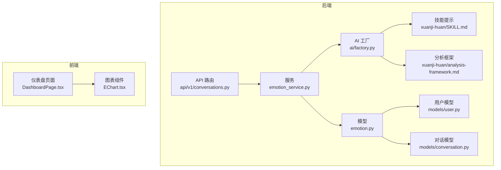
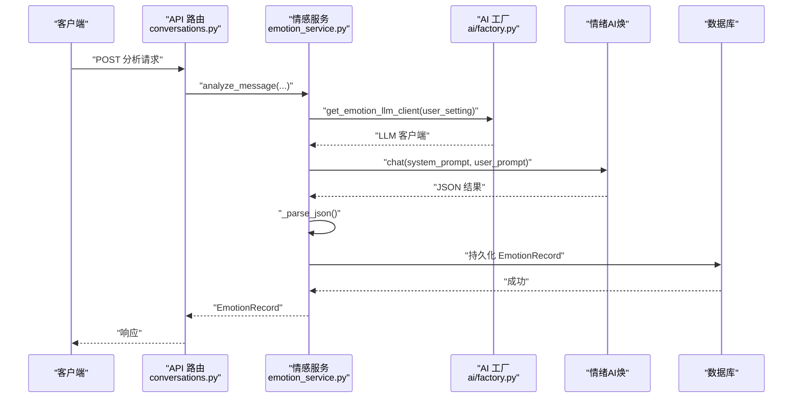
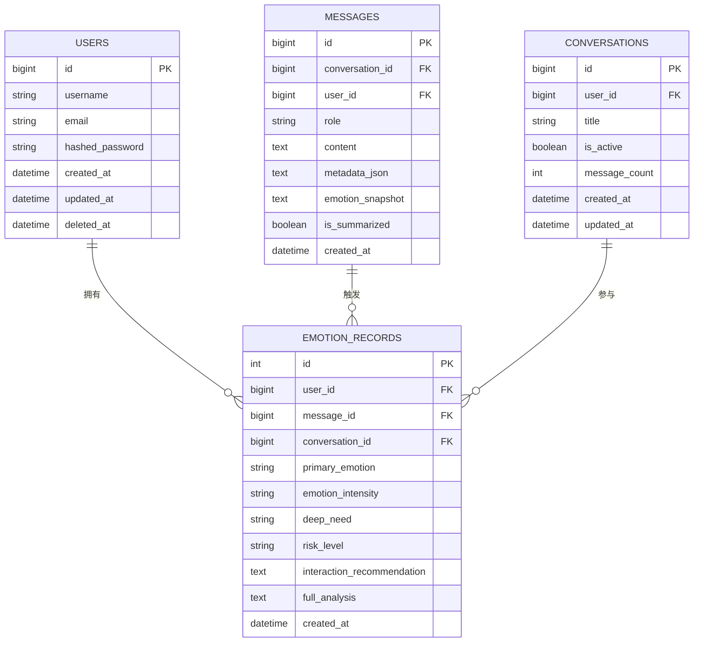
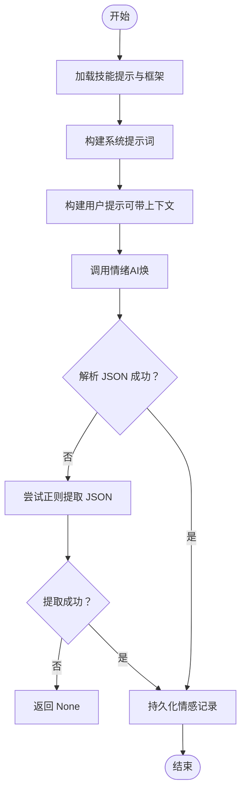
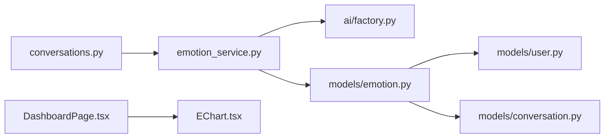
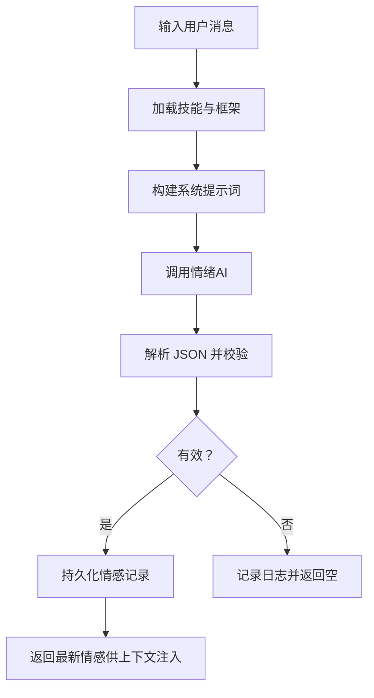

# 情感模型

<cite>
**本文引用的文件**
- [backend/app/models/emotion.py](file://backend/app/models/emotion.py)
- [backend/app/schemas/emotion.py](file://backend/app/schemas/emotion.py)
- [backend/app/services/emotion_service.py](file://backend/app/services/emotion_service.py)
- [backend/app/ai/skills/xuanji-huan/SKILL.md](file://backend/app/ai/skills/xuanji-huan/SKILL.md)
- [backend/app/ai/skills/xuanji-huan/analysis-framework.md](file://backend/app/ai/skills/xuanji-huan/analysis-framework.md)
- [backend/app/ai/factory.py](file://backend/app/ai/factory.py)
- [backend/app/models/conversation.py](file://backend/app/models/conversation.py)
- [backend/app/models/user.py](file://backend/app/models/user.py)
- [backend/app/api/v1/conversations.py](file://backend/app/api/v1/conversations.py)
- [backend/app/schemas/conversation.py](file://backend/app/schemas/conversation.py)
- [backend/app/schemas/user.py](file://backend/app/schemas/user.py)
- [backend/app/ai/skills/xuanji-yao/emotion-format.md](file://backend/app/ai/skills/xuanji-yao/emotion-format.md)
- [frontend/src/components/charts/EChart.tsx](file://frontend/src/components/charts/EChart.tsx)
- [frontend/src/pages/DashboardPage.tsx](file://frontend/src/pages/DashboardPage.tsx)
- [frontend/package.json](file://frontend/package.json)
</cite>

## 目录
1. [引言](#引言)
2. [项目结构](#项目结构)
3. [核心组件](#核心组件)
4. [架构总览](#架构总览)
5. [详细组件分析](#详细组件分析)
6. [依赖分析](#依赖分析)
7. [性能考虑](#性能考虑)
8. [故障排查指南](#故障排查指南)
9. [结论](#结论)
10. [附录](#附录)

## 引言
本设计文档围绕“情感模型”展开，系统性阐述情感状态记录机制、分析结果存储、趋势追踪与风险预警、与用户与对话的关联关系、数据聚合策略，并给出可视化支持、统计分析接口、个性化交互推荐的实现路径。文档同时覆盖隐私保护、存储优化与实时更新机制，旨在为情感计算专家与用户体验设计师提供完整的情感数据管理参考。

## 项目结构
情感模型由后端数据模型与服务层、AI技能与提示词框架、API 接口层以及前端可视化组件构成。核心要点：
- 数据模型定义情感记录实体及其与用户、对话、消息的外键关联。
- 服务层负责调用“情绪AI（焕）”进行分析，解析并持久化结构化结果。
- API 层提供最新情感、历史情感查询接口。
- 前端通过 ECharts 组件展示情感相关统计与趋势（当前以 Token 使用为例，情感可视化可按此扩展）。

**图示来源**
- [backend/app/models/emotion.py:1-29](file://backend/app/models/emotion.py#L1-L29)
- [backend/app/services/emotion_service.py:1-214](file://backend/app/services/emotion_service.py#L1-L214)
- [backend/app/ai/factory.py:1-154](file://backend/app/ai/factory.py#L1-L154)
- [backend/app/ai/skills/xuanji-huan/SKILL.md:1-186](file://backend/app/ai/skills/xuanji-huan/SKILL.md#L1-L186)
- [backend/app/ai/skills/xuanji-huan/analysis-framework.md:1-225](file://backend/app/ai/skills/xuanji-huan/analysis-framework.md#L1-L225)
- [backend/app/api/v1/conversations.py:72-93](file://backend/app/api/v1/conversations.py#L72-L93)
- [backend/app/models/user.py:1-23](file://backend/app/models/user.py#L1-L23)
- [backend/app/models/conversation.py:1-41](file://backend/app/models/conversation.py#L1-L41)
- [frontend/src/components/charts/EChart.tsx:1-30](file://frontend/src/components/charts/EChart.tsx#L1-L30)
- [frontend/src/pages/DashboardPage.tsx:1-279](file://frontend/src/pages/DashboardPage.tsx#L1-L279)

**章节来源**
- [backend/app/models/emotion.py:1-29](file://backend/app/models/emotion.py#L1-L29)
- [backend/app/services/emotion_service.py:1-214](file://backend/app/services/emotion_service.py#L1-L214)
- [backend/app/ai/skills/xuanji-huan/SKILL.md:1-186](file://backend/app/ai/skills/xuanji-huan/SKILL.md#L1-L186)
- [backend/app/ai/skills/xuanji-huan/analysis-framework.md:1-225](file://backend/app/ai/skills/xuanji-huan/analysis-framework.md#L1-L225)
- [backend/app/ai/factory.py:1-154](file://backend/app/ai/factory.py#L1-L154)
- [backend/app/api/v1/conversations.py:72-93](file://backend/app/api/v1/conversations.py#L72-L93)
- [backend/app/models/user.py:1-23](file://backend/app/models/user.py#L1-L23)
- [backend/app/models/conversation.py:1-41](file://backend/app/models/conversation.py#L1-L41)
- [frontend/src/components/charts/EChart.tsx:1-30](file://frontend/src/components/charts/EChart.tsx#L1-L30)
- [frontend/src/pages/DashboardPage.tsx:1-279](file://frontend/src/pages/DashboardPage.tsx#L1-L279)

## 核心组件
- 情感记录实体：记录用户、消息、对话关联，保存主要情绪、强度、深层需求、风险等级、交互建议与完整分析文本。
- 情感服务：封装“情绪AI（焕）”调用、系统提示词加载、JSON 解析与持久化、最新情感与历史查询。
- AI 技能与框架：提供心理-情感分析工作流、维度定义与输出规范，支撑结构化结果生成。
- API 接口：提供获取最新情感与历史情感的 REST 接口。
- 前端可视化：基于 ECharts 的通用图表组件与仪表盘页面，用于展示 Token 使用等统计（情感可视化可复用该模式）。

**章节来源**
- [backend/app/models/emotion.py:9-29](file://backend/app/models/emotion.py#L9-L29)
- [backend/app/schemas/emotion.py:6-19](file://backend/app/schemas/emotion.py#L6-L19)
- [backend/app/services/emotion_service.py:94-214](file://backend/app/services/emotion_service.py#L94-L214)
- [backend/app/ai/skills/xuanji-huan/SKILL.md:31-97](file://backend/app/ai/skills/xuanji-huan/SKILL.md#L31-L97)
- [backend/app/ai/skills/xuanji-huan/analysis-framework.md:38-154](file://backend/app/ai/skills/xuanji-huan/analysis-framework.md#L38-L154)
- [backend/app/api/v1/conversations.py:74-92](file://backend/app/api/v1/conversations.py#L74-L92)
- [frontend/src/components/charts/EChart.tsx:1-30](file://frontend/src/components/charts/EChart.tsx#L1-L30)
- [frontend/src/pages/DashboardPage.tsx:1-279](file://frontend/src/pages/DashboardPage.tsx#L1-L279)

## 架构总览
情感分析从用户消息出发，经由“情绪AI（焕）”生成结构化分析，服务层解析并持久化，随后可通过 API 查询最新与历史情感；前端使用 ECharts 组件渲染统计与趋势。

**图示来源**
- [backend/app/api/v1/conversations.py:72-93](file://backend/app/api/v1/conversations.py#L72-L93)
- [backend/app/services/emotion_service.py:98-157](file://backend/app/services/emotion_service.py#L98-L157)
- [backend/app/ai/factory.py:116-133](file://backend/app/ai/factory.py#L116-L133)

## 详细组件分析

### 数据模型与实体关系
- 实体定义：情感记录包含主情绪、强度、深层需求、风险等级、交互建议、完整分析文本及时间戳；与用户、消息、对话建立外键关联，便于跨层级聚合与回溯。
- 关系映射：用户与情感记录一对多；消息与情感记录可选关联；对话与情感记录可选关联，支持按会话维度的趋势分析。

**图示来源**
- [backend/app/models/user.py:9-23](file://backend/app/models/user.py#L9-L23)
- [backend/app/models/conversation.py:9-41](file://backend/app/models/conversation.py#L9-L41)
- [backend/app/models/emotion.py:9-29](file://backend/app/models/emotion.py#L9-L29)

**章节来源**
- [backend/app/models/emotion.py:9-29](file://backend/app/models/emotion.py#L9-L29)
- [backend/app/models/conversation.py:9-41](file://backend/app/models/conversation.py#L9-L41)
- [backend/app/models/user.py:9-23](file://backend/app/models/user.py#L9-L23)

### 情感分析与存储流程
- 系统提示词：从技能目录加载 SKILL 与分析框架，拼装系统提示词模板，确保分析维度与输出结构一致。
- 调用情绪AI：构造用户提示（可带上下文），调用“情绪AI（焕）”，设置较低温度以提升稳定性与一致性。
- JSON 解析与落库：解析返回的 JSON，若失败尝试正则提取首尾包裹块；将交互建议与完整分析以结构化字段保存；提交事务并刷新记录。
- 最新情感与历史查询：提供按用户查询最新情感与历史列表的能力，便于下游注入与统计。

**图示来源**
- [backend/app/services/emotion_service.py:18-52](file://backend/app/services/emotion_service.py#L18-L52)
- [backend/app/services/emotion_service.py:98-157](file://backend/app/services/emotion_service.py#L98-L157)
- [backend/app/services/emotion_service.py:194-213](file://backend/app/services/emotion_service.py#L194-L213)

**章节来源**
- [backend/app/services/emotion_service.py:98-157](file://backend/app/services/emotion_service.py#L98-L157)
- [backend/app/services/emotion_service.py:18-52](file://backend/app/services/emotion_service.py#L18-L52)
- [backend/app/ai/skills/xuanji-huan/SKILL.md:55-91](file://backend/app/ai/skills/xuanji-huan/SKILL.md#L55-L91)

### 情感类型、强度与风险等级
- 情感类型：来源于“情绪识别”维度，覆盖积极、消极与中性情绪谱系，支持主次情绪标注。
- 强度分级：提供轻、中、高三档，结合分析框架中的强度尺度与持久性维度，辅助下游风格与节奏控制。
- 风险等级：包含无、低、中、高，用于早期预警与干预策略制定。

**章节来源**
- [backend/app/ai/skills/xuanji-huan/analysis-framework.md:38-72](file://backend/app/ai/skills/xuanji-huan/analysis-framework.md#L38-L72)
- [backend/app/ai/skills/xuanji-huan/SKILL.md:78-86](file://backend/app/ai/skills/xuanji-huan/SKILL.md#L78-L86)

### 情感趋势追踪与风险预警
- 动态建模：通过“触发事件—心理解释—情感反应—行为表达—后续影响”的逻辑链，追踪情绪动态变化。
- 预测目标：包括升级风险、崩溃阈值接近、回避概率、主动表达概率等，用于趋势预测与策略调整。
- 风险信号：识别情感崩溃、长期压抑、社交退缩、极端自我否定等风险指标，配合风险等级进行分级预警。

**章节来源**
- [backend/app/ai/skills/xuanji-huan/analysis-framework.md:110-154](file://backend/app/ai/skills/xuanji-huan/analysis-framework.md#L110-L154)
- [backend/app/ai/skills/xuanji-huan/SKILL.md:78-86](file://backend/app/ai/skills/xuanji-huan/SKILL.md#L78-L86)

### 与用户、对话的关联关系与数据聚合
- 用户维度：按用户查询最新情感与历史列表，支持个人画像与长期趋势分析。
- 对话维度：情感记录可关联对话 ID，便于按会话聚合情绪分布、强度变化与交互建议命中率。
- 消息维度：情感记录可关联消息 ID，支持逐句级情绪标注与上下文联动分析。

**章节来源**
- [backend/app/services/emotion_service.py:158-191](file://backend/app/services/emotion_service.py#L158-L191)
- [backend/app/models/emotion.py:13-21](file://backend/app/models/emotion.py#L13-L21)

### 个性化交互推荐与风格适配
- 交互建议：服务层将 JSON 中的交互建议结构化保存，便于下游“对话AI（玄）”与“风格AI（遥）”直接使用。
- 风格适配：风格技能可读取当前情绪状态与强度，结合风格指引生成自然口语化、贴合情境的回复风格。
- 上下文注入：最新情感可用于对话上下文注入，提升回复的共情与针对性。

**章节来源**
- [backend/app/services/emotion_service.py:134-151](file://backend/app/services/emotion_service.py#L134-L151)
- [backend/app/services/emotion_service.py:166-182](file://backend/app/services/emotion_service.py#L166-L182)
- [backend/app/ai/skills/xuanji-yao/emotion-format.md:1-13](file://backend/app/ai/skills/xuanji-yao/emotion-format.md#L1-L13)

### API 与数据访问
- 获取最新情感：按当前用户查询最近一次情感记录，便于实时注入。
- 获取历史情感：按用户分页查询历史记录，支持趋势分析与报表生成。
- 响应模型：统一使用情感记录响应模型，保证前后端契约一致。

**章节来源**
- [backend/app/api/v1/conversations.py:74-92](file://backend/app/api/v1/conversations.py#L74-L92)
- [backend/app/schemas/emotion.py:6-19](file://backend/app/schemas/emotion.py#L6-L19)

### 可视化支持与统计分析接口
- 前端图表组件：ECharts 封装组件，支持初始化、尺寸监听与选项更新。
- 仪表盘页面：提供 Token 使用的统计卡片、折线图、饼图与柱状图，情感可视化可复用相同模式。
- 统计接口：当前提供 Token 使用的分角色、分模型、每日趋势等接口，情感统计可按相同结构扩展。

**章节来源**
- [frontend/src/components/charts/EChart.tsx:1-30](file://frontend/src/components/charts/EChart.tsx#L1-L30)
- [frontend/src/pages/DashboardPage.tsx:1-279](file://frontend/src/pages/DashboardPage.tsx#L1-L279)
- [frontend/package.json:12-18](file://frontend/package.json#L12-L18)

## 依赖分析
- 组件耦合：情感服务依赖 AI 工厂创建“情绪AI（焕）”客户端；服务层与模型层强耦合（ORM 映射与持久化）；API 层依赖服务层；前端依赖图表组件与页面。
- 外部依赖：AI 工厂依赖在线/本地两种 Provider；前端依赖 ECharts 库。
- 潜在循环依赖：当前模块间为单向依赖，未见循环导入。

**图示来源**
- [backend/app/api/v1/conversations.py:72-93](file://backend/app/api/v1/conversations.py#L72-L93)
- [backend/app/services/emotion_service.py:94-157](file://backend/app/services/emotion_service.py#L94-L157)
- [backend/app/ai/factory.py:116-133](file://backend/app/ai/factory.py#L116-L133)
- [backend/app/models/emotion.py:9-29](file://backend/app/models/emotion.py#L9-L29)
- [backend/app/models/user.py:9-23](file://backend/app/models/user.py#L9-L23)
- [backend/app/models/conversation.py:9-41](file://backend/app/models/conversation.py#L9-L41)
- [frontend/src/pages/DashboardPage.tsx:1-279](file://frontend/src/pages/DashboardPage.tsx#L1-L279)
- [frontend/src/components/charts/EChart.tsx:1-30](file://frontend/src/components/charts/EChart.tsx#L1-L30)

**章节来源**
- [backend/app/services/emotion_service.py:94-157](file://backend/app/services/emotion_service.py#L94-L157)
- [backend/app/ai/factory.py:116-133](file://backend/app/ai/factory.py#L116-L133)
- [backend/app/models/emotion.py:9-29](file://backend/app/models/emotion.py#L9-L29)
- [frontend/src/components/charts/EChart.tsx:1-30](file://frontend/src/components/charts/EChart.tsx#L1-L30)

## 性能考虑
- LLM 调用成本控制：降低温度以提升稳定性，避免冗余重复调用；在服务层缓存技能提示内容，减少 IO。
- 数据库写入优化：批量/异步写入策略（如需）；索引覆盖 user_id/message_id/conversation_id 提升查询效率。
- 前端渲染优化：ECharts 图表按需初始化与销毁，避免内存泄漏；图表选项变更采用增量更新。
- 存储优化：对 full_analysis 字段可考虑压缩存储或归档策略；对交互建议字段可拆分结构化索引以支持检索。

## 故障排查指南
- LLM 配置错误：当缺少 Provider、API Key、Base URL 或模型名时抛出配置异常，检查用户设置与环境变量。
- JSON 解析失败：服务层具备正则提取与二次解析逻辑，若仍失败，检查情绪AI输出格式与系统提示词一致性。
- 权限与认证：API 接口依赖当前用户鉴权，确认登录状态与权限。
- 前端图表：若图表不显示，检查容器尺寸与窗口 resize 事件绑定；确认 ECharts 初始化与选项更新顺序。

**章节来源**
- [backend/app/ai/factory.py:14-36](file://backend/app/ai/factory.py#L14-L36)
- [backend/app/services/emotion_service.py:152-156](file://backend/app/services/emotion_service.py#L152-L156)
- [backend/app/services/emotion_service.py:194-213](file://backend/app/services/emotion_service.py#L194-L213)
- [frontend/src/components/charts/EChart.tsx:13-26](file://frontend/src/components/charts/EChart.tsx#L13-L26)

## 结论
情感模型以结构化数据为核心，结合心理-情感分析框架与“情绪AI（焕）”实现稳定可靠的分析与存储；通过 API 与前端可视化形成闭环，既满足实时交互注入，也为长期趋势与风险预警提供数据基础。建议后续扩展情感统计接口与可视化面板，并完善隐私与存储优化策略。

## 附录
- 概念性情感分析流程（示意）
