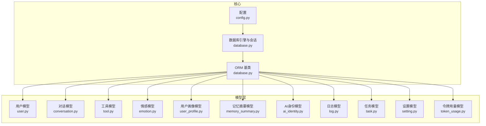
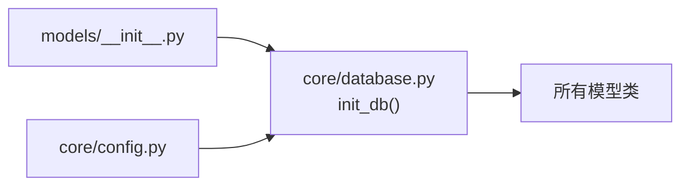

# 数据模型设计

<cite>
**本文引用的文件**
- [backend/app/models/user.py](file://backend/app/models/user.py)
- [backend/app/models/conversation.py](file://backend/app/models/conversation.py)
- [backend/app/models/tool.py](file://backend/app/models/tool.py)
- [backend/app/models/emotion.py](file://backend/app/models/emotion.py)
- [backend/app/models/user_profile.py](file://backend/app/models/user_profile.py)
- [backend/app/models/memory_summary.py](file://backend/app/models/memory_summary.py)
- [backend/app/models/ai_identity.py](file://backend/app/models/ai_identity.py)
- [backend/app/models/log.py](file://backend/app/models/log.py)
- [backend/app/models/task.py](file://backend/app/models/task.py)
- [backend/app/models/setting.py](file://backend/app/models/setting.py)
- [backend/app/models/token_usage.py](file://backend/app/models/token_usage.py)
- [backend/app/models/__init__.py](file://backend/app/models/__init__.py)
- [backend/app/core/database.py](file://backend/app/core/database.py)
- [backend/app/core/config.py](file://backend/app/core/config.py)
- [backend/app/schemas/user.py](file://backend/app/schemas/user.py)
- [backend/app/schemas/conversation.py](file://backend/app/schemas/conversation.py)
- [backend/app/schemas/emotion.py](file://backend/app/schemas/emotion.py)
- [backend/app/schemas/profile.py](file://backend/app/schemas/profile.py)
</cite>

## 目录
1. [简介](#简介)
2. [项目结构](#项目结构)
3. [核心组件](#核心组件)
4. [架构总览](#架构总览)
5. [详细组件分析](#详细组件分析)
6. [依赖分析](#依赖分析)
7. [性能考虑](#性能考虑)
8. [故障排查指南](#故障排查指南)
9. [结论](#结论)
10. [附录](#附录)

## 简介
本设计文档围绕 XuanJi 的数据模型进行系统化梳理与说明，覆盖用户模型、对话模型、工具模型、情感模型、用户画像模型等核心实体，并给出字段定义、数据类型选择、索引设计、主外键约束、数据完整性保障、查询优化策略、数据生命周期与迁移方案、数据库性能调优与并发控制建议。文档同时提供面向数据库开发者与系统架构师的完整参考。

## 项目结构
后端采用 SQLAlchemy ORM 映射 MySQL，模型集中于 backend/app/models，初始化与自动迁移逻辑位于 backend/app/core/database.py，数据库连接参数由 backend/app/core/config.py 提供。



图表来源
- [backend/app/core/config.py:48-62](file://backend/app/core/config.py#L48-L62)
- [backend/app/core/database.py:1-65](file://backend/app/core/database.py#L1-L65)
- [backend/app/models/__init__.py:1-19](file://backend/app/models/__init__.py#L1-L19)

章节来源
- [backend/app/core/config.py:1-68](file://backend/app/core/config.py#L1-L68)
- [backend/app/core/database.py:1-65](file://backend/app/core/database.py#L1-L65)
- [backend/app/models/__init__.py:1-19](file://backend/app/models/__init__.py#L1-L19)

## 核心组件
本节概述各模型的核心职责与关键字段，便于快速理解整体数据结构。

- 用户模型（User）
  - 职责：存储用户基本信息与认证凭据
  - 关键字段：id、username、email、hashed_password、created_at、updated_at、deleted_at
  - 约束与索引：唯一索引（username、email），自增主键

- 对话模型（Conversation）与消息模型（Message）
  - 职责：记录用户对话历史与消息内容
  - 关键字段：Conversation 包含 user_id、title、is_active、message_count；Message 包含 conversation_id、user_id、role、content、metadata_json、emotion_snapshot、is_summarized
  - 约束与索引：外键级联删除（CASCADE），多处建立索引以支撑高频查询

- 工具模型（Tool）、组合模型（ToolComposition）、版本模型（ToolVersion）
  - 职责：管理工具定义、组合步骤与版本快照
  - 关键字段：Tool（name、description、code、language、version、tool_type、is_builtin、created_by）；ToolComposition（composite_tool_id、sub_tool_id、step_order、input_mapping、output_key）；ToolVersion（tool_id、version、code、description、pipeline_snapshot、change_summary、created_by）

- 情感模型（EmotionRecord）
  - 职责：记录用户在特定消息或对话中的情感快照
  - 关键字段：user_id、message_id、conversation_id、primary_emotion、emotion_intensity、deep_need、risk_level、interaction_recommendation、full_analysis

- 用户画像模型（UserProfile）
  - 职责：保存用户的人格特征、依恋风格、核心需求、情绪基线等画像信息
  - 关键字段：user_id（唯一索引）、personality_traits、attachment_style、core_needs、emotional_baseline、trigger_topics、safe_topics、interests、summary_text、version

- 记忆摘要模型（MemorySummary）
  - 职责：按周期（日/周/月/年）汇总用户的记忆要点、关键情绪与重要事件
  - 关键字段：user_id、period_type、period_start、period_end、summary_text、key_emotions、key_topics、important_events、source_message_count、source_summary_ids

- AI身份模型（AIIdentity）
  - 职责：为用户维护多个AI角色的身份档案与演进状态
  - 关键字段：user_id、ai_name（唯一约束：user_id+ai_name）、persona_text、gender、appearance、personality、speaking_style、values、emotional_state、evolution_log、is_base_locked、version

- 日志模型（Log）
  - 职责：记录系统运行日志，关联任务、工具、用户等
  - 关键字段：task_id、tool_id、level、message、details、user_id、source、status_code

- 任务模型（Task）
  - 职责：记录用户任务及其状态
  - 关键字段：user_id、title、description、status、result

- 设置模型（UserSetting）
  - 职责：用户级配置项（LLM提供商、模型名、Ollama配置、聊天偏好、配额等）
  - 关键字段：user_id（唯一索引）、各类provider与model配置、show_tool_result、show_collaboration、token_monthly_budget

- 令牌用量模型（TokenUsage）
  - 职责：统计用户在不同模型与角色下的令牌消耗
  - 关键字段：user_id、prompt_tokens、completion_tokens、total_tokens、model、role_name

章节来源
- [backend/app/models/user.py:9-23](file://backend/app/models/user.py#L9-L23)
- [backend/app/models/conversation.py:9-41](file://backend/app/models/conversation.py#L9-L41)
- [backend/app/models/tool.py:9-64](file://backend/app/models/tool.py#L9-L64)
- [backend/app/models/emotion.py:9-29](file://backend/app/models/emotion.py#L9-L29)
- [backend/app/models/user_profile.py:9-29](file://backend/app/models/user_profile.py#L9-L29)
- [backend/app/models/memory_summary.py:9-26](file://backend/app/models/memory_summary.py#L9-L26)
- [backend/app/models/ai_identity.py:9-38](file://backend/app/models/ai_identity.py#L9-L38)
- [backend/app/models/log.py:9-30](file://backend/app/models/log.py#L9-L30)
- [backend/app/models/task.py:9-28](file://backend/app/models/task.py#L9-L28)
- [backend/app/models/setting.py:9-60](file://backend/app/models/setting.py#L9-L60)
- [backend/app/models/token_usage.py:9-24](file://backend/app/models/token_usage.py#L9-L24)

## 架构总览
下图展示数据模型之间的关系与约束，体现用户中心的数据组织方式以及跨模型的引用关系。

```mermaid
erDiagram
USERS {
bigint id PK
varchar username UK
varchar email UK
varchar hashed_password
datetime created_at
datetime updated_at
datetime deleted_at
}
CONVERSATIONS {
bigint id PK
bigint user_id FK
varchar title
boolean is_active
int message_count
datetime created_at
datetime updated_at
}
MESSAGES {
bigint id PK
bigint conversation_id FK
bigint user_id FK
varchar role
text content
text metadata
text emotion_snapshot
boolean is_summarized
datetime created_at
}
TOOLS {
bigint id PK
varchar name UK
text description
text description_zh
text code
varchar language
int version
varchar tool_type
boolean is_builtin
bigint created_by FK
datetime created_at
datetime updated_at
}
TOOL_COMPOSITIONS {
bigint id PK
bigint composite_tool_id FK
bigint sub_tool_id FK
int step_order
json input_mapping
varchar output_key
}
TOOL_VERSIONS {
bigint id PK
bigint tool_id FK
int version
text code
text description
text description_zh
json pipeline_snapshot
text change_summary
datetime created_at
bigint created_by FK
}
EMOTION_RECORDS {
bigint id PK
bigint user_id FK
bigint message_id FK
bigint conversation_id FK
varchar primary_emotion
varchar emotion_intensity
varchar deep_need
varchar risk_level
text interaction_recommendation
text full_analysis
datetime created_at
}
USER_PROFILES {
bigint id PK
bigint user_id FK UK
text personality_traits
varchar attachment_style
text core_needs
text emotional_baseline
text trigger_topics
text safe_topics
text interests
text summary_text
int version
datetime created_at
datetime updated_at
}
MEMORY_SUMMARIES {
bigint id PK
bigint user_id FK
varchar period_type
datetime period_start
datetime period_end
text summary_text
text key_emotions
text key_topics
text important_events
int source_message_count
text source_summary_ids
datetime created_at
}
AI_IDENTITIES {
bigint id PK
bigint user_id FK
varchar ai_name
text persona_text
varchar gender
text appearance
text personality
text speaking_style
text values
text emotional_state
text evolution_log
boolean is_base_locked
int version
datetime created_at
datetime updated_at
}
LOGS {
bigint id PK
bigint task_id FK
bigint tool_id FK
varchar level
varchar message
json details
bigint user_id FK
varchar source
int status_code
datetime created_at
}
TASKS {
bigint id PK
bigint user_id FK
varchar title
text description
varchar status
text result
datetime created_at
datetime updated_at
}
USER_SETTINGS {
bigint id PK
bigint user_id FK UK
varchar llm_provider
varchar llm_api_key
varchar llm_api_base_url
varchar llm_model_name
varchar ollama_base_url
varchar ollama_model
varchar tool_llm_provider
varchar tool_llm_api_key
varchar tool_llm_api_base_url
varchar tool_llm_model_name
varchar tool_ollama_base_url
varchar tool_ollama_model
varchar intent_llm_provider
varchar intent_llm_api_key
varchar intent_llm_api_base_url
varchar intent_llm_model_name
varchar emotion_llm_provider
varchar emotion_llm_api_key
varchar emotion_llm_api_base_url
varchar emotion_llm_model_name
varchar format_llm_provider
varchar format_llm_api_key
varchar format_llm_api_base_url
varchar format_llm_model_name
boolean show_tool_result
boolean show_collaboration
int token_monthly_budget
datetime created_at
datetime updated_at
}
TOKEN_USAGES {
bigint id PK
bigint user_id FK
int prompt_tokens
int completion_tokens
int total_tokens
varchar model
varchar role_name
datetime created_at
}
USERS ||--o{ CONVERSATIONS : "拥有"
USERS ||--o{ MESSAGES : "发送"
USERS ||--o{ EMOTION_RECORDS : "产生"
USERS ||--|| USER_PROFILES : "对应"
USERS ||--o{ TASKS : "创建"
USERS ||--|| USER_SETTINGS : "配置"
USERS ||--o{ TOKEN_USAGES : "消耗"
CONVERSATIONS ||--o{ MESSAGES : "包含"
MESSAGES ||--|| EMOTION_RECORDS : "触发"
USERS ||--o{ EMOTION_RECORDS : "关联"
TOOLS ||--o{ TOOL_VERSIONS : "有版本"
TOOLS ||--o{ TOOL_COMPOSITIONS : "组合"
USERS ||--o{ TOOL_VERSIONS : "创建"
USERS ||--o{ TOOL_COMPOSITIONS : "创建"
TASKS ||--o{ LOGS : "产生"
TOOLS ||--o{ LOGS : "被调用"
USERS ||--o{ LOGS : "操作"
```

图表来源
- [backend/app/models/user.py:9-23](file://backend/app/models/user.py#L9-L23)
- [backend/app/models/conversation.py:9-41](file://backend/app/models/conversation.py#L9-L41)
- [backend/app/models/tool.py:9-64](file://backend/app/models/tool.py#L9-L64)
- [backend/app/models/emotion.py:9-29](file://backend/app/models/emotion.py#L9-L29)
- [backend/app/models/user_profile.py:9-29](file://backend/app/models/user_profile.py#L9-L29)
- [backend/app/models/memory_summary.py:9-26](file://backend/app/models/memory_summary.py#L9-L26)
- [backend/app/models/ai_identity.py:9-38](file://backend/app/models/ai_identity.py#L9-L38)
- [backend/app/models/log.py:9-30](file://backend/app/models/log.py#L9-L30)
- [backend/app/models/task.py:9-28](file://backend/app/models/task.py#L9-L28)
- [backend/app/models/setting.py:9-60](file://backend/app/models/setting.py#L9-L60)
- [backend/app/models/token_usage.py:9-24](file://backend/app/models/token_usage.py#L9-L24)

## 详细组件分析

### 用户模型（User）
- 设计理念
  - 使用自增主键与唯一索引确保用户标识唯一性与高查询效率
  - 密码以哈希形式存储，避免明文泄露
  - 支持软删除（deleted_at）以便审计与恢复
- 字段与类型
  - id: BigInteger 主键
  - username: String(50) 唯一且带索引
  - email: String(191) 唯一且带索引
  - hashed_password: String(255)
  - created_at/updated_at: DateTime（默认值与更新触发器）
  - deleted_at: DateTime 可空
- 索引与约束
  - 主键：id
  - 唯一索引：username、email
  - 时间戳默认值与更新触发器由数据库函数提供
- 查询优化
  - 登录与注册场景优先使用 username/email 等值查询，利用唯一索引
  - 软删除场景建议在查询时过滤 deleted_at 为空
- 安全与合规
  - 密码必须经安全哈希算法处理
  - 遵循最小权限原则，避免在日志中输出敏感字段

章节来源
- [backend/app/models/user.py:9-23](file://backend/app/models/user.py#L9-L23)

### 对话模型（Conversation）与消息模型（Message）
- 设计理念
  - 将对话与消息解耦，支持多对多的消息聚合与检索
  - 外键级联删除保证数据一致性，避免孤儿数据
- 字段与类型
  - Conversation：user_id（FK）、title、is_active、message_count、时间戳
  - Message：conversation_id（FK）、user_id（FK）、role、content、metadata_json、emotion_snapshot、is_summarized、时间戳
- 索引与约束
  - 多处建立索引：user_id、conversation_id、message_id、role 等
  - 级联删除（ondelete="CASCADE"）与可空引用（SET NULL）结合使用
- 查询优化
  - 按用户分页查询对话列表：基于 user_id + created_at 排序
  - 消息检索：基于 conversation_id + created_at 分页
  - 情感分析：通过 emotion_snapshot 字段快速定位情感上下文
- 性能建议
  - 对高频查询字段建立复合索引（如 user_id + is_active）
  - 大文本字段（content、metadata_json、emotion_snapshot）建议分表或归档

章节来源
- [backend/app/models/conversation.py:9-41](file://backend/app/models/conversation.py#L9-L41)

### 工具模型（Tool）、组合模型（ToolComposition）、版本模型（ToolVersion）
- 设计理念
  - 工具原子能力与组合能力分离，版本化管理便于回滚与追踪
  - 组合步骤支持输入映射与输出键，提升工具链灵活性
- 字段与类型
  - Tool：name（唯一）、description/description_zh、code、language、version、tool_type、is_builtin、created_by（可空）
  - ToolComposition：composite_tool_id、sub_tool_id、step_order、input_mapping、output_key
  - ToolVersion：tool_id、version、code、description、pipeline_snapshot、change_summary、created_by
- 索引与约束
  - Tool.name 唯一索引
  - 多处外键约束，部分使用 SET NULL 与 RESTRICT 以保护关键关系
- 查询优化
  - 工具检索：按 name、language、tool_type、is_builtin 过滤
  - 组合链路：按 step_order 排序，支持拓扑遍历
  - 版本对比：按 version 升序或降序查询
- 安全与合规
  - 工具代码执行需沙箱隔离与超时控制
  - 版本变更记录用于审计与回滚

章节来源
- [backend/app/models/tool.py:9-64](file://backend/app/models/tool.py#L9-L64)

### 情感模型（EmotionRecord）
- 设计理念
  - 支持消息级与对话级情感快照，便于个性化交互与风险评估
- 字段与类型
  - user_id（FK）、message_id（可空/FK）、conversation_id（可空/FK）、primary_emotion、emotion_intensity、deep_need、risk_level、interaction_recommendation、full_analysis、created_at
- 索引与约束
  - 多处索引：user_id、message_id、conversation_id
  - 可空外键允许非消息触发的情感记录
- 查询优化
  - 按用户与时间窗口聚合情感强度与风险等级
  - 结合记忆摘要模型进行趋势分析
- 应用建议
  - 情感标签与交互建议应与用户画像联动

章节来源
- [backend/app/models/emotion.py:9-29](file://backend/app/models/emotion.py#L9-L29)

### 用户画像模型（UserProfile）
- 设计理念
  - 以结构化文本与JSON字段承载复杂的人格与行为特征
  - 版本号用于追踪画像演进
- 字段与类型
  - user_id（唯一FK）、personality_traits、attachment_style、core_needs、emotional_baseline、trigger_topics、safe_topics、interests、summary_text、version
- 索引与约束
  - user_id 唯一索引，确保一对一关系
- 查询优化
  - 画像检索与更新走 user_id
  - 版本字段可用于增量同步
- 应用建议
  - 画像与情感记录、记忆摘要联动，形成动态画像

章节来源
- [backend/app/models/user_profile.py:9-29](file://backend/app/models/user_profile.py#L9-L29)

### 记忆摘要模型（MemorySummary）
- 设计理念
  - 按周期聚合用户记忆要点，支持日/周/月/年维度的洞察
- 字段与类型
  - user_id、period_type、period_start、period_end、summary_text、key_emotions、key_topics、important_events、source_message_count、source_summary_ids、created_at
- 索引与约束
  - user_id 索引，period_type 与时间范围用于高效切片
- 查询优化
  - 按用户与时间段查询摘要
  - JSON字段（key_emotions/key_topics/important_events）建议配合全文索引或预聚合表
- 应用建议
  - 与情感模型、对话模型联动生成个性化摘要

章节来源
- [backend/app/models/memory_summary.py:9-26](file://backend/app/models/memory_summary.py#L9-L26)

### AI身份模型（AIIdentity）
- 设计理念
  - 为每个用户维护多个AI角色的身份档案与演进日志
  - 唯一约束防止重复身份
- 字段与类型
  - user_id、ai_name、persona_text、gender、appearance、personality、speaking_style、values、emotional_state、evolution_log、is_base_locked、version、时间戳
- 索引与约束
  - 唯一约束：user_id + ai_name
- 查询优化
  - 按用户与ai_name检索身份档案
  - 演进日志按时间排序
- 应用建议
  - 身份锁定与版本控制用于稳定交互体验

章节来源
- [backend/app/models/ai_identity.py:9-38](file://backend/app/models/ai_identity.py#L9-L38)

### 日志模型（Log）、任务模型（Task）、设置模型（UserSetting）、令牌用量模型（TokenUsage）
- 设计理念
  - 日志模型统一记录系统运行轨迹，支持按任务、工具、用户、来源模块等维度检索
  - 任务模型承载用户任务生命周期
  - 设置模型集中管理AI与应用配置
  - 令牌用量模型用于成本与配额控制
- 字段与类型
  - Log：task_id、tool_id、level、message、details、user_id、source、status_code、created_at
  - Task：user_id、title、description、status、result、时间戳
  - UserSetting：user_id（唯一）、LLM/Ollama配置、聊天偏好、配额
  - TokenUsage：user_id、prompt_tokens、completion_tokens、total_tokens、model、role_name、created_at
- 索引与约束
  - 多处外键与索引，便于多维检索
- 查询优化
  - 日志按 created_at 降序分页
  - 令牌用量按 user_id + created_at 聚合
- 应用建议
  - 日志分级与脱敏，避免敏感信息泄露

章节来源
- [backend/app/models/log.py:9-30](file://backend/app/models/log.py#L9-L30)
- [backend/app/models/task.py:9-28](file://backend/app/models/task.py#L9-L28)
- [backend/app/models/setting.py:9-60](file://backend/app/models/setting.py#L9-L60)
- [backend/app/models/token_usage.py:9-24](file://backend/app/models/token_usage.py#L9-L24)

## 依赖分析
- 模型导入与暴露
  - models/__init__.py 统一导出所有模型，便于初始化与迁移脚本加载
- 初始化与自动迁移
  - database.py 在 init_db 中创建数据库与表，并自动添加缺失列，减少手工迁移成本
- 配置驱动
  - config.py 提供数据库连接字符串，支持从环境变量读取



图表来源
- [backend/app/models/__init__.py:1-19](file://backend/app/models/__init__.py#L1-L19)
- [backend/app/core/database.py:22-42](file://backend/app/core/database.py#L22-L42)
- [backend/app/core/config.py:48-62](file://backend/app/core/config.py#L48-L62)

章节来源
- [backend/app/models/__init__.py:1-19](file://backend/app/models/__init__.py#L1-L19)
- [backend/app/core/database.py:22-42](file://backend/app/core/database.py#L22-L42)
- [backend/app/core/config.py:48-62](file://backend/app/core/config.py#L48-L62)

## 性能考虑
- 索引策略
  - 高频查询字段（如 user_id、username、email、conversation_id、message_id、tool.name、user_id+ai_name）建立单列或复合索引
  - 对时间字段（created_at、updated_at、period_start/period_end）建立索引以支持范围查询
- 查询优化
  - 分页查询使用主键或索引列排序，避免全表扫描
  - 大文本字段（content、metadata、emotion_snapshot、summary_text）建议延迟加载或异步归档
- 缓存与物化
  - 对热点画像、摘要与配置进行缓存，降低数据库压力
- 并发与事务
  - 使用数据库事务保证写入一致性，避免脏读与丢失更新
  - 对高并发写入场景启用行级锁与重试机制
- 自动迁移与兼容
  - 利用自动添加缺失列的机制，减少部署中断
- 监控与告警
  - 监控慢查询、索引命中率与锁等待，及时调整索引与SQL

## 故障排查指南
- 初始化失败
  - 检查数据库连接字符串与权限
  - 确认数据库存在且字符集为 utf8mb4
- 迁移异常
  - 查看自动迁移日志，确认缺失列是否成功添加
  - 手动检查表结构与模型定义一致性
- 查询缓慢
  - 使用 EXPLAIN 分析执行计划，确认索引是否生效
  - 对大结果集分页与限制返回字段
- 数据不一致
  - 检查外键约束与级联策略
  - 确认事务边界与提交时机
- 日志与审计
  - 使用 Log 模型记录关键操作，保留必要的上下文信息

章节来源
- [backend/app/core/database.py:22-65](file://backend/app/core/database.py#L22-L65)
- [backend/app/models/log.py:9-30](file://backend/app/models/log.py#L9-L30)

## 结论
XuanJi 的数据模型以用户为中心，围绕对话、工具、情感、画像与AI身份构建了完整的心理陪伴与智能交互数据骨架。通过合理的索引设计、外键约束与自动迁移机制，系统在功能扩展与数据一致性之间取得了良好平衡。建议在生产环境中进一步完善缓存策略、监控体系与安全审计，持续优化查询性能与用户体验。

## 附录
- 数据生命周期管理
  - 用户：软删除标记 deleted_at，定期清理长期未登录账户
  - 对话与消息：按策略归档历史数据，保留近期活跃对话
  - 工具：版本化管理，废弃版本迁移至历史表
  - 情感与画像：定期重算与校准，保留演进日志
- 备份策略
  - 全量备份：每周一次
  - 增量备份：每日一次
  - 归档：超过保留期的历史数据迁移至冷存储
- 迁移方案
  - 新增字段：通过自动迁移机制补充
  - 表结构调整：评估影响范围，分批迁移并回滚测试
  - 数据清洗：统一格式与编码，确保一致性