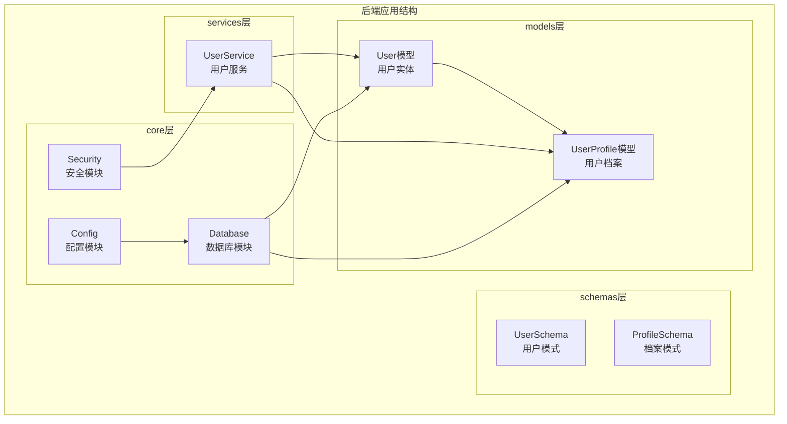
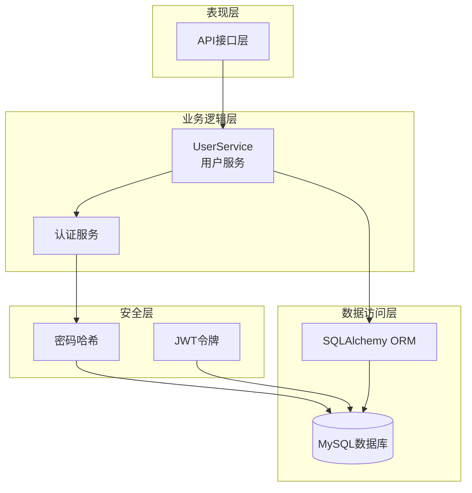
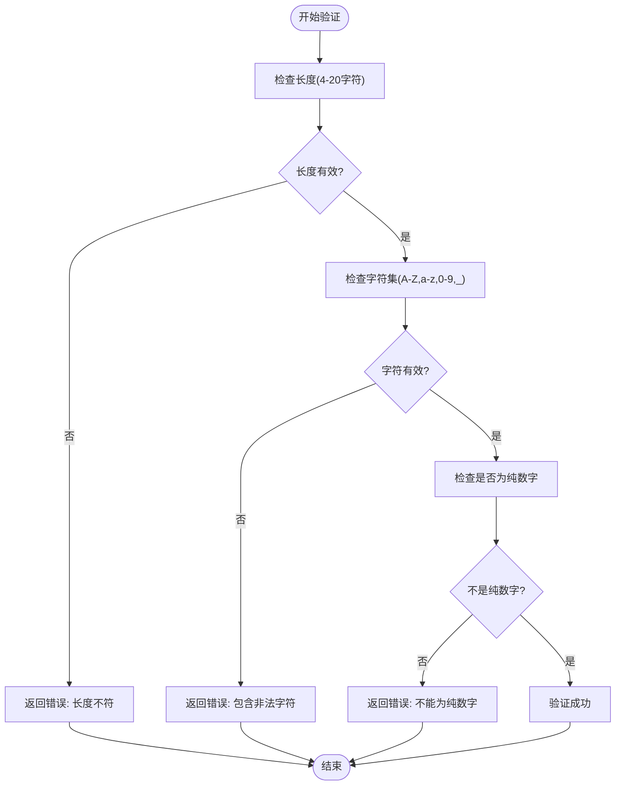
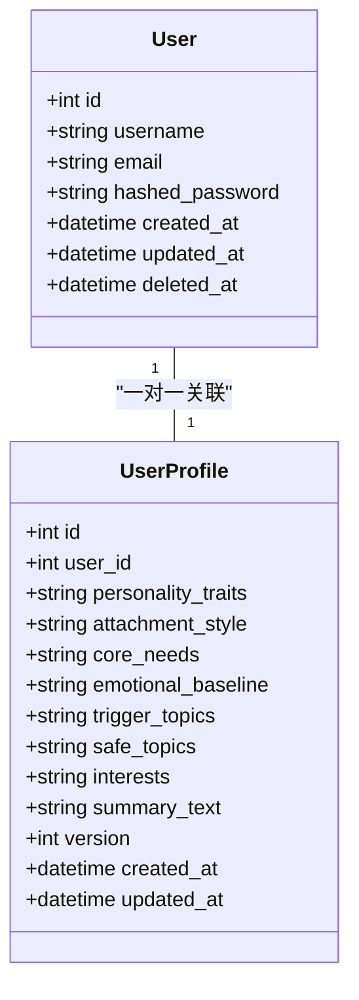
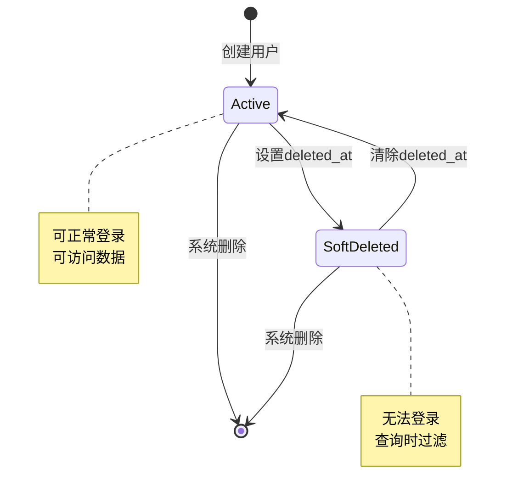
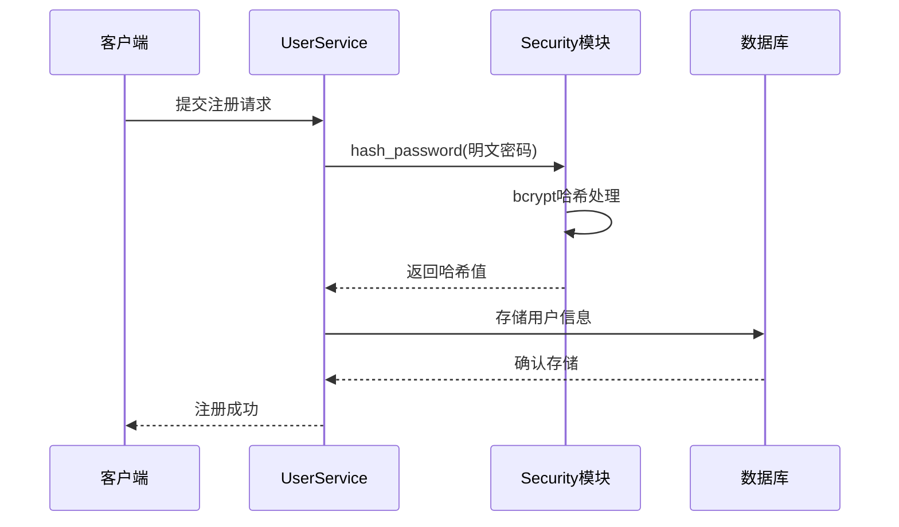
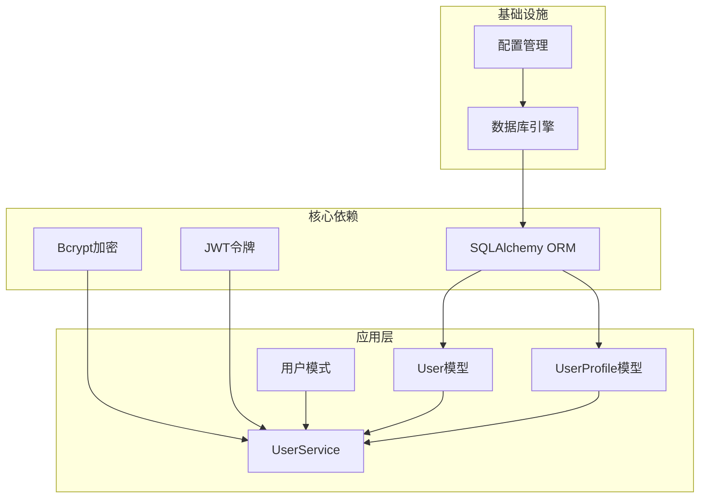

# 用户模型

<cite>
**本文档引用的文件**
- [backend/app/models/user.py](file://backend/app/models/user.py)
- [backend/app/models/user_profile.py](file://backend/app/models/user_profile.py)
- [backend/app/schemas/user.py](file://backend/app/schemas/user.py)
- [backend/app/schemas/profile.py](file://backend/app/schemas/profile.py)
- [backend/app/services/user_service.py](file://backend/app/services/user_service.py)
- [backend/app/core/security.py](file://backend/app/core/security.py)
- [backend/app/core/database.py](file://backend/app/core/database.py)
- [backend/app/core/config.py](file://backend/app/core/config.py)
</cite>

## 目录
1. [简介](#简介)
2. [项目结构](#项目结构)
3. [核心组件](#核心组件)
4. [架构概览](#架构概览)
5. [详细组件分析](#详细组件分析)
6. [依赖关系分析](#依赖关系分析)
7. [性能考虑](#性能考虑)
8. [故障排除指南](#故障排除指南)
9. [结论](#结论)

## 简介

本文档提供了XuanJi项目中用户模型的完整设计文档。该系统采用基于SQLAlchemy的ORM架构，实现了完整的用户身份认证和档案管理系统。文档深入解释了User实体和UserProfile实体的字段定义、数据类型选择、约束条件和索引设计，详细说明了用户名、邮箱、密码哈希等关键字段的设计考量，并阐述了用户档案与用户实体的一对一关联关系。

## 项目结构

用户模型相关文件在项目中的组织结构如下：



**图表来源**
- [backend/app/models/user.py:1-23](file://backend/app/models/user.py#L1-L23)
- [backend/app/models/user_profile.py:1-29](file://backend/app/models/user_profile.py#L1-L29)
- [backend/app/services/user_service.py:1-46](file://backend/app/services/user_service.py#L1-L46)

**章节来源**
- [backend/app/models/user.py:1-23](file://backend/app/models/user.py#L1-L23)
- [backend/app/models/user_profile.py:1-29](file://backend/app/models/user_profile.py#L1-L29)
- [backend/app/schemas/user.py:1-68](file://backend/app/schemas/user.py#L1-L68)
- [backend/app/schemas/profile.py:1-22](file://backend/app/schemas/profile.py#L1-L22)

## 核心组件

### 用户实体(User)

User实体是系统的核心身份认证模型，负责存储用户的基本信息和认证凭据。该实体采用了完整的软删除机制，支持用户生命周期的完整管理。

**主要字段设计**：
- `id`: 主键，使用BigInteger确保足够的扩展性
- `username`: 唯一标识符，限制长度为4-20字符，支持字母、数字和下划线
- `email`: 用户邮箱地址，唯一且支持国际化域名
- `hashed_password`: 存储经过bcrypt哈希处理的密码
- `created_at/updated_at`: 自动时间戳管理
- `deleted_at`: 软删除标记字段

### 用户档案实体(UserProfile)

UserProfile实体与User实体建立一对一关联关系，存储用户的个性化档案信息。该实体通过外键约束确保每个用户只能有一个对应的档案。

**档案字段设计**：
- `user_id`: 外键关联到User实体，设置级联删除
- `personality_traits`: 性格特征描述
- `attachment_style`: 依恋类型
- `core_needs`: 核心需求
- `emotional_baseline`: 情感基线
- `trigger_topics`: 触发话题
- `safe_topics`: 安全话题
- `interests`: 兴趣爱好
- `summary_text`: 档案摘要
- `version`: 版本控制用于并发更新管理

**章节来源**
- [backend/app/models/user.py:9-23](file://backend/app/models/user.py#L9-L23)
- [backend/app/models/user_profile.py:9-29](file://backend/app/models/user_profile.py#L9-L29)

## 架构概览

用户模型的整体架构采用分层设计，确保了关注点分离和代码的可维护性：



**图表来源**
- [backend/app/services/user_service.py:8-46](file://backend/app/services/user_service.py#L8-L46)
- [backend/app/core/security.py:12-38](file://backend/app/core/security.py#L12-L38)
- [backend/app/core/database.py:10-65](file://backend/app/core/database.py#L10-L65)

## 详细组件分析

### 数据模型设计

#### User实体详细分析

User实体的设计充分考虑了性能、安全性和扩展性需求：

```mermaid
erDiagram
USERS {
bigint id PK
varchar username UK
varchar email UK
varchar hashed_password
datetime created_at
datetime updated_at
datetime deleted_at
}
USER_PROFILES {
bigint id PK
bigint user_id UK FK
text personality_traits
varchar attachment_style
text core_needs
text emotional_baseline
text trigger_topics
text safe_topics
text interests
text summary_text
int version
datetime created_at
datetime updated_at
}
USERS ||--|| USER_PROFILES : "一对一关联"
```

**图表来源**
- [backend/app/models/user.py:9-23](file://backend/app/models/user.py#L9-L23)
- [backend/app/models/user_profile.py:9-29](file://backend/app/models/user_profile.py#L9-L29)

#### 字段设计考量

**用户名(username)**：
- 长度限制：4-20字符，平衡易记性和安全性
- 字符集：支持字母、数字、下划线，避免特殊字符
- 唯一性：防止重复注册
- 索引：建立唯一索引提升查询性能

**邮箱(email)**：
- 长度限制：191字符，支持国际化域名
- 唯一性：确保用户身份唯一性
- 索引：建立唯一索引优化登录查询

**密码哈希(hashed_password)**：
- 使用bcrypt进行单向哈希加密
- 自动添加盐值防止彩虹表攻击
- 不存储明文密码

**时间戳字段**：
- `created_at`: 记录用户创建时间
- `updated_at`: 自动更新记录修改时间
- `deleted_at`: 支持软删除机制

**章节来源**
- [backend/app/models/user.py:12-22](file://backend/app/models/user.py#L12-L22)
- [backend/app/models/user_profile.py:12-28](file://backend/app/models/user_profile.py#L12-L28)

### 数据验证规则

系统实现了多层次的数据验证机制：

#### 用户名验证规则



**图表来源**
- [backend/app/schemas/user.py:11-19](file://backend/app/schemas/user.py#L11-L19)

#### 密码验证规则

密码验证确保了足够的安全强度：

**验证标准**：
- 最小长度：8字符
- 必须包含：大写字母、小写字母、数字、特殊字符
- 特殊字符集合：所有可打印标点符号

**章节来源**
- [backend/app/schemas/user.py:22-37](file://backend/app/schemas/user.py#L22-L37)

### 关联关系设计

#### 一对一关联实现

User和UserProfile之间建立了一对一关联关系，通过外键约束确保数据完整性：



**图表来源**
- [backend/app/models/user.py:9-23](file://backend/app/models/user.py#L9-L23)
- [backend/app/models/user_profile.py:9-29](file://backend/app/models/user_profile.py#L9-L29)

#### 级联删除机制

UserProfile设置了级联删除约束，当用户被删除时，其对应的档案也会自动清理：

**约束设计**：
- 外键：`user_id` 引用 `users.id`
- 删除策略：`ON DELETE CASCADE`
- 唯一性：确保一对一关系

**章节来源**
- [backend/app/models/user_profile.py:13-15](file://backend/app/models/user_profile.py#L13-L15)

### 生命周期管理

#### 软删除机制

系统实现了完整的软删除机制，通过`deleted_at`字段实现用户状态的软删除：



**图表来源**
- [backend/app/services/user_service.py:23-31](file://backend/app/services/user_service.py#L23-L31)

#### 时间戳管理

系统自动管理所有实体的时间戳字段：

**自动更新机制**：
- `created_at`: 创建时自动设置当前时间
- `updated_at`: 更新时自动刷新时间
- `server_default`: 使用数据库函数设置默认值

**章节来源**
- [backend/app/models/user.py:16-21](file://backend/app/models/user.py#L16-L21)
- [backend/app/models/user_profile.py:25-28](file://backend/app/models/user_profile.py#L25-L28)

### 安全性考虑

#### 密码安全

系统采用业界标准的密码哈希方案：



**图表来源**
- [backend/app/services/user_service.py:12-21](file://backend/app/services/user_service.py#L12-L21)
- [backend/app/core/security.py:12-21](file://backend/app/core/security.py#L12-L21)

#### 认证流程

用户认证采用用户名+密码的方式，结合软删除过滤：

**认证步骤**：
1. 查询用户（排除已软删除用户）
2. 验证密码哈希
3. 返回认证结果

**章节来源**
- [backend/app/core/security.py:12-21](file://backend/app/core/security.py#L12-L21)
- [backend/app/services/user_service.py:23-31](file://backend/app/services/user_service.py#L23-L31)

## 依赖关系分析

### 组件间依赖关系



**图表来源**
- [backend/app/models/user.py:1-6](file://backend/app/models/user.py#L1-L6)
- [backend/app/models/user_profile.py:1-6](file://backend/app/models/user_profile.py#L1-L6)
- [backend/app/services/user_service.py:1-5](file://backend/app/services/user_service.py#L1-L5)

### 外部依赖

系统依赖的关键外部库：

**核心依赖**：
- SQLAlchemy：ORM框架，提供数据库抽象层
- bcrypt：密码哈希库，提供安全的密码存储
- Pydantic：数据验证和序列化库
- MySQL驱动：连接和操作MySQL数据库

**内部依赖**：
- 配置管理：集中管理数据库连接参数
- 安全模块：提供密码处理和令牌管理
- 数据库初始化：自动创建表结构和索引

**章节来源**
- [backend/app/core/database.py:1-65](file://backend/app/core/database.py#L1-L65)
- [backend/app/core/security.py:1-38](file://backend/app/core/security.py#L1-L38)
- [backend/app/core/config.py:1-68](file://backend/app/core/config.py#L1-L68)

## 性能考虑

### 数据库优化

#### 索引策略

系统采用了合理的索引策略来优化查询性能：

**主键索引**：
- `users.id`：自动创建，支持快速主键查找
- `user_profiles.id`：自动创建，支持快速主键查找

**唯一索引**：
- `users.username`：唯一索引，确保用户名唯一性
- `users.email`：唯一索引，确保邮箱唯一性
- `user_profiles.user_id`：唯一索引，确保一对一关系

**复合索引**：
- 软删除过滤：在查询时自动过滤已删除用户

#### 查询优化

**认证查询优化**：
- 使用用户名索引进行快速查找
- 软删除过滤在数据库层面完成
- 减少不必要的字段选择

**章节来源**
- [backend/app/models/user.py:13-15](file://backend/app/models/user.py#L13-L15)
- [backend/app/models/user_profile.py:13-15](file://backend/app/models/user_profile.py#L13-L15)
- [backend/app/services/user_service.py:23-31](file://backend/app/services/user_service.py#L23-L31)

### 缓存策略

虽然当前实现未包含缓存层，但系统设计支持后续添加缓存机制：

**潜在缓存点**：
- 用户认证信息缓存
- 用户档案信息缓存
- 配置信息缓存

### 连接池管理

系统使用SQLAlchemy的连接池管理：

**连接池特性**：
- 预连接检查：`pool_pre_ping=True`确保连接有效性
- 自动事务管理：减少连接泄漏风险
- 连接复用：提高数据库访问效率

**章节来源**
- [backend/app/core/database.py:6](file://backend/app/core/database.py#L6)

## 故障排除指南

### 常见问题诊断

#### 用户名验证失败

**可能原因**：
- 用户名长度不在4-20字符范围内
- 包含非法字符（仅允许字母、数字、下划线）
- 用户名全部为数字

**解决方案**：
- 检查用户名格式要求
- 移除特殊字符和空格
- 添加字母或修改字符组合

#### 密码验证失败

**可能原因**：
- 密码长度小于8字符
- 缺少必需的字符类型
- 包含不允许的字符

**解决方案**：
- 确保密码包含大小写字母、数字和特殊字符
- 检查密码长度要求
- 避免使用空格和制表符

#### 数据库连接问题

**可能原因**：
- 数据库服务器不可达
- 认证凭据错误
- 数据库不存在

**解决方案**：
- 检查数据库配置参数
- 验证网络连接
- 确认数据库服务状态

#### 索引冲突

**可能原因**：
- 重复的用户名或邮箱
- 数据库迁移问题

**解决方案**：
- 检查现有数据的唯一性
- 执行数据库清理操作
- 重新创建唯一索引

### 调试技巧

**开发环境调试**：
- 启用SQLAlchemy日志输出
- 使用数据库客户端工具检查表结构
- 验证索引创建情况

**生产环境监控**：
- 监控数据库连接池使用情况
- 跟踪慢查询日志
- 监控用户认证成功率

**章节来源**
- [backend/app/schemas/user.py:11-37](file://backend/app/schemas/user.py#L11-L37)
- [backend/app/core/database.py:22-42](file://backend/app/core/database.py#L22-L42)

## 结论

XuanJi项目的用户模型设计体现了现代Web应用的最佳实践。通过合理的数据模型设计、多层次的安全保障、完善的生命周期管理和性能优化策略，系统为用户身份认证和档案管理提供了坚实的基础。

**设计亮点**：
- 软删除机制确保数据完整性
- bcrypt密码哈希提供强安全保障
- 唯一索引优化查询性能
- 分层架构便于维护和扩展

**未来改进方向**：
- 添加用户角色和权限管理
- 实现密码重置功能
- 增加用户活动日志
- 考虑添加缓存层提升性能

该用户模型为整个XuanJi项目提供了可靠的身份认证基础，支持后续功能的扩展和演进。