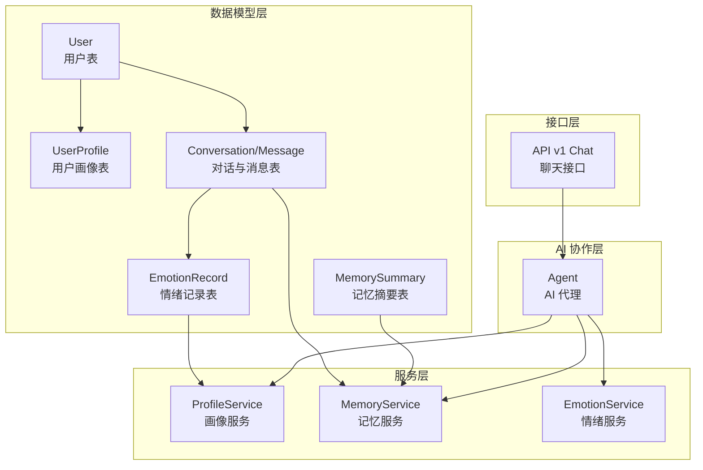
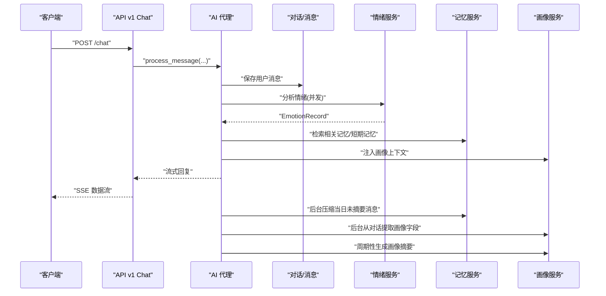
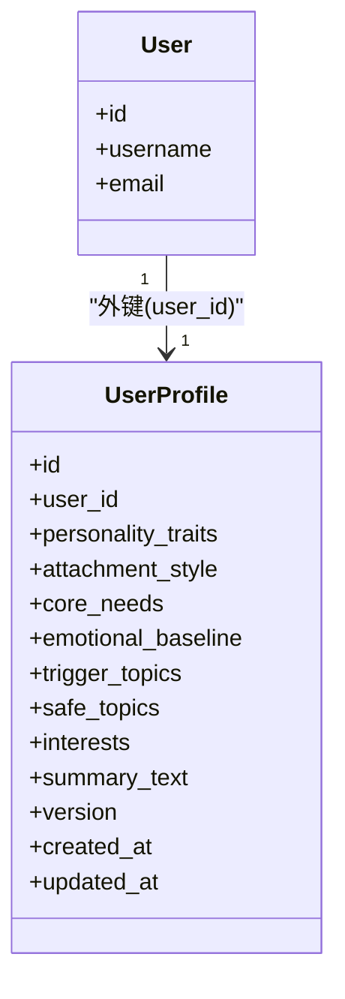
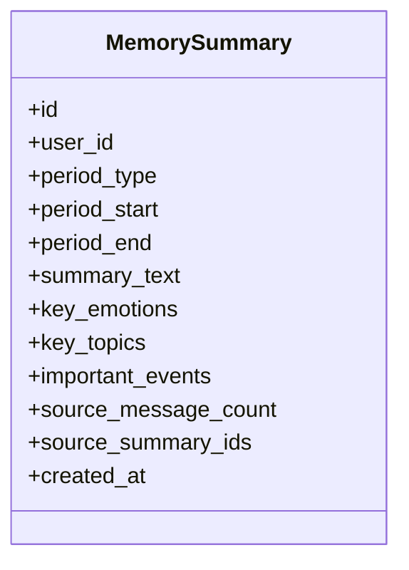
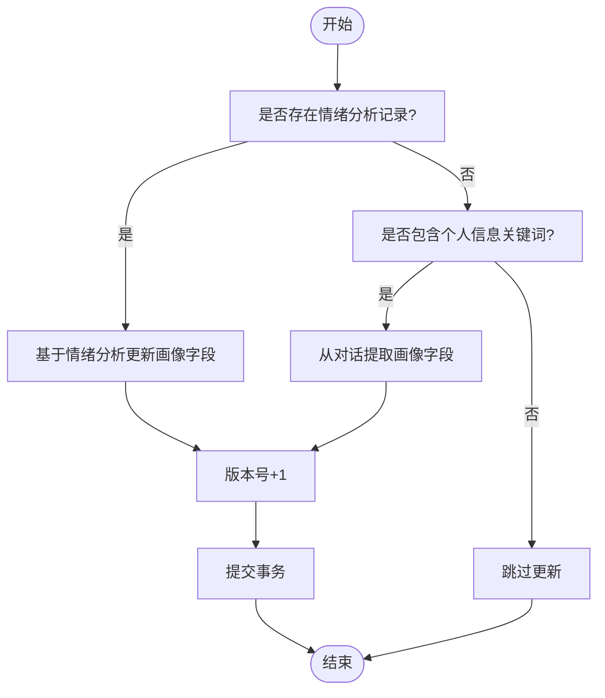
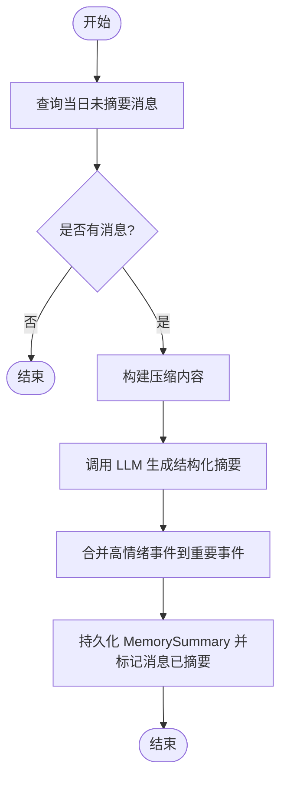
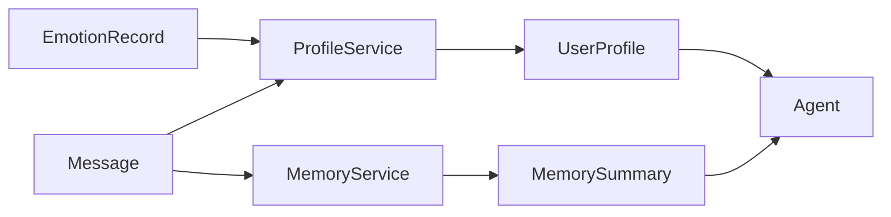
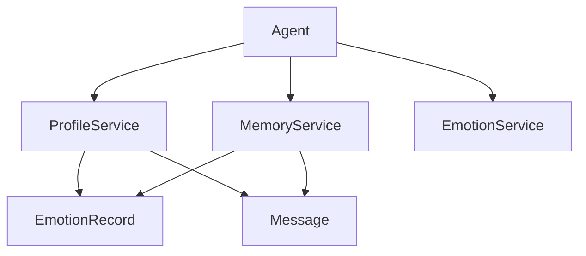

# 用户画像模型

<cite>
**本文引用的文件**
- [backend/app/models/user_profile.py](file://backend/app/models/user_profile.py)
- [backend/app/models/memory_summary.py](file://backend/app/models/memory_summary.py)
- [backend/app/models/conversation.py](file://backend/app/models/conversation.py)
- [backend/app/models/emotion.py](file://backend/app/models/emotion.py)
- [backend/app/schemas/profile.py](file://backend/app/schemas/profile.py)
- [backend/app/services/profile_service.py](file://backend/app/services/profile_service.py)
- [backend/app/services/memory_service.py](file://backend/app/services/memory_service.py)
- [backend/app/services/emotion_service.py](file://backend/app/services/emotion_service.py)
- [backend/app/ai/agent.py](file://backend/app/ai/agent.py)
- [backend/app/api/v1/chat.py](file://backend/app/api/v1/chat.py)
- [backend/app/services/scheduler.py](file://backend/app/services/scheduler.py)
</cite>

## 目录
1. [简介](#简介)
2. [项目结构](#项目结构)
3. [核心组件](#核心组件)
4. [架构总览](#架构总览)
5. [详细组件分析](#详细组件分析)
6. [依赖关系分析](#依赖关系分析)
7. [性能考虑](#性能考虑)
8. [故障排查指南](#故障排查指南)
9. [结论](#结论)
10. [附录](#附录)

## 简介
本设计文档围绕用户画像模型进行系统化梳理，重点解释 UserProfile 实体的用户特征存储机制（个人偏好、行为模式、历史交互数据），以及记忆摘要 MemorySummary 的聚合策略、长期记忆管理与短期记忆处理。文档还阐述画像数据与用户、对话、情感之间的关联关系与数据融合算法，覆盖画像更新策略、特征权重调整、个性化推荐支持，并提供画像数据隐私保护、实时更新机制与性能优化方案，面向数据科学家与机器学习工程师提供完整的用户画像数据模型参考。

## 项目结构
本项目采用分层架构，后端以 SQLAlchemy ORM 映射用户画像与记忆摘要等核心实体；服务层负责画像与记忆的增量更新、摘要生成与检索；AI 代理协调情绪分析、记忆检索与画像注入，形成“对话-情感-记忆-画像”的闭环数据流。

图表来源
- [backend/app/models/user_profile.py:9-29](file://backend/app/models/user_profile.py#L9-L29)
- [backend/app/models/memory_summary.py:9-26](file://backend/app/models/memory_summary.py#L9-L26)
- [backend/app/models/conversation.py:9-41](file://backend/app/models/conversation.py#L9-L41)
- [backend/app/models/emotion.py:9-29](file://backend/app/models/emotion.py#L9-L29)
- [backend/app/services/profile_service.py:13-348](file://backend/app/services/profile_service.py#L13-L348)
- [backend/app/services/memory_service.py:41-389](file://backend/app/services/memory_service.py#L41-L389)
- [backend/app/services/emotion_service.py:94-214](file://backend/app/services/emotion_service.py#L94-L214)
- [backend/app/ai/agent.py:35-792](file://backend/app/ai/agent.py#L35-L792)
- [backend/app/api/v1/chat.py:40-106](file://backend/app/api/v1/chat.py#L40-L106)

章节来源
- [backend/app/models/user_profile.py:9-29](file://backend/app/models/user_profile.py#L9-L29)
- [backend/app/models/memory_summary.py:9-26](file://backend/app/models/memory_summary.py#L9-L26)
- [backend/app/models/conversation.py:9-41](file://backend/app/models/conversation.py#L9-L41)
- [backend/app/models/emotion.py:9-29](file://backend/app/models/emotion.py#L9-L29)

## 核心组件
- 用户画像实体 UserProfile：存储用户的人格特征、依恋风格、核心需求、情绪基线、敏感/安全话题、兴趣爱好、综合摘要与版本号等。
- 记忆摘要实体 MemorySummary：按日/周/月/年粒度聚合对话内容，抽取关键情绪、关键话题、重要事件，并记录来源消息数量与来源摘要 ID 列表。
- 画像服务 ProfileService：从情绪分析与对话中增量更新画像字段，生成自然语言摘要，提供画像上下文注入。
- 记忆服务 MemoryService：按时间窗口压缩对话为结构化摘要，支持跨周期合并与检索，提供相关记忆与短期记忆回退。
- 情绪服务 EmotionService：解析用户消息的情绪状态、强度、深层需求、风险等级与交互建议，形成结构化记录。
- AI 代理 Agent：在对话过程中协调情绪分析、记忆检索、画像注入与工具执行，驱动画像与记忆的实时更新。
- API 接口：接收聊天请求，驱动 Agent 流程，记录 Token 使用，实现流式响应。

章节来源
- [backend/app/models/user_profile.py:9-29](file://backend/app/models/user_profile.py#L9-L29)
- [backend/app/models/memory_summary.py:9-26](file://backend/app/models/memory_summary.py#L9-L26)
- [backend/app/services/profile_service.py:13-348](file://backend/app/services/profile_service.py#L13-L348)
- [backend/app/services/memory_service.py:41-389](file://backend/app/services/memory_service.py#L41-L389)
- [backend/app/services/emotion_service.py:94-214](file://backend/app/services/emotion_service.py#L94-L214)
- [backend/app/ai/agent.py:35-792](file://backend/app/ai/agent.py#L35-L792)
- [backend/app/api/v1/chat.py:40-106](file://backend/app/api/v1/chat.py#L40-L106)

## 架构总览
用户画像与记忆的构建与使用贯穿“对话-情绪-记忆-画像”闭环：

图表来源
- [backend/app/api/v1/chat.py:40-106](file://backend/app/api/v1/chat.py#L40-L106)
- [backend/app/ai/agent.py:78-792](file://backend/app/ai/agent.py#L78-L792)
- [backend/app/services/emotion_service.py:98-157](file://backend/app/services/emotion_service.py#L98-L157)
- [backend/app/services/memory_service.py:344-367](file://backend/app/services/memory_service.py#L344-L367)
- [backend/app/services/profile_service.py:239-347](file://backend/app/services/profile_service.py#L239-L347)

## 详细组件分析

### 用户画像实体 UserProfile
- 字段设计要点
  - 个人偏好：兴趣爱好、敏感话题、安全话题
  - 行为模式：依恋风格、核心需求、情绪基线
  - 历史交互：综合摘要、版本号、创建/更新时间
- 存储与索引
  - user_id 外键唯一索引，确保一对一画像
  - 文本字段采用 Text 类型，JSON 字段以字符串形式存储，便于灵活扩展
- 关联关系
  - 与 User 一对一（外键级联删除）
  - 与记忆摘要通过 user_id 关联，支持画像与记忆的跨表检索

图表来源
- [backend/app/models/user_profile.py:9-29](file://backend/app/models/user_profile.py#L9-L29)
- [backend/app/models/user.py:9-23](file://backend/app/models/user.py#L9-L23)

章节来源
- [backend/app/models/user_profile.py:9-29](file://backend/app/models/user_profile.py#L9-L29)
- [backend/app/schemas/profile.py:6-22](file://backend/app/schemas/profile.py#L6-L22)

### 记忆摘要实体 MemorySummary
- 聚合粒度：daily/weekly/monthly/yearly
- 关键字段
  - summary_text：结构化摘要文本
  - key_emotions/key_topics：JSON 列表，用于检索与排序
  - important_events：JSON 列表，标记高情感/高风险事件
  - source_message_count/source_summary_ids：统计与溯源
- 时间范围：period_start/period_end，保证聚合窗口明确

图表来源
- [backend/app/models/memory_summary.py:9-26](file://backend/app/models/memory_summary.py#L9-L26)

章节来源
- [backend/app/models/memory_summary.py:9-26](file://backend/app/models/memory_summary.py#L9-L26)

### 画像更新策略与数据融合
- 情绪驱动更新
  - 核心需求：从情绪分析的深层需求字段增量去重，限制长度
  - 触发话题/安全话题：基于情绪强度与主情绪类别更新
  - 性格特征：从情绪分析的 full_analysis 中抽取心理特征关键词
  - 情绪基线：按主情绪计数累加，用于推断依恋风格
- 对话驱动更新
  - 从用户消息中抽取昵称、性别、兴趣、性格提示等，增量写入画像
  - 综合摘要：周期性生成自然语言摘要，提升可读性与注入效果
- 上下文注入
  - 画像上下文：将摘要、核心需求、性格、兴趣、依恋风格、情绪基线拼装为提示片段
  - 记忆上下文：优先相关记忆，回退短期记忆（近期消息）

图表来源
- [backend/app/services/profile_service.py:39-97](file://backend/app/services/profile_service.py#L39-L97)
- [backend/app/services/profile_service.py:239-347](file://backend/app/services/profile_service.py#L239-L347)

章节来源
- [backend/app/services/profile_service.py:39-97](file://backend/app/services/profile_service.py#L39-L97)
- [backend/app/services/profile_service.py:239-347](file://backend/app/services/profile_service.py#L239-L347)

### 记忆摘要聚合策略与长期/短期记忆
- 日常压缩
  - 选取当日未摘要消息，构建内容文本，调用 LLM 生成结构化摘要
  - 合并当日高情绪/高风险事件至重要事件列表
  - 标记消息为已摘要，避免重复处理
- 周/月/年合并
  - 以较低粒度摘要为输入，再次调用 LLM 生成更高粒度摘要
  - 溯源记录 source_summary_ids，保留重要事件去重合并
- 检索评分
  - 关键词重叠（主题/摘要）、时间衰减、情感显著性、粒度偏好（日>周>月>年）
- 回退策略
  - 若无摘要，回退到近期消息构建短期记忆（按字符估算 token 数）

图表来源
- [backend/app/services/memory_service.py:106-175](file://backend/app/services/memory_service.py#L106-L175)
- [backend/app/services/memory_service.py:177-259](file://backend/app/services/memory_service.py#L177-L259)

章节来源
- [backend/app/services/memory_service.py:106-175](file://backend/app/services/memory_service.py#L106-L175)
- [backend/app/services/memory_service.py:177-259](file://backend/app/services/memory_service.py#L177-L259)
- [backend/app/services/memory_service.py:45-104](file://backend/app/services/memory_service.py#L45-L104)
- [backend/app/services/memory_service.py:296-342](file://backend/app/services/memory_service.py#L296-L342)

### 画像与用户、对话、情感的关联关系与数据融合
- 用户-画像：一对一映射，通过 user_id 关联
- 对话-画像：对话消息作为画像字段（兴趣、昵称、性别等）与情绪分析的输入来源
- 情感-画像：情绪记录中的主情绪、强度、深层需求、风险等级与交互建议直接驱动画像更新
- 融合算法
  - 增量去重与长度截断（核心需求、敏感/安全话题、兴趣、性格特征）
  - 情绪基线计数与依恋风格推断（基于阈值的比例计算）
  - 上下文拼装：摘要、核心需求、性格、兴趣、依恋风格、情绪基线 Top-N

图表来源
- [backend/app/models/emotion.py:9-29](file://backend/app/models/emotion.py#L9-L29)
- [backend/app/models/conversation.py:25-41](file://backend/app/models/conversation.py#L25-L41)
- [backend/app/services/profile_service.py:39-97](file://backend/app/services/profile_service.py#L39-L97)
- [backend/app/services/memory_service.py:106-175](file://backend/app/services/memory_service.py#L106-L175)

章节来源
- [backend/app/models/emotion.py:9-29](file://backend/app/models/emotion.py#L9-L29)
- [backend/app/models/conversation.py:25-41](file://backend/app/models/conversation.py#L25-L41)
- [backend/app/services/profile_service.py:39-97](file://backend/app/services/profile_service.py#L39-L97)
- [backend/app/services/memory_service.py:106-175](file://backend/app/services/memory_service.py#L106-L175)

### 个性化推荐支持
- 画像摘要与上下文注入：将用户画像自然语言摘要与关键特征注入系统提示，提升回复个性化程度
- 记忆检索增强：结合相关记忆与短期记忆，提供更贴合上下文的个性化回应
- 依恋风格与情绪基线：为不同依恋风格与情绪状态提供差异化交互建议（由情绪分析提供）

章节来源
- [backend/app/services/profile_service.py:99-133](file://backend/app/services/profile_service.py#L99-L133)
- [backend/app/services/memory_service.py:296-342](file://backend/app/services/memory_service.py#L296-L342)
- [backend/app/services/emotion_service.py:94-191](file://backend/app/services/emotion_service.py#L94-L191)

### 实时更新机制
- 对话实时：Agent 在对话流中并发触发情绪分析，完成后异步持久化并更新画像与记忆
- 后台压缩：对话结束后压缩当日未摘要消息，形成日级摘要
- 周期性摘要：每 N 轮对话触发画像自然语言摘要生成
- 身份迭代：周期性评估并自动演进 AI 身份，间接影响画像表达风格

章节来源
- [backend/app/ai/agent.py:747-791](file://backend/app/ai/agent.py#L747-L791)
- [backend/app/services/memory_service.py:344-367](file://backend/app/services/memory_service.py#L344-L367)
- [backend/app/services/profile_service.py:142-200](file://backend/app/services/profile_service.py#L142-L200)
- [backend/app/services/scheduler.py:118-199](file://backend/app/services/scheduler.py#L118-L199)

## 依赖关系分析
- 组件耦合
  - ProfileService 依赖 EmotionRecord 与对话消息，实现画像增量更新
  - MemoryService 依赖 Message 与 EmotionRecord，实现记忆聚合与检索
  - Agent 协调三者，形成闭环
- 外部依赖
  - LLM 客户端（情绪分析、记忆压缩、画像摘要生成）
  - TokenService 记录用量，支撑成本控制与配额管理

图表来源
- [backend/app/services/profile_service.py:13-348](file://backend/app/services/profile_service.py#L13-L348)
- [backend/app/services/memory_service.py:41-389](file://backend/app/services/memory_service.py#L41-L389)
- [backend/app/services/emotion_service.py:94-214](file://backend/app/services/emotion_service.py#L94-L214)
- [backend/app/ai/agent.py:35-792](file://backend/app/ai/agent.py#L35-L792)

章节来源
- [backend/app/services/profile_service.py:13-348](file://backend/app/services/profile_service.py#L13-L348)
- [backend/app/services/memory_service.py:41-389](file://backend/app/services/memory_service.py#L41-L389)
- [backend/app/services/emotion_service.py:94-214](file://backend/app/services/emotion_service.py#L94-L214)
- [backend/app/ai/agent.py:35-792](file://backend/app/ai/agent.py#L35-L792)

## 性能考虑
- 检索评分与回退
  - 相关记忆检索采用关键词重叠、时间衰减、情感显著性与粒度偏好加权，避免全表扫描
  - 无摘要时回退短期记忆，降低 LLM 调用频率
- 增量更新与长度截断
  - 画像字段采用列表去重与长度截断，控制 JSON 字段膨胀
- 后台任务与并发
  - 记忆压缩与画像提取采用 fire-and-forget 异步任务，避免阻塞对话主流程
  - 身份迭代并发执行并捕获异常，保障稳定性
- Token 控制
  - 统一记录各角色 LLM 用量，便于成本控制与阈值告警

章节来源
- [backend/app/services/memory_service.py:45-104](file://backend/app/services/memory_service.py#L45-L104)
- [backend/app/services/memory_service.py:296-342](file://backend/app/services/memory_service.py#L296-L342)
- [backend/app/services/profile_service.py:39-97](file://backend/app/services/profile_service.py#L39-L97)
- [backend/app/ai/agent.py:747-791](file://backend/app/ai/agent.py#L747-L791)

## 故障排查指南
- 情绪分析缺失
  - 现象：画像更新缓慢、依恋风格未变化
  - 排查：检查情绪 LLM 客户端配置与可用性
- 记忆压缩失败
  - 现象：无日/周/月摘要
  - 排查：查看 LLM 配置错误日志与消息计数阈值
- 画像摘要生成异常
  - 现象：摘要为空或报错
  - 排查：检查 LLM 返回 JSON 解析与 Token 记录异常
- 对话流中断
  - 现象：SSE 流提前结束
  - 排查：客户端断开检测、异常捕获与错误事件下发

章节来源
- [backend/app/services/emotion_service.py:152-156](file://backend/app/services/emotion_service.py#L152-L156)
- [backend/app/services/memory_service.py:283-287](file://backend/app/services/memory_service.py#L283-L287)
- [backend/app/services/profile_service.py:198-199](file://backend/app/services/profile_service.py#L198-L199)
- [backend/app/api/v1/chat.py:78-87](file://backend/app/api/v1/chat.py#L78-L87)

## 结论
该用户画像模型通过 UserProfile 与 MemorySummary 双轨并行，结合情绪分析与对话交互，实现了从短期记忆到长期记忆的层次化知识沉淀，并以画像摘要与上下文注入提升个性化与一致性。服务层的增量更新策略、检索评分与回退机制，以及 Agent 的实时协调，共同构成了高效、可扩展且具备鲁棒性的用户画像体系。建议在生产环境中强化 LLM 配置校验、异常隔离与 Token 预算控制，持续优化检索评分与摘要生成质量。

## 附录
- 术语
  - 画像：用户在系统中的抽象表示，包含个人偏好、行为模式与历史交互特征
  - 记忆摘要：按时间粒度聚合的结构化摘要，包含关键情绪、话题与重要事件
  - 上下文注入：将画像与记忆整合到系统提示，增强回复个性化与一致性
- 最佳实践
  - 保持画像字段的增量更新与长度截断，避免 JSON 过大
  - 优先使用相关记忆，必要时回退短期记忆，平衡成本与效果
  - 定期评估与迭代 AI 身份，确保画像表达风格与用户期望一致