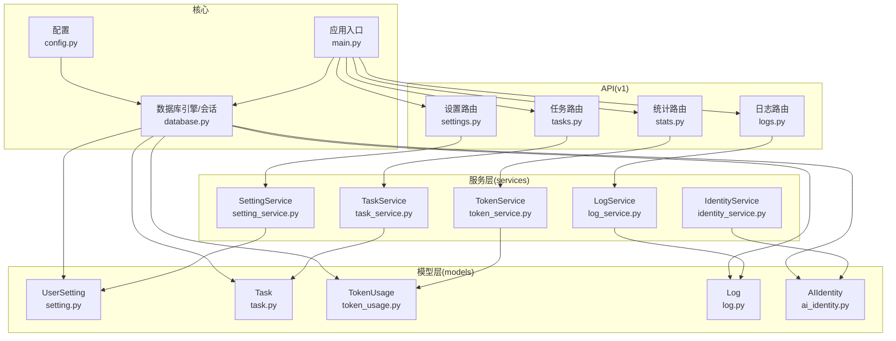
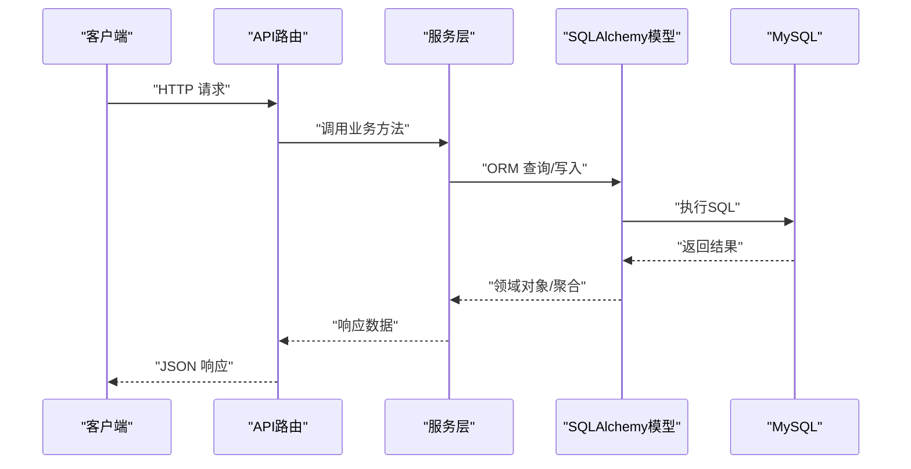
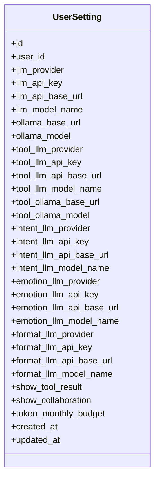
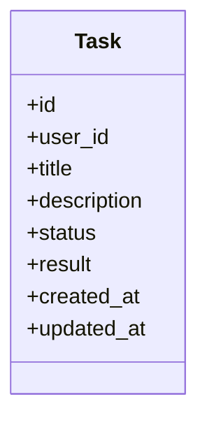
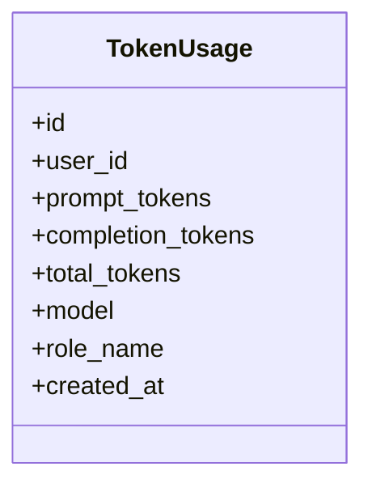
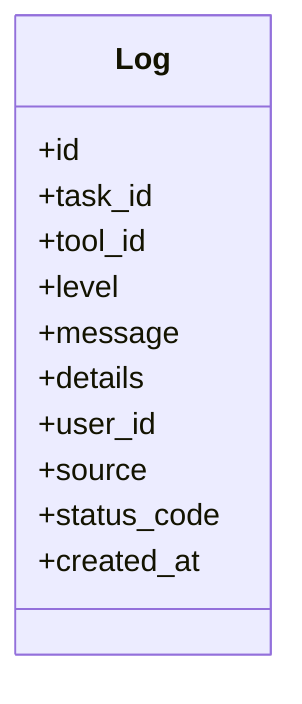
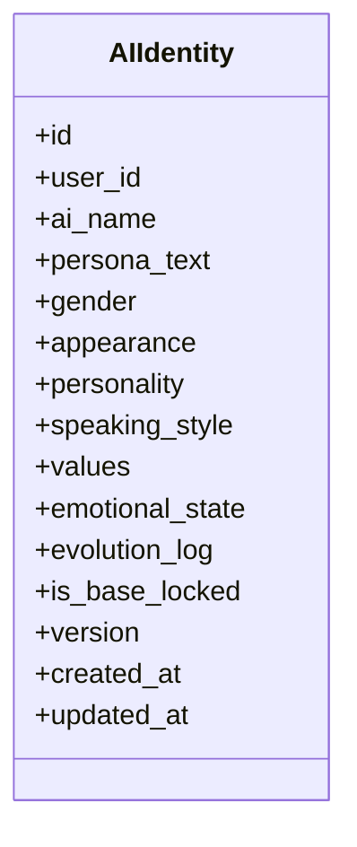
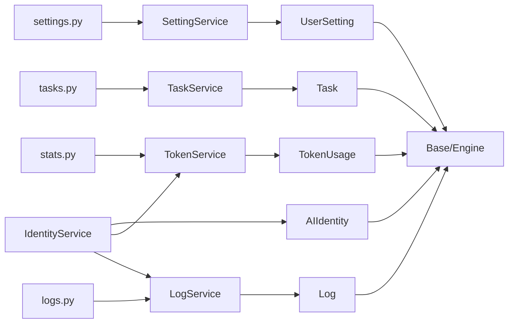
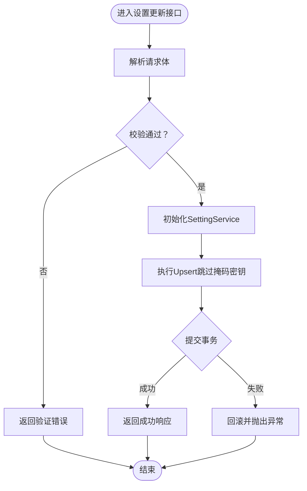
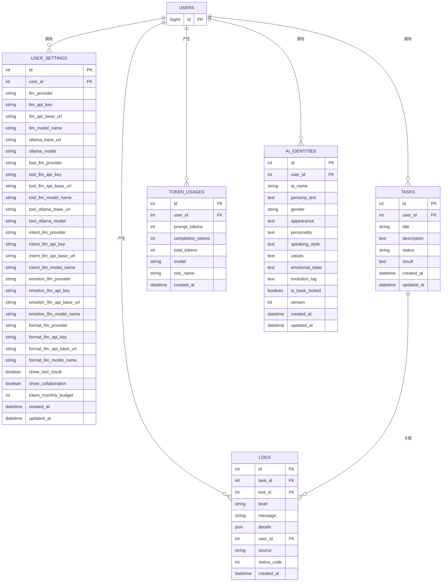

# 系统模型

<cite>
**本文引用的文件**
- [backend/app/models/setting.py](file://backend/app/models/setting.py)
- [backend/app/models/task.py](file://backend/app/models/task.py)
- [backend/app/models/token_usage.py](file://backend/app/models/token_usage.py)
- [backend/app/models/log.py](file://backend/app/models/log.py)
- [backend/app/models/ai_identity.py](file://backend/app/models/ai_identity.py)
- [backend/app/services/setting_service.py](file://backend/app/services/setting_service.py)
- [backend/app/services/task_service.py](file://backend/app/services/task_service.py)
- [backend/app/services/token_service.py](file://backend/app/services/token_service.py)
- [backend/app/services/log_service.py](file://backend/app/services/log_service.py)
- [backend/app/services/identity_service.py](file://backend/app/services/identity_service.py)
- [backend/app/api/v1/settings.py](file://backend/app/api/v1/settings.py)
- [backend/app/api/v1/tasks.py](file://backend/app/api/v1/tasks.py)
- [backend/app/api/v1/logs.py](file://backend/app/api/v1/logs.py)
- [backend/app/api/v1/stats.py](file://backend/app/api/v1/stats.py)
- [backend/app/core/database.py](file://backend/app/core/database.py)
- [backend/app/core/config.py](file://backend/app/core/config.py)
- [backend/app/main.py](file://backend/app/main.py)
</cite>

## 目录
1. [引言](#引言)
2. [项目结构](#项目结构)
3. [核心组件](#核心组件)
4. [架构总览](#架构总览)
5. [详细组件分析](#详细组件分析)
6. [依赖分析](#依赖分析)
7. [性能考虑](#性能考虑)
8. [故障排查指南](#故障排查指南)
9. [结论](#结论)
10. [附录](#附录)

## 引言
本设计文档围绕系统的核心数据模型与运行机制展开，重点阐述以下模型与能力：
- Setting配置模型：用户级AI接入参数、工具生成与意图识别等子配置、月度配额等
- Task任务模型：任务生命周期、状态与结果记录
- TokenUsage令牌使用模型：按日/按角色/按模型的用量统计与预算校验
- Log日志模型：统一操作日志、来源模块、状态码与详情
- AIIdentity身份模型：多AI角色的人设、情绪状态、版本与演进日志

同时，文档覆盖系统配置管理、任务调度机制、使用量统计、操作日志记录、AI身份管理，解释模型间依赖关系、数据一致性保证与事务处理策略，并给出监控指标、性能审计、故障追踪机制，以及扩展性设计、配置热更新与数据归档策略。

## 项目结构
后端采用FastAPI + SQLAlchemy ORM，模型位于models目录，服务层位于services目录，API路由位于api/v1目录，核心配置与数据库初始化位于core目录。应用启动时进行数据库初始化与表结构自动迁移。

图表来源
- [backend/app/core/config.py:1-68](file://backend/app/core/config.py#L1-L68)
- [backend/app/core/database.py:1-65](file://backend/app/core/database.py#L1-L65)
- [backend/app/models/setting.py:1-60](file://backend/app/models/setting.py#L1-L60)
- [backend/app/models/task.py:1-28](file://backend/app/models/task.py#L1-L28)
- [backend/app/models/token_usage.py:1-24](file://backend/app/models/token_usage.py#L1-L24)
- [backend/app/models/log.py:1-30](file://backend/app/models/log.py#L1-L30)
- [backend/app/models/ai_identity.py:1-38](file://backend/app/models/ai_identity.py#L1-L38)
- [backend/app/services/setting_service.py:1-42](file://backend/app/services/setting_service.py#L1-L42)
- [backend/app/services/task_service.py:1-43](file://backend/app/services/task_service.py#L1-L43)
- [backend/app/services/token_service.py:1-183](file://backend/app/services/token_service.py#L1-L183)
- [backend/app/services/log_service.py:1-67](file://backend/app/services/log_service.py#L1-L67)
- [backend/app/services/identity_service.py:1-461](file://backend/app/services/identity_service.py#L1-L461)
- [backend/app/api/v1/settings.py:1-55](file://backend/app/api/v1/settings.py#L1-L55)
- [backend/app/api/v1/tasks.py:1-50](file://backend/app/api/v1/tasks.py#L1-L50)
- [backend/app/api/v1/logs.py:1-53](file://backend/app/api/v1/logs.py#L1-L53)
- [backend/app/api/v1/stats.py:1-62](file://backend/app/api/v1/stats.py#L1-L62)
- [backend/app/main.py:1-79](file://backend/app/main.py#L1-L79)

章节来源
- [backend/app/main.py:1-79](file://backend/app/main.py#L1-L79)
- [backend/app/core/database.py:1-65](file://backend/app/core/database.py#L1-L65)
- [backend/app/core/config.py:1-68](file://backend/app/core/config.py#L1-L68)

## 核心组件
本节对五大模型进行设计说明，涵盖字段语义、索引与约束、默认值与时间戳、以及与服务层的交互方式。

- Setting配置模型（UserSetting）
  - 用户级LLM/Ollama接入参数，支持多子AI配置（工具生成、意图识别、情绪、风格），以及聊天偏好与月度预算
  - 关键字段：provider/base_url/model/key，工具/意图/情绪/风格子配置，show_tool_result/show_collaboration，token_monthly_budget
  - 约束与索引：user_id唯一、索引user_id，便于按用户快速检索
  - 时间戳：created_at/updated_at由服务器默认值维护

- Task任务模型（Task）
  - 任务标题、描述、状态、结果与时间戳
  - 状态默认“已完成”，实际调度中可能为“待处理”等
  - 约束与索引：user_id索引、status索引，便于按用户与状态查询

- TokenUsage令牌使用模型（TokenUsage）
  - 记录prompt/completion/total tokens，模型名与角色名，按用户维度统计
  - 约束与索引：user_id索引，便于按用户聚合统计

- Log日志模型（Log）
  - 统一日志：级别、消息、详情JSON、来源模块、状态码、关联任务/工具/用户
  - 约束与索引：task_id/tool_id/user_id索引，便于分页与统计

- AIIdentity身份模型（AIIdentity）
  - 多AI角色（xuan/ji/qing/huan/yao）的人设字段：基础人设文本、性别、外貌、性格、说话风格、三观
  - 状态与演进：当前情绪状态、演进日志（JSON数组）、是否锁定基础设定、版本号
  - 唯一约束：user_id+ai_name，保证每个用户对每种AI仅有一份身份

章节来源
- [backend/app/models/setting.py:1-60](file://backend/app/models/setting.py#L1-L60)
- [backend/app/models/task.py:1-28](file://backend/app/models/task.py#L1-L28)
- [backend/app/models/token_usage.py:1-24](file://backend/app/models/token_usage.py#L1-L24)
- [backend/app/models/log.py:1-30](file://backend/app/models/log.py#L1-L30)
- [backend/app/models/ai_identity.py:1-38](file://backend/app/models/ai_identity.py#L1-L38)

## 架构总览
系统通过API路由接收请求，经由服务层封装业务逻辑，访问SQLAlchemy模型持久化到MySQL。数据库初始化在应用启动时完成，并具备自动列增量迁移能力。配置来自环境变量文件，支持Ollama与在线LLM接入。

图表来源
- [backend/app/api/v1/settings.py:1-55](file://backend/app/api/v1/settings.py#L1-L55)
- [backend/app/api/v1/tasks.py:1-50](file://backend/app/api/v1/tasks.py#L1-L50)
- [backend/app/api/v1/logs.py:1-53](file://backend/app/api/v1/logs.py#L1-L53)
- [backend/app/api/v1/stats.py:1-62](file://backend/app/api/v1/stats.py#L1-L62)
- [backend/app/services/setting_service.py:1-42](file://backend/app/services/setting_service.py#L1-L42)
- [backend/app/services/task_service.py:1-43](file://backend/app/services/task_service.py#L1-L43)
- [backend/app/services/log_service.py:1-67](file://backend/app/services/log_service.py#L1-L67)
- [backend/app/services/token_service.py:1-183](file://backend/app/services/token_service.py#L1-L183)
- [backend/app/services/identity_service.py:1-461](file://backend/app/services/identity_service.py#L1-L461)
- [backend/app/core/database.py:1-65](file://backend/app/core/database.py#L1-L65)

## 详细组件分析

### Setting配置模型与服务
- 设计要点
  - 支持多子AI配置，避免重复冗余，统一回退到聊天AI配置
  - 掩码密钥保护：更新时跳过包含特定占位符的密钥字段，防止覆盖真实密钥
  - Upsert策略：不存在则新建，存在则逐字段更新（跳过掩码）

- 数据一致性与事务
  - 单次更新在服务层一次性提交，确保原子性
  - 密钥字段更新前进行掩码判断，避免误覆盖

- 配置热更新
  - 应用重启或通过外部配置中心刷新Settings实例后，后续读取将使用新值
  - 建议结合环境变量与部署配置管理，实现非侵入式更新

图表来源
- [backend/app/models/setting.py:1-60](file://backend/app/models/setting.py#L1-L60)

章节来源
- [backend/app/services/setting_service.py:1-42](file://backend/app/services/setting_service.py#L1-L42)
- [backend/app/api/v1/settings.py:1-55](file://backend/app/api/v1/settings.py#L1-L55)

### Task任务模型与服务
- 设计要点
  - 任务状态枚举由服务层定义，创建时默认“待处理”
  - 支持按用户分页查询，限制返回数量

- 任务调度机制
  - 当前API提供查询与获取单个任务，未见显式的异步调度器代码
  - 可在服务层或独立调度器中实现状态轮询/回调更新

图表来源
- [backend/app/models/task.py:1-28](file://backend/app/models/task.py#L1-L28)

章节来源
- [backend/app/services/task_service.py:1-43](file://backend/app/services/task_service.py#L1-L43)
- [backend/app/api/v1/tasks.py:1-50](file://backend/app/api/v1/tasks.py#L1-L50)

### TokenUsage令牌使用模型与服务
- 设计要点
  - 记录每次调用的prompt/completion/total tokens，可标注模型与角色名
  - 提供多种统计视图：当日/当月/总计、按角色/模型/日期聚合

- 使用量统计与预算控制
  - 通过UserSetting读取月度预算，计算当月token总量并与预算比较
  - 可用于前端仪表盘与告警

图表来源
- [backend/app/models/token_usage.py:1-24](file://backend/app/models/token_usage.py#L1-L24)

章节来源
- [backend/app/services/token_service.py:1-183](file://backend/app/services/token_service.py#L1-L183)
- [backend/app/api/v1/stats.py:1-62](file://backend/app/api/v1/stats.py#L1-L62)

### Log日志模型与服务
- 设计要点
  - 统一日志结构：级别、消息、详情JSON、来源模块、状态码
  - 支持按用户分页查询、按级别/来源过滤、统计分布

- 日志记录与审计
  - 服务层提供统一log方法，便于在业务关键路径埋点
  - 可与TokenUsage联动，记录调用耗时与成本

图表来源
- [backend/app/models/log.py:1-30](file://backend/app/models/log.py#L1-L30)

章节来源
- [backend/app/services/log_service.py:1-67](file://backend/app/services/log_service.py#L1-L67)
- [backend/app/api/v1/logs.py:1-53](file://backend/app/api/v1/logs.py#L1-L53)

### AIIdentity身份模型与服务
- 设计要点
  - 多AI角色（xuan/ji/qing/huan/yao）的人设字段，支持锁定基础设定
  - 演进日志记录字段变更，版本号递增，保留最近若干条
  - 自动身份生成与自动演进：通过情绪AI生成初始人设，基于交互摘要进行迭代

- 数据一致性与事务
  - 更新/演进在服务层内提交，避免跨事务不一致
  - 锁定基础设定时禁止修改基础人设文本，防止漂移

图表来源
- [backend/app/models/ai_identity.py:1-38](file://backend/app/models/ai_identity.py#L1-L38)

章节来源
- [backend/app/services/identity_service.py:1-461](file://backend/app/services/identity_service.py#L1-L461)

## 依赖分析
- 模型依赖
  - UserSetting/TokenUsage/Log/Task均依赖users表，形成一对一/多对一外键关系
  - Log与Task/Tool存在可空外键关联，便于日志追踪到具体任务或工具

- 服务依赖
  - SettingService/TaskService/LogService/TokenService直接依赖对应模型
  - IdentityService依赖TokenService与LogService，用于记录使用量与日志

- API依赖
  - 各路由依赖对应服务层，返回标准化响应结构

图表来源
- [backend/app/models/setting.py:1-60](file://backend/app/models/setting.py#L1-L60)
- [backend/app/models/task.py:1-28](file://backend/app/models/task.py#L1-L28)
- [backend/app/models/token_usage.py:1-24](file://backend/app/models/token_usage.py#L1-L24)
- [backend/app/models/log.py:1-30](file://backend/app/models/log.py#L1-L30)
- [backend/app/models/ai_identity.py:1-38](file://backend/app/models/ai_identity.py#L1-L38)
- [backend/app/services/setting_service.py:1-42](file://backend/app/services/setting_service.py#L1-L42)
- [backend/app/services/task_service.py:1-43](file://backend/app/services/task_service.py#L1-L43)
- [backend/app/services/token_service.py:1-183](file://backend/app/services/token_service.py#L1-L183)
- [backend/app/services/log_service.py:1-67](file://backend/app/services/log_service.py#L1-L67)
- [backend/app/services/identity_service.py:1-461](file://backend/app/services/identity_service.py#L1-L461)
- [backend/app/api/v1/settings.py:1-55](file://backend/app/api/v1/settings.py#L1-L55)
- [backend/app/api/v1/tasks.py:1-50](file://backend/app/api/v1/tasks.py#L1-L50)
- [backend/app/api/v1/logs.py:1-53](file://backend/app/api/v1/logs.py#L1-L53)
- [backend/app/api/v1/stats.py:1-62](file://backend/app/api/v1/stats.py#L1-L62)

章节来源
- [backend/app/core/database.py:1-65](file://backend/app/core/database.py#L1-L65)

## 性能考虑
- 查询优化
  - 为user_id/status/task_id/tool_id添加索引，提升分页与过滤效率
  - 统计查询使用聚合函数与分组，建议在高并发场景下增加只读副本

- 写入优化
  - 服务层单次提交，减少事务开销
  - 批量写入可通过批量插入优化（需在服务层扩展）

- 缓存策略
  - 常用配置（如UserSetting）可引入进程内缓存，降低数据库压力
  - 日志与统计结果可短期缓存，配合定时刷新

- 监控指标
  - Token使用量、按角色/模型/日期的用量趋势
  - 日志级别分布、错误率与慢查询
  - 身份生成/演进耗时与成功率

[本节为通用指导，不直接分析具体文件]

## 故障排查指南
- 配置相关
  - 设置接口返回掩码占位符：确认服务层掩码判断逻辑是否正确拦截
  - LLM配置缺失：IdentityService在生成/演进时会记录警告，检查情绪AI配置

- 日志与审计
  - 使用日志路由分页查询，按级别/来源过滤定位问题
  - 统计接口查看错误分布，辅助根因分析

- 用量与预算
  - 仪表盘与统计接口核对当月用量与预算，必要时调整UserSetting中的月度预算

章节来源
- [backend/app/services/setting_service.py:18-42](file://backend/app/services/setting_service.py#L18-L42)
- [backend/app/services/identity_service.py:269-274](file://backend/app/services/identity_service.py#L269-L274)
- [backend/app/api/v1/logs.py:1-53](file://backend/app/api/v1/logs.py#L1-L53)
- [backend/app/api/v1/stats.py:1-62](file://backend/app/api/v1/stats.py#L1-L62)

## 结论
本文档系统梳理了Setting、Task、TokenUsage、Log、AIIdentity五大模型的设计理念与实现细节，明确了服务层与API层的职责边界，给出了依赖关系、事务处理与一致性保障策略，并提供了性能与故障排查建议。该模型体系为璇玑系统的配置管理、任务调度、用量统计、日志审计与AI身份管理提供了坚实的数据基础。

[本节为总结性内容，不直接分析具体文件]

## 附录

### 数据流与事务处理流程（示例：设置更新）

图表来源
- [backend/app/api/v1/settings.py:28-40](file://backend/app/api/v1/settings.py#L28-L40)
- [backend/app/services/setting_service.py:23-42](file://backend/app/services/setting_service.py#L23-L42)

### 数据模型ER图

图表来源
- [backend/app/models/setting.py:1-60](file://backend/app/models/setting.py#L1-L60)
- [backend/app/models/task.py:1-28](file://backend/app/models/task.py#L1-L28)
- [backend/app/models/token_usage.py:1-24](file://backend/app/models/token_usage.py#L1-L24)
- [backend/app/models/log.py:1-30](file://backend/app/models/log.py#L1-L30)
- [backend/app/models/ai_identity.py:1-38](file://backend/app/models/ai_identity.py#L1-L38)