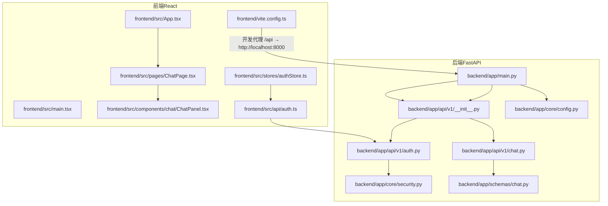
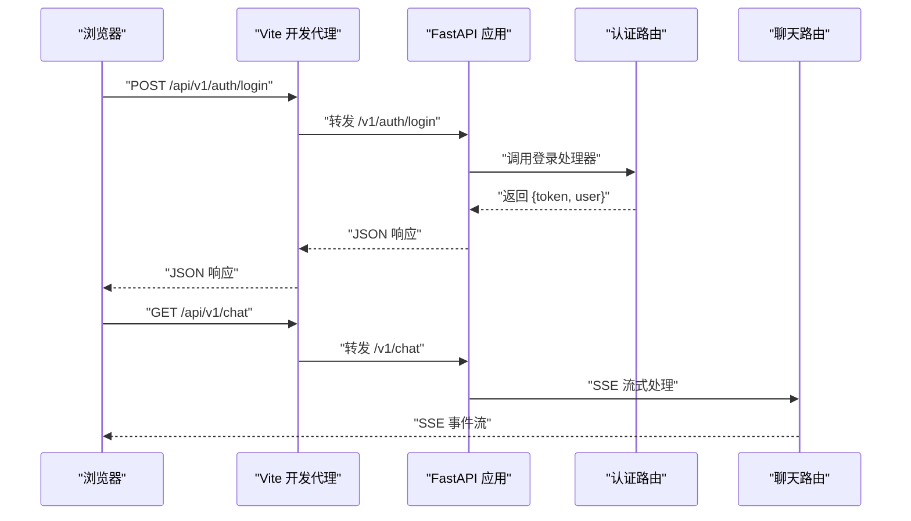
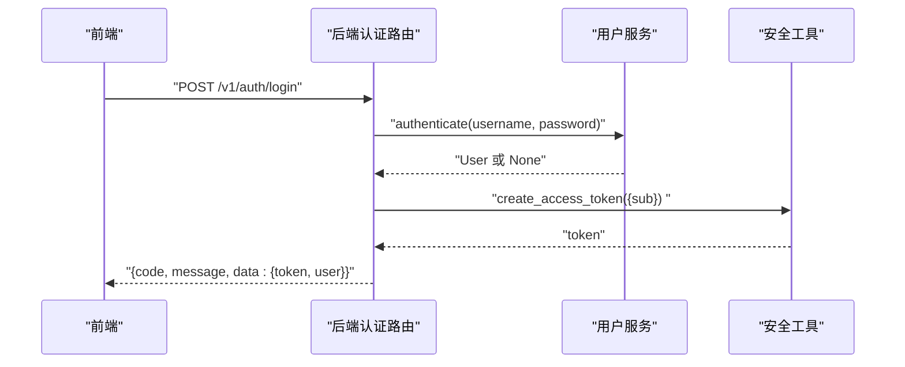
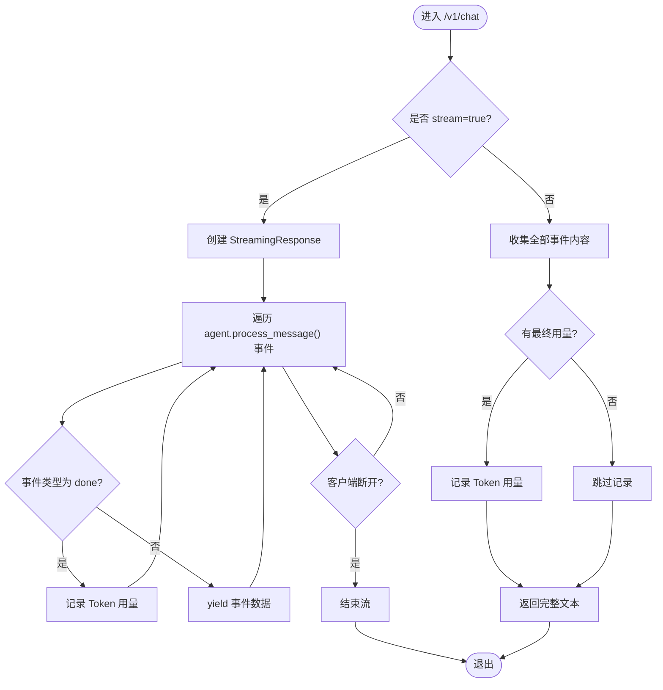
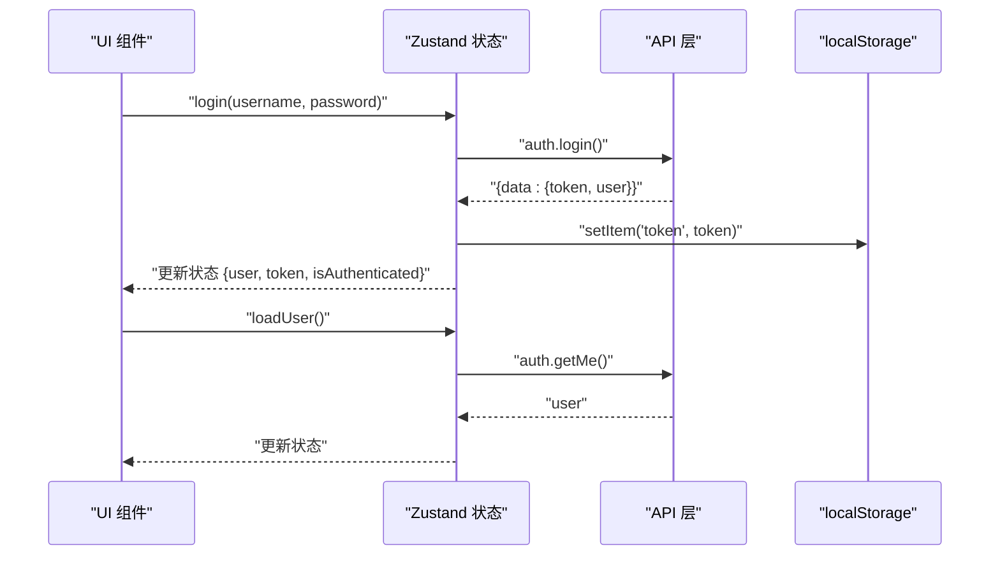
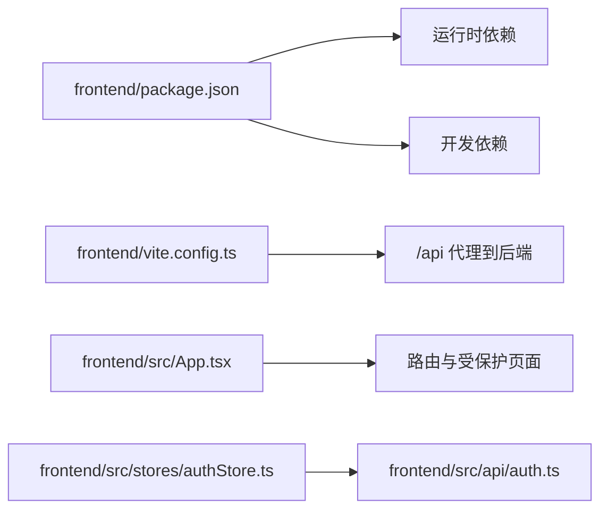

# 前后端分离架构

<cite>
**本文引用的文件**
- [backend/app/main.py](file://backend/app/main.py)
- [backend/app/core/config.py](file://backend/app/core/config.py)
- [backend/app/api/v1/__init__.py](file://backend/app/api/v1/__init__.py)
- [backend/app/api/v1/chat.py](file://backend/app/api/v1/chat.py)
- [backend/app/api/v1/auth.py](file://backend/app/api/v1/auth.py)
- [backend/app/core/security.py](file://backend/app/core/security.py)
- [backend/app/schemas/chat.py](file://backend/app/schemas/chat.py)
- [frontend/src/main.tsx](file://frontend/src/main.tsx)
- [frontend/vite.config.ts](file://frontend/vite.config.ts)
- [frontend/src/App.tsx](file://frontend/src/App.tsx)
- [frontend/src/pages/ChatPage.tsx](file://frontend/src/pages/ChatPage.tsx)
- [frontend/src/components/chat/ChatPanel.tsx](file://frontend/src/components/chat/ChatPanel.tsx)
- [frontend/src/stores/authStore.ts](file://frontend/src/stores/authStore.ts)
- [frontend/src/api/auth.ts](file://frontend/src/api/auth.ts)
- [frontend/package.json](file://frontend/package.json)
</cite>

## 目录
1. [简介](#简介)
2. [项目结构](#项目结构)
3. [核心组件](#核心组件)
4. [架构总览](#架构总览)
5. [详细组件分析](#详细组件分析)
6. [依赖分析](#依赖分析)
7. [性能考虑](#性能考虑)
8. [故障排查指南](#故障排查指南)
9. [结论](#结论)
10. [附录](#附录)

## 简介
本文件面向XuanJi项目的前后端分离架构，系统性阐述：
- FastAPI后端服务的RESTful API设计原则、路由组织与中间件配置
- React前端应用的组件架构、状态管理模式与路由系统
- 前后端通信协议：HTTP请求处理、SSE服务器推送事件
- 跨域资源共享（CORS）配置、认证授权机制与数据序列化方案
- API版本管理、错误处理策略与性能优化措施
- 提供具体代码示例路径以展示前后端交互的实际实现

## 项目结构
XuanJi采用典型的前后端分离架构：
- 后端基于FastAPI，提供REST API与SSE流式响应
- 前端基于React + TypeScript，使用Vite构建与开发代理
- 前端通过代理将/api前缀转发到后端，实现本地联调

图表来源
- [frontend/src/main.tsx:1-14](file://frontend/src/main.tsx#L1-L14)
- [frontend/src/App.tsx:1-77](file://frontend/src/App.tsx#L1-L77)
- [frontend/src/pages/ChatPage.tsx:1-17](file://frontend/src/pages/ChatPage.tsx#L1-L17)
- [frontend/src/components/chat/ChatPanel.tsx:1-67](file://frontend/src/components/chat/ChatPanel.tsx#L1-L67)
- [frontend/src/stores/authStore.ts:1-53](file://frontend/src/stores/authStore.ts#L1-L53)
- [frontend/src/api/auth.ts:1-21](file://frontend/src/api/auth.ts#L1-L21)
- [frontend/vite.config.ts:1-35](file://frontend/vite.config.ts#L1-L35)
- [backend/app/main.py:1-79](file://backend/app/main.py#L1-L79)
- [backend/app/api/v1/__init__.py:1-23](file://backend/app/api/v1/__init__.py#L1-L23)
- [backend/app/api/v1/chat.py:1-106](file://backend/app/api/v1/chat.py#L1-L106)
- [backend/app/api/v1/auth.py:1-61](file://backend/app/api/v1/auth.py#L1-L61)
- [backend/app/core/security.py:1-38](file://backend/app/core/security.py#L1-L38)
- [backend/app/core/config.py:1-68](file://backend/app/core/config.py#L1-L68)
- [backend/app/schemas/chat.py:1-14](file://backend/app/schemas/chat.py#L1-L14)

章节来源
- [backend/app/main.py:1-79](file://backend/app/main.py#L1-L79)
- [frontend/vite.config.ts:1-35](file://frontend/vite.config.ts#L1-L35)
- [frontend/src/main.tsx:1-14](file://frontend/src/main.tsx#L1-L14)

## 核心组件
- 后端FastAPI应用与生命周期管理：健康检查、CORS中间件、路由注册、全局异常处理
- API版本管理：统一在/api/v1前缀下组织各模块路由
- 认证授权：基于JWT的登录/注册/当前用户查询，密码哈希与校验
- 实时通信：聊天接口支持SSE流式输出，前端按事件类型渲染
- 数据序列化：Pydantic模型定义请求/响应结构，统一返回包装
- 前端路由与状态：受保护路由、Zustand状态管理、Axios封装的API客户端

章节来源
- [backend/app/main.py:30-64](file://backend/app/main.py#L30-L64)
- [backend/app/api/v1/__init__.py:1-23](file://backend/app/api/v1/__init__.py#L1-L23)
- [backend/app/api/v1/auth.py:1-61](file://backend/app/api/v1/auth.py#L1-L61)
- [backend/app/core/security.py:1-38](file://backend/app/core/security.py#L1-L38)
- [backend/app/schemas/chat.py:1-14](file://backend/app/schemas/chat.py#L1-L14)
- [frontend/src/App.tsx:1-77](file://frontend/src/App.tsx#L1-L77)
- [frontend/src/stores/authStore.ts:1-53](file://frontend/src/stores/authStore.ts#L1-L53)
- [frontend/src/api/auth.ts:1-21](file://frontend/src/api/auth.ts#L1-L21)

## 架构总览
后端采用模块化路由组织，前端通过Vite代理访问后端API。认证采用JWT，聊天接口支持SSE流式输出。

图表来源
- [frontend/vite.config.ts:25-33](file://frontend/vite.config.ts#L25-L33)
- [backend/app/api/v1/auth.py:34-51](file://backend/app/api/v1/auth.py#L34-L51)
- [backend/app/api/v1/chat.py:40-87](file://backend/app/api/v1/chat.py#L40-L87)

## 详细组件分析

### 后端：FastAPI应用与中间件
- 应用实例与生命周期：启动时初始化数据库并启动内存衰减调度器，关闭时停止调度器
- CORS配置：允许指定来源、凭据、方法与头
- 路由注册：统一挂载/api/v1前缀
- 全局异常处理：将Pydantic验证错误转为中文友好提示，并统一返回包装

章节来源
- [backend/app/main.py:15-28](file://backend/app/main.py#L15-L28)
- [backend/app/main.py:30-38](file://backend/app/main.py#L30-L38)
- [backend/app/main.py](file://backend/app/main.py#L40)
- [backend/app/main.py:43-59](file://backend/app/main.py#L43-L59)

### 后端：API版本管理与路由组织
- 版本前缀：所有路由均位于/api/v1下
- 路由聚合：在APIRouter中include各业务模块路由（认证、聊天、会话、任务、工具、文件、统计、设置、日志）

章节来源
- [backend/app/api/v1/__init__.py:1-23](file://backend/app/api/v1/__init__.py#L1-L23)

### 后端：认证与授权
- 登录/注册：校验用户凭据，成功后签发JWT
- 当前用户：基于依赖注入获取当前用户信息
- 安全工具：密码哈希与校验、JWT签名与解码、过期时间配置

图表来源
- [backend/app/api/v1/auth.py:34-51](file://backend/app/api/v1/auth.py#L34-L51)
- [backend/app/core/security.py:24-30](file://backend/app/core/security.py#L24-L30)

章节来源
- [backend/app/api/v1/auth.py:1-61](file://backend/app/api/v1/auth.py#L1-L61)
- [backend/app/core/security.py:1-38](file://backend/app/core/security.py#L1-L38)

### 后端：聊天与SSE流式通信
- 请求模型：ChatRequest定义消息列表、是否流式、工作目录、会话ID
- 处理流程：根据stream参数选择SSE或非流式模式；记录Token用量；断开检测
- SSE事件：按事件类型推送，异常时返回错误事件

图表来源
- [backend/app/api/v1/chat.py:40-105](file://backend/app/api/v1/chat.py#L40-L105)
- [backend/app/schemas/chat.py:1-14](file://backend/app/schemas/chat.py#L1-L14)

章节来源
- [backend/app/api/v1/chat.py:1-106](file://backend/app/api/v1/chat.py#L1-L106)
- [backend/app/schemas/chat.py:1-14](file://backend/app/schemas/chat.py#L1-L14)

### 前端：路由系统与受保护页面
- 根组件：声明受保护路由与公共路由，未登录跳转至登录页
- 页面懒加载：使用Suspense与lazy按需加载页面组件
- 主布局：受保护路由包裹MainLayout

章节来源
- [frontend/src/App.tsx:1-77](file://frontend/src/App.tsx#L1-L77)
- [frontend/src/pages/ChatPage.tsx:1-17](file://frontend/src/pages/ChatPage.tsx#L1-L17)

### 前端：状态管理与认证流程
- Zustand状态：维护用户、token与登录态，持久化到localStorage
- 登录/注册：调用API层，成功后写入token并更新状态
- 获取当前用户：在应用启动时拉取用户信息，失败则清除token并重置状态

图表来源
- [frontend/src/stores/authStore.ts:15-52](file://frontend/src/stores/authStore.ts#L15-L52)
- [frontend/src/api/auth.ts:1-21](file://frontend/src/api/auth.ts#L1-L21)

章节来源
- [frontend/src/stores/authStore.ts:1-53](file://frontend/src/stores/authStore.ts#L1-L53)
- [frontend/src/api/auth.ts:1-21](file://frontend/src/api/auth.ts#L1-L21)

### 前端：聊天界面与SSE消费
- ChatPanel：渲染消息列表、日期分隔、滚动到底部；在流式期间显示状态指示
- 发送消息：调用聊天store发送用户消息，支持取消流
- 依赖：ChatPage在挂载时加载会话与协作开关

章节来源
- [frontend/src/components/chat/ChatPanel.tsx:1-67](file://frontend/src/components/chat/ChatPanel.tsx#L1-L67)
- [frontend/src/pages/ChatPage.tsx:1-17](file://frontend/src/pages/ChatPage.tsx#L1-L17)

### 前端：开发代理与构建配置
- Vite开发服务器：端口5173，将/api前缀代理到后端8000端口
- 别名：@指向src目录
- 构建优化：手动拆分echarts包，降低首屏体积

章节来源
- [frontend/vite.config.ts:1-35](file://frontend/vite.config.ts#L1-L35)
- [frontend/package.json:1-44](file://frontend/package.json#L1-L44)

## 依赖分析
- 前端依赖：React、React Router、Zustand、ECharts等
- 开发依赖：Vite、TailwindCSS、TypeScript、ESLint等
- 前端运行时通过Vite代理访问后端API，避免CORS问题

图表来源
- [frontend/package.json:1-44](file://frontend/package.json#L1-L44)
- [frontend/vite.config.ts:25-33](file://frontend/vite.config.ts#L25-L33)
- [frontend/src/App.tsx:1-77](file://frontend/src/App.tsx#L1-L77)
- [frontend/src/stores/authStore.ts:1-53](file://frontend/src/stores/authStore.ts#L1-L53)
- [frontend/src/api/auth.ts:1-21](file://frontend/src/api/auth.ts#L1-L21)

章节来源
- [frontend/package.json:1-44](file://frontend/package.json#L1-L44)
- [frontend/vite.config.ts:1-35](file://frontend/vite.config.ts#L1-L35)

## 性能考虑
- 前端构建优化：手动拆分大依赖包（如ECharts），减少单个chunk体积
- 代码分割：页面组件懒加载，提升首屏性能
- SSE流式传输：后端按事件推送，前端即时渲染，降低等待时间
- 数据库连接与调度：应用生命周期内初始化数据库与后台任务调度器，避免重复初始化

章节来源
- [frontend/vite.config.ts:8-19](file://frontend/vite.config.ts#L8-L19)
- [frontend/src/App.tsx:7-9](file://frontend/src/App.tsx#L7-L9)
- [backend/app/main.py:15-27](file://backend/app/main.py#L15-L27)

## 故障排查指南
- CORS相关
  - 确认后端CORS允许的origins与前端开发地址一致
  - 前端开发代理仅用于本地联调，生产环境需正确配置CORS
- 认证失败
  - 检查登录/注册返回的token是否写入localStorage
  - 确保请求头携带token（若后续扩展）
- SSE流异常
  - 检查后端是否正确返回text/event-stream
  - 前端断开连接时需捕获并清理资源
- 参数校验失败
  - 后端统一返回422并包含中文错误信息，前端据此提示用户

章节来源
- [backend/app/main.py:32-38](file://backend/app/main.py#L32-L38)
- [backend/app/main.py:43-59](file://backend/app/main.py#L43-L59)
- [backend/app/api/v1/chat.py:62-87](file://backend/app/api/v1/chat.py#L62-L87)

## 结论
XuanJi通过清晰的前后端职责划分与模块化设计，实现了可扩展的REST API与流畅的前端体验。后端提供统一的API版本前缀与SSE流式能力，前端以受保护路由与状态管理保障用户体验。配合CORS与JWT认证、以及构建期的性能优化，整体架构具备良好的可维护性与扩展性。

## 附录
- 关键实现路径参考
  - 后端应用入口与中间件：[backend/app/main.py:30-64](file://backend/app/main.py#L30-L64)
  - API版本聚合：[backend/app/api/v1/__init__.py:1-23](file://backend/app/api/v1/__init__.py#L1-L23)
  - 认证接口与安全工具：[backend/app/api/v1/auth.py:1-61](file://backend/app/api/v1/auth.py#L1-L61)、[backend/app/core/security.py:1-38](file://backend/app/core/security.py#L1-L38)
  - 聊天SSE接口与请求模型：[backend/app/api/v1/chat.py:1-106](file://backend/app/api/v1/chat.py#L1-L106)、[backend/app/schemas/chat.py:1-14](file://backend/app/schemas/chat.py#L1-L14)
  - 前端路由与受保护页面：[frontend/src/App.tsx:1-77](file://frontend/src/App.tsx#L1-L77)
  - 前端状态与API封装：[frontend/src/stores/authStore.ts:1-53](file://frontend/src/stores/authStore.ts#L1-L53)、[frontend/src/api/auth.ts:1-21](file://frontend/src/api/auth.ts#L1-L21)
  - 前端开发代理与构建配置：[frontend/vite.config.ts:1-35](file://frontend/vite.config.ts#L1-L35)、[frontend/package.json:1-44](file://frontend/package.json#L1-L44)