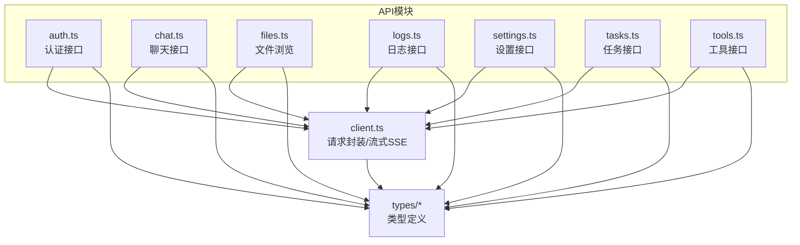
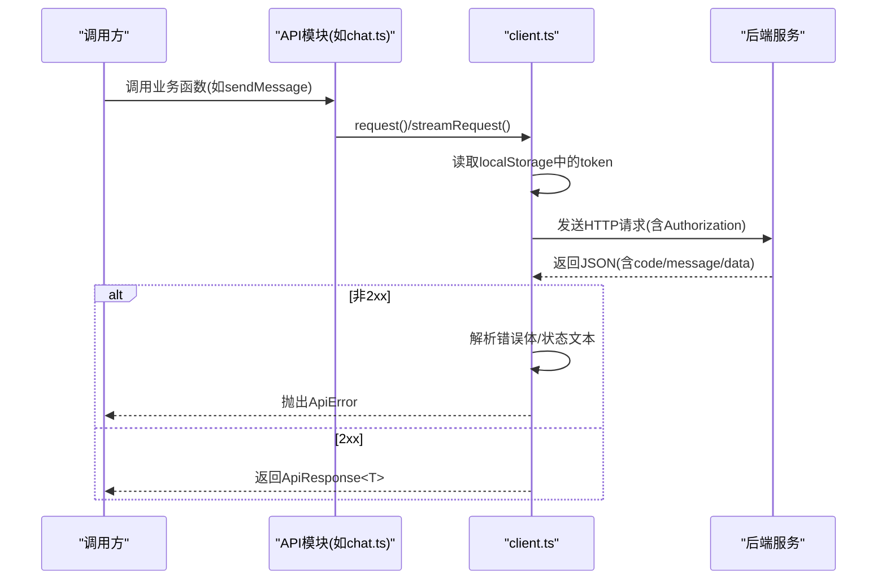
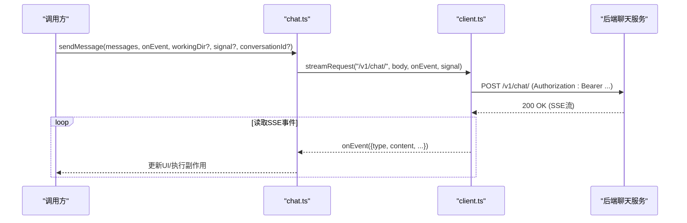
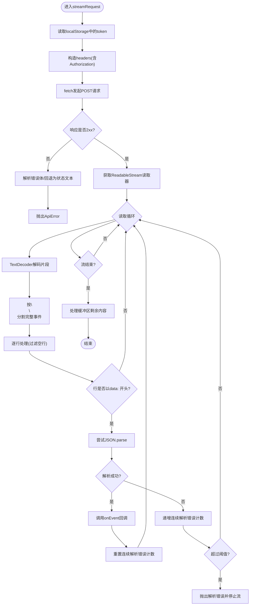
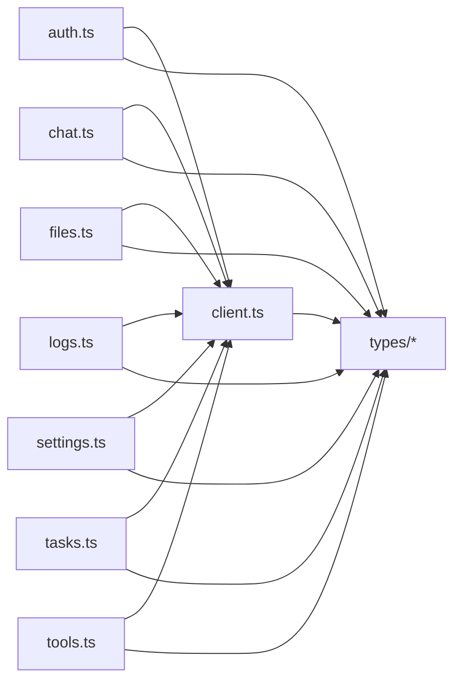

# 前端API客户端

<cite>
**本文引用的文件**
- [frontend/src/api/client.ts](file://frontend/src/api/client.ts)
- [frontend/src/api/auth.ts](file://frontend/src/api/auth.ts)
- [frontend/src/api/chat.ts](file://frontend/src/api/chat.ts)
- [frontend/src/api/files.ts](file://frontend/src/api/files.ts)
- [frontend/src/api/logs.ts](file://frontend/src/api/logs.ts)
- [frontend/src/api/settings.ts](file://frontend/src/api/settings.ts)
- [frontend/src/api/tasks.ts](file://frontend/src/api/tasks.ts)
- [frontend/src/api/tools.ts](file://frontend/src/api/tools.ts)
- [frontend/src/types/api.ts](file://frontend/src/types/api.ts)
- [frontend/src/types/chat.ts](file://frontend/src/types/chat.ts)
- [frontend/src/types/user.ts](file://frontend/src/types/user.ts)
- [frontend/src/types/setting.ts](file://frontend/src/types/setting.ts)
- [frontend/src/types/task.ts](file://frontend/src/types/task.ts)
- [frontend/src/types/log.ts](file://frontend/src/types/log.ts)
- [frontend/src/types/tool.ts](file://frontend/src/types/tool.ts)
</cite>

## 目录
1. [引言](#引言)
2. [项目结构](#项目结构)
3. [核心组件](#核心组件)
4. [架构总览](#架构总览)
5. [详细组件分析](#详细组件分析)
6. [依赖关系分析](#依赖关系分析)
7. [性能考虑](#性能考虑)
8. [故障排查指南](#故障排查指南)
9. [结论](#结论)
10. [附录](#附录)

## 引言
本文件面向XuanJi前端API客户端，系统性阐述其设计与实现：HTTP请求封装、错误处理与响应解析；按功能域划分的API模块（认证、聊天、文件、日志、设置、任务、工具）；请求/响应拦截器的实现机制；认证令牌的自动注入与刷新策略；错误处理与重试机制；以及TypeScript接口定义与类型安全的调用方式。文档同时提供使用示例与最佳实践，帮助开发者快速上手并正确扩展。

## 项目结构
前端API客户端位于frontend/src/api目录下，采用“按功能域分模块”的组织方式，每个模块导出一组与后端接口一一对应的函数，统一通过client.ts提供的request/streamRequest进行HTTP访问。类型定义集中在frontend/src/types目录，确保调用端的类型安全。

图表来源
- [frontend/src/api/client.ts:1-119](file://frontend/src/api/client.ts#L1-L119)
- [frontend/src/api/auth.ts:1-21](file://frontend/src/api/auth.ts#L1-L21)
- [frontend/src/api/chat.ts:1-49](file://frontend/src/api/chat.ts#L1-L49)
- [frontend/src/api/files.ts:1-14](file://frontend/src/api/files.ts#L1-L14)
- [frontend/src/api/logs.ts:1-21](file://frontend/src/api/logs.ts#L1-L21)
- [frontend/src/api/settings.ts:1-18](file://frontend/src/api/settings.ts#L1-L18)
- [frontend/src/api/tasks.ts:1-23](file://frontend/src/api/tasks.ts#L1-L23)
- [frontend/src/api/tools.ts:1-43](file://frontend/src/api/tools.ts#L1-L43)
- [frontend/src/types/api.ts:1-6](file://frontend/src/types/api.ts#L1-L6)

章节来源
- [frontend/src/api/client.ts:1-119](file://frontend/src/api/client.ts#L1-L119)
- [frontend/src/api/auth.ts:1-21](file://frontend/src/api/auth.ts#L1-L21)
- [frontend/src/api/chat.ts:1-49](file://frontend/src/api/chat.ts#L1-L49)
- [frontend/src/api/files.ts:1-14](file://frontend/src/api/files.ts#L1-L14)
- [frontend/src/api/logs.ts:1-21](file://frontend/src/api/logs.ts#L1-L21)
- [frontend/src/api/settings.ts:1-18](file://frontend/src/api/settings.ts#L1-L18)
- [frontend/src/api/tasks.ts:1-23](file://frontend/src/api/tasks.ts#L1-L23)
- [frontend/src/api/tools.ts:1-43](file://frontend/src/api/tools.ts#L1-L43)
- [frontend/src/types/api.ts:1-6](file://frontend/src/types/api.ts#L1-L6)

## 核心组件
- 请求封装与拦截
  - 统一入口：request(endpoint, options?) 返回Promise<ApiResponse<T>>
  - 自动注入：从localStorage读取token并在请求头添加Authorization: Bearer
  - 错误处理：非2xx时解析JSON错误体或回退为状态文本，抛出ApiError
  - 响应解析：成功时解析JSON并返回Promise<ApiResponse<T>>
- 流式请求与SSE
  - streamRequest(endpoint, body, onEvent, signal?)
  - 使用fetch + ReadableStream + TextDecoder循环读取服务端事件
  - 按行解析SSE数据，遇到data:前缀提取JSON并回调onEvent
  - 连续解析错误超过阈值时主动终止流
- 类型系统
  - ApiResponse<T>：统一响应结构{code,message,data}
  - 各模块类型：用户、聊天消息、日志、设置、任务、工具等

章节来源
- [frontend/src/api/client.ts:1-119](file://frontend/src/api/client.ts#L1-L119)
- [frontend/src/types/api.ts:1-6](file://frontend/src/types/api.ts#L1-L6)

## 架构总览
下图展示了前端API客户端的整体交互：各业务模块通过client.ts发起请求，client.ts负责认证令牌注入、错误处理与SSE解析；后端返回统一的ApiResponse结构。

图表来源
- [frontend/src/api/client.ts:1-119](file://frontend/src/api/client.ts#L1-L119)
- [frontend/src/api/chat.ts:1-49](file://frontend/src/api/chat.ts#L1-L49)
- [frontend/src/types/api.ts:1-6](file://frontend/src/types/api.ts#L1-L6)

## 详细组件分析

### 认证模块（auth.ts）
- 功能
  - 登录：提交用户名/密码，返回token与用户信息
  - 注册：提交用户名、邮箱、密码，返回token与用户信息
  - 获取当前用户：携带token查询个人信息
- 实现要点
  - 所有接口均通过request封装，自动注入Authorization头
  - 返回类型由调用方传入泛型约束，保证类型安全
- 典型调用路径
  - 登录：login -> request('/v1/auth/login')
  - 注册：register -> request('/v1/auth/register')
  - 查询当前用户：getMe -> request('/v1/auth/me')

章节来源
- [frontend/src/api/auth.ts:1-21](file://frontend/src/api/auth.ts#L1-L21)
- [frontend/src/types/user.ts:1-18](file://frontend/src/types/user.ts#L1-L18)

### 聊天模块（chat.ts）
- 功能
  - 会话列表：获取用户会话
  - 会话消息：根据会话ID获取消息列表
  - 最近消息：按天数查询最近消息
  - 发送消息：支持SSE流式返回事件，回调onEvent
- 实现要点
  - sendMessage内部调用streamRequest，支持AbortSignal中断
  - 支持工作目录与会话ID参数透传
- 典型调用路径
  - sendMessage -> streamRequest('/v1/chat/', {..., stream: true})

图表来源
- [frontend/src/api/chat.ts:1-49](file://frontend/src/api/chat.ts#L1-L49)
- [frontend/src/api/client.ts:46-118](file://frontend/src/api/client.ts#L46-L118)
- [frontend/src/types/chat.ts:1-47](file://frontend/src/types/chat.ts#L1-L47)

章节来源
- [frontend/src/api/chat.ts:1-49](file://frontend/src/api/chat.ts#L1-L49)
- [frontend/src/types/chat.ts:1-47](file://frontend/src/types/chat.ts#L1-L47)

### 文件模块（files.ts）
- 功能
  - 浏览目录：可选传入path参数，返回当前目录与条目列表
- 实现要点
  - 通过URLSearchParams拼接查询参数
  - 返回类型为包含entries的结构

章节来源
- [frontend/src/api/files.ts:1-14](file://frontend/src/api/files.ts#L1-L14)

### 日志模块（logs.ts）
- 功能
  - 获取日志列表：支持limit、offset、level、source筛选
  - 获取日志统计：返回按级别计数的统计信息
- 实现要点
  - 使用URLSearchParams构建查询字符串
  - 返回类型分别为LogListResponse与LogStatsResponse

章节来源
- [frontend/src/api/logs.ts:1-21](file://frontend/src/api/logs.ts#L1-L21)
- [frontend/src/types/log.ts:1-24](file://frontend/src/types/log.ts#L1-L24)

### 设置模块（settings.ts）
- 功能
  - 获取设置：返回用户设置或空
  - 更新设置：PUT更新部分字段
  - 获取Token用量：返回当日/月度/累计用量与预算
- 实现要点
  - 使用request封装，自动注入Authorization
  - SettingUpdate为可选字段集合，便于局部更新

章节来源
- [frontend/src/api/settings.ts:1-18](file://frontend/src/api/settings.ts#L1-L18)
- [frontend/src/types/setting.ts:1-71](file://frontend/src/types/setting.ts#L1-L71)

### 任务模块（tasks.ts）
- 功能
  - 列表：获取所有任务
  - 单个：按ID获取任务详情
  - 运行中：获取运行中任务
  - 取消/重启：对指定任务执行PATCH操作
- 实现要点
  - 使用request封装，取消/重启通过PATCH方法

章节来源
- [frontend/src/api/tasks.ts:1-23](file://frontend/src/api/tasks.ts#L1-L23)
- [frontend/src/types/task.ts:1-13](file://frontend/src/types/task.ts#L1-L13)

### 工具模块（tools.ts）
- 功能
  - 列表/详情：获取工具简要与完整信息
  - 搜索：按关键词搜索工具
  - 删除/创建/更新：管理工具
  - 导出/导入：批量导出与导入工具
  - 版本：列出版本与回滚
- 实现要点
  - 使用request封装，导入/回滚等使用POST/PUT/PATCH
  - ToolCreate/ToolUpdate/ToolImportResult等类型确保调用端类型安全

章节来源
- [frontend/src/api/tools.ts:1-43](file://frontend/src/api/tools.ts#L1-L43)
- [frontend/src/types/tool.ts:1-71](file://frontend/src/types/tool.ts#L1-L71)

### 客户端核心（client.ts）
- 设计要点
  - 统一基地址：BASE_URL来自VITE_API_BASE_URL，未配置时默认'/api'
  - 请求拦截：在headers中注入Authorization: Bearer token
  - 响应拦截：非2xx时解析错误体，抛出ApiError
  - 流式SSE：按行解析data:开头的事件，回调onEvent
  - 错误收敛：解析失败或连续解析错误过多时终止流
- 关键流程（SSE解析）

图表来源
- [frontend/src/api/client.ts:46-118](file://frontend/src/api/client.ts#L46-L118)

章节来源
- [frontend/src/api/client.ts:1-119](file://frontend/src/api/client.ts#L1-L119)

## 依赖关系分析
- 模块内聚
  - 各API模块仅依赖client.ts与对应类型定义，内聚性高
- 模块耦合
  - client.ts被所有模块依赖，形成中心化请求入口
- 类型耦合
  - 所有模块与types/*强绑定，确保调用端类型安全
- 外部依赖
  - fetch、ReadableStream、TextDecoder用于SSE流式处理
  - localStorage用于token存储

图表来源
- [frontend/src/api/client.ts:1-119](file://frontend/src/api/client.ts#L1-L119)
- [frontend/src/api/auth.ts:1-21](file://frontend/src/api/auth.ts#L1-L21)
- [frontend/src/api/chat.ts:1-49](file://frontend/src/api/chat.ts#L1-L49)
- [frontend/src/api/files.ts:1-14](file://frontend/src/api/files.ts#L1-L14)
- [frontend/src/api/logs.ts:1-21](file://frontend/src/api/logs.ts#L1-L21)
- [frontend/src/api/settings.ts:1-18](file://frontend/src/api/settings.ts#L1-L18)
- [frontend/src/api/tasks.ts:1-23](file://frontend/src/api/tasks.ts#L1-L23)
- [frontend/src/api/tools.ts:1-43](file://frontend/src/api/tools.ts#L1-L43)
- [frontend/src/types/api.ts:1-6](file://frontend/src/types/api.ts#L1-L6)

章节来源
- [frontend/src/api/client.ts:1-119](file://frontend/src/api/client.ts#L1-L119)
- [frontend/src/types/api.ts:1-6](file://frontend/src/types/api.ts#L1-L6)

## 性能考虑
- 流式SSE
  - 使用ReadableStream与TextDecoder增量解码，避免一次性加载大响应
  - 按行解析减少内存占用，适合长连接事件推送
- 错误收敛
  - 连续解析错误阈值控制，避免无效重试导致资源浪费
- 请求合并
  - 对高频查询（如日志分页）建议在调用端做去抖/节流
- 缓存策略
  - 对只读数据（如工具列表、设置）可在调用端实现轻量缓存，降低重复请求

## 故障排查指南
- 常见错误
  - 401/403：检查本地token是否存在且未过期
  - 400/422：检查请求体格式与必填字段
  - 5xx：检查后端服务状态与网络连通性
- 排查步骤
  - 检查BASE_URL配置是否正确
  - 在浏览器Network面板观察请求头Authorization是否包含Bearer token
  - 对SSE流：确认服务端事件格式为data: JSON，并以\n\n结尾
  - 若出现“连续SSE解析错误过多”，需检查服务端事件稳定性
- 错误处理
  - 使用try/catch捕获ApiError，读取status与message进行差异化提示
  - 对可恢复错误（如网络波动）可结合重试策略

章节来源
- [frontend/src/api/client.ts:38-44](file://frontend/src/api/client.ts#L38-L44)
- [frontend/src/api/client.ts:85-91](file://frontend/src/api/client.ts#L85-L91)

## 结论
XuanJi前端API客户端以client.ts为核心，实现了统一的请求封装、SSE流式处理与类型安全的调用体验。各功能模块职责清晰、耦合度低，配合完善的类型定义，既保证了开发效率也提升了可维护性。建议在实际项目中结合调用端状态管理与缓存策略，进一步优化用户体验与性能表现。

## 附录

### 类型安全与接口定义
- 统一响应结构
  - ApiResponse<T>：包含code、message、data字段
- 用户相关
  - User、LoginRequest、RegisterRequest
- 聊天相关
  - ChatMessage、AgentEvent、CollaborationStep、ToolExecution、EmotionSnapshot
- 日志相关
  - LogEntry、LogListResponse、LogStatsResponse
- 设置相关
  - UserSetting、SettingUpdate、TokenUsageSummary
- 任务相关
  - Task、TaskStatus
- 工具相关
  - Tool、ToolBrief、ToolCreate、ToolUpdate、ToolImportResult、ToolExportItem、ToolVersion

章节来源
- [frontend/src/types/api.ts:1-6](file://frontend/src/types/api.ts#L1-L6)
- [frontend/src/types/user.ts:1-18](file://frontend/src/types/user.ts#L1-L18)
- [frontend/src/types/chat.ts:1-47](file://frontend/src/types/chat.ts#L1-L47)
- [frontend/src/types/log.ts:1-24](file://frontend/src/types/log.ts#L1-L24)
- [frontend/src/types/setting.ts:1-71](file://frontend/src/types/setting.ts#L1-L71)
- [frontend/src/types/task.ts:1-13](file://frontend/src/types/task.ts#L1-L13)
- [frontend/src/types/tool.ts:1-71](file://frontend/src/types/tool.ts#L1-L71)

### 使用示例与最佳实践
- 登录与鉴权
  - 登录成功后将token写入localStorage，后续请求自动注入Authorization头
  - 建议在应用启动时优先调用getMe校验token有效性
- 聊天与流式事件
  - sendMessage接收onEvent回调，按事件类型更新UI
  - 使用AbortSignal在组件卸载或切换会话时中断旧流
- 错误处理
  - 对ApiError读取status与message，区分网络错误、业务错误与权限问题
  - 对可重试的临时错误（如超时）实现指数退避重试
- 数据查询
  - 日志分页：合理设置limit与offset，避免一次性拉取过多数据
  - 工具搜索：对关键词做去空白与长度限制，提升命中率
- 设置与变更
  - 使用SettingUpdate进行局部更新，避免全量覆盖
  - 更新LLM配置后，建议触发一次预检请求验证连通性