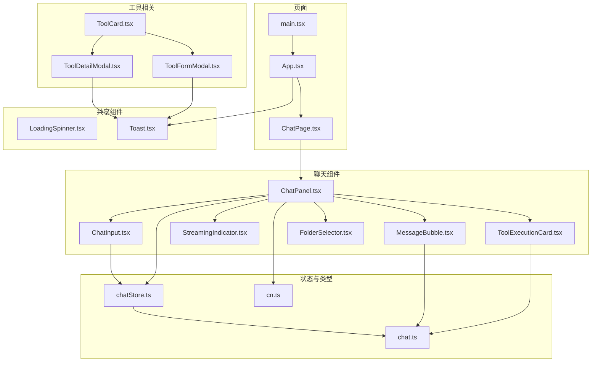
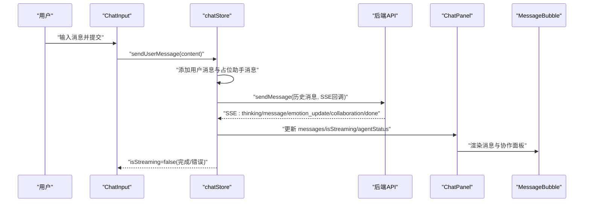
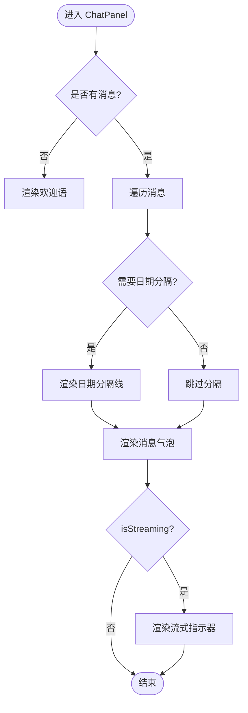
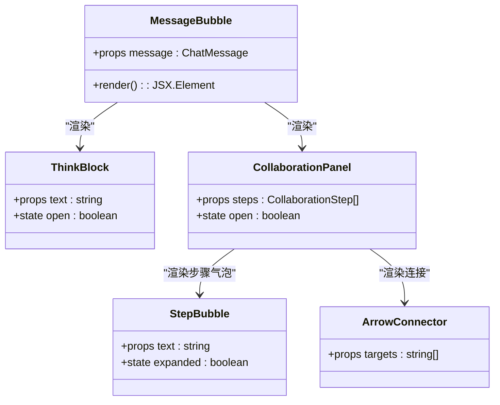
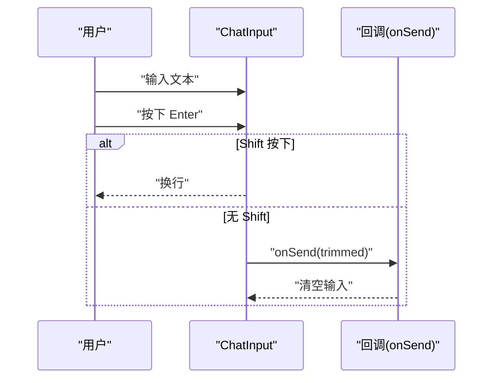
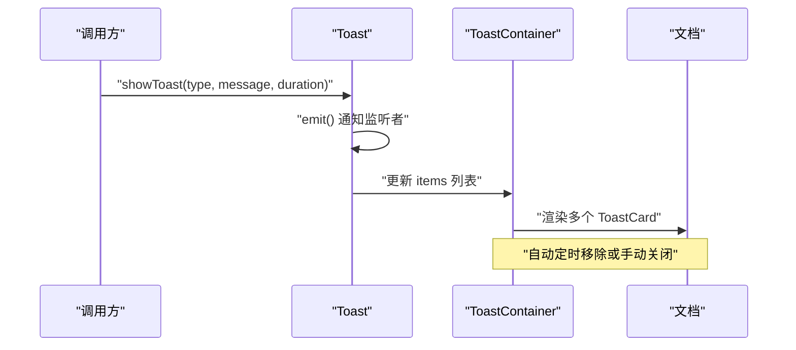
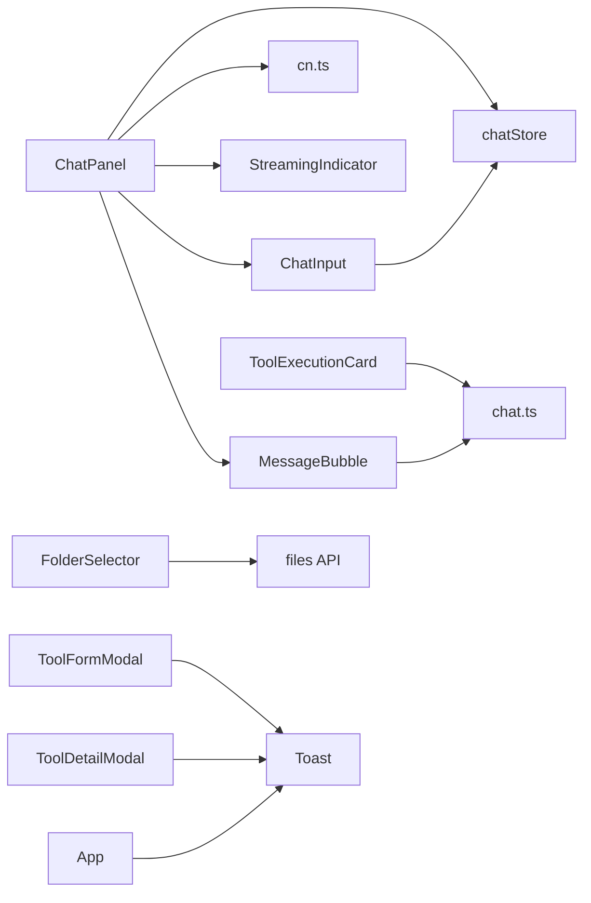

# 前端UI组件系统

<cite>
**本文档引用的文件**
- [ChatPanel.tsx](file://frontend/src/components/chat/ChatPanel.tsx)
- [MessageBubble.tsx](file://frontend/src/components/chat/MessageBubble.tsx)
- [ChatInput.tsx](file://frontend/src/components/chat/ChatInput.tsx)
- [ToolExecutionCard.tsx](file://frontend/src/components/chat/ToolExecutionCard.tsx)
- [StreamingIndicator.tsx](file://frontend/src/components/chat/StreamingIndicator.tsx)
- [FolderSelector.tsx](file://frontend/src/components/chat/FolderSelector.tsx)
- [LoadingSpinner.tsx](file://frontend/src/components/shared/LoadingSpinner.tsx)
- [Toast.tsx](file://frontend/src/components/shared/Toast.tsx)
- [chat.ts](file://frontend/src/types/chat.ts)
- [chatStore.ts](file://frontend/src/stores/chatStore.ts)
- [cn.ts](file://frontend/src/utils/cn.ts)
- [ChatPage.tsx](file://frontend/src/pages/ChatPage.tsx)
- [App.tsx](file://frontend/src/App.tsx)
- [main.tsx](file://frontend/src/main.tsx)
- [ToolCard.tsx](file://frontend/src/components/tools/ToolCard.tsx)
- [ToolDetailModal.tsx](file://frontend/src/components/tools/ToolDetailModal.tsx)
- [ToolFormModal.tsx](file://frontend/src/components/tools/ToolFormModal.tsx)
</cite>

## 目录
1. [简介](#简介)
2. [项目结构](#项目结构)
3. [核心组件](#核心组件)
4. [架构总览](#架构总览)
5. [详细组件分析](#详细组件分析)
6. [依赖关系分析](#依赖关系分析)
7. [性能考量](#性能考量)
8. [故障排查指南](#故障排查指南)
9. [结论](#结论)
10. [附录](#附录)

## 简介
本文件为 XuanJi 前端 UI 组件系统的全面技术文档，聚焦聊天组件、工具执行卡片与共享组件（加载指示器、通知）的设计与实现。文档涵盖组件功能特性、属性接口、事件处理、状态管理、Tailwind CSS 主题化策略、可访问性与响应式布局，并通过图示展示关键流程与数据流。

## 项目结构
前端采用按功能域划分的目录组织，核心聊天组件位于 components/chat，共享组件位于 components/shared，页面入口位于 pages，全局状态使用 Zustand 存储于 stores，类型定义位于 types。

**图表来源**
- [ChatPage.tsx:1-17](file://frontend/src/pages/ChatPage.tsx#L1-L17)
- [App.tsx:1-77](file://frontend/src/App.tsx#L1-L77)
- [main.tsx:1-14](file://frontend/src/main.tsx#L1-L14)
- [ChatPanel.tsx:1-67](file://frontend/src/components/chat/ChatPanel.tsx#L1-L67)
- [MessageBubble.tsx:1-282](file://frontend/src/components/chat/MessageBubble.tsx#L1-L282)
- [ChatInput.tsx:1-65](file://frontend/src/components/chat/ChatInput.tsx#L1-L65)
- [StreamingIndicator.tsx:1-13](file://frontend/src/components/chat/StreamingIndicator.tsx#L1-L13)
- [ToolExecutionCard.tsx:1-32](file://frontend/src/components/chat/ToolExecutionCard.tsx#L1-L32)
- [FolderSelector.tsx:1-145](file://frontend/src/components/chat/FolderSelector.tsx#L1-L145)
- [LoadingSpinner.tsx:1-22](file://frontend/src/components/shared/LoadingSpinner.tsx#L1-L22)
- [Toast.tsx:1-110](file://frontend/src/components/shared/Toast.tsx#L1-L110)
- [chatStore.ts:1-291](file://frontend/src/stores/chatStore.ts#L1-L291)
- [chat.ts:1-47](file://frontend/src/types/chat.ts#L1-L47)
- [cn.ts:1-7](file://frontend/src/utils/cn.ts#L1-L7)
- [ToolCard.tsx:1-61](file://frontend/src/components/tools/ToolCard.tsx#L1-L61)
- [ToolDetailModal.tsx:1-255](file://frontend/src/components/tools/ToolDetailModal.tsx#L1-L255)
- [ToolFormModal.tsx:1-202](file://frontend/src/components/tools/ToolFormModal.tsx#L1-L202)

**章节来源**
- [ChatPage.tsx:1-17](file://frontend/src/pages/ChatPage.tsx#L1-L17)
- [App.tsx:1-77](file://frontend/src/App.tsx#L1-L77)
- [main.tsx:1-14](file://frontend/src/main.tsx#L1-L14)

## 核心组件
- 聊天面板 ChatPanel：负责渲染消息列表、日期分隔、流式状态与输入区组合。
- 消息气泡 MessageBubble：支持用户/助手消息样式、思考过程折叠块、协作时间线与时间戳。
- 输入组件 ChatInput：多行文本输入、回车发送、流式取消。
- 流式指示器 StreamingIndicator：流式状态与节拍动画。
- 工具执行卡片 ToolExecutionCard：展示工具调用结果与状态。
- 文件夹选择器 FolderSelector：目录浏览与路径选择。
- 共享组件 LoadingSpinner：脉冲动画加载；Toast：全局通知管理与容器。

**章节来源**
- [ChatPanel.tsx:1-67](file://frontend/src/components/chat/ChatPanel.tsx#L1-L67)
- [MessageBubble.tsx:1-282](file://frontend/src/components/chat/MessageBubble.tsx#L1-L282)
- [ChatInput.tsx:1-65](file://frontend/src/components/chat/ChatInput.tsx#L1-L65)
- [StreamingIndicator.tsx:1-13](file://frontend/src/components/chat/StreamingIndicator.tsx#L1-L13)
- [ToolExecutionCard.tsx:1-32](file://frontend/src/components/chat/ToolExecutionCard.tsx#L1-L32)
- [FolderSelector.tsx:1-145](file://frontend/src/components/chat/FolderSelector.tsx#L1-L145)
- [LoadingSpinner.tsx:1-22](file://frontend/src/components/shared/LoadingSpinner.tsx#L1-L22)
- [Toast.tsx:1-110](file://frontend/src/components/shared/Toast.tsx#L1-L110)

## 架构总览
聊天组件系统围绕 Zustand 状态仓库进行数据驱动，Store 负责消息队列、流式状态、协作开关与 SSE 事件处理；UI 组件通过 props 与 hooks 读取状态并触发动作。

**图表来源**
- [ChatInput.tsx:1-65](file://frontend/src/components/chat/ChatInput.tsx#L1-L65)
- [chatStore.ts:116-291](file://frontend/src/stores/chatStore.ts#L116-L291)
- [ChatPanel.tsx:1-67](file://frontend/src/components/chat/ChatPanel.tsx#L1-L67)
- [MessageBubble.tsx:1-282](file://frontend/src/components/chat/MessageBubble.tsx#L1-L282)

**章节来源**
- [chatStore.ts:1-291](file://frontend/src/stores/chatStore.ts#L1-L291)

## 详细组件分析

### 聊天面板 ChatPanel
- 职责：滚动至底部、渲染消息列表与日期分隔、条件渲染流式指示器、承载输入组件。
- 关键逻辑：根据消息时间判断是否显示日期分隔；当无消息时显示欢迎语；流式状态控制输入区禁用与取消按钮。
- 样式策略：使用 Tailwind 通用类与 cn 合并工具，确保明暗主题适配。

**图表来源**
- [ChatPanel.tsx:1-67](file://frontend/src/components/chat/ChatPanel.tsx#L1-L67)

**章节来源**
- [ChatPanel.tsx:1-67](file://frontend/src/components/chat/ChatPanel.tsx#L1-L67)

### 消息气泡 MessageBubble
- 职责：渲染用户/助手消息、解析并展示思考过程块、渲染协作时间线、显示时间戳。
- 思考过程解析：识别<think>标签段落，支持折叠展开；非 think 段落保持纯文本。
- 协作面板：横向时间线展示角色、动作、结果与箭头连接；支持展开/收起。
- 角色配色：基于角色名映射不同背景与标签色，支持明暗主题。

**图表来源**
- [MessageBubble.tsx:1-282](file://frontend/src/components/chat/MessageBubble.tsx#L1-L282)
- [chat.ts:1-47](file://frontend/src/types/chat.ts#L1-L47)

**章节来源**
- [MessageBubble.tsx:1-282](file://frontend/src/components/chat/MessageBubble.tsx#L1-L282)
- [chat.ts:1-47](file://frontend/src/types/chat.ts#L1-L47)

### 输入组件 ChatInput
- 职责：多行文本输入、回车发送、Shift+Enter 换行、流式取消。
- 交互：表单提交触发 onSend；禁用状态下不可输入或发送；isStreaming 时显示取消按钮。
- 样式：聚焦态边框高亮、禁用态透明度与光标控制。

**图表来源**
- [ChatInput.tsx:1-65](file://frontend/src/components/chat/ChatInput.tsx#L1-L65)

**章节来源**
- [ChatInput.tsx:1-65](file://frontend/src/components/chat/ChatInput.tsx#L1-L65)

### 流式指示器 StreamingIndicator
- 职责：渲染三连点节拍动画与状态文案。
- 适用场景：当 agentStatus 非空时显示，配合 Store 的 thinking 事件更新。

**章节来源**
- [StreamingIndicator.tsx:1-13](file://frontend/src/components/chat/StreamingIndicator.tsx#L1-L13)

### 工具执行卡片 ToolExecutionCard
- 职责：展示工具名称、执行结果与成功/失败状态。
- 交互：以预格式化文本展示结果，支持滚动查看长输出。
- 样式：根据 success 状态切换颜色与徽标文案。

**章节来源**
- [ToolExecutionCard.tsx:1-32](file://frontend/src/components/chat/ToolExecutionCard.tsx#L1-L32)

### 文件夹选择器 FolderSelector
- 职责：浏览服务器目录、返回上级、选择当前路径。
- 交互：点击外部区域关闭面板；加载中状态提示；仅列出目录项。
- 样式：悬浮态与选中态颜色区分，路径标题溢出省略。

**章节来源**
- [FolderSelector.tsx:1-145](file://frontend/src/components/chat/FolderSelector.tsx#L1-L145)

### 共享组件：加载指示器与通知
- LoadingSpinner：五点脉冲动画，居中布局，适用于小尺寸加载场景。
- Toast：全局通知容器，支持 success/error/info/warning 四种类型；内部使用 requestAnimationFrame 实现入场动画；支持手动关闭与自动消失。

**图表来源**
- [Toast.tsx:1-110](file://frontend/src/components/shared/Toast.tsx#L1-L110)

**章节来源**
- [LoadingSpinner.tsx:1-22](file://frontend/src/components/shared/LoadingSpinner.tsx#L1-L22)
- [Toast.tsx:1-110](file://frontend/src/components/shared/Toast.tsx#L1-L110)

### 工具相关组件
- ToolCard：展示工具基本信息与操作按钮（编辑/删除），内置工具带星标标识。
- ToolDetailModal：代码与版本历史双标签页，支持版本回退与刷新。
- ToolFormModal：新建/编辑工具的表单，校验必填字段并统一使用 Toast 反馈。

**章节来源**
- [ToolCard.tsx:1-61](file://frontend/src/components/tools/ToolCard.tsx#L1-L61)
- [ToolDetailModal.tsx:1-255](file://frontend/src/components/tools/ToolDetailModal.tsx#L1-L255)
- [ToolFormModal.tsx:1-202](file://frontend/src/components/tools/ToolFormModal.tsx#L1-L202)

## 依赖关系分析
- 组件间依赖：ChatPanel 依赖 MessageBubble、ChatInput、StreamingIndicator；MessageBubble 依赖 cn 工具与类型定义；ChatInput 依赖 chatStore 发送消息；Toast 作为全局服务被多处调用。
- 状态依赖：chatStore 提供消息、流式状态、协作开关与事件处理；页面 ChatPage 在挂载时初始化会话与偏好设置。
- 样式依赖：cn 工具合并 Tailwind 类，避免冲突；主题通过明暗模式类名切换实现。

**图表来源**
- [ChatPanel.tsx:1-67](file://frontend/src/components/chat/ChatPanel.tsx#L1-L67)
- [MessageBubble.tsx:1-282](file://frontend/src/components/chat/MessageBubble.tsx#L1-L282)
- [ChatInput.tsx:1-65](file://frontend/src/components/chat/ChatInput.tsx#L1-L65)
- [StreamingIndicator.tsx:1-13](file://frontend/src/components/chat/StreamingIndicator.tsx#L1-L13)
- [ToolExecutionCard.tsx:1-32](file://frontend/src/components/chat/ToolExecutionCard.tsx#L1-L32)
- [FolderSelector.tsx:1-145](file://frontend/src/components/chat/FolderSelector.tsx#L1-L145)
- [Toast.tsx:1-110](file://frontend/src/components/shared/Toast.tsx#L1-L110)
- [chatStore.ts:1-291](file://frontend/src/stores/chatStore.ts#L1-L291)
- [chat.ts:1-47](file://frontend/src/types/chat.ts#L1-L47)
- [cn.ts:1-7](file://frontend/src/utils/cn.ts#L1-L7)
- [App.tsx:1-77](file://frontend/src/App.tsx#L1-L77)

**章节来源**
- [chatStore.ts:1-291](file://frontend/src/stores/chatStore.ts#L1-L291)
- [App.tsx:1-77](file://frontend/src/App.tsx#L1-L77)

## 性能考量
- 虚拟滚动：消息量大时建议引入虚拟滚动以降低 DOM 节点数量。
- 渲染优化：MessageBubble 对思考块与协作面板使用受控展开，避免一次性渲染大量内容。
- 状态粒度：chatStore 将流式状态与消息分离，减少无关重渲染。
- 图标与动画：使用轻量级动画（脉冲、节拍）与 SVG 矢量图标，保证流畅度。
- SSR/首屏：App 中使用 Suspense 与路由懒加载，提升首屏体验。

[本节为通用指导，无需特定文件引用]

## 故障排查指南
- 流式卡死：若收到 done 事件缺失，Store 最终兜底清理 isStreaming/isGenerating 状态，确保 UI 恢复正常。
- 事件串话：Store 校验 conversation_id，不匹配的 SSE 事件会被忽略，避免跨会话消息污染。
- 错误处理：Store 捕获异常并追加错误提示，同时清理流式状态；用户主动取消不会显示错误。
- 通知未消失：Toast 自动定时移除，若需手动关闭请调用 removeToast 或点击右上角关闭按钮。

**章节来源**
- [chatStore.ts:246-291](file://frontend/src/stores/chatStore.ts#L246-L291)
- [Toast.tsx:44-58](file://frontend/src/components/shared/Toast.tsx#L44-L58)

## 结论
XuanJi 前端 UI 组件系统以清晰的职责划分与状态驱动为核心，结合 Tailwind CSS 的实用类与 cn 合并工具，实现了主题化与可维护性。聊天组件具备完整的消息渲染、协作展示与流式交互能力；共享组件提供了统一的通知与加载体验；工具相关组件完善了开发与运维场景下的可用性。建议后续引入虚拟滚动与更细粒度的状态切分以进一步提升性能与扩展性。

[本节为总结性内容，无需特定文件引用]

## 附录

### 组件属性与事件接口概览
- ChatPanel
  - 属性：无（通过 store 注入）
  - 事件：无（内部消费 store）
- MessageBubble
  - 属性：message: ChatMessage
  - 事件：无（内部渲染）
- ChatInput
  - 属性：onSend(message), disabled?, isStreaming?, onCancel?
  - 事件：表单提交触发 onSend
- StreamingIndicator
  - 属性：status: string
  - 事件：无
- ToolExecutionCard
  - 属性：execution: ToolExecution
  - 事件：无
- FolderSelector
  - 属性：value?, onChange(path)
  - 事件：点击外部区域关闭、选择目录
- LoadingSpinner
  - 属性：无
  - 事件：无
- ToastContainer
  - 属性：无
  - 事件：内部管理 items 生命周期

**章节来源**
- [ChatPanel.tsx:1-67](file://frontend/src/components/chat/ChatPanel.tsx#L1-L67)
- [MessageBubble.tsx:1-282](file://frontend/src/components/chat/MessageBubble.tsx#L1-L282)
- [ChatInput.tsx:1-65](file://frontend/src/components/chat/ChatInput.tsx#L1-L65)
- [StreamingIndicator.tsx:1-13](file://frontend/src/components/chat/StreamingIndicator.tsx#L1-L13)
- [ToolExecutionCard.tsx:1-32](file://frontend/src/components/chat/ToolExecutionCard.tsx#L1-L32)
- [FolderSelector.tsx:1-145](file://frontend/src/components/chat/FolderSelector.tsx#L1-L145)
- [LoadingSpinner.tsx:1-22](file://frontend/src/components/shared/LoadingSpinner.tsx#L1-L22)
- [Toast.tsx:1-110](file://frontend/src/components/shared/Toast.tsx#L1-L110)

### 样式与主题化策略
- Tailwind 类：广泛使用空间、边框、背景、文字颜色与阴影等实用类，配合明暗模式类名实现深浅适配。
- cn 工具：通过 clsx 与 tailwind-merge 合并类名，避免重复与冲突。
- 主题色板：plum/ink/emerald/amber/sky 等命名色用于角色与状态区分，便于统一风格。

**章节来源**
- [cn.ts:1-7](file://frontend/src/utils/cn.ts#L1-L7)
- [MessageBubble.tsx:65-80](file://frontend/src/components/chat/MessageBubble.tsx#L65-L80)
- [Toast.tsx:19-31](file://frontend/src/components/shared/Toast.tsx#L19-L31)

### 可访问性与响应式布局
- 可访问性：按钮具备 title 与键盘事件（如 Esc 关闭模态），焦点可见性与对比度满足基本要求。
- 响应式：使用相对单位与断点友好的类名，容器宽度自适应，移动端输入区与按钮尺寸适中。

[本节为通用指导，无需特定文件引用]

### 使用示例与组合模式
- 页面集成：ChatPage 初始化会话与偏好设置，渲染 ChatPanel。
- 组合模式：ChatPanel 组合 MessageBubble、ChatInput、StreamingIndicator；MessageBubble 组合 ThinkBlock、CollaborationPanel；ToastContainer 作为全局挂载节点。

**章节来源**
- [ChatPage.tsx:1-17](file://frontend/src/pages/ChatPage.tsx#L1-L17)
- [App.tsx:1-77](file://frontend/src/App.tsx#L1-L77)
- [ChatPanel.tsx:1-67](file://frontend/src/components/chat/ChatPanel.tsx#L1-L67)
- [MessageBubble.tsx:1-282](file://frontend/src/components/chat/MessageBubble.tsx#L1-L282)
- [Toast.tsx:90-110](file://frontend/src/components/shared/Toast.tsx#L90-L110)