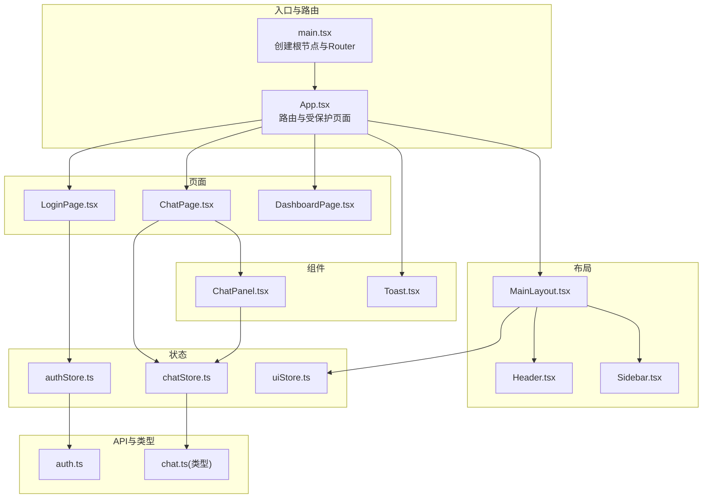
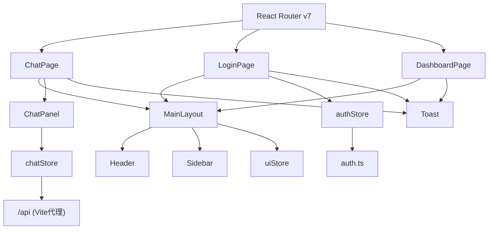
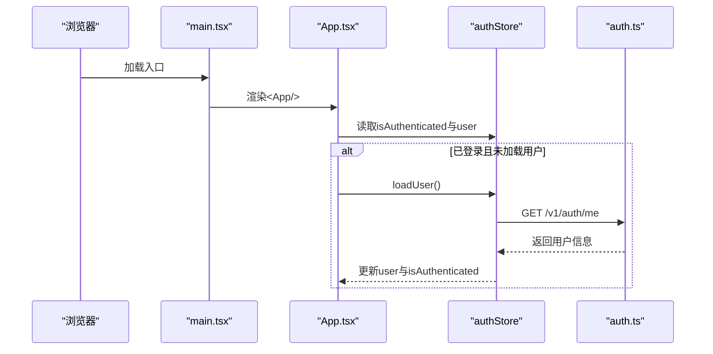
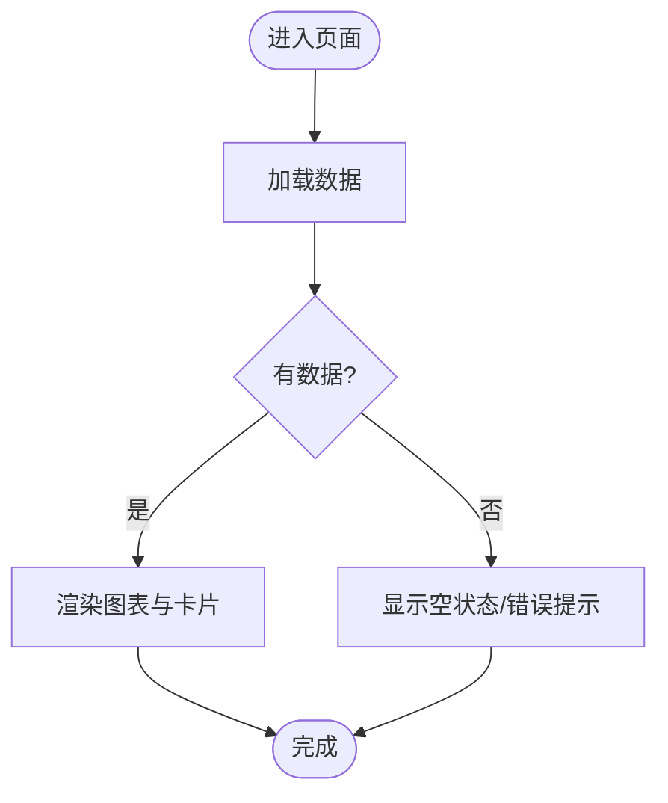
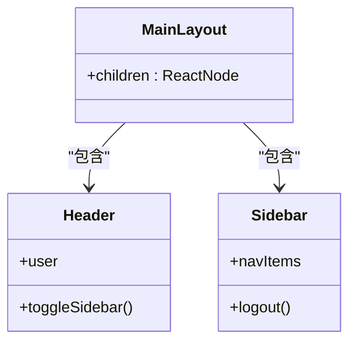
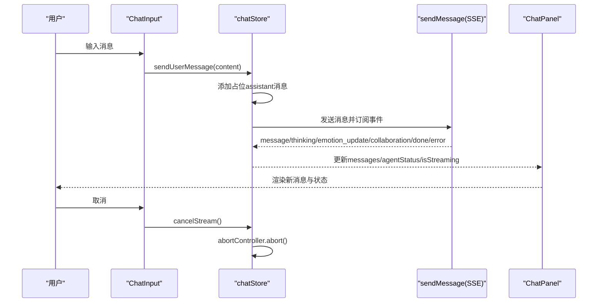
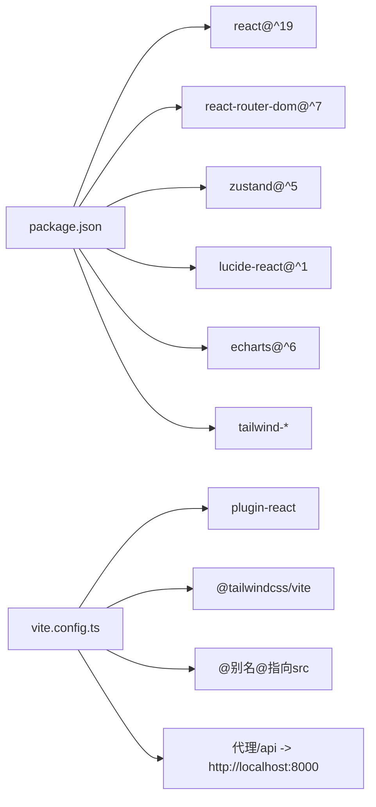

# 前端应用架构

<cite>
**本文引用的文件**
- [frontend/src/main.tsx](file://frontend/src/main.tsx)
- [frontend/src/App.tsx](file://frontend/src/App.tsx)
- [frontend/src/pages/ChatPage.tsx](file://frontend/src/pages/ChatPage.tsx)
- [frontend/src/pages/LoginPage.tsx](file://frontend/src/pages/LoginPage.tsx)
- [frontend/src/pages/DashboardPage.tsx](file://frontend/src/pages/DashboardPage.tsx)
- [frontend/src/components/layout/MainLayout.tsx](file://frontend/src/components/layout/MainLayout.tsx)
- [frontend/src/components/layout/Header.tsx](file://frontend/src/components/layout/Header.tsx)
- [frontend/src/components/layout/Sidebar.tsx](file://frontend/src/components/layout/Sidebar.tsx)
- [frontend/src/components/chat/ChatPanel.tsx](file://frontend/src/components/chat/ChatPanel.tsx)
- [frontend/src/stores/authStore.ts](file://frontend/src/stores/authStore.ts)
- [frontend/src/stores/chatStore.ts](file://frontend/src/stores/chatStore.ts)
- [frontend/src/stores/uiStore.ts](file://frontend/src/stores/uiStore.ts)
- [frontend/src/components/shared/Toast.tsx](file://frontend/src/components/shared/Toast.tsx)
- [frontend/src/api/auth.ts](file://frontend/src/api/auth.ts)
- [frontend/src/types/chat.ts](file://frontend/src/types/chat.ts)
- [frontend/src/utils/cn.ts](file://frontend/src/utils/cn.ts)
- [frontend/package.json](file://frontend/package.json)
- [frontend/vite.config.ts](file://frontend/vite.config.ts)
</cite>

## 目录
1. [引言](#引言)
2. [项目结构](#项目结构)
3. [核心组件](#核心组件)
4. [架构总览](#架构总览)
5. [详细组件分析](#详细组件分析)
6. [依赖关系分析](#依赖关系分析)
7. [性能考量](#性能考量)
8. [故障排查指南](#故障排查指南)
9. [结论](#结论)
10. [附录](#附录)

## 引言
本文件面向XuanJi前端应用，系统性梳理基于React 19的架构设计与实现细节，覆盖应用入口、路由与页面组织、布局系统、组件通信与数据流、状态管理方案、TypeScript类型最佳实践以及组件复用策略。文档同时提供多类Mermaid图示以帮助读者快速把握系统全貌与关键流程。

## 项目结构
前端采用“按功能域分层”的目录组织方式：
- 应用入口与路由：src/main.tsx负责渲染根节点；src/App.tsx集中定义路由与受保护页面。
- 页面层：src/pages 下按页面划分，如聊天页、登录页、仪表盘等。
- 组件层：src/components 下按功能域细分，如布局组件、聊天组件、共享组件、图表组件等。
- 存储层：src/stores 使用Zustand进行状态管理，分别封装认证、聊天、UI状态。
- 类型与工具：src/types 定义API与业务类型；src/utils 提供通用工具函数。
- API层：src/api 封装与后端交互的请求方法。
- 构建与配置：frontend/package.json 与 frontend/vite.config.ts 提供构建、代理与依赖管理。

**图表来源**
- [frontend/src/main.tsx:1-14](file://frontend/src/main.tsx#L1-L14)
- [frontend/src/App.tsx:1-77](file://frontend/src/App.tsx#L1-L77)
- [frontend/src/pages/LoginPage.tsx:1-369](file://frontend/src/pages/LoginPage.tsx#L1-L369)
- [frontend/src/pages/ChatPage.tsx:1-17](file://frontend/src/pages/ChatPage.tsx#L1-L17)
- [frontend/src/pages/DashboardPage.tsx:1-279](file://frontend/src/pages/DashboardPage.tsx#L1-L279)
- [frontend/src/components/layout/MainLayout.tsx:1-19](file://frontend/src/components/layout/MainLayout.tsx#L1-L19)
- [frontend/src/components/layout/Header.tsx:1-31](file://frontend/src/components/layout/Header.tsx#L1-L31)
- [frontend/src/components/layout/Sidebar.tsx:1-66](file://frontend/src/components/layout/Sidebar.tsx#L1-L66)
- [frontend/src/components/chat/ChatPanel.tsx:1-67](file://frontend/src/components/chat/ChatPanel.tsx#L1-L67)
- [frontend/src/components/shared/Toast.tsx:1-110](file://frontend/src/components/shared/Toast.tsx#L1-L110)
- [frontend/src/stores/authStore.ts:1-53](file://frontend/src/stores/authStore.ts#L1-L53)
- [frontend/src/stores/chatStore.ts:1-291](file://frontend/src/stores/chatStore.ts#L1-L291)
- [frontend/src/stores/uiStore.ts:1-12](file://frontend/src/stores/uiStore.ts#L1-L12)
- [frontend/src/api/auth.ts:1-21](file://frontend/src/api/auth.ts#L1-L21)
- [frontend/src/types/chat.ts:1-47](file://frontend/src/types/chat.ts#L1-L47)

**章节来源**
- [frontend/src/main.tsx:1-14](file://frontend/src/main.tsx#L1-L14)
- [frontend/src/App.tsx:1-77](file://frontend/src/App.tsx#L1-L77)
- [frontend/package.json:1-44](file://frontend/package.json#L1-L44)
- [frontend/vite.config.ts:1-35](file://frontend/vite.config.ts#L1-L35)

## 核心组件
- 应用入口与路由
  - main.tsx：创建根节点，包裹BrowserRouter，渲染App。
  - App.tsx：集中定义路由表，使用Suspense懒加载页面，提供受保护路由与全局Toast容器。
- 页面组件
  - LoginPage：登录/注册表单、实时校验、动画与提示。
  - ChatPage：加载最近会话与协作开关，渲染ChatPanel。
  - DashboardPage：仪表盘统计与多图表展示。
- 布局组件
  - MainLayout：组合Sidebar与Header，并承载子页面内容。
  - Header：侧边栏切换按钮与用户信息展示。
  - Sidebar：导航项、活跃态样式与登出按钮。
- 聊天组件
  - ChatPanel：消息列表、日期分隔、滚动与输入区。
- 状态管理
  - authStore：登录、注册、登出、加载用户信息。
  - chatStore：消息、流式状态、发送消息、协作与情绪快照处理。
  - uiStore：侧边栏展开/收起。
- 共享组件
  - Toast：全局通知容器与单项渲染。
- 工具与类型
  - cn：Tailwind类名合并工具。
  - chat.ts 类型：消息、协作步骤、情绪快照、Agent事件。

**章节来源**
- [frontend/src/main.tsx:1-14](file://frontend/src/main.tsx#L1-L14)
- [frontend/src/App.tsx:1-77](file://frontend/src/App.tsx#L1-L77)
- [frontend/src/pages/LoginPage.tsx:1-369](file://frontend/src/pages/LoginPage.tsx#L1-L369)
- [frontend/src/pages/ChatPage.tsx:1-17](file://frontend/src/pages/ChatPage.tsx#L1-L17)
- [frontend/src/pages/DashboardPage.tsx:1-279](file://frontend/src/pages/DashboardPage.tsx#L1-L279)
- [frontend/src/components/layout/MainLayout.tsx:1-19](file://frontend/src/components/layout/MainLayout.tsx#L1-L19)
- [frontend/src/components/layout/Header.tsx:1-31](file://frontend/src/components/layout/Header.tsx#L1-L31)
- [frontend/src/components/layout/Sidebar.tsx:1-66](file://frontend/src/components/layout/Sidebar.tsx#L1-L66)
- [frontend/src/components/chat/ChatPanel.tsx:1-67](file://frontend/src/components/chat/ChatPanel.tsx#L1-L67)
- [frontend/src/stores/authStore.ts:1-53](file://frontend/src/stores/authStore.ts#L1-L53)
- [frontend/src/stores/chatStore.ts:1-291](file://frontend/src/stores/chatStore.ts#L1-L291)
- [frontend/src/stores/uiStore.ts:1-12](file://frontend/src/stores/uiStore.ts#L1-L12)
- [frontend/src/components/shared/Toast.tsx:1-110](file://frontend/src/components/shared/Toast.tsx#L1-L110)
- [frontend/src/utils/cn.ts:1-7](file://frontend/src/utils/cn.ts#L1-L7)
- [frontend/src/types/chat.ts:1-47](file://frontend/src/types/chat.ts#L1-L47)

## 架构总览
XuanJi前端采用“路由驱动 + Zustand状态 + 组件化布局”的架构模式：
- 路由层：React Router v7，支持动态懒加载与受保护路由。
- 状态层：Zustand单仓，分离认证、聊天、UI三类状态，避免跨模块耦合。
- 组件层：布局组件MainLayout统一承载页面内容，Header/Sidebar提供导航与用户信息。
- 通信与数据流：页面通过store读写状态，组件通过props与回调传递数据，API层封装HTTP请求。
- 类型体系：TypeScript强类型贯穿API响应、消息模型与事件类型，提升可维护性。

**图表来源**
- [frontend/src/App.tsx:1-77](file://frontend/src/App.tsx#L1-L77)
- [frontend/src/pages/ChatPage.tsx:1-17](file://frontend/src/pages/ChatPage.tsx#L1-L17)
- [frontend/src/pages/LoginPage.tsx:1-369](file://frontend/src/pages/LoginPage.tsx#L1-L369)
- [frontend/src/pages/DashboardPage.tsx:1-279](file://frontend/src/pages/DashboardPage.tsx#L1-L279)
- [frontend/src/components/layout/MainLayout.tsx:1-19](file://frontend/src/components/layout/MainLayout.tsx#L1-L19)
- [frontend/src/components/layout/Header.tsx:1-31](file://frontend/src/components/layout/Header.tsx#L1-L31)
- [frontend/src/components/layout/Sidebar.tsx:1-66](file://frontend/src/components/layout/Sidebar.tsx#L1-L66)
- [frontend/src/components/chat/ChatPanel.tsx:1-67](file://frontend/src/components/chat/ChatPanel.tsx#L1-L67)
- [frontend/src/stores/chatStore.ts:1-291](file://frontend/src/stores/chatStore.ts#L1-L291)
- [frontend/src/stores/authStore.ts:1-53](file://frontend/src/stores/authStore.ts#L1-L53)
- [frontend/src/stores/uiStore.ts:1-12](file://frontend/src/stores/uiStore.ts#L1-L12)
- [frontend/src/components/shared/Toast.tsx:1-110](file://frontend/src/components/shared/Toast.tsx#L1-L110)
- [frontend/src/api/auth.ts:1-21](file://frontend/src/api/auth.ts#L1-L21)
- [frontend/vite.config.ts:25-33](file://frontend/vite.config.ts#L25-L33)

## 详细组件分析

### 应用入口与初始化
- 初始化流程
  - main.tsx 创建根节点，包裹BrowserRouter，渲染App。
  - App.tsx 在首次进入受保护路由时，若已登录且未加载用户信息，则调用loadUser完成用户信息拉取。
  - 全局使用Suspense对页面进行懒加载，减少首屏体积。
- 关键点
  - 受保护路由通过useAuthStore判断登录态，未登录自动跳转至登录页。
  - 全局Toast容器确保跨页面一致的通知体验。

**图表来源**
- [frontend/src/main.tsx:1-14](file://frontend/src/main.tsx#L1-L14)
- [frontend/src/App.tsx:21-31](file://frontend/src/App.tsx#L21-L31)
- [frontend/src/stores/authStore.ts:41-51](file://frontend/src/stores/authStore.ts#L41-L51)
- [frontend/src/api/auth.ts:18-21](file://frontend/src/api/auth.ts#L18-L21)

**章节来源**
- [frontend/src/main.tsx:1-14](file://frontend/src/main.tsx#L1-L14)
- [frontend/src/App.tsx:1-77](file://frontend/src/App.tsx#L1-L77)

### 页面组件设计模式
- 聊天页面（ChatPage）
  - 进入即加载最近会话与协作开关，随后渲染ChatPanel。
  - 通过useChatStore.getState().loadConversation与loadShowCollaboration完成初始化。
- 登录页面（LoginPage）
  - 表单状态：用户名、邮箱、密码、加载状态、错误集合与交互状态。
  - 实时校验：用户名、邮箱、密码复杂度规则；提交时完整校验。
  - 动画与提示：切换Tab、提交失败震动、页面过渡动画、Toast提示。
  - 登录/注册：调用authStore或authAPI，成功后触发页面过渡与提示。
- 仪表盘页面（DashboardPage）
  - 并行拉取统计数据：总览、按角色、按日、按模型。
  - 多图表：折线图、饼图、堆叠柱状图，使用ECharts渲染。
  - 数据聚合与格式化：按角色聚合、日期去重排序、数值格式化。

**图表来源**
- [frontend/src/pages/ChatPage.tsx:1-17](file://frontend/src/pages/ChatPage.tsx#L1-L17)
- [frontend/src/pages/LoginPage.tsx:88-369](file://frontend/src/pages/LoginPage.tsx#L88-L369)
- [frontend/src/pages/DashboardPage.tsx:26-54](file://frontend/src/pages/DashboardPage.tsx#L26-L54)

**章节来源**
- [frontend/src/pages/ChatPage.tsx:1-17](file://frontend/src/pages/ChatPage.tsx#L1-L17)
- [frontend/src/pages/LoginPage.tsx:1-369](file://frontend/src/pages/LoginPage.tsx#L1-L369)
- [frontend/src/pages/DashboardPage.tsx:1-279](file://frontend/src/pages/DashboardPage.tsx#L1-L279)

### 布局系统：主布局、头部导航与侧边栏
- MainLayout
  - 统一容器，左侧Sidebar，右侧区域包含Header与主内容区。
- Header
  - 侧边栏切换按钮（调用uiStore.toggleSidebar）与用户头像/名称展示。
- Sidebar
  - 导航项：对话、记忆体、总览、设置；根据当前路径高亮。
  - 登出按钮：调用authStore.logout，清除本地token并重置状态。

**图表来源**
- [frontend/src/components/layout/MainLayout.tsx:1-19](file://frontend/src/components/layout/MainLayout.tsx#L1-L19)
- [frontend/src/components/layout/Header.tsx:1-31](file://frontend/src/components/layout/Header.tsx#L1-L31)
- [frontend/src/components/layout/Sidebar.tsx:1-66](file://frontend/src/components/layout/Sidebar.tsx#L1-L66)

**章节来源**
- [frontend/src/components/layout/MainLayout.tsx:1-19](file://frontend/src/components/layout/MainLayout.tsx#L1-L19)
- [frontend/src/components/layout/Header.tsx:1-31](file://frontend/src/components/layout/Header.tsx#L1-L31)
- [frontend/src/components/layout/Sidebar.tsx:1-66](file://frontend/src/components/layout/Sidebar.tsx#L1-L66)

### 组件间通信与数据流
- 聊天数据流（从用户输入到流式渲染）
  - ChatPanel读取messages、isStreaming、agentStatus，向ChatInput暴露发送与取消。
  - ChatInput触发sendUserMessage，chatStore内部构造AbortController并添加占位assistant消息。
  - 通过sendMessage订阅SSE事件，按事件类型更新状态：message拼接到最新assistant消息、thinking更新agentStatus、emotion_update附加情绪快照、collaboration异步应用协作日志、done/error收尾。
  - cancelStream调用AbortController.abort，清理状态。
- 认证数据流
  - LoginPage调用authStore.login或authAPI.register，成功后持久化token并更新store。
  - App在受保护路由首次进入时调用loadUser，失败则移除token并重置状态。

**图表来源**
- [frontend/src/components/chat/ChatPanel.tsx:1-67](file://frontend/src/components/chat/ChatPanel.tsx#L1-L67)
- [frontend/src/stores/chatStore.ts:116-289](file://frontend/src/stores/chatStore.ts#L116-L289)
- [frontend/src/types/chat.ts:1-47](file://frontend/src/types/chat.ts#L1-L47)

**章节来源**
- [frontend/src/components/chat/ChatPanel.tsx:1-67](file://frontend/src/components/chat/ChatPanel.tsx#L1-L67)
- [frontend/src/stores/chatStore.ts:1-291](file://frontend/src/stores/chatStore.ts#L1-L291)
- [frontend/src/types/chat.ts:1-47](file://frontend/src/types/chat.ts#L1-L47)

### TypeScript类型定义最佳实践
- 类型边界清晰
  - ChatMessage：统一消息结构，支持工具执行、情绪快照、协作步骤等扩展字段。
  - AgentEvent：严格枚举事件类型，保证SSE事件处理分支完备。
  - CollaborationStep：协作步骤的结构化定义，便于UI渲染与日志展示。
- API响应类型
  - auth.ts 返回token与用户对象，配合store中的User类型保持一致。
- 工具函数
  - cn：使用clsx与tailwind-merge合并类名，避免冲突与重复。

**章节来源**
- [frontend/src/types/chat.ts:1-47](file://frontend/src/types/chat.ts#L1-L47)
- [frontend/src/api/auth.ts:1-21](file://frontend/src/api/auth.ts#L1-L21)
- [frontend/src/utils/cn.ts:1-7](file://frontend/src/utils/cn.ts#L1-L7)

### 组件复用策略
- 布局复用：MainLayout作为页面容器，Header/Sidebar在受保护路由下统一出现。
- 通知复用：ToastContainer全局挂载，Toast工具函数提供跨页面提示能力。
- 样式复用：cn工具统一类名合并，Sidebar/Header复用图标与颜色体系。
- 图表复用：EChart组件封装ECharts配置，DashboardPage多处复用。

**章节来源**
- [frontend/src/components/layout/MainLayout.tsx:1-19](file://frontend/src/components/layout/MainLayout.tsx#L1-L19)
- [frontend/src/components/shared/Toast.tsx:1-110](file://frontend/src/components/shared/Toast.tsx#L1-L110)
- [frontend/src/utils/cn.ts:1-7](file://frontend/src/utils/cn.ts#L1-L7)
- [frontend/src/pages/DashboardPage.tsx:1-279](file://frontend/src/pages/DashboardPage.tsx#L1-L279)

## 依赖关系分析
- 运行时依赖
  - React 19、React Router DOM 7、Zustand、Lucide React、ECharts、Tailwind相关工具。
- 构建与开发
  - Vite + @vitejs/plugin-react + @tailwindcss/vite；别名@指向src；开发服务器代理/api到后端。
- 代理与环境
  - Vite dev server将/api前缀代理到http://localhost:8000，便于前后端联调。

**图表来源**
- [frontend/package.json:12-42](file://frontend/package.json#L12-L42)
- [frontend/vite.config.ts:1-35](file://frontend/vite.config.ts#L1-L35)

**章节来源**
- [frontend/package.json:1-44](file://frontend/package.json#L1-L44)
- [frontend/vite.config.ts:1-35](file://frontend/vite.config.ts#L1-L35)

## 性能考量
- 代码分割与懒加载
  - App.tsx对页面组件使用lazy与Suspense，降低首屏包体与初次渲染压力。
- 图表性能
  - Vite配置对echarts进行manualChunks拆分，避免单chunk过大导致缓存失效与加载缓慢。
- 状态粒度
  - chatStore按功能拆分状态字段，避免无关状态变更引发重渲染。
- 渲染优化
  - ChatPanel使用React.Fragment与条件渲染，仅在必要时更新消息列表与滚动位置。

**章节来源**
- [frontend/src/App.tsx:33-73](file://frontend/src/App.tsx#L33-L73)
- [frontend/vite.config.ts:8-19](file://frontend/vite.config.ts#L8-L19)
- [frontend/src/stores/chatStore.ts:1-291](file://frontend/src/stores/chatStore.ts#L1-L291)
- [frontend/src/components/chat/ChatPanel.tsx:1-67](file://frontend/src/components/chat/ChatPanel.tsx#L1-L67)

## 故障排查指南
- 登录/注册失败
  - 检查auth.ts请求是否成功返回token与用户信息；确认localStorage中token存在。
  - 若loadUser失败，store会移除token并重置状态，需检查后端鉴权接口。
- 聊天消息不更新
  - 确认SSE事件类型与conversation_id匹配；检查done/error事件是否正确收尾。
  - 如用户主动取消，DOMException AbortError为预期行为，无需报错。
- 侧边栏/头部点击无响应
  - 确认uiStore.toggleSidebar与authStore.logout是否被调用；检查Sidebar与Header中对应按钮绑定。
- 通知不显示
  - 确认ToastContainer已挂载于App根部；检查showToast调用与定时移除逻辑。

**章节来源**
- [frontend/src/stores/authStore.ts:36-51](file://frontend/src/stores/authStore.ts#L36-L51)
- [frontend/src/stores/chatStore.ts:246-289](file://frontend/src/stores/chatStore.ts#L246-L289)
- [frontend/src/stores/uiStore.ts:1-12](file://frontend/src/stores/uiStore.ts#L1-L12)
- [frontend/src/components/shared/Toast.tsx:44-58](file://frontend/src/components/shared/Toast.tsx#L44-L58)

## 结论
XuanJi前端以React 19为核心，结合React Router v7的路由能力、Zustand的状态管理与组件化的布局体系，实现了清晰的页面组织与稳定的组件通信机制。通过TypeScript强类型约束与工具函数复用，提升了代码一致性与可维护性。建议在后续迭代中持续关注SSE事件的健壮性、图表渲染性能与国际化支持。

## 附录
- 关键实现路径参考
  - 应用入口与路由：[frontend/src/main.tsx:1-14](file://frontend/src/main.tsx#L1-L14)，[frontend/src/App.tsx:1-77](file://frontend/src/App.tsx#L1-L77)
  - 页面组件：[frontend/src/pages/ChatPage.tsx:1-17](file://frontend/src/pages/ChatPage.tsx#L1-L17)，[frontend/src/pages/LoginPage.tsx:1-369](file://frontend/src/pages/LoginPage.tsx#L1-L369)，[frontend/src/pages/DashboardPage.tsx:1-279](file://frontend/src/pages/DashboardPage.tsx#L1-L279)
  - 布局组件：[frontend/src/components/layout/MainLayout.tsx:1-19](file://frontend/src/components/layout/MainLayout.tsx#L1-L19)，[frontend/src/components/layout/Header.tsx:1-31](file://frontend/src/components/layout/Header.tsx#L1-L31)，[frontend/src/components/layout/Sidebar.tsx:1-66](file://frontend/src/components/layout/Sidebar.tsx#L1-L66)
  - 聊天组件与状态：[frontend/src/components/chat/ChatPanel.tsx:1-67](file://frontend/src/components/chat/ChatPanel.tsx#L1-L67)，[frontend/src/stores/chatStore.ts:1-291](file://frontend/src/stores/chatStore.ts#L1-L291)
  - 认证与UI状态：[frontend/src/stores/authStore.ts:1-53](file://frontend/src/stores/authStore.ts#L1-L53)，[frontend/src/stores/uiStore.ts:1-12](file://frontend/src/stores/uiStore.ts#L1-L12)
  - 通知与工具：[frontend/src/components/shared/Toast.tsx:1-110](file://frontend/src/components/shared/Toast.tsx#L1-L110)，[frontend/src/utils/cn.ts:1-7](file://frontend/src/utils/cn.ts#L1-L7)
  - API与类型：[frontend/src/api/auth.ts:1-21](file://frontend/src/api/auth.ts#L1-L21)，[frontend/src/types/chat.ts:1-47](file://frontend/src/types/chat.ts#L1-L47)
  - 构建与代理：[frontend/package.json:1-44](file://frontend/package.json#L1-L44)，[frontend/vite.config.ts:1-35](file://frontend/vite.config.ts#L1-L35)