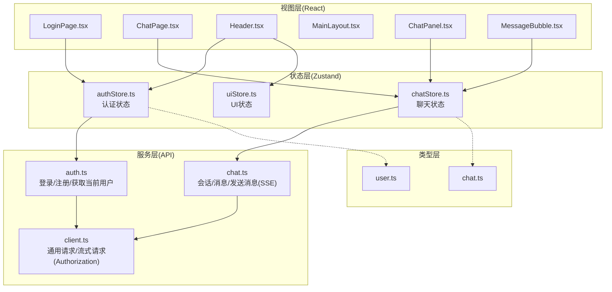
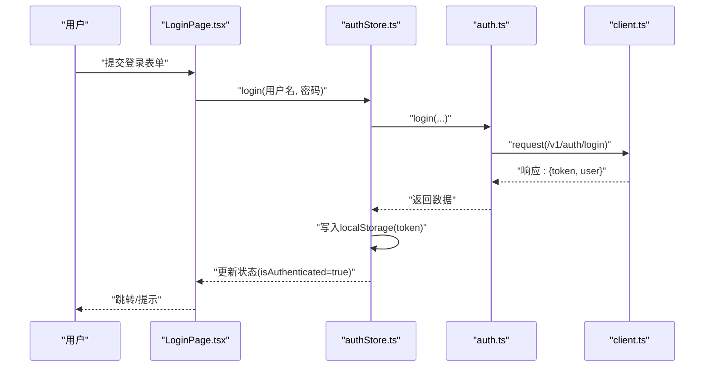
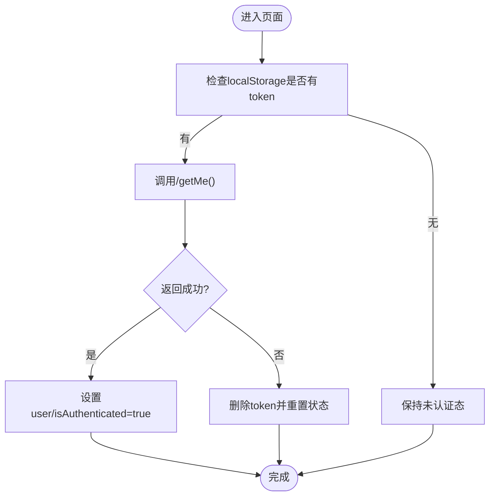
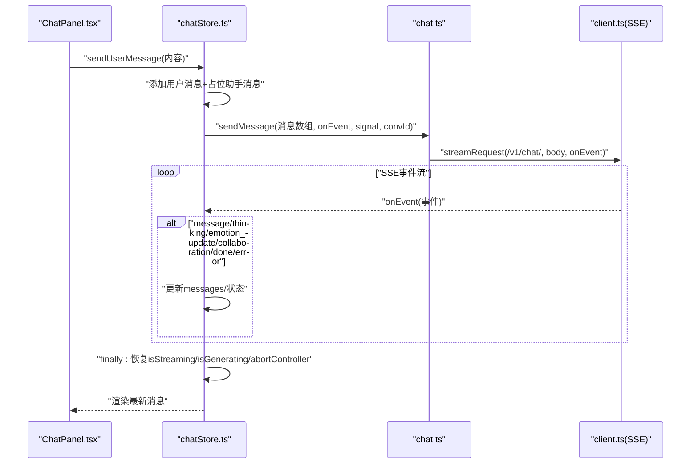
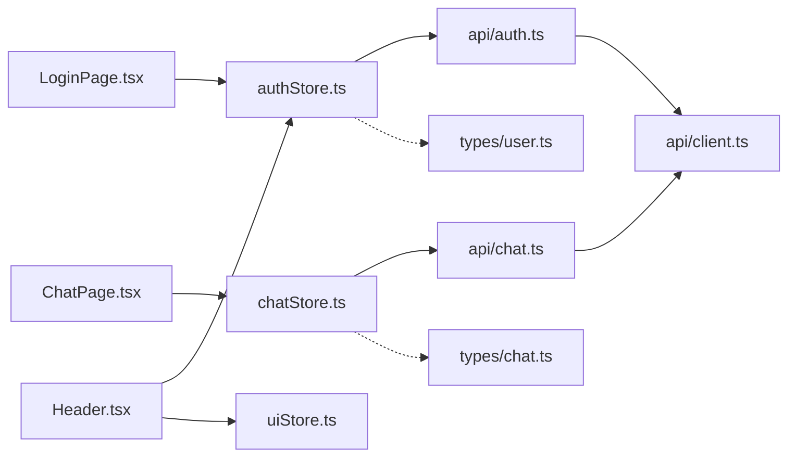

# 前端状态管理

<cite>
**本文引用的文件**
- [frontend/src/stores/authStore.ts](file://frontend/src/stores/authStore.ts)
- [frontend/src/stores/chatStore.ts](file://frontend/src/stores/chatStore.ts)
- [frontend/src/stores/uiStore.ts](file://frontend/src/stores/uiStore.ts)
- [frontend/src/api/auth.ts](file://frontend/src/api/auth.ts)
- [frontend/src/api/chat.ts](file://frontend/src/api/chat.ts)
- [frontend/src/api/client.ts](file://frontend/src/api/client.ts)
- [frontend/src/types/user.ts](file://frontend/src/types/user.ts)
- [frontend/src/types/chat.ts](file://frontend/src/types/chat.ts)
- [frontend/src/pages/LoginPage.tsx](file://frontend/src/pages/LoginPage.tsx)
- [frontend/src/pages/ChatPage.tsx](file://frontend/src/pages/ChatPage.tsx)
- [frontend/src/components/layout/Header.tsx](file://frontend/src/components/layout/Header.tsx)
- [frontend/src/components/layout/MainLayout.tsx](file://frontend/src/components/layout/MainLayout.tsx)
- [frontend/src/components/chat/ChatPanel.tsx](file://frontend/src/components/chat/ChatPanel.tsx)
- [frontend/src/components/chat/MessageBubble.tsx](file://frontend/src/components/chat/MessageBubble.tsx)
- [frontend/package.json](file://frontend/package.json)
</cite>

## 目录
1. [引言](#引言)
2. [项目结构](#项目结构)
3. [核心组件](#核心组件)
4. [架构总览](#架构总览)
5. [详细组件分析](#详细组件分析)
6. [依赖关系分析](#依赖关系分析)
7. [性能考量](#性能考量)
8. [故障排查指南](#故障排查指南)
9. [结论](#结论)
10. [附录](#附录)

## 引言
本文件面向XuanJi前端的状态管理，系统性阐述Zustand在项目中的使用模式与设计思想，并围绕三大主题展开：认证状态管理（登录、令牌、权限）、聊天状态管理（消息历史、实时流式对话、工具执行与协作）、UI状态管理（侧边栏、界面切换）。同时覆盖状态持久化策略、状态同步机制、TypeScript类型设计与最佳实践，并通过序列图与流程图直观展示关键交互。

## 项目结构
前端采用Zustand进行轻量、函数式状态管理，配合TypeScript类型约束与自研API客户端，形成“组件-状态-服务”清晰分层：
- stores：Zustand状态仓库（认证、聊天、UI）
- api：统一请求封装（含SSE流式解析）
- types：共享类型定义
- components：基于状态的UI组件
- pages：页面级生命周期与初始化逻辑

图表来源
- [frontend/src/stores/authStore.ts:1-53](file://frontend/src/stores/authStore.ts#L1-L53)
- [frontend/src/stores/chatStore.ts:1-291](file://frontend/src/stores/chatStore.ts#L1-L291)
- [frontend/src/stores/uiStore.ts:1-12](file://frontend/src/stores/uiStore.ts#L1-L12)
- [frontend/src/api/auth.ts:1-21](file://frontend/src/api/auth.ts#L1-L21)
- [frontend/src/api/chat.ts:1-49](file://frontend/src/api/chat.ts#L1-L49)
- [frontend/src/api/client.ts:1-119](file://frontend/src/api/client.ts#L1-L119)
- [frontend/src/types/user.ts:1-18](file://frontend/src/types/user.ts#L1-L18)
- [frontend/src/types/chat.ts:1-47](file://frontend/src/types/chat.ts#L1-L47)
- [frontend/src/pages/LoginPage.tsx:1-369](file://frontend/src/pages/LoginPage.tsx#L1-L369)
- [frontend/src/pages/ChatPage.tsx:1-17](file://frontend/src/pages/ChatPage.tsx#L1-L17)
- [frontend/src/components/layout/Header.tsx:1-31](file://frontend/src/components/layout/Header.tsx#L1-L31)
- [frontend/src/components/layout/MainLayout.tsx:1-19](file://frontend/src/components/layout/MainLayout.tsx#L1-L19)
- [frontend/src/components/chat/ChatPanel.tsx:1-67](file://frontend/src/components/chat/ChatPanel.tsx#L1-L67)
- [frontend/src/components/chat/MessageBubble.tsx:1-282](file://frontend/src/components/chat/MessageBubble.tsx#L1-L282)

章节来源
- [frontend/src/stores/authStore.ts:1-53](file://frontend/src/stores/authStore.ts#L1-L53)
- [frontend/src/stores/chatStore.ts:1-291](file://frontend/src/stores/chatStore.ts#L1-L291)
- [frontend/src/stores/uiStore.ts:1-12](file://frontend/src/stores/uiStore.ts#L1-L12)
- [frontend/src/api/auth.ts:1-21](file://frontend/src/api/auth.ts#L1-L21)
- [frontend/src/api/chat.ts:1-49](file://frontend/src/api/chat.ts#L1-L49)
- [frontend/src/api/client.ts:1-119](file://frontend/src/api/client.ts#L1-L119)
- [frontend/src/types/user.ts:1-18](file://frontend/src/types/user.ts#L1-L18)
- [frontend/src/types/chat.ts:1-47](file://frontend/src/types/chat.ts#L1-L47)
- [frontend/src/pages/LoginPage.tsx:1-369](file://frontend/src/pages/LoginPage.tsx#L1-L369)
- [frontend/src/pages/ChatPage.tsx:1-17](file://frontend/src/pages/ChatPage.tsx#L1-L17)
- [frontend/src/components/layout/Header.tsx:1-31](file://frontend/src/components/layout/Header.tsx#L1-L31)
- [frontend/src/components/layout/MainLayout.tsx:1-19](file://frontend/src/components/layout/MainLayout.tsx#L1-L19)
- [frontend/src/components/chat/ChatPanel.tsx:1-67](file://frontend/src/components/chat/ChatPanel.tsx#L1-L67)
- [frontend/src/components/chat/MessageBubble.tsx:1-282](file://frontend/src/components/chat/MessageBubble.tsx#L1-L282)

## 核心组件
- 认证状态仓库（authStore）
  - 状态：用户、令牌、是否已认证
  - 动作：登录、注册、登出、加载当前用户
  - 持久化：localStorage存储token，刷新后恢复认证态
- 聊天状态仓库（chatStore）
  - 状态：消息列表、流式/生成状态、代理状态、情绪快照、协作开关、当前会话/流ID、中止控制器
  - 动作：添加消息、清空消息、发送消息（SSE流式）、取消流、加载会话、加载协作开关
  - 同步：SSE事件类型驱动状态更新；conversation_id校验避免跨会话串话
- UI状态仓库（uiStore）
  - 状态：侧边栏开关
  - 动作：切换侧边栏

章节来源
- [frontend/src/stores/authStore.ts:5-13](file://frontend/src/stores/authStore.ts#L5-L13)
- [frontend/src/stores/chatStore.ts:6-23](file://frontend/src/stores/chatStore.ts#L6-L23)
- [frontend/src/stores/uiStore.ts:3-6](file://frontend/src/stores/uiStore.ts#L3-L6)

## 架构总览
Zustand以“原子化状态+动作函数”的方式组织，避免样板代码与深层嵌套。API层通过client.ts统一封装fetch与SSE，store通过API层与后端交互。组件通过useXxxStore订阅状态，实现最小化渲染与高内聚逻辑。

图表来源
- [frontend/src/pages/LoginPage.tsx:162-205](file://frontend/src/pages/LoginPage.tsx#L162-L205)
- [frontend/src/stores/authStore.ts:20-34](file://frontend/src/stores/authStore.ts#L20-L34)
- [frontend/src/api/auth.ts:4-9](file://frontend/src/api/auth.ts#L4-L9)
- [frontend/src/api/client.ts:20-44](file://frontend/src/api/client.ts#L20-L44)

## 详细组件分析

### 认证状态管理（登录、令牌、权限）
- 设计理念
  - 将用户信息、令牌与认证态解耦，便于在路由守卫或组件中按需读取
  - 令牌持久化于localStorage，刷新后自动尝试加载当前用户
- 关键流程
  - 登录/注册：调用API，成功后写入token并更新状态
  - 加载当前用户：无token时清理本地状态；有token时调用/me并更新认证态
  - 权限控制：Header等组件通过useAuthStore选择性渲染
- 类型与安全
  - User、LoginRequest、RegisterRequest在types/user.ts中定义
  - client.ts在请求头注入Authorization，确保受保护接口访问

图表来源
- [frontend/src/stores/authStore.ts:41-51](file://frontend/src/stores/authStore.ts#L41-L51)
- [frontend/src/api/auth.ts:18-20](file://frontend/src/api/auth.ts#L18-L20)
- [frontend/src/api/client.ts:16-31](file://frontend/src/api/client.ts#L16-L31)

章节来源
- [frontend/src/stores/authStore.ts:1-53](file://frontend/src/stores/authStore.ts#L1-L53)
- [frontend/src/api/auth.ts:1-21](file://frontend/src/api/auth.ts#L1-L21)
- [frontend/src/api/client.ts:1-119](file://frontend/src/api/client.ts#L1-L119)
- [frontend/src/types/user.ts:1-18](file://frontend/src/types/user.ts#L1-L18)
- [frontend/src/components/layout/Header.tsx:5-28](file://frontend/src/components/layout/Header.tsx#L5-L28)

### 聊天状态管理（消息历史、实时对话、工具执行与协作）
- 设计理念
  - 将消息、流式状态、代理状态、协作与情绪快照聚合在一个store，便于UI联动
  - 使用SSE事件驱动状态更新，支持“思考”“消息”“情绪更新”“协作”“完成/错误”等多类型
- 关键流程
  - 发送消息：构建占位消息，启动流式，接收事件增量更新，最终收尾
  - 加载会话：拉取最近消息，解析metadata_json中的工具执行与协作信息
  - 协作展示：MessageBubble根据配置决定是否渲染横向协作面板
- 安全与一致性
  - conversation_id校验：防止切换会话时旧事件污染新会话
  - 中止控制器：支持取消流，保证UI与状态一致
  - 容错：异常捕获与finally兜底，确保状态恢复

图表来源
- [frontend/src/components/chat/ChatPanel.tsx:8-16](file://frontend/src/components/chat/ChatPanel.tsx#L8-L16)
- [frontend/src/stores/chatStore.ts:116-289](file://frontend/src/stores/chatStore.ts#L116-L289)
- [frontend/src/api/chat.ts:35-48](file://frontend/src/api/chat.ts#L35-L48)
- [frontend/src/api/client.ts:46-119](file://frontend/src/api/client.ts#L46-L119)

章节来源
- [frontend/src/stores/chatStore.ts:1-291](file://frontend/src/stores/chatStore.ts#L1-L291)
- [frontend/src/api/chat.ts:1-49](file://frontend/src/api/chat.ts#L1-L49)
- [frontend/src/api/client.ts:1-119](file://frontend/src/api/client.ts#L1-L119)
- [frontend/src/types/chat.ts:1-47](file://frontend/src/types/chat.ts#L1-L47)
- [frontend/src/components/chat/ChatPanel.tsx:1-67](file://frontend/src/components/chat/ChatPanel.tsx#L1-L67)
- [frontend/src/components/chat/MessageBubble.tsx:1-282](file://frontend/src/components/chat/MessageBubble.tsx#L1-L282)

### UI状态管理（侧边栏、界面切换、加载与错误）
- 设计理念
  - UI状态独立于业务状态，降低耦合
  - Header通过useUIStore控制侧边栏开关，MainLayout承载布局
- 典型场景
  - 登录页：页面级提示与表单动画，结合toast提示
  - 聊天页：进入即加载最近会话与协作偏好

章节来源
- [frontend/src/stores/uiStore.ts:1-12](file://frontend/src/stores/uiStore.ts#L1-L12)
- [frontend/src/components/layout/Header.tsx:1-31](file://frontend/src/components/layout/Header.tsx#L1-L31)
- [frontend/src/components/layout/MainLayout.tsx:1-19](file://frontend/src/components/layout/MainLayout.tsx#L1-L19)
- [frontend/src/pages/LoginPage.tsx:1-369](file://frontend/src/pages/LoginPage.tsx#L1-L369)
- [frontend/src/pages/ChatPage.tsx:1-17](file://frontend/src/pages/ChatPage.tsx#L1-L17)

## 依赖关系分析
- 组件依赖
  - LoginPage依赖authStore与toast；ChatPage依赖chatStore；Header依赖authStore与uiStore
- 状态依赖
  - chatStore依赖chat.ts与client.ts；authStore依赖auth.ts与client.ts
- 类型依赖
  - user.ts与chat.ts作为共享类型，贯穿API与Store

图表来源
- [frontend/src/pages/LoginPage.tsx:1-369](file://frontend/src/pages/LoginPage.tsx#L1-L369)
- [frontend/src/pages/ChatPage.tsx:1-17](file://frontend/src/pages/ChatPage.tsx#L1-L17)
- [frontend/src/components/layout/Header.tsx:1-31](file://frontend/src/components/layout/Header.tsx#L1-L31)
- [frontend/src/stores/authStore.ts:1-53](file://frontend/src/stores/authStore.ts#L1-L53)
- [frontend/src/stores/chatStore.ts:1-291](file://frontend/src/stores/chatStore.ts#L1-L291)
- [frontend/src/stores/uiStore.ts:1-12](file://frontend/src/stores/uiStore.ts#L1-L12)
- [frontend/src/api/auth.ts:1-21](file://frontend/src/api/auth.ts#L1-L21)
- [frontend/src/api/chat.ts:1-49](file://frontend/src/api/chat.ts#L1-L49)
- [frontend/src/api/client.ts:1-119](file://frontend/src/api/client.ts#L1-L119)
- [frontend/src/types/user.ts:1-18](file://frontend/src/types/user.ts#L1-L18)
- [frontend/src/types/chat.ts:1-47](file://frontend/src/types/chat.ts#L1-L47)

章节来源
- [frontend/src/pages/LoginPage.tsx:1-369](file://frontend/src/pages/LoginPage.tsx#L1-L369)
- [frontend/src/pages/ChatPage.tsx:1-17](file://frontend/src/pages/ChatPage.tsx#L1-L17)
- [frontend/src/components/layout/Header.tsx:1-31](file://frontend/src/components/layout/Header.tsx#L1-L31)
- [frontend/src/stores/authStore.ts:1-53](file://frontend/src/stores/authStore.ts#L1-L53)
- [frontend/src/stores/chatStore.ts:1-291](file://frontend/src/stores/chatStore.ts#L1-L291)
- [frontend/src/stores/uiStore.ts:1-12](file://frontend/src/stores/uiStore.ts#L1-L12)
- [frontend/src/api/auth.ts:1-21](file://frontend/src/api/auth.ts#L1-L21)
- [frontend/src/api/chat.ts:1-49](file://frontend/src/api/chat.ts#L1-L49)
- [frontend/src/api/client.ts:1-119](file://frontend/src/api/client.ts#L1-L119)
- [frontend/src/types/user.ts:1-18](file://frontend/src/types/user.ts#L1-L18)
- [frontend/src/types/chat.ts:1-47](file://frontend/src/types/chat.ts#L1-L47)

## 性能考量
- 状态粒度
  - 将消息、流式状态、代理状态、协作与情绪快照聚合，减少订阅拆分带来的重复渲染
- 渲染优化
  - ChatPanel对消息列表使用稳定key与日期分隔符，MessageBubble对长文本与协作面板做条件渲染
- 流式处理
  - SSE事件按行解析，避免一次性拼接大字符串；对首个message文本块后才标记“正在生成”，提升感知
- 资源释放
  - 中止控制器与finally兜底，防止流结束未恢复导致UI卡死

## 故障排查指南
- 登录/注册失败
  - 检查ApiError抛出与提示；确认VITE_API_BASE_URL配置；查看Network面板SSE连接
- 无法加载会话
  - 确认getRecentMessages返回格式；检查conversation_id是否为空
- 流式对话卡住
  - 检查conversation_id匹配；查看console日志；确认finally块是否执行
- 令牌失效
  - authStore.loadUser失败会清除token并重置状态；确认后端鉴权头是否正确

章节来源
- [frontend/src/api/client.ts:5-14](file://frontend/src/api/client.ts#L5-L14)
- [frontend/src/stores/authStore.ts:41-51](file://frontend/src/stores/authStore.ts#L41-L51)
- [frontend/src/stores/chatStore.ts:144-289](file://frontend/src/stores/chatStore.ts#L144-L289)
- [frontend/src/api/chat.ts:20-33](file://frontend/src/api/chat.ts#L20-L33)

## 结论
本项目以Zustand为核心，构建了简洁、可维护且高性能的状态管理方案。通过明确的类型定义、严格的SSE事件处理与完善的容错机制，实现了从认证到聊天再到UI的全链路状态治理。建议后续在大型功能模块引入更细粒度的store拆分与selector优化，以进一步降低订阅成本。

## 附录
- TypeScript类型设计要点
  - 将角色限定为字面量联合类型，增强编译期安全
  - 对可选字段（如metadata_json、collaboration）采用Partial扩展，避免强约束
  - SSE事件类型严格枚举，便于switch/分支处理
- 最佳实践
  - 在store中集中处理副作用（如SSE、localStorage），组件只负责渲染与调度
  - 使用selector精确订阅，避免无关重渲染
  - 对外暴露动作函数而非直接set，便于埋点与调试

章节来源
- [frontend/src/types/chat.ts:1-47](file://frontend/src/types/chat.ts#L1-L47)
- [frontend/src/types/user.ts:1-18](file://frontend/src/types/user.ts#L1-L18)
- [frontend/src/stores/chatStore.ts:1-291](file://frontend/src/stores/chatStore.ts#L1-L291)
- [frontend/src/stores/authStore.ts:1-53](file://frontend/src/stores/authStore.ts#L1-L53)
- [frontend/src/stores/uiStore.ts:1-12](file://frontend/src/stores/uiStore.ts#L1-L12)
- [frontend/package.json:12-21](file://frontend/package.json#L12-L21)