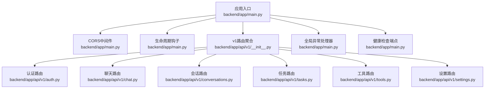
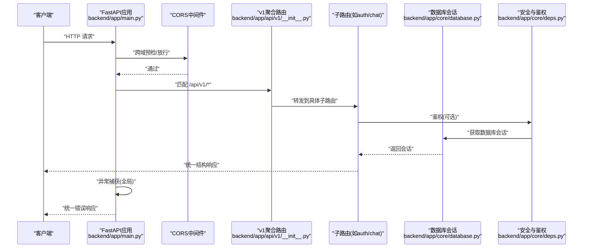
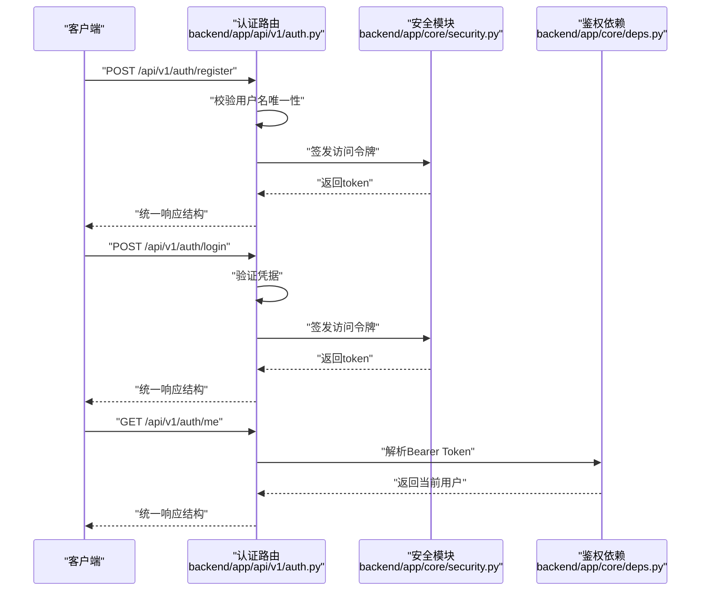
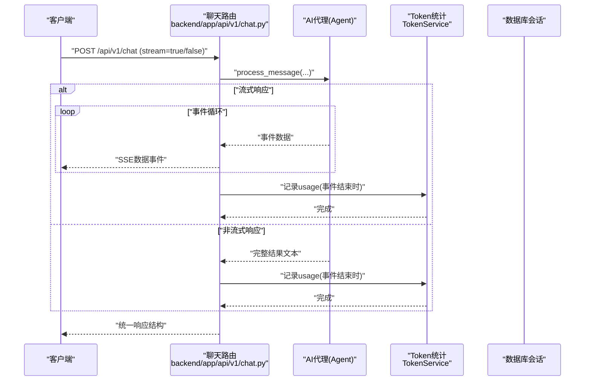
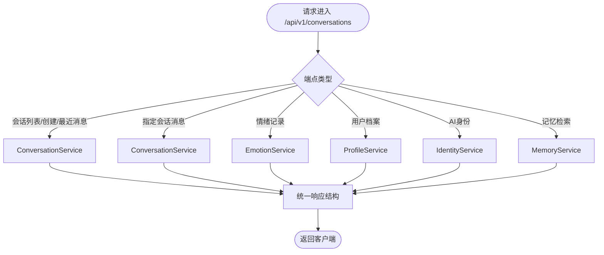
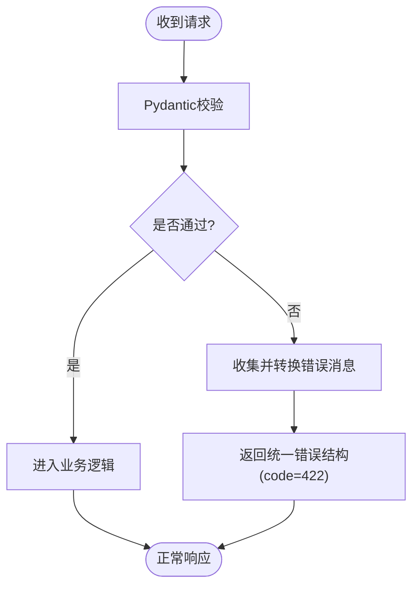
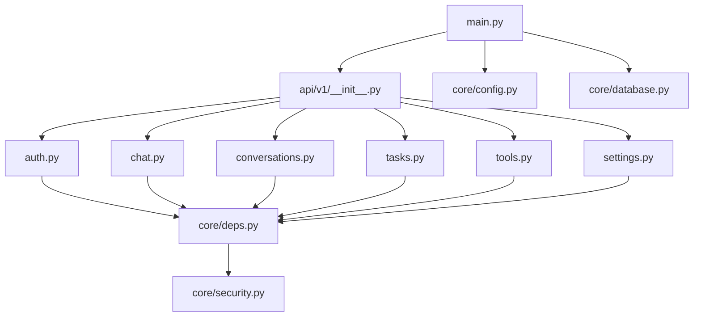

# 后端API设计

<cite>
**本文引用的文件**
- [backend/app/main.py](file://backend/app/main.py)
- [backend/app/api/v1/__init__.py](file://backend/app/api/v1/__init__.py)
- [backend/app/api/v1/auth.py](file://backend/app/api/v1/auth.py)
- [backend/app/api/v1/chat.py](file://backend/app/api/v1/chat.py)
- [backend/app/api/v1/conversations.py](file://backend/app/api/v1/conversations.py)
- [backend/app/api/v1/tasks.py](file://backend/app/api/v1/tasks.py)
- [backend/app/api/v1/tools.py](file://backend/app/api/v1/tools.py)
- [backend/app/api/v1/settings.py](file://backend/app/api/v1/settings.py)
- [backend/app/core/config.py](file://backend/app/core/config.py)
- [backend/app/core/security.py](file://backend/app/core/security.py)
- [backend/app/core/deps.py](file://backend/app/core/deps.py)
- [backend/app/core/database.py](file://backend/app/core/database.py)
- [backend/app/core/exceptions.py](file://backend/app/core/exceptions.py)
- [backend/app/schemas/common.py](file://backend/app/schemas/common.py)
- [backend/app/schemas/chat.py](file://backend/app/schemas/chat.py)
</cite>

## 目录
1. [简介](#简介)
2. [项目结构](#项目结构)
3. [核心组件](#核心组件)
4. [架构总览](#架构总览)
5. [详细组件分析](#详细组件分析)
6. [依赖分析](#依赖分析)
7. [性能考虑](#性能考虑)
8. [故障排查指南](#故障排查指南)
9. [结论](#结论)
10. [附录](#附录)

## 简介
本文件面向XuanJi后端API设计，围绕FastAPI框架的路由组织、版本管理、CORS跨域、异常处理、健康检查以及RESTful设计规范进行系统化说明。重点覆盖以下方面：
- API版本管理与路由前缀：统一在VERSION 1.0下通过“/api/v1”前缀组织各业务模块路由。
- 路由模块化设计：按功能域拆分到auth、chat、conversations、tasks、tools、settings等子路由，并在v1聚合。
- CORS跨域配置：基于配置项动态注入允许的源、方法与头部。
- 异常处理机制：将Pydantic验证错误转换为中文友好提示，并统一返回结构。
- 健康检查端点：提供轻量级可用性检测接口。
- RESTful最佳实践：统一响应结构、状态码与错误码规范、请求/响应模式。

## 项目结构
后端采用FastAPI应用入口集中注册中间件与路由，v1版本路由通过APIRouter聚合，各业务模块独立定义，形成清晰的层次化结构。

图表来源
- [backend/app/main.py:30-64](file://backend/app/main.py#L30-L64)
- [backend/app/api/v1/__init__.py:13-22](file://backend/app/api/v1/__init__.py#L13-L22)

章节来源
- [backend/app/main.py:30-64](file://backend/app/main.py#L30-L64)
- [backend/app/api/v1/__init__.py:13-22](file://backend/app/api/v1/__init__.py#L13-L22)

## 核心组件
- 应用实例与生命周期
  - 使用FastAPI实例并配置标题、版本号与生命周期钩子，启动数据库初始化与定时任务调度器。
  - 参考路径：[backend/app/main.py:15-27](file://backend/app/main.py#L15-L27)
- 中间件与CORS
  - 注入CORSMiddleware，允许凭据、所有方法与头部，源来自配置项。
  - 参考路径：[backend/app/main.py:32-38](file://backend/app/main.py#L32-L38)，[backend/app/core/config.py:42](file://backend/app/core/config.py#L42)
- 路由前缀与版本管理
  - 将v1聚合路由挂载至“/api/v1”，实现API版本隔离与演进。
  - 参考路径：[backend/app/main.py:40](file://backend/app/main.py#L40)，[backend/app/api/v1/__init__.py:13-22](file://backend/app/api/v1/__init__.py#L13-L22)
- 统一异常处理
  - 对Pydantic校验错误进行中文提示转换，统一返回code、message、data结构。
  - 参考路径：[backend/app/main.py:43-59](file://backend/app/main.py#L43-L59)
- 健康检查端点
  - 提供GET /health，返回服务健康状态。
  - 参考路径：[backend/app/main.py:62-64](file://backend/app/main.py#L62-L64)

章节来源
- [backend/app/main.py:30-64](file://backend/app/main.py#L30-L64)
- [backend/app/core/config.py:42](file://backend/app/core/config.py#L42)
- [backend/app/api/v1/__init__.py:13-22](file://backend/app/api/v1/__init__.py#L13-L22)
- [backend/app/main.py:43-59](file://backend/app/main.py#L43-L59)
- [backend/app/main.py:62-64](file://backend/app/main.py#L62-L64)

## 架构总览
下图展示了从客户端到具体业务路由的调用链路，以及中间件与异常处理的介入位置。

图表来源
- [backend/app/main.py:32-40](file://backend/app/main.py#L32-L40)
- [backend/app/api/v1/__init__.py:13-22](file://backend/app/api/v1/__init__.py#L13-L22)
- [backend/app/core/deps.py:12-41](file://backend/app/core/deps.py#L12-L41)
- [backend/app/core/database.py:14-19](file://backend/app/core/database.py#L14-L19)

## 详细组件分析

### 认证模块（/api/v1/auth）
- 功能要点
  - 用户注册：校验重复用户名，创建用户并签发访问令牌。
  - 用户登录：验证凭据，签发访问令牌。
  - 获取当前用户：基于Bearer Token解析用户信息。
- 统一响应结构
  - 所有接口均返回统一结构，包含code、message、data字段。
- 关键实现参考
  - 路由定义与端点：[backend/app/api/v1/auth.py:11-60](file://backend/app/api/v1/auth.py#L11-L60)
  - 安全与令牌：[backend/app/core/security.py:24-30](file://backend/app/core/security.py#L24-L30)
  - 鉴权依赖：[backend/app/core/deps.py:12-41](file://backend/app/core/deps.py#L12-L41)

图表来源
- [backend/app/api/v1/auth.py:14-60](file://backend/app/api/v1/auth.py#L14-L60)
- [backend/app/core/security.py:24-30](file://backend/app/core/security.py#L24-L30)
- [backend/app/core/deps.py:12-41](file://backend/app/core/deps.py#L12-L41)

章节来源
- [backend/app/api/v1/auth.py:11-60](file://backend/app/api/v1/auth.py#L11-L60)
- [backend/app/core/security.py:24-30](file://backend/app/core/security.py#L24-L30)
- [backend/app/core/deps.py:12-41](file://backend/app/core/deps.py#L12-L41)

### 聊天模块（/api/v1/chat）
- 功能要点
  - 支持流式与非流式两种响应模式，使用Server-Sent Events进行流式输出。
  - 在流式场景中，断开连接时优雅中断；异常时返回错误事件。
  - 记录Token用量，支持多段usage合并统计。
- 统一响应结构
  - 非流式：返回最终内容；流式：以SSE推送事件。
- 关键实现参考
  - 路由定义与端点：[backend/app/api/v1/chat.py:19-105](file://backend/app/api/v1/chat.py#L19-L105)
  - 请求模型：[backend/app/schemas/chat.py:9-14](file://backend/app/schemas/chat.py#L9-L14)
  - Token记录辅助函数：[backend/app/api/v1/chat.py:22-37](file://backend/app/api/v1/chat.py#L22-L37)

图表来源
- [backend/app/api/v1/chat.py:40-105](file://backend/app/api/v1/chat.py#L40-L105)
- [backend/app/schemas/chat.py:9-14](file://backend/app/schemas/chat.py#L9-L14)

章节来源
- [backend/app/api/v1/chat.py:19-105](file://backend/app/api/v1/chat.py#L19-L105)
- [backend/app/schemas/chat.py:9-14](file://backend/app/schemas/chat.py#L9-L14)
- [backend/app/api/v1/chat.py:22-37](file://backend/app/api/v1/chat.py#L22-L37)

### 会话模块（/api/v1/conversations）
- 功能要点
  - 会话列表、创建、最近消息查询、指定会话消息分页读取。
  - 情绪记录：最新与历史记录查询。
  - 用户档案：获取或创建。
  - AI身份：枚举、查询、更新（手动演进）。
  - 记忆检索：按关键词或默认排序返回摘要列表。
- 统一响应结构
  - 多数端点返回统一结构；部分端点直接返回模型序列化结果。
- 关键实现参考
  - 路由定义与端点：[backend/app/api/v1/conversations.py:17-186](file://backend/app/api/v1/conversations.py#L17-L186)

图表来源
- [backend/app/api/v1/conversations.py:22-186](file://backend/app/api/v1/conversations.py#L22-L186)

章节来源
- [backend/app/api/v1/conversations.py:17-186](file://backend/app/api/v1/conversations.py#L17-L186)

### 任务模块（/api/v1/tasks）
- 功能要点
  - 列表与详情查询，按用户过滤与时间排序。
- 统一响应结构
  - 返回统一结构，data为序列化后的任务对象。
- 关键实现参考
  - 路由定义与端点：[backend/app/api/v1/tasks.py:10-49](file://backend/app/api/v1/tasks.py#L10-L49)

章节来源
- [backend/app/api/v1/tasks.py:10-49](file://backend/app/api/v1/tasks.py#L10-L49)

### 工具模块（/api/v1/tools）
- 功能要点
  - 工具列表、创建、搜索、导出、导入。
  - 参数化端点：查询、更新、删除、版本查询与回滚。
- 统一响应结构
  - 返回统一结构，部分端点返回批量brief或版本列表。
- 关键实现参考
  - 路由定义与端点：[backend/app/api/v1/tools.py:19-168](file://backend/app/api/v1/tools.py#L19-L168)

章节来源
- [backend/app/api/v1/tools.py:19-168](file://backend/app/api/v1/tools.py#L19-L168)

### 设置模块（/api/v1/settings）
- 功能要点
  - 获取与更新用户设置；查询Token用量汇总。
- 统一响应结构
  - 返回统一结构，data为设置或用量摘要。
- 关键实现参考
  - 路由定义与端点：[backend/app/api/v1/settings.py:11-54](file://backend/app/api/v1/settings.py#L11-L54)

章节来源
- [backend/app/api/v1/settings.py:11-54](file://backend/app/api/v1/settings.py#L11-L54)

### CORS跨域资源共享配置
- 配置来源
  - 允许源：来自配置项cors_origins，默认值指向前端开发地址。
  - 允许方法与头部：通配符“*”，允许凭据。
- 实现位置
  - 在应用入口添加CORSMiddleware并注入配置。
- 关键实现参考
  - CORS配置：[backend/app/main.py:32-38](file://backend/app/main.py#L32-L38)
  - 配置项定义：[backend/app/core/config.py:42](file://backend/app/core/config.py#L42)

章节来源
- [backend/app/main.py:32-38](file://backend/app/main.py#L32-L38)
- [backend/app/core/config.py:42](file://backend/app/core/config.py#L42)

### 异常处理机制（Pydantic验证错误转中文）
- 处理逻辑
  - 捕获RequestValidationError，遍历错误列表提取消息。
  - 若消息以特定前缀开头则去除前缀，拼接为中文提示。
  - 统一返回code=422、message为中文提示、data=None。
- 关键实现参考
  - 全局异常处理器：[backend/app/main.py:43-59](file://backend/app/main.py#L43-L59)

图表来源
- [backend/app/main.py:43-59](file://backend/app/main.py#L43-L59)

章节来源
- [backend/app/main.py:43-59](file://backend/app/main.py#L43-L59)

### 健康检查端点
- 设计与实现
  - GET /health，返回服务健康状态，遵循统一响应结构。
- 关键实现参考
  - 健康检查端点：[backend/app/main.py:62-64](file://backend/app/main.py#L62-L64)

章节来源
- [backend/app/main.py:62-64](file://backend/app/main.py#L62-L64)

### RESTful API设计最佳实践
- 统一响应结构
  - 所有成功响应包含code、message、data字段；错误响应保持一致结构。
  - 参考通用响应模型：[backend/app/schemas/common.py:8-11](file://backend/app/schemas/common.py#L8-L11)
- 错误码规范
  - 验证失败：422（由全局异常处理器统一返回）。
  - 未授权：401（由鉴权依赖统一返回）。
  - 资源不存在：404（由各业务路由根据场景返回）。
- 请求/响应模式
  - 使用Pydantic模型定义请求体，确保类型安全与自动文档生成。
  - 示例请求模型：[backend/app/schemas/chat.py:9-14](file://backend/app/schemas/chat.py#L9-L14)
- 版本管理
  - 所有路由置于/api/v1前缀下，便于未来版本演进与兼容性控制。
  - 参考聚合路由：[backend/app/api/v1/__init__.py:13-22](file://backend/app/api/v1/__init__.py#L13-L22)

章节来源
- [backend/app/schemas/common.py:8-11](file://backend/app/schemas/common.py#L8-L11)
- [backend/app/schemas/chat.py:9-14](file://backend/app/schemas/chat.py#L9-L14)
- [backend/app/api/v1/__init__.py:13-22](file://backend/app/api/v1/__init__.py#L13-L22)

## 依赖分析
- 应用层依赖
  - main.py依赖v1聚合路由、CORS配置、数据库初始化与定时任务。
  - v1聚合路由依赖各子模块路由。
- 安全与鉴权
  - 各路由依赖get_current_user依赖HTTP Bearer解码与数据库查询。
- 数据库
  - 通过get_db提供Session，支持自动建表与列增量迁移。

图表来源
- [backend/app/main.py:10-12](file://backend/app/main.py#L10-L12)
- [backend/app/api/v1/__init__.py:3-11](file://backend/app/api/v1/__init__.py#L3-L11)
- [backend/app/core/deps.py:12-41](file://backend/app/core/deps.py#L12-L41)
- [backend/app/core/security.py:24-30](file://backend/app/core/security.py#L24-L30)
- [backend/app/core/database.py:6-19](file://backend/app/core/database.py#L6-L19)
- [backend/app/core/config.py:42](file://backend/app/core/config.py#L42)

章节来源
- [backend/app/main.py:10-12](file://backend/app/main.py#L10-L12)
- [backend/app/api/v1/__init__.py:3-11](file://backend/app/api/v1/__init__.py#L3-L11)
- [backend/app/core/deps.py:12-41](file://backend/app/core/deps.py#L12-L41)
- [backend/app/core/security.py:24-30](file://backend/app/core/security.py#L24-L30)
- [backend/app/core/database.py:6-19](file://backend/app/core/database.py#L6-L19)
- [backend/app/core/config.py:42](file://backend/app/core/config.py#L42)

## 性能考虑
- SSE流式响应
  - 在聊天模块中，使用StreamingResponse进行事件推送，注意客户端断连检测与异常兜底，避免资源泄露。
  - 参考路径：[backend/app/api/v1/chat.py:62-87](file://backend/app/api/v1/chat.py#L62-L87)
- 数据库连接池与会话
  - 使用SQLAlchemy会话工厂，确保每次请求正确释放连接。
  - 参考路径：[backend/app/core/database.py:6-19](file://backend/app/core/database.py#L6-L19)
- 自动迁移与建表
  - 初始化阶段自动创建数据库与表，并对缺失列进行增量添加，降低部署成本。
  - 参考路径：[backend/app/core/database.py:22-42](file://backend/app/core/database.py#L22-L42)

## 故障排查指南
- 验证错误（422）
  - 现象：请求参数不符合Pydantic模型约束。
  - 处理：全局异常处理器已将错误转换为中文提示并返回统一结构。
  - 参考路径：[backend/app/main.py:43-59](file://backend/app/main.py#L43-L59)
- 未授权（401）
  - 现象：Bearer Token无效、过期或用户不存在。
  - 处理：鉴权依赖会抛出401错误，需检查Token签名算法与密钥配置。
  - 参考路径：[backend/app/core/deps.py:12-41](file://backend/app/core/deps.py#L12-L41)，[backend/app/core/security.py:33-37](file://backend/app/core/security.py#L33-L37)
- 资源不存在（404）
  - 现象：请求的资源在数据库中不存在。
  - 处理：各业务路由按需抛出404，建议前端提示“资源不存在”。
  - 参考路径：[backend/app/api/v1/tasks.py:43-44](file://backend/app/api/v1/tasks.py#L43-L44)，[backend/app/api/v1/tools.py:103-105](file://backend/app/api/v1/tools.py#L103-L105)
- CORS问题
  - 现象：浏览器跨域请求被拒绝。
  - 处理：确认前端开发地址已在cors_origins中，且允许凭据。
  - 参考路径：[backend/app/core/config.py:42](file://backend/app/core/config.py#L42)，[backend/app/main.py:32-38](file://backend/app/main.py#L32-L38)
- 健康检查
  - 现象：服务不可用。
  - 处理：调用GET /health确认服务状态。
  - 参考路径：[backend/app/main.py:62-64](file://backend/app/main.py#L62-L64)

章节来源
- [backend/app/main.py:43-59](file://backend/app/main.py#L43-L59)
- [backend/app/core/deps.py:12-41](file://backend/app/core/deps.py#L12-L41)
- [backend/app/core/security.py:33-37](file://backend/app/core/security.py#L33-L37)
- [backend/app/api/v1/tasks.py:43-44](file://backend/app/api/v1/tasks.py#L43-L44)
- [backend/app/api/v1/tools.py:103-105](file://backend/app/api/v1/tools.py#L103-L105)
- [backend/app/core/config.py:42](file://backend/app/core/config.py#L42)
- [backend/app/main.py:32-38](file://backend/app/main.py#L32-L38)
- [backend/app/main.py:62-64](file://backend/app/main.py#L62-L64)

## 结论
XuanJi后端API以FastAPI为核心，采用VERSION 1.0的统一前缀“/api/v1”组织路由，结合CORS中间件与全局异常处理，实现了跨域与错误的一致性体验。通过模块化的子路由划分与统一响应结构，满足了认证、聊天、会话、任务、工具、设置等核心业务需求。建议后续在生产环境完善日志、限流与更细粒度的错误码体系，持续提升稳定性与可观测性。

## 附录
- 代码示例路径（用于快速定位实现）
  - 应用入口与中间件/CORS/健康检查/异常处理：[backend/app/main.py:30-64](file://backend/app/main.py#L30-L64)
  - v1路由聚合与include_router：[backend/app/api/v1/__init__.py:13-22](file://backend/app/api/v1/__init__.py#L13-L22)
  - 认证路由（注册/登录/当前用户）：[backend/app/api/v1/auth.py:14-60](file://backend/app/api/v1/auth.py#L14-L60)
  - 聊天路由（流式/非流式/SSE）：[backend/app/api/v1/chat.py:40-105](file://backend/app/api/v1/chat.py#L40-L105)
  - 会话路由（会话/消息/情绪/档案/身份/记忆）：[backend/app/api/v1/conversations.py:22-186](file://backend/app/api/v1/conversations.py#L22-L186)
  - 任务路由（列表/详情）：[backend/app/api/v1/tasks.py:13-49](file://backend/app/api/v1/tasks.py#L13-L49)
  - 工具路由（列表/创建/搜索/导出/导入/参数化）：[backend/app/api/v1/tools.py:25-168](file://backend/app/api/v1/tools.py#L25-L168)
  - 设置路由（获取/更新/用量）：[backend/app/api/v1/settings.py:14-54](file://backend/app/api/v1/settings.py#L14-L54)
  - 配置项（CORS源/数据库URL等）：[backend/app/core/config.py:42](file://backend/app/core/config.py#L42)
  - 安全与令牌（哈希/验证/签发/解码）：[backend/app/core/security.py:12-37](file://backend/app/core/security.py#L12-L37)
  - 鉴权依赖（Bearer Token解析与用户查询）：[backend/app/core/deps.py:12-41](file://backend/app/core/deps.py#L12-L41)
  - 数据库初始化与迁移：[backend/app/core/database.py:22-64](file://backend/app/core/database.py#L22-L64)
  - 通用响应模型：[backend/app/schemas/common.py:8-11](file://backend/app/schemas/common.py#L8-L11)
  - 聊天请求模型：[backend/app/schemas/chat.py:9-14](file://backend/app/schemas/chat.py#L9-L14)