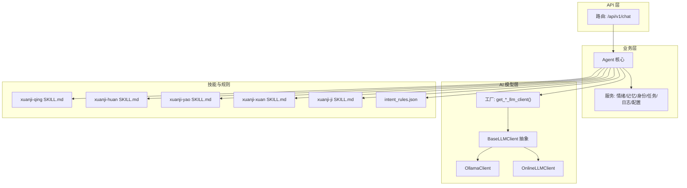
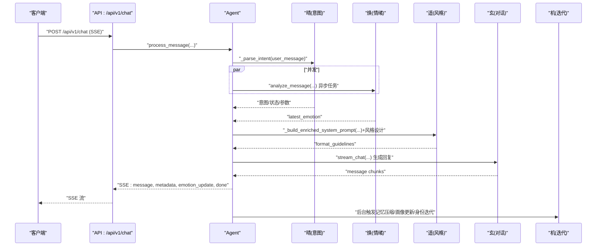
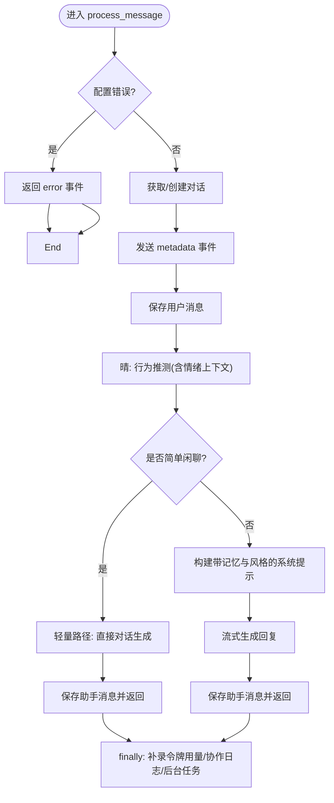
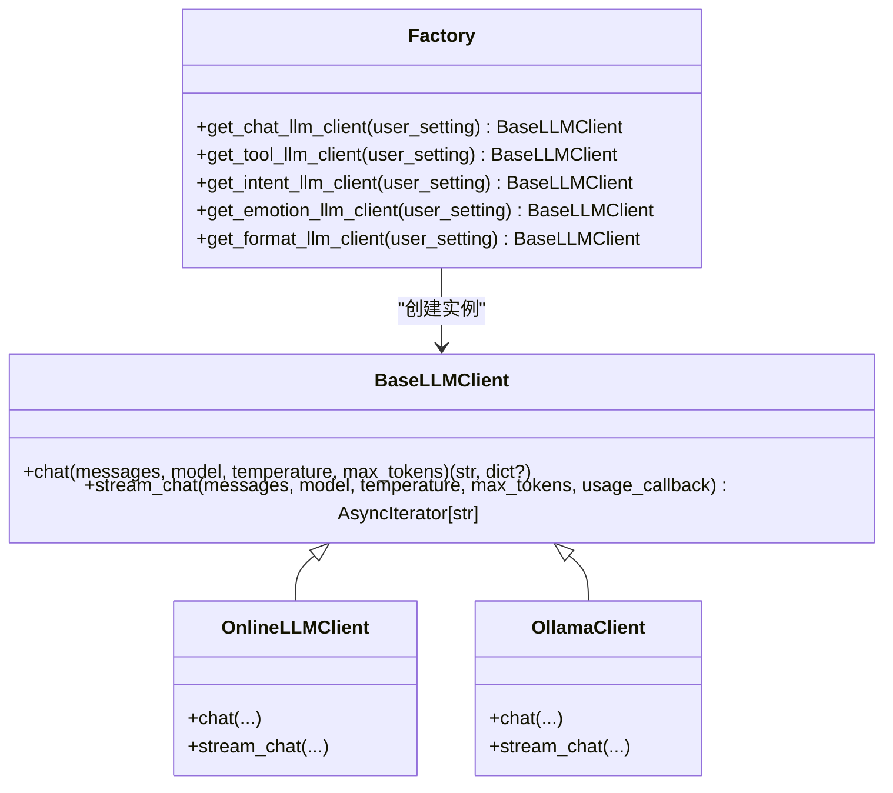
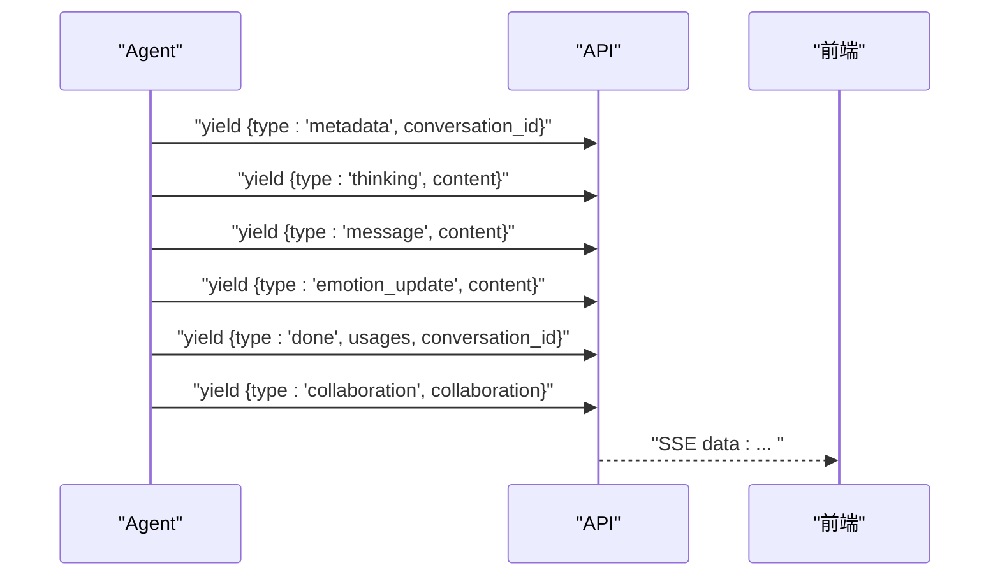
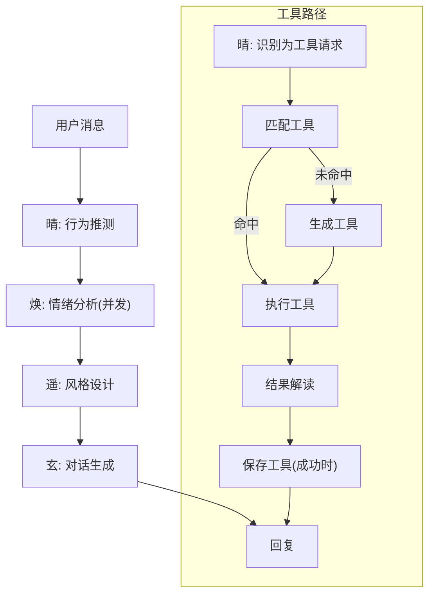
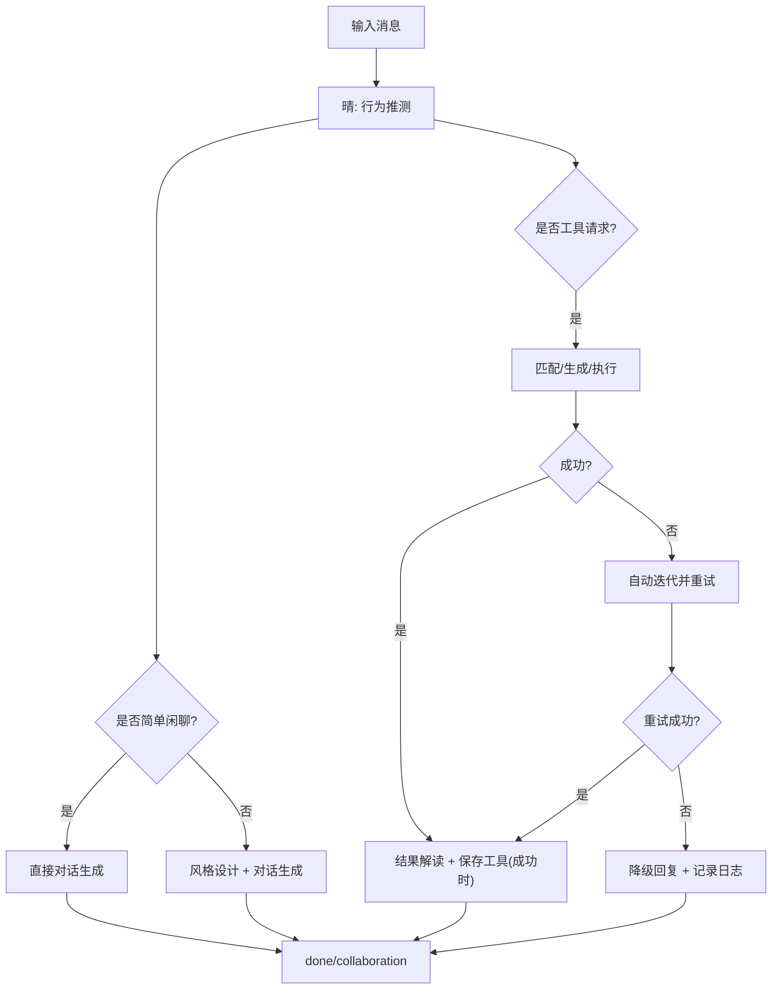
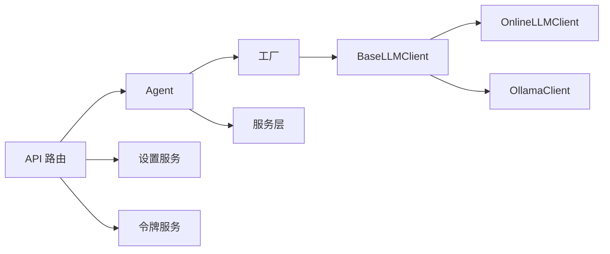

# 多智能体架构

<cite>
**本文引用的文件**
- [backend/app/ai/agent.py](file://backend/app/ai/agent.py)
- [backend/app/ai/factory.py](file://backend/app/ai/factory.py)
- [backend/app/ai/base.py](file://backend/app/ai/base.py)
- [backend/app/ai/ollama.py](file://backend/app/ai/ollama.py)
- [backend/app/ai/online.py](file://backend/app/ai/online.py)
- [backend/app/ai/tool_generator.py](file://backend/app/ai/tool_generator.py)
- [backend/app/ai/intent_rules.json](file://backend/app/ai/intent_rules.json)
- [backend/app/api/v1/chat.py](file://backend/app/api/v1/chat.py)
- [backend/app/main.py](file://backend/app/main.py)
- [backend/app/ai/skills/xuanji-qing/SKILL.md](file://backend/app/ai/skills/xuanji-qing/SKILL.md)
- [backend/app/ai/skills/xuanji-huan/SKILL.md](file://backend/app/ai/skills/xuanji-huan/SKILL.md)
- [backend/app/ai/skills/xuanji-yao/SKILL.md](file://backend/app/ai/skills/xuanji-yao/SKILL.md)
- [backend/app/ai/skills/xuanji-xuan/SKILL.md](file://backend/app/ai/skills/xuanji-xuan/SKILL.md)
- [backend/app/ai/skills/xuanji-ji/SKILL.md](file://backend/app/ai/skills/xuanji-ji/SKILL.md)
</cite>

## 目录
1. [引言](#引言)
2. [项目结构](#项目结构)
3. [核心组件](#核心组件)
4. [架构总览](#架构总览)
5. [详细组件分析](#详细组件分析)
6. [依赖分析](#依赖分析)
7. [性能考量](#性能考量)
8. [故障排查指南](#故障排查指南)
9. [结论](#结论)
10. [附录](#附录)

## 引言
本文件为 XuanJi 多智能体系统提供全面的架构文档，聚焦 Agent 核心组件设计与四智能体（晴、焕、遥、玄）的职责分工与协作机制。文档覆盖工厂模式在 AI 模型管理中的应用、LLM 客户端抽象与统一调度、智能体间通信协议与消息传递、状态同步与事件流、意图识别与情绪分析、风格设计与对话生成流水线，并给出异常处理策略与性能优化建议。为便于读者理解，文档提供了多处架构图与时序图，并在相应章节给出“章节来源”。

## 项目结构
后端采用 FastAPI 应用入口，API 层通过聊天接口对接 Agent；Agent 负责意图解析、情绪分析、风格设计、工具检索/生成/执行、结果解读与回复生成；工厂模式统一管理不同 LLM 提供商（本地 Ollama 与在线提供商）；技能目录定义各智能体的行为规范与协作流程。

图表来源
- [backend/app/api/v1/chat.py:40-106](file://backend/app/api/v1/chat.py#L40-L106)
- [backend/app/ai/agent.py:35-120](file://backend/app/ai/agent.py#L35-L120)
- [backend/app/ai/factory.py:54-154](file://backend/app/ai/factory.py#L54-L154)
- [backend/app/ai/base.py:8-36](file://backend/app/ai/base.py#L8-L36)
- [backend/app/ai/ollama.py:10-91](file://backend/app/ai/ollama.py#L10-L91)
- [backend/app/ai/online.py:10-134](file://backend/app/ai/online.py#L10-L134)
- [backend/app/ai/skills/xuanji-qing/SKILL.md:1-206](file://backend/app/ai/skills/xuanji-qing/SKILL.md#L1-L206)
- [backend/app/ai/skills/xuanji-huan/SKILL.md:1-186](file://backend/app/ai/skills/xuanji-huan/SKILL.md#L1-L186)
- [backend/app/ai/skills/xuanji-yao/SKILL.md:1-170](file://backend/app/ai/skills/xuanji-yao/SKILL.md#L1-L170)
- [backend/app/ai/skills/xuanji-xuan/SKILL.md:1-167](file://backend/app/ai/skills/xuanji-xuan/SKILL.md#L1-L167)
- [backend/app/ai/skills/xuanji-ji/SKILL.md:1-195](file://backend/app/ai/skills/xuanji-ji/SKILL.md#L1-L195)
- [backend/app/ai/intent_rules.json:1-306](file://backend/app/ai/intent_rules.json#L1-L306)

章节来源
- [backend/app/main.py:15-41](file://backend/app/main.py#L15-L41)
- [backend/app/api/v1/chat.py:40-106](file://backend/app/api/v1/chat.py#L40-L106)

## 核心组件
- Agent 核心：负责消息处理全流程编排，包括对话与工具两类路径、并发情绪分析、协作日志记录、事件流产出（metadata、thinking、message、emotion_update、done、collaboration 等）。
- LLM 工厂：按用户设置动态创建不同提供商的 LLM 客户端，统一接口屏蔽差异。
- LLM 客户端抽象：统一 chat/stream_chat 接口，支持流式与非流式两种模式。
- 情绪/风格/意图/对话/系统迭代技能：通过技能文件定义各智能体职责、协作关系与行为规范。
- API 路由：提供 SSE 流式聊天接口，封装事件序列与令牌用量记录。

章节来源
- [backend/app/ai/agent.py:35-120](file://backend/app/ai/agent.py#L35-L120)
- [backend/app/ai/factory.py:54-154](file://backend/app/ai/factory.py#L54-L154)
- [backend/app/ai/base.py:8-36](file://backend/app/ai/base.py#L8-L36)
- [backend/app/api/v1/chat.py:40-106](file://backend/app/api/v1/chat.py#L40-L106)

## 架构总览
XuanJi 的多智能体协作以“意图-情绪-风格-对话-结果解读”为主线，形成闭环：晴负责行为推测与调度，焕负责情绪感知，遥负责风格设计，玄负责最终回复生成；机在后台进行系统迭代与优化。Agent 将各角色输出融合为自然语言回复，并通过事件流向前端推送。

图表来源
- [backend/app/api/v1/chat.py:40-106](file://backend/app/api/v1/chat.py#L40-L106)
- [backend/app/ai/agent.py:78-275](file://backend/app/ai/agent.py#L78-L275)
- [backend/app/ai/skills/xuanji-qing/SKILL.md:143-161](file://backend/app/ai/skills/xuanji-qing/SKILL.md#L143-L161)
- [backend/app/ai/skills/xuanji-huan/SKILL.md:1-186](file://backend/app/ai/skills/xuanji-huan/SKILL.md#L1-L186)
- [backend/app/ai/skills/xuanji-yao/SKILL.md:112-126](file://backend/app/ai/skills/xuanji-yao/SKILL.md#L112-L126)
- [backend/app/ai/skills/xuanji-xuan/SKILL.md:150-167](file://backend/app/ai/skills/xuanji-xuan/SKILL.md#L150-L167)
- [backend/app/ai/skills/xuanji-ji/SKILL.md:142-161](file://backend/app/ai/skills/xuanji-ji/SKILL.md#L142-L161)

## 详细组件分析

### Agent 核心组件与协作机制
- 职责划分
  - 晴：行为推测中枢，结合情绪上下文判断用户状态与需求，输出描述、用户状态、目标路径与参数。
  - 焕：情绪分析，提供 primary_emotion、强度、深层需求与风险信号，支撑风格与回复温度。
  - 遥：风格设计，将情绪映射为回复结构、长度、风格与特殊元素，注入系统提示。
  - 玄：对话核心，融合多源上下文，生成自然、温暖、口语化的回复。
  - 机：后台迭代者，负责规则引擎、Prompt 评估、流程效率分析与系统优化。
- 协作流程
  - 并发启动情绪分析，随后进行意图解析与简单/复杂路径分流。
  - 复杂路径：遥基于情绪与行为推测生成风格指引，玄据此生成回复。
  - 工具路径：若需工具，先匹配/生成/执行，再由“机”迭代优化规则与 Prompt。
  - 事件流：metadata、thinking、message、emotion_update、done、collaboration 等事件有序产出，前端按事件类型渲染。
- 状态同步
  - 协作日志记录每个角色的行动与结果，最终以 collaboration 事件下发。
  - 情绪更新通过 emotion_update 事件通知前端，同时持久化快照并参与规则贡献。
  - 令牌用量通过 usage_callback 收集，done 事件携带汇总并在 finally 补录后置用量。

图表来源
- [backend/app/ai/agent.py:78-275](file://backend/app/ai/agent.py#L78-L275)

章节来源
- [backend/app/ai/agent.py:35-120](file://backend/app/ai/agent.py#L35-L120)
- [backend/app/ai/skills/xuanji-qing/SKILL.md:1-206](file://backend/app/ai/skills/xuanji-qing/SKILL.md#L1-L206)
- [backend/app/ai/skills/xuanji-huan/SKILL.md:1-186](file://backend/app/ai/skills/xuanji-huan/SKILL.md#L1-L186)
- [backend/app/ai/skills/xuanji-yao/SKILL.md:1-170](file://backend/app/ai/skills/xuanji-yao/SKILL.md#L1-L170)
- [backend/app/ai/skills/xuanji-xuan/SKILL.md:1-167](file://backend/app/ai/skills/xuanji-xuan/SKILL.md#L1-L167)
- [backend/app/ai/skills/xuanji-ji/SKILL.md:1-195](file://backend/app/ai/skills/xuanji-ji/SKILL.md#L1-L195)

### 工厂模式与 LLM 客户端管理
- 设计原理
  - 通过工厂函数按用户设置选择提供商（online/ollama），并分别创建对应客户端实例。
  - BaseLLMClient 抽象统一 chat/stream_chat 接口，屏蔽在线与本地差异。
- 统一管理
  - 对话（玄）、工具（机）、意图（晴）、情绪（焕）、风格（遥）分别使用独立工厂方法，确保职责分离与可替换性。
  - 在线客户端支持流式回调 usage，本地 Ollama 客户端通过 done 标记统计 token。

图表来源
- [backend/app/ai/base.py:8-36](file://backend/app/ai/base.py#L8-L36)
- [backend/app/ai/online.py:10-134](file://backend/app/ai/online.py#L10-L134)
- [backend/app/ai/ollama.py:10-91](file://backend/app/ai/ollama.py#L10-L91)
- [backend/app/ai/factory.py:54-154](file://backend/app/ai/factory.py#L54-L154)

章节来源
- [backend/app/ai/factory.py:14-154](file://backend/app/ai/factory.py#L14-L154)
- [backend/app/ai/base.py:41-73](file://backend/app/ai/base.py#L41-L73)
- [backend/app/ai/online.py:25-134](file://backend/app/ai/online.py#L25-L134)
- [backend/app/ai/ollama.py:19-91](file://backend/app/ai/ollama.py#L19-L91)

### 智能体间通信协议与消息传递
- 事件类型
  - metadata：包含当前对话 ID，便于前端绑定会话。
  - thinking：阶段性思考提示，如“正在处理/正在搜索匹配的工具…”。
  - message：流式回复片段。
  - emotion_update：情绪分析结果更新，包含主情绪、强度、深层需求与风险等级。
  - done：处理结束事件，携带令牌用量汇总与对话 ID。
  - collaboration：协作日志，记录各智能体的行动与结果。
- 事件流向
  - Agent 在处理过程中按阶段产出事件，API 层以 SSE 形式推送给客户端。
  - done 事件后，Agent 在 finally 中补录后置 token 用量，并异步触发记忆压缩与画像更新等后台任务。

图表来源
- [backend/app/ai/agent.py:78-275](file://backend/app/ai/agent.py#L78-L275)
- [backend/app/api/v1/chat.py:62-87](file://backend/app/api/v1/chat.py#L62-L87)

章节来源
- [backend/app/ai/agent.py:78-275](file://backend/app/ai/agent.py#L78-L275)
- [backend/app/api/v1/chat.py:40-106](file://backend/app/api/v1/chat.py#L40-L106)

### 意图识别、情绪分析、风格设计与对话生成流水线
- 意图识别（晴）
  - 使用规则与 LLM 结合进行行为推测，输出描述、用户状态、目标路径与参数。
  - 规则来源于 intent_rules.json，支持关键字匹配与学习到的模式。
- 情绪分析（焕）
  - 并发执行，输出主情绪、强度、深层需求与风险信号，供风格与回复温度调整。
- 风格设计（遥）
  - 将情绪映射为结构、长度、风格与特殊元素，形成 format_guidelines 注入系统提示。
- 对话生成（玄）
  - 融合情绪、风格、记忆与上下文，生成自然口语化回复。
- 工具路径
  - 匹配现有工具 → 生成新工具 → 执行工具 → 结果解读 → 保存工具（成功时）。
  - 若失败，支持自动迭代生成并重试。

图表来源
- [backend/app/ai/agent.py:118-275](file://backend/app/ai/agent.py#L118-L275)
- [backend/app/ai/tool_generator.py:10-129](file://backend/app/ai/tool_generator.py#L10-L129)
- [backend/app/ai/intent_rules.json:1-306](file://backend/app/ai/intent_rules.json#L1-L306)
- [backend/app/ai/skills/xuanji-qing/SKILL.md:143-161](file://backend/app/ai/skills/xuanji-qing/SKILL.md#L143-L161)
- [backend/app/ai/skills/xuanji-huan/SKILL.md:1-186](file://backend/app/ai/skills/xuanji-huan/SKILL.md#L1-L186)
- [backend/app/ai/skills/xuanji-yao/SKILL.md:112-126](file://backend/app/ai/skills/xuanji-yao/SKILL.md#L112-L126)
- [backend/app/ai/skills/xuanji-xuan/SKILL.md:150-167](file://backend/app/ai/skills/xuanji-xuan/SKILL.md#L150-L167)

章节来源
- [backend/app/ai/agent.py:118-275](file://backend/app/ai/agent.py#L118-L275)
- [backend/app/ai/tool_generator.py:10-129](file://backend/app/ai/tool_generator.py#L10-L129)
- [backend/app/ai/intent_rules.json:1-306](file://backend/app/ai/intent_rules.json#L1-L306)

### 决策树与异常处理策略
- 决策树（简化）
  - 输入用户消息 → 晴推测 → 判断是否简单闲聊 → 是则直接对话；否则进入风格设计与对话生成。
  - 若为工具请求：匹配工具 → 命中则执行；未命中则生成工具 → 执行 → 解读结果 → 保存工具（成功时）。
- 异常处理
  - 配置错误：立即返回 error 事件。
  - LLM 调用异常：捕获并返回 error 事件，必要时降级回复。
  - 情绪分析超时/失败：记录日志并继续流程，同时在 finally 补录用量。
  - 工具执行失败：尝试自动迭代生成并重试，失败则记录日志。
  - SSE 断开：捕获取消异常，记录日志并优雅退出。

图表来源
- [backend/app/ai/agent.py:78-275](file://backend/app/ai/agent.py#L78-L275)
- [backend/app/ai/tool_generator.py:10-129](file://backend/app/ai/tool_generator.py#L10-L129)

章节来源
- [backend/app/ai/agent.py:78-275](file://backend/app/ai/agent.py#L78-L275)

### 性能优化方案
- 并发与异步
  - 情绪分析以任务并发执行，不阻塞主线对话路径。
  - 流式回复与流式 usage 回调，降低端到端延迟。
- 缓存与复用
  - 遥的风格设计结果按情绪大类缓存，减少重复计算。
  - LLM prompt 与 JSON 配置使用 LRU 缓存加载。
- 后台任务
  - 记忆压缩、画像更新、身份迭代以 fire-and-forget 方式异步执行，避免阻塞用户交互。
- 超时与降级
  - 工具路径设置流式超时与总超时，异常时降级回复并记录日志。
  - 令牌用量在 finally 补录，保证统计完整性。

章节来源
- [backend/app/ai/agent.py:140-149](file://backend/app/ai/agent.py#L140-L149)
- [backend/app/ai/base.py:41-73](file://backend/app/ai/base.py#L41-L73)
- [backend/app/ai/skills/xuanji-yao/SKILL.md:140-151](file://backend/app/ai/skills/xuanji-yao/SKILL.md#L140-L151)

## 依赖分析
- 组件耦合
  - Agent 依赖工厂创建 LLM 客户端，依赖服务层进行对话、情绪、记忆、身份、任务、日志、配置等操作。
  - LLM 客户端依赖网络库进行 HTTP 请求，统一抽象屏蔽提供商差异。
  - API 层依赖 Agent 与设置服务，负责事件流与令牌用量记录。
- 外部依赖
  - FastAPI/CORS/数据库初始化/定时任务调度器。
  - LLM 提供商（在线/本地 Ollama）。

图表来源
- [backend/app/api/v1/chat.py:40-106](file://backend/app/api/v1/chat.py#L40-L106)
- [backend/app/ai/agent.py:35-120](file://backend/app/ai/agent.py#L35-L120)
- [backend/app/ai/factory.py:54-154](file://backend/app/ai/factory.py#L54-L154)
- [backend/app/ai/base.py:8-36](file://backend/app/ai/base.py#L8-L36)

章节来源
- [backend/app/api/v1/chat.py:40-106](file://backend/app/api/v1/chat.py#L40-L106)
- [backend/app/ai/agent.py:35-120](file://backend/app/ai/agent.py#L35-L120)
- [backend/app/ai/factory.py:54-154](file://backend/app/ai/factory.py#L54-L154)

## 性能考量
- 延迟优化
  - 使用流式对话与流式 usage 回调，缩短首 token 延迟。
  - 并发情绪分析，避免串行阻塞。
- 资源控制
  - 设置流式超时与总超时，防止长时间占用连接。
  - 控制系统提示长度与上下文数量，平衡质量与性能。
- 统计与可观测
  - 通过 usage_callback 与 finally 补录，确保令牌用量统计准确。
  - 协作日志与异常日志辅助定位性能瓶颈。

## 故障排查指南
- 常见问题
  - LLM 配置错误：检查 provider 与密钥/模型名称是否正确。
  - SSE 断开：检查客户端断开逻辑与服务端异常捕获。
  - 情绪分析超时/失败：查看日志与告警，确认提供商可用性。
  - 工具执行失败：查看执行结果与自动迭代日志，必要时人工干预。
- 建议
  - 在 API 层统一捕获异常并返回 error 事件。
  - 在 Agent 的 finally 中补录令牌用量，确保统计完整。
  - 使用协作日志定位角色间衔接问题。

章节来源
- [backend/app/api/v1/chat.py:78-87](file://backend/app/api/v1/chat.py#L78-L87)
- [backend/app/ai/agent.py:676-792](file://backend/app/ai/agent.py#L676-L792)

## 结论
XuanJi 多智能体系统通过清晰的角色分工与事件驱动的协作机制，实现了从意图识别、情绪感知、风格设计到对话生成的完整闭环。工厂模式与 LLM 客户端抽象确保了模型管理的统一与可扩展；并发与流式处理提升了响应速度；完善的事件流与日志体系为可观测性与优化提供了基础。未来可在规则引擎自动化、Prompt 评估与流程效率分析方面持续迭代，进一步提升系统稳定性与用户体验。

## 附录
- 技能文件概览
  - 晴：行为推测中枢，定义推测维度、规则学习与协作关系。
  - 焕：心理情绪分析师，提供结构化情绪报告与交互建议。
  - 遥：风格设计师，将情绪映射为回复风格与结构指引。
  - 玄：对话核心，融合多源上下文生成自然语言回复。
  - 机：系统迭代者，负责规则引擎、Prompt 评估与流程优化。
- 规则文件
  - intent_rules.json：包含查询、闲聊、情绪关键词与学习到的模式，支撑晴的行为推测。

章节来源
- [backend/app/ai/skills/xuanji-qing/SKILL.md:1-206](file://backend/app/ai/skills/xuanji-qing/SKILL.md#L1-L206)
- [backend/app/ai/skills/xuanji-huan/SKILL.md:1-186](file://backend/app/ai/skills/xuanji-huan/SKILL.md#L1-L186)
- [backend/app/ai/skills/xuanji-yao/SKILL.md:1-170](file://backend/app/ai/skills/xuanji-yao/SKILL.md#L1-L170)
- [backend/app/ai/skills/xuanji-xuan/SKILL.md:1-167](file://backend/app/ai/skills/xuanji-xuan/SKILL.md#L1-L167)
- [backend/app/ai/skills/xuanji-ji/SKILL.md:1-195](file://backend/app/ai/skills/xuanji-ji/SKILL.md#L1-L195)
- [backend/app/ai/intent_rules.json:1-306](file://backend/app/ai/intent_rules.json#L1-L306)