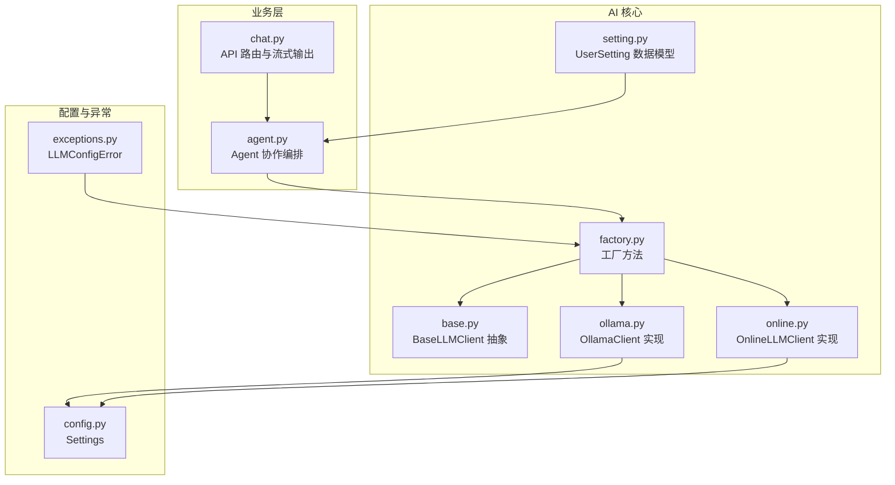
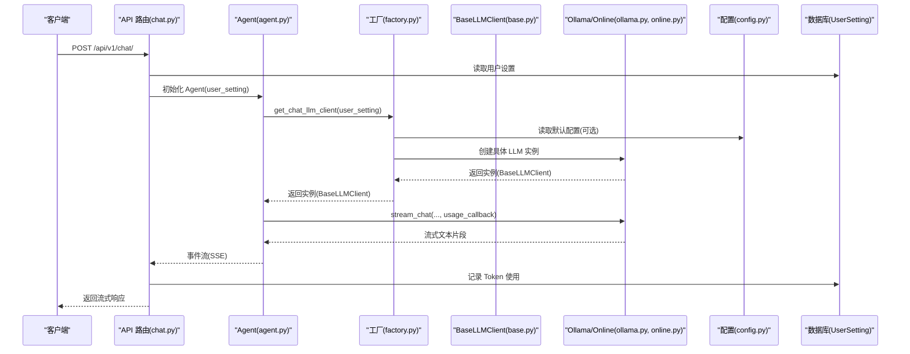
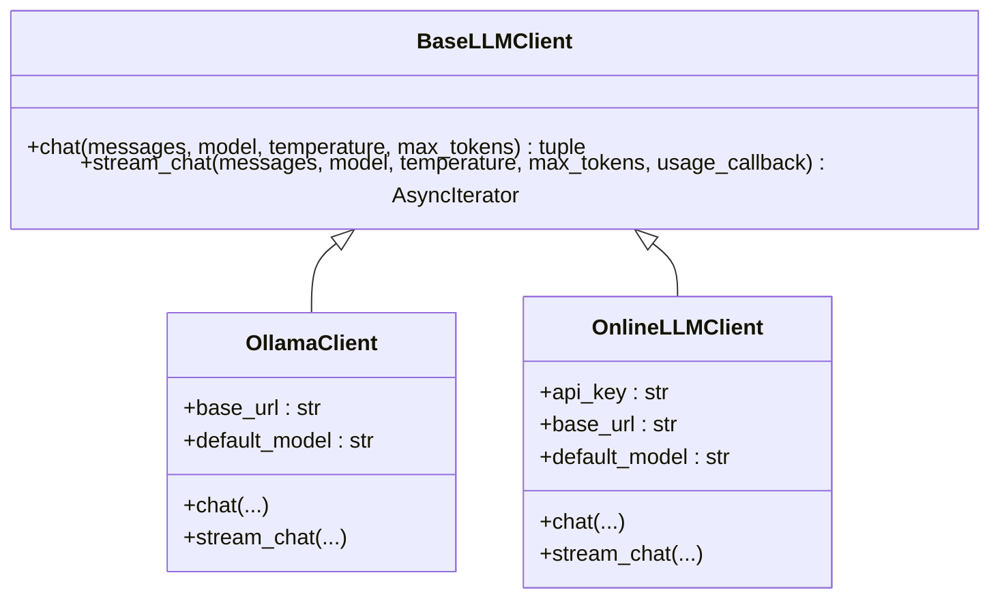
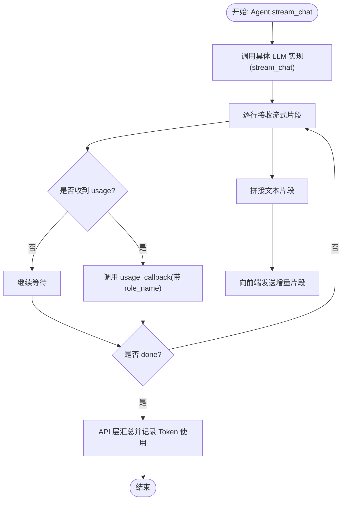
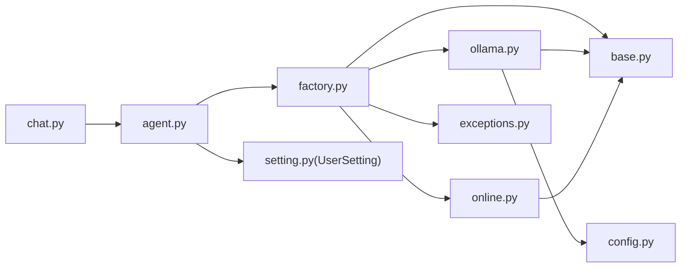

# 工厂模式管理

<cite>
**本文引用的文件**
- [factory.py](file://backend/app/ai/factory.py)
- [base.py](file://backend/app/ai/base.py)
- [ollama.py](file://backend/app/ai/ollama.py)
- [online.py](file://backend/app/ai/online.py)
- [config.py](file://backend/app/core/config.py)
- [exceptions.py](file://backend/app/core/exceptions.py)
- [setting.py](file://backend/app/models/setting.py)
- [agent.py](file://backend/app/ai/agent.py)
- [chat.py](file://backend/app/api/v1/chat.py)
- [SKILL.md（晴）](file://backend/app/ai/skills/xuanji-qing/SKILL.md)
- [SKILL.md（机）](file://backend/app/ai/skills/xuanji-ji/SKILL.md)
- [SKILL.md（遥）](file://backend/app/ai/skills/xuanji-yao/SKILL.md)
- [persona.md（焕）](file://backend/app/ai/skills/xuanji-huan/persona.md)
</cite>

## 目录
1. [简介](#简介)
2. [项目结构](#项目结构)
3. [核心组件](#核心组件)
4. [架构总览](#架构总览)
5. [详细组件分析](#详细组件分析)
6. [依赖关系分析](#依赖关系分析)
7. [性能考量](#性能考量)
8. [故障排查指南](#故障排查指南)
9. [结论](#结论)
10. [附录](#附录)

## 简介
本文件围绕 XuanJi 的“工厂模式管理”主题，系统阐述 AI 模型工厂在多角色 AI（对话、工具、意图、格式、情绪）协同体系中的设计与实现。重点包括：
- 统一抽象与动态切换：通过工厂方法在运行时根据用户设置动态选择 Ollama 本地模型或在线 LLM 服务。
- 工厂方法设计：get_chat_llm_client、get_format_llm_client、get_intent_llm_client、get_tool_llm_client 的职责划分与参数来源。
- 集成策略：本地 Ollama 与在线服务的配置、错误处理与使用方式。
- 性能与扩展：提示模板加载、缓存、流式输出、Token 使用统计与记录。
- 最佳实践：新增模型支持与配置管理的步骤与注意事项。

## 项目结构
AI 工厂模式位于 backend/app/ai 目录下，配合 core 配置、异常定义、数据库模型以及 API 层使用。整体结构如下图所示：

图表来源
- [factory.py:1-154](file://backend/app/ai/factory.py#L1-L154)
- [base.py:8-73](file://backend/app/ai/base.py#L8-L73)
- [ollama.py:10-91](file://backend/app/ai/ollama.py#L10-L91)
- [online.py:10-134](file://backend/app/ai/online.py#L10-L134)
- [config.py:4-68](file://backend/app/core/config.py#L4-L68)
- [exceptions.py:1-20](file://backend/app/core/exceptions.py#L1-L20)
- [setting.py:9-60](file://backend/app/models/setting.py#L9-L60)
- [agent.py:13-69](file://backend/app/ai/agent.py#L13-L69)
- [chat.py:40-76](file://backend/app/api/v1/chat.py#L40-L76)

章节来源
- [factory.py:1-154](file://backend/app/ai/factory.py#L1-L154)
- [base.py:8-73](file://backend/app/ai/base.py#L8-L73)
- [ollama.py:10-91](file://backend/app/ai/ollama.py#L10-L91)
- [online.py:10-134](file://backend/app/ai/online.py#L10-L134)
- [config.py:4-68](file://backend/app/core/config.py#L4-L68)
- [exceptions.py:1-20](file://backend/app/core/exceptions.py#L1-L20)
- [setting.py:9-60](file://backend/app/models/setting.py#L9-L60)
- [agent.py:13-69](file://backend/app/ai/agent.py#L13-L69)
- [chat.py:40-76](file://backend/app/api/v1/chat.py#L40-L76)

## 核心组件
- 工厂方法族：get_chat_llm_client、get_format_llm_client、get_intent_llm_client、get_tool_llm_client，分别面向不同 AI 角色，均从用户设置中读取 provider 与模型参数，不进行回退。
- 抽象接口：BaseLLMClient 定义统一的同步/异步对话与流式输出接口，便于替换实现。
- 具体实现：
  - OllamaClient：基于本地 Ollama 服务，支持同步与流式请求，自动聚合 Token 使用统计。
  - OnlineLLMClient：封装在线服务（如 OpenAI 风格），支持流式输出与 usage 回调。
- 配置与异常：
  - Settings：集中管理 Ollama 与各角色在线/本地配置项。
  - LLMConfigError：统一的配置缺失/不合法异常，便于前端提示。
  - UserSetting：数据库模型，持久化用户配置。
- 业务编排：Agent 在初始化阶段通过工厂方法获取对话 LLM；API 层负责流式输出与 Token 使用记录。

章节来源
- [factory.py:54-154](file://backend/app/ai/factory.py#L54-L154)
- [base.py:8-73](file://backend/app/ai/base.py#L8-L73)
- [ollama.py:10-91](file://backend/app/ai/ollama.py#L10-L91)
- [online.py:10-134](file://backend/app/ai/online.py#L10-L134)
- [config.py:4-68](file://backend/app/core/config.py#L4-L68)
- [exceptions.py:1-20](file://backend/app/core/exceptions.py#L1-L20)
- [setting.py:9-60](file://backend/app/models/setting.py#L9-L60)
- [agent.py:44-69](file://backend/app/ai/agent.py#L44-L69)
- [chat.py:22-38](file://backend/app/api/v1/chat.py#L22-L38)

## 架构总览
下图展示了从 API 到 Agent、再到工厂与具体 LLM 实现的调用链路，以及配置与异常处理的关键节点。

图表来源
- [chat.py:40-76](file://backend/app/api/v1/chat.py#L40-L76)
- [agent.py:44-69](file://backend/app/ai/agent.py#L44-L69)
- [factory.py:54-73](file://backend/app/ai/factory.py#L54-L73)
- [ollama.py:19-91](file://backend/app/ai/ollama.py#L19-L91)
- [online.py:31-134](file://backend/app/ai/online.py#L31-L134)
- [config.py:4-68](file://backend/app/core/config.py#L4-L68)
- [setting.py:9-60](file://backend/app/models/setting.py#L9-L60)

## 详细组件分析

### 工厂方法设计与职责
- get_chat_llm_client：面向“对话AI（玄）”，从 user_setting 中读取 llm_provider、ollama_base_url/ollama_model 或 llm_api_key/llm_api_base_url/llm_model_name，不进行回退。
- get_tool_llm_client：面向“工具AI（机）”，从 tool_llm_* 前缀字段读取，不回退。
- get_intent_llm_client：面向“意图识别AI（晴）”，从 intent_llm_* 前缀字段读取，不回退。
- get_emotion_llm_client：面向“情绪管理AI（焕）”，从 emotion_llm_* 前缀字段读取，不回退。
- get_format_llm_client：面向“格式管理AI（遥）”，从 format_llm_* 前缀字段读取，不回退。
- 统一错误处理：当缺少 provider、api_key、base_url 或 model_name 等关键字段时，抛出 LLMConfigError，便于前端提示。

章节来源
- [factory.py:54-154](file://backend/app/ai/factory.py#L54-L154)
- [exceptions.py:1-20](file://backend/app/core/exceptions.py#L1-L20)

### 抽象与实现：BaseLLMClient 与具体客户端
- BaseLLMClient：定义 chat 与 stream_chat 两个核心接口，约定返回内容与 usage 的结构。
- OllamaClient：
  - 同步：向 /api/chat 发送请求，解析返回的 message.content 与 token 统计。
  - 流式：逐行解析 JSON 行，提取 content 并在 done 时回调 usage。
  - 默认模型与 base_url 可来自 Settings。
- OnlineLLMClient：
  - 同步：向 /chat/completions 发送请求，清洗内部思考标记，返回 usage。
  - 流式：解析 data: 行，提取 choices.delta.content，同时捕获 usage，支持 usage 回调。
  - 请求头包含 Authorization: Bearer。

图表来源
- [base.py:8-73](file://backend/app/ai/base.py#L8-L73)
- [ollama.py:10-91](file://backend/app/ai/ollama.py#L10-L91)
- [online.py:10-134](file://backend/app/ai/online.py#L10-L134)

章节来源
- [base.py:8-73](file://backend/app/ai/base.py#L8-L73)
- [ollama.py:10-91](file://backend/app/ai/ollama.py#L10-L91)
- [online.py:10-134](file://backend/app/ai/online.py#L10-L134)

### 配置管理与集成策略
- Settings：集中定义 Ollama 与各角色的 provider、api_key、base_url、model_name 等字段，支持从 .env 加载。
- UserSetting：数据库模型，持久化用户配置，字段覆盖各角色的 online/ollama 设置。
- 工厂策略：
  - online：必须提供 api_key 与 base_url；model 可为 None，由调用方决定。
  - ollama：必须提供 model_name；base_url 可为空时使用默认值。
- 错误处理：缺失关键字段时抛出 LLMConfigError，Agent 初始化阶段捕获并记录，后续流程中提前返回错误事件。

章节来源
- [config.py:4-68](file://backend/app/core/config.py#L4-L68)
- [setting.py:9-60](file://backend/app/models/setting.py#L9-L60)
- [factory.py:14-51](file://backend/app/ai/factory.py#L14-L51)
- [exceptions.py:1-20](file://backend/app/core/exceptions.py#L1-L20)
- [agent.py:49-53](file://backend/app/ai/agent.py#L49-L53)

### 流式输出与 Token 统计
- Agent 为每个角色创建 usage_callback，将 usage 附加 role_name 并收集到 _all_usages。
- API 层在事件类型为 done 时汇总 usage 并调用 TokenService.record_usage 记录数据库。
- OnlineLLMClient 在流式结束时通过 usage 回调返回 usage；OllamaClient 在 done 时回调 usage。

图表来源
- [agent.py:70-76](file://backend/app/ai/agent.py#L70-L76)
- [chat.py:72-76](file://backend/app/api/v1/chat.py#L72-L76)
- [online.py:66-134](file://backend/app/ai/online.py#L66-L134)
- [ollama.py:50-91](file://backend/app/ai/ollama.py#L50-L91)

章节来源
- [agent.py:70-76](file://backend/app/ai/agent.py#L70-L76)
- [chat.py:72-76](file://backend/app/api/v1/chat.py#L72-L76)
- [online.py:66-134](file://backend/app/ai/online.py#L66-L134)
- [ollama.py:50-91](file://backend/app/ai/ollama.py#L50-L91)

### 提示模板与角色协作
- BaseLLMClient 提供 load_prompt/load_json_config/load_prompt_sections，用于加载技能目录下的模板与配置。
- SKILL.md（晴）：行为推测中枢，结合情绪分析结果为遥与玄提供上下文。
- SKILL.md（遥）：风格设计中枢，依据情绪-风格映射表生成格式指引，并具备缓存机制。
- SKILL.md（焕）：情绪分析，提供 tone/pacing/communication method 等指导。
- SKILL.md（机）：系统迭代者，负责规则引擎与流程优化。

章节来源
- [base.py:41-73](file://backend/app/ai/base.py#L41-L73)
- [SKILL.md（晴）:1-44](file://backend/app/ai/skills/xuanji-qing/SKILL.md#L1-L44)
- [SKILL.md（遥）:27-150](file://backend/app/ai/skills/xuanji-yao/SKILL.md#L27-L150)
- [SKILL.md（焕）:1-26](file://backend/app/ai/skills/xuanji-huan/persona.md#L1-L26)
- [SKILL.md（机）:1-42](file://backend/app/ai/skills/xuanji-ji/SKILL.md#L1-L42)

## 依赖关系分析
- 工厂依赖：factory.py 依赖 base.py、ollama.py、online.py、exceptions.py。
- 实现依赖：ollama.py、online.py 依赖 base.py；ollama.py 依赖 config.py。
- 使用依赖：agent.py 依赖 factory.py；API 层依赖 agent.py 与 TokenService。
- 配置依赖：Settings 与 UserSetting 提供配置来源。

图表来源
- [factory.py:1-8](file://backend/app/ai/factory.py#L1-L8)
- [ollama.py:6-7](file://backend/app/ai/ollama.py#L6-L7)
- [online.py:7](file://backend/app/ai/online.py#L7)
- [agent.py:13-32](file://backend/app/ai/agent.py#L13-L32)
- [chat.py:16-17](file://backend/app/api/v1/chat.py#L16-L17)
- [setting.py:9-60](file://backend/app/models/setting.py#L9-L60)

章节来源
- [factory.py:1-8](file://backend/app/ai/factory.py#L1-L8)
- [ollama.py:6-7](file://backend/app/ai/ollama.py#L6-L7)
- [online.py:7](file://backend/app/ai/online.py#L7)
- [agent.py:13-32](file://backend/app/ai/agent.py#L13-L32)
- [chat.py:16-17](file://backend/app/api/v1/chat.py#L16-L17)
- [setting.py:9-60](file://backend/app/models/setting.py#L9-L60)

## 性能考量
- 流式输出：OnlineLLMClient 与 OllamaClient 均支持流式输出，降低首字延迟，提升用户体验。
- Token 统计：统一返回 usage，便于成本控制与预算管理。
- 缓存与复用：BaseLLMClient 的提示模板加载采用 LRU 缓存，减少磁盘 IO。
- 超时与并发：AsyncClient 设置合理超时时间，避免阻塞；Agent 使用 asyncio 并发执行情绪分析等任务。
- 负载均衡与选择算法：当前实现未内置负载均衡逻辑，可通过扩展工厂方法增加权重/健康检查/回退策略，以实现多实例或多服务的动态选择。

章节来源
- [base.py:41-46](file://backend/app/ai/base.py#L41-L46)
- [ollama.py:26-48](file://backend/app/ai/ollama.py#L26-L48)
- [online.py:39-57](file://backend/app/ai/online.py#L39-L57)
- [online.py:68-134](file://backend/app/ai/online.py#L68-L134)
- [ollama.py:59-91](file://backend/app/ai/ollama.py#L59-L91)

## 故障排查指南
- 配置缺失：当 provider、api_key、base_url 或 model_name 缺失时，工厂抛出 LLMConfigError；Agent 初始化阶段捕获该异常并记录，后续流程中直接返回错误事件。
- 在线服务异常：OnlineLLMClient 在请求失败时抛出 HTTP 异常；需检查 api_key、base_url 与网络连通性。
- 本地 Ollama 异常：OllamaClient 在请求失败时抛出 HTTP 异常；需检查 Ollama 服务状态与模型可用性。
- 流式输出中断：若客户端断开连接，API 层会检测并停止继续推送；检查网络稳定性与超时设置。
- Token 统计不一致：确认 usage_callback 是否正确传入，且 API 层在 done 事件中汇总记录。

章节来源
- [exceptions.py:1-20](file://backend/app/core/exceptions.py#L1-L20)
- [agent.py:49-53](file://backend/app/ai/agent.py#L49-L53)
- [online.py:39-50](file://backend/app/ai/online.py#L39-L50)
- [ollama.py:39](file://backend/app/ai/ollama.py#L39)
- [chat.py:69-71](file://backend/app/api/v1/chat.py#L69-L71)

## 结论
XuanJi 的工厂模式通过统一抽象与清晰的工厂方法，实现了多角色 AI 的灵活切换与可扩展性。结合流式输出、Token 统计与提示模板缓存，既保证了性能也提升了可维护性。未来可在工厂层引入负载均衡与多实例选择策略，进一步增强系统的弹性与可靠性。

## 附录

### 新增 AI 模型支持的最佳实践
- 定义新角色配置字段：在 Settings 与 UserSetting 中新增对应前缀的 provider、api_key、base_url、model_name 字段。
- 实现新客户端：继承 BaseLLMClient，实现 chat 与 stream_chat，遵循统一返回结构。
- 注册工厂方法：在 factory.py 中新增 get_xxx_llm_client 方法，按现有模式读取 user_setting 并创建实例。
- 集成到 Agent：在需要的角色处调用新工厂方法，必要时在 Agent 中增加 usage_callback 与协作日志。
- 配置与测试：在 .env 中配置新模型参数，通过 API 路由验证流式输出与 Token 统计。

章节来源
- [config.py:4-68](file://backend/app/core/config.py#L4-L68)
- [setting.py:9-60](file://backend/app/models/setting.py#L9-L60)
- [base.py:8-73](file://backend/app/ai/base.py#L8-L73)
- [factory.py:54-154](file://backend/app/ai/factory.py#L54-L154)
- [agent.py:44-69](file://backend/app/ai/agent.py#L44-L69)