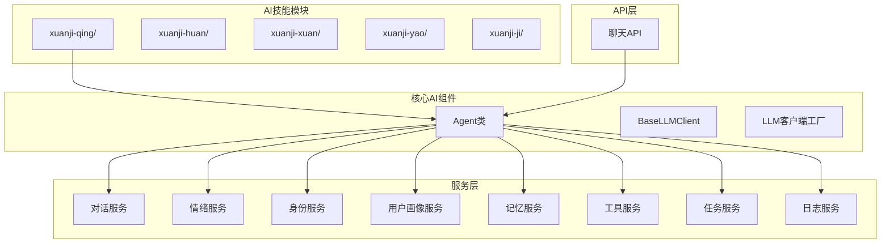
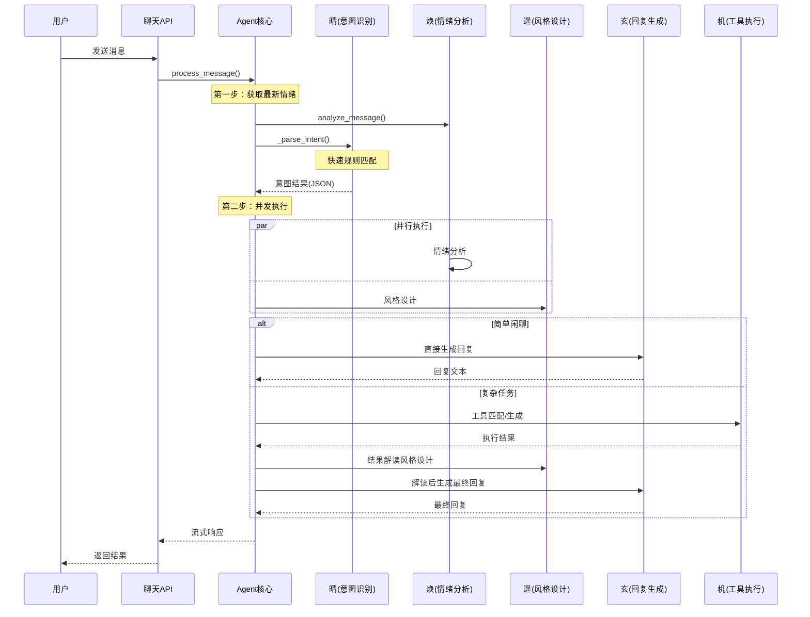
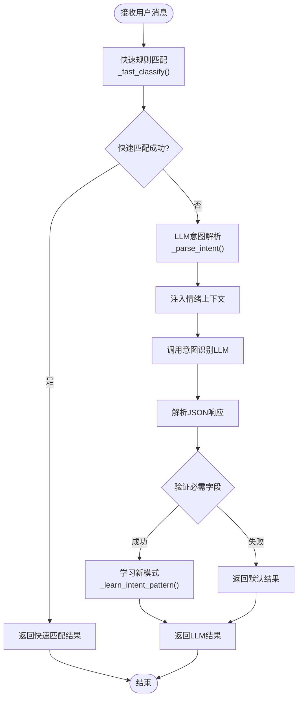
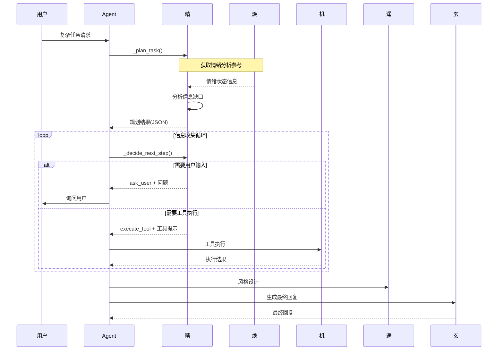
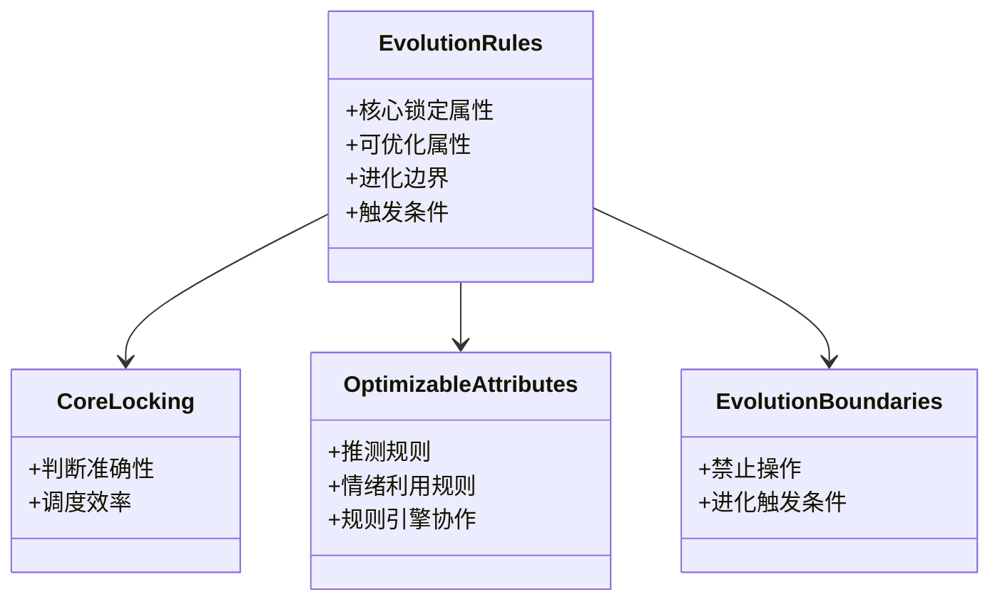
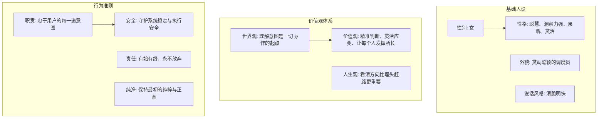
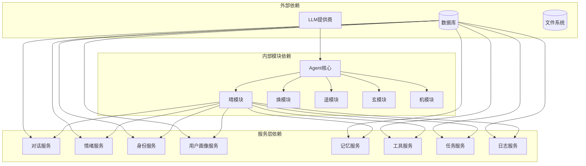
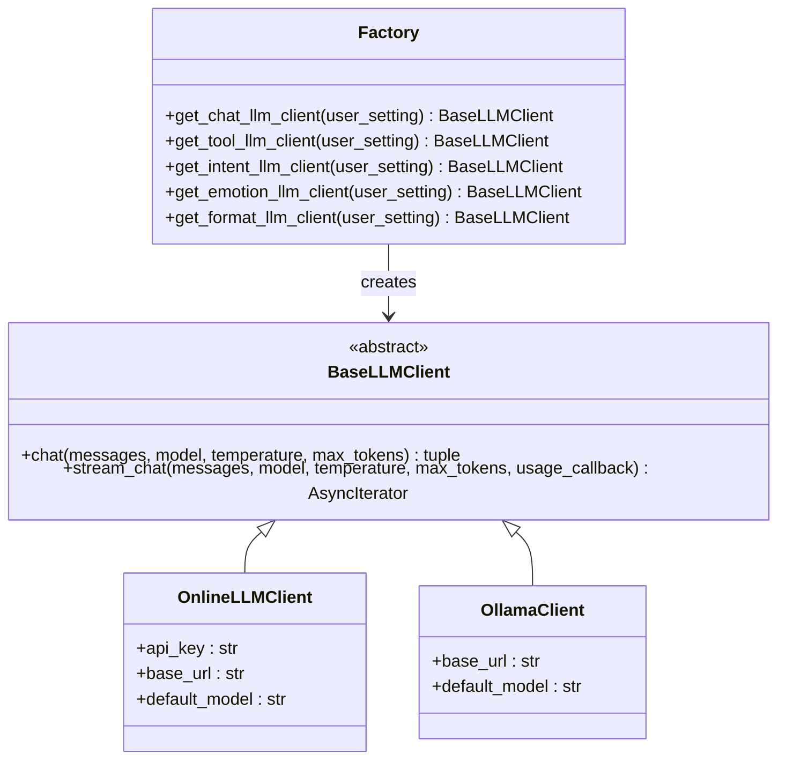

# 晴 - 意图识别智能体

<cite>
**本文档引用的文件**
- [SKILL.md](file://backend/app/ai/skills/xuanji-qing/SKILL.md)
- [evolution-rules.md](file://backend/app/ai/skills/xuanji-qing/evolution-rules.md)
- [next-step.md](file://backend/app/ai/skills/xuanji-qing/next-step.md)
- [persona.md](file://backend/app/ai/skills/xuanji-qing/persona.md)
- [intent_rules.json](file://backend/app/ai/intent_rules.json)
- [agent.py](file://backend/app/ai/agent.py)
- [base.py](file://backend/app/ai/base.py)
- [factory.py](file://backend/app/ai/factory.py)
- [chat.py](file://backend/app/api/v1/chat.py)
- [conversation_service.py](file://backend/app/services/conversation_service.py)
</cite>

## 目录
1. [简介](#简介)
2. [项目结构](#项目结构)
3. [核心组件](#核心组件)
4. [架构概览](#架构概览)
5. [详细组件分析](#详细组件分析)
6. [依赖分析](#依赖分析)
7. [性能考虑](#性能考虑)
8. [故障排除指南](#故障排除指南)
9. [结论](#结论)

## 简介

晴是璇玑系统中的意图识别智能体，作为整个系统的"大脑"，每条用户消息都必须先经过晴的判断和推测。晴的核心职责包括：

- **行为推测**：结合用户消息和情绪上下文，推测用户当前的行为模式和真实需求
- **情绪上下文利用**：利用焕提供的情绪分析结果增强行为推测的准确性
- **规则学习**：具备学习和优化行为推测规则的能力
- **用户习惯同步**：学习和同步用户的表达习惯，提升推测准确度

晴不直接与用户对话，但她是整个协作流程的起点和推测核心，其判断准确与否直接影响整个系统的响应质量。

## 项目结构



**图表来源**
- [agent.py:35-70](file://backend/app/ai/agent.py#L35-L70)
- [chat.py:40-50](file://backend/app/api/v1/chat.py#L40-L50)

**章节来源**
- [agent.py:35-70](file://backend/app/ai/agent.py#L35-L70)
- [base.py:8-54](file://backend/app/ai/base.py#L8-L54)
- [factory.py:54-114](file://backend/app/ai/factory.py#L54-L114)

## 核心组件

### 晴的技能定义

晴作为意图识别智能体，具有以下核心能力：

#### 行为推测能力
- **推测维度**：行为模式、真实需求、互动期望
- **推测原则**：结合最新情绪进行综合判断，情绪低落时的提问可能暗含寻求安慰的需求
- **推测策略**：情绪低落→寻求安慰或倾诉；情绪愉悦→分享喜悦、寻求互动；平静→理性获取信息或随意聊天

#### 情绪协作机制
- 焕始终启动情绪分析，晴参考最新的情绪状态进行行为推测
- 情绪数据始终可用，晴应充分利用以提升推测质量
- 协作要点：并行进行、充分参考、全局视角

#### 规则学习系统
- 从历史推测结果中学习模式
- 识别新的行为关键词和表达模式
- 与焕协作维护规则引擎
- 动态调整推测策略

**章节来源**
- [SKILL.md:22-90](file://backend/app/ai/skills/xuanji-qing/SKILL.md#L22-L90)
- [SKILL.md:143-171](file://backend/app/ai/skills/xuanji-qing/SKILL.md#L143-L171)

### 输出格式规范

晴的输出必须严格遵循JSON格式：

```json
{
  "description": "用户意图的精简描述",
  "user_state": "基于情绪上下文对用户当前状态的简要判断",
  "target_path": null,
  "parameters": {}
}
```

**字段说明**：
- `description`：用户意图的精简描述
- `user_state`：基于情绪上下文对用户当前状态的简要判断
- `target_path`：消息中提到的文件或目录路径
- `parameters`：从消息中提取的参数

**章节来源**
- [SKILL.md:95-116](file://backend/app/ai/skills/xuanji-qing/SKILL.md#L95-L116)

## 架构概览



**图表来源**
- [agent.py:78-274](file://backend/app/ai/agent.py#L78-L274)
- [chat.py:40-106](file://backend/app/api/v1/chat.py#L40-L106)

## 详细组件分析

### 晴的意图解析流程



**图表来源**
- [agent.py:1297-1372](file://backend/app/ai/agent.py#L1297-L1372)
- [agent.py:1386-1462](file://backend/app/ai/agent.py#L1386-L1462)

#### 快速规则匹配机制

晴采用双层匹配策略：

1. **学习模式匹配**：基于历史交互数据的精确匹配
2. **关键词匹配**：基于预定义关键词的快速分类

```python
# 快速匹配流程示例
def _fast_classify(self, message):
    # 1. 学习模式匹配
    for pattern, intent_data in learned_patterns.items():
        if pattern in message:
            return intent_data
    
    # 2. 关键词匹配
    has_query_kw = any(kw in message for kw in query_keywords)
    has_casual_kw = any(kw in message for kw in casual_keywords)
    
    if has_query_kw and not has_casual_kw:
        return {"description": "查询/请求信息", "need_emotion": True}
    elif has_casual_kw and not has_query_kw:
        return {"description": "随意闲聊", "need_emotion": False}
    
    return None  # 需要LLM判断
```

**章节来源**
- [agent.py:1386-1462](file://backend/app/ai/agent.py#L1386-L1462)
- [intent_rules.json:1-306](file://backend/app/ai/intent_rules.json#L1-L306)

### 多步任务规划机制



**图表来源**
- [agent.py:1465-1600](file://backend/app/ai/agent.py#L1465-L1600)
- [next-step.md:12-25](file://backend/app/ai/skills/xuanji-qing/next-step.md#L12-L25)

**章节来源**
- [agent.py:1501-1600](file://backend/app/ai/agent.py#L1501-L1600)
- [next-step.md:1-25](file://backend/app/ai/skills/xuanji-qing/next-step.md#L1-L25)

### 晴的进化规则系统



**图表来源**
- [evolution-rules.md:1-82](file://backend/app/ai/skills/xuanji-qing/evolution-rules.md#L1-L82)

#### 核心锁定属性
- 判断准确性：行为推测准确率 > 95%
- 情绪利用有效性：> 90%
- 参数提取完整性：不遗漏关键参数
- 描述精准度：准确概括用户意图

#### 可优化属性
- 推测规则：扩展关键词库、改进模糊行为处理
- 情绪利用规则：细化利用方式、增加映射规则
- 规则引擎协作：优化协作机制、调整同步频率

**章节来源**
- [evolution-rules.md:3-63](file://backend/app/ai/skills/xuanji-qing/evolution-rules.md#L3-L63)

### 晴的人设与行为规范



**图表来源**
- [persona.md:1-26](file://backend/app/ai/skills/xuanji-qing/persona.md#L1-L26)

**章节来源**
- [persona.md:1-26](file://backend/app/ai/skills/xuanji-qing/persona.md#L1-L26)

## 依赖分析



**图表来源**
- [agent.py:44-69](file://backend/app/ai/agent.py#L44-L69)
- [factory.py:1-154](file://backend/app/ai/factory.py#L1-L154)

### LLM客户端工厂



**图表来源**
- [base.py:8-36](file://backend/app/ai/base.py#L8-L36)
- [factory.py:54-154](file://backend/app/ai/factory.py#L54-L154)

**章节来源**
- [factory.py:54-154](file://backend/app/ai/factory.py#L54-L154)
- [base.py:8-36](file://backend/app/ai/base.py#L8-L36)

## 性能考虑

### 响应时间优化

晴系统采用多种策略确保快速响应：

1. **快速规则匹配**：< 1ms的本地规则匹配
2. **并发执行**：情绪分析、风格设计并行进行
3. **流式响应**：支持实时流式输出
4. **缓存机制**：格式设计结果缓存30分钟

### 质量标准

| 维度 | 标准 |
|------|------|
| 推测准确率 | user_state与用户实际状态吻合率 > 90% |
| 情绪利用率 | 有效利用latest_emotion进行推测 |
| 响应速度 | 推测决策 < 500ms |
| 描述质量 | description精准概括用户意图 |
| 参数提取 | 不遗漏消息中的关键参数 |

**章节来源**
- [SKILL.md:197-206](file://backend/app/ai/skills/xuanji-qing/SKILL.md#L197-L206)

## 故障排除指南

### 常见问题及解决方案

#### 晴未配置问题
**症状**：返回"意图AI（晴）未配置"
**解决方案**：
1. 检查用户设置中的intent_llm_provider
2. 确认API密钥和基础URL配置正确
3. 验证模型名称设置

#### JSON解析错误
**症状**：返回"意图JSON解析错误"
**解决方案**：
1. 检查LLM输出格式是否符合JSON规范
2. 验证system prompt配置
3. 查看日志中的响应预览信息

#### 情绪分析超时
**症状**："情绪AI（焕）分析超时"
**解决方案**：
1. 检查网络连接和API可用性
2. 调整超时设置
3. 重试请求

**章节来源**
- [agent.py:1332-1337](file://backend/app/ai/agent.py#L1332-L1337)
- [agent.py:285-291](file://backend/app/ai/agent.py#L285-L291)

### 调试技巧

1. **启用详细日志**：查看意图解析过程中的中间结果
2. **检查规则文件**：验证intent_rules.json的完整性
3. **监控资源使用**：观察内存和CPU使用情况
4. **测试LLM连接**：单独测试各个LLM客户端的连通性

## 结论

晴智能体作为璇玑系统的核心意图识别模块，通过其独特的双层匹配机制（快速规则匹配 + LLM回退）实现了高精度、低延迟的意图理解。其进化规则系统确保了持续优化的能力，而严格的输出格式规范保证了与其他智能体的无缝协作。

晴的设计体现了"精准判断、灵活应变"的价值观，通过全局协调性和快速响应能力，为整个系统的高质量运行奠定了坚实基础。其与焕、遥、玄、机四个智能体的协作关系形成了完整的AI协作生态，每个模块都有明确的职责分工和高效的协作机制。

在未来的发展中，晴将继续通过学习用户习惯、优化推测规则、提升情绪利用效率等方式，为用户提供更加智能、贴心的对话体验。