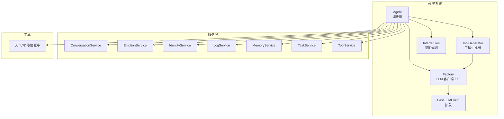
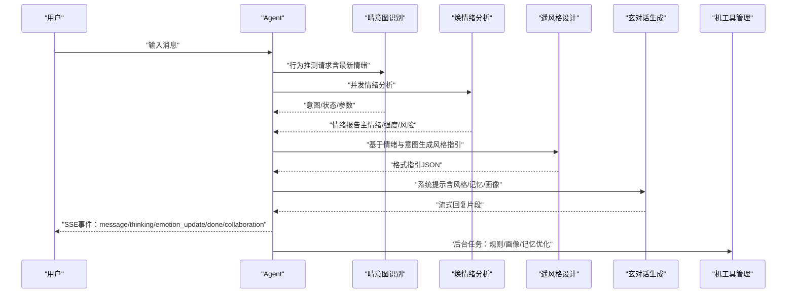
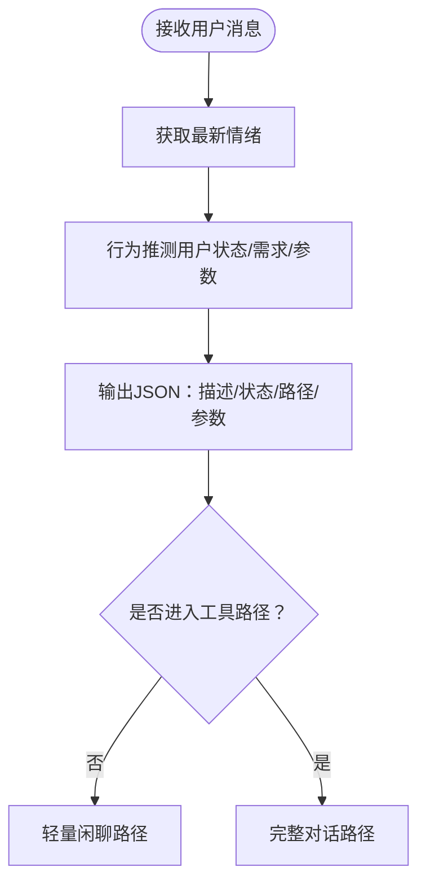
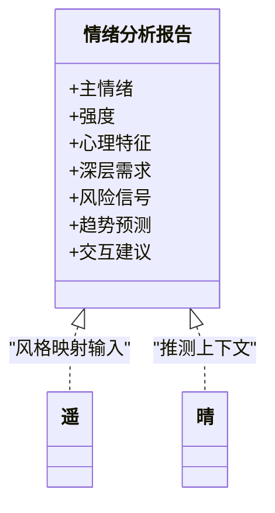
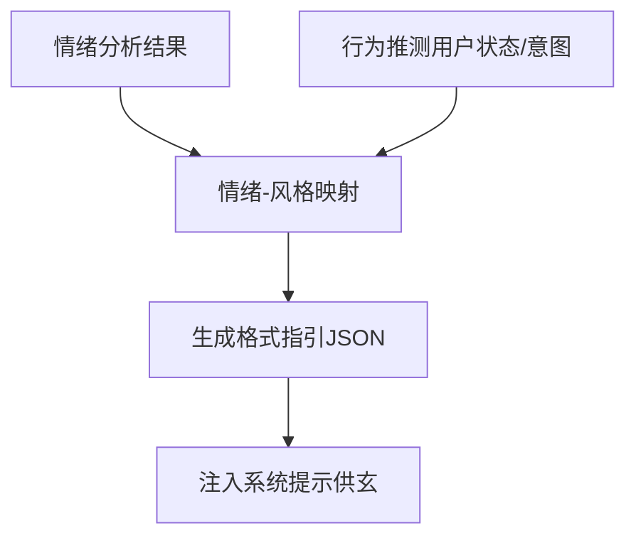
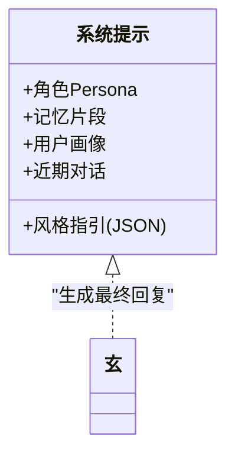
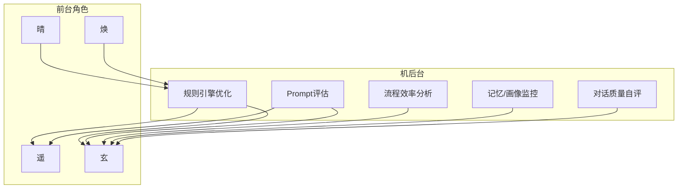
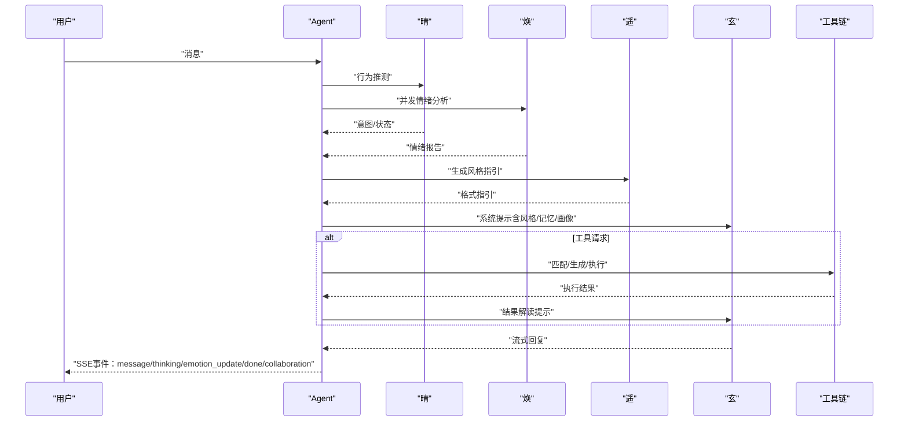
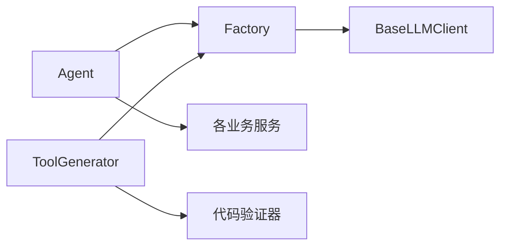

# 智能体系统

<cite>
**本文引用的文件**
- [agent.py](file://backend/app/ai/agent.py)
- [base.py](file://backend/app/ai/base.py)
- [factory.py](file://backend/app/ai/factory.py)
- [tool_generator.py](file://backend/app/ai/tool_generator.py)
- [intent_rules.json](file://backend/app/ai/intent_rules.json)
- [SKILL.md（晴）](file://backend/app/ai/skills/xuanji-qing/SKILL.md)
- [SKILL.md（焕）](file://backend/app/ai/skills/xuanji-huan/SKILL.md)
- [SKILL.md（遥）](file://backend/app/ai/skills/xuanji-yao/SKILL.md)
- [SKILL.md（玄）](file://backend/app/ai/skills/xuanji-xuan/SKILL.md)
- [SKILL.md（机）](file://backend/app/ai/skills/xuanji-ji/SKILL.md)
- [persona.md（晴）](file://backend/app/ai/skills/xuanji-qing/persona.md)
- [persona.md（焕）](file://backend/app/ai/skills/xuanji-huan/persona.md)
- [persona.md（遥）](file://backend/app/ai/skills/xuanji-yao/persona.md)
- [persona.md（玄）](file://backend/app/ai/skills/xuanji-xuan/persona.md)
- [persona.md（机）](file://backend/app/ai/skills/xuanji-ji/persona.md)
</cite>

## 目录
1. [简介](#简介)
2. [项目结构](#项目结构)
3. [核心组件](#核心组件)
4. [架构总览](#架构总览)
5. [详细组件分析](#详细组件分析)
6. [依赖分析](#依赖分析)
7. [性能考量](#性能考量)
8. [故障排查指南](#故障排查指南)
9. [结论](#结论)
10. [附录](#附录)

## 简介
本文件为 XuanJi 四个核心 AI 智能体的全面架构文档，围绕“晴（意图识别）”“焕（情绪分析）”“遥（风格设计）”“玄（对话生成）”“机（工具管理）”五大角色，系统阐述其职责边界、协作机制、消息传递协议、状态同步策略、提示词模板、行为规范与决策逻辑，并给出智能体切换条件、优先级调度与异常处理机制。文档同时提供端到端的协作流程图与时序图，帮助读者从高层到代码级全面理解系统。

## 项目结构
后端采用分层与按功能域划分的组织方式：
- ai 子系统：包含智能体编排器、通用 LLM 客户端抽象、工厂与工具生成器、意图规则等
- api 子系统：提供 REST API 入口，对接前端聊天与工具管理
- services 子系统：封装业务服务（对话、情绪、身份、日志、记忆、任务、工具、用户等）
- models/schemas：数据模型与接口定义
- tools：内置工具集合（天气、时间、位置等）

图表来源
- [agent.py:1-800](file://backend/app/ai/agent.py#L1-L800)
- [factory.py:1-154](file://backend/app/ai/factory.py#L1-L154)
- [base.py:1-73](file://backend/app/ai/base.py#L1-L73)
- [tool_generator.py:1-129](file://backend/app/ai/tool_generator.py#L1-L129)

章节来源
- [agent.py:1-800](file://backend/app/ai/agent.py#L1-L800)
- [factory.py:1-154](file://backend/app/ai/factory.py#L1-L154)
- [base.py:1-73](file://backend/app/ai/base.py#L1-L73)
- [tool_generator.py:1-129](file://backend/app/ai/tool_generator.py#L1-L129)

## 核心组件
- 编排器 Agent：负责消息入口、意图解析、情绪并发分析、风格设计、对话生成、工具匹配/生成/执行、结果解读与协作日志记录，贯穿完整对话生命周期
- LLM 客户端抽象 BaseLLMClient：统一在线与本地（Ollama）两类推理后端的接口
- LLM 客户端工厂 Factory：依据用户设置动态创建各角色 LLM 客户端，支持在线与本地两种 Provider
- 工具生成器 ToolGenerator：基于用户描述生成合法 Python 工具代码，带元信息抽取与验证
- 意图规则 IntentRules：行为推测的规则库，支撑晴的快速决策

章节来源
- [agent.py:35-793](file://backend/app/ai/agent.py#L35-L793)
- [base.py:8-36](file://backend/app/ai/base.py#L8-L36)
- [factory.py:54-154](file://backend/app/ai/factory.py#L54-L154)
- [tool_generator.py:10-68](file://backend/app/ai/tool_generator.py#L10-L68)
- [intent_rules.json:1-306](file://backend/app/ai/intent_rules.json#L1-L306)

## 架构总览
XuanJi 的多智能体协作以“消息即命令”的方式驱动，Agent 作为中枢编排器，串联“晴-焕-遥-玄-机”五位角色。其中：
- 晴：行为推测中枢，结合情绪上下文快速判定用户状态与需求
- 焕：情绪分析，提供情绪状态、强度、深层需求与风险信号
- 遥：风格设计，将情绪与行为映射为可执行的回复风格指引
- 玄：对话生成，融合多源上下文，生成自然、温暖、口语化的回复
- 机：系统迭代者，后台优化规则引擎、Prompt、流程效率与数据质量

图表来源
- [agent.py:78-274](file://backend/app/ai/agent.py#L78-L274)
- [agent.py:343-359](file://backend/app/ai/agent.py#L343-L359)
- [agent.py:570-675](file://backend/app/ai/agent.py#L570-L675)

## 详细组件分析

### 晴（意图识别）——行为推测中枢
- 职责
  - 结合“最新情绪”与用户消息，快速推测行为模式、真实需求与互动期望
  - 输出标准化 JSON：描述、用户状态、目标路径、参数
- 行为规范与决策逻辑
  - 推测需快速、果断，避免成为系统瓶颈
  - 全局视角：兼顾下游效率与用户体验
  - user_state 编写需简洁、可指导遥与玄
- 协作关系
  - 与焕并行：参考“最新情绪”增强推测
  - 影响遥的风格设计与玄的回复上下文
- 提示词模板
  - 使用 SKILL.md 中的行为推测框架与输出格式约束
- 切换与优先级
  - 每条消息均需进行，优先于其他角色，决定后续路径（轻量闲聊 vs 完整对话 vs 工具路径）

图表来源
- [agent.py:118-161](file://backend/app/ai/agent.py#L118-L161)
- [SKILL.md（晴）:93-141](file://backend/app/ai/skills/xuanji-qing/SKILL.md#L93-L141)

章节来源
- [SKILL.md（晴）:10-91](file://backend/app/ai/skills/xuanji-qing/SKILL.md#L10-L91)
- [SKILL.md（晴）:93-141](file://backend/app/ai/skills/xuanji-qing/SKILL.md#L93-L141)
- [SKILL.md（晴）:143-171](file://backend/app/ai/skills/xuanji-qing/SKILL.md#L143-L171)
- [SKILL.md（晴）:174-206](file://backend/app/ai/skills/xuanji-qing/SKILL.md#L174-L206)
- [agent.py:118-161](file://backend/app/ai/agent.py#L118-L161)

### 焕（情绪分析）——情绪感知与风险预警
- 职责
  - 多维度分析用户语言、情感、行为与认知信号
  - 产出结构化情绪报告：主情绪、强度、深层需求、风险信号、趋势预测、交互建议
- 行为规范
  - 概率性与非绝对性原则，避免医疗化诊断与标签化
  - 交互建议包括沟通方法、语调、节奏与关键指导
- 协作关系
  - 与晴并行，为晴提供“最新情绪”，为遥提供风格映射依据
- 提示词模板
  - 使用 SKILL.md 与分析框架/示例资源

图表来源
- [SKILL.md（焕）:31-98](file://backend/app/ai/skills/xuanji-huan/SKILL.md#L31-L98)
- [SKILL.md（焕）:117-134](file://backend/app/ai/skills/xuanji-huan/SKILL.md#L117-L134)

章节来源
- [SKILL.md（焕）:15-98](file://backend/app/ai/skills/xuanji-huan/SKILL.md#L15-L98)
- [SKILL.md（焕）:117-134](file://backend/app/ai/skills/xuanji-huan/SKILL.md#L117-L134)

### 遥（风格设计）——回复风格与结构化指引
- 职责
  - 将“情绪分析结果”映射为“格式指引”，包含结构、长度、风格、特殊元素与规避项
  - 与“行为推测”协同，决定回复节奏与情感色彩
- 行为规范
  - 输出严格 JSON，具体可执行，避免空泛
  - 风格服务于内容，风格与用户情绪匹配
- 缓存机制
  - 按情绪大类缓存，30分钟有效期，提高连贯性与效率
- 协作关系
  - 上游：晴（行为推测）、焕（情绪分析）
  - 下游：玄（系统提示注入）

图表来源
- [SKILL.md（遥）:23-84](file://backend/app/ai/skills/xuanji-yao/SKILL.md#L23-L84)
- [SKILL.md（遥）:140-151](file://backend/app/ai/skills/xuanji-yao/SKILL.md#L140-L151)
- [agent.py:218-229](file://backend/app/ai/agent.py#L218-L229)

章节来源
- [SKILL.md（遥）:21-84](file://backend/app/ai/skills/xuanji-yao/SKILL.md#L21-L84)
- [SKILL.md（遥）:112-135](file://backend/app/ai/skills/xuanji-yao/SKILL.md#L112-L135)
- [SKILL.md（遥）:140-151](file://backend/app/ai/skills/xuanji-yao/SKILL.md#L140-L151)
- [agent.py:218-229](file://backend/app/ai/agent.py#L218-L229)

### 玄（对话生成）——多源上下文融合与自然回复
- 职责
  - 融合晴/焕/遥/记忆/画像等多源上下文，生成自然、温暖、口语化的最终回复
- 行为规范
  - 语言风格：口语化、有节奏、不模板化、不暴露内部术语
  - 回复节奏：根据场景调整长度与展开程度
  - 团队协作意识：自然提及其他成员，体现陪伴感
- 提示词模板
  - 使用 SKILL.md 的风格与结构化约束，结合 persona.md 的性格设定

图表来源
- [SKILL.md（玄）:22-51](file://backend/app/ai/skills/xuanji-xuan/SKILL.md#L22-L51)
- [SKILL.md（玄）:54-101](file://backend/app/ai/skills/xuanji-xuan/SKILL.md#L54-L101)
- [SKILL.md（玄）:142-167](file://backend/app/ai/skills/xuanji-xuan/SKILL.md#L142-L167)

章节来源
- [SKILL.md（玄）:10-51](file://backend/app/ai/skills/xuanji-xuan/SKILL.md#L10-L51)
- [SKILL.md（玄）:54-101](file://backend/app/ai/skills/xuanji-xuan/SKILL.md#L54-L101)
- [SKILL.md（玄）:142-167](file://backend/app/ai/skills/xuanji-xuan/SKILL.md#L142-L167)

### 机（工具管理）——系统迭代与后台优化
- 职责
  - 规则引擎迭代（清洗/合并/优化 intent_rules.json）
  - Prompt 评估与优化
  - AI 流程效率分析
  - 记忆/画像质量监控
  - 对话质量自评与改进
- 行为规范
  - 数据驱动、渐进迭代、质量优先
  - 不参与用户对话主路径，仅在后台运行优化任务
- 协作关系
  - 与晴/焕协作：实时贡献规则与情绪关键词
  - 与遥/玄协作：通过优化成果间接提升表现

图表来源
- [SKILL.md（机）:23-140](file://backend/app/ai/skills/xuanji-ji/SKILL.md#L23-L140)

章节来源
- [SKILL.md（机）:10-55](file://backend/app/ai/skills/xuanji-ji/SKILL.md#L10-L55)
- [SKILL.md（机）:142-161](file://backend/app/ai/skills/xuanji-ji/SKILL.md#L142-L161)
- [SKILL.md（机）:164-183](file://backend/app/ai/skills/xuanji-ji/SKILL.md#L164-L183)

### 消息处理与协作流程（端到端）
- 轻量闲聊路径
  - 晴快速判断为闲聊，直接由玄生成回复，注入“风格规则”与“行为规范”
- 完整对话路径
  - 并发启动“焕”分析情绪，“遥”生成风格指引，“玄”生成回复
  - Agent 记录协作日志，完成后发送“done”事件，异步补录 token 用量与协作日志
- 工具路径
  - 若晴判定为工具请求，则并行等待“焕”情绪分析（超时/失败有降级与日志）
  - 匹配/生成工具 → 执行 → 结果解读 → 生成最终回复
  - 成功/失败更新任务状态并记录日志

图表来源
- [agent.py:78-274](file://backend/app/ai/agent.py#L78-L274)
- [agent.py:320-526](file://backend/app/ai/agent.py#L320-L526)
- [agent.py:570-675](file://backend/app/ai/agent.py#L570-L675)

章节来源
- [agent.py:78-274](file://backend/app/ai/agent.py#L78-L274)
- [agent.py:320-526](file://backend/app/ai/agent.py#L320-L526)
- [agent.py:570-675](file://backend/app/ai/agent.py#L570-L675)

### 提示词模板与行为规范
- 晴：SKILL.md 定义推测框架与输出格式，persona.md 提供角色设定
- 焕：SKILL.md 定义分析流程与结构化输出，analysis-framework.md 与 examples.md 为参考
- 遥：SKILL.md 定义情绪-风格映射与格式指引输出，persona.md 提供角色设定
- 玄：SKILL.md 定义语言风格与输出规范，persona.md 提供角色设定
- 机：SKILL.md 定义优化职责与流程，persona.md 提供角色设定

章节来源
- [SKILL.md（晴）:93-141](file://backend/app/ai/skills/xuanji-qing/SKILL.md#L93-L141)
- [SKILL.md（晴）:143-171](file://backend/app/ai/skills/xuanji-qing/SKILL.md#L143-L171)
- [SKILL.md（焕）:31-98](file://backend/app/ai/skills/xuanji-huan/SKILL.md#L31-L98)
- [SKILL.md（遥）:23-84](file://backend/app/ai/skills/xuanji-yao/SKILL.md#L23-L84)
- [SKILL.md（遥）:112-135](file://backend/app/ai/skills/xuanji-yao/SKILL.md#L112-L135)
- [SKILL.md（玄）:54-101](file://backend/app/ai/skills/xuanji-xuan/SKILL.md#L54-L101)
- [SKILL.md（玄）:142-167](file://backend/app/ai/skills/xuanji-xuan/SKILL.md#L142-L167)
- [SKILL.md（机）:23-140](file://backend/app/ai/skills/xuanji-ji/SKILL.md#L23-L140)

### 智能体切换条件与优先级调度
- 切换条件
  - 晴的“是否为简单闲聊”判断决定路径
  - 工具请求由“意图识别”与“规则引擎”共同决定
- 优先级
  - 晴：每条消息必经，优先级最高
  - 焕：与晴并行，提供情绪上下文
  - 遥：在完整对话路径中紧随“焕”，为“玄”注入风格
  - 玄：唯一直接面向用户的角色，负责最终输出
  - 机：后台独立运行，不参与主路径

章节来源
- [agent.py:118-161](file://backend/app/ai/agent.py#L118-L161)
- [agent.py:218-274](file://backend/app/ai/agent.py#L218-L274)
- [agent.py:320-526](file://backend/app/ai/agent.py#L320-L526)

### 异常处理机制
- LLM 客户端配置错误：捕获并返回错误事件，阻断后续流程
- 情绪分析超时/失败：记录日志，降级处理，仍继续主流程
- 工具执行失败：尝试“工具迭代”（生成新代码并重试），失败则记录并降级回复
- 对话生成异常：捕获并降级为简短兜底回复
- done 事件：先发 done 解锁前端交互，再异步补录 token 用量与协作日志

章节来源
- [agent.py:93-98](file://backend/app/ai/agent.py#L93-L98)
- [agent.py:275-320](file://backend/app/ai/agent.py#L275-L320)
- [agent.py:570-675](file://backend/app/ai/agent.py#L570-L675)

## 依赖分析
- LLM 客户端抽象与工厂
  - BaseLLMClient 统一在线与本地两类 Provider 的接口
  - Factory 依据用户设置动态创建对应角色的 LLM 客户端
- Agent 对服务层的依赖
  - 对话、情绪、身份、日志、记忆、任务、工具、用户画像等服务
- 工具生成链路
  - ToolGenerator 依赖 Tool LLM 客户端与代码验证器，生成合法工具并可自动保存

图表来源
- [factory.py:54-154](file://backend/app/ai/factory.py#L54-L154)
- [base.py:8-36](file://backend/app/ai/base.py#L8-L36)
- [tool_generator.py:10-68](file://backend/app/ai/tool_generator.py#L10-L68)
- [agent.py:13-33](file://backend/app/ai/agent.py#L13-L33)

章节来源
- [factory.py:54-154](file://backend/app/ai/factory.py#L54-L154)
- [base.py:8-36](file://backend/app/ai/base.py#L8-L36)
- [tool_generator.py:10-68](file://backend/app/ai/tool_generator.py#L10-L68)
- [agent.py:13-33](file://backend/app/ai/agent.py#L13-L33)

## 性能考量
- 并发与异步
  - 情绪分析与工具执行采用 asyncio 并发，缩短端到端延迟
- 缓存与复用
  - 遥的格式指引按情绪大类缓存，减少重复计算
- 超时与降级
  - 对话生成与结果解读设置流式超时，超时后降级兜底回复
- 后置记录
  - done 事件先发，后置记录 token 用量与协作日志，避免阻塞用户交互

章节来源
- [agent.py:139-149](file://backend/app/ai/agent.py#L139-L149)
- [agent.py:594-632](file://backend/app/ai/agent.py#L594-L632)
- [agent.py:682-751](file://backend/app/ai/agent.py#L682-L751)

## 故障排查指南
- 配置错误
  - 现象：直接返回错误事件
  - 排查：检查用户设置中的 Provider、API Key、Base URL、模型名称
- 情绪分析超时/失败
  - 现象：工具路径中情绪分析事件缺失或失败日志
  - 排查：检查 LLM 服务可用性、网络与超时阈值
- 工具执行失败
  - 现象：工具执行事件 success=false，可能触发“工具迭代”
  - 排查：查看执行结果、参数与工具代码合法性
- 对话生成异常
  - 现象：生成异常事件或降级回复
  - 排查：检查系统提示长度、模型可用性与流式超时

章节来源
- [agent.py:93-98](file://backend/app/ai/agent.py#L93-L98)
- [agent.py:275-320](file://backend/app/ai/agent.py#L275-L320)
- [agent.py:570-675](file://backend/app/ai/agent.py#L570-L675)

## 结论
XuanJi 的多智能体系统通过“晴-焕-遥-玄-机”的明确分工与高效协作，实现了从意图识别、情绪感知、风格设计到对话生成与系统迭代的全链路闭环。Agent 作为中枢编排器，以并发与缓存优化性能，以事件流与降级策略保障用户体验。借助 SKILL.md 与 persona.md 的规范化约束，系统在保证一致性的同时，持续优化与演进。

## 附录
- 角色人设参考
  - 晴：聪慧、洞察力强、果断、全局观
  - 焕：敏锐、温暖、共情力强、细腻
  - 遥：有审美、条理清晰、追求完美、优雅
  - 玄：细腻、坚韧、温柔、通透
  - 机：逻辑缜密、数据敏感、无情绪化、解决问题导向

章节来源
- [persona.md（晴）:1-26](file://backend/app/ai/skills/xuanji-qing/persona.md#L1-L26)
- [persona.md（焕）:1-26](file://backend/app/ai/skills/xuanji-huan/persona.md#L1-L26)
- [persona.md（遥）:1-26](file://backend/app/ai/skills/xuanji-yao/persona.md#L1-L26)
- [persona.md（玄）:1-26](file://backend/app/ai/skills/xuanji-xuan/persona.md#L1-L26)
- [persona.md（机）:1-26](file://backend/app/ai/skills/xuanji-ji/persona.md#L1-L26)