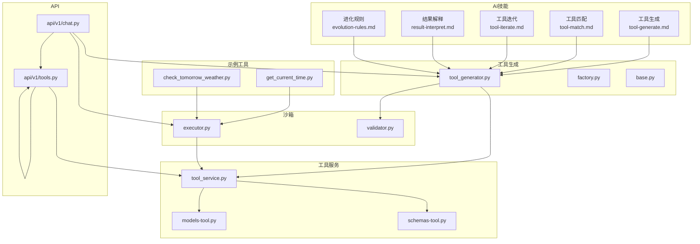
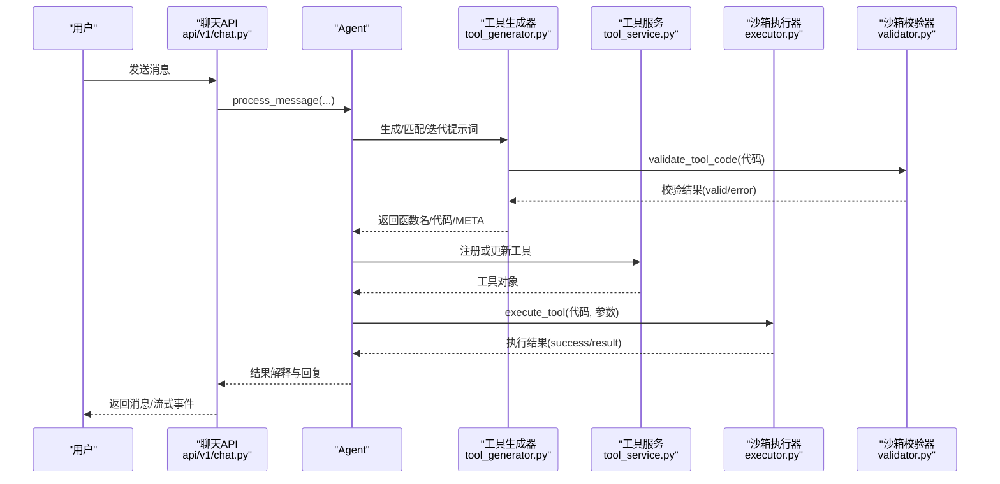
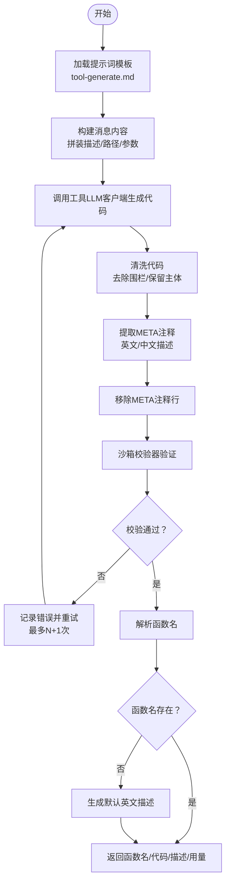
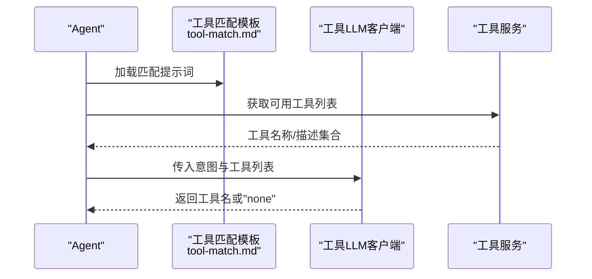
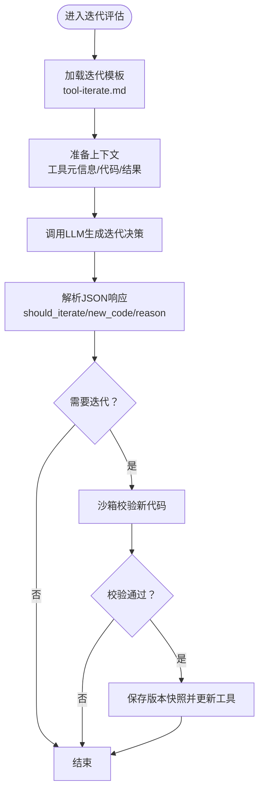
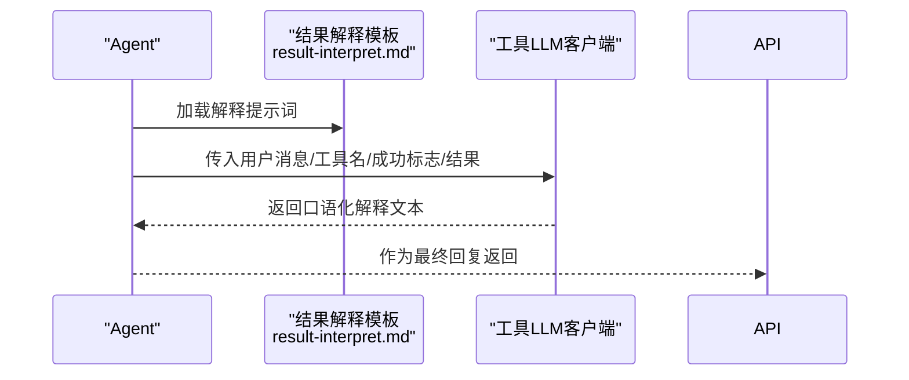
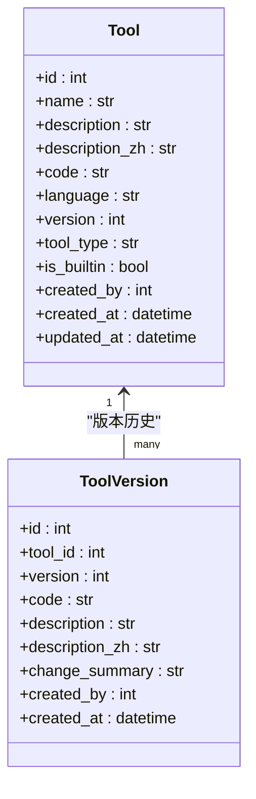
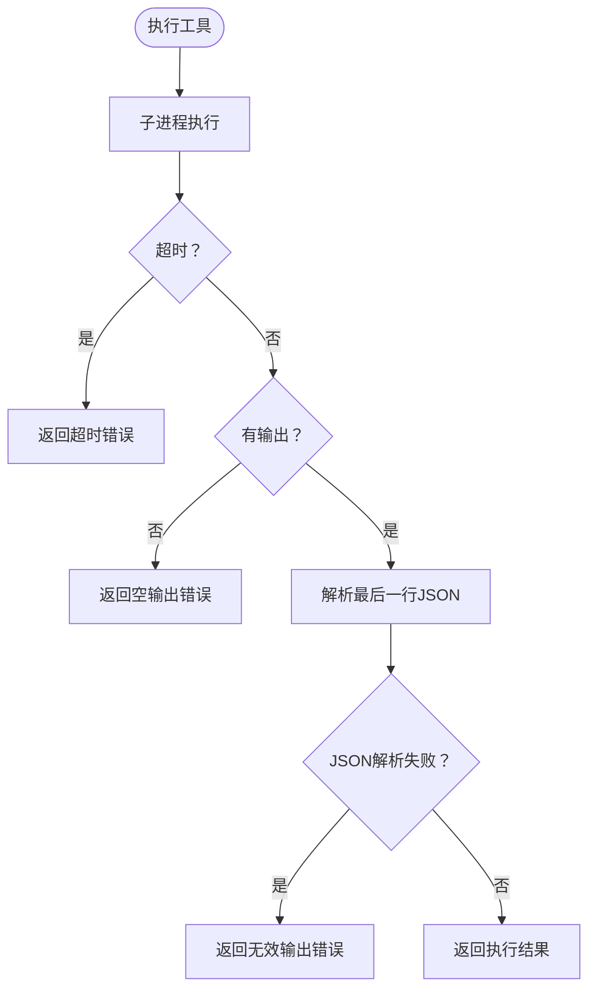
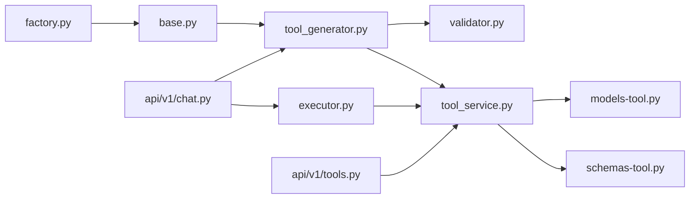

# 机 - 工具管理智能体

<cite>
**本文引用的文件**
- [tool-generate.md](file://backend/app/ai/skills/xuanji-ji/tool-generate.md)
- [tool-match.md](file://backend/app/ai/skills/xuanji-ji/tool-match.md)
- [tool-iterate.md](file://backend/app/ai/skills/xuanji-ji/tool-iterate.md)
- [result-interpret.md](file://backend/app/ai/skills/xuanji-ji/result-interpret.md)
- [evolution-rules.md](file://backend/app/ai/skills/xuanji-ji/evolution-rules.md)
- [tool_generator.py](file://backend/app/ai/tool_generator.py)
- [tool_service.py](file://backend/app/services/tool_service.py)
- [models-tool.py](file://backend/app/models/tool.py)
- [schemas-tool.py](file://backend/app/schemas/tool.py)
- [executor.py](file://backend/app/sandbox/executor.py)
- [validator.py](file://backend/app/sandbox/validator.py)
- [factory.py](file://backend/app/ai/factory.py)
- [base.py](file://backend/app/ai/base.py)
- [tools-get_current_time.py](file://backend/app/tools/get_current_time.py)
- [tools-check_tomorrow_weather.py](file://backend/app/tools/check_tomorrow_weather.py)
- [api-tools.py](file://backend/app/api/v1/tools.py)
- [api-chat.py](file://backend/app/api/v1/chat.py)
</cite>

## 目录
1. [简介](#简介)
2. [项目结构](#项目结构)
3. [核心组件](#核心组件)
4. [架构总览](#架构总览)
5. [详细组件分析](#详细组件分析)
6. [依赖关系分析](#依赖关系分析)
7. [性能考虑](#性能考虑)
8. [故障排查指南](#故障排查指南)
9. [结论](#结论)
10. [附录](#附录)

## 简介
本文件面向“机”这一工具管理智能体，系统化阐述其专业职责与自动化执行流程：工具生成、工具匹配、工具迭代优化、结果解读与任务编排。文档覆盖机的工具生成算法、智能匹配机制、失败重试策略、结果解释流程与进化规则；同时给出工具代码生成规范、相似度匹配算法思路、版本迭代机制与错误恢复策略，并通过具体代码示例路径展示机如何根据用户需求生成Python工具、在工具库中查找匹配工具、执行工具并解读结果、以及在失败时进行智能迭代优化。

## 项目结构
围绕“机”的工具管理能力，后端主要由以下模块组成：
- AI技能与提示词：位于 backend/app/ai/skills/xuanji-ji，包含工具生成、匹配、迭代与结果解释的提示词模板
- 工具生成器：backend/app/ai/tool_generator.py，负责调用LLM生成工具代码并进行安全验证
- 工具服务与模型：backend/app/services/tool_service.py 与 backend/app/models/tool.py，提供工具的增删改查、版本快照与回滚
- 沙箱执行与校验：backend/app/sandbox/executor.py 与 backend/app/sandbox/validator.py，负责隔离执行与安全校验
- API接口：backend/app/api/v1/tools.py 与 backend/app/api/v1/chat.py，提供工具管理与聊天交互入口
- 示例工具：backend/app/tools 下的若干原子工具，用于演示与测试

图表来源
- [tool-generate.md:1-36](file://backend/app/ai/skills/xuanji-ji/tool-generate.md#L1-L36)
- [tool_match.md:1-8](file://backend/app/ai/skills/xuanji-ji/tool-match.md#L1-L8)
- [tool-iterate.md:1-16](file://backend/app/ai/skills/xuanji-ji/tool-iterate.md#L1-L16)
- [result-interpret.md:1-14](file://backend/app/ai/skills/xuanji-ji/result-interpret.md#L1-L14)
- [evolution-rules.md:1-84](file://backend/app/ai/skills/xuanji-ji/evolution-rules.md#L1-L84)
- [tool_generator.py:1-129](file://backend/app/ai/tool_generator.py#L1-L129)
- [factory.py:1-154](file://backend/app/ai/factory.py#L1-L154)
- [base.py:1-73](file://backend/app/ai/base.py#L1-L73)
- [tool_service.py:1-222](file://backend/app/services/tool_service.py#L1-L222)
- [models-tool.py:1-64](file://backend/app/models/tool.py#L1-L64)
- [schemas-tool.py:1-74](file://backend/app/schemas/tool.py#L1-L74)
- [executor.py:1-101](file://backend/app/sandbox/executor.py#L1-L101)
- [validator.py:1-95](file://backend/app/sandbox/validator.py#L1-L95)
- [api-tools.py:1-169](file://backend/app/api/v1/tools.py#L1-L169)
- [api-chat.py:1-106](file://backend/app/api/v1/chat.py#L1-L106)
- [tools-get_current_time.py:1-17](file://backend/app/tools/get_current_time.py#L1-L17)
- [tools-check_tomorrow_weather.py:1-57](file://backend/app/tools/check_tomorrow_weather.py#L1-L57)

章节来源
- [tool-generate.md:1-36](file://backend/app/ai/skills/xuanji-ji/tool-generate.md#L1-L36)
- [tool_service.py:1-222](file://backend/app/services/tool_service.py#L1-L222)
- [executor.py:1-101](file://backend/app/sandbox/executor.py#L1-L101)
- [api-tools.py:1-169](file://backend/app/api/v1/tools.py#L1-L169)

## 核心组件
- 工具生成器：封装LLM调用、提示词拼装、代码清洗、META注释解析、函数名提取与沙箱安全验证，支持多轮重试与用量回调
- 工具服务：提供工具的创建、搜索、注册更新、版本快照与回滚，保障工具持久化与演进可追溯
- 沙箱执行器：在隔离子进程中执行工具代码，严格控制环境变量与工作目录，捕获输出并解析JSON结果
- 沙箱校验器：基于AST的静态安全检查，限定允许/禁止的模块与内置函数，确保执行安全
- API层：对外暴露工具管理与聊天接口，驱动机的完整工作流

章节来源
- [tool_generator.py:10-67](file://backend/app/ai/tool_generator.py#L10-L67)
- [tool_service.py:11-222](file://backend/app/services/tool_service.py#L11-L222)
- [executor.py:13-101](file://backend/app/sandbox/executor.py#L13-L101)
- [validator.py:33-95](file://backend/app/sandbox/validator.py#L33-L95)
- [api-tools.py:25-169](file://backend/app/api/v1/tools.py#L25-L169)
- [api-chat.py:40-106](file://backend/app/api/v1/chat.py#L40-L106)

## 架构总览
机智能体通过统一的Agent流程协调各组件：接收用户消息 → 意图识别 → 工具生成/匹配 → 执行与结果解释 → 版本迭代与回滚。其中工具生成与匹配依赖专用提示词模板，执行与校验由沙箱保障，版本管理确保可追溯与可恢复。

图表来源
- [api-chat.py:40-106](file://backend/app/api/v1/chat.py#L40-L106)
- [tool_generator.py:10-67](file://backend/app/ai/tool_generator.py#L10-L67)
- [validator.py:33-95](file://backend/app/sandbox/validator.py#L33-L95)
- [tool_service.py:121-157](file://backend/app/services/tool_service.py#L121-L157)
- [executor.py:13-101](file://backend/app/sandbox/executor.py#L13-L101)

## 详细组件分析

### 工具生成算法
- 输入：用户需求描述、目标路径、参数定义
- 步骤：
  1) 加载机专用提示词模板，拼装上下文
  2) 调用工具LLM客户端生成代码（温度较低以提升确定性）
  3) 清洗Markdown围栏、提取META注释中的英文与中文描述、移除META行
  4) 解析函数名，若缺失则回退至默认描述
  5) 使用沙箱校验器进行安全验证，失败则携带上次错误信息重试
  6) 成功后返回函数名、代码、描述与用量回调
- 重试策略：最大重试次数可配置，默认最多尝试N+1次，每次携带上一次的错误原因

图表来源
- [tool_generator.py:10-67](file://backend/app/ai/tool_generator.py#L10-L67)
- [tool-generate.md:1-36](file://backend/app/ai/skills/xuanji-ji/tool-generate.md#L1-L36)
- [validator.py:33-95](file://backend/app/sandbox/validator.py#L33-L95)

章节来源
- [tool_generator.py:10-67](file://backend/app/ai/tool_generator.py#L10-L67)
- [tool-generate.md:1-36](file://backend/app/ai/skills/xuanji-ji/tool-generate.md#L1-L36)

### 工具匹配机制
- 输入：用户意图描述、可用工具清单
- 输出：最匹配工具名称或“none”
- 实现要点：
  - 从提示词模板加载匹配指令
  - 将工具列表序列化为可读格式传入LLM
  - 严格约束只返回工具名或“none”，避免额外解释

图表来源
- [tool-match.md:1-8](file://backend/app/ai/skills/xuanji-ji/tool-match.md#L1-L8)
- [tool_service.py:30-40](file://backend/app/services/tool_service.py#L30-L40)

章节来源
- [tool-match.md:1-8](file://backend/app/ai/skills/xuanji-ji/tool-match.md#L1-L8)
- [tool_service.py:30-40](file://backend/app/services/tool_service.py#L30-L40)

### 工具迭代优化
- 输入：工具名称、版本、描述、当前代码、执行结果、成功标志、用户原始需求
- 输出：是否需要迭代、原因、新代码与变更说明（JSON格式）
- 规则：
  - 严格按模板格式返回
  - 若需迭代，提供完整新代码与简要变更说明
  - 机的进化规则要求迭代质量不得降低，且不得放松安全限制

图表来源
- [tool-iterate.md:1-16](file://backend/app/ai/skills/xuanji-ji/tool-iterate.md#L1-L16)
- [tool_service.py:169-222](file://backend/app/services/tool_service.py#L169-L222)
- [validator.py:33-95](file://backend/app/sandbox/validator.py#L33-L95)

章节来源
- [tool-iterate.md:1-16](file://backend/app/ai/skills/xuanji-ji/tool-iterate.md#L1-L16)
- [tool_service.py:169-222](file://backend/app/services/tool_service.py#L169-L222)

### 结果解释流程
- 输入：用户原始消息、工具名称、执行成功与否、结果数据
- 输出：自然口语化的结果解释，包含成功/失败的友好说明与替代建议
- 要求：语气温暖简洁、避免结构化格式、可引导用户进一步操作

图表来源
- [result-interpret.md:1-14](file://backend/app/ai/skills/xuanji-ji/result-interpret.md#L1-L14)

章节来源
- [result-interpret.md:1-14](file://backend/app/ai/skills/xuanji-ji/result-interpret.md#L1-L14)

### 版本迭代机制
- 版本号自增：每次更新工具版本+1
- 版本快照：更新前保存当前状态为版本快照，便于回滚
- 回滚：按目标版本还原工具字段与代码，同时自增版本号
- 导入/导出：支持批量导入与导出工具，跳过内置工具

图表来源
- [models-tool.py:9-64](file://backend/app/models/tool.py#L9-L64)
- [tool_service.py:160-222](file://backend/app/services/tool_service.py#L160-L222)

章节来源
- [tool_service.py:121-222](file://backend/app/services/tool_service.py#L121-L222)
- [models-tool.py:9-64](file://backend/app/models/tool.py#L9-L64)

### 错误恢复策略
- 生成阶段：失败时携带上次错误原因重试，避免无限循环
- 执行阶段：捕获超时、输出为空、JSON解析失败等异常，返回结构化错误
- 校验阶段：语法错误、非法导入、内置函数阻断、签名不符、路径遍历风险等均视为失败
- 回滚机制：版本快照可用于回滚到稳定版本

图表来源
- [executor.py:95-98](file://backend/app/sandbox/executor.py#L95-L98)

章节来源
- [executor.py:13-101](file://backend/app/sandbox/executor.py#L13-L101)
- [validator.py:33-95](file://backend/app/sandbox/validator.py#L33-L95)
- [tool_service.py:193-222](file://backend/app/services/tool_service.py#L193-L222)

### 代码示例路径
- 生成Python工具：参考工具生成器的调用链与提示词模板
  - [tool_generator.py:10-67](file://backend/app/ai/tool_generator.py#L10-L67)
  - [tool-generate.md:1-36](file://backend/app/ai/skills/xuanji-ji/tool-generate.md#L1-L36)
- 在工具库中查找匹配工具：参考工具服务的搜索方法与匹配模板
  - [tool_service.py:30-40](file://backend/app/services/tool_service.py#L30-L40)
  - [tool-match.md:1-8](file://backend/app/ai/skills/xuanji-ji/tool-match.md#L1-L8)
- 执行工具并解读结果：参考沙箱执行器与结果解释模板
  - [executor.py:13-101](file://backend/app/sandbox/executor.py#L13-L101)
  - [result-interpret.md:1-14](file://backend/app/ai/skills/xuanji-ji/result-interpret.md#L1-L14)
- 智能迭代优化：参考迭代模板与版本管理
  - [tool-iterate.md:1-16](file://backend/app/ai/skills/xuanji-ji/tool-iterate.md#L1-L16)
  - [tool_service.py:169-222](file://backend/app/services/tool_service.py#L169-L222)
- 示例工具：原子工具示例，展示正确签名与错误处理
  - [tools-get_current_time.py:1-17](file://backend/app/tools/get_current_time.py#L1-L17)
  - [tools-check_tomorrow_weather.py:1-57](file://backend/app/tools/check_tomorrow_weather.py#L1-L57)

章节来源
- [tool_generator.py:10-67](file://backend/app/ai/tool_generator.py#L10-L67)
- [tool_service.py:30-40](file://backend/app/services/tool_service.py#L30-L40)
- [executor.py:13-101](file://backend/app/sandbox/executor.py#L13-L101)
- [tool-iterate.md:1-16](file://backend/app/ai/skills/xuanji-ji/tool-iterate.md#L1-L16)
- [tools-get_current_time.py:1-17](file://backend/app/tools/get_current_time.py#L1-L17)
- [tools-check_tomorrow_weather.py:1-57](file://backend/app/tools/check_tomorrow_weather.py#L1-L57)

## 依赖关系分析
- 组件耦合：
  - 工具生成器依赖工厂与基础模块加载提示词，依赖沙箱校验器
  - 工具服务依赖数据库模型与Schema，提供版本管理
  - 沙箱执行器独立于业务逻辑，仅依赖配置与系统环境
  - API层通过依赖注入连接Agent与服务层
- 外部依赖：
  - LLM提供商（在线/本地），通过工厂方法创建客户端
  - 操作系统子进程与临时文件，受沙箱配置约束

图表来源
- [factory.py:75-94](file://backend/app/ai/factory.py#L75-L94)
- [base.py:41-54](file://backend/app/ai/base.py#L41-L54)
- [tool_generator.py:1-129](file://backend/app/ai/tool_generator.py#L1-L129)
- [validator.py:1-95](file://backend/app/sandbox/validator.py#L1-L95)
- [tool_service.py:1-222](file://backend/app/services/tool_service.py#L1-L222)
- [models-tool.py:1-64](file://backend/app/models/tool.py#L1-L64)
- [schemas-tool.py:1-74](file://backend/app/schemas/tool.py#L1-L74)
- [executor.py:1-101](file://backend/app/sandbox/executor.py#L1-L101)
- [api-chat.py:1-106](file://backend/app/api/v1/chat.py#L1-L106)
- [api-tools.py:1-169](file://backend/app/api/v1/tools.py#L1-L169)

章节来源
- [factory.py:1-154](file://backend/app/ai/factory.py#L1-L154)
- [base.py:1-73](file://backend/app/ai/base.py#L1-L73)
- [tool_generator.py:1-129](file://backend/app/ai/tool_generator.py#L1-L129)
- [tool_service.py:1-222](file://backend/app/services/tool_service.py#L1-L222)
- [executor.py:1-101](file://backend/app/sandbox/executor.py#L1-L101)
- [api-tools.py:1-169](file://backend/app/api/v1/tools.py#L1-L169)
- [api-chat.py:1-106](file://backend/app/api/v1/chat.py#L1-L106)

## 性能考虑
- 生成质量与匹配速度：通过较低温度与明确的签名约束提升确定性，减少无效重试
- 首次成功率：严格的安全与格式校验可显著降低执行失败率
- 迭代效率：失败分析与版本快照结合，快速定位问题并回滚
- 资源控制：沙箱超时与最小权限执行，避免资源耗尽

## 故障排查指南
- 生成失败
  - 症状：多次重试仍失败
  - 排查：查看上次错误原因、确认提示词模板是否正确加载、检查LLM客户端配置
  - 参考
    - [tool_generator.py:30-67](file://backend/app/ai/tool_generator.py#L30-L67)
    - [base.py:41-54](file://backend/app/ai/base.py#L41-L54)
    - [factory.py:75-94](file://backend/app/ai/factory.py#L75-L94)
- 执行失败
  - 症状：超时、无输出、JSON解析失败
  - 排查：检查沙箱超时设置、确认工具返回符合约定格式、核对参数传递
  - 参考
    - [executor.py:64-98](file://backend/app/sandbox/executor.py#L64-L98)
- 校验失败
  - 症状：语法错误、非法导入、内置函数阻断
  - 排查：对照允许/禁止清单，修正导入与内置函数使用
  - 参考
    - [validator.py:33-95](file://backend/app/sandbox/validator.py#L33-L95)
- 版本回滚
  - 症状：更新后不稳定
  - 处理：使用版本快照回滚到稳定版本
  - 参考
    - [tool_service.py:193-222](file://backend/app/services/tool_service.py#L193-L222)

章节来源
- [tool_generator.py:30-67](file://backend/app/ai/tool_generator.py#L30-L67)
- [base.py:41-54](file://backend/app/ai/base.py#L41-L54)
- [factory.py:75-94](file://backend/app/ai/factory.py#L75-L94)
- [executor.py:64-98](file://backend/app/sandbox/executor.py#L64-L98)
- [validator.py:33-95](file://backend/app/sandbox/validator.py#L33-L95)
- [tool_service.py:193-222](file://backend/app/services/tool_service.py#L193-L222)

## 结论
机智能体通过严格的工具生成、匹配、执行与迭代流程，结合沙箱安全与版本管理，实现了高可靠、可追溯、可演进的工具自动化体系。遵循进化规则与最佳实践，可在保证安全与效率的前提下持续扩展工具能力，满足多样化的用户需求。

## 附录
- 工具代码生成规范
  - 函数命名：snake_case
  - 签名：def tool_name(params: dict) -> dict
  - 返回：{"success": True/False, "result": <data>}
  - 文档：包含简要说明
  - 导入：仅允许白名单模块，优先使用httpx进行HTTP请求
  - META注释：包含英文与中文描述
  - 参考
    - [tool-generate.md:9-36](file://backend/app/ai/skills/xuanji-ji/tool-generate.md#L9-L36)
    - [validator.py:15-25](file://backend/app/sandbox/validator.py#L15-L25)
- 相似度匹配算法思路
  - 基于工具名称、描述与用户意图的语义相似度计算（建议采用向量化嵌入与检索）
  - 参考
    - [tool_service.py:30-40](file://backend/app/services/tool_service.py#L30-L40)
    - [tool-match.md:1-8](file://backend/app/ai/skills/xuanji-ji/tool-match.md#L1-L8)
- 进化规则
  - 核心锁定：逻辑严谨性、结果导向、零冗余原则、安全执行
  - 可扩展方向：新增API集成、数据处理增强、文件格式支持、工具组合能力、异步执行支持
  - 绝对禁止：降低执行效率、放松安全限制、添加不安全导入、降低生成质量、移除错误处理、允许无限迭代
  - 参考
    - [evolution-rules.md:1-84](file://backend/app/ai/skills/xuanji-ji/evolution-rules.md#L1-L84)